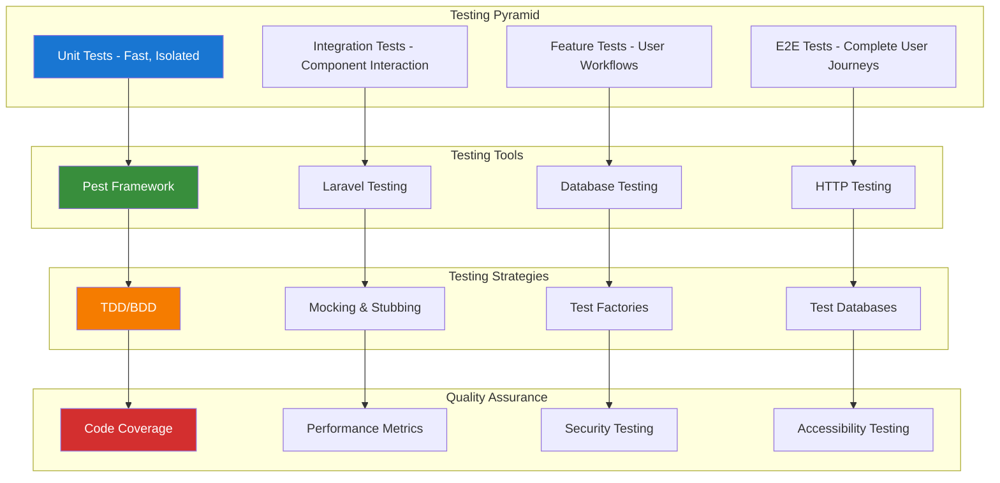

# Testing Documentation Index

## Overview

This directory contains comprehensive testing documentation for Laravel applications, focusing on modern testing practices, tools, and strategies for building robust, maintainable test suites.

## Testing Philosophy

Our testing approach emphasizes:

- **Test-Driven Development (TDD)**: Writing tests before implementation
- **Behavior-Driven Development (BDD)**: Testing user behavior and business requirements
- **Comprehensive Coverage**: Unit, integration, feature, and end-to-end testing
- **Performance Testing**: Ensuring application performance under load
- **Security Testing**: Validating security measures and vulnerability prevention

## Testing Tools & Frameworks

### Core Testing Framework
- **[Pest Testing Guide](010-pest-testing-guide.md)** - Modern PHP testing framework with elegant syntax and powerful features

### Testing Categories

#### Unit Testing
- Model testing and business logic validation
- Service class testing and dependency injection
- Utility function and helper testing
- Database query optimization testing

#### Integration Testing
- API endpoint testing and validation
- Database integration and migration testing
- Third-party service integration testing
- Cache and session integration testing

#### Feature Testing
- User workflow and journey testing
- Authentication and authorization testing
- Form submission and validation testing
- File upload and processing testing

#### Performance Testing
- Load testing and stress testing
- Database query performance testing
- Memory usage and optimization testing
- Response time and throughput testing

## Testing Architecture



## Testing Best Practices

### 1. Test Organization
- **Descriptive Test Names**: Use clear, descriptive test method names
- **Arrange-Act-Assert Pattern**: Structure tests with clear setup, execution, and verification
- **Test Isolation**: Ensure tests don't depend on each other
- **Test Data Management**: Use factories and seeders for consistent test data

### 2. Test Coverage
- **Aim for High Coverage**: Target 80%+ code coverage for critical business logic
- **Quality over Quantity**: Focus on meaningful tests rather than coverage metrics
- **Edge Case Testing**: Test boundary conditions and error scenarios
- **Regression Testing**: Maintain tests for previously fixed bugs

### 3. Performance Considerations
- **Fast Test Execution**: Keep unit tests under 100ms each
- **Database Optimization**: Use in-memory databases for faster testing
- **Parallel Testing**: Run tests in parallel when possible
- **Test Environment Optimization**: Optimize test environment configuration

### 4. Maintenance
- **Regular Test Review**: Regularly review and update test suites
- **Refactor Tests**: Keep tests clean and maintainable
- **Remove Obsolete Tests**: Remove tests for deprecated functionality
- **Documentation**: Document complex test scenarios and setup requirements

## Testing Workflow

### Development Workflow
1. **Write Failing Test**: Start with a failing test that describes the desired behavior
2. **Implement Feature**: Write minimal code to make the test pass
3. **Refactor**: Improve code quality while keeping tests green
4. **Add Edge Cases**: Test boundary conditions and error scenarios
5. **Integration Testing**: Verify component interactions work correctly

### Continuous Integration
1. **Automated Test Execution**: Run all tests on every commit
2. **Coverage Reporting**: Generate and track code coverage metrics
3. **Performance Monitoring**: Track test execution time and performance
4. **Quality Gates**: Prevent deployment if tests fail or coverage drops
5. **Notification System**: Alert team of test failures and coverage changes

## Testing Environment Setup

### Local Development
```bash
# Install testing dependencies
composer require --dev pestphp/pest
composer require --dev pestphp/pest-plugin-laravel
composer require --dev pestphp/pest-plugin-livewire

# Initialize Pest
./vendor/bin/pest --init

# Run tests
./vendor/bin/pest
```

### CI/CD Configuration
```yaml
# GitHub Actions example
name: Tests
on: [push, pull_request]
jobs:
  test:
    runs-on: ubuntu-latest
    steps:
      - uses: actions/checkout@v3
      - name: Setup PHP
        uses: shivammathur/setup-php@v2
        with:
          php-version: '8.2'
      - name: Install Dependencies
        run: composer install
      - name: Run Tests
        run: ./vendor/bin/pest --coverage
```

## Testing Documentation Structure

### Current Documentation
- **[Pest Testing Guide](010-pest-testing-guide.md)** - Comprehensive guide to modern PHP testing with Pest framework

### Planned Documentation
- **Database Testing Guide** - Testing database interactions, migrations, and data integrity
- **API Testing Guide** - Testing REST APIs, GraphQL endpoints, and API authentication
- **Frontend Testing Guide** - Testing Livewire components, JavaScript interactions, and UI behavior
- **Performance Testing Guide** - Load testing, stress testing, and performance optimization
- **Security Testing Guide** - Testing authentication, authorization, and security vulnerabilities

## Integration with Development Tools

### IDE Integration
- **PHPStorm**: Built-in test runner and debugging support
- **VS Code**: Pest extension for test execution and debugging
- **Vim/Neovim**: Pest plugins for terminal-based development

### Debugging Tools
- **Xdebug**: Step-through debugging for complex test scenarios
- **Laravel Debugbar**: Performance profiling during test execution
- **Ray**: Advanced debugging and inspection tools

### Code Quality Tools
- **PHPStan/Larastan**: Static analysis for test code quality
- **PHP CS Fixer**: Code style consistency in test files
- **Rector**: Automated refactoring for test modernization

## Resources and References

### Official Documentation
- [Pest PHP Documentation](https://pestphp.com/)
- [Laravel Testing Documentation](https://laravel.com/docs/testing)
- [PHPUnit Documentation](https://phpunit.de/documentation.html)

### Community Resources
- [Laravel Testing Examples](https://github.com/laravel/framework/tree/master/tests)
- [Pest Plugin Ecosystem](https://pestphp.com/docs/plugins)
- [Testing Best Practices](https://martinfowler.com/testing/)

### Books and Guides
- "Test Driven Development: By Example" by Kent Beck
- "Growing Object-Oriented Software, Guided by Tests" by Steve Freeman
- "The Art of Unit Testing" by Roy Osherove

---

**Next Steps:**
- Review the [Pest Testing Guide](010-pest-testing-guide.md) for comprehensive testing implementation
- Explore development tools documentation for debugging and code quality
- Check package-specific testing strategies in individual guides

**Related Documentation:**
- [Development Tools Index](../development/000-development-index.md)
- [Package Documentation Index](../000-packages-index.md)
- [Main Chinook Index](../../000-chinook-index.md)
