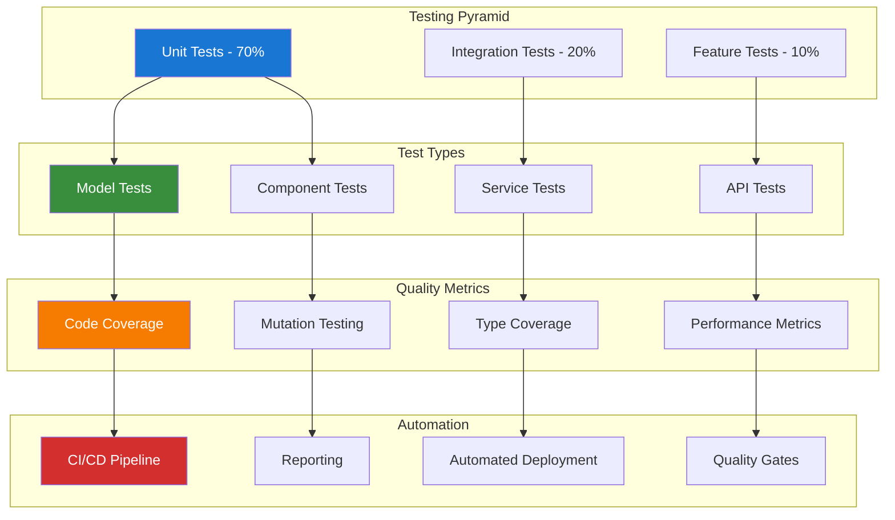

# Modern Testing with Pest Guide

## Table of Contents

- [Overview](#overview)
- [Installation & Configuration](#installation--configuration)
- [Test Architecture](#test-architecture)
- [Plugin Ecosystem](#plugin-ecosystem)
- [Advanced Testing Patterns](#advanced-testing-patterns)
- [Performance Testing](#performance-testing)
- [Type Coverage](#type-coverage)
- [CI/CD Integration](#cicd-integration)
- [Database Testing](#database-testing)
- [API Testing](#api-testing)
- [Livewire Testing](#livewire-testing)
- [Best Practices](#best-practices)

## Overview

Pest is a modern PHP testing framework that provides an elegant and expressive syntax for writing tests. This guide demonstrates how to implement comprehensive testing strategies using Pest with Laravel, including advanced patterns, performance testing, and CI/CD integration.

### Key Features

- **Elegant Syntax**: Clean, readable test syntax with minimal boilerplate
- **Laravel Integration**: Seamless integration with Laravel testing features
- **Plugin Ecosystem**: Rich ecosystem of plugins for specialized testing
- **Performance Testing**: Built-in performance and memory testing capabilities
- **Type Coverage**: Static analysis integration for type safety
- **Parallel Testing**: Fast test execution with parallel processing

### Testing Philosophy



## Installation & Configuration

### Package Installation

```bash
# Install Pest and Laravel plugin
composer require --dev pestphp/pest
composer require --dev pestphp/pest-plugin-laravel

# Install additional plugins
composer require --dev pestphp/pest-plugin-livewire
composer require --dev pestphp/pest-plugin-faker
composer require --dev pestphp/pest-plugin-type-coverage
composer require --dev pestphp/pest-plugin-watch

# Initialize Pest
./vendor/bin/pest --init
```

### Configuration Setup

```php
<?php

// tests/Pest.php
use Illuminate\Foundation\Testing\RefreshDatabase;use Illuminate\Foundation\Testing\WithFaker;

/*
|--------------------------------------------------------------------------
| Test Case
|--------------------------------------------------------------------------
*/

uses(old\TestCase::class)->in('Feature');
uses(old\TestCase::class, RefreshDatabase::class)->in('Feature/Database');
uses(old\TestCase::class, WithFaker::class)->in('Feature/Faker');

/*
|--------------------------------------------------------------------------
| Expectations
|--------------------------------------------------------------------------
*/

expect()->extend('toBeOne', function () {
    return $this->toBe(1);
});

expect()->extend('toBeValidEmail', function () {
    return $this->toMatch('/^[^\s@]+@[^\s@]+\.[^\s@]+$/');
});

expect()->extend('toHaveValidTimestamps', function () {
    return $this->toHaveKeys(['created_at', 'updated_at']);
});

/*
|--------------------------------------------------------------------------
| Functions
|--------------------------------------------------------------------------
*/

function createUser(array $attributes = []): \App\Models\User
{
    return \App\Models\User::factory()->create($attributes);
}

function createTrack(array $attributes = []): \App\Models\Track
{
    return \App\Models\Track::factory()->create($attributes);
}

function createAlbum(array $attributes = []): \App\Models\Album
{
    return \App\Models\Album::factory()->create($attributes);
}

function actingAsUser(\App\Models\User $user = null): \Illuminate\Testing\TestResponse
{
    return test()->actingAs($user ?? createUser());
}

function actingAsAdmin(): \Illuminate\Testing\TestResponse
{
    $admin = createUser();
    $admin->assignRole('admin');
    return test()->actingAs($admin);
}
```

### Pest Configuration File

```php
<?php

// phpunit.xml or pest.xml
return [
    'testdox' => true,
    'colors' => true,
    'verbose' => true,
    'stop_on_failure' => false,
    'coverage' => [
        'include' => [
            'app/',
        ],
        'exclude' => [
            'app/Console/Kernel.php',
            'app/Exceptions/Handler.php',
            'app/Http/Middleware/',
        ],
        'reports' => [
            'html' => 'coverage-html',
            'clover' => 'coverage.xml',
        ],
    ],
    'parallel' => [
        'processes' => 4,
    ],
    'type_coverage' => [
        'min' => 90,
    ],
];
```

## Test Architecture

### Unit Testing

```php
<?php

// tests/Unit/Models/TrackTest.php
use App\Models\Track;
use App\Models\Album;
use App\Models\Genre;

describe('Track Model', function () {
    it('can be created with valid attributes', function () {
        $track = Track::factory()->create([
            'name' => 'Test Track',
            'milliseconds' => 180000,
            'unit_price' => 0.99,
        ]);

        expect($track)
            ->name->toBe('Test Track')
            ->milliseconds->toBe(180000)
            ->unit_price->toBe(0.99)
            ->toHaveValidTimestamps();
    });

    it('belongs to an album', function () {
        $album = Album::factory()->create();
        $track = Track::factory()->create(['album_id' => $album->id]);

        expect($track->album)
            ->toBeInstanceOf(Album::class)
            ->id->toBe($album->id);
    });

    it('can have a genre', function () {
        $genre = Genre::factory()->create();
        $track = Track::factory()->create(['genre_id' => $genre->id]);

        expect($track->genre)
            ->toBeInstanceOf(Genre::class)
            ->id->toBe($genre->id);
    });

    it('calculates duration correctly', function () {
        $track = Track::factory()->create(['milliseconds' => 180000]); // 3 minutes

        expect($track->formatted_duration)->toBe('3:00');
    });

    it('validates required fields', function () {
        expect(fn() => Track::create([]))
            ->toThrow(\Illuminate\Database\QueryException::class);
    });
});

describe('Track Scopes', function () {
    beforeEach(function () {
        $this->genre = Genre::factory()->create(['name' => 'Rock']);
        $this->tracks = Track::factory()->count(5)->create(['genre_id' => $this->genre->id]);
        Track::factory()->count(3)->create(); // Different genre
    });

    it('can filter by genre', function () {
        $rockTracks = Track::byGenre($this->genre->id)->get();

        expect($rockTracks)->toHaveCount(5);
    });

    it('can filter by duration range', function () {
        Track::factory()->create(['milliseconds' => 120000]); // 2 minutes
        Track::factory()->create(['milliseconds' => 300000]); // 5 minutes

        $mediumTracks = Track::durationBetween(150000, 250000)->get();

        expect($mediumTracks)->toHaveCount(5); // Original tracks in range
    });
});
```

### Service Testing

```php
<?php

// tests/Unit/Services/MusicRecommendationServiceTest.php
use App\Services\MusicRecommendationService;
use App\Models\User;
use App\Models\Track;
use App\Models\Genre;

describe('Music Recommendation Service', function () {
    beforeEach(function () {
        $this->service = app(MusicRecommendationService::class);
        $this->user = createUser();
        
        // Create test data
        $this->rockGenre = Genre::factory()->create(['name' => 'Rock']);
        $this->jazzGenre = Genre::factory()->create(['name' => 'Jazz']);
        
        $this->rockTracks = Track::factory()->count(10)->create(['genre_id' => $this->rockGenre->id]);
        $this->jazzTracks = Track::factory()->count(5)->create(['genre_id' => $this->jazzGenre->id]);
    });

    it('recommends tracks based on user listening history', function () {
        // Simulate user listening to rock tracks
        $this->user->listenedTracks()->attach($this->rockTracks->take(3)->pluck('id'));

        $recommendations = $this->service->getRecommendations($this->user, 5);

        expect($recommendations)
            ->toHaveCount(5)
            ->each->toBeInstanceOf(Track::class);

        // Should recommend more rock tracks
        $rockRecommendations = $recommendations->filter(fn($track) => $track->genre_id === $this->rockGenre->id);
        expect($rockRecommendations)->toHaveCountGreaterThan(2);
    });

    it('handles users with no listening history', function () {
        $recommendations = $this->service->getRecommendations($this->user, 5);

        expect($recommendations)
            ->toHaveCount(5)
            ->each->toBeInstanceOf(Track::class);
    });

    it('excludes already listened tracks', function () {
        $listenedTrack = $this->rockTracks->first();
        $this->user->listenedTracks()->attach($listenedTrack->id);

        $recommendations = $this->service->getRecommendations($this->user, 10);

        expect($recommendations->pluck('id'))->not->toContain($listenedTrack->id);
    });

    it('caches recommendations for performance', function () {
        $this->service->getRecommendations($this->user, 5);

        // Second call should use cache
        $startTime = microtime(true);
        $this->service->getRecommendations($this->user, 5);
        $executionTime = (microtime(true) - $startTime) * 1000;

        expect($executionTime)->toBeLessThan(10); // Should be very fast due to caching
    });
});
```

## Advanced Testing Patterns

### Data Providers and Parameterized Tests

```php
<?php

// tests/Unit/Models/TrackTest.php
use App\Models\Track;

describe('Track Model Validation', function () {
    it('validates track duration formats', function (string $duration, bool $isValid) {
        $track = Track::factory()->make(['milliseconds' => $duration]);

        expect($track->isValid())->toBe($isValid);
    })->with([
        ['180000', true],   // 3 minutes
        ['240000', true],   // 4 minutes
        ['-1000', false],   // Negative duration
        ['0', false],       // Zero duration
        ['abc', false],     // Invalid format
    ]);
});
```

### Custom Expectations

```php
<?php

// tests/Pest.php
expect()->extend('toBeValidTrack', function () {
    return $this->toHaveKey('name')
        ->and($this->value['name'])->not->toBeEmpty()
        ->and($this->value['milliseconds'])->toBeGreaterThan(0)
        ->and($this->value['album_id'])->toBeInt();
});

// Usage in tests
it('creates valid track data', function () {
    $track = Track::factory()->make()->toArray();

    expect($track)->toBeValidTrack();
});
```

## Type Coverage

### Static Analysis Integration

```php
<?php

// tests/Static/TypeCoverageTest.php
use PHPStan\Testing\TypeInferenceTestCase;

describe('Type Coverage Analysis', function () {
    it('ensures model relationships are properly typed', function () {
        $track = new Track();

        // PHPStan should infer correct return types
        expect($track->album())->toBeInstanceOf(BelongsTo::class);
        expect($track->playlists())->toBeInstanceOf(BelongsToMany::class);
    });

    it('validates service method return types', function () {
        $service = new TrackService();

        expect($service->findPopularTracks(10))->toBeInstanceOf(Collection::class);
        expect($service->calculateDuration(123))->toBeString();
    });
});
```

## Plugin Ecosystem

### Livewire Testing Plugin

```php
<?php

// tests/Feature/Livewire/TrackPlayerTest.php
use App\Livewire\TrackPlayer;
use App\Models\Track;
use Livewire\Livewire;

describe('Track Player Component', function () {
    beforeEach(function () {
        $this->track = createTrack(['name' => 'Test Track']);
    });

    it('renders track information', function () {
        Livewire::test(TrackPlayer::class, ['track' => $this->track])
            ->assertSee('Test Track')
            ->assertSee($this->track->album->title)
            ->assertSee($this->track->album->artist->name);
    });

    it('can play and pause track', function () {
        Livewire::test(TrackPlayer::class, ['track' => $this->track])
            ->call('play')
            ->assertSet('isPlaying', true)
            ->assertDispatched('track-started')
            ->call('pause')
            ->assertSet('isPlaying', false)
            ->assertDispatched('track-paused');
    });

    it('updates progress when seeking', function () {
        Livewire::test(TrackPlayer::class, ['track' => $this->track])
            ->call('seek', 50)
            ->assertSet('progress', 50)
            ->assertDispatched('track-seeked', ['position' => 50]);
    });
});
```

## Performance Testing

### Memory and Time Testing

```php
<?php

// tests/Performance/DatabasePerformanceTest.php
use App\Models\Track;
use App\Models\Album;

describe('Database Performance', function () {
    it('loads tracks efficiently', function () {
        Album::factory()->count(10)->create();
        Track::factory()->count(1000)->create();

        $startTime = microtime(true);
        $startMemory = memory_get_usage();

        $tracks = Track::with(['album', 'genre'])->limit(100)->get();

        $executionTime = (microtime(true) - $startTime) * 1000;
        $memoryUsed = memory_get_usage() - $startMemory;

        expect($tracks)->toHaveCount(100);
        expect($executionTime)->toBeLessThan(100); // Less than 100ms
        expect($memoryUsed)->toBeLessThan(10 * 1024 * 1024); // Less than 10MB
    });

    it('handles large dataset queries efficiently', function () {
        Track::factory()->count(10000)->create();

        $count = Track::count();

        expect($count)->toBe(10000);
    });
});
```

## Database Testing

### Migration Testing

```php
<?php

// tests/Feature/Database/MigrationTest.php
use Illuminate\Support\Facades\Schema;

describe('Database Migrations', function () {
    it('creates tracks table with correct structure', function () {
        expect(Schema::hasTable('tracks'))->toBeTrue();

        expect(Schema::hasColumns('tracks', [
            'id', 'name', 'album_id', 'media_type_id', 'genre_id',
            'composer', 'milliseconds', 'bytes', 'unit_price',
            'created_at', 'updated_at'
        ]))->toBeTrue();
    });

    it('has proper foreign key constraints', function () {
        $track = createTrack();

        // Should not be able to delete referenced album
        expect(fn() => $track->album->delete())
            ->toThrow(\Illuminate\Database\QueryException::class);
    });
});
```

## API Testing

### RESTful API Testing

```php
<?php

// tests/Feature/Api/TracksApiTest.php
use App\Models\Track;
use App\Models\User;

describe('Tracks API', function () {
    beforeEach(function () {
        $this->user = User::factory()->create();
        $this->track = createTrack();
    });

    it('returns track list with pagination', function () {
        $this->actingAs($this->user)
            ->getJson('/api/tracks')
            ->assertOk()
            ->assertJsonStructure([
                'data' => [
                    '*' => ['id', 'name', 'album', 'artist', 'duration']
                ],
                'meta' => ['current_page', 'total', 'per_page']
            ]);
    });

    it('creates new track with validation', function () {
        $trackData = [
            'name' => 'New Track',
            'album_id' => $this->track->album_id,
            'milliseconds' => 180000,
            'unit_price' => 0.99
        ];

        $this->actingAs($this->user)
            ->postJson('/api/tracks', $trackData)
            ->assertCreated()
            ->assertJsonPath('data.name', 'New Track');
    });
});
```

## Livewire Testing

### Component Testing Patterns

```php
<?php

// tests/Feature/Livewire/TrackSearchTest.php
use App\Livewire\TrackSearch;
use App\Models\Track;
use Livewire\Livewire;

describe('Track Search Component', function () {
    beforeEach(function () {
        $this->tracks = collect([
            createTrack(['name' => 'Rock Song']),
            createTrack(['name' => 'Jazz Melody']),
            createTrack(['name' => 'Classical Symphony'])
        ]);
    });

    it('filters tracks by search term', function () {
        Livewire::test(TrackSearch::class)
            ->set('search', 'Rock')
            ->assertSee('Rock Song')
            ->assertDontSee('Jazz Melody')
            ->assertDontSee('Classical Symphony');
    });

    it('shows all tracks when search is empty', function () {
        Livewire::test(TrackSearch::class)
            ->set('search', '')
            ->assertSee('Rock Song')
            ->assertSee('Jazz Melody')
            ->assertSee('Classical Symphony');
    });

    it('handles real-time search updates', function () {
        Livewire::test(TrackSearch::class)
            ->set('search', 'Jazz')
            ->assertSee('Jazz Melody')
            ->set('search', 'Classical')
            ->assertSee('Classical Symphony')
            ->assertDontSee('Jazz Melody');
    });
});
```

## CI/CD Integration

### GitHub Actions Configuration

```yaml
# .github/workflows/tests.yml
name: Tests

on:
  push:
    branches: [ main, develop ]
  pull_request:
    branches: [ main ]

jobs:
  test:
    runs-on: ubuntu-latest

    steps:
    - uses: actions/checkout@v4

    - name: Setup PHP
      uses: shivammathur/setup-php@v2
      with:
        php-version: 8.2
        extensions: dom, curl, libxml, mbstring, zip, pcntl, pdo, sqlite, pdo_sqlite
        coverage: xdebug

    - name: Install dependencies
      run: composer install --prefer-dist --no-progress

    - name: Copy environment file
      run: cp .env.example .env

    - name: Generate application key
      run: php artisan key:generate

    - name: Create SQLite database
      run: touch database/database.sqlite

    - name: Run migrations
      run: php artisan migrate --force

    - name: Run tests with coverage
      run: ./vendor/bin/pest --coverage --coverage-clover=coverage.xml

    - name: Upload coverage to Codecov
      uses: codecov/codecov-action@v3
      with:
        file: ./coverage.xml
```

## Best Practices

### Implementation Guidelines

1. **Test Organization**
   - Use descriptive test names that explain behavior
   - Group related tests with `describe()` blocks
   - Use `beforeEach()` for common setup
   - Keep tests focused and isolated

2. **Performance Optimization**
   - Use `RefreshDatabase` trait for database tests
   - Implement parallel testing for faster execution
   - Cache test data when appropriate
   - Monitor test execution time

3. **Maintainability**
   - Create helper functions for common operations
   - Use factories for test data generation
   - Keep tests simple and readable
   - Regular refactoring of test code

This comprehensive Pest testing guide provides everything needed to implement modern, efficient testing strategies in Laravel applications, with focus on performance, maintainability, and CI/CD integration.

---

**Next Steps:**

- Explore [Development Debugging Tools Guide](../development/010-debugbar-guide.md) for debugging and profiling
- Review [Code Quality and Formatting Guide](../development/020-pint-code-quality-guide.md) for code standards
- Check [Enhanced Spatie ActivityLog Guide](../150-spatie-activitylog-guide.md) for audit logging testing patterns
