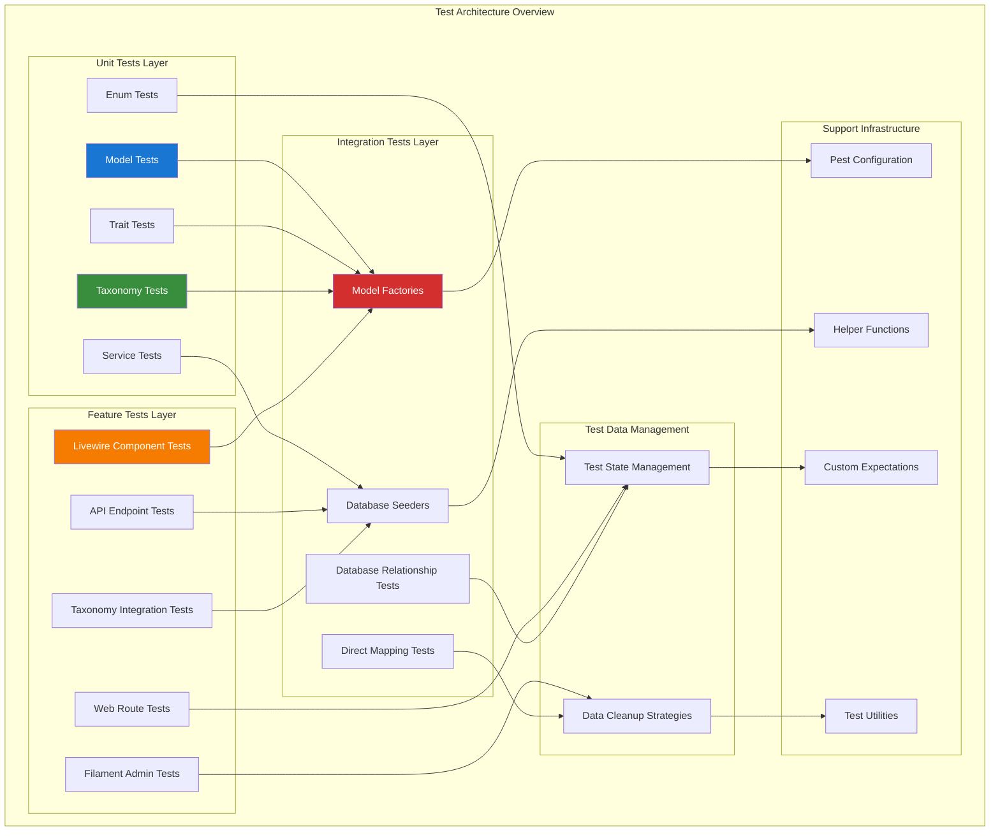
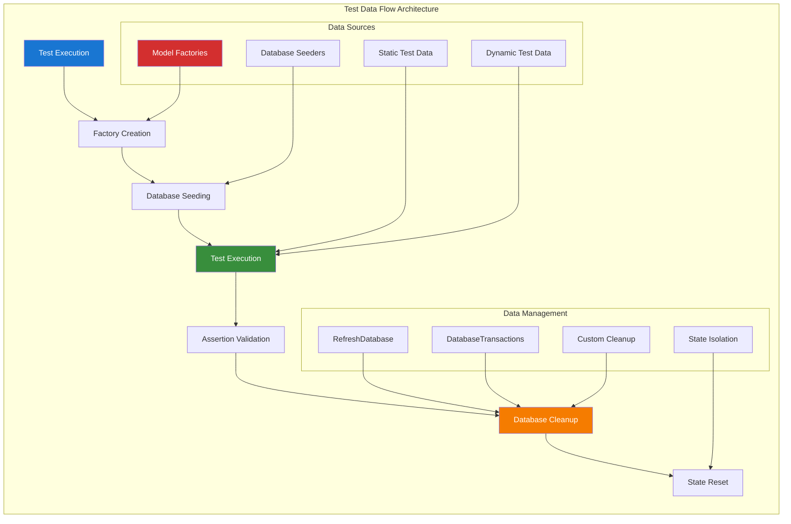
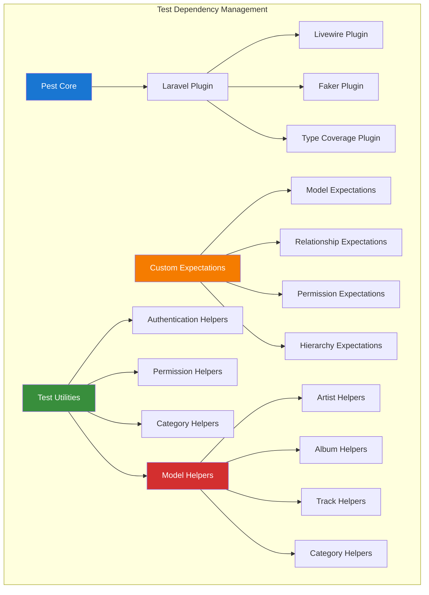
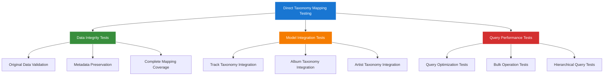

# Test Architecture Overview

## Table of Contents

- [Overview](#overview)
- [Test Architecture Diagram](#test-architecture-diagram)
- [Testing Layers](#testing-layers)
- [Test Data Flow](#test-data-flow)
- [Dependency Management](#dependency-management)
- [Test Environment Configuration](#test-environment-configuration)
- [Comprehensive Testing Strategy](#comprehensive-testing-strategy)
- [Performance Considerations](#performance-considerations)
- [Quality Metrics](#quality-metrics)

## Overview

The Chinook testing architecture follows a comprehensive three-layer approach designed for Laravel 12 applications with complex hierarchical data structures, polymorphic relationships, and RBAC systems. This architecture ensures thorough coverage while maintaining performance and maintainability.

### Key Architectural Principles

- **Separation of Concerns**: Clear boundaries between unit, feature, and integration tests
- **Test Isolation**: Each test runs independently with clean database state
- **Performance Optimization**: SQLite WAL journal mode for fast test execution
- **Single Taxonomy Testing**: Comprehensive testing for direct genre-to-taxonomy mapping
- **Trait-Driven Testing**: Specialized testing for all custom traits (HasTaxonomies, HasSlug, etc.)
- **Data Integrity Focus**: Validation of direct mapping from chinook.sql without enhancement
- **RBAC Integration**: Comprehensive permission and role testing with spatie/laravel-permission
- **Modern Laravel 12**: Testing patterns using cast() method and current framework features

## Test Architecture Diagram



## Testing Layers

### Unit Tests Layer

**Purpose**: Test individual components in isolation

**Components**:
- **Model Tests**: Validation, relationships, scopes, accessors/mutators
- **Trait Tests**: HasSecondaryUniqueKey, HasSlug, Categorizable, HasTags, Userstamps, SoftDeletes
- **Service Tests**: Business logic, data transformations, external integrations
- **Enum Tests**: CategoryType, SecondaryKeyType, role hierarchies

**Characteristics**:
- Fast execution (< 100ms per test)
- No external dependencies
- Isolated database transactions
- Comprehensive edge case coverage

### Feature Tests Layer

**Purpose**: Test application features from user perspective

**Components**:
- **API Endpoint Tests**: CRUD operations, authentication, authorization
- **Web Route Tests**: User workflows, form submissions, redirects
- **Filament Admin Tests**: Resource management, permissions, bulk operations
- **Livewire Component Tests**: Functional-based components, SPA behavior

**Characteristics**:
- Medium execution time (100-500ms per test)
- Full application stack
- Database state management
- User interaction simulation

### Integration Tests Layer

**Purpose**: Test system interactions and complex workflows

**Components**:
- **Database Relationship Tests**: Polymorphic relationships, foreign key constraints
- **Hierarchical Data Tests**: Closure table operations, adjacency list consistency
- **Performance Tests**: Query optimization, memory usage, load testing
- **End-to-End Workflow Tests**: Complete business processes

**Characteristics**:
- Longer execution time (500ms+ per test)
- Multiple system components
- Real data scenarios
- Performance benchmarking

## Test Data Flow



## Dependency Management

### Test Dependencies Hierarchy



### Dependency Injection Strategy

- **Service Container**: Automatic dependency resolution for test classes
- **Mock Objects**: Isolated testing with controlled dependencies
- **Factory Dependencies**: Automatic relationship creation in factories
- **Trait Dependencies**: Shared functionality across test classes

## Test Environment Configuration

### SQLite Optimization for Testing

```php
// config/database.php - Testing configuration
'testing' => [
    'driver' => 'sqlite',
    'database' => ':memory:',
    'prefix' => '',
    'foreign_key_constraints' => true,
    'journal_mode' => 'WAL',
    'synchronous' => 'NORMAL',
    'cache_size' => 10000,
    'temp_store' => 'MEMORY',
],
```

### Pest Configuration

```php
// tests/Pest.php
uses(old\TestCase::class)->in('Feature');
uses(old\TestCase::class, RefreshDatabase::class)->in('Feature/Database');
uses(old\TestCase::class, DatabaseTransactions::class)->in('Unit');

// Performance testing configuration
uses(old\TestCase::class, RefreshDatabase::class)->in('Integration/Performance');
```

## Comprehensive Testing Strategy

The Chinook testing suite implements a comprehensive testing strategy focused on direct taxonomy mapping and modern Laravel 12 patterns using Pest PHP framework.

### Direct Taxonomy Mapping Testing



### Testing Strategy Components

1. **Direct Mapping Validation**
   - Verify exact mapping of 25 original genres from chinook.sql
   - Validate metadata preservation with original IDs
   - Ensure complete coverage of all original data

2. **Model Integration Testing**
   - Test HasTaxonomies trait implementation
   - Validate polymorphic relationships
   - Verify taxonomy type filtering

3. **Hierarchical Testing**
   - Test parent-child taxonomy relationships
   - Validate nested set operations
   - Verify efficient hierarchical queries

4. **Performance Testing**
   - Benchmark taxonomy query performance
   - Test bulk taxonomy operations
   - Validate SQLite optimization with taxonomies

### Pest PHP Testing Patterns

```php
<?php
// Example of comprehensive taxonomy testing pattern
describe('Taxonomy System Testing', function () {
    it('validates direct mapping from chinook.sql', function () {
        // Test exact mapping of original genres
    });

    it('preserves original IDs in metadata', function () {
        // Test metadata preservation
    });

    it('supports polymorphic relationships', function () {
        // Test taxonomy relationships with different models
    });

    it('provides efficient query patterns', function () {
        // Test query performance
    });
});
```

## Performance Considerations

### Test Execution Optimization

- **Parallel Testing**: Run tests in parallel for faster execution
- **Database Optimization**: SQLite WAL mode for improved performance
- **Factory Optimization**: Efficient data generation strategies
- **Memory Management**: Proper cleanup and garbage collection

### Performance Benchmarks

- **Unit Tests**: < 100ms per test
- **Feature Tests**: 100-500ms per test
- **Integration Tests**: 500ms-2s per test
- **Performance Tests**: Variable based on benchmarking requirements

## Quality Metrics

### Coverage Targets

- **Code Coverage**: Minimum 95% line coverage across all components
- **Type Coverage**: Minimum 95% type safety with static analysis
- **Mutation Testing**: Minimum 85% mutation score for critical paths
- **Performance Regression**: < 5% performance degradation
- **Taxonomy System**: 100% coverage of direct genre-to-taxonomy mapping
- **RBAC Testing**: Complete coverage of all permission and role combinations
- **Model Testing**: 100% coverage of all model relationships and traits
- **API Testing**: Complete coverage of all API endpoints and response formats

### Quality Gates

- All tests must pass before deployment
- Coverage thresholds must be met
- Performance benchmarks must be maintained
- Security tests must pass

---

**Navigation:**
- **Previous:** [Testing Index](000-testing-index.md)
- **Next:** [Unit Testing Guide](020-unit-testing-guide.md)
- **Up:** [Testing Documentation](000-testing-index.md)
