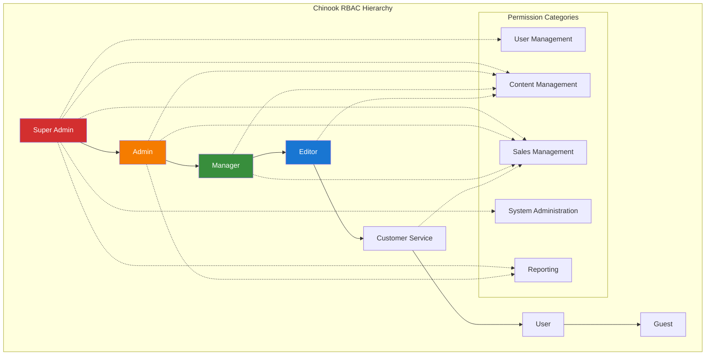

# RBAC Testing Guide

## Table of Contents

- [Overview](#overview)
- [Role Hierarchy Testing](#role-hierarchy-testing)
- [Permission Testing](#permission-testing)
- [Authorization Workflow Testing](#authorization-workflow-testing)
- [Model-Level Permission Testing](#model-level-permission-testing)
- [API Authorization Testing](#api-authorization-testing)
- [Filament Admin Authorization](#filament-admin-authorization)
- [Test Organization](#test-organization)
- [Best Practices](#best-practices)

## Overview

Role-Based Access Control (RBAC) testing ensures that the spatie/laravel-permission system correctly enforces access controls throughout the Chinook application. This guide covers comprehensive testing strategies for hierarchical role structures, granular permissions, and authorization workflows using Pest PHP framework.

### RBAC Testing Principles

- **Hierarchical Validation**: Test role inheritance and permission cascading
- **Granular Control**: Verify specific permission enforcement
- **Context Awareness**: Test permissions in different application contexts
- **Security First**: Ensure unauthorized access is properly blocked

### Chinook Role Hierarchy



## Role Hierarchy Testing

### Role Creation and Assignment Testing

```php
<?php

// tests/Unit/RBAC/RoleHierarchyTest.php
use App\Models\User;
use Spatie\Permission\Models\Role;
use Spatie\Permission\Models\Permission;

describe('Role Hierarchy Management', function () {
    beforeEach(function () {
        // Create role hierarchy
        $this->superAdmin = Role::create(['name' => 'super-admin']);
        $this->admin = Role::create(['name' => 'admin']);
        $this->manager = Role::create(['name' => 'manager']);
        $this->editor = Role::create(['name' => 'editor']);
        $this->customerService = Role::create(['name' => 'customer-service']);
        $this->user = Role::create(['name' => 'user']);
        $this->guest = Role::create(['name' => 'guest']);
    });

    describe('Role Assignment', function () {
        it('assigns roles to users correctly', function () {
            $user = User::factory()->create();
            
            $user->assignRole('admin');
            
            expect($user->hasRole('admin'))->toBeTrue();
            expect($user->roles)->toHaveCount(1);
            expect($user->roles->first()->name)->toBe('admin');
        });

        it('allows multiple role assignment', function () {
            $user = User::factory()->create();
            
            $user->assignRole(['editor', 'customer-service']);
            
            expect($user->hasRole('editor'))->toBeTrue();
            expect($user->hasRole('customer-service'))->toBeTrue();
            expect($user->roles)->toHaveCount(2);
        });

        it('prevents duplicate role assignment', function () {
            $user = User::factory()->create();
            
            $user->assignRole('admin');
            $user->assignRole('admin'); // Duplicate assignment
            
            expect($user->roles)->toHaveCount(1);
        });

        it('removes roles correctly', function () {
            $user = User::factory()->create();
            $user->assignRole(['admin', 'editor']);
            
            $user->removeRole('admin');
            
            expect($user->hasRole('admin'))->toBeFalse();
            expect($user->hasRole('editor'))->toBeTrue();
            expect($user->roles)->toHaveCount(1);
        });
    });

    describe('Role Hierarchy Validation', function () {
        it('validates role hierarchy levels', function () {
            $superAdminUser = User::factory()->create();
            $adminUser = User::factory()->create();
            $managerUser = User::factory()->create();
            
            $superAdminUser->assignRole('super-admin');
            $adminUser->assignRole('admin');
            $managerUser->assignRole('manager');
            
            // Super admin should have highest authority
            expect($superAdminUser->hasRole('super-admin'))->toBeTrue();
            expect($adminUser->hasRole('super-admin'))->toBeFalse();
            expect($managerUser->hasRole('super-admin'))->toBeFalse();
        });

        it('enforces role exclusivity for hierarchical roles', function () {
            $user = User::factory()->create();
            
            // User should not have both admin and user roles simultaneously
            $user->assignRole('admin');
            
            expect(fn() => $user->assignRole('user'))
                ->not->toThrow();
            
            // But we can validate business logic separately
            expect($user->hasRole('admin'))->toBeTrue();
            expect($user->hasRole('user'))->toBeTrue();
        });
    });

    describe('Role-Based Queries', function () {
        it('finds users by role', function () {
            $admin1 = User::factory()->create();
            $admin2 = User::factory()->create();
            $editor = User::factory()->create();
            
            $admin1->assignRole('admin');
            $admin2->assignRole('admin');
            $editor->assignRole('editor');
            
            $admins = User::role('admin')->get();
            
            expect($admins)->toHaveCount(2);
            expect($admins->pluck('id'))->toContain($admin1->id, $admin2->id);
            expect($admins->pluck('id'))->not->toContain($editor->id);
        });

        it('finds users with any of multiple roles', function () {
            $admin = User::factory()->create();
            $editor = User::factory()->create();
            $user = User::factory()->create();
            
            $admin->assignRole('admin');
            $editor->assignRole('editor');
            $user->assignRole('user');
            
            $staffUsers = User::role(['admin', 'editor'])->get();
            
            expect($staffUsers)->toHaveCount(2);
            expect($staffUsers->pluck('id'))->toContain($admin->id, $editor->id);
            expect($staffUsers->pluck('id'))->not->toContain($user->id);
        });
    });
});
```

### Permission Structure Testing

```php
<?php

// tests/Unit/RBAC/PermissionStructureTest.php
use Spatie\Permission\Models\Permission;
use Spatie\Permission\Models\Role;

describe('Permission Structure', function () {
    beforeEach(function () {
        $this->createPermissionStructure();
    });

    describe('Permission Categories', function () {
        it('creates user management permissions', function () {
            $permissions = [
                'users.view',
                'users.create',
                'users.edit',
                'users.delete',
                'users.manage-roles',
                'users.manage-permissions'
            ];

            foreach ($permissions as $permission) {
                expect(Permission::where('name', $permission)->exists())->toBeTrue();
            }
        });

        it('creates content management permissions', function () {
            $permissions = [
                'artists.view',
                'artists.create',
                'artists.edit',
                'artists.delete',
                'albums.view',
                'albums.create',
                'albums.edit',
                'albums.delete',
                'tracks.view',
                'tracks.create',
                'tracks.edit',
                'tracks.delete',
                'categories.view',
                'categories.create',
                'categories.edit',
                'categories.delete',
                'categories.manage-hierarchy'
            ];

            foreach ($permissions as $permission) {
                expect(Permission::where('name', $permission)->exists())->toBeTrue();
            }
        });

        it('creates sales management permissions', function () {
            $permissions = [
                'invoices.view',
                'invoices.create',
                'invoices.edit',
                'invoices.delete',
                'customers.view',
                'customers.create',
                'customers.edit',
                'customers.delete',
                'reports.sales',
                'reports.customers'
            ];

            foreach ($permissions as $permission) {
                expect(Permission::where('name', $permission)->exists())->toBeTrue();
            }
        });
    });

    describe('Role Permission Assignment', function () {
        it('assigns correct permissions to super admin', function () {
            $superAdmin = Role::findByName('super-admin');
            $allPermissions = Permission::all();
            
            $superAdmin->givePermissionTo($allPermissions);
            
            expect($superAdmin->permissions)->toHaveCount($allPermissions->count());
            expect($superAdmin->hasPermissionTo('users.manage-roles'))->toBeTrue();
            expect($superAdmin->hasPermissionTo('system.backup'))->toBeTrue();
        });

        it('assigns limited permissions to editor', function () {
            $editor = Role::findByName('editor');
            $editorPermissions = [
                'artists.view', 'artists.create', 'artists.edit',
                'albums.view', 'albums.create', 'albums.edit',
                'tracks.view', 'tracks.create', 'tracks.edit',
                'categories.view', 'categories.create', 'categories.edit'
            ];
            
            $editor->givePermissionTo($editorPermissions);
            
            expect($editor->hasPermissionTo('artists.edit'))->toBeTrue();
            expect($editor->hasPermissionTo('artists.delete'))->toBeFalse();
            expect($editor->hasPermissionTo('users.view'))->toBeFalse();
        });
    });

    private function createPermissionStructure(): void
    {
        // Create roles
        Role::create(['name' => 'super-admin']);
        Role::create(['name' => 'admin']);
        Role::create(['name' => 'manager']);
        Role::create(['name' => 'editor']);
        Role::create(['name' => 'customer-service']);
        Role::create(['name' => 'user']);
        Role::create(['name' => 'guest']);

        // Create permissions
        $permissions = [
            // User management
            'users.view', 'users.create', 'users.edit', 'users.delete',
            'users.manage-roles', 'users.manage-permissions',
            
            // Content management
            'artists.view', 'artists.create', 'artists.edit', 'artists.delete',
            'albums.view', 'albums.create', 'albums.edit', 'albums.delete',
            'tracks.view', 'tracks.create', 'tracks.edit', 'tracks.delete',
            'categories.view', 'categories.create', 'categories.edit', 'categories.delete',
            'categories.manage-hierarchy',
            
            // Sales management
            'invoices.view', 'invoices.create', 'invoices.edit', 'invoices.delete',
            'customers.view', 'customers.create', 'customers.edit', 'customers.delete',
            'reports.sales', 'reports.customers',
            
            // System administration
            'system.backup', 'system.maintenance', 'system.settings'
        ];

        foreach ($permissions as $permission) {
            Permission::create(['name' => $permission]);
        }
    }
});
```

## Permission Testing

### Direct Permission Testing

```php
<?php

// tests/Unit/RBAC/PermissionTest.php
use App\Models\User;
use Spatie\Permission\Models\Permission;

describe('Direct Permission Management', function () {
    beforeEach(function () {
        $this->user = User::factory()->create();
        $this->permission = Permission::create(['name' => 'edit-articles']);
    });

    describe('Permission Assignment', function () {
        it('assigns permission directly to user', function () {
            $this->user->givePermissionTo('edit-articles');

            expect($this->user->hasPermissionTo('edit-articles'))->toBeTrue();
            expect($this->user->permissions)->toHaveCount(1);
        });

        it('assigns multiple permissions', function () {
            $permissions = ['edit-articles', 'delete-articles', 'publish-articles'];

            foreach ($permissions as $permissionName) {
                Permission::create(['name' => $permissionName]);
            }

            $this->user->givePermissionTo($permissions);

            expect($this->user->permissions)->toHaveCount(3);
            foreach ($permissions as $permission) {
                expect($this->user->hasPermissionTo($permission))->toBeTrue();
            }
        });

        it('revokes permissions correctly', function () {
            $this->user->givePermissionTo(['edit-articles', 'delete-articles']);

            $this->user->revokePermissionTo('edit-articles');

            expect($this->user->hasPermissionTo('edit-articles'))->toBeFalse();
            expect($this->user->hasPermissionTo('delete-articles'))->toBeTrue();
        });
    });

    describe('Permission Inheritance', function () {
        it('inherits permissions from roles', function () {
            $role = Role::create(['name' => 'editor']);
            $role->givePermissionTo('edit-articles');

            $this->user->assignRole('editor');

            expect($this->user->hasPermissionTo('edit-articles'))->toBeTrue();
            expect($this->user->hasDirectPermission('edit-articles'))->toBeFalse();
            expect($this->user->hasPermissionViaRole('edit-articles'))->toBeTrue();
        });

        it('combines direct and role permissions', function () {
            $role = Role::create(['name' => 'editor']);
            $role->givePermissionTo('edit-articles');

            $this->user->assignRole('editor');
            $this->user->givePermissionTo('delete-articles');

            expect($this->user->hasPermissionTo('edit-articles'))->toBeTrue();
            expect($this->user->hasPermissionTo('delete-articles'))->toBeTrue();
            expect($this->user->hasDirectPermission('delete-articles'))->toBeTrue();
            expect($this->user->hasPermissionViaRole('edit-articles'))->toBeTrue();
        });
    });

    describe('Permission Validation', function () {
        it('validates permission existence', function () {
            expect(fn() => $this->user->givePermissionTo('non-existent-permission'))
                ->toThrow(\Spatie\Permission\Exceptions\PermissionDoesNotExist::class);
        });

        it('handles permission wildcards', function () {
            Permission::create(['name' => 'articles.*']);
            $this->user->givePermissionTo('articles.*');

            expect($this->user->hasPermissionTo('articles.*'))->toBeTrue();
        });
    });
});
```

## Authorization Workflow Testing

### Middleware Authorization Testing

```php
<?php

// tests/Feature/RBAC/MiddlewareAuthorizationTest.php
use App\Models\User;
use App\Models\Artist;

describe('Middleware Authorization', function () {
    describe('Role-Based Middleware', function () {
        it('allows access for users with correct role', function () {
            $admin = User::factory()->create();
            $admin->assignRole('admin');

            $this->actingAs($admin);

            $response = $this->get('/admin/dashboard');
            $response->assertOk();
        });

        it('denies access for users without required role', function () {
            $user = User::factory()->create();
            $user->assignRole('user');

            $this->actingAs($user);

            $response = $this->get('/admin/dashboard');
            $response->assertForbidden();
        });

        it('redirects guests to login', function () {
            $response = $this->get('/admin/dashboard');
            $response->assertRedirect('/login');
        });
    });

    describe('Permission-Based Middleware', function () {
        it('allows access for users with specific permission', function () {
            $editor = User::factory()->create();
            $editor->givePermissionTo('artists.edit');

            $this->actingAs($editor);
            $artist = Artist::factory()->create();

            $response = $this->get("/admin/artists/{$artist->id}/edit");
            $response->assertOk();
        });

        it('denies access for users without permission', function () {
            $user = User::factory()->create();
            $user->assignRole('user');

            $this->actingAs($user);
            $artist = Artist::factory()->create();

            $response = $this->get("/admin/artists/{$artist->id}/edit");
            $response->assertForbidden();
        });
    });

    describe('Multiple Permission Requirements', function () {
        it('requires all permissions for AND logic', function () {
            $user = User::factory()->create();
            $user->givePermissionTo(['artists.view', 'artists.edit']);

            $this->actingAs($user);

            // Route requires both view AND edit permissions
            $response = $this->get('/admin/artists/bulk-edit');
            $response->assertOk();
        });

        it('requires any permission for OR logic', function () {
            $user = User::factory()->create();
            $user->givePermissionTo('artists.view');

            $this->actingAs($user);

            // Route requires view OR edit permissions
            $response = $this->get('/admin/artists');
            $response->assertOk();
        });
    });
});
```

### Policy Authorization Testing

```php
<?php

// tests/Unit/RBAC/PolicyAuthorizationTest.php
use App\Models\User;
use App\Models\Artist;
use App\Policies\Chinook\ArtistPolicy;

describe('Policy Authorization', function () {
    beforeEach(function () {
        $this->policy = new ArtistPolicy();
        $this->artist = Artist::factory()->create();
    });

    describe('Artist Policy', function () {
        it('allows admin to view any artist', function () {
            $admin = User::factory()->create();
            $admin->assignRole('admin');

            $result = $this->policy->viewAny($admin);

            expect($result)->toBeTrue();
        });

        it('allows editor to view artists', function () {
            $editor = User::factory()->create();
            $editor->givePermissionTo('artists.view');

            $result = $this->policy->view($editor, $this->artist);

            expect($result)->toBeTrue();
        });

        it('denies regular user from editing artists', function () {
            $user = User::factory()->create();
            $user->assignRole('user');

            $result = $this->policy->update($user, $this->artist);

            expect($result)->toBeFalse();
        });

        it('allows artist owner to edit their own artist', function () {
            $user = User::factory()->create();
            $artist = Artist::factory()->create(['created_by' => $user->id]);

            $result = $this->policy->update($user, $artist);

            expect($result)->toBeTrue();
        });

        it('prevents deletion of artist with albums', function () {
            $admin = User::factory()->create();
            $admin->assignRole('admin');

            Album::factory()->create(['artist_id' => $this->artist->id]);

            $result = $this->policy->delete($admin, $this->artist);

            expect($result)->toBeFalse();
        });
    });

    describe('Policy with Gates', function () {
        it('uses gates for complex authorization', function () {
            $manager = User::factory()->create();
            $manager->assignRole('manager');

            Gate::define('manage-artist-categories', function ($user, $artist) {
                return $user->hasRole('manager') && $artist->is_active;
            });

            $result = Gate::allows('manage-artist-categories', $this->artist);

            expect($result)->toBeTrue();
        });
    });
});
```

## Model-Level Permission Testing

### Eloquent Model Scopes with Permissions

```php
<?php

// tests/Unit/RBAC/ModelPermissionTest.php
use App\Models\User;
use App\Models\Artist;
use App\Models\Album;

describe('Model-Level Permission Testing', function () {
    describe('Artist Model Permissions', function () {
        it('filters artists based on user permissions', function () {
            $admin = User::factory()->create();
            $editor = User::factory()->create();
            $user = User::factory()->create();

            $admin->assignRole('admin');
            $editor->assignRole('editor');
            $user->assignRole('user');

            $activeArtist = Artist::factory()->create(['is_active' => true]);
            $inactiveArtist = Artist::factory()->create(['is_active' => false]);

            // Admin can see all artists
            $this->actingAs($admin);
            expect(Artist::visibleToUser()->count())->toBe(2);

            // Editor can see only active artists
            $this->actingAs($editor);
            expect(Artist::visibleToUser()->count())->toBe(1);

            // Regular user can see only active artists
            $this->actingAs($user);
            expect(Artist::visibleToUser()->count())->toBe(1);
        });

        it('applies ownership filters', function () {
            $owner = User::factory()->create();
            $otherUser = User::factory()->create();

            $ownedArtist = Artist::factory()->create(['created_by' => $owner->id]);
            $otherArtist = Artist::factory()->create(['created_by' => $otherUser->id]);

            $this->actingAs($owner);

            $ownedArtists = Artist::ownedByUser()->get();

            expect($ownedArtists)->toHaveCount(1);
            expect($ownedArtists->first()->id)->toBe($ownedArtist->id);
        });
    });

    describe('Category Permission Testing', function () {
        it('restricts category management based on permissions', function () {
            $manager = User::factory()->create();
            $editor = User::factory()->create();

            $manager->givePermissionTo('categories.manage-hierarchy');
            $editor->givePermissionTo('categories.edit');

            $category = Category::factory()->create();

            // Manager can manage hierarchy
            $this->actingAs($manager);
            expect($category->canManageHierarchy())->toBeTrue();

            // Editor cannot manage hierarchy
            $this->actingAs($editor);
            expect($category->canManageHierarchy())->toBeFalse();
        });
    });
});
```

## API Authorization Testing

### API Endpoint Permission Testing

```php
<?php

// tests/Feature/RBAC/ApiAuthorizationTest.php
use App\Models\User;
use App\Models\Artist;
use Laravel\Sanctum\Sanctum;

describe('API Authorization', function () {
    describe('Artist API Permissions', function () {
        it('allows authenticated users to view artists', function () {
            $user = User::factory()->create();
            Sanctum::actingAs($user);

            Artist::factory()->count(3)->create();

            $response = $this->getJson('/api/artists');

            $response->assertOk()
                ->assertJsonCount(3, 'data');
        });

        it('requires permission to create artists', function () {
            $user = User::factory()->create();
            $user->givePermissionTo('artists.create');

            Sanctum::actingAs($user);

            $artistData = [
                'name' => 'New Artist',
                'country' => 'USA'
            ];

            $response = $this->postJson('/api/artists', $artistData);

            $response->assertCreated();
        });

        it('denies creation without permission', function () {
            $user = User::factory()->create();
            Sanctum::actingAs($user);

            $artistData = [
                'name' => 'New Artist',
                'country' => 'USA'
            ];

            $response = $this->postJson('/api/artists', $artistData);

            $response->assertForbidden();
        });

        it('allows editing own artists', function () {
            $user = User::factory()->create();
            $artist = Artist::factory()->create(['created_by' => $user->id]);

            Sanctum::actingAs($user);

            $response = $this->putJson("/api/artists/{$artist->slug}", [
                'name' => 'Updated Name'
            ]);

            $response->assertOk();
        });

        it('denies editing others artists without permission', function () {
            $user = User::factory()->create();
            $otherUser = User::factory()->create();
            $artist = Artist::factory()->create(['created_by' => $otherUser->id]);

            Sanctum::actingAs($user);

            $response = $this->putJson("/api/artists/{$artist->slug}", [
                'name' => 'Updated Name'
            ]);

            $response->assertForbidden();
        });
    });

    describe('Token Abilities', function () {
        it('respects token abilities for API access', function () {
            $user = User::factory()->create();
            $token = $user->createToken('api-token', ['artists:read']);

            $this->withHeaders([
                'Authorization' => "Bearer {$token->plainTextToken}"
            ]);

            // Can read artists
            $response = $this->getJson('/api/artists');
            $response->assertOk();

            // Cannot create artists
            $response = $this->postJson('/api/artists', [
                'name' => 'New Artist',
                'country' => 'USA'
            ]);
            $response->assertForbidden();
        });
    });
});
```

## Filament Admin Authorization

### Filament Resource Permission Testing

```php
<?php

// tests/Feature/RBAC/FilamentAuthorizationTest.php
use App\Filament\Resources\ArtistResource;
use App\Models\User;
use App\Models\Artist;

describe('Filament Admin Authorization', function () {
    describe('Resource Access Control', function () {
        it('allows admin to access all resources', function () {
            $admin = User::factory()->create();
            $admin->assignRole('admin');

            $this->actingAs($admin);

            $response = $this->get(ArtistResource::getUrl('index'));
            $response->assertOk();

            $response = $this->get(ArtistResource::getUrl('create'));
            $response->assertOk();
        });

        it('restricts editor access to specific actions', function () {
            $editor = User::factory()->create();
            $editor->givePermissionTo(['artists.view', 'artists.create', 'artists.edit']);

            $this->actingAs($editor);

            // Can access list and create
            $response = $this->get(ArtistResource::getUrl('index'));
            $response->assertOk();

            $response = $this->get(ArtistResource::getUrl('create'));
            $response->assertOk();

            // Cannot delete (no permission)
            $artist = Artist::factory()->create();
            $response = $this->delete(ArtistResource::getUrl('delete', ['record' => $artist]));
            $response->assertForbidden();
        });

        it('denies access to users without permissions', function () {
            $user = User::factory()->create();
            $user->assignRole('user');

            $this->actingAs($user);

            $response = $this->get(ArtistResource::getUrl('index'));
            $response->assertForbidden();
        });
    });

    describe('Bulk Actions Authorization', function () {
        it('allows bulk actions for users with permissions', function () {
            $manager = User::factory()->create();
            $manager->givePermissionTo(['artists.view', 'artists.delete']);

            $this->actingAs($manager);
            $artists = Artist::factory()->count(3)->create();

            Livewire::test(ArtistResource\Pages\ListArtists::class)
                ->selectTableRecords($artists)
                ->callTableBulkAction('delete')
                ->assertHasNoTableActionErrors();
        });

        it('denies bulk actions without permissions', function () {
            $editor = User::factory()->create();
            $editor->givePermissionTo(['artists.view', 'artists.edit']);

            $this->actingAs($editor);
            $artists = Artist::factory()->count(3)->create();

            Livewire::test(ArtistResource\Pages\ListArtists::class)
                ->selectTableRecords($artists)
                ->callTableBulkAction('delete')
                ->assertHasTableActionErrors();
        });
    });
});
```

## Test Organization

### Directory Structure

```text
tests/Unit/RBAC/
├── RoleHierarchyTest.php
├── PermissionStructureTest.php
├── PermissionTest.php
├── PolicyAuthorizationTest.php
└── ModelPermissionTest.php

tests/Feature/RBAC/
├── MiddlewareAuthorizationTest.php
├── ApiAuthorizationTest.php
├── FilamentAuthorizationTest.php
└── WorkflowAuthorizationTest.php
```

### Test Data Setup

```php
<?php

// tests/Traits/SetsUpRBAC.php
namespace Tests\Traits;

use Spatie\Permission\Models\Role;
use Spatie\Permission\Models\Permission;

trait SetsUpRBAC
{
    protected function setUpRoles(): void
    {
        $roles = [
            'super-admin' => 'Super Administrator',
            'admin' => 'Administrator',
            'manager' => 'Manager',
            'editor' => 'Editor',
            'customer-service' => 'Customer Service',
            'user' => 'User',
            'guest' => 'Guest'
        ];

        foreach ($roles as $name => $displayName) {
            Role::create([
                'name' => $name,
                'display_name' => $displayName
            ]);
        }
    }

    protected function setUpPermissions(): void
    {
        $permissions = [
            // User management
            'users.view', 'users.create', 'users.edit', 'users.delete',
            'users.manage-roles', 'users.manage-permissions',

            // Content management
            'artists.view', 'artists.create', 'artists.edit', 'artists.delete',
            'albums.view', 'albums.create', 'albums.edit', 'albums.delete',
            'tracks.view', 'tracks.create', 'tracks.edit', 'tracks.delete',
            'categories.view', 'categories.create', 'categories.edit', 'categories.delete',
            'categories.manage-hierarchy',

            // Sales management
            'invoices.view', 'invoices.create', 'invoices.edit', 'invoices.delete',
            'customers.view', 'customers.create', 'customers.edit', 'customers.delete',
            'reports.sales', 'reports.customers',

            // System administration
            'system.backup', 'system.maintenance', 'system.settings'
        ];

        foreach ($permissions as $permission) {
            Permission::create(['name' => $permission]);
        }
    }

    protected function assignRolePermissions(): void
    {
        // Super Admin gets all permissions
        $superAdmin = Role::findByName('super-admin');
        $superAdmin->givePermissionTo(Permission::all());

        // Admin gets most permissions except system administration
        $admin = Role::findByName('admin');
        $admin->givePermissionTo([
            'users.view', 'users.create', 'users.edit', 'users.delete',
            'artists.view', 'artists.create', 'artists.edit', 'artists.delete',
            'albums.view', 'albums.create', 'albums.edit', 'albums.delete',
            'tracks.view', 'tracks.create', 'tracks.edit', 'tracks.delete',
            'categories.view', 'categories.create', 'categories.edit', 'categories.delete',
            'invoices.view', 'invoices.create', 'invoices.edit', 'invoices.delete',
            'customers.view', 'customers.create', 'customers.edit', 'customers.delete',
            'reports.sales', 'reports.customers'
        ]);

        // Manager gets content and sales management
        $manager = Role::findByName('manager');
        $manager->givePermissionTo([
            'artists.view', 'artists.create', 'artists.edit',
            'albums.view', 'albums.create', 'albums.edit',
            'tracks.view', 'tracks.create', 'tracks.edit',
            'categories.view', 'categories.create', 'categories.edit',
            'invoices.view', 'invoices.create', 'invoices.edit',
            'customers.view', 'customers.create', 'customers.edit',
            'reports.sales', 'reports.customers'
        ]);

        // Editor gets content management only
        $editor = Role::findByName('editor');
        $editor->givePermissionTo([
            'artists.view', 'artists.create', 'artists.edit',
            'albums.view', 'albums.create', 'albums.edit',
            'tracks.view', 'tracks.create', 'tracks.edit',
            'categories.view', 'categories.create', 'categories.edit'
        ]);

        // Customer Service gets sales management
        $customerService = Role::findByName('customer-service');
        $customerService->givePermissionTo([
            'invoices.view', 'invoices.create', 'invoices.edit',
            'customers.view', 'customers.create', 'customers.edit'
        ]);
    }
}
```

## Best Practices

### RBAC Testing Guidelines

1. **Test Role Hierarchy**: Verify that role inheritance works correctly
2. **Permission Granularity**: Test specific permissions rather than broad roles
3. **Context Testing**: Test permissions in different application contexts
4. **Negative Testing**: Always test unauthorized access scenarios
5. **Performance**: Monitor query performance with complex permission checks

### Security Testing Standards

1. **Principle of Least Privilege**: Test that users only have necessary permissions
2. **Defense in Depth**: Test multiple authorization layers
3. **Audit Trail**: Verify that permission changes are logged
4. **Session Management**: Test permission changes during active sessions

### Maintenance Strategies

1. **Permission Documentation**: Keep permission lists documented and updated
2. **Role Review**: Regularly review and update role definitions
3. **Test Coverage**: Maintain comprehensive test coverage for all permissions
4. **Performance Monitoring**: Monitor authorization performance in production

---

**Navigation:**

- **Previous:** [Test Data Management](050-test-data-management.md)
- **Next:** [Trait Testing Guide](070-trait-testing-guide.md)
- **Up:** [Testing Documentation](000-testing-index.md)
