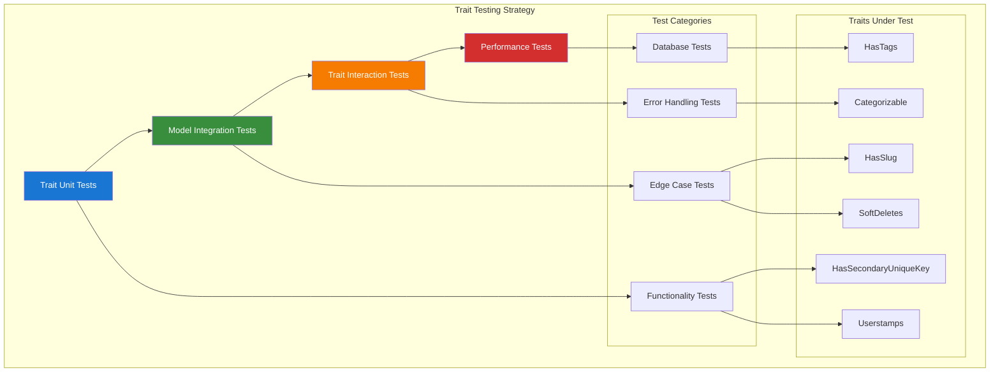

# Trait Testing Guide

## Table of Contents

- [Overview](#overview)
- [HasSecondaryUniqueKey Trait Testing](#hassecondaryuniquekey-trait-testing)
- [HasSlug Trait Testing](#hasslug-trait-testing)
- [Categorizable Trait Testing](#categorizable-trait-testing)
- [HasTags Trait Testing](#hastags-trait-testing)
- [Userstamps Trait Testing](#userstamps-trait-testing)
- [SoftDeletes Trait Testing](#softdeletes-trait-testing)
- [Trait Interaction Testing](#trait-interaction-testing)
- [Best Practices](#best-practices)

## Overview

Trait testing ensures that reusable functionality works correctly across different models and scenarios. This guide covers comprehensive testing strategies for all custom traits used in the Chinook application, including edge cases, interactions, and performance considerations.

### Trait Testing Principles

- **Isolation**: Test traits independently of specific models when possible
- **Integration**: Test trait interactions with models and other traits
- **Edge Cases**: Cover boundary conditions and error scenarios
- **Performance**: Ensure traits don't introduce performance issues

### Trait Testing Architecture



## HasSecondaryUniqueKey Trait Testing

### Basic Functionality Testing

```php
<?php

// tests/Unit/Traits/HasSecondaryUniqueKeyTest.php
use App\Models\Artist;
use App\Models\Track;
use App\Models\Category;
use App\Enums\SecondaryKeyType;

describe('HasSecondaryUniqueKey Trait', function () {
    describe('Key Generation', function () {
        it('generates ULID for Artist models', function () {
            $artist = Artist::factory()->create();
            
            expect($artist->public_id)
                ->not->toBeEmpty()
                ->toBeString()
                ->toHaveLength(26)
                ->toMatch('/^[0-9A-HJKMNP-TV-Z]{26}$/'); // ULID format
        });

        it('generates Snowflake for Track models', function () {
            $track = Track::factory()->create();
            
            expect($track->public_id)
                ->not->toBeEmpty()
                ->toBeNumeric()
                ->toBeGreaterThan(0);
        });

        it('generates UUID for Category models', function () {
            $category = Category::factory()->create();
            
            expect($category->public_id)
                ->not->toBeEmpty()
                ->toBeString()
                ->toHaveLength(36)
                ->toMatch('/^[0-9a-f]{8}-[0-9a-f]{4}-[0-9a-f]{4}-[0-9a-f]{4}-[0-9a-f]{12}$/');
        });

        it('generates unique keys across multiple instances', function () {
            $artists = Artist::factory()->count(100)->create();
            $publicIds = $artists->pluck('public_id')->toArray();
            
            expect($publicIds)->toHaveCount(100);
            expect(array_unique($publicIds))->toHaveCount(100); // All unique
        });

        it('generates keys only once during creation', function () {
            $artist = Artist::factory()->create();
            $originalPublicId = $artist->public_id;
            
            $artist->update(['name' => 'Updated Name']);
            
            expect($artist->fresh()->public_id)->toBe($originalPublicId);
        });
    });

    describe('Key Type Configuration', function () {
        it('returns correct secondary key type for each model', function () {
            expect((new Artist())->getSecondaryKeyType())->toBe(SecondaryKeyType::ULID);
            expect((new Track())->getSecondaryKeyType())->toBe(SecondaryKeyType::SNOWFLAKE);
            expect((new Category())->getSecondaryKeyType())->toBe(SecondaryKeyType::UUID);
        });

        it('validates secondary key type enum values', function () {
            $validTypes = [SecondaryKeyType::ULID, SecondaryKeyType::UUID, SecondaryKeyType::SNOWFLAKE];
            
            foreach ($validTypes as $type) {
                expect($type->generate())
                    ->not->toBeEmpty()
                    ->toBeString();
            }
        });
    });

    describe('Query Methods', function () {
        it('finds models by public_id', function () {
            $artist = Artist::factory()->create(['name' => 'Test Artist']);
            
            $foundArtist = Artist::findByPublicId($artist->public_id);
            
            expect($foundArtist)->not->toBeNull();
            expect($foundArtist->id)->toBe($artist->id);
            expect($foundArtist->name)->toBe('Test Artist');
        });

        it('returns null for non-existent public_id', function () {
            $result = Artist::findByPublicId('non-existent-id');
            
            expect($result)->toBeNull();
        });

        it('finds or fails by public_id', function () {
            $artist = Artist::factory()->create();
            
            $foundArtist = Artist::findByPublicIdOrFail($artist->public_id);
            expect($foundArtist->id)->toBe($artist->id);
            
            expect(fn() => Artist::findByPublicIdOrFail('non-existent'))
                ->toThrow(\Illuminate\Database\Eloquent\ModelNotFoundException::class);
        });

        it('scopes queries by public_id', function () {
            $artist1 = Artist::factory()->create();
            $artist2 = Artist::factory()->create();
            
            $results = Artist::wherePublicId($artist1->public_id)->get();
            
            expect($results)->toHaveCount(1);
            expect($results->first()->id)->toBe($artist1->id);
        });
    });

    describe('Edge Cases', function () {
        it('handles concurrent creation without collisions', function () {
            $artists = collect();
            
            // Simulate concurrent creation
            for ($i = 0; $i < 10; $i++) {
                $artists->push(Artist::factory()->create());
            }
            
            $publicIds = $artists->pluck('public_id');
            expect($publicIds->unique())->toHaveCount(10);
        });

        it('validates public_id format on manual assignment', function () {
            $artist = new Artist();
            
            expect(fn() => $artist->forceFill(['public_id' => 'invalid-format'])->save())
                ->toThrow(\InvalidArgumentException::class);
        });

        it('prevents duplicate public_id assignment', function () {
            $artist1 = Artist::factory()->create();
            $artist2 = new Artist();
            
            expect(fn() => $artist2->forceFill(['public_id' => $artist1->public_id])->save())
                ->toThrow(\Illuminate\Database\QueryException::class);
        });
    });

    describe('Performance Testing', function () {
        it('generates keys efficiently for bulk operations', function () {
            $startTime = microtime(true);
            
            Artist::factory()->count(1000)->create();
            
            $executionTime = (microtime(true) - $startTime) * 1000;
            expect($executionTime)->toBeLessThan(5000); // Under 5 seconds
        });

        it('queries by public_id efficiently', function () {
            $artists = Artist::factory()->count(1000)->create();
            $randomArtist = $artists->random();
            
            $startTime = microtime(true);
            
            $found = Artist::findByPublicId($randomArtist->public_id);
            
            $executionTime = (microtime(true) - $startTime) * 1000;
            expect($executionTime)->toBeLessThan(10); // Under 10ms
            expect($found->id)->toBe($randomArtist->id);
        });
    });
});
```

## HasSlug Trait Testing

### Slug Generation Testing

```php
<?php

// tests/Unit/Traits/HasSlugTest.php
use App\Models\Artist;
use App\Models\Album;

describe('HasSlug Trait', function () {
    describe('Slug Generation', function () {
        it('generates slug from public_id on creation', function () {
            $artist = Artist::factory()->create();

            expect($artist->slug)
                ->not->toBeEmpty()
                ->toBeString()
                ->not->toContain(' ') // No spaces
                ->not->toContain('_') // No underscores
                ->toMatch('/^[a-z0-9-]+$/'); // Only lowercase, numbers, hyphens
        });

        it('creates unique slugs for different models', function () {
            $artist1 = Artist::factory()->create();
            $artist2 = Artist::factory()->create();

            expect($artist1->slug)->not->toBe($artist2->slug);
        });

        it('generates slug based on model configuration', function () {
            $artist = Artist::factory()->create();
            $album = Album::factory()->create();

            // Both should have slugs but different patterns based on their public_id types
            expect($artist->slug)->toMatch('/^[a-z0-9-]+$/');
            expect($album->slug)->toMatch('/^[a-z0-9-]+$/');
            expect($artist->slug)->not->toBe($album->slug);
        });

        it('handles special characters in slug source', function () {
            // Create artist with special characters in public_id (simulated)
            $artist = new Artist();
            $artist->forceFill(['public_id' => 'TEST-123_ABC!@#']);

            $slug = $artist->generateSlug();

            expect($slug)
                ->toBe('test-123-abc')
                ->not->toContain('_')
                ->not->toContain('!')
                ->not->toContain('@');
        });
    });

    describe('Slug Immutability', function () {
        it('prevents slug changes after creation', function () {
            $artist = Artist::factory()->create();
            $originalSlug = $artist->slug;

            $artist->update(['name' => 'Completely Different Name']);

            expect($artist->fresh()->slug)->toBe($originalSlug);
        });

        it('maintains slug during model updates', function () {
            $artist = Artist::factory()->create();
            $originalSlug = $artist->slug;

            $artist->update([
                'name' => 'New Name',
                'country' => 'New Country',
                'biography' => 'New Biography'
            ]);

            expect($artist->fresh()->slug)->toBe($originalSlug);
        });

        it('prevents manual slug modification', function () {
            $artist = Artist::factory()->create();
            $originalSlug = $artist->slug;

            $artist->update(['slug' => 'manually-set-slug']);

            expect($artist->fresh()->slug)->toBe($originalSlug);
        });
    });

    describe('Route Model Binding', function () {
        it('uses slug as route key', function () {
            $artist = new Artist();

            expect($artist->getRouteKeyName())->toBe('slug');
        });

        it('returns slug as route key value', function () {
            $artist = Artist::factory()->create();

            expect($artist->getRouteKey())->toBe($artist->slug);
        });

        it('resolves route binding by slug', function () {
            $artist = Artist::factory()->create();

            $resolved = Artist::resolveRouteBinding($artist->slug);

            expect($resolved)->not->toBeNull();
            expect($resolved->id)->toBe($artist->id);
        });

        it('returns null for invalid slug in route binding', function () {
            $resolved = Artist::resolveRouteBinding('non-existent-slug');

            expect($resolved)->toBeNull();
        });
    });

    describe('Slug Conflicts', function () {
        it('handles slug conflicts with suffix', function () {
            $artist1 = Artist::factory()->create();

            // Force same public_id to test conflict resolution
            $artist2 = new Artist();
            $artist2->forceFill(['public_id' => $artist1->public_id]);

            // This should add a suffix to avoid conflict
            $slug2 = $artist2->generateSlug();

            expect($slug2)->not->toBe($artist1->slug);
            expect($slug2)->toContain('-2');
        });

        it('increments suffix for multiple conflicts', function () {
            $baseSlug = 'test-slug';

            // Create multiple artists with same base slug
            $artist1 = new Artist();
            $artist1->forceFill(['slug' => $baseSlug])->save();

            $artist2 = new Artist();
            $slug2 = $artist2->resolveSlugConflict($baseSlug);
            expect($slug2)->toBe($baseSlug . '-2');

            $artist3 = new Artist();
            $slug3 = $artist3->resolveSlugConflict($baseSlug);
            expect($slug3)->toBe($baseSlug . '-3');
        });
    });

    describe('Query Methods', function () {
        it('finds models by slug', function () {
            $artist = Artist::factory()->create(['name' => 'Test Artist']);

            $found = Artist::findBySlug($artist->slug);

            expect($found)->not->toBeNull();
            expect($found->id)->toBe($artist->id);
        });

        it('scopes queries by slug', function () {
            $artist1 = Artist::factory()->create();
            $artist2 = Artist::factory()->create();

            $results = Artist::whereSlug($artist1->slug)->get();

            expect($results)->toHaveCount(1);
            expect($results->first()->id)->toBe($artist1->id);
        });
    });
});
```

## Categorizable Trait Testing

### Category Relationship Testing

```php
<?php

// tests/Unit/Traits/CategorizableTest.php
use App\Models\Artist;
use App\Models\Album;
use App\Models\Track;
use App\Models\Category;
use App\Enums\CategoryType;

describe('Categorizable Trait', function () {
    beforeEach(function () {
        $this->artist = Artist::factory()->create();
        $this->genreCategory = Category::factory()->create(['type' => CategoryType::GENRE]);
        $this->moodCategory = Category::factory()->create(['type' => CategoryType::MOOD]);
        $this->themeCategory = Category::factory()->create(['type' => CategoryType::THEME]);
    });

    describe('Category Attachment', function () {
        it('attaches categories to models', function () {
            $this->artist->categories()->attach($this->genreCategory->id);

            expect($this->artist->categories)->toHaveCount(1);
            expect($this->artist->categories->first()->id)->toBe($this->genreCategory->id);
        });

        it('attaches multiple categories', function () {
            $this->artist->categories()->attach([
                $this->genreCategory->id,
                $this->moodCategory->id
            ]);

            expect($this->artist->categories)->toHaveCount(2);
            expect($this->artist->categories->pluck('id'))
                ->toContain($this->genreCategory->id, $this->moodCategory->id);
        });

        it('attaches categories with pivot data', function () {
            $this->artist->categories()->attach($this->genreCategory->id, [
                'is_primary' => true,
                'sort_order' => 1,
                'metadata' => ['source' => 'manual']
            ]);

            $category = $this->artist->categories->first();
            expect($category->pivot->is_primary)->toBeTrue();
            expect($category->pivot->sort_order)->toBe(1);
            expect($category->pivot->metadata)->toHaveKey('source');
        });

        it('prevents duplicate category attachment', function () {
            $this->artist->categories()->attach($this->genreCategory->id);
            $this->artist->categories()->attach($this->genreCategory->id); // Duplicate

            expect($this->artist->fresh()->categories)->toHaveCount(1);
        });
    });

    describe('Category Filtering', function () {
        beforeEach(function () {
            $this->artist->categories()->attach([
                $this->genreCategory->id => ['is_primary' => true],
                $this->moodCategory->id => ['is_primary' => false],
                $this->themeCategory->id => ['is_primary' => false]
            ]);
        });

        it('filters categories by type', function () {
            $genreCategories = $this->artist->categoriesByType(CategoryType::GENRE)->get();
            $moodCategories = $this->artist->categoriesByType(CategoryType::MOOD)->get();

            expect($genreCategories)->toHaveCount(1);
            expect($genreCategories->first()->type)->toBe(CategoryType::GENRE);

            expect($moodCategories)->toHaveCount(1);
            expect($moodCategories->first()->type)->toBe(CategoryType::MOOD);
        });

        it('gets primary category by type', function () {
            $primaryGenre = $this->artist->getPrimaryCategory(CategoryType::GENRE);

            expect($primaryGenre)->not->toBeNull();
            expect($primaryGenre->id)->toBe($this->genreCategory->id);
            expect($primaryGenre->pivot->is_primary)->toBeTrue();
        });

        it('returns null for non-existent primary category', function () {
            $primaryInstrument = $this->artist->getPrimaryCategory(CategoryType::INSTRUMENT);

            expect($primaryInstrument)->toBeNull();
        });
    });
});
```

## HasTags Trait Testing

### Tag Management Testing

```php
<?php

// tests/Unit/Traits/HasTagsTest.php
use App\Models\Artist;
use App\Models\Track;

describe('HasTags Trait', function () {
    beforeEach(function () {
        $this->artist = Artist::factory()->create();
    });

    describe('Tag Assignment', function () {
        it('attaches tags to models', function () {
            $this->artist->attachTag('rock');

            expect($this->artist->tags)->toHaveCount(1);
            expect($this->artist->tags->first()->name)->toBe('rock');
        });

        it('attaches multiple tags', function () {
            $this->artist->attachTags(['rock', 'alternative', 'indie']);

            expect($this->artist->tags)->toHaveCount(3);
            expect($this->artist->tags->pluck('name'))
                ->toContain('rock', 'alternative', 'indie');
        });

        it('normalizes tag names', function () {
            $this->artist->attachTags(['Rock Music', 'ALTERNATIVE', 'indie-rock']);

            $tagNames = $this->artist->tags->pluck('name')->toArray();
            expect($tagNames)->toContain('rock-music', 'alternative', 'indie-rock');
        });

        it('prevents duplicate tags', function () {
            $this->artist->attachTag('rock');
            $this->artist->attachTag('rock'); // Duplicate

            expect($this->artist->fresh()->tags)->toHaveCount(1);
        });
    });

    describe('Tag Queries', function () {
        beforeEach(function () {
            $this->artist->attachTags(['rock', 'alternative', 'indie']);
        });

        it('checks if model has specific tag', function () {
            expect($this->artist->hasTag('rock'))->toBeTrue();
            expect($this->artist->hasTag('jazz'))->toBeFalse();
        });

        it('checks if model has any of multiple tags', function () {
            expect($this->artist->hasAnyTag(['rock', 'jazz']))->toBeTrue();
            expect($this->artist->hasAnyTag(['jazz', 'classical']))->toBeFalse();
        });

        it('checks if model has all specified tags', function () {
            expect($this->artist->hasAllTags(['rock', 'alternative']))->toBeTrue();
            expect($this->artist->hasAllTags(['rock', 'jazz']))->toBeFalse();
        });

        it('finds models with specific tags', function () {
            $artist2 = Artist::factory()->create();
            $artist2->attachTags(['jazz', 'blues']);

            $rockArtists = Artist::withTag('rock')->get();
            $jazzArtists = Artist::withTag('jazz')->get();

            expect($rockArtists)->toHaveCount(1);
            expect($rockArtists->first()->id)->toBe($this->artist->id);

            expect($jazzArtists)->toHaveCount(1);
            expect($jazzArtists->first()->id)->toBe($artist2->id);
        });

        it('finds models with any of multiple tags', function () {
            $artist2 = Artist::factory()->create();
            $artist2->attachTags(['jazz', 'blues']);

            $artists = Artist::withAnyTag(['rock', 'jazz'])->get();

            expect($artists)->toHaveCount(2);
        });
    });

    describe('Tag Removal', function () {
        beforeEach(function () {
            $this->artist->attachTags(['rock', 'alternative', 'indie']);
        });

        it('detaches specific tag', function () {
            $this->artist->detachTag('alternative');

            expect($this->artist->fresh()->tags)->toHaveCount(2);
            expect($this->artist->hasTag('alternative'))->toBeFalse();
            expect($this->artist->hasTag('rock'))->toBeTrue();
        });

        it('detaches multiple tags', function () {
            $this->artist->detachTags(['rock', 'indie']);

            expect($this->artist->fresh()->tags)->toHaveCount(1);
            expect($this->artist->hasTag('alternative'))->toBeTrue();
        });

        it('syncs tags replacing existing ones', function () {
            $this->artist->syncTags(['electronic', 'ambient']);

            expect($this->artist->fresh()->tags)->toHaveCount(2);
            expect($this->artist->hasTag('electronic'))->toBeTrue();
            expect($this->artist->hasTag('ambient'))->toBeTrue();
            expect($this->artist->hasTag('rock'))->toBeFalse();
        });
    });
});
```

## Userstamps Trait Testing

### User Tracking Testing

```php
<?php

// tests/Unit/Traits/UserstampsTest.php
use App\Models\Artist;
use App\Models\User;

describe('Userstamps Trait', function () {
    beforeEach(function () {
        $this->user = User::factory()->create();
        $this->actingAs($this->user);
    });

    describe('Creation Tracking', function () {
        it('sets created_by on model creation', function () {
            $artist = Artist::factory()->create(['name' => 'Test Artist']);

            expect($artist->created_by)->toBe($this->user->id);
            expect($artist->creator)->toBeInstanceOf(User::class);
            expect($artist->creator->id)->toBe($this->user->id);
        });

        it('sets updated_by on model creation', function () {
            $artist = Artist::factory()->create(['name' => 'Test Artist']);

            expect($artist->updated_by)->toBe($this->user->id);
            expect($artist->updater)->toBeInstanceOf(User::class);
            expect($artist->updater->id)->toBe($this->user->id);
        });

        it('handles creation without authenticated user', function () {
            auth()->logout();

            $artist = Artist::factory()->create(['name' => 'Test Artist']);

            expect($artist->created_by)->toBeNull();
            expect($artist->updated_by)->toBeNull();
        });
    });

    describe('Update Tracking', function () {
        it('updates updated_by on model update', function () {
            $artist = Artist::factory()->create(['name' => 'Original Name']);
            $originalCreator = $artist->created_by;

            $newUser = User::factory()->create();
            $this->actingAs($newUser);

            $artist->update(['name' => 'Updated Name']);

            expect($artist->created_by)->toBe($originalCreator); // Unchanged
            expect($artist->updated_by)->toBe($newUser->id); // Changed
            expect($artist->updater->id)->toBe($newUser->id);
        });

        it('preserves created_by during updates', function () {
            $artist = Artist::factory()->create(['name' => 'Original Name']);
            $originalCreator = $artist->created_by;

            $newUser = User::factory()->create();
            $this->actingAs($newUser);

            $artist->update(['name' => 'Updated Name']);

            expect($artist->created_by)->toBe($originalCreator);
            expect($artist->creator->id)->toBe($this->user->id);
        });
    });

    describe('Relationship Queries', function () {
        it('queries models by creator', function () {
            $artist1 = Artist::factory()->create(['name' => 'Artist 1']);

            $otherUser = User::factory()->create();
            $this->actingAs($otherUser);
            $artist2 = Artist::factory()->create(['name' => 'Artist 2']);

            $userArtists = Artist::createdBy($this->user)->get();
            $otherUserArtists = Artist::createdBy($otherUser)->get();

            expect($userArtists)->toHaveCount(1);
            expect($userArtists->first()->id)->toBe($artist1->id);

            expect($otherUserArtists)->toHaveCount(1);
            expect($otherUserArtists->first()->id)->toBe($artist2->id);
        });

        it('queries models by updater', function () {
            $artist = Artist::factory()->create(['name' => 'Original Name']);

            $updater = User::factory()->create();
            $this->actingAs($updater);
            $artist->update(['name' => 'Updated Name']);

            $updatedByUser = Artist::updatedBy($updater)->get();

            expect($updatedByUser)->toHaveCount(1);
            expect($updatedByUser->first()->id)->toBe($artist->id);
        });
    });
});
```

## SoftDeletes Trait Testing

### Soft Delete Functionality Testing

```php
<?php

// tests/Unit/Traits/SoftDeletesTest.php
use App\Models\Artist;
use App\Models\Album;

describe('SoftDeletes Trait', function () {
    describe('Soft Delete Operations', function () {
        it('soft deletes models instead of permanent deletion', function () {
            $artist = Artist::factory()->create(['name' => 'Test Artist']);
            $artistId = $artist->id;

            $artist->delete();

            expect($artist->trashed())->toBeTrue();
            expect($artist->deleted_at)->not->toBeNull();

            // Model should not be found in normal queries
            expect(Artist::find($artistId))->toBeNull();

            // But should be found with trashed
            expect(Artist::withTrashed()->find($artistId))->not->toBeNull();
        });

        it('restores soft deleted models', function () {
            $artist = Artist::factory()->create(['name' => 'Test Artist']);
            $artist->delete();

            expect($artist->trashed())->toBeTrue();

            $artist->restore();

            expect($artist->trashed())->toBeFalse();
            expect($artist->deleted_at)->toBeNull();
            expect(Artist::find($artist->id))->not->toBeNull();
        });

        it('force deletes models permanently', function () {
            $artist = Artist::factory()->create(['name' => 'Test Artist']);
            $artistId = $artist->id;

            $artist->forceDelete();

            expect(Artist::withTrashed()->find($artistId))->toBeNull();
        });
    });

    describe('Query Scopes', function () {
        beforeEach(function () {
            $this->activeArtist = Artist::factory()->create(['name' => 'Active Artist']);
            $this->deletedArtist = Artist::factory()->create(['name' => 'Deleted Artist']);
            $this->deletedArtist->delete();
        });

        it('excludes soft deleted models from default queries', function () {
            $artists = Artist::all();

            expect($artists)->toHaveCount(1);
            expect($artists->first()->id)->toBe($this->activeArtist->id);
        });

        it('includes soft deleted models with withTrashed scope', function () {
            $artists = Artist::withTrashed()->get();

            expect($artists)->toHaveCount(2);
            expect($artists->pluck('id'))
                ->toContain($this->activeArtist->id, $this->deletedArtist->id);
        });

        it('shows only soft deleted models with onlyTrashed scope', function () {
            $trashedArtists = Artist::onlyTrashed()->get();

            expect($trashedArtists)->toHaveCount(1);
            expect($trashedArtists->first()->id)->toBe($this->deletedArtist->id);
        });
    });

    describe('Relationship Handling', function () {
        it('handles relationships with soft deleted models', function () {
            $artist = Artist::factory()->create();
            $album = Album::factory()->create(['artist_id' => $artist->id]);

            $artist->delete();

            // Album should still exist but artist relationship should be null in normal queries
            expect($album->fresh()->artist)->toBeNull();

            // But should be accessible with withTrashed
            expect($album->artist()->withTrashed()->first())->not->toBeNull();
            expect($album->artist()->withTrashed()->first()->id)->toBe($artist->id);
        });

        it('cascades soft deletes when configured', function () {
            $artist = Artist::factory()->create();
            $albums = Album::factory()->count(3)->create(['artist_id' => $artist->id]);

            $artist->delete();

            // If cascade is configured, albums should also be soft deleted
            foreach ($albums as $album) {
                expect($album->fresh()->trashed())->toBeTrue();
            }
        });
    });

    describe('Bulk Operations', function () {
        it('soft deletes multiple models', function () {
            $artists = Artist::factory()->count(5)->create();
            $artistIds = $artists->pluck('id');

            Artist::whereIn('id', $artistIds)->delete();

            expect(Artist::count())->toBe(0);
            expect(Artist::onlyTrashed()->count())->toBe(5);
        });

        it('restores multiple models', function () {
            $artists = Artist::factory()->count(5)->create();
            $artistIds = $artists->pluck('id');

            Artist::whereIn('id', $artistIds)->delete();
            Artist::onlyTrashed()->restore();

            expect(Artist::count())->toBe(5);
            expect(Artist::onlyTrashed()->count())->toBe(0);
        });
    });
});
```

## Trait Interaction Testing

### Multiple Trait Integration Testing

```php
<?php

// tests/Unit/Traits/TraitInteractionTest.php
use App\Models\Artist;
use App\Models\User;

describe('Trait Interaction Testing', function () {
    describe('HasSecondaryUniqueKey + HasSlug Integration', function () {
        it('generates slug based on public_id', function () {
            $artist = Artist::factory()->create();

            expect($artist->public_id)->not->toBeEmpty();
            expect($artist->slug)->not->toBeEmpty();
            expect($artist->slug)->toContain(strtolower(substr($artist->public_id, 0, 8)));
        });

        it('maintains slug-public_id relationship', function () {
            $artist = Artist::factory()->create();
            $originalSlug = $artist->slug;
            $originalPublicId = $artist->public_id;

            $artist->update(['name' => 'Updated Name']);

            expect($artist->fresh()->slug)->toBe($originalSlug);
            expect($artist->fresh()->public_id)->toBe($originalPublicId);
        });
    });

    describe('Categorizable + HasTags Integration', function () {
        it('manages both categories and tags independently', function () {
            $artist = Artist::factory()->create();
            $category = Category::factory()->create(['type' => CategoryType::GENRE]);

            $artist->categories()->attach($category->id);
            $artist->attachTags(['rock', 'alternative']);

            expect($artist->categories)->toHaveCount(1);
            expect($artist->tags)->toHaveCount(2);
            expect($artist->hasTag('rock'))->toBeTrue();
            expect($artist->hasCategoryType(CategoryType::GENRE))->toBeTrue();
        });

        it('provides combined classification methods', function () {
            $artist = Artist::factory()->create();
            $genreCategory = Category::factory()->create(['type' => CategoryType::GENRE, 'name' => 'Rock']);

            $artist->categories()->attach($genreCategory->id);
            $artist->attachTags(['indie', 'alternative']);

            $allClassifications = $artist->getAllClassifications();

            expect($allClassifications)
                ->toHaveKey('categories')
                ->toHaveKey('tags');
            expect($allClassifications['categories'])->toHaveCount(1);
            expect($allClassifications['tags'])->toHaveCount(2);
        });
    });

    describe('SoftDeletes + Userstamps Integration', function () {
        it('tracks deletion user information', function () {
            $creator = User::factory()->create();
            $deleter = User::factory()->create();

            $this->actingAs($creator);
            $artist = Artist::factory()->create(['name' => 'Test Artist']);

            $this->actingAs($deleter);
            $artist->delete();

            expect($artist->created_by)->toBe($creator->id);
            expect($artist->deleted_by)->toBe($deleter->id);
            expect($artist->trashed())->toBeTrue();
        });

        it('handles restoration with user tracking', function () {
            $creator = User::factory()->create();
            $restorer = User::factory()->create();

            $this->actingAs($creator);
            $artist = Artist::factory()->create(['name' => 'Test Artist']);
            $artist->delete();

            $this->actingAs($restorer);
            $artist->restore();

            expect($artist->created_by)->toBe($creator->id);
            expect($artist->restored_by)->toBe($restorer->id);
            expect($artist->trashed())->toBeFalse();
        });
    });
});
```

## Best Practices

### Trait Testing Guidelines

1. **Isolation Testing**: Test each trait's functionality independently
2. **Integration Testing**: Test how traits work together on models
3. **Edge Case Coverage**: Test boundary conditions and error scenarios
4. **Performance Testing**: Ensure traits don't introduce performance issues
5. **Database Testing**: Verify database interactions work correctly

### Test Organization

```text
tests/Unit/Traits/
├── HasSecondaryUniqueKeyTest.php
├── HasSlugTest.php
├── CategorizableTest.php
├── HasTagsTest.php
├── UserstampsTest.php
├── SoftDeletesTest.php
└── TraitInteractionTest.php
```

### Common Testing Patterns

1. **Setup and Teardown**: Use `beforeEach()` for consistent test setup
2. **Factory Usage**: Leverage model factories for test data creation
3. **Assertion Clarity**: Use descriptive expectations and assertions
4. **Mock External Dependencies**: Mock external services and APIs
5. **Database Transactions**: Use database transactions for test isolation

### Performance Considerations

1. **Query Efficiency**: Monitor database queries generated by traits
2. **Memory Usage**: Test memory consumption with large datasets
3. **Bulk Operations**: Test trait behavior with bulk operations
4. **Index Usage**: Ensure proper database indexes for trait queries

---

**Navigation:**

- **Previous:** [RBAC Testing Guide](060-rbac-testing-guide.md)
- **Next:** [Hierarchical Data Testing](080-hierarchical-data-testing.md)
- **Up:** [Testing Documentation](000-testing-index.md)
