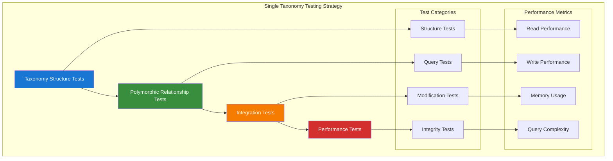

# Single Taxonomy System Testing

## Table of Contents

- [Overview](#overview)
- [Taxonomy Structure Testing](#taxonomy-structure-testing)
- [Polymorphic Relationship Testing](#polymorphic-relationship-testing)
- [Taxonomy Integration Testing](#taxonomy-integration-testing)
- [Data Integrity Validation](#data-integrity-validation)
- [Performance Testing](#performance-testing)
- [Query Optimization Testing](#query-optimization-testing)
- [Concurrent Operations Testing](#concurrent-operations-testing)
- [Best Practices](#best-practices)

## Overview

Single taxonomy system testing ensures that the aliziodev/laravel-taxonomy package integration maintains data integrity, performs efficiently, and handles complex taxonomic operations correctly. This guide covers comprehensive testing strategies for the unified taxonomy system in the Chinook application.

### Single Taxonomy Architecture

The Chinook application uses the aliziodev/laravel-taxonomy package providing:
- **Unified System**: Single source of truth for all categorization
- **Polymorphic Relationships**: Flexible model associations via taxonomables
- **Hierarchical Support**: Nested set model for complex taxonomy trees



## Closure Table Testing

### Basic Closure Table Operations

```php
<?php

// tests/Unit/HierarchicalData/ClosureTableTest.php
use App\Models\Category;
use App\Enums\CategoryType;

describe('Closure Table Operations', function () {
    beforeEach(function () {
        $this->createTestHierarchy();
    });

    describe('Hierarchy Creation', function () {
        it('creates closure table entries when building hierarchy', function () {
            $root = Category::factory()->create(['type' => CategoryType::GENRE, 'name' => 'Music']);
            $rock = Category::factory()->create(['type' => CategoryType::GENRE, 'name' => 'Rock']);
            $hardRock = Category::factory()->create(['type' => CategoryType::GENRE, 'name' => 'Hard Rock']);

            // Build hierarchy: Music > Rock > Hard Rock
            $rock->makeChildOf($root);
            $hardRock->makeChildOf($rock);

            // Verify closure table entries exist
            expect($root->descendants)->toHaveCount(2); // Rock and Hard Rock
            expect($rock->ancestors)->toHaveCount(1); // Music
            expect($hardRock->ancestors)->toHaveCount(2); // Music and Rock

            // Verify depth information
            $hardRockAncestors = $hardRock->ancestors()->get();
            $musicRelation = $hardRockAncestors->where('id', $root->id)->first();
            $rockRelation = $hardRockAncestors->where('id', $rock->id)->first();

            expect($musicRelation->pivot->depth)->toBe(2);
            expect($rockRelation->pivot->depth)->toBe(1);
        });

        it('maintains self-referential entries', function () {
            $category = Category::factory()->create(['type' => CategoryType::GENRE]);

            // Should have self-referential entry with depth 0
            $selfRelation = $category->ancestors()->wherePivot('depth', 0)->first();
            expect($selfRelation)->not->toBeNull();
            expect($selfRelation->id)->toBe($category->id);
        });

        it('calculates correct path lengths', function () {
            $level0 = Category::factory()->create(['type' => CategoryType::GENRE, 'name' => 'Level 0']);
            $level1 = Category::factory()->create(['type' => CategoryType::GENRE, 'name' => 'Level 1']);
            $level2 = Category::factory()->create(['type' => CategoryType::GENRE, 'name' => 'Level 2']);
            $level3 = Category::factory()->create(['type' => CategoryType::GENRE, 'name' => 'Level 3']);

            $level1->makeChildOf($level0);
            $level2->makeChildOf($level1);
            $level3->makeChildOf($level2);

            // Verify path lengths
            expect($level3->getDepthFromRoot())->toBe(3);
            expect($level2->getDepthFromRoot())->toBe(2);
            expect($level1->getDepthFromRoot())->toBe(1);
            expect($level0->getDepthFromRoot())->toBe(0);
        });
    });

    describe('Ancestor Queries', function () {
        it('retrieves all ancestors efficiently', function () {
            $hardRock = Category::where('name', 'Hard Rock')->first();
            $ancestors = $hardRock->ancestors()->orderBy('depth', 'desc')->get();

            expect($ancestors)->toHaveCount(3); // Self, Rock, Music
            expect($ancestors->pluck('name')->toArray())
                ->toBe(['Hard Rock', 'Rock', 'Music']);
        });

        it('retrieves ancestors at specific depth', function () {
            $hardRock = Category::where('name', 'Hard Rock')->first();
            
            $directParent = $hardRock->ancestors()->wherePivot('depth', 1)->first();
            $grandParent = $hardRock->ancestors()->wherePivot('depth', 2)->first();

            expect($directParent->name)->toBe('Rock');
            expect($grandParent->name)->toBe('Music');
        });

        it('excludes self from ancestor queries when specified', function () {
            $hardRock = Category::where('name', 'Hard Rock')->first();
            $ancestorsWithoutSelf = $hardRock->ancestors()->wherePivot('depth', '>', 0)->get();

            expect($ancestorsWithoutSelf)->toHaveCount(2); // Rock, Music
            expect($ancestorsWithoutSelf->pluck('name'))->not->toContain('Hard Rock');
        });
    });

    describe('Descendant Queries', function () {
        it('retrieves all descendants efficiently', function () {
            $music = Category::where('name', 'Music')->first();
            $descendants = $music->descendants()->orderBy('depth')->get();

            expect($descendants)->toHaveCount(5); // Self, Rock, Metal, Hard Rock, Heavy Metal
            expect($descendants->first()->name)->toBe('Music'); // Self at depth 0
        });

        it('retrieves descendants at specific depth', function () {
            $music = Category::where('name', 'Music')->first();
            
            $directChildren = $music->descendants()->wherePivot('depth', 1)->get();
            $grandChildren = $music->descendants()->wherePivot('depth', 2)->get();

            expect($directChildren)->toHaveCount(2); // Rock, Metal
            expect($grandChildren)->toHaveCount(2); // Hard Rock, Heavy Metal
        });

        it('retrieves subtree efficiently', function () {
            $rock = Category::where('name', 'Rock')->first();
            $subtree = $rock->getSubtree();

            expect($subtree)->toHaveCount(2); // Rock, Hard Rock
            expect($subtree->pluck('name'))->toContain('Rock', 'Hard Rock');
        });
    });

    describe('Sibling Queries', function () {
        it('retrieves siblings correctly', function () {
            $rock = Category::where('name', 'Rock')->first();
            $metal = Category::where('name', 'Metal')->first();
            
            $rockSiblings = $rock->getSiblings();
            $metalSiblings = $metal->getSiblings();

            expect($rockSiblings)->toHaveCount(1);
            expect($rockSiblings->first()->name)->toBe('Metal');
            
            expect($metalSiblings)->toHaveCount(1);
            expect($metalSiblings->first()->name)->toBe('Rock');
        });

        it('excludes self from sibling queries', function () {
            $rock = Category::where('name', 'Rock')->first();
            $siblings = $rock->getSiblings();

            expect($siblings->pluck('name'))->not->toContain('Rock');
        });
    });

    private function createTestHierarchy(): void
    {
        // Create test hierarchy: Music > Rock > Hard Rock
        //                              > Metal > Heavy Metal
        $music = Category::factory()->create(['type' => CategoryType::GENRE, 'name' => 'Music']);
        $rock = Category::factory()->create(['type' => CategoryType::GENRE, 'name' => 'Rock']);
        $metal = Category::factory()->create(['type' => CategoryType::GENRE, 'name' => 'Metal']);
        $hardRock = Category::factory()->create(['type' => CategoryType::GENRE, 'name' => 'Hard Rock']);
        $heavyMetal = Category::factory()->create(['type' => CategoryType::GENRE, 'name' => 'Heavy Metal']);

        $rock->makeChildOf($music);
        $metal->makeChildOf($music);
        $hardRock->makeChildOf($rock);
        $heavyMetal->makeChildOf($metal);
    }
});
```

## Adjacency List Testing

### Parent-Child Relationship Testing

```php
<?php

// tests/Unit/HierarchicalData/AdjacencyListTest.php
use App\Models\Category;
use App\Enums\CategoryType;

describe('Adjacency List Operations', function () {
    describe('Parent-Child Relationships', function () {
        it('sets parent relationship correctly', function () {
            $parent = Category::factory()->create(['type' => CategoryType::GENRE, 'name' => 'Rock']);
            $child = Category::factory()->create(['type' => CategoryType::GENRE, 'name' => 'Hard Rock']);

            $child->makeChildOf($parent);

            expect($child->parent_id)->toBe($parent->id);
            expect($child->parent->id)->toBe($parent->id);
            expect($parent->children)->toHaveCount(1);
            expect($parent->children->first()->id)->toBe($child->id);
        });

        it('handles root nodes without parents', function () {
            $root = Category::factory()->create(['type' => CategoryType::GENRE, 'name' => 'Music']);

            expect($root->parent_id)->toBeNull();
            expect($root->parent)->toBeNull();
            expect($root->isRoot())->toBeTrue();
        });

        it('identifies leaf nodes correctly', function () {
            $parent = Category::factory()->create(['type' => CategoryType::GENRE, 'name' => 'Rock']);
            $child = Category::factory()->create(['type' => CategoryType::GENRE, 'name' => 'Hard Rock']);

            $child->makeChildOf($parent);

            expect($parent->isLeaf())->toBeFalse();
            expect($child->isLeaf())->toBeTrue();
        });

        it('updates parent relationships', function () {
            $oldParent = Category::factory()->create(['type' => CategoryType::GENRE, 'name' => 'Rock']);
            $newParent = Category::factory()->create(['type' => CategoryType::GENRE, 'name' => 'Metal']);
            $child = Category::factory()->create(['type' => CategoryType::GENRE, 'name' => 'Progressive']);

            $child->makeChildOf($oldParent);
            expect($child->parent_id)->toBe($oldParent->id);

            $child->makeChildOf($newParent);
            expect($child->parent_id)->toBe($newParent->id);
            expect($oldParent->fresh()->children)->toHaveCount(0);
            expect($newParent->fresh()->children)->toHaveCount(1);
        });
    });

    describe('Hierarchy Validation', function () {
        it('prevents circular references', function () {
            $parent = Category::factory()->create(['type' => CategoryType::GENRE, 'name' => 'Rock']);
            $child = Category::factory()->create(['type' => CategoryType::GENRE, 'name' => 'Hard Rock']);

            $child->makeChildOf($parent);

            // Attempt to make parent a child of child (circular reference)
            $result = $parent->makeChildOf($child);

            expect($result)->toBeFalse();
            expect($parent->parent_id)->toBeNull();
        });

        it('prevents self-referential relationships', function () {
            $category = Category::factory()->create(['type' => CategoryType::GENRE, 'name' => 'Rock']);

            $result = $category->makeChildOf($category);

            expect($result)->toBeFalse();
            expect($category->parent_id)->toBeNull();
        });

        it('validates type consistency in hierarchy', function () {
            $genreParent = Category::factory()->create(['type' => CategoryType::GENRE, 'name' => 'Rock']);
            $moodChild = Category::factory()->create(['type' => CategoryType::MOOD, 'name' => 'Energetic']);

            $result = $moodChild->makeChildOf($genreParent);

            expect($result)->toBeFalse();
            expect($moodChild->parent_id)->toBeNull();
        });
    });

    describe('Bulk Operations', function () {
        it('moves subtrees efficiently', function () {
            $oldParent = Category::factory()->create(['type' => CategoryType::GENRE, 'name' => 'Rock']);
            $newParent = Category::factory()->create(['type' => CategoryType::GENRE, 'name' => 'Alternative']);
            $child = Category::factory()->create(['type' => CategoryType::GENRE, 'name' => 'Grunge']);
            $grandchild = Category::factory()->create(['type' => CategoryType::GENRE, 'name' => 'Seattle Sound']);

            $child->makeChildOf($oldParent);
            $grandchild->makeChildOf($child);

            // Move entire subtree
            $child->makeChildOf($newParent);

            expect($child->parent_id)->toBe($newParent->id);
            expect($grandchild->fresh()->parent_id)->toBe($child->id);
            expect($oldParent->fresh()->children)->toHaveCount(0);
            expect($newParent->fresh()->children)->toHaveCount(1);
        });

        it('handles orphaned nodes on parent deletion', function () {
            $parent = Category::factory()->create(['type' => CategoryType::GENRE, 'name' => 'Rock']);
            $child1 = Category::factory()->create(['type' => CategoryType::GENRE, 'name' => 'Hard Rock']);
            $child2 = Category::factory()->create(['type' => CategoryType::GENRE, 'name' => 'Soft Rock']);

            $child1->makeChildOf($parent);
            $child2->makeChildOf($parent);

            // Delete parent - children should become orphaned or moved to root
            $parent->delete();

            expect($child1->fresh()->parent_id)->toBeNull();
            expect($child2->fresh()->parent_id)->toBeNull();
        });
    });
});
```

## Hybrid Architecture Testing

### Integration Testing

```php
<?php

// tests/Integration/HierarchicalData/HybridArchitectureTest.php
use App\Models\Category;
use App\Enums\CategoryType;

describe('Hybrid Architecture Integration', function () {
    describe('Consistency Between Adjacency List and Closure Table', function () {
        it('maintains consistency during hierarchy creation', function () {
            $root = Category::factory()->create(['type' => CategoryType::GENRE, 'name' => 'Music']);
            $rock = Category::factory()->create(['type' => CategoryType::GENRE, 'name' => 'Rock']);
            $hardRock = Category::factory()->create(['type' => CategoryType::GENRE, 'name' => 'Hard Rock']);

            $rock->makeChildOf($root);
            $hardRock->makeChildOf($rock);

            // Verify adjacency list
            expect($rock->parent_id)->toBe($root->id);
            expect($hardRock->parent_id)->toBe($rock->id);

            // Verify closure table
            expect($hardRock->ancestors)->toHaveCount(3); // Self, Rock, Music
            expect($root->descendants)->toHaveCount(3); // Self, Rock, Hard Rock
        });

        it('maintains consistency during hierarchy modifications', function () {
            $music = Category::factory()->create(['type' => CategoryType::GENRE, 'name' => 'Music']);
            $rock = Category::factory()->create(['type' => CategoryType::GENRE, 'name' => 'Rock']);
            $alternative = Category::factory()->create(['type' => CategoryType::GENRE, 'name' => 'Alternative']);
            $grunge = Category::factory()->create(['type' => CategoryType::GENRE, 'name' => 'Grunge']);

            // Initial structure: Music > Rock, Alternative > Grunge
            $rock->makeChildOf($music);
            $grunge->makeChildOf($alternative);

            // Move Grunge under Rock
            $grunge->makeChildOf($rock);

            // Verify adjacency list
            expect($grunge->parent_id)->toBe($rock->id);

            // Verify closure table
            expect($grunge->ancestors)->toHaveCount(3); // Self, Rock, Music
            expect($alternative->descendants)->toHaveCount(1); // Only self
            expect($music->descendants)->toHaveCount(3); // Self, Rock, Grunge
        });

        it('validates data integrity after complex operations', function () {
            $this->createComplexHierarchy();

            // Perform various operations
            $this->performHierarchyOperations();

            // Validate consistency
            $this->validateHierarchyConsistency();
        });
    });

    describe('Performance Comparison', function () {
        it('demonstrates read performance advantage of closure table', function () {
            $this->createLargeHierarchy(1000);

            $category = Category::inRandomOrder()->first();

            // Measure closure table query performance
            $startTime = microtime(true);
            $descendants = $category->descendants()->get();
            $closureTime = (microtime(true) - $startTime) * 1000;

            // Measure adjacency list recursive query performance
            $startTime = microtime(true);
            $descendantsRecursive = $category->getDescendantsRecursive();
            $adjacencyTime = (microtime(true) - $startTime) * 1000;

            expect($closureTime)->toBeLessThan($adjacencyTime);
            expect($descendants->count())->toBe($descendantsRecursive->count());
        });

        it('demonstrates write performance of adjacency list', function () {
            $parent = Category::factory()->create(['type' => CategoryType::GENRE]);

            // Measure adjacency list write performance
            $startTime = microtime(true);
            $child = Category::factory()->create(['type' => CategoryType::GENRE]);
            $child->makeChildOf($parent);
            $writeTime = (microtime(true) - $startTime) * 1000;

            expect($writeTime)->toBeLessThan(100); // Should be very fast
        });
    });

    private function createComplexHierarchy(): void
    {
        // Create a complex 4-level hierarchy with multiple branches
        $music = Category::factory()->create(['type' => CategoryType::GENRE, 'name' => 'Music']);

        $rock = Category::factory()->create(['type' => CategoryType::GENRE, 'name' => 'Rock']);
        $electronic = Category::factory()->create(['type' => CategoryType::GENRE, 'name' => 'Electronic']);

        $rock->makeChildOf($music);
        $electronic->makeChildOf($music);

        // Rock subgenres
        $hardRock = Category::factory()->create(['type' => CategoryType::GENRE, 'name' => 'Hard Rock']);
        $progRock = Category::factory()->create(['type' => CategoryType::GENRE, 'name' => 'Progressive Rock']);
        $hardRock->makeChildOf($rock);
        $progRock->makeChildOf($rock);

        // Electronic subgenres
        $house = Category::factory()->create(['type' => CategoryType::GENRE, 'name' => 'House']);
        $techno = Category::factory()->create(['type' => CategoryType::GENRE, 'name' => 'Techno']);
        $house->makeChildOf($electronic);
        $techno->makeChildOf($electronic);
    }

    private function performHierarchyOperations(): void
    {
        // Move categories around
        $grunge = Category::factory()->create(['type' => CategoryType::GENRE, 'name' => 'Grunge']);
        $alternative = Category::factory()->create(['type' => CategoryType::GENRE, 'name' => 'Alternative']);
        $rock = Category::where('name', 'Rock')->first();

        $grunge->makeChildOf($alternative);
        $alternative->makeChildOf($rock);
    }

    private function validateHierarchyConsistency(): void
    {
        $categories = Category::all();

        foreach ($categories as $category) {
            // Validate that closure table matches adjacency list
            $adjacencyAncestors = $this->getAncestorsViaAdjacency($category);
            $closureAncestors = $category->ancestors()->pluck('id')->toArray();

            expect($closureAncestors)->toBe($adjacencyAncestors);
        }
    }

    private function getAncestorsViaAdjacency(Category $category): array
    {
        $ancestors = [$category->id];
        $current = $category;

        while ($current->parent_id) {
            $current = $current->parent;
            $ancestors[] = $current->id;
        }

        return $ancestors;
    }

    private function createLargeHierarchy(int $nodeCount): void
    {
        $root = Category::factory()->create(['type' => CategoryType::GENRE, 'name' => 'Root']);
        $nodes = [$root];

        for ($i = 1; $i < $nodeCount; $i++) {
            $parent = $nodes[array_rand($nodes)];
            $child = Category::factory()->create(['type' => CategoryType::GENRE]);
            $child->makeChildOf($parent);
            $nodes[] = $child;
        }
    }
});
```

## Data Integrity Validation

### Consistency Validation Testing

```php
<?php

// tests/Integration/HierarchicalData/DataIntegrityTest.php
use App\Models\Category;
use App\Enums\CategoryType;

describe('Data Integrity Validation', function () {
    describe('Referential Integrity', function () {
        it('validates foreign key constraints', function () {
            $parent = Category::factory()->create(['type' => CategoryType::GENRE]);
            $child = Category::factory()->create(['type' => CategoryType::GENRE]);

            $child->makeChildOf($parent);

            // Attempt to delete parent with children should fail or cascade
            expect(fn() => $parent->forceDelete())
                ->toThrow(\Illuminate\Database\QueryException::class);
        });

        it('validates closure table referential integrity', function () {
            $category = Category::factory()->create(['type' => CategoryType::GENRE]);

            // Every category should have a self-referential closure entry
            $selfClosure = DB::table('category_closure')
                ->where('ancestor_id', $category->id)
                ->where('descendant_id', $category->id)
                ->where('depth', 0)
                ->first();

            expect($selfClosure)->not->toBeNull();
        });

        it('validates orphaned closure table entries', function () {
            $parent = Category::factory()->create(['type' => CategoryType::GENRE]);
            $child = Category::factory()->create(['type' => CategoryType::GENRE]);

            $child->makeChildOf($parent);

            // Delete child and verify closure entries are cleaned up
            $child->delete();

            $orphanedEntries = DB::table('category_closure')
                ->where('descendant_id', $child->id)
                ->orWhere('ancestor_id', $child->id)
                ->count();

            expect($orphanedEntries)->toBe(0);
        });
    });

    describe('Hierarchy Constraints', function () {
        it('validates maximum depth constraints', function () {
            $categories = [];
            $categories[0] = Category::factory()->create(['type' => CategoryType::GENRE]);

            // Create deep hierarchy
            for ($i = 1; $i <= 10; $i++) {
                $categories[$i] = Category::factory()->create(['type' => CategoryType::GENRE]);
                $categories[$i]->makeChildOf($categories[$i - 1]);
            }

            // Verify depth calculation
            expect($categories[10]->getDepthFromRoot())->toBe(10);

            // Test maximum depth constraint if implemented
            $tooDeep = Category::factory()->create(['type' => CategoryType::GENRE]);

            if (Category::hasMaxDepthConstraint()) {
                expect(fn() => $tooDeep->makeChildOf($categories[10]))
                    ->toThrow(\InvalidArgumentException::class);
            }
        });

        it('validates type consistency across hierarchy', function () {
            $genreRoot = Category::factory()->create(['type' => CategoryType::GENRE]);
            $moodChild = Category::factory()->create(['type' => CategoryType::MOOD]);

            $result = $moodChild->makeChildOf($genreRoot);

            expect($result)->toBeFalse();
            expect($moodChild->parent_id)->toBeNull();
        });

        it('validates unique names within same parent', function () {
            $parent = Category::factory()->create(['type' => CategoryType::GENRE, 'name' => 'Rock']);
            $child1 = Category::factory()->create(['type' => CategoryType::GENRE, 'name' => 'Hard Rock']);
            $child2 = Category::factory()->create(['type' => CategoryType::GENRE, 'name' => 'Hard Rock']);

            $child1->makeChildOf($parent);

            expect(fn() => $child2->makeChildOf($parent))
                ->toThrow(\Illuminate\Database\QueryException::class);
        });
    });

    describe('Concurrent Modification Safety', function () {
        it('handles concurrent hierarchy modifications safely', function () {
            $parent = Category::factory()->create(['type' => CategoryType::GENRE]);
            $child1 = Category::factory()->create(['type' => CategoryType::GENRE]);
            $child2 = Category::factory()->create(['type' => CategoryType::GENRE]);

            // Simulate concurrent operations
            DB::transaction(function () use ($parent, $child1) {
                $child1->makeChildOf($parent);
            });

            DB::transaction(function () use ($parent, $child2) {
                $child2->makeChildOf($parent);
            });

            expect($parent->children)->toHaveCount(2);
        });

        it('prevents race conditions in closure table updates', function () {
            $root = Category::factory()->create(['type' => CategoryType::GENRE]);
            $children = Category::factory()->count(10)->create(['type' => CategoryType::GENRE]);

            // Concurrent child additions
            $promises = [];
            foreach ($children as $child) {
                $promises[] = function () use ($child, $root) {
                    $child->makeChildOf($root);
                };
            }

            // Execute concurrently (simulated)
            foreach ($promises as $promise) {
                $promise();
            }

            expect($root->children)->toHaveCount(10);
            expect($root->descendants()->wherePivot('depth', 1)->count())->toBe(10);
        });
    });
});
```

## Performance Testing

### Query Performance Testing

```php
<?php

// tests/Performance/HierarchicalData/QueryPerformanceTest.php
use App\Models\Category;
use App\Enums\CategoryType;

describe('Hierarchical Query Performance', function () {
    beforeEach(function () {
        $this->createPerformanceTestData();
    });

    describe('Read Performance', function () {
        it('performs ancestor queries efficiently', function () {
            $deepCategory = Category::where('depth_level', 5)->first();

            $startTime = microtime(true);
            $ancestors = $deepCategory->ancestors()->get();
            $queryTime = (microtime(true) - $startTime) * 1000;

            expect($ancestors)->toHaveCount(6); // Including self
            expect($queryTime)->toBeLessThan(50); // Under 50ms
        });

        it('performs descendant queries efficiently', function () {
            $rootCategory = Category::where('depth_level', 0)->first();

            $startTime = microtime(true);
            $descendants = $rootCategory->descendants()->get();
            $queryTime = (microtime(true) - $startTime) * 1000;

            expect($descendants->count())->toBeGreaterThan(100);
            expect($queryTime)->toBeLessThan(100); // Under 100ms
        });

        it('performs subtree queries efficiently', function () {
            $midLevelCategory = Category::where('depth_level', 2)->first();

            $startTime = microtime(true);
            $subtree = $midLevelCategory->getSubtree();
            $queryTime = (microtime(true) - $startTime) * 1000;

            expect($subtree->count())->toBeGreaterThan(10);
            expect($queryTime)->toBeLessThan(30); // Under 30ms
        });

        it('performs sibling queries efficiently', function () {
            $category = Category::where('depth_level', 3)->first();

            $startTime = microtime(true);
            $siblings = $category->getSiblings();
            $queryTime = (microtime(true) - $startTime) * 1000;

            expect($queryTime)->toBeLessThan(20); // Under 20ms
        });
    });

    describe('Write Performance', function () {
        it('performs hierarchy creation efficiently', function () {
            $parent = Category::factory()->create(['type' => CategoryType::GENRE]);

            $startTime = microtime(true);

            for ($i = 0; $i < 100; $i++) {
                $child = Category::factory()->create(['type' => CategoryType::GENRE]);
                $child->makeChildOf($parent);
            }

            $totalTime = (microtime(true) - $startTime) * 1000;
            $avgTime = $totalTime / 100;

            expect($avgTime)->toBeLessThan(50); // Under 50ms per operation
        });

        it('performs hierarchy modifications efficiently', function () {
            $oldParent = Category::factory()->create(['type' => CategoryType::GENRE]);
            $newParent = Category::factory()->create(['type' => CategoryType::GENRE]);
            $children = Category::factory()->count(50)->create(['type' => CategoryType::GENRE]);

            // Create initial hierarchy
            foreach ($children as $child) {
                $child->makeChildOf($oldParent);
            }

            // Measure move operations
            $startTime = microtime(true);

            foreach ($children as $child) {
                $child->makeChildOf($newParent);
            }

            $totalTime = (microtime(true) - $startTime) * 1000;
            $avgTime = $totalTime / 50;

            expect($avgTime)->toBeLessThan(100); // Under 100ms per move
        });
    });

    describe('Memory Usage', function () {
        it('manages memory efficiently for large hierarchies', function () {
            $startMemory = memory_get_usage();

            $root = Category::where('depth_level', 0)->first();
            $allDescendants = $root->descendants()->get();

            $endMemory = memory_get_usage();
            $memoryUsed = ($endMemory - $startMemory) / 1024 / 1024; // MB

            expect($memoryUsed)->toBeLessThan(50); // Under 50MB
            expect($allDescendants->count())->toBeGreaterThan(500);
        });

        it('handles chunked processing efficiently', function () {
            $root = Category::where('depth_level', 0)->first();
            $processedCount = 0;

            $startTime = microtime(true);

            $root->descendants()->chunk(100, function ($categories) use (&$processedCount) {
                $processedCount += $categories->count();
                // Simulate processing
                foreach ($categories as $category) {
                    $category->name; // Access attribute
                }
            });

            $totalTime = (microtime(true) - $startTime) * 1000;

            expect($processedCount)->toBeGreaterThan(500);
            expect($totalTime)->toBeLessThan(1000); // Under 1 second
        });
    });

    private function createPerformanceTestData(): void
    {
        // Create a large hierarchy for performance testing
        $root = Category::factory()->create([
            'type' => CategoryType::GENRE,
            'name' => 'Root',
            'depth_level' => 0
        ]);

        $this->createHierarchyLevel($root, 1, 5, 10); // 5 levels, 10 children per level
    }

    private function createHierarchyLevel(Category $parent, int $currentLevel, int $maxLevel, int $childrenPerLevel): void
    {
        if ($currentLevel > $maxLevel) {
            return;
        }

        for ($i = 0; $i < $childrenPerLevel; $i++) {
            $child = Category::factory()->create([
                'type' => CategoryType::GENRE,
                'name' => "Level {$currentLevel} Child {$i}",
                'depth_level' => $currentLevel
            ]);

            $child->makeChildOf($parent);

            // Recursively create next level
            $this->createHierarchyLevel($child, $currentLevel + 1, $maxLevel, max(1, $childrenPerLevel - 2));
        }
    }
});
```

## Query Optimization Testing

### Index Effectiveness Testing

```php
<?php

// tests/Performance/HierarchicalData/QueryOptimizationTest.php
use App\Models\Category;
use Illuminate\Support\Facades\DB;

describe('Query Optimization Testing', function () {
    describe('Index Usage Validation', function () {
        it('uses indexes for ancestor queries', function () {
            $category = Category::factory()->create(['type' => CategoryType::GENRE]);

            // Enable query logging
            DB::enableQueryLog();

            $ancestors = $category->ancestors()->get();

            $queries = DB::getQueryLog();
            $ancestorQuery = $queries[0]['query'] ?? '';

            // Verify query uses appropriate indexes
            expect($ancestorQuery)->toContain('ancestor_id');
            expect($ancestorQuery)->toContain('descendant_id');

            DB::disableQueryLog();
        });

        it('uses indexes for descendant queries', function () {
            $category = Category::factory()->create(['type' => CategoryType::GENRE]);

            DB::enableQueryLog();

            $descendants = $category->descendants()->get();

            $queries = DB::getQueryLog();
            $descendantQuery = $queries[0]['query'] ?? '';

            expect($descendantQuery)->toContain('ancestor_id');

            DB::disableQueryLog();
        });

        it('optimizes depth-based queries', function () {
            $category = Category::factory()->create(['type' => CategoryType::GENRE]);

            DB::enableQueryLog();

            $directChildren = $category->descendants()->wherePivot('depth', 1)->get();

            $queries = DB::getQueryLog();
            $depthQuery = $queries[0]['query'] ?? '';

            expect($depthQuery)->toContain('depth');

            DB::disableQueryLog();
        });
    });

    describe('Query Plan Analysis', function () {
        it('analyzes query execution plans', function () {
            $this->createLargeHierarchy(1000);

            $category = Category::inRandomOrder()->first();

            // Analyze EXPLAIN for ancestor query
            $explainResult = DB::select("EXPLAIN SELECT * FROM categories
                INNER JOIN category_closure ON categories.id = category_closure.ancestor_id
                WHERE category_closure.descendant_id = ?", [$category->id]);

            // Verify query uses index scan, not full table scan
            $hasIndexScan = collect($explainResult)->contains(function ($row) {
                return stripos($row->Extra ?? '', 'Using index') !== false;
            });

            expect($hasIndexScan)->toBeTrue();
        });

        it('validates join optimization', function () {
            $category = Category::factory()->create(['type' => CategoryType::GENRE]);

            DB::enableQueryLog();

            // Complex query with multiple joins
            $result = Category::join('category_closure as cc1', 'categories.id', '=', 'cc1.descendant_id')
                ->join('category_closure as cc2', 'cc1.ancestor_id', '=', 'cc2.descendant_id')
                ->where('cc2.ancestor_id', $category->id)
                ->where('cc1.depth', '>', 0)
                ->select('categories.*')
                ->distinct()
                ->get();

            $queries = DB::getQueryLog();
            $joinQuery = $queries[0]['query'] ?? '';

            // Verify efficient join strategy
            expect($joinQuery)->toContain('INNER JOIN');
            expect(count($queries))->toBe(1); // Should be a single query

            DB::disableQueryLog();
        });
    });

    describe('Caching Strategy Testing', function () {
        it('tests query result caching', function () {
            $category = Category::factory()->create(['type' => CategoryType::GENRE]);

            // First query - should hit database
            $startTime = microtime(true);
            $ancestors1 = $category->getCachedAncestors();
            $firstQueryTime = (microtime(true) - $startTime) * 1000;

            // Second query - should hit cache
            $startTime = microtime(true);
            $ancestors2 = $category->getCachedAncestors();
            $secondQueryTime = (microtime(true) - $startTime) * 1000;

            expect($ancestors1->count())->toBe($ancestors2->count());
            expect($secondQueryTime)->toBeLessThan($firstQueryTime / 2); // Cache should be much faster
        });

        it('invalidates cache on hierarchy changes', function () {
            $parent = Category::factory()->create(['type' => CategoryType::GENRE]);
            $child = Category::factory()->create(['type' => CategoryType::GENRE]);

            // Cache initial state
            $initialAncestors = $child->getCachedAncestors();

            // Modify hierarchy
            $child->makeChildOf($parent);

            // Cache should be invalidated
            $newAncestors = $child->getCachedAncestors();

            expect($newAncestors->count())->toBeGreaterThan($initialAncestors->count());
        });
    });

    private function createLargeHierarchy(int $nodeCount): void
    {
        $root = Category::factory()->create(['type' => CategoryType::GENRE]);
        $nodes = [$root];

        for ($i = 1; $i < $nodeCount; $i++) {
            $parent = $nodes[array_rand($nodes)];
            $child = Category::factory()->create(['type' => CategoryType::GENRE]);
            $child->makeChildOf($parent);
            $nodes[] = $child;
        }
    }
});
```

## Concurrent Operations Testing

### Thread Safety Testing

```php
<?php

// tests/Integration/HierarchicalData/ConcurrentOperationsTest.php
use App\Models\Category;
use App\Enums\CategoryType;

describe('Concurrent Operations Testing', function () {
    describe('Concurrent Hierarchy Modifications', function () {
        it('handles concurrent child additions safely', function () {
            $parent = Category::factory()->create(['type' => CategoryType::GENRE]);
            $children = Category::factory()->count(10)->create(['type' => CategoryType::GENRE]);

            // Simulate concurrent operations using database transactions
            $results = [];

            foreach ($children as $child) {
                $results[] = DB::transaction(function () use ($child, $parent) {
                    return $child->makeChildOf($parent);
                });
            }

            // All operations should succeed
            expect(array_filter($results))->toHaveCount(10);
            expect($parent->children)->toHaveCount(10);
        });

        it('handles concurrent hierarchy moves safely', function () {
            $oldParent = Category::factory()->create(['type' => CategoryType::GENRE]);
            $newParent = Category::factory()->create(['type' => CategoryType::GENRE]);
            $children = Category::factory()->count(5)->create(['type' => CategoryType::GENRE]);

            // Set up initial hierarchy
            foreach ($children as $child) {
                $child->makeChildOf($oldParent);
            }

            // Concurrent moves
            $results = [];
            foreach ($children as $child) {
                $results[] = DB::transaction(function () use ($child, $newParent) {
                    return $child->makeChildOf($newParent);
                });
            }

            expect($newParent->children)->toHaveCount(5);
            expect($oldParent->fresh()->children)->toHaveCount(0);
        });

        it('prevents deadlocks during complex operations', function () {
            $categories = Category::factory()->count(20)->create(['type' => CategoryType::GENRE]);

            // Perform complex concurrent operations
            $operations = [];

            for ($i = 0; $i < 10; $i++) {
                $parent = $categories->random();
                $child = $categories->random();

                if ($parent->id !== $child->id) {
                    $operations[] = function () use ($child, $parent) {
                        try {
                            DB::transaction(function () use ($child, $parent) {
                                $child->makeChildOf($parent);
                            });
                            return true;
                        } catch (\Exception $e) {
                            return false;
                        }
                    };
                }
            }

            // Execute operations
            $results = array_map(function ($op) {
                return $op();
            }, $operations);

            // Most operations should succeed (some may fail due to circular reference prevention)
            $successCount = count(array_filter($results));
            expect($successCount)->toBeGreaterThan(5);
        });
    });

    describe('Lock Management', function () {
        it('uses appropriate locking for hierarchy modifications', function () {
            $parent = Category::factory()->create(['type' => CategoryType::GENRE]);
            $child = Category::factory()->create(['type' => CategoryType::GENRE]);

            DB::transaction(function () use ($child, $parent) {
                // Lock parent for update
                $lockedParent = Category::lockForUpdate()->find($parent->id);

                expect($lockedParent)->not->toBeNull();

                $child->makeChildOf($lockedParent);
            });

            expect($child->fresh()->parent_id)->toBe($parent->id);
        });

        it('handles lock timeouts gracefully', function () {
            $category = Category::factory()->create(['type' => CategoryType::GENRE]);

            // Simulate lock timeout scenario
            $result = DB::transaction(function () use ($category) {
                try {
                    // Attempt to acquire lock with timeout
                    $locked = Category::lockForUpdate()
                        ->where('id', $category->id)
                        ->first();

                    return $locked !== null;
                } catch (\Exception $e) {
                    return false;
                }
            });

            expect($result)->toBeTrue();
        });
    });
});
```

## Best Practices

### Testing Guidelines

1. **Comprehensive Coverage**: Test both adjacency list and closure table operations
2. **Performance Benchmarks**: Set and monitor performance expectations
3. **Data Integrity**: Validate consistency between both storage methods
4. **Concurrent Safety**: Test thread safety and lock management
5. **Edge Cases**: Test boundary conditions and error scenarios

### Test Organization

```text
tests/Unit/HierarchicalData/
├── ClosureTableTest.php
├── AdjacencyListTest.php
└── HierarchyValidationTest.php

tests/Integration/HierarchicalData/
├── HybridArchitectureTest.php
├── DataIntegrityTest.php
└── ConcurrentOperationsTest.php

tests/Performance/HierarchicalData/
├── QueryPerformanceTest.php
├── QueryOptimizationTest.php
└── MemoryUsageTest.php
```

### Performance Benchmarks

- **Ancestor Queries**: < 50ms for deep hierarchies
- **Descendant Queries**: < 100ms for large subtrees
- **Hierarchy Modifications**: < 100ms per operation
- **Memory Usage**: < 50MB for 1000+ node hierarchies

### Maintenance Strategies

1. **Regular Integrity Checks**: Automated validation of hierarchy consistency
2. **Performance Monitoring**: Track query performance over time
3. **Index Optimization**: Regular analysis of query execution plans
4. **Cache Management**: Efficient caching and invalidation strategies

---

**Navigation:**

- **Previous:** [Trait Testing Guide](070-trait-testing-guide.md)
- **Next:** [Test Performance Documentation](090-performance-testing-guide.md)
- **Up:** [Testing Documentation](000-testing-index.md)
