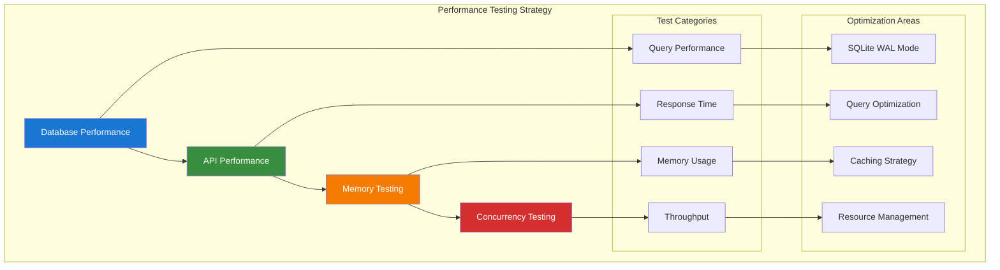

# Performance Testing Guide

## Table of Contents

- [Overview](#overview)
- [Database Performance Testing](#database-performance-testing)
- [API Performance Testing](#api-performance-testing)
- [Memory Usage Testing](#memory-usage-testing)
- [Concurrency Testing](#concurrency-testing)
- [SQLite Optimization Testing](#sqlite-optimization-testing)
- [Caching Performance Testing](#caching-performance-testing)
- [Load Testing](#load-testing)
- [Best Practices](#best-practices)

## Overview

Performance testing ensures that the Chinook application meets performance requirements under various load conditions. This guide covers comprehensive performance testing strategies for database operations, API endpoints, memory usage, and system optimization using Pest PHP framework with Laravel 12 patterns.

### Performance Testing Principles

- **Baseline Establishment**: Set performance benchmarks for all operations
- **Regression Prevention**: Detect performance degradation early
- **Scalability Validation**: Test system behavior under increasing load
- **Resource Optimization**: Identify and eliminate performance bottlenecks

### Performance Testing Architecture



## Database Performance Testing

### Query Performance Testing

```php
<?php

// tests/Performance/Database/QueryPerformanceTest.php
use App\Models\Artist;
use App\Models\Album;
use App\Models\Track;
use App\Models\Category;
use App\Enums\CategoryType;

describe('Database Query Performance', function () {
    beforeEach(function () {
        $this->createPerformanceTestData();
    });

    describe('Basic Query Performance', function () {
        it('performs simple select queries efficiently', function () {
            $startTime = microtime(true);
            
            $artists = Artist::limit(100)->get();
            
            $queryTime = (microtime(true) - $startTime) * 1000;
            
            expect($artists)->toHaveCount(100);
            expect($queryTime)->toBeLessThan(50); // Under 50ms
        });

        it('performs filtered queries efficiently', function () {
            $startTime = microtime(true);
            
            $activeArtists = Artist::where('is_active', true)
                ->where('country', 'USA')
                ->limit(50)
                ->get();
            
            $queryTime = (microtime(true) - $startTime) * 1000;
            
            expect($queryTime)->toBeLessThan(30); // Under 30ms
        });

        it('performs search queries efficiently', function () {
            $startTime = microtime(true);
            
            $searchResults = Artist::where('name', 'LIKE', '%Rock%')
                ->orWhere('biography', 'LIKE', '%Rock%')
                ->limit(20)
                ->get();
            
            $queryTime = (microtime(true) - $startTime) * 1000;
            
            expect($queryTime)->toBeLessThan(100); // Under 100ms
        });
    });

    describe('Complex Query Performance', function () {
        it('performs join queries efficiently', function () {
            $startTime = microtime(true);
            
            $artistsWithAlbums = Artist::with(['albums' => function ($query) {
                $query->limit(5);
            }])->limit(20)->get();
            
            $queryTime = (microtime(true) - $startTime) * 1000;
            
            expect($artistsWithAlbums)->toHaveCount(20);
            expect($queryTime)->toBeLessThan(150); // Under 150ms
        });

        it('performs nested relationship queries efficiently', function () {
            $startTime = microtime(true);
            
            $artistsWithTracksAndCategories = Artist::with([
                'albums.tracks.categories' => function ($query) {
                    $query->where('type', CategoryType::GENRE);
                }
            ])->limit(10)->get();
            
            $queryTime = (microtime(true) - $startTime) * 1000;
            
            expect($queryTime)->toBeLessThan(300); // Under 300ms
        });

        it('performs aggregation queries efficiently', function () {
            $startTime = microtime(true);
            
            $stats = [
                'total_artists' => Artist::count(),
                'total_albums' => Album::count(),
                'total_tracks' => Track::count(),
                'avg_album_tracks' => Album::withCount('tracks')->avg('tracks_count'),
                'total_duration' => Track::sum('milliseconds')
            ];
            
            $queryTime = (microtime(true) - $startTime) * 1000;
            
            expect($stats['total_artists'])->toBeGreaterThan(0);
            expect($queryTime)->toBeLessThan(200); // Under 200ms
        });
    });

    describe('Pagination Performance', function () {
        it('performs offset pagination efficiently', function () {
            $pageSize = 50;
            $pages = [0, 10, 50, 100]; // Test different offsets
            
            foreach ($pages as $page) {
                $startTime = microtime(true);
                
                $results = Artist::offset($page * $pageSize)
                    ->limit($pageSize)
                    ->get();
                
                $queryTime = (microtime(true) - $startTime) * 1000;
                
                expect($results)->toHaveCount($pageSize);
                expect($queryTime)->toBeLessThan(100); // Under 100ms even for deep pages
            }
        });

        it('performs cursor pagination efficiently', function () {
            $pageSize = 50;
            $lastId = 0;
            
            for ($i = 0; $i < 5; $i++) {
                $startTime = microtime(true);
                
                $results = Artist::where('id', '>', $lastId)
                    ->orderBy('id')
                    ->limit($pageSize)
                    ->get();
                
                $queryTime = (microtime(true) - $startTime) * 1000;
                
                if ($results->isNotEmpty()) {
                    $lastId = $results->last()->id;
                    expect($queryTime)->toBeLessThan(50); // Under 50ms
                }
            }
        });
    });

    describe('Bulk Operations Performance', function () {
        it('performs bulk inserts efficiently', function () {
            $data = [];
            for ($i = 0; $i < 1000; $i++) {
                $data[] = [
                    'name' => "Bulk Artist {$i}",
                    'country' => 'USA',
                    'formed_year' => 2000 + ($i % 23),
                    'is_active' => true,
                    'created_at' => now(),
                    'updated_at' => now(),
                ];
            }
            
            $startTime = microtime(true);
            
            Artist::insert($data);
            
            $insertTime = (microtime(true) - $startTime) * 1000;
            
            expect($insertTime)->toBeLessThan(500); // Under 500ms for 1000 records
        });

        it('performs bulk updates efficiently', function () {
            $artists = Artist::limit(500)->get();
            $artistIds = $artists->pluck('id')->toArray();
            
            $startTime = microtime(true);
            
            Artist::whereIn('id', $artistIds)
                ->update(['is_active' => false]);
            
            $updateTime = (microtime(true) - $startTime) * 1000;
            
            expect($updateTime)->toBeLessThan(200); // Under 200ms for 500 records
        });
    });

    private function createPerformanceTestData(): void
    {
        // Create test data if not exists
        if (Artist::count() < 1000) {
            Artist::factory()->count(1000)->create();
            Album::factory()->count(3000)->create();
            Track::factory()->count(15000)->create();
            Category::factory()->count(100)->create();
        }
    }
});
```

## API Performance Testing

### Endpoint Response Time Testing

```php
<?php

// tests/Performance/Api/ApiPerformanceTest.php
use App\Models\User;
use App\Models\Artist;
use App\Models\Track;
use Laravel\Sanctum\Sanctum;

describe('API Performance Testing', function () {
    beforeEach(function () {
        $this->user = User::factory()->create();
        Sanctum::actingAs($this->user);
        $this->createApiTestData();
    });

    describe('Artist API Performance', function () {
        it('responds to artist list requests quickly', function () {
            $startTime = microtime(true);

            $response = $this->getJson('/api/artists?per_page=50');

            $responseTime = (microtime(true) - $startTime) * 1000;

            $response->assertOk();
            expect($responseTime)->toBeLessThan(200); // Under 200ms
        });

        it('responds to artist detail requests quickly', function () {
            $artist = Artist::first();

            $startTime = microtime(true);

            $response = $this->getJson("/api/artists/{$artist->slug}");

            $responseTime = (microtime(true) - $startTime) * 1000;

            $response->assertOk();
            expect($responseTime)->toBeLessThan(100); // Under 100ms
        });

        it('handles artist search requests efficiently', function () {
            $startTime = microtime(true);

            $response = $this->getJson('/api/artists?search=rock&per_page=20');

            $responseTime = (microtime(true) - $startTime) * 1000;

            $response->assertOk();
            expect($responseTime)->toBeLessThan(250); // Under 250ms
        });

        it('handles filtered artist requests efficiently', function () {
            $startTime = microtime(true);

            $response = $this->getJson('/api/artists?country=USA&is_active=1&per_page=30');

            $responseTime = (microtime(true) - $startTime) * 1000;

            $response->assertOk();
            expect($responseTime)->toBeLessThan(150); // Under 150ms
        });
    });

    describe('Track API Performance', function () {
        it('responds to track list requests quickly', function () {
            $startTime = microtime(true);

            $response = $this->getJson('/api/tracks?per_page=100');

            $responseTime = (microtime(true) - $startTime) * 1000;

            $response->assertOk();
            expect($responseTime)->toBeLessThan(300); // Under 300ms
        });

        it('handles track search with relationships efficiently', function () {
            $startTime = microtime(true);

            $response = $this->getJson('/api/tracks?include=album,artist,categories&search=rock&per_page=20');

            $responseTime = (microtime(true) - $startTime) * 1000;

            $response->assertOk();
            expect($responseTime)->toBeLessThan(400); // Under 400ms with relationships
        });

        it('handles genre filtering efficiently', function () {
            $startTime = microtime(true);

            $response = $this->getJson('/api/tracks?genre=rock&per_page=50');

            $responseTime = (microtime(true) - $startTime) * 1000;

            $response->assertOk();
            expect($responseTime)->toBeLessThan(200); // Under 200ms
        });
    });

    describe('Concurrent API Requests', function () {
        it('handles multiple concurrent requests efficiently', function () {
            $requests = [];
            $startTime = microtime(true);

            // Simulate 10 concurrent requests
            for ($i = 0; $i < 10; $i++) {
                $requests[] = function () {
                    return $this->getJson('/api/artists?per_page=20');
                };
            }

            // Execute requests
            $responses = [];
            foreach ($requests as $request) {
                $responses[] = $request();
            }

            $totalTime = (microtime(true) - $startTime) * 1000;
            $avgTime = $totalTime / 10;

            foreach ($responses as $response) {
                $response->assertOk();
            }

            expect($avgTime)->toBeLessThan(300); // Average under 300ms
        });

        it('maintains performance under load', function () {
            $requestCount = 50;
            $responseTimes = [];

            for ($i = 0; $i < $requestCount; $i++) {
                $startTime = microtime(true);

                $response = $this->getJson('/api/artists?per_page=10');

                $responseTime = (microtime(true) - $startTime) * 1000;
                $responseTimes[] = $responseTime;

                $response->assertOk();
            }

            $avgResponseTime = array_sum($responseTimes) / count($responseTimes);
            $maxResponseTime = max($responseTimes);

            expect($avgResponseTime)->toBeLessThan(200); // Average under 200ms
            expect($maxResponseTime)->toBeLessThan(500); // Max under 500ms
        });
    });

    private function createApiTestData(): void
    {
        if (Artist::count() < 100) {
            Artist::factory()->count(100)->create();
            Track::factory()->count(500)->create();
        }
    }
});
```

## Memory Usage Testing

### Memory Consumption Testing

```php
<?php

// tests/Performance/Memory/MemoryUsageTest.php
use App\Models\Artist;
use App\Models\Album;
use App\Models\Track;

describe('Memory Usage Testing', function () {
    describe('Model Loading Memory Usage', function () {
        it('loads large collections efficiently', function () {
            $startMemory = memory_get_usage(true);

            $artists = Artist::limit(1000)->get();

            $endMemory = memory_get_usage(true);
            $memoryUsed = ($endMemory - $startMemory) / 1024 / 1024; // MB

            expect($artists)->toHaveCount(1000);
            expect($memoryUsed)->toBeLessThan(50); // Under 50MB
        });

        it('handles relationship loading efficiently', function () {
            $startMemory = memory_get_usage(true);

            $artistsWithAlbums = Artist::with('albums')->limit(100)->get();

            $endMemory = memory_get_usage(true);
            $memoryUsed = ($endMemory - $startMemory) / 1024 / 1024; // MB

            expect($memoryUsed)->toBeLessThan(30); // Under 30MB
        });

        it('processes large datasets with chunking', function () {
            $peakMemory = 0;
            $processedCount = 0;

            Track::chunk(500, function ($tracks) use (&$peakMemory, &$processedCount) {
                $currentMemory = memory_get_usage(true) / 1024 / 1024;
                $peakMemory = max($peakMemory, $currentMemory);
                $processedCount += $tracks->count();

                // Simulate processing
                foreach ($tracks as $track) {
                    $track->formatted_duration;
                }
            });

            expect($processedCount)->toBeGreaterThan(1000);
            expect($peakMemory)->toBeLessThan(100); // Under 100MB peak
        });
    });

    describe('Memory Leak Detection', function () {
        it('releases memory after operations', function () {
            $baselineMemory = memory_get_usage(true);

            // Perform memory-intensive operation
            for ($i = 0; $i < 10; $i++) {
                $artists = Artist::with(['albums.tracks'])->limit(50)->get();
                $artists = null; // Release reference
            }

            gc_collect_cycles(); // Force garbage collection

            $finalMemory = memory_get_usage(true);
            $memoryDifference = ($finalMemory - $baselineMemory) / 1024 / 1024;

            expect($memoryDifference)->toBeLessThan(20); // Under 20MB difference
        });

        it('handles long-running processes efficiently', function () {
            $initialMemory = memory_get_usage(true);
            $memoryReadings = [];

            for ($i = 0; $i < 100; $i++) {
                $artists = Artist::limit(10)->get();

                // Process data
                foreach ($artists as $artist) {
                    $artist->name;
                    $artist->country;
                }

                $artists = null;

                if ($i % 10 === 0) {
                    gc_collect_cycles();
                    $memoryReadings[] = memory_get_usage(true);
                }
            }

            // Memory should not continuously increase
            $memoryGrowth = end($memoryReadings) - $memoryReadings[0];
            $memoryGrowthMB = $memoryGrowth / 1024 / 1024;

            expect($memoryGrowthMB)->toBeLessThan(10); // Under 10MB growth
        });
    });
});
```

## Concurrency Testing

### Database Concurrency Testing

```php
<?php

// tests/Performance/Concurrency/ConcurrencyTest.php
use App\Models\Artist;
use App\Models\Track;
use App\Models\Invoice;
use App\Models\InvoiceLine;

describe('Concurrency Testing', function () {
    describe('Database Concurrency', function () {
        it('handles concurrent reads efficiently', function () {
            $startTime = microtime(true);
            $results = [];

            // Simulate 20 concurrent read operations
            for ($i = 0; $i < 20; $i++) {
                $results[] = function () {
                    return Artist::with('albums')->limit(10)->get();
                };
            }

            // Execute concurrent operations
            $responses = [];
            foreach ($results as $operation) {
                $responses[] = $operation();
            }

            $totalTime = (microtime(true) - $startTime) * 1000;
            $avgTime = $totalTime / 20;

            expect($avgTime)->toBeLessThan(100); // Average under 100ms

            foreach ($responses as $response) {
                expect($response)->toHaveCount(10);
            }
        });

        it('handles concurrent writes safely', function () {
            $results = [];

            // Simulate concurrent write operations
            for ($i = 0; $i < 10; $i++) {
                $results[] = DB::transaction(function () use ($i) {
                    return Artist::create([
                        'name' => "Concurrent Artist {$i}",
                        'country' => 'USA',
                        'formed_year' => 2000 + $i,
                        'is_active' => true,
                    ]);
                });
            }

            // All operations should succeed
            expect($results)->toHaveCount(10);
            foreach ($results as $artist) {
                expect($artist)->toBeInstanceOf(Artist::class);
                expect($artist->id)->toBeGreaterThan(0);
            }
        });

        it('handles mixed read-write operations', function () {
            $operations = [];

            // Mix of read and write operations
            for ($i = 0; $i < 20; $i++) {
                if ($i % 2 === 0) {
                    // Read operation
                    $operations[] = function () {
                        return Artist::limit(5)->get();
                    };
                } else {
                    // Write operation
                    $operations[] = function () use ($i) {
                        return Artist::create([
                            'name' => "Mixed Op Artist {$i}",
                            'country' => 'USA',
                            'formed_year' => 2000,
                            'is_active' => true,
                        ]);
                    };
                }
            }

            $startTime = microtime(true);

            $results = [];
            foreach ($operations as $operation) {
                $results[] = $operation();
            }

            $totalTime = (microtime(true) - $startTime) * 1000;

            expect($totalTime)->toBeLessThan(2000); // Under 2 seconds total
            expect($results)->toHaveCount(20);
        });
    });

    describe('Transaction Performance', function () {
        it('handles complex transactions efficiently', function () {
            $startTime = microtime(true);

            $result = DB::transaction(function () {
                $artist = Artist::create([
                    'name' => 'Transaction Test Artist',
                    'country' => 'USA',
                    'formed_year' => 2020,
                    'is_active' => true,
                ]);

                $album = Album::create([
                    'title' => 'Transaction Test Album',
                    'artist_id' => $artist->id,
                    'release_date' => now(),
                ]);

                for ($i = 0; $i < 10; $i++) {
                    Track::create([
                        'name' => "Track {$i}",
                        'album_id' => $album->id,
                        'track_number' => $i + 1,
                        'milliseconds' => 180000,
                        'unit_price' => 0.99,
                    ]);
                }

                return $artist;
            });

            $transactionTime = (microtime(true) - $startTime) * 1000;

            expect($result)->toBeInstanceOf(Artist::class);
            expect($transactionTime)->toBeLessThan(500); // Under 500ms
        });

        it('handles transaction rollbacks efficiently', function () {
            $initialCount = Artist::count();

            try {
                DB::transaction(function () {
                    Artist::create([
                        'name' => 'Rollback Test Artist',
                        'country' => 'USA',
                        'formed_year' => 2020,
                        'is_active' => true,
                    ]);

                    // Force rollback
                    throw new \Exception('Forced rollback');
                });
            } catch (\Exception $e) {
                // Expected exception
            }

            $finalCount = Artist::count();
            expect($finalCount)->toBe($initialCount);
        });
    });
});
```

## SQLite Optimization Testing

### WAL Mode Performance Testing

```php
<?php

// tests/Performance/Database/SqliteOptimizationTest.php

describe('SQLite Optimization Testing', function () {
    describe('WAL Mode Performance', function () {
        it('validates WAL mode is enabled', function () {
            $walMode = DB::select("PRAGMA journal_mode")[0]->journal_mode ?? '';

            expect($walMode)->toBe('wal');
        });

        it('tests WAL mode write performance', function () {
            $startTime = microtime(true);

            for ($i = 0; $i < 100; $i++) {
                Artist::create([
                    'name' => "WAL Test Artist {$i}",
                    'country' => 'USA',
                    'formed_year' => 2000 + ($i % 23),
                    'is_active' => true,
                ]);
            }

            $writeTime = (microtime(true) - $startTime) * 1000;
            $avgWriteTime = $writeTime / 100;

            expect($avgWriteTime)->toBeLessThan(10); // Under 10ms per write
        });

        it('tests concurrent read-write performance', function () {
            $writeOperations = [];
            $readOperations = [];

            // Prepare operations
            for ($i = 0; $i < 10; $i++) {
                $writeOperations[] = function () use ($i) {
                    return Artist::create([
                        'name' => "Concurrent WAL Artist {$i}",
                        'country' => 'USA',
                        'formed_year' => 2000,
                        'is_active' => true,
                    ]);
                };

                $readOperations[] = function () {
                    return Artist::limit(10)->get();
                };
            }

            $startTime = microtime(true);

            // Execute mixed operations
            $results = [];
            for ($i = 0; $i < 10; $i++) {
                $results[] = $writeOperations[$i]();
                $results[] = $readOperations[$i]();
            }

            $totalTime = (microtime(true) - $startTime) * 1000;

            expect($totalTime)->toBeLessThan(1000); // Under 1 second
            expect($results)->toHaveCount(20);
        });
    });

    describe('SQLite Configuration Optimization', function () {
        it('validates optimized PRAGMA settings', function () {
            $settings = [
                'synchronous' => DB::select("PRAGMA synchronous")[0]->synchronous ?? 0,
                'cache_size' => abs(DB::select("PRAGMA cache_size")[0]->cache_size ?? 0),
                'temp_store' => DB::select("PRAGMA temp_store")[0]->temp_store ?? 0,
            ];

            expect($settings['synchronous'])->toBe(1); // NORMAL
            expect($settings['cache_size'])->toBeGreaterThan(5000); // At least 5MB
            expect($settings['temp_store'])->toBe(2); // MEMORY
        });

        it('tests query performance with optimized settings', function () {
            $startTime = microtime(true);

            $complexQuery = Artist::join('albums', 'artists.id', '=', 'albums.artist_id')
                ->join('tracks', 'albums.id', '=', 'tracks.album_id')
                ->select('artists.name', DB::raw('COUNT(tracks.id) as track_count'))
                ->groupBy('artists.id', 'artists.name')
                ->having('track_count', '>', 5)
                ->limit(50)
                ->get();

            $queryTime = (microtime(true) - $startTime) * 1000;

            expect($queryTime)->toBeLessThan(200); // Under 200ms
        });
    });
});
```

## Caching Performance Testing

### Cache Effectiveness Testing

```php
<?php

// tests/Performance/Cache/CachePerformanceTest.php
use App\Models\Artist;
use App\Models\Category;
use Illuminate\Support\Facades\Cache;

describe('Caching Performance Testing', function () {
    describe('Query Result Caching', function () {
        it('improves query performance with caching', function () {
            $cacheKey = 'popular_artists';

            // First query - cache miss
            $startTime = microtime(true);
            $artists1 = Cache::remember($cacheKey, 3600, function () {
                return Artist::with('albums')
                    ->where('is_active', true)
                    ->limit(20)
                    ->get();
            });
            $firstQueryTime = (microtime(true) - $startTime) * 1000;

            // Second query - cache hit
            $startTime = microtime(true);
            $artists2 = Cache::get($cacheKey);
            $secondQueryTime = (microtime(true) - $startTime) * 1000;

            expect($artists1->count())->toBe($artists2->count());
            expect($secondQueryTime)->toBeLessThan($firstQueryTime / 10); // Cache should be 10x faster
        });

        it('handles cache invalidation efficiently', function () {
            $cacheKey = 'artist_categories';

            // Cache initial data
            $categories = Cache::remember($cacheKey, 3600, function () {
                return Category::where('type', CategoryType::GENRE)->get();
            });

            expect(Cache::has($cacheKey))->toBeTrue();

            // Invalidate cache
            $startTime = microtime(true);
            Cache::forget($cacheKey);
            $invalidationTime = (microtime(true) - $startTime) * 1000;

            expect(Cache::has($cacheKey))->toBeFalse();
            expect($invalidationTime)->toBeLessThan(10); // Under 10ms
        });

        it('handles cache warming efficiently', function () {
            $cacheKeys = [
                'popular_artists' => fn() => Artist::where('is_active', true)->limit(50)->get(),
                'recent_albums' => fn() => Album::orderBy('release_date', 'desc')->limit(30)->get(),
                'top_tracks' => fn() => Track::orderBy('unit_price', 'desc')->limit(100)->get(),
            ];

            $startTime = microtime(true);

            foreach ($cacheKeys as $key => $query) {
                Cache::remember($key, 3600, $query);
            }

            $warmingTime = (microtime(true) - $startTime) * 1000;

            expect($warmingTime)->toBeLessThan(1000); // Under 1 second

            // Verify all caches are set
            foreach (array_keys($cacheKeys) as $key) {
                expect(Cache::has($key))->toBeTrue();
            }
        });
    });

    describe('Cache Storage Performance', function () {
        it('tests cache write performance', function () {
            $data = Artist::limit(100)->get()->toArray();

            $startTime = microtime(true);

            for ($i = 0; $i < 50; $i++) {
                Cache::put("test_key_{$i}", $data, 3600);
            }

            $writeTime = (microtime(true) - $startTime) * 1000;
            $avgWriteTime = $writeTime / 50;

            expect($avgWriteTime)->toBeLessThan(20); // Under 20ms per write
        });

        it('tests cache read performance', function () {
            $data = Artist::limit(100)->get()->toArray();

            // Pre-populate cache
            for ($i = 0; $i < 50; $i++) {
                Cache::put("read_test_key_{$i}", $data, 3600);
            }

            $startTime = microtime(true);

            for ($i = 0; $i < 50; $i++) {
                $cached = Cache::get("read_test_key_{$i}");
                expect($cached)->not->toBeNull();
            }

            $readTime = (microtime(true) - $startTime) * 1000;
            $avgReadTime = $readTime / 50;

            expect($avgReadTime)->toBeLessThan(5); // Under 5ms per read
        });
    });
});
```

## Load Testing

### Application Load Testing

```php
<?php

// tests/Performance/Load/LoadTest.php
use App\Models\User;
use Laravel\Sanctum\Sanctum;

describe('Load Testing', function () {
    describe('API Load Testing', function () {
        it('handles sustained API load', function () {
            $user = User::factory()->create();
            Sanctum::actingAs($user);

            $requestCount = 100;
            $responseTimes = [];
            $errors = 0;

            for ($i = 0; $i < $requestCount; $i++) {
                $startTime = microtime(true);

                try {
                    $response = $this->getJson('/api/artists?per_page=10');
                    $responseTime = (microtime(true) - $startTime) * 1000;
                    $responseTimes[] = $responseTime;

                    if (!$response->isOk()) {
                        $errors++;
                    }
                } catch (\Exception $e) {
                    $errors++;
                }
            }

            $avgResponseTime = array_sum($responseTimes) / count($responseTimes);
            $maxResponseTime = max($responseTimes);
            $errorRate = ($errors / $requestCount) * 100;

            expect($avgResponseTime)->toBeLessThan(300); // Average under 300ms
            expect($maxResponseTime)->toBeLessThan(1000); // Max under 1 second
            expect($errorRate)->toBeLessThan(5); // Error rate under 5%
        });

        it('handles burst traffic', function () {
            $user = User::factory()->create();
            Sanctum::actingAs($user);

            $burstSize = 50;
            $responses = [];

            $startTime = microtime(true);

            // Simulate burst of concurrent requests
            for ($i = 0; $i < $burstSize; $i++) {
                $responses[] = $this->getJson('/api/tracks?per_page=5');
            }

            $totalTime = (microtime(true) - $startTime) * 1000;
            $throughput = $burstSize / ($totalTime / 1000); // Requests per second

            foreach ($responses as $response) {
                $response->assertOk();
            }

            expect($throughput)->toBeGreaterThan(10); // At least 10 requests/second
        });
    });

    describe('Database Load Testing', function () {
        it('handles high query volume', function () {
            $queryCount = 200;
            $queryTimes = [];

            for ($i = 0; $i < $queryCount; $i++) {
                $startTime = microtime(true);

                $result = Artist::where('is_active', true)
                    ->limit(10)
                    ->get();

                $queryTime = (microtime(true) - $startTime) * 1000;
                $queryTimes[] = $queryTime;

                expect($result)->toHaveCount(10);
            }

            $avgQueryTime = array_sum($queryTimes) / count($queryTimes);
            $maxQueryTime = max($queryTimes);

            expect($avgQueryTime)->toBeLessThan(50); // Average under 50ms
            expect($maxQueryTime)->toBeLessThan(200); // Max under 200ms
        });

        it('maintains performance under write load', function () {
            $writeCount = 100;
            $writeTimes = [];

            for ($i = 0; $i < $writeCount; $i++) {
                $startTime = microtime(true);

                $artist = Artist::create([
                    'name' => "Load Test Artist {$i}",
                    'country' => 'USA',
                    'formed_year' => 2000 + ($i % 23),
                    'is_active' => true,
                ]);

                $writeTime = (microtime(true) - $startTime) * 1000;
                $writeTimes[] = $writeTime;

                expect($artist->id)->toBeGreaterThan(0);
            }

            $avgWriteTime = array_sum($writeTimes) / count($writeTimes);
            $maxWriteTime = max($writeTimes);

            expect($avgWriteTime)->toBeLessThan(100); // Average under 100ms
            expect($maxWriteTime)->toBeLessThan(300); // Max under 300ms
        });
    });
});
```

## Best Practices

### Performance Testing Guidelines

1. **Baseline Establishment**: Set clear performance benchmarks for all operations
2. **Regression Testing**: Include performance tests in CI/CD pipeline
3. **Real-world Scenarios**: Test with realistic data volumes and usage patterns
4. **Resource Monitoring**: Track CPU, memory, and I/O usage during tests
5. **Bottleneck Identification**: Use profiling tools to identify performance issues

### Test Organization

```text
tests/Performance/
├── Database/
│   ├── QueryPerformanceTest.php
│   └── SqliteOptimizationTest.php
├── Api/
│   └── ApiPerformanceTest.php
├── Memory/
│   └── MemoryUsageTest.php
├── Cache/
│   └── CachePerformanceTest.php
├── Concurrency/
│   └── ConcurrencyTest.php
└── Load/
    └── LoadTest.php
```

### Performance Benchmarks

- **Database Queries**: < 100ms for complex queries, < 50ms for simple queries
- **API Responses**: < 200ms for list endpoints, < 100ms for detail endpoints
- **Memory Usage**: < 50MB for large collections, < 100MB peak usage
- **Concurrency**: Handle 50+ concurrent requests without degradation
- **Cache Performance**: 10x improvement over database queries

### Monitoring and Alerting

1. **Response Time Monitoring**: Track API response times in production
2. **Database Performance**: Monitor query execution times and slow queries
3. **Memory Usage**: Alert on excessive memory consumption
4. **Error Rate Monitoring**: Track error rates under load
5. **Resource Utilization**: Monitor CPU, memory, and disk usage

---

**Navigation:**

- **Previous:** [Hierarchical Data Testing](080-hierarchical-data-testing.md)
- **Next:** [Testing Index Updates](000-testing-index.md)
- **Up:** [Testing Documentation](000-testing-index.md)
