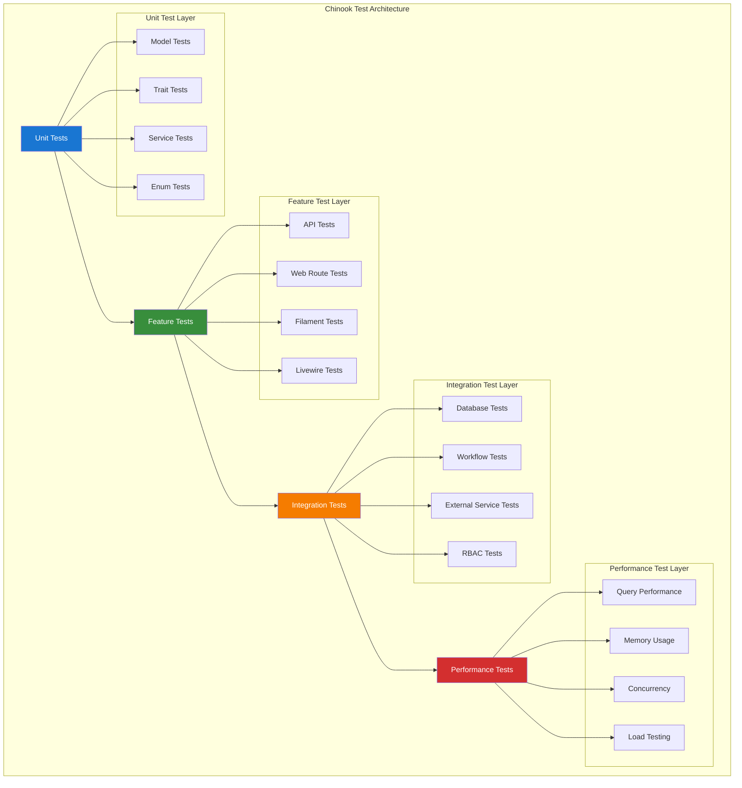
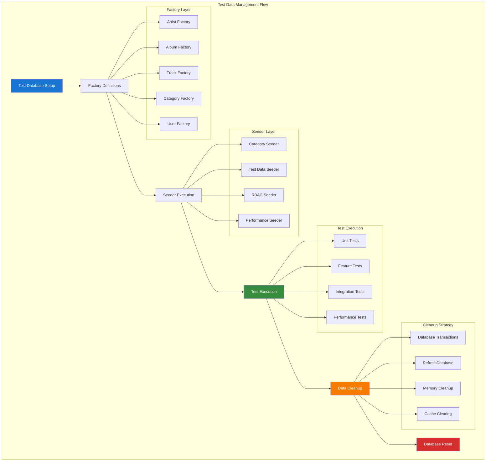
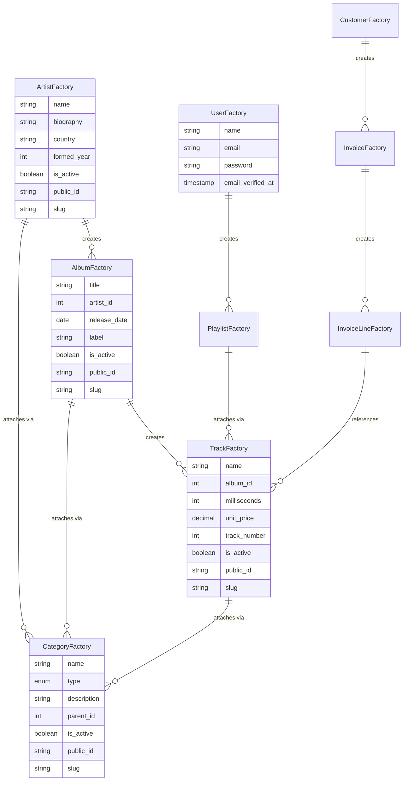
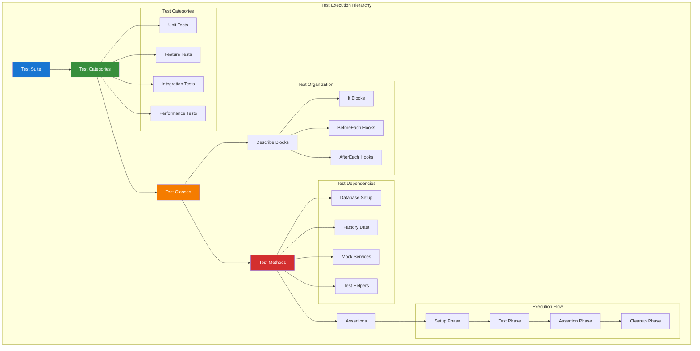
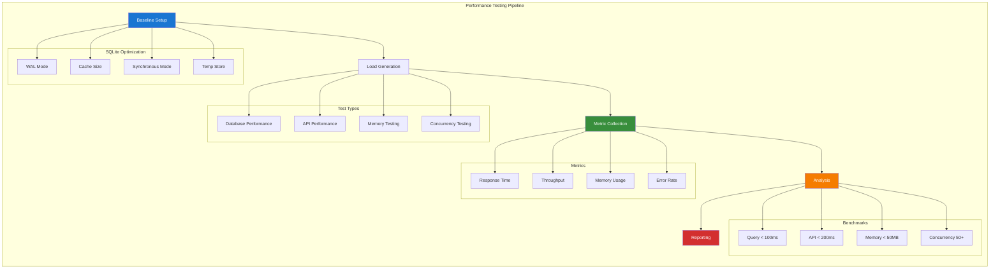
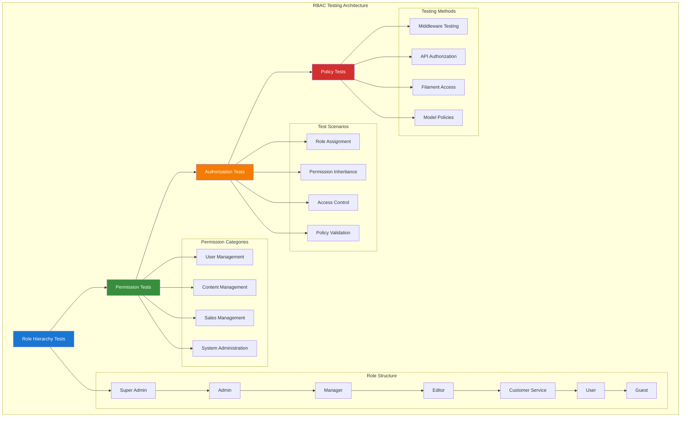
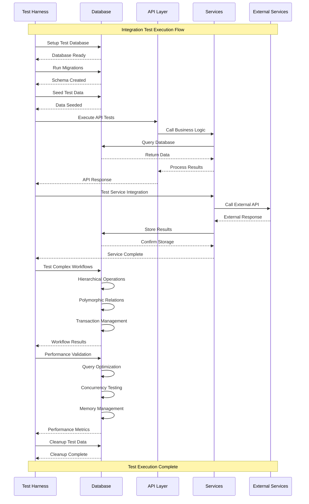

# Test Architecture Diagrams

## Table of Contents

- [Overview](#overview)
- [Test Layer Architecture](#test-layer-architecture)
- [Test Data Flow](#test-data-flow)
- [Factory Relationship Diagram](#factory-relationship-diagram)
- [Testing Hierarchy](#testing-hierarchy)
- [Performance Testing Flow](#performance-testing-flow)
- [RBAC Testing Structure](#rbac-testing-structure)
- [Trait Testing Dependencies](#trait-testing-dependencies)
- [Integration Test Flow](#integration-test-flow)

## Overview

This document contains comprehensive Mermaid v10.6+ diagrams for the Chinook test suite architecture. All diagrams follow WCAG 2.1 AA compliance standards with high-contrast color palette: #1976d2 (blue), #388e3c (green), #f57c00 (orange), #d32f2f (red).

## Test Layer Architecture

## Test Data Flow

## Factory Relationship Diagram

## Testing Hierarchy

## Performance Testing Flow

## RBAC Testing Structure

## Trait Testing Dependencies

```mermaid
graph LR
    subgraph "Trait Testing Dependencies"
        A[HasSecondaryUniqueKey] --> B[Key Generation]
        A --> C[Query Methods]
        A --> D[Validation]

        E[HasSlug] --> F[Slug Generation]
        E --> G[Route Binding]
        E --> H[Immutability]

        I[Categorizable] --> J[Polymorphic Relations]
        I --> K[Category Filtering]
        I --> L[Type Validation]

        M[HasTags] --> N[Tag Management]
        M --> O[Tag Queries]
        M --> P[Normalization]

        Q[Userstamps] --> R[Creation Tracking]
        Q --> S[Update Tracking]
        Q --> T[User Relations]

        U[SoftDeletes] --> V[Soft Delete Ops]
        U --> W[Query Scopes]
        U --> X[Relationship Handling]

        subgraph "Trait Interactions"
            Y[HasSecondaryUniqueKey + HasSlug]
            Z[Categorizable + HasTags]
            AA[SoftDeletes + Userstamps]
        end

        A --> Y
        E --> Y
        I --> Z
        M --> Z
        Q --> AA
        U --> AA

        subgraph "Test Coverage"
            BB[Functionality Tests]
            CC[Edge Case Tests]
            DD[Integration Tests]
            EE[Performance Tests]
        end

        B --> BB
        F --> BB
        J --> BB
        N --> BB
        R --> BB
        V --> BB

        D --> CC
        H --> CC
        L --> CC
        P --> CC
        T --> CC
        X --> CC

        Y --> DD
        Z --> DD
        AA --> DD

        C --> EE
        G --> EE
        K --> EE
        O --> EE
        S --> EE
        W --> EE
    end

    style A fill:#1976d2,color:#fff
    style I fill:#388e3c,color:#fff
    style Q fill:#f57c00,color:#fff
    style U fill:#d32f2f,color:#fff
```

## Integration Test Flow

---

**Navigation:**

- **Previous:** [Performance Testing Guide](../090-performance-testing-guide.md)
- **Next:** [Testing Index System](../index/testing-index-system.md)
- **Up:** [Testing Documentation](../000-testing-index.md)
