# Comprehensive Software Project Documentation Deliverables

## Including Security, Performance, and TDD Requirements

**Estimated Reading Time:** 45 minutes

## Table of Contents
<details><summary>Table of Contents></summary>

### Part I: Foundation
1. [Executive Summary](#1-executive-summary)
   - 1.1 [Key Benefits](#11-key-benefits)
   - 1.2 [Target Deliverables](#12-target-deliverables)
2. [Learning Objectives](#2-learning-objectives)
3. [Prerequisites](#3-prerequisites)
   - 3.1 [Required Knowledge](#31-required-knowledge)
   - 3.2 [Recommended Experience](#32-recommended-experience)
   - 3.3 [Technical Requirements](#33-technical-requirements)
4. [Development Methodology Selection](#4-development-methodology-selection)
   - 4.1 [Methodology Comparison Matrix](#41-methodology-comparison-matrix)
   - 4.2 [Methodology Overview](#42-methodology-overview)
   - 4.3 [Waterfall Methodology](#43-waterfall-methodology)
   - 4.4 [Agile Methodology](#44-agile-methodology)
   - 4.5 [Methodology Selection Framework](#45-methodology-selection-framework)
   - 4.6 [Deliverable Transformation Matrix](#46-deliverable-transformation-matrix)
   - 4.7 [Decision Matrix](#47-decision-matrix)
   - 4.8 [Deliverable Timing Comparison](#48-deliverable-timing-comparison)

### Part II: Architectural Overview
5. [Architectural Overview](#5-architectural-overview)
   - 5.1 [Project Lifecycle Framework](#51-project-lifecycle-framework)
   - 5.2 [Agile Integration Framework](#52-agile-integration-framework)
   - 5.3 [Laravel 12.x Integration Points](#53-laravel-12x-integration-points)
6. [Core Concepts](#6-core-concepts)
   - 6.1 [Documentation Lifecycle Management](#61-documentation-lifecycle-management)
     - 6.1.1 [Accessibility and Contrast Compliance](#611-accessibility-and-contrast-compliance) ♿
   - 6.2 [Security-First Documentation](#62-security-first-documentation)
   - 6.3 [Performance-Driven Documentation](#63-performance-driven-documentation)
   - 6.4 [Test-Driven Documentation (TDD)](#64-test-driven-documentation-tdd)
   - 6.5 [Agile Documentation Strategies](#65-agile-documentation-strategies)
7. [Implementation Principles](#7-implementation-principles)
   - 7.1 [Laravel 12.x Specific Principles](#71-laravel-12x-specific-principles)
   - 7.2 [Database-First Documentation](#72-database-first-documentation)
   - 7.3 [Package Management Integration](#73-package-management-integration)
   - 7.4 [Testing Integration Principles](#74-testing-integration-principles)

### Part III: Waterfall Methodology
8. [Waterfall Overview and Principles](#8-waterfall-overview-and-principles)
   - 8.1 [Waterfall Methodology Fundamentals](#81-waterfall-methodology-fundamentals)
   - 8.2 [Waterfall Phase Structure](#82-waterfall-phase-structure)
   - 8.3 [Waterfall Documentation Standards](#83-waterfall-documentation-standards)
9. [Waterfall Phase-by-Phase Guide](#9-waterfall-phase-by-phase-guide)
   - 9.1 [Phase Overview](#91-phase-overview)
   - 9.2 [Phase Implementation Guidelines](#92-phase-implementation-guidelines)
   - 9.3 [Phase Transition Management](#93-phase-transition-management)
10. [Waterfall Quality Gates](#10-waterfall-quality-gates)
   - 10.1 [Phase Gate Structure](#101-phase-gate-structure)
   - 10.2 [Requirements Phase Gate](#102-requirements-phase-gate)
   - 10.3 [Design Phase Gate](#103-design-phase-gate)

### Part IV: Agile Methodology
11. [Agile Overview and Principles](#11-agile-overview-and-principles)
   - 11.1 [Agile Methodology Fundamentals](#111-agile-methodology-fundamentals)
   - 11.2 [Agile Sprint Structure](#112-agile-sprint-structure)
   - 11.3 [Agile Documentation Standards](#113-agile-documentation-standards)
12. [Agile Sprint-by-Sprint Guide](#12-agile-sprint-by-sprint-guide)
   - 12.1 [Sprint 0: Foundation Sprint](#121-sprint-0-foundation-sprint)
   - 12.2 [Sprint 1-3: MVP Development](#122-sprint-1-3-mvp-development)
   - 12.3 [Sprint 4-6: Feature Enhancement](#123-sprint-4-6-feature-enhancement)
   - 12.4 [Sprint 7-9: Integration and Polish](#124-sprint-7-9-integration-and-polish)
   - 12.5 [Agile Quality Gates](#125-agile-quality-gates)
13. [Agile Ceremonies and Artifacts](#13-agile-ceremonies-and-artifacts)
   - 13.1 [Sprint Planning Ceremony](#131-sprint-planning-ceremony)
   - 13.2 [Daily Standup Ceremony](#132-daily-standup-ceremony)
   - 13.3 [Sprint Review Ceremony](#133-sprint-review-ceremony)
   - 13.4 [Sprint Retrospective Ceremony](#134-sprint-retrospective-ceremony)

### Part V: Hybrid and Common Elements
14. [Hybrid Methodology Approaches](#14-hybrid-methodology-approaches)
   - 14.1 [Water-Scrum-Fall](#141-water-scrum-fall)
   - 14.2 [Scaled Agile Framework (SAFe)](#142-scaled-agile-framework-safe)
   - 14.3 [Disciplined Agile](#143-disciplined-agile)
   - 14.4 [Hybrid Implementation Guidelines](#144-hybrid-implementation-guidelines)
15. [Security and Performance Integration](#15-security-and-performance-integration)
16. [Testing & Validation](#16-testing--validation)
   - 16.1 [Test Specification Requirements](#161-test-specification-requirements)
   - 16.2 [Documentation Testing Framework](#162-documentation-testing-framework)
   - 16.3 [Unit Test Examples](#163-unit-test-examples)
17. [Code Examples](#17-code-examples)
   - 17.1 [Laravel 12.x Service Provider Registration](#171-laravel-12x-service-provider-registration)
   - 17.2 [FilamentPHP v4 Panel Configuration](#172-filamentphp-v4-panel-configuration)
   - 17.3 [Database Migration with Documentation](#173-database-migration-with-documentation)
   - 17.4 [Model with Documentation Standards](#174-model-with-documentation-standards)
   - 17.5 [PHP 8.1+ Enum Implementation](#175-php-81-enum-implementation)
   - 17.6 [Test Factory with Documentation Standards](#176-test-factory-with-documentation-standards)

### Part VI: Implementation Support
18. [Common Pitfalls](#18-common-pitfalls)
   - 18.1 [Junior Developer Challenges](#181-junior-developer-challenges)
   - 18.2 [Laravel/FilamentPHP Specific Pitfalls](#182-laravelfilamentphp-specific-pitfalls)
   - 18.3 [Testing and Validation Pitfalls](#183-testing-and-validation-pitfalls)
19. [Best Practices](#19-best-practices)
   - 19.1 [Laravel 12.x Documentation Best Practices](#191-laravel-12x-documentation-best-practices)
   - 19.2 [FilamentPHP v4 Documentation Best Practices](#192-filamentphp-v4-documentation-best-practices)
   - 19.3 [Security Documentation Best Practices](#193-security-documentation-best-practices)
   - 19.4 [Performance Documentation Best Practices](#194-performance-documentation-best-practices)
   - 19.5 [Testing Documentation Best Practices](#195-testing-documentation-best-practices)
   - 19.6 [Agile Documentation Best Practices](#196-agile-documentation-best-practices)
   - 19.7 [Quality Assurance Best Practices](#197-quality-assurance-best-practices)
20. [Integration Points](#20-integration-points)
   - 20.1 [Package Management Integration](#201-package-management-integration)
   - 20.2 [Service Provider Integration](#202-service-provider-integration)
   - 20.3 [Database Integration Points](#203-database-integration-points)
   - 20.4 [Testing Framework Integration](#204-testing-framework-integration)
21. [Templates Directory](#21-templates-directory)
   - 21.1 [Template Organization Structure](#211-template-organization-structure)
   - 21.2 [Template Customization Guidelines](#212-template-customization-guidelines)
   - 21.3 [Template Maintenance Schedule](#213-template-maintenance-schedule)
   - 21.4 [Visual Template Examples](#214-visual-template-examples)
22. [Community Contribution Framework](#22-community-contribution-framework)
   - 22.1 [Contribution Guidelines](#221-contribution-guidelines)
   - 22.2 [Submission Procedures](#222-submission-procedures)
   - 22.3 [Review and Approval Process](#223-review-and-approval-process)
   - 22.4 [Community Feedback Mechanisms](#224-community-feedback-mechanisms)
23. [Recognition and Attribution](#23-recognition-and-attribution)
   - 23.1 [Contributor Recognition](#231-contributor-recognition)
   - 23.2 [Attribution Standards](#232-attribution-standards)
24. [Decision Trees and Quick Navigation](#24-decision-trees-and-quick-navigation)
   - 24.1 [Quick Navigation Guide](#241-quick-navigation-guide)
   - 24.2 [Template Selection Decision Tree](#242-template-selection-decision-tree)
   - 24.3 [Template Usage Guidelines](#243-template-usage-guidelines)
25. [Further Reading](#25-further-reading)
   - 25.1 [Laravel Official Documentation (Priority 1)](#251-laravel-official-documentation-priority-1)
   - 25.2 [Package Maintainer Documentation (Priority 2)](#252-package-maintainer-documentation-priority-2)
   - 25.3 [Framework Creator Resources (Priority 3)](#253-framework-creator-resources-priority-3)
   - 25.4 [Established Community Resources (Priority 4)](#254-established-community-resources-priority-4)
   - 25.5 [Standards and Compliance Resources](#255-standards-and-compliance-resources)
26. [Glossary](#26-glossary)
27. [Traceability Matrix](#27-traceability-matrix)
   - 27.1 [Requirements to Implementation Traceability](#271-requirements-to-implementation-traceability)
   - 27.2 [Security Requirements Traceability](#272-security-requirements-traceability)
   - 27.3 [Performance Requirements Traceability](#273-performance-requirements-traceability)
   - 27.4 [Test Coverage Traceability](#274-test-coverage-traceability)
28. [Decision Log](#28-decision-log)
   - 28.1 [Architectural Decisions](#281-architectural-decisions)
   - 28.2 [Technical Decisions](#282-technical-decisions)
   - 28.3 [Business Decisions](#283-business-decisions)
   - 28.4 [Security Decisions](#284-security-decisions)
   - 28.5 [Performance Decisions](#285-performance-decisions)
   - 28.6 [Decision Confidence Scoring Guide](#286-decision-confidence-scoring-guide)
29. [References and Citations](#29-references-and-citations)
   - 29.1 [Primary Sources (Laravel Official Documentation)](#291-primary-sources-laravel-official-documentation)
   - 29.2 [Secondary Sources (Package Maintainer Documentation)](#292-secondary-sources-package-maintainer-documentation)
   - 29.3 [Tertiary Sources (Framework Creator Resources)](#293-tertiary-sources-framework-creator-resources)
   - 29.4 [Standards and Compliance Sources](#294-standards-and-compliance-sources)
</details>

## 1. Executive Summary

Software project documentation forms the backbone of successful project delivery, ensuring clear communication, maintainability, quality assurance, security compliance, and performance optimization. This comprehensive guide outlines all key deliverables organized by project lifecycle phases, with special emphasis on security, performance, and Test-Driven Development (TDD) practices.

> **♿ Accessibility Notice**: This document adheres to WCAG 2.1 AA accessibility standards with minimum 4.5:1 contrast ratios for normal text and 3:1 for large text. All visual elements, including Mermaid diagrams, use high-contrast color palettes to ensure readability for users with visual impairments.

### 1.1 Key Benefits
- **Improved Communication**: Clear documentation reduces misunderstandings between stakeholders
- **Enhanced Maintainability**: Well-documented code and processes enable easier maintenance
- **Quality Assurance**: Systematic documentation supports consistent quality standards
- **Security Compliance**: Integrated security documentation ensures regulatory compliance
- **Performance Optimization**: Performance-focused documentation enables scalable solutions

### 1.2 Target Deliverables
- **67 Core Templates**: Full and lite versions for agile development
- **Traceability Matrix**: Complete requirement-to-implementation mapping
- **Decision Logs**: Confidence-scored architectural and business decisions
- **Compliance Framework**: GDPR, security, and performance compliance documentation

## 2. Learning Objectives

After completing this guide, junior developers will be able to:

- **Identify** appropriate documentation deliverables for each project phase
- **Create** comprehensive documentation using provided templates
- **Implement** security and performance considerations throughout documentation
- **Apply** Test-Driven Development principles to documentation processes
- **Evaluate** documentation quality using established criteria
- **Integrate** documentation with Laravel 12.x and FilamentPHP v4 projects
- **Maintain** documentation throughout the software lifecycle
- **Ensure** compliance with regulatory requirements (GDPR, security standards)

## 3. Prerequisites

### 3.1 Required Knowledge
- **Laravel Framework**: 6+ months experience with Laravel development
- **PHP 8.1+**: Understanding of modern PHP features and enums
- **Database Design**: Basic understanding of migrations, factories, and seeders
- **Version Control**: Git workflow and collaborative development practices

### 3.2 Recommended Experience
- **FilamentPHP v4**: Admin panel development experience
- **Testing Frameworks**: PHPUnit, Pest, or similar testing tools
- **Documentation Tools**: Markdown, Mermaid diagrams, API documentation
- **Agile Methodologies**: Sprint planning, retrospectives, and iterative development

### 3.3 Technical Requirements
- **Development Environment**: Laravel Herd, Valet, or similar local development setup
- **Database**: SQLite with performance optimizations (WAL mode, pragma settings)
- **Package Management**: Composer for dependency management
- **Documentation Tools**: Markdown editor with Mermaid diagram support

---

**Navigation**:
← **[Previous: Learning Objectives](#2-learning-objectives)** | **[Next: Development Methodology Selection](#4-development-methodology-selection)** →
| **[Table of Contents](#table-of-contents)** | **[Templates Directory](#21-templates-directory)** |

---

## 4. Development Methodology Selection

### 4.1 Methodology Comparison Matrix

The following comprehensive comparison matrix provides detailed analysis of key aspects across different development methodologies to support informed decision-making for junior developers and project teams.

**Table 4.1: Comprehensive Methodology Comparison Matrix**

| **Aspect** | **Waterfall** | **Agile** | **Hybrid (SAFe/Water-Scrum-Fall)** |
|------------|---------------|-----------|-----------------------------------|
| **Planning Approach** | Comprehensive upfront planning with detailed project schedules, resource allocation, and milestone definitions before development begins | Iterative, adaptive planning with just-enough detail for current sprint, continuous refinement based on learning and feedback | Upfront strategic planning combined with iterative execution planning - initial roadmap with sprint-level adaptation |
| **Documentation Depth** | Extensive, formal documentation at each phase including detailed requirements, design specifications, test plans, and approval records | Just-enough documentation focused on working software - user stories, acceptance criteria, and living documentation that evolves with the product | Formal planning documentation combined with agile artifacts - comprehensive upfront docs with iterative updates |
| **Change Management** | Formal change control processes with impact assessment, approval workflows, and documentation updates - changes are costly and discouraged | Embrace change as a competitive advantage - rapid adaptation to new requirements with minimal process overhead | Controlled change management with flexibility - formal processes for major changes, agile adaptation for minor adjustments |
| **Stakeholder Involvement** | Phase gate reviews with formal presentations, sign-offs, and milestone approvals - limited ongoing involvement between gates | Continuous collaboration with daily standups, sprint reviews, and regular feedback sessions - stakeholders are integral team members | Milestone reviews combined with sprint demonstrations - regular formal checkpoints with ongoing agile engagement |
| **Risk Management** | Upfront comprehensive risk assessment with detailed mitigation plans, risk registers, and formal monitoring processes | Continuous risk adaptation through short iterations, rapid feedback, and fail-fast approaches - risks addressed as they emerge | Hybrid risk management combining upfront assessment with iterative risk discovery and mitigation |
| **Quality Gates** | Phase completion criteria with formal reviews, testing phases, and approval processes before proceeding to next phase | Sprint definition of done with continuous integration, automated testing, and incremental quality validation | Multi-level quality gates combining phase reviews with sprint-level quality criteria |

#### Planning Approach Details

**Waterfall Planning**: Requires complete understanding of requirements, detailed work breakdown structures, and comprehensive resource planning before development begins. Best for projects with stable requirements and predictable outcomes.

**Agile Planning**: Focuses on adaptive planning with just enough detail for the current iteration. Planning is continuous and responsive to change, with regular replanning based on learning and feedback.

**Hybrid Planning**: Combines strategic upfront planning for overall direction with tactical agile planning for execution. Provides structure while maintaining flexibility.

#### Documentation Strategy Comparison

**Waterfall Documentation**: Emphasizes comprehensive documentation as project artifacts that serve as formal communication tools and audit trails. Documentation is created upfront and maintained throughout the project lifecycle.

**Agile Documentation**: Prioritizes working software over comprehensive documentation while maintaining just enough documentation to support development and knowledge transfer. Documentation evolves with the product.

**Hybrid Documentation**: Balances formal documentation requirements with agile principles, creating comprehensive planning documents while maintaining agile artifacts for execution.

### 4.2 Methodology Overview

Choosing the right development methodology is crucial for project success. This section provides a comprehensive framework for selecting between waterfall, agile, and hybrid approaches based on project characteristics, team experience, and organizational constraints.

#### 4.2.1 Methodology Selection Flowchart

```mermaid
graph TD
    A[Start: Project Planning] --> B{Requirements Stability?}

    B -->|Stable & Well-Defined<br/>< 10% change expected| C{Regulatory/Compliance Requirements?}
    B -->|Moderately Stable<br/>10-30% change expected| D{Team Agile Experience?}
    B -->|Highly Volatile<br/>> 30% change expected| E{Team Size & Distribution?}

    C -->|High Compliance<br/>FDA, SOX, GDPR, ISO| F[Waterfall Recommended]
    C -->|Medium Compliance<br/>Internal audit, SOC2| G{Project Duration?}
    C -->|Low Compliance<br/>Internal tools| H{Team Experience?}

    D -->|High Experience<br/>2+ years agile| I{Project Complexity?}
    D -->|Medium Experience<br/>6 months - 2 years| J[Hybrid Approach<br/>Water-Scrum-Fall]
    D -->|Low Experience<br/>< 6 months| K[Waterfall with Agile Training]

    E -->|Large/Distributed<br/>> 20 people, multiple locations| L[Scaled Agile Framework<br/>SAFe or LeSS]
    E -->|Medium/Co-located<br/>5-20 people, same location| M[Pure Agile<br/>Scrum/Kanban]
    E -->|Small/Co-located<br/>< 5 people| N[Lean Agile<br/>XP/Kanban]

    G -->|Long Duration<br/>> 12 months| F
    G -->|Medium Duration<br/>6-12 months| O{Stakeholder Availability?}
    G -->|Short Duration<br/>< 6 months| P[Agile Recommended]

    H -->|Senior Team<br/>5+ years experience| Q{Budget Constraints?}
    H -->|Mixed Team<br/>Junior + Senior| R[Hybrid Approach]
    H -->|Junior Team<br/>< 2 years average| F

    I -->|High Complexity<br/>Multiple integrations| S{Risk Tolerance?}
    I -->|Medium Complexity<br/>Standard business app| T[Agile Recommended]
    I -->|Low Complexity<br/>Simple CRUD app| N

    O -->|High Availability<br/>Daily/Weekly involvement| P
    O -->|Medium Availability<br/>Sprint reviews only| J
    O -->|Low Availability<br/>Monthly check-ins| F

    Q -->|Tight Budget<br/>Fixed cost| U[Waterfall for Predictability]
    Q -->|Flexible Budget<br/>Value-driven| P

    S -->|Low Risk Tolerance<br/>Mission critical| F
    S -->|High Risk Tolerance<br/>Innovation focus| T

    F --> V[Use Waterfall Templates<br/>Sections 8-10<br/>Full Documentation Set]
    P --> W[Use Agile Templates<br/>Sections 11-13<br/>Lite Documentation Set]
    T --> W
    N --> W
    M --> W
    J --> X[Use Hybrid Templates<br/>Section 14<br/>Mixed Documentation Set]
    R --> X
    L --> Y[Use Scaled Agile Templates<br/>Section 14<br/>Enterprise Documentation Set]
    K --> Z[Use Waterfall + Training<br/>Transition Plan Required]
    U --> V

    V --> AA[Expected Outcomes:<br/>• Predictable timeline<br/>• Comprehensive documentation<br/>• Formal approval processes<br/>• Risk mitigation focus]
    W --> BB[Expected Outcomes:<br/>• Flexible delivery<br/>• Rapid feedback cycles<br/>• Adaptive planning<br/>• Customer collaboration]
    X --> CC[Expected Outcomes:<br/>• Structured flexibility<br/>• Balanced documentation<br/>• Phased delivery<br/>• Risk management + agility]
    Y --> DD[Expected Outcomes:<br/>• Enterprise coordination<br/>• Scaled team alignment<br/>• Portfolio management<br/>• Organizational agility]
    Z --> EE[Expected Outcomes:<br/>• Gradual transition<br/>• Skill development<br/>• Process improvement<br/>• Cultural change]

    %% WCAG AA Compliant High-Contrast Styling
    classDef startNode fill:#1976d2,stroke:#0d47a1,stroke-width:3px,color:#ffffff
    classDef decisionNode fill:#f57c00,stroke:#e65100,stroke-width:2px,color:#ffffff
    classDef waterfallResult fill:#d32f2f,stroke:#b71c1c,stroke-width:2px,color:#ffffff
    classDef agileResult fill:#388e3c,stroke:#2e7d32,stroke-width:2px,color:#ffffff
    classDef hybridResult fill:#7b1fa2,stroke:#4a148c,stroke-width:2px,color:#ffffff
    classDef outcomeNode fill:#e3f2fd,stroke:#1976d2,stroke-width:2px,color:#0d47a1

    class A startNode
    class B,C,D,E,G,H,I,O,Q,S decisionNode
    class F,U,K waterfallResult
    class P,T,M,N agileResult
    class J,R,L hybridResult
    class V,W,X,Y,Z,AA,BB,CC,DD,EE outcomeNode
```



**📊 Interactive Diagram Legend**

| **Symbol** | **Meaning** | **Action Required** | **Contrast Ratio** |
|------------|-------------|-------------------|-------------------|
| **Blue Start Node** (#1976d2) | Project planning initiation | Begin assessment process | 4.5:1 (WCAG AA) |
| **Orange Decision Diamond** (#f57c00) | Key decision point | Evaluate project characteristics | 4.5:1 (WCAG AA) |
| **Red Waterfall Result** (#d32f2f) | Waterfall methodology recommended | Use Sections 8-10 templates | 4.5:1 (WCAG AA) |
| **Green Agile Result** (#388e3c) | Agile methodology recommended | Use Sections 11-13 templates | 4.5:1 (WCAG AA) |
| **Purple Hybrid Result** (#7b1fa2) | Hybrid approach recommended | Use Section 14 templates | 4.5:1 (WCAG AA) |
| **Light Blue Outcome Box** (#e3f2fd) | Expected results | Review success criteria | 4.5:1 (WCAG AA) |

**🎯 How to Use This Diagram**:
1. **Start** at the blue "Project Planning" node
2. **Follow** the decision path based on your project characteristics
3. **Answer** each question honestly based on current project state
4. **Arrive** at a methodology recommendation (colored result box)
5. **Navigate** to the recommended section for detailed guidance

**💡 Pro Tips for Decision Making**:
- **Be Honest**: Accurate assessment leads to better outcomes
- **Consider Context**: Organizational culture affects methodology success
- **Start Small**: Consider pilot projects for methodology transitions
- **Iterate**: Methodology choice can evolve as team matures
- **Get Buy-in**: Ensure stakeholder alignment with chosen approach

#### 4.2.2 Decision Factors Matrix

**Table 4.2: Decision Factors Weighting Matrix**

| **Factor** | **Waterfall Weight** | **Agile Weight** | **Hybrid Weight** | **Rationale** |
|--------|------------------|--------------|---------------|-----------|
| **Requirements Stability** | High (0.9) | Low (0.2) | Medium (0.6) | Stable requirements favor waterfall planning |
| **Team Agile Experience** | Low (0.1) | High (0.9) | Medium (0.5) | Experience enables agile success |
| **Regulatory Requirements** | High (0.9) | Low (0.3) | High (0.8) | Compliance needs formal documentation |
| **Project Duration** | High (0.8) | Medium (0.4) | Medium (0.6) | Long projects benefit from upfront planning |
| **Stakeholder Availability** | Low (0.2) | High (0.9) | Medium (0.6) | Agile requires active stakeholder participation |
| **Budget Flexibility** | Low (0.3) | High (0.8) | Medium (0.5) | Fixed budgets favor predictable approaches |
| **Risk Tolerance** | Low (0.2) | High (0.8) | Medium (0.5) | Innovation requires risk acceptance |
| **Team Size** | Medium (0.5) | Medium (0.6) | High (0.8) | Large teams need coordination frameworks |

**Scoring Guide**: Calculate weighted scores for each methodology based on your project characteristics. The highest score indicates the recommended approach.

### 4.3 Waterfall Methodology

#### Characteristics:
- **Sequential Phases**: Requirements → Design → Development → Testing → Deployment → Maintenance
- **Comprehensive Upfront Planning**: Detailed planning and documentation before development begins
- **Fixed Scope and Timeline**: Well-defined project boundaries with formal change control
- **Formal Approval Processes**: Phase gates with stakeholder sign-offs
- **Extensive Documentation**: Comprehensive documentation at each phase

#### Best Suited For:
- **Regulatory/Compliance-Heavy Projects**: Projects requiring extensive audit trails and compliance documentation
- **Fixed-Scope Projects**: Projects with stable, well-understood requirements
- **Teams New to Agile**: Organizations transitioning from traditional project management
- **Large-Scale Enterprise Projects**: Complex projects with multiple stakeholders and dependencies
- **Safety-Critical Systems**: Projects where thorough upfront planning is essential

#### Key Principles:
- Complete each phase before proceeding to the next
- Comprehensive documentation at each phase gate
- Formal change control processes for scope modifications
- Stakeholder sign-offs at phase boundaries
- Detailed project planning and risk management

### 4.4 Agile Methodology

#### Characteristics:
- **Iterative Development Cycles**: Short sprints (1-4 weeks) with continuous delivery
- **Adaptive Planning**: Flexible scope and timeline based on learning and feedback
- **Continuous Stakeholder Collaboration**: Regular customer involvement throughout development
- **Working Software Focus**: Prioritize working software over comprehensive documentation
- **Rapid Feedback and Adaptation**: Quick response to changing requirements

#### Best Suited For:
- **Evolving Requirements**: Projects where requirements are expected to change
- **Experienced, Self-Organizing Teams**: Teams comfortable with agile practices
- **Customer-Facing Applications**: Products requiring frequent user feedback
- **Innovation Projects**: Experimental or research-oriented development
- **Startup Environments**: Fast-paced environments requiring rapid iteration

#### Key Principles:
- Deliver working software frequently (every 1-4 weeks)
- Embrace change over following a rigid plan
- Collaborate with customers throughout the project
- Just-enough documentation to support development
- Continuous improvement through retrospectives

### 4.5 Methodology Selection Framework

#### 4.5.1 Interactive Decision Tree

The following decision tree provides a systematic approach to methodology selection based on project characteristics and team capabilities:


#### 4.5.2 Decision Criteria Explanations

**Requirements Stability Assessment:**
- **Stable & Well-Defined**: Requirements are clearly understood, documented, and unlikely to change significantly during development. Stakeholders have consensus on project scope and objectives.
- **Evolving & Uncertain**: Requirements are expected to change based on user feedback, market conditions, or learning during development. Innovation projects often fall into this category.

**Regulatory Requirements Evaluation:**
- **High Compliance**: Projects subject to strict regulatory oversight (healthcare, finance, government) requiring extensive documentation and audit trails.
- **Moderate Compliance**: Standard business applications with typical security and privacy requirements but without extensive regulatory oversight.

**Team Agile Experience Assessment:**
- **Experienced**: Team members have 2+ years of agile experience, understand agile principles, and can self-organize effectively.
- **Learning**: Team is new to agile or has mixed experience levels requiring additional guidance and structure.

**Project Size Considerations:**
- **Large/Complex**: Projects involving multiple teams, complex integrations, or enterprise-wide impact requiring coordination frameworks.
- **Medium**: Single-team projects with moderate complexity that can benefit from structured agile approaches.

#### 4.5.3 Real-World Scenario Examples

**Scenario 1: Healthcare Management System**
- **Context**: HIPAA-compliant patient management system for a hospital network
- **Decision Path**: Stable requirements → High compliance → Waterfall + Full Templates
- **Rationale**: Regulatory requirements demand comprehensive documentation and formal approval processes

**Scenario 2: E-commerce Startup MVP**
- **Context**: New online marketplace with evolving business model
- **Decision Path**: Evolving requirements → Experienced team → Pure Agile + Lite Templates
- **Rationale**: Need for rapid iteration and adaptation to market feedback

**Scenario 3: Enterprise CRM Migration**
- **Context**: Large organization migrating from legacy CRM to modern solution
- **Decision Path**: Stable requirements → Moderate compliance → Large/Complex → Hybrid SAFe
- **Rationale**: Multiple teams and departments require coordination while maintaining delivery flexibility

**Scenario 4: Internal Tool Development**
- **Context**: Small team building internal reporting dashboard
- **Decision Path**: Evolving requirements → Learning team → Hybrid Approach
- **Rationale**: Team needs structure while learning agile practices for an evolving internal product

**Scenario 5: Financial Trading Platform**
- **Context**: High-frequency trading system with strict performance requirements
- **Decision Path**: Stable requirements → High compliance → Waterfall + Full Templates
- **Rationale**: Safety-critical system requiring extensive testing and regulatory approval

### 4.6 Deliverable Transformation Matrix

The following comprehensive matrix shows how specific deliverables transform between methodologies, including timing differences and approval processes:

**Table 4.3: Deliverable Transformation Matrix**

| **Deliverable Type** | **Waterfall Format** | **Agile Equivalent** | **Timing** | **Approval Process** |
|---------------------|---------------------|---------------------|------------|---------------------|
| **Requirements Document** | Comprehensive PRD (50-100 pages) | User Stories + Acceptance Criteria | Waterfall: Weeks 1-2<br/>Agile: Just-in-time per sprint | Waterfall: Formal stakeholder sign-off<br/>Agile: Product Owner acceptance |
| **Technical Design** | Detailed TDD with full architecture | Emergent design + ADRs | Waterfall: Week 3-4<br/>Agile: Sprint 0 + ongoing | Waterfall: Architecture review board<br/>Agile: Team consensus + peer review |
| **Test Plans** | Master Test Plan (comprehensive) | Sprint Test Plans + DoD | Waterfall: Week 4<br/>Agile: Per sprint planning | Waterfall: QA manager approval<br/>Agile: Team definition of done |
| **Project Plan** | Detailed Gantt chart with dependencies | Sprint backlog + release plan | Waterfall: Week 1<br/>Agile: Sprint planning + quarterly | Waterfall: Project manager + sponsor<br/>Agile: Team commitment |
| **Risk Assessment** | Comprehensive risk register | Sprint retrospectives + risk items | Waterfall: Upfront + phase gates<br/>Agile: Continuous identification | Waterfall: Risk committee review<br/>Agile: Team discussion + action items |
| **Quality Assurance** | Phase gate quality reviews | Sprint reviews + continuous testing | Waterfall: End of each phase<br/>Agile: End of each sprint | Waterfall: Formal QA sign-off<br/>Agile: Demo acceptance |
| **Documentation** | Comprehensive end-of-phase docs | Living documentation + wikis | Waterfall: Phase completion<br/>Agile: Continuous updates | Waterfall: Document review process<br/>Agile: Team maintenance |
| **Stakeholder Communication** | Formal status reports + presentations | Sprint demos + dashboards | Waterfall: Weekly/monthly reports<br/>Agile: Sprint reviews + daily updates | Waterfall: Steering committee<br/>Agile: Product Owner + stakeholders |

#### Timing Comparison Details

**Waterfall Timing Characteristics:**
- **Front-loaded Planning**: 20-30% of project time spent in planning phases
- **Sequential Dependencies**: Each deliverable builds on previous phase completion
- **Milestone-driven**: Major deliverables aligned with phase gate reviews
- **Predictable Schedule**: Fixed timeline with formal change control for adjustments

**Agile Timing Characteristics:**
- **Just-in-time Delivery**: Deliverables created when needed for current sprint
- **Iterative Refinement**: Continuous improvement and evolution of deliverables
- **Sprint-aligned**: Major deliverables aligned with sprint boundaries
- **Adaptive Schedule**: Flexible timeline responding to learning and feedback

#### Approval Process Transformation

**Waterfall Approval Workflows:**
- **Formal Review Cycles**: Structured review processes with multiple stakeholders
- **Sign-off Requirements**: Written approval before proceeding to next phase
- **Change Control Board**: Formal process for scope or requirement changes
- **Audit Trail**: Comprehensive documentation of all approval decisions

**Agile Approval Workflows:**
- **Collaborative Decision Making**: Team-based consensus with Product Owner authority
- **Continuous Validation**: Ongoing stakeholder feedback through sprint reviews
- **Lightweight Processes**: Minimal overhead while maintaining quality standards
- **Rapid Iteration**: Quick approval cycles enabling fast adaptation

#### Transition Guidance for Each Deliverable Type

**Requirements Transition (Waterfall → Agile):**
1. **Break Down Large Documents**: Convert comprehensive PRDs into user stories and epics
2. **Establish Product Owner Role**: Designate single point of authority for requirements decisions
3. **Create Story Templates**: Standardize user story format with acceptance criteria
4. **Implement Backlog Grooming**: Regular refinement sessions to maintain story readiness

**Design Transition (Waterfall → Agile):**
1. **Adopt Emergent Design**: Start with minimal viable architecture and evolve
2. **Implement ADR Process**: Document significant architectural decisions as they emerge
3. **Create Design Spikes**: Use time-boxed research for complex design decisions
4. **Establish Design Reviews**: Regular team reviews of design decisions and evolution

**Testing Transition (Waterfall → Agile):**
1. **Shift Left Testing**: Integrate testing throughout development cycle
2. **Automate Regression**: Build automated test suites for continuous validation
3. **Define Sprint DoD**: Clear criteria for sprint completion including testing
4. **Implement TDD/BDD**: Test-driven approaches for quality assurance

**Project Management Transition (Waterfall → Agile):**
1. **Adopt Sprint Planning**: Replace detailed Gantt charts with sprint-based planning
2. **Implement Velocity Tracking**: Use historical data for capacity planning
3. **Create Information Radiators**: Visual dashboards replacing status reports
4. **Establish Retrospectives**: Regular improvement cycles replacing post-project reviews

### 4.7 Decision Matrix

**Table 4.4: Methodology Selection Criteria Matrix**

| **Criteria** | **Waterfall** | **Agile** | **Hybrid** |
|----------|-----------|-------|--------|
| **Requirements Stability** | Stable, well-defined | Evolving, uncertain | Mixed stability |
| **Team Experience** | Any level | Experienced in agile | Mixed experience |
| **Project Size** | Large, complex | Small to medium | Any size |
| **Regulatory Requirements** | High compliance needs | Minimal compliance | Moderate compliance |
| **Customer Involvement** | Phase-based reviews | Continuous collaboration | Regular checkpoints |
| **Change Tolerance** | Low (formal change control) | High (embrace change) | Moderate (controlled flexibility) |
| **Documentation Needs** | Comprehensive | Just-enough | Balanced approach |
| **Timeline Predictability** | High (fixed phases) | Moderate (sprint-based) | Variable |

### 4.8 Deliverable Timing Comparison

**Table 4.5: Deliverable Timing Comparison Matrix**

| **Deliverable Category** | **Waterfall Timing** | **Agile Timing** | **Hybrid Approach** |
|---------------------|------------------|--------------|-----------------|
| **Requirements** | Weeks 1-2 (Complete) | Ongoing (Just-in-Time) | Initial + Iterative |
| **Architecture** | Week 3 (Complete) | Sprint 0 + Evolution | Foundation + Adaptation |
| **Design** | Weeks 3-4 (Detailed) | Per Sprint (Emergent) | High-level + Detailed |
| **Testing Plans** | Week 4 (Comprehensive) | Per Sprint (Focused) | Master Plan + Sprint Plans |
| **Documentation** | End of Each Phase | Continuous + Sprint End | Phase Gates + Sprint Reviews |
| **Stakeholder Reviews** | Phase Gate Reviews | Sprint Reviews | Milestone Reviews |

---

**Navigation**:
← **[Previous: Prerequisites](#3-prerequisites)** | **[Next: Architectural Overview](#5-architectural-overview)** →
| **[Table of Contents](#table-of-contents)** | **[Templates Directory](#21-templates-directory)** |

---

## 5. Architectural Overview

### 5.1 Project Lifecycle Framework


### 5.2 Agile Integration Framework


### 5.3 Laravel 12.x Integration Points


## 6. Core Concepts

### 6.1 Documentation Lifecycle Management

**Living Documentation Principle**: Documentation evolves with code and requirements
- **Version Control Integration**: All documentation stored alongside source code
- **Automated Generation**: API docs, test reports, and metrics generated automatically
- **Continuous Review**: Regular documentation reviews integrated into sprint cycles
- **Stakeholder Accessibility**: Documentation accessible to all project stakeholders

#### 6.1.1 Accessibility and Contrast Compliance

**WCAG 2.1 AA Compliance Standards**:

This documentation framework adheres to Web Content Accessibility Guidelines (WCAG) 2.1 Level AA standards to ensure accessibility for all users, including those with visual impairments.

**Contrast Requirements**:
- **Normal Text**: Minimum 4.5:1 contrast ratio against background
- **Large Text** (18pt+ or 14pt+ bold): Minimum 3:1 contrast ratio
- **Graphical Elements**: Minimum 3:1 contrast ratio for meaningful graphics
- **Interactive Elements**: Minimum 3:1 contrast ratio for focus indicators

**Approved High-Contrast Color Palette**:

**Table 6.1: WCAG AA Compliant Color Palette**

| **Color Name** | **Hex Code** | **RGB Values** | **Use Case** | **Contrast Ratio** |
|----------------|--------------|----------------|--------------|-------------------|
| **Primary Blue** | #1976d2 | 25, 118, 210 | Primary actions, headers | 4.5:1 on white |
| **Dark Blue** | #0d47a1 | 13, 71, 161 | Text, borders | 7.2:1 on white |
| **Orange** | #f57c00 | 245, 124, 0 | Warnings, decisions | 4.5:1 on white |
| **Dark Orange** | #e65100 | 230, 81, 0 | Borders, emphasis | 5.1:1 on white |
| **Green** | #388e3c | 56, 142, 60 | Success, completion | 4.5:1 on white |
| **Dark Green** | #2e7d32 | 46, 125, 50 | Borders, text | 5.2:1 on white |
| **Purple** | #7b1fa2 | 123, 31, 162 | Special categories | 4.5:1 on white |
| **Dark Purple** | #4a148c | 74, 20, 140 | Borders, text | 6.8:1 on white |
| **Red** | #d32f2f | 211, 47, 47 | Errors, critical items | 4.5:1 on white |
| **Dark Red** | #b71c1c | 183, 28, 28 | Borders, emphasis | 5.9:1 on white |

**Visual Element Guidelines**:
- **Mermaid Diagrams**: Use approved color palette with white text on colored backgrounds
- **Tables**: Bold headers with sufficient contrast for readability
- **Code Blocks**: Dark backgrounds with light text for optimal contrast
- **Links**: Underlined and colored for clear identification
- **Focus Indicators**: Visible focus outlines for keyboard navigation

**Testing and Validation**:
- **Automated Testing**: Use tools like axe-core or WAVE for accessibility validation
- **Manual Testing**: Test with screen readers and keyboard-only navigation
- **Color Blindness Testing**: Verify usability for users with color vision deficiencies
- **Contrast Verification**: Use tools like WebAIM Contrast Checker for validation

#### 6.1.2 Deliverable Lifecycle Workflow


**📋 Interactive Deliverable Lifecycle Guide**

**🎯 How to Navigate This Lifecycle**:
1. **Start** with deliverable planning (blue creation phase)
2. **Follow** the workflow based on your document status
3. **Click** on key nodes to access detailed procedures (in supported viewers)
4. **Use** phase colors to understand current lifecycle stage

**📊 Deliverable Lifecycle Legend**

| **Phase Color** | **Phase Name** | **Duration** | **Key Activities** | **Owner** | **Contrast Ratio** |
|----------------|----------------|--------------|-------------------|-----------|-------------------|
| **Blue Creation** (#1976d2) | Document Creation | 1-2 weeks | Planning, drafting, content development | Author | 4.5:1 (WCAG AA) |
| **Purple Review** (#7b1fa2) | Review & Approval | 3-5 days | Quality checks, stakeholder reviews | Reviewers | 4.5:1 (WCAG AA) |
| **Green Publication** (#388e3c) | Publication & Distribution | 1-2 days | Version control, distribution | Publisher | 4.5:1 (WCAG AA) |
| **Orange Active** (#f57c00) | Active Use | Ongoing | Usage, periodic reviews | Users | 4.5:1 (WCAG AA) |
| **Red Change** (#d32f2f) | Change Management | 1-3 days | Updates, approvals, communication | Change Manager | 4.5:1 (WCAG AA) |
| **Light Blue Archive** (#e3f2fd) | End of Life | 1 day | Archival, retention policy | Archivist | 4.5:1 (WCAG AA) |

**🔄 Lifecycle Flow Types**:
- **→ Normal Progression**: Standard forward movement through lifecycle
- **🔄 Rework Loop**: Return to previous stage for corrections
- **⚡ Fast Track**: Expedited process for minor changes
- **🛑 Termination**: Document reaches end of useful life

**💡 Lifecycle Management Tips**:
- **Plan Thoroughly**: Good planning reduces rework cycles
- **Engage Early**: Involve stakeholders in planning and review
- **Version Carefully**: Maintain clear version history and changes
- **Monitor Usage**: Track document usage to identify update needs
- **Archive Properly**: Follow retention policies for compliance

**📈 Lifecycle Success Metrics**:
- **Creation Time**: Target 1-2 weeks for initial creation
- **Review Cycles**: Target <3 review cycles before approval
- **Stakeholder Satisfaction**: Target >4.0/5.0 rating
- **Update Frequency**: Monitor for appropriate update cadence
- **Usage Analytics**: Track document access and feedback

#### 6.1.3 Documentation Maturity Levels

**Level 1: Basic Documentation**
- **Characteristics**: Essential information only, minimal formatting
- **Use Case**: Rapid prototyping, proof of concepts
- **Maintenance**: Ad-hoc updates, informal review process
- **Quality Gates**: Basic completeness check

**Level 2: Standard Documentation**
- **Characteristics**: Structured format, regular updates, stakeholder review
- **Use Case**: Standard business applications, established teams
- **Maintenance**: Scheduled reviews, formal change process
- **Quality Gates**: Content review, stakeholder approval

**Level 3: Enterprise Documentation**
- **Characteristics**: Comprehensive coverage, formal approval, audit trails
- **Use Case**: Mission-critical systems, regulated environments
- **Maintenance**: Rigorous change control, compliance validation
- **Quality Gates**: Multi-level review, regulatory compliance check

**Level 4: Regulatory Documentation**
- **Characteristics**: Full compliance coverage, legal review, retention policies
- **Use Case**: Healthcare, financial services, government projects
- **Maintenance**: Compliance-driven updates, legal oversight
- **Quality Gates**: Legal review, regulatory approval, audit preparation

#### 6.1.4 Version Control Strategy

**Semantic Versioning for Documentation**:
- **Major Version (X.0.0)**: Significant structural changes, new methodology
- **Minor Version (X.Y.0)**: New sections, enhanced content, template updates
- **Patch Version (X.Y.Z)**: Bug fixes, typos, minor clarifications

**Branching Strategy**:
- **Main Branch**: Production-ready, approved documentation
- **Development Branch**: Work-in-progress, draft content
- **Feature Branches**: Specific deliverable development
- **Release Branches**: Version preparation and final review

**Change Management Integration**:
- **Automated Testing**: Link validation, format checking, compliance scanning
- **Review Workflows**: Automated reviewer assignment, approval tracking
- **Distribution**: Automated publication to documentation portals
- **Notifications**: Stakeholder alerts for significant changes

### 6.2 Security-First Documentation

**Security by Design Integration**: Security considerations embedded in all documentation
- **Threat Modeling**: Systematic security threat analysis and documentation
- **Compliance Mapping**: Direct mapping to GDPR, OWASP, and industry standards
- **Risk Assessment**: Comprehensive risk documentation with mitigation strategies
- **Audit Trail**: Complete audit trail for regulatory compliance

### 6.3 Performance-Driven Documentation

**Performance by Design Integration**: Performance considerations in all documentation
- **Capacity Planning**: Resource planning and scaling documentation
- **Performance Budgets**: Clear performance thresholds and monitoring
- **Optimization Strategies**: Documented performance optimization approaches
- **Monitoring Integration**: Performance monitoring and alerting documentation

### 6.4 Test-Driven Documentation (TDD)

**Test-First Documentation**: Documentation that proves requirements fulfillment
- **Specification Testing**: Test specifications that validate PRD requirements
- **Documentation Testing**: Tests that validate documentation accuracy
- **Traceability Testing**: Tests that ensure requirement-to-implementation traceability
- **Compliance Testing**: Tests that validate regulatory compliance

### 6.5 Agile Documentation Strategies

**Full vs Lite Documentation Decision Framework**:


**Sprint Integration Mapping**:
- **Sprint Planning**: Documentation scope and template selection
- **Daily Standups**: Documentation progress and blockers
- **Sprint Review**: Documentation deliverable demonstration
- **Retrospective**: Documentation process improvement
- **Backlog Refinement**: Documentation requirement clarification

## 7. Implementation Principles

### 7.1 Laravel 12.x Specific Principles

**Service Provider Integration**: Documentation generation integrated with Laravel service providers
- **Provider Registration**: Use `bootstrap/providers.php` for documentation service registration
- **Configuration Management**: Leverage Laravel's configuration system for documentation settings
- **Artisan Commands**: Custom Artisan commands for documentation generation and validation
- **Event Integration**: Laravel events for documentation lifecycle management

**FilamentPHP v4 Integration**: Admin panel integration for documentation management
- **Panel Configuration**: Documentation management through Filament admin panels
- **Resource Management**: Filament resources for documentation CRUD operations
- **Plugin Architecture**: Custom Filament plugins for documentation features
- **User Management**: Integration with Filament's user and permission systems

### 7.2 Database-First Documentation

**Migration-Based Documentation**: Database changes documented through migrations
- **Schema Documentation**: Database schema documentation generated from migrations
- **Factory Documentation**: Test data documentation through factory definitions
- **Seeder Documentation**: Initial data documentation through seeder files
- **SQLite Optimization**: Performance optimization documentation for SQLite

### 7.3 Package Management Integration

**Composer Integration**: Documentation for package dependencies and management
- **Dependency Documentation**: Automated documentation of package dependencies
- **Version Management**: Documentation of package version constraints and updates
- **Security Scanning**: Documentation of package security vulnerabilities
- **License Compliance**: Documentation of package licensing requirements

### 7.4 Testing Integration Principles

**Test Specification Requirements**: All documentation must include test specifications
- **Requirement Validation**: Tests that prove PRD requirements are met
- **Documentation Accuracy**: Tests that validate documentation accuracy
- **Code-Documentation Sync**: Tests that ensure code and documentation alignment
- **Compliance Validation**: Tests that validate regulatory compliance

---

**Navigation**:
← **[Previous: Core Concepts](#6-core-concepts)** | **[Next: Waterfall Overview and Principles](#8-waterfall-overview-and-principles)** →
| **[Table of Contents](#table-of-contents)** | **[Templates Directory](#21-templates-directory)** |

---

## 8. Waterfall Overview and Principles

### 8.1 Waterfall Methodology Fundamentals

The waterfall methodology follows a sequential approach where each phase must be completed before the next begins. This section provides comprehensive guidance for implementing waterfall documentation practices.

#### Core Characteristics:
- **Sequential Phase Execution**: Requirements → Design → Development → Testing → Deployment → Maintenance
- **Comprehensive Documentation**: Detailed documentation at each phase gate
- **Formal Approval Processes**: Stakeholder sign-offs required at phase boundaries
- **Change Control**: Formal change management processes for scope modifications
- **Predictable Timeline**: Fixed phases with defined deliverables and milestones

#### Documentation Philosophy:
- **Complete Before Proceed**: Each phase's documentation must be complete before moving to the next
- **Comprehensive Coverage**: All aspects of the system documented in detail
- **Formal Review Cycles**: Structured review and approval processes
- **Audit Trail**: Complete documentation trail for compliance and regulatory requirements
- **Stakeholder Alignment**: Clear communication and agreement at each phase

### 8.2 Waterfall Phase Structure

#### Phase 1: Requirements (Weeks 1-2)
**Objective**: Capture and document all project requirements comprehensively

**Key Deliverables**:
- Project Risk Register
- Product Requirements Document (PRD)
- Business Requirements Document (BRD)
- User Stories with Enhanced Criteria
- Decision Log Initialization
- Requirements Traceability Matrix

**Success Criteria**:
- All functional and non-functional requirements documented
- Stakeholder agreement on scope and objectives
- Risk assessment completed and approved
- Requirements testability validated

#### Phase 2: Design (Weeks 3-4)
**Objective**: Create comprehensive technical and architectural designs

**Key Deliverables**:
- Technical Design Document (TDD)
- Architecture Decision Records (ADRs)
- Master Test Plan
- Data Retention Policy
- Security Architecture Design
- Performance Architecture Design

**Success Criteria**:
- Technical feasibility confirmed
- Architecture decisions documented and approved
- Test strategy aligned with requirements
- Security and performance considerations integrated

#### Phase 3: Development (Weeks 5-8)
**Objective**: Implement the system according to approved designs

**Key Deliverables**:
- Laravel Implementation Guide
- FilamentPHP Integration Documentation
- Security Implementation Guide
- Performance Implementation Guide
- Source Code with Documentation
- Unit Test Implementation

**Success Criteria**:
- Code implementation matches design specifications
- Security controls implemented as designed
- Performance requirements addressed
- Code quality standards met

#### Phase 4: Testing (Weeks 9-10)
**Objective**: Validate system functionality and quality

**Key Deliverables**:
- Test Specification Documentation
- Test Execution Reports
- Security Testing Results
- Performance Testing Results
- Defect Reports and Resolution
- User Acceptance Testing Documentation

**Success Criteria**:
- All test cases executed successfully
- Security vulnerabilities identified and resolved
- Performance requirements validated
- User acceptance criteria met

#### Phase 5: Deployment (Weeks 11-12)
**Objective**: Deploy system to production environment

**Key Deliverables**:
- Deployment Strategy Documentation
- GDPR Compliance Documentation
- Security Hardening Procedures
- Performance Optimization Guide
- Release Notes
- Rollback Procedures

**Success Criteria**:
- System successfully deployed to production
- Security hardening completed
- Performance monitoring implemented
- Compliance requirements satisfied

#### Phase 6: Maintenance (Weeks 13-14)
**Objective**: Establish ongoing operational procedures

**Key Deliverables**:
- Operations and Maintenance Manual
- Documentation Maintenance Procedures
- Monitoring and Alerting Setup
- Incident Response Procedures
- Change Management Procedures

**Success Criteria**:
- Operational procedures documented and tested
- Support team trained and ready
- Monitoring systems operational
- Maintenance schedules established

### 8.3 Waterfall Documentation Standards

#### Document Templates by Phase:
- **Requirements Phase**: Full templates required for comprehensive coverage
- **Design Phase**: Detailed technical specifications with architectural decisions
- **Development Phase**: Implementation guides with code documentation standards
- **Testing Phase**: Comprehensive test plans and execution reports
- **Deployment Phase**: Detailed deployment and operational procedures
- **Maintenance Phase**: Ongoing maintenance and support documentation

#### Quality Assurance Requirements:
- **Peer Review**: All documents require peer review before approval
- **Stakeholder Review**: Business stakeholders must review and approve relevant documents
- **Technical Review**: Technical team must validate all technical documentation
- **Compliance Review**: Compliance team must approve regulatory-related documentation

## 9. Waterfall Phase-by-Phase Guide

This section provides detailed guidance for implementing waterfall methodology across all project phases, with specific focus on deliverable creation, quality gates, and stakeholder management.

### 9.1 Phase Overview

The waterfall methodology follows a sequential approach with six distinct phases, each building upon the previous phase's deliverables. Each phase has specific entry and exit criteria, required deliverables, and quality gates.

### 9.2 Phase Implementation Guidelines

Each phase includes:
- **Phase Objectives**: Clear goals and expected outcomes
- **Required Deliverables**: Specific documentation and artifacts
- **Quality Criteria**: Standards for deliverable acceptance
- **Stakeholder Involvement**: Required reviews and approvals
- **Risk Management**: Phase-specific risk assessment and mitigation

### 9.3 Phase Transition Management

Successful phase transitions require:
- **Completion Verification**: All deliverables meet quality standards
- **Stakeholder Sign-off**: Required approvals obtained
- **Risk Assessment**: Updated risk register and mitigation plans
- **Resource Planning**: Next phase team and resource allocation
- **Knowledge Transfer**: Handoff documentation and briefings

## 10. Waterfall Quality Gates

### 10.1 Phase Gate Structure

Each waterfall phase includes formal quality gates with defined entry and exit criteria, stakeholder reviews, and approval processes.

#### Gate Components:
1. **Entry Criteria**: Prerequisites that must be met before starting the phase
2. **Exit Criteria**: Requirements that must be fulfilled before proceeding to the next phase
3. **Deliverable Review**: Formal review process for all phase deliverables
4. **Stakeholder Approval**: Required sign-offs from relevant stakeholders
5. **Go/No-Go Decision**: Formal decision to proceed or address issues

#### 10.1.1 Quality Gate Workflow


**🔄 Interactive Quality Gate Process Guide**

**🎯 How to Navigate This Workflow**:
1. **Start** at any phase beginning (blue "Phase Start" node)
2. **Follow** the decision path based on your current status
3. **Click** on key nodes to access detailed procedures (in supported viewers)
4. **Use** the color-coded areas to understand process ownership

**📊 Quality Gate Process Legend**

| **Color Zone** | **Process Area** | **Owner** | **Key Activities** | **Contrast Ratio** |
|---------------|------------------|-----------|-------------------|-------------------|
| 🔵 **Process** | Core workflow steps | Project Manager | Phase execution, progression | 4.5:1 (WCAG AA) |
| 🟠 **Decision** | Decision points | Various roles | Criteria evaluation, approvals | 4.5:1 (WCAG AA) |
| 🟢 **Quality** | Quality assurance | QA Team | Reviews, standards validation | 4.5:1 (WCAG AA) |
| 🟣 **Stakeholder** | Stakeholder management | Product Owner | Reviews, approvals, feedback | 4.5:1 (WCAG AA) |
| 🔴 **Issue** | Issue resolution | Steering Committee | Problem solving, escalation | 4.5:1 (WCAG AA) |

**⚡ Process Flow Types**:
- **→ Normal Flow**: Standard progression through quality gate
- **🔄 Rework Loop**: Return to previous step for corrections
- **⬆️ Escalation Path**: Issue escalation to higher authority
- **❌ Termination Path**: Project termination decision

**💡 Quality Gate Success Tips**:
- **Prepare Early**: Review entry criteria before phase start
- **Engage Stakeholders**: Involve stakeholders throughout the process
- **Document Everything**: Maintain clear evidence for all criteria
- **Address Issues Quickly**: Don't let problems accumulate
- **Learn from Failures**: Use failed gates as improvement opportunities

**🚨 Common Failure Points**:
- **Incomplete Entry Criteria**: Starting phase without proper foundation
- **Poor Quality Reviews**: Rushing through quality checks
- **Stakeholder Unavailability**: Key stakeholders not engaged
- **Inadequate Issue Resolution**: Not addressing root causes
- **Weak Documentation**: Insufficient evidence for decisions

#### 10.1.2 Quality Gate Success Metrics

**Quantitative Metrics**:
- **Defect Density**: < 2 defects per deliverable page
- **Review Coverage**: 100% of deliverables reviewed by qualified reviewers
- **Approval Rate**: > 95% first-time approval rate for quality reviews
- **Cycle Time**: Average gate review cycle < 5 business days
- **Rework Rate**: < 10% of deliverables require major rework

**Qualitative Metrics**:
- **Stakeholder Satisfaction**: > 4.0/5.0 rating on deliverable quality
- **Completeness Assessment**: All required sections present and complete
- **Clarity Assessment**: Deliverables understandable by target audience
- **Consistency Assessment**: Deliverables follow established standards
- **Traceability Assessment**: Clear links between requirements and design

#### 10.1.3 Escalation Procedures

**Level 1: Project Team Resolution** (0-2 days)
- Technical issues resolved by development team
- Minor scope clarifications handled by project manager
- Documentation updates managed by technical writers

**Level 2: Stakeholder Committee** (2-5 days)
- Business requirement conflicts escalated to business stakeholders
- Resource allocation issues escalated to project sponsor
- Timeline adjustments reviewed by steering committee

**Level 3: Executive Escalation** (5+ days)
- Major scope changes requiring executive approval
- Budget overruns exceeding 10% threshold
- Timeline delays exceeding 2 weeks
- Quality issues requiring external expertise

### 10.2 Requirements Phase Gate

#### 10.2.1 Entry Criteria Checklist

**Table 10.1: Requirements Phase Entry Criteria Validation**

| **Criteria** | **Validation Method** | **Owner** | **Status** | **Evidence** |
|--------------|----------------------|-----------|------------|--------------|
| **Project Charter Approved** | Document review + signatures | Project Sponsor | ☐ | Signed charter document |
| **Stakeholders Identified** | Stakeholder register review | Project Manager | ☐ | Complete stakeholder matrix |
| **Budget Allocation Confirmed** | Financial approval review | Finance Team | ☐ | Budget approval document |
| **Project Team Assembled** | Resource allocation review | Resource Manager | ☐ | Team assignment matrix |
| **Requirements Tools Ready** | Tool access verification | Technical Lead | ☐ | Tool access confirmation |
| **Business Context Understood** | Business briefing completion | Business Analyst | ☐ | Business context document |

**Entry Gate Validation Process**:
1. **Pre-Gate Review** (1 week before): Verify all criteria are on track
2. **Gate Review Meeting** (2 hours): Formal validation of all criteria
3. **Go/No-Go Decision**: Unanimous agreement required to proceed
4. **Issue Resolution**: Address any missing criteria before proceeding

#### 10.2.2 Exit Criteria Validation Procedures

**Table 10.2: Requirements Phase Exit Criteria Validation**

| **Criteria** | **Validation Method** | **Quality Standard** | **Owner** | **Status** |
|--------------|----------------------|---------------------|-----------|------------|
| **Requirements Documentation** | Document completeness review | 100% functional requirements captured | Business Analyst | ☐ |
| **Non-Functional Requirements** | NFR specification review | Performance, security, usability defined | Technical Lead | ☐ |
| **Requirements Traceability** | Traceability matrix validation | All requirements linked to business needs | Business Analyst | ☐ |
| **Risk Register Complete** | Risk assessment review | All identified risks assessed and mitigated | Risk Manager | ☐ |
| **Stakeholder Sign-off** | Formal approval collection | All key stakeholders approved | Project Manager | ☐ |
| **Acceptance Criteria Defined** | Criteria completeness review | All requirements have testable criteria | QA Lead | ☐ |

**Detailed Validation Procedures**:

**Requirements Documentation Validation**:
- [ ] **Functional Requirements**: All user stories and use cases documented
- [ ] **Business Rules**: All business logic and constraints captured
- [ ] **Data Requirements**: Data models and relationships defined
- [ ] **Integration Requirements**: External system interfaces specified
- [ ] **User Interface Requirements**: UI/UX specifications documented
- [ ] **Reporting Requirements**: All reporting needs identified

**Quality Standards Validation**:
- [ ] **Completeness**: No missing requirements identified
- [ ] **Consistency**: No conflicting requirements found
- [ ] **Clarity**: All requirements are unambiguous
- [ ] **Testability**: All requirements can be verified
- [ ] **Traceability**: All requirements linked to business objectives
- [ ] **Feasibility**: All requirements are technically achievable

#### 10.2.3 Stakeholder Approval Workflows

**Approval Sequence**:
1. **Technical Review** (2 days)
   - Architecture team validates technical feasibility
   - Technical Lead signs off on technical requirements
   - Integration requirements reviewed and approved

2. **Business Review** (3 days)
   - Business stakeholders validate functional requirements
   - Product Owner confirms business value alignment
   - User representatives approve user experience requirements

3. **Risk Review** (1 day)
   - Risk committee assesses project risks
   - Risk mitigation strategies approved
   - Risk register formally accepted

4. **Final Approval** (1 day)
   - Project sponsor provides final sign-off
   - Budget and timeline confirmation
   - Authorization to proceed to design phase

**Table 10.3: Stakeholder Approval Matrix**

| **Stakeholder Role** | **Review Focus** | **Approval Authority** | **Timeline** | **Escalation** |
|---------------------|------------------|----------------------|--------------|----------------|
| **Technical Lead** | Technical feasibility | Technical requirements | 2 days | CTO |
| **Product Owner** | Business value | Functional requirements | 2 days | VP Product |
| **Security Lead** | Security requirements | Security specifications | 1 day | CISO |
| **QA Lead** | Testability | Acceptance criteria | 1 day | QA Manager |
| **Risk Manager** | Risk assessment | Risk register | 1 day | PMO Director |
| **Project Sponsor** | Overall approval | Complete requirements | 1 day | Executive Team |

#### 10.2.4 Risk Assessment Integration

**Requirements Phase Risk Categories**:

**Business Risks**:
- [ ] **Scope Creep**: Requirements growth beyond initial scope
- [ ] **Stakeholder Alignment**: Conflicting stakeholder priorities
- [ ] **Market Changes**: External factors affecting requirements
- [ ] **Regulatory Changes**: New compliance requirements
- [ ] **Budget Constraints**: Insufficient funding for requirements

**Technical Risks**:
- [ ] **Technical Feasibility**: Requirements beyond current capabilities
- [ ] **Integration Complexity**: Complex system integrations required
- [ ] **Performance Requirements**: Challenging performance targets
- [ ] **Security Requirements**: Complex security implementations
- [ ] **Technology Dependencies**: Reliance on unproven technologies

**Project Risks**:
- [ ] **Resource Availability**: Key team members unavailable
- [ ] **Timeline Constraints**: Insufficient time for requirements gathering
- [ ] **Communication Issues**: Poor stakeholder communication
- [ ] **Documentation Quality**: Inadequate requirements documentation
- [ ] **Change Management**: Resistance to requirements changes

**Risk Mitigation Strategies**:
- **High Risk**: Detailed mitigation plan required, executive approval needed
- **Medium Risk**: Mitigation plan documented, regular monitoring
- **Low Risk**: Awareness documented, periodic review

**Risk Assessment Template**:
```markdown
## Requirements Phase Risk Assessment

### Risk ID: REQ-RISK-[Number]
- **Risk Description**: [Detailed description]
- **Probability**: [High/Medium/Low]
- **Impact**: [High/Medium/Low]
- **Risk Score**: [Probability × Impact]
- **Mitigation Strategy**: [Specific actions]
- **Owner**: [Responsible person]
- **Review Date**: [Next review date]
```

### 10.3 Design Phase Gate

#### 10.3.1 Entry Criteria Checklist

**Table 10.4: Design Phase Entry Criteria Validation**

| **Criteria** | **Validation Method** | **Owner** | **Status** | **Evidence** |
|--------------|----------------------|-----------|------------|--------------|
| **Requirements Gate Passed** | Gate completion verification | Project Manager | ☐ | Requirements gate approval |
| **Technical Team Assigned** | Resource allocation review | Resource Manager | ☐ | Team assignment confirmation |
| **Architecture Standards Defined** | Standards documentation review | Enterprise Architect | ☐ | Architecture standards document |
| **Design Tools Ready** | Tool access and configuration | Technical Lead | ☐ | Tool readiness checklist |
| **Development Environment Setup** | Environment verification | DevOps Lead | ☐ | Environment setup confirmation |
| **Design Templates Available** | Template library review | Technical Writer | ☐ | Template availability confirmation |

#### 10.3.2 Exit Criteria Validation Procedures

**Table 10.5: Design Phase Exit Criteria Validation**

| **Criteria** | **Validation Method** | **Quality Standard** | **Owner** | **Status** |
|--------------|----------------------|---------------------|-----------|------------|
| **Technical Design Document** | Document completeness review | All system components designed | Solution Architect | ☐ |
| **Architecture Decisions** | ADR documentation review | All major decisions documented | Technical Lead | ☐ |
| **Database Design** | Data model validation | Complete data model with relationships | Database Architect | ☐ |
| **API Design** | API specification review | Complete API documentation | API Lead | ☐ |
| **Security Design** | Security architecture review | Security controls documented | Security Architect | ☐ |
| **Performance Design** | Performance architecture review | Performance targets defined | Performance Lead | ☐ |
| **Test Strategy** | Test plan validation | Comprehensive test approach | QA Lead | ☐ |

**Detailed Design Validation**:

**Technical Design Completeness**:
- [ ] **System Architecture**: High-level system design documented
- [ ] **Component Design**: All components and their interactions defined
- [ ] **Data Flow Design**: Data movement and transformation documented
- [ ] **Integration Design**: External system integration points defined
- [ ] **User Interface Design**: UI/UX wireframes and specifications
- [ ] **Error Handling Design**: Exception handling and error recovery

**Architecture Decision Records (ADRs)**:
- [ ] **Technology Stack**: Framework and library selections documented
- [ ] **Database Technology**: Database selection and configuration decisions
- [ ] **Security Approach**: Authentication and authorization design
- [ ] **Performance Strategy**: Caching, optimization, and scaling decisions
- [ ] **Integration Patterns**: API design and integration approaches
- [ ] **Deployment Architecture**: Infrastructure and deployment decisions

#### 10.3.3 Stakeholder Approval Workflows

**Design Review Process**:

**1. Technical Architecture Review** (3 days)
- **Participants**: Solution Architect, Technical Lead, Senior Developers
- **Focus**: Technical feasibility, scalability, maintainability
- **Deliverables**: Technical architecture approval, identified risks
- **Criteria**: Architecture aligns with enterprise standards

**2. Security Architecture Review** (2 days)
- **Participants**: Security Architect, CISO, Compliance Lead
- **Focus**: Security controls, data protection, compliance requirements
- **Deliverables**: Security architecture approval, security requirements
- **Criteria**: Meets security standards and regulatory requirements

**3. Performance Architecture Review** (2 days)
- **Participants**: Performance Architect, Infrastructure Lead, Technical Lead
- **Focus**: Performance targets, scalability, resource requirements
- **Deliverables**: Performance architecture approval, capacity planning
- **Criteria**: Meets performance requirements and scalability needs

**4. Business Stakeholder Review** (2 days)
- **Participants**: Product Owner, Business Stakeholders, Project Sponsor
- **Focus**: Business alignment, user experience, functional coverage
- **Deliverables**: Business approval, change requests if needed
- **Criteria**: Design supports business objectives and user needs

**Table 10.6: Design Phase Approval Matrix**

| **Review Type** | **Lead Reviewer** | **Approval Authority** | **Timeline** | **Escalation Path** |
|-----------------|-------------------|----------------------|--------------|-------------------|
| **Technical Architecture** | Solution Architect | CTO | 3 days | Executive Architecture Board |
| **Security Architecture** | Security Architect | CISO | 2 days | Security Steering Committee |
| **Performance Architecture** | Performance Lead | Infrastructure Director | 2 days | Technical Steering Committee |
| **Business Alignment** | Product Owner | VP Product | 2 days | Executive Sponsor |
| **Final Design Approval** | Project Manager | Project Sponsor | 1 day | Steering Committee |

#### 10.3.4 Quality Standards for Design Phase

**Design Quality Criteria**:

**Completeness Standards**:
- [ ] **100% Functional Coverage**: All requirements addressed in design
- [ ] **Non-Functional Requirements**: Performance, security, usability designed
- [ ] **Integration Points**: All external integrations designed
- [ ] **Data Management**: Complete data lifecycle design
- [ ] **Error Scenarios**: Exception handling and recovery designed
- [ ] **Operational Considerations**: Monitoring, logging, maintenance designed

**Quality Attributes**:
- [ ] **Maintainability**: Design supports easy maintenance and updates
- [ ] **Scalability**: Design can handle expected growth
- [ ] **Reliability**: Design includes fault tolerance and recovery
- [ ] **Security**: Design incorporates security best practices
- [ ] **Performance**: Design meets performance requirements
- [ ] **Usability**: Design supports good user experience

**Documentation Standards**:
- [ ] **Clarity**: Design documents are clear and unambiguous
- [ ] **Consistency**: Design follows established patterns and standards
- [ ] **Traceability**: Design elements trace back to requirements
- [ ] **Reviewability**: Design can be effectively reviewed by peers
- [ ] **Implementability**: Design provides sufficient detail for implementation
- [ ] **Testability**: Design supports comprehensive testing approaches

### 10.4 Development Phase Gate

#### 10.4.1 Entry Criteria Checklist

**Table 10.7: Development Phase Entry Criteria Validation**

| **Criteria** | **Validation Method** | **Owner** | **Status** | **Evidence** |
|--------------|----------------------|-----------|------------|--------------|
| **Design Gate Passed** | Gate completion verification | Project Manager | ☐ | Design gate approval |
| **Development Environment Ready** | Environment verification | DevOps Lead | ☐ | Environment readiness checklist |
| **Development Team Trained** | Training completion verification | Technical Lead | ☐ | Training completion certificates |
| **Code Standards Defined** | Standards documentation review | Technical Lead | ☐ | Coding standards document |
| **Version Control Setup** | Repository configuration | DevOps Lead | ☐ | Repository setup confirmation |
| **CI/CD Pipeline Ready** | Pipeline configuration verification | DevOps Lead | ☐ | Pipeline readiness checklist |

#### 10.4.2 Exit Criteria Validation Procedures

**Table 10.8: Development Phase Exit Criteria Validation**

| **Criteria** | **Validation Method** | **Quality Standard** | **Owner** | **Status** |
|--------------|----------------------|---------------------|-----------|------------|
| **Code Implementation Complete** | Feature completion review | 100% of designed features implemented | Technical Lead | ☐ |
| **Code Quality Standards Met** | Code review and analysis | Meets coding standards and quality gates | Senior Developer | ☐ |
| **Unit Tests Complete** | Test coverage analysis | >90% code coverage achieved | Developer | ☐ |
| **Integration Tests Passing** | Test execution verification | All integration tests passing | QA Lead | ☐ |
| **Security Code Review** | Security analysis completion | Security vulnerabilities addressed | Security Lead | ☐ |
| **Performance Benchmarks Met** | Performance testing results | Meets performance requirements | Performance Lead | ☐ |
| **Documentation Updated** | Documentation review | Code and API documentation complete | Technical Writer | ☐ |

### 10.5 Testing Phase Gate

#### 10.5.1 Entry Criteria Checklist

**Table 10.9: Testing Phase Entry Criteria Validation**

| **Criteria** | **Validation Method** | **Owner** | **Status** | **Evidence** |
|--------------|----------------------|-----------|------------|--------------|
| **Development Gate Passed** | Gate completion verification | Project Manager | ☐ | Development gate approval |
| **Test Environment Ready** | Environment verification | QA Lead | ☐ | Test environment checklist |
| **Test Data Prepared** | Test data validation | QA Engineer | ☐ | Test data preparation confirmation |
| **Test Scripts Complete** | Test script review | QA Lead | ☐ | Test script completion report |
| **Testing Tools Configured** | Tool configuration verification | QA Engineer | ☐ | Tool configuration checklist |
| **Test Team Trained** | Training verification | QA Manager | ☐ | Training completion records |

#### 10.5.2 Exit Criteria Validation Procedures

**Table 10.10: Testing Phase Exit Criteria Validation**

| **Criteria** | **Validation Method** | **Quality Standard** | **Owner** | **Status** |
|--------------|----------------------|---------------------|-----------|------------|
| **Functional Testing Complete** | Test execution report | 100% test cases executed | QA Lead | ☐ |
| **Non-Functional Testing Complete** | Performance/security test results | All NFR requirements validated | QA Engineer | ☐ |
| **Defect Resolution** | Defect tracking review | All critical/high defects resolved | QA Manager | ☐ |
| **User Acceptance Testing** | UAT completion verification | Business stakeholder acceptance | Product Owner | ☐ |
| **Regression Testing** | Regression test results | No regression issues identified | QA Lead | ☐ |
| **Test Documentation** | Documentation completeness | All test results documented | QA Engineer | ☐ |
| **Go-Live Readiness** | Readiness assessment | System ready for production | Technical Lead | ☐ |

### 10.6 Deployment Phase Gate

#### 10.6.1 Entry Criteria Checklist

**Table 10.11: Deployment Phase Entry Criteria Validation**

| **Criteria** | **Validation Method** | **Owner** | **Status** | **Evidence** |
|--------------|----------------------|-----------|------------|--------------|
| **Testing Gate Passed** | Gate completion verification | Project Manager | ☐ | Testing gate approval |
| **Production Environment Ready** | Environment verification | Infrastructure Lead | ☐ | Production readiness checklist |
| **Deployment Scripts Tested** | Script validation | DevOps Lead | ☐ | Deployment script test results |
| **Rollback Plan Prepared** | Rollback procedure review | DevOps Lead | ☐ | Rollback plan documentation |
| **Operations Team Trained** | Training verification | Operations Manager | ☐ | Operations training completion |
| **Monitoring Setup Complete** | Monitoring configuration | Operations Lead | ☐ | Monitoring setup verification |

#### 10.6.2 Exit Criteria Validation Procedures

**Table 10.12: Deployment Phase Exit Criteria Validation**

| **Criteria** | **Validation Method** | **Quality Standard** | **Owner** | **Status** |
|--------------|----------------------|---------------------|-----------|------------|
| **Successful Deployment** | Deployment verification | System deployed without errors | DevOps Lead | ☐ |
| **System Health Verification** | Health check execution | All system components healthy | Operations Lead | ☐ |
| **User Access Verification** | Access testing | Users can access system successfully | Support Lead | ☐ |
| **Data Migration Verification** | Data validation | All data migrated successfully | Database Admin | ☐ |
| **Performance Validation** | Performance monitoring | System meets performance targets | Performance Lead | ☐ |
| **Security Validation** | Security verification | Security controls functioning | Security Lead | ☐ |
| **Operations Handover** | Handover completion | Operations team ready to support | Operations Manager | ☐ |

### 10.7 Quality Gate Templates and Forms

#### 10.7.1 Phase Gate Review Template

```markdown
# [Phase Name] Gate Review
**Project**: [Project Name]
**Phase**: [Phase Name]
**Review Date**: [Date]
**Review Chair**: [Name]

## Gate Review Summary
- **Gate Status**: [Pass/Conditional Pass/Fail]
- **Overall Risk Level**: [Low/Medium/High]
- **Recommendation**: [Proceed/Proceed with Conditions/Do Not Proceed]

## Entry Criteria Validation
| Criteria | Status | Evidence | Reviewer | Comments |
|----------|--------|----------|----------|----------|
| [Criterion 1] | ✅/❌ | [Evidence] | [Name] | [Comments] |
| [Criterion 2] | ✅/❌ | [Evidence] | [Name] | [Comments] |

## Exit Criteria Validation
| Criteria | Status | Evidence | Reviewer | Comments |
|----------|--------|----------|----------|----------|
| [Criterion 1] | ✅/❌ | [Evidence] | [Name] | [Comments] |
| [Criterion 2] | ✅/❌ | [Evidence] | [Name] | [Comments] |

## Deliverable Quality Assessment
| Deliverable | Quality Score (1-5) | Reviewer | Issues Identified | Resolution Required |
|-------------|-------------------|----------|-------------------|-------------------|
| [Deliverable 1] | [Score] | [Name] | [Issues] | [Yes/No] |
| [Deliverable 2] | [Score] | [Name] | [Issues] | [Yes/No] |

## Risk Assessment Update
| Risk ID | Risk Description | Probability | Impact | Mitigation Status | Owner |
|---------|------------------|-------------|--------|------------------|-------|
| [ID] | [Description] | [H/M/L] | [H/M/L] | [Status] | [Name] |

## Issues and Action Items
| Issue/Action | Priority | Owner | Due Date | Status |
|--------------|----------|-------|----------|---------|
| [Issue 1] | [H/M/L] | [Name] | [Date] | [Status] |
| [Action 1] | [H/M/L] | [Name] | [Date] | [Status] |

## Stakeholder Approvals
| Stakeholder | Role | Approval Status | Signature | Date |
|-------------|------|----------------|-----------|------|
| [Name] | [Role] | [Approved/Conditional/Rejected] | [Signature] | [Date] |

## Gate Decision
- **Decision**: [Pass/Conditional Pass/Fail]
- **Conditions** (if applicable): [List conditions for conditional pass]
- **Next Phase Start Date**: [Date]
- **Review Chair Signature**: [Signature]
- **Date**: [Date]
```

#### 10.7.2 Go/No-Go Decision Framework

**Table 10.13: Go/No-Go Decision Framework**

| **Decision Factor** | **Weight** | **Score (1-5)** | **Weighted Score** | **Comments** |
|-------------------|------------|-----------------|-------------------|--------------|
| **Entry Criteria Met** | 25% | [Score] | [Weighted] | [Comments] |
| **Exit Criteria Met** | 30% | [Score] | [Weighted] | [Comments] |
| **Quality Standards** | 20% | [Score] | [Weighted] | [Comments] |
| **Risk Level** | 15% | [Score] | [Weighted] | [Comments] |
| **Stakeholder Approval** | 10% | [Score] | [Weighted] | [Comments] |
| **Total Score** | 100% | - | [Total] | - |

**Decision Thresholds**:
- **Go (Proceed)**: Total Score ≥ 4.0
- **Conditional Go**: Total Score 3.0-3.9 (with conditions)
- **No-Go (Do Not Proceed)**: Total Score < 3.0

## 11. Agile Overview and Principles

### 11.1 Agile Methodology Fundamentals

Agile methodology emphasizes iterative development, continuous collaboration, and adaptive planning. This section provides comprehensive guidance for implementing agile documentation practices.

#### Core Characteristics:
- **Iterative Development**: Short sprints (1-4 weeks) with continuous delivery
- **Adaptive Planning**: Flexible scope and timeline based on learning and feedback
- **Continuous Collaboration**: Regular stakeholder involvement throughout development
- **Working Software Focus**: Prioritize working software over comprehensive documentation
- **Rapid Feedback**: Quick response to changing requirements and user feedback

#### Documentation Philosophy:
- **Just-Enough Documentation**: Create only the documentation that adds value
- **Living Documentation**: Documentation that evolves with the product
- **Collaborative Creation**: Documentation created through team collaboration
- **Continuous Updates**: Regular updates based on sprint outcomes
- **User-Focused**: Documentation that serves the end user and development team

### 11.2 Agile Sprint Structure

#### Sprint Planning (Day 1 of Sprint)
**Objective**: Define sprint goals and select work items

**Key Activities**:
- Sprint goal definition
- User story selection and estimation
- Sprint backlog creation
- Capacity planning
- Task breakdown and assignment

**Documentation Outputs**:
- Sprint Goal Statement
- Sprint Backlog
- Capacity Planning Document
- Task Breakdown Structure

#### Daily Standups (Daily)
**Objective**: Synchronize team progress and identify impediments

**Key Activities**:
- Progress updates on yesterday's work
- Today's planned work
- Impediment identification
- Quick problem-solving

**Documentation Outputs**:
- Daily Standup Notes
- Impediment Log Updates
- Sprint Burndown Chart Updates

#### Sprint Review (Last Day of Sprint)
**Objective**: Demonstrate completed work and gather feedback

**Key Activities**:
- Working software demonstration
- Stakeholder feedback collection
- Product backlog updates
- Sprint metrics review

**Documentation Outputs**:
- Sprint Review Report
- Stakeholder Feedback Log
- Product Backlog Updates
- Sprint Metrics Summary

#### Sprint Retrospective (Last Day of Sprint)
**Objective**: Reflect on process and identify improvements

**Key Activities**:
- What went well analysis
- What could be improved identification
- Action items for next sprint
- Process adjustments

**Documentation Outputs**:
- Sprint Retrospective Report
- Process Improvement Actions
- Team Insights and Learnings

### 11.3 Agile Documentation Standards

#### Documentation Principles:
- **Value-Driven**: Only create documentation that provides clear value
- **Collaborative**: Documentation created through team collaboration
- **Iterative**: Documentation updated incrementally each sprint
- **Accessible**: Documentation easily accessible to all team members
- **Current**: Documentation kept up-to-date with current sprint work

#### Template Selection for Agile:
- **Sprint Planning**: Lite templates for rapid planning
- **User Stories**: Enhanced user story templates with acceptance criteria
- **Sprint Reviews**: Lightweight review and feedback templates
- **Retrospectives**: Simple retrospective and improvement templates
- **Release Planning**: Minimal viable documentation for releases

## 12. Agile Sprint-by-Sprint Guide

### 12.1 Sprint 0: Foundation Sprint

**Objective**: Establish project foundation and initial architecture

**Duration**: 2-4 weeks (depending on project complexity)

**Key Activities**:
- Initial product vision and roadmap
- High-level architecture decisions
- Development environment setup
- Initial user story mapping
- Team formation and process establishment

**Documentation Deliverables**:
- Product Vision Document (Lite)
- Initial Product Backlog
- Architecture Decision Records (Initial)
- Definition of Ready
- Definition of Done
- Team Working Agreement

### 12.2 Sprint 1-3: MVP Development

**Objective**: Develop minimum viable product features

**Sprint Goals**:
- Sprint 1: Core user authentication and basic functionality
- Sprint 2: Primary user workflows and data management
- Sprint 3: Essential integrations and basic UI/UX

**Documentation Per Sprint**:
- Sprint Planning Documentation
- User Story Implementation Notes
- Technical Spike Results (if applicable)
- Sprint Review Feedback
- Sprint Retrospective Insights

### 12.3 Sprint 4-6: Feature Enhancement

**Objective**: Enhance core features and add secondary functionality

**Sprint Goals**:
- Sprint 4: Advanced user features and permissions
- Sprint 5: Reporting and analytics capabilities
- Sprint 6: Performance optimization and security hardening

**Documentation Per Sprint**:
- Feature Enhancement Specifications
- Performance Testing Results
- Security Implementation Notes
- User Feedback Integration
- Technical Debt Assessment

### 12.4 Sprint 7-9: Integration and Polish

**Objective**: Complete integrations and polish user experience

**Sprint Goals**:
- Sprint 7: Third-party integrations and API development
- Sprint 8: UI/UX refinements and accessibility improvements
- Sprint 9: Final testing and deployment preparation

**Documentation Per Sprint**:
- Integration Documentation
- API Documentation Updates
- Accessibility Compliance Reports
- Deployment Readiness Assessment
- Release Planning Documentation

### 12.5 Agile Quality Gates

#### Sprint Quality Gates:
- **Definition of Ready**: User stories meet criteria for sprint inclusion
- **Definition of Done**: Sprint work meets completion standards
- **Sprint Review**: Stakeholder demonstration and feedback
- **Sprint Retrospective**: Process improvement identification

#### Release Quality Gates:
- **Release Planning**: Multi-sprint coordination and planning
- **Release Review**: Comprehensive stakeholder evaluation
- **Release Retrospective**: Cross-sprint learning and improvement
- **Go-Live Decision**: Production readiness assessment

## 13. Agile Ceremonies and Artifacts

### 13.1 Sprint Planning Ceremony

**Purpose**: Plan the work for the upcoming sprint

**Participants**: Product Owner, Scrum Master, Development Team

**Duration**: 2-4 hours for 2-week sprint

**Inputs**:
- Product Backlog
- Previous Sprint Velocity
- Team Capacity
- Sprint Goal

**Outputs**:
- Sprint Backlog
- Sprint Goal
- Sprint Commitment
- Task Breakdown

**Documentation Template**:
```markdown
# Sprint [Number] Planning

## Sprint Goal
[Clear, concise statement of what the sprint aims to achieve]

## Sprint Backlog
| User Story | Story Points | Assignee | Tasks |
|------------|--------------|----------|-------|
| [Story ID] | [Points] | [Name] | [Task list] |

## Team Capacity
- Total Available Hours: [Hours]
- Planned Velocity: [Story Points]
- Risk Factors: [Any capacity constraints]

## Definition of Done Review
- [ ] All acceptance criteria met
- [ ] Code reviewed and approved
- [ ] Unit tests written and passing
- [ ] Integration tests passing
- [ ] Documentation updated
```

#### 13.1.1 Capacity Planning Worksheets

**Team Capacity Calculation Formula**:
```text
Available Capacity = (Team Size × Sprint Duration × Daily Hours) - (Holidays + PTO + Meetings + Buffer)
```

**Table 13.1: Sprint Capacity Planning Worksheet**

| **Team Member** | **Available Days** | **Daily Hours** | **Total Hours** | **Capacity %** | **Effective Hours** |
|-----------------|-------------------|-----------------|-----------------|----------------|---------------------|
| Developer 1     | 10 days           | 6 hours         | 60 hours        | 85%            | 51 hours            |
| Developer 2     | 9 days            | 6 hours         | 54 hours        | 90%            | 48.6 hours          |
| Developer 3     | 10 days           | 6 hours         | 60 hours        | 80%            | 48 hours            |
| **Total**       | **29 days**       | **18 hours**    | **174 hours**   | **85%**        | **147.6 hours**     |

**Capacity Factors to Consider**:
- **Holidays and PTO**: Planned time off during sprint
- **Meetings**: Sprint ceremonies, stakeholder meetings, training
- **Support Work**: Bug fixes, production support, code reviews
- **Buffer**: 15-20% buffer for unexpected work and learning
- **New Team Members**: Reduced capacity (50-70%) for first 2-3 sprints

#### 13.1.2 Story Point Estimation Techniques

**Planning Poker Process**:
1. **Story Reading**: Product Owner reads user story and acceptance criteria
2. **Clarification**: Team asks questions and discusses requirements
3. **Individual Estimation**: Each team member selects a card privately
4. **Reveal**: All cards revealed simultaneously
5. **Discussion**: Discuss differences, especially outliers
6. **Re-estimation**: Repeat until consensus reached

**Table 13.2: Story Point Estimation Scale**

| **Story Points** | **Complexity** | **Effort** | **Risk** | **Example** |
|------------------|----------------|------------|----------|-------------|
| 1                | Very Simple    | 1-2 hours  | Very Low | Update text label |
| 2                | Simple         | 2-4 hours  | Low      | Add validation to form |
| 3                | Moderate       | 4-8 hours  | Low      | Create new CRUD page |
| 5                | Complex        | 1-2 days   | Medium   | Integrate third-party API |
| 8                | Very Complex   | 2-3 days   | Medium   | Implement authentication |
| 13               | Highly Complex | 3-5 days   | High     | Build reporting dashboard |
| 21               | Epic-level     | 1+ weeks   | Very High| Complete user management |

**Estimation Calibration Guidelines**:
- **Reference Stories**: Maintain a catalog of completed stories with their actual effort
- **Team Velocity**: Track completed story points per sprint for planning accuracy
- **Estimation Accuracy**: Review estimates vs. actual effort in retrospectives
- **Complexity Factors**: Consider technical debt, dependencies, and unknowns

#### 13.1.3 Sprint Goal Definition Templates

**SMART Sprint Goal Template**:
- **Specific**: Clear and unambiguous objective
- **Measurable**: Quantifiable success criteria
- **Achievable**: Realistic given team capacity
- **Relevant**: Aligned with product and business goals
- **Time-bound**: Achievable within the sprint timeframe

**Sprint Goal Examples**:

**Good Sprint Goal**:
> "Enable users to create and manage their profiles by implementing user registration, profile editing, and avatar upload features, resulting in a complete user onboarding experience."

**Poor Sprint Goal**:
> "Work on user features and fix some bugs."

**Sprint Goal Template**:
```markdown
## Sprint [Number] Goal

### Primary Objective
[One sentence describing the main goal]

### Success Criteria
- [ ] [Specific measurable outcome 1]
- [ ] [Specific measurable outcome 2]
- [ ] [Specific measurable outcome 3]

### Business Value
[How this sprint contributes to product/business objectives]

### User Impact
[How users will benefit from this sprint's deliverables]

### Technical Outcomes
[Technical improvements or foundations laid]
```

#### 13.1.4 Risk Assessment Integration

**Sprint Risk Assessment Checklist**:

**Technical Risks**:
- [ ] **Dependencies**: External APIs, third-party services, other teams
- [ ] **Technical Debt**: Known issues that could impact development
- [ ] **New Technology**: Learning curve for unfamiliar tools/frameworks
- [ ] **Integration Complexity**: Multiple system interactions
- [ ] **Performance Requirements**: Scalability or performance constraints

**Team Risks**:
- [ ] **Team Availability**: Planned PTO, holidays, training
- [ ] **Skill Gaps**: Knowledge gaps for required work
- [ ] **Team Changes**: New members, role changes
- [ ] **Workload Distribution**: Uneven work distribution across team
- [ ] **External Dependencies**: Waiting for other teams or stakeholders

**Product Risks**:
- [ ] **Requirement Clarity**: Unclear or changing requirements
- [ ] **Stakeholder Availability**: Product Owner or key stakeholder availability
- [ ] **Scope Creep**: Potential for additional requirements
- [ ] **User Feedback**: Potential for significant user feedback changes
- [ ] **Market Changes**: External factors affecting priorities

**Risk Mitigation Strategies**:
- **High Risk**: Reduce sprint scope, add buffer time, identify alternatives
- **Medium Risk**: Monitor closely, prepare contingency plans
- **Low Risk**: Document and review in daily standups

#### 13.1.5 Practical Planning Examples

**Example 1: Feature Development Sprint**

**Sprint Goal**: "Implement user notification system allowing users to receive and manage email and in-app notifications for important events."

**Capacity Planning**:
- Team: 3 developers, 1 QA engineer
- Sprint Duration: 2 weeks (10 working days)
- Total Capacity: 200 hours
- Effective Capacity: 170 hours (15% buffer)

**Story Breakdown**:
- Email notification service (8 points)
- In-app notification UI (5 points)
- Notification preferences page (3 points)
- Email templates (2 points)
- Testing and bug fixes (3 points)
- **Total**: 21 points

**Risk Assessment**:
- Medium risk: Email service integration
- Low risk: UI components (familiar technology)
- Mitigation: Start with email service, have backup plan

**Example 2: Technical Debt Sprint**

**Sprint Goal**: "Improve application performance and maintainability by refactoring the user authentication system and optimizing database queries."

**Capacity Planning**:
- Team: 2 senior developers, 1 junior developer
- Focus: 70% technical debt, 30% new features
- Effective Capacity: 120 hours

**Story Breakdown**:
- Refactor authentication middleware (13 points)
- Optimize user query performance (8 points)
- Update authentication tests (5 points)
- Documentation updates (2 points)
- **Total**: 28 points

**Risk Assessment**:
- High risk: Authentication changes (security critical)
- Medium risk: Database optimization (performance impact)
- Mitigation: Extensive testing, gradual rollout

### 13.2 Daily Standup Ceremony

**Purpose**: Synchronize daily work and identify impediments

**Participants**: Development Team, Scrum Master (Product Owner optional)

**Duration**: 15 minutes maximum

**Format**: Each team member answers:
1. What did I complete yesterday?
2. What will I work on today?
3. What impediments am I facing?

**Documentation Template**:
```markdown
# Daily Standup - [Date]

## Team Updates
### [Team Member Name]
- **Yesterday**: [Completed work]
- **Today**: [Planned work]
- **Impediments**: [Any blockers]

## Impediments Log
| Impediment | Owner | Status | Resolution |
|------------|-------|--------|------------|
| [Description] | [Name] | [Status] | [Action] |

## Sprint Progress
- Stories Completed: [Number]
- Stories In Progress: [Number]
- Stories Remaining: [Number]
- Sprint Burndown: [Current status]
```

### 13.3 Sprint Review Ceremony

**Purpose**: Demonstrate completed work and gather feedback

**Participants**: Product Owner, Scrum Master, Development Team, Stakeholders

**Duration**: 1-2 hours for 2-week sprint

**Agenda**:
1. Sprint goal review
2. Completed work demonstration
3. Stakeholder feedback collection
4. Product backlog updates
5. Next sprint preview

**Documentation Template**:
```markdown
# Sprint [Number] Review

## Sprint Goal Achievement
- **Goal**: [Original sprint goal]
- **Achievement**: [What was accomplished]
- **Variance**: [Any deviations and reasons]

## Completed Work
| User Story | Demo Status | Stakeholder Feedback |
|------------|-------------|---------------------|
| [Story ID] | [Completed/Partial] | [Feedback notes] |

## Stakeholder Feedback
### Positive Feedback
- [Feedback item 1]
- [Feedback item 2]

### Improvement Suggestions
- [Suggestion 1]
- [Suggestion 2]

## Product Backlog Updates
- New items added: [List]
- Items reprioritized: [List]
- Items removed: [List]

## Metrics
- Planned Story Points: [Number]
- Completed Story Points: [Number]
- Velocity: [Actual vs. planned]
```

### 13.4 Sprint Retrospective Ceremony

**Purpose**: Reflect on the sprint process and identify improvements

**Participants**: Development Team, Scrum Master

**Duration**: 1-1.5 hours for 2-week sprint

**Format**: What went well, what could be improved, action items

**Documentation Template**:
```markdown
# Sprint [Number] Retrospective

## What Went Well
- [Positive aspect 1]
- [Positive aspect 2]
- [Positive aspect 3]

## What Could Be Improved
- [Improvement area 1]
- [Improvement area 2]
- [Improvement area 3]

## Action Items for Next Sprint
| Action Item | Owner | Due Date | Success Criteria |
|-------------|-------|----------|------------------|
| [Action] | [Name] | [Date] | [How to measure success] |

## Process Adjustments
- [Adjustment 1]
- [Adjustment 2]

## Team Insights
- [Learning 1]
- [Learning 2]

## Happiness Metric
Team Satisfaction (1-5): [Average score]
Comments: [Team feedback on satisfaction]
```

#### 13.4.1 Facilitation Techniques

**Retrospective Facilitation Framework**:

**1. Set the Stage (5-10 minutes)**
- **Welcome**: Create safe, open environment
- **Prime Directive**: "We believe everyone did their best given their knowledge, skills, and abilities"
- **Ground Rules**: Confidentiality, respect, focus on process not people
- **Timeboxing**: Clearly communicate agenda and timing

**2. Gather Data (15-20 minutes)**
- **Timeline**: Create visual timeline of sprint events
- **Metrics Review**: Velocity, burndown, quality metrics
- **Mood Board**: Team emotional journey throughout sprint
- **Fact Collection**: Objective events and observations

**3. Generate Insights (15-20 minutes)**
- **Root Cause Analysis**: 5 Whys technique for issues
- **Pattern Recognition**: Identify recurring themes
- **Impact Assessment**: Prioritize issues by impact and effort
- **Opportunity Identification**: Find improvement opportunities

**4. Decide What to Do (10-15 minutes)**
- **Action Planning**: Specific, measurable actions
- **Ownership Assignment**: Clear accountability
- **Success Criteria**: How to measure improvement
- **Timeline**: Realistic deadlines

**5. Close the Retrospective (5 minutes)**
- **Commitment**: Team commitment to actions
- **Feedback**: Retrospective process feedback
- **Appreciation**: Recognize contributions
- **Next Steps**: Clear follow-up plan

**Table 13.3: Retrospective Facilitation Techniques**

| **Technique** | **Purpose** | **Duration** | **Best For** |
|---------------|-------------|--------------|--------------|
| **Start-Stop-Continue** | Simple improvement identification | 30 min | New teams, simple issues |
| **Mad-Sad-Glad** | Emotional reflection | 45 min | Team dynamics issues |
| **5 Whys** | Root cause analysis | 20 min | Specific problem solving |
| **Sailboat** | Metaphorical problem solving | 60 min | Complex team challenges |
| **Timeline** | Event-based reflection | 40 min | Process improvement focus |
| **Dot Voting** | Priority identification | 15 min | Multiple issues to prioritize |

#### 13.4.2 Action Item Tracking and Follow-up

**Action Item Management System**:

**Action Item Template**:
```markdown
## Action Item: [Title]
- **ID**: ACT-[YYYY-MM-DD]-[Number]
- **Owner**: [Team Member Name]
- **Created**: [Date]
- **Due Date**: [Target Date]
- **Priority**: [High/Medium/Low]
- **Status**: [Not Started/In Progress/Completed/Blocked]

### Description
[Clear description of what needs to be done]

### Success Criteria
[How to measure completion]

### Dependencies
[What needs to happen first]

### Progress Updates
- [Date]: [Update description]
- [Date]: [Update description]
```

**Table 13.4: Action Item Tracking Matrix**

| **Action ID** | **Description** | **Owner** | **Due Date** | **Status** | **Impact** | **Progress** |
|---------------|-----------------|-----------|--------------|------------|------------|--------------|
| ACT-2025-01-15-001 | Improve code review process | Dev Team | 2025-01-29 | In Progress | High | 60% |
| ACT-2025-01-15-002 | Setup automated testing | QA Lead | 2025-02-05 | Not Started | Medium | 0% |
| ACT-2025-01-15-003 | Reduce meeting overhead | Scrum Master | 2025-01-22 | Completed | Low | 100% |

**Follow-up Procedures**:
1. **Daily Standup Check-ins**: Brief action item status updates
2. **Weekly Reviews**: Detailed progress assessment with owners
3. **Sprint Planning Integration**: Consider action item impact on capacity
4. **Next Retrospective**: Review completed actions and their effectiveness

**Action Item Success Metrics**:
- **Completion Rate**: % of action items completed on time
- **Impact Assessment**: Measured improvement from completed actions
- **Cycle Time**: Average time from identification to completion
- **Recurrence Rate**: % of issues that reappear after action items

#### 13.4.3 Metrics Integration for Continuous Improvement

**Retrospective Metrics Dashboard**:

**Team Performance Metrics**:
- **Velocity Trend**: Story points completed per sprint
- **Burndown Accuracy**: Planned vs. actual work completion
- **Cycle Time**: Average time from story start to completion
- **Defect Rate**: Bugs found per story point delivered
- **Code Review Time**: Average time for code review completion

**Team Health Metrics**:
- **Happiness Index**: Team satisfaction rating (1-5 scale)
- **Psychological Safety**: Team comfort with speaking up
- **Learning Rate**: New skills/knowledge acquired per sprint
- **Collaboration Score**: Cross-team interaction quality
- **Work-Life Balance**: Overtime hours and stress indicators

**Process Improvement Metrics**:
- **Action Item Completion**: % of retrospective actions completed
- **Process Adherence**: Following agreed-upon processes
- **Meeting Efficiency**: Time spent in meetings vs. development
- **Communication Effectiveness**: Information flow quality
- **Decision Speed**: Time to make team decisions

**Metrics Collection Template**:
```markdown
## Sprint [Number] Metrics Summary

### Performance Metrics
- **Velocity**: [Points] (Target: [Target Points])
- **Burndown Variance**: [%] (Target: <10%)
- **Cycle Time**: [Days] (Target: <5 days)
- **Defect Rate**: [Defects/Point] (Target: <0.1)

### Team Health Metrics
- **Happiness Index**: [Score]/5 (Target: >4.0)
- **Psychological Safety**: [Score]/5 (Target: >4.0)
- **Learning Rate**: [Skills/Sprint] (Target: >1)
- **Collaboration Score**: [Score]/5 (Target: >4.0)

### Improvement Trends
- **Action Completion**: [%] (Target: >80%)
- **Process Adherence**: [Score]/5 (Target: >4.0)
- **Meeting Efficiency**: [%] (Target: <25% of time)
```

#### 13.4.4 Remote Team Specific Considerations

**Remote Retrospective Challenges**:
- **Engagement**: Harder to read body language and engagement
- **Technology**: Tool limitations and connectivity issues
- **Time Zones**: Coordinating across different time zones
- **Informal Communication**: Missing hallway conversations
- **Screen Fatigue**: Video call exhaustion

**Remote Facilitation Adaptations**:

**Pre-Retrospective Preparation**:
- **Tool Setup**: Test all technology 15 minutes before
- **Async Input**: Collect initial thoughts via shared documents
- **Breakout Planning**: Prepare smaller group discussions
- **Engagement Materials**: Interactive tools and activities ready

**During Remote Retrospectives**:
- **Camera On**: Encourage video for better engagement
- **Frequent Check-ins**: "How is everyone feeling?" every 15 minutes
- **Breakout Rooms**: Smaller groups for deeper discussion
- **Digital Whiteboards**: Visual collaboration tools
- **Polling**: Quick engagement and opinion gathering

**Table 13.5: Remote Retrospective Tools and Techniques**

| **Tool Category** | **Recommended Tools** | **Use Case** | **Best Practices** |
|-------------------|----------------------|--------------|-------------------|
| **Video Conferencing** | Zoom, Teams, Meet | Main meeting | Camera on, mute when not speaking |
| **Digital Whiteboard** | Miro, Mural, Figma | Visual collaboration | Pre-built templates, clear sections |
| **Polling/Voting** | Mentimeter, Slido | Quick feedback | Anonymous options, real-time results |
| **Document Collaboration** | Google Docs, Notion | Async input | Clear structure, commenting enabled |
| **Breakout Facilitation** | Zoom Rooms, Teams Rooms | Small group work | Clear instructions, time limits |

**Async Retrospective Components**:
- **Pre-work**: Individual reflection before meeting
- **Continuous Feedback**: Ongoing input throughout sprint
- **Follow-up**: Post-meeting action item clarification
- **Documentation**: Shared access to all retrospective artifacts

**Time Zone Considerations**:
- **Rotating Times**: Fair distribution of inconvenient times
- **Regional Retrospectives**: Separate sessions for different regions
- **Async Elements**: Reduce synchronous time requirements
- **Recording**: Record sessions for those who can't attend

#### 13.4.5 Retrospective Templates and Examples

**Template 1: Start-Stop-Continue Retrospective**
```markdown
# Sprint [Number] Retrospective - Start-Stop-Continue

## Start (What should we start doing?)
- [New practice or behavior to adopt]
- [Tool or process to implement]
- [Skill or knowledge to develop]

## Stop (What should we stop doing?)
- [Ineffective practice to eliminate]
- [Wasteful activity to remove]
- [Harmful behavior to address]

## Continue (What should we keep doing?)
- [Effective practice to maintain]
- [Successful process to continue]
- [Positive behavior to reinforce]

## Action Items
| Action | Type | Owner | Due Date |
|--------|------|-------|----------|
| [Action] | Start/Stop/Continue | [Name] | [Date] |
```

**Template 2: Mad-Sad-Glad Retrospective**
```markdown
# Sprint [Number] Retrospective - Mad-Sad-Glad

## Mad (What frustrated us?)
- [Blocking issues or obstacles]
- [Process problems or inefficiencies]
- [Communication breakdowns]

## Sad (What disappointed us?)
- [Missed opportunities]
- [Unmet expectations]
- [Quality concerns]

## Glad (What made us happy?)
- [Successful achievements]
- [Positive team interactions]
- [Learning and growth moments]

## Insights and Actions
[Root cause analysis and improvement actions]
```

**Example: Completed Retrospective**
```markdown
# Sprint 15 Retrospective - Timeline Method

## Sprint Timeline
- **Week 1**: Strong start, good velocity
- **Mid-sprint**: API integration challenges
- **Week 2**: Recovered well, delivered goals

## What Went Well
- Quick problem-solving when API issues arose
- Good collaboration between frontend and backend teams
- Effective use of pair programming for complex features

## What Could Be Improved
- Earlier identification of API integration risks
- Better estimation for integration work
- More frequent stakeholder communication

## Action Items
| Action | Owner | Due Date | Success Criteria |
|--------|-------|----------|------------------|
| Create integration testing checklist | QA Lead | 2025-02-01 | Checklist used in next sprint |
| Schedule weekly stakeholder updates | Scrum Master | 2025-01-20 | Weekly meetings established |
| Add integration complexity to estimation | Dev Team | 2025-01-25 | Updated estimation guidelines |

## Metrics
- **Velocity**: 23 points (Target: 25)
- **Happiness Index**: 4.2/5
- **Action Completion**: 85% (3/4 from last sprint)
```

## 14. Hybrid Methodology Approaches

### 14.1 Water-Scrum-Fall

**Structure**: Waterfall planning + Agile execution + Waterfall deployment

**Best For**: Organizations transitioning to agile methodologies

**Documentation Approach**:
- **Planning Phase**: Traditional waterfall documentation (PRD, BRD, Technical Design)
- **Execution Phase**: Agile sprint artifacts (Sprint Planning, Reviews, Retrospectives)
- **Deployment Phase**: Traditional deployment documentation (Release Notes, Operations Manual)

**Key Benefits**:
- Maintains familiar planning and deployment processes
- Introduces agile practices gradually
- Provides comprehensive documentation for compliance
- Allows for iterative development within structured framework

### 14.2 Scaled Agile Framework (SAFe)

**Structure**: Agile teams + Program-level coordination + Portfolio planning

**Best For**: Large organizations with multiple teams and complex dependencies

**Documentation Levels**:
- **Team Level**: Standard agile artifacts (Sprint Planning, Reviews, Retrospectives)
- **Program Level**: Program Increment (PI) planning, Feature documentation
- **Portfolio Level**: Epic documentation, Strategic themes, Value streams

**Key Documentation**:
- Program Increment Planning
- Feature and Epic documentation
- Architectural Runway documentation
- Value Stream mapping
- Portfolio Kanban

### 14.3 Disciplined Agile

**Structure**: Context-driven approach selection based on project needs

**Best For**: Organizations needing flexibility in methodology selection

**Documentation Strategy**:
- **Context Assessment**: Evaluate project characteristics and constraints
- **Approach Selection**: Choose appropriate practices from multiple methodologies
- **Tailored Documentation**: Customize documentation based on selected approach
- **Continuous Adaptation**: Adjust documentation practices based on learning

**Decision Factors**:
- Team size and distribution
- Regulatory requirements
- Organizational culture
- Technical complexity
- Stakeholder preferences

### 14.4 Hybrid Implementation Guidelines

#### 14.4.1 Methodology Transition Assessment Template

**Table 14.1: Organizational Readiness Assessment**

| **Assessment Area** | **Current State** | **Target State** | **Gap Analysis** | **Priority** | **Effort** |
|-------------------|------------------|------------------|------------------|--------------|------------|
| **Team Agile Experience** | [Current level] | [Target level] | [Gap description] | [H/M/L] | [Hours] |
| **Management Support** | [Current level] | [Target level] | [Gap description] | [H/M/L] | [Hours] |
| **Process Maturity** | [Current level] | [Target level] | [Gap description] | [H/M/L] | [Hours] |
| **Tool Infrastructure** | [Current level] | [Target level] | [Gap description] | [H/M/L] | [Hours] |
| **Cultural Readiness** | [Current level] | [Target level] | [Gap description] | [H/M/L] | [Hours] |
| **Regulatory Constraints** | [Current level] | [Target level] | [Gap description] | [H/M/L] | [Hours] |

**Transition Readiness Scoring**:
```markdown
## Methodology Transition Assessment

### Organization Information
- **Organization**: [Name]
- **Assessment Date**: [Date]
- **Assessor**: [Name and Role]
- **Current Methodology**: [Waterfall/Agile/Hybrid]
- **Target Methodology**: [Waterfall/Agile/Hybrid]

### Readiness Factors (Score 1-5)

#### Team Factors
- **Agile Experience**: [Score]/5 - [Comments]
- **Change Adaptability**: [Score]/5 - [Comments]
- **Collaboration Skills**: [Score]/5 - [Comments]
- **Technical Skills**: [Score]/5 - [Comments]

#### Organizational Factors
- **Management Support**: [Score]/5 - [Comments]
- **Cultural Alignment**: [Score]/5 - [Comments]
- **Process Flexibility**: [Score]/5 - [Comments]
- **Resource Availability**: [Score]/5 - [Comments]

#### Project Factors
- **Project Complexity**: [Score]/5 - [Comments]
- **Timeline Flexibility**: [Score]/5 - [Comments]
- **Stakeholder Engagement**: [Score]/5 - [Comments]
- **Risk Tolerance**: [Score]/5 - [Comments]

### Overall Readiness Score: [Total]/60

### Readiness Interpretation
- **50-60**: High readiness - Proceed with full transition
- **40-49**: Medium readiness - Proceed with pilot approach
- **30-39**: Low readiness - Address gaps before transition
- **Below 30**: Not ready - Significant preparation required

### Recommended Transition Approach
[Based on score, recommend specific transition strategy]
```

#### 14.4.2 Change Management Procedure Templates

**Change Management Roadmap Template**:
```markdown
# Methodology Transition Change Management Plan

## Executive Summary
- **Transition Type**: [Waterfall to Agile/Agile to Hybrid/etc.]
- **Timeline**: [Start Date] to [End Date]
- **Affected Teams**: [Number] teams, [Number] people
- **Budget**: [Amount]
- **Success Criteria**: [Key metrics]

## Stakeholder Analysis
| Stakeholder Group | Impact Level | Influence Level | Engagement Strategy | Communication Frequency |
|-------------------|--------------|-----------------|-------------------|------------------------|
| [Group 1] | [H/M/L] | [H/M/L] | [Strategy] | [Frequency] |
| [Group 2] | [H/M/L] | [H/M/L] | [Strategy] | [Frequency] |

## Change Timeline
### Phase 1: Preparation (Weeks 1-4)
- [ ] **Week 1**: Stakeholder alignment and communication
- [ ] **Week 2**: Team assessment and gap analysis
- [ ] **Week 3**: Training plan development
- [ ] **Week 4**: Pilot project selection

### Phase 2: Pilot Implementation (Weeks 5-12)
- [ ] **Weeks 5-6**: Pilot team training
- [ ] **Weeks 7-10**: Pilot project execution
- [ ] **Weeks 11-12**: Pilot evaluation and lessons learned

### Phase 3: Scaled Rollout (Weeks 13-24)
- [ ] **Weeks 13-16**: Additional team training
- [ ] **Weeks 17-20**: Gradual methodology adoption
- [ ] **Weeks 21-24**: Full implementation and optimization

### Phase 4: Optimization (Weeks 25-36)
- [ ] **Weeks 25-28**: Process refinement
- [ ] **Weeks 29-32**: Advanced training and coaching
- [ ] **Weeks 33-36**: Continuous improvement implementation

## Risk Management
| Risk | Probability | Impact | Mitigation Strategy | Owner |
|------|-------------|--------|-------------------|-------|
| [Risk 1] | [H/M/L] | [H/M/L] | [Strategy] | [Name] |
| [Risk 2] | [H/M/L] | [H/M/L] | [Strategy] | [Name] |

## Communication Plan
| Audience | Message | Channel | Frequency | Owner |
|----------|---------|---------|-----------|-------|
| [Audience 1] | [Message] | [Channel] | [Frequency] | [Name] |
| [Audience 2] | [Message] | [Channel] | [Frequency] | [Name] |
```

#### 14.4.3 Team Training Requirements Documentation

**Training Needs Assessment Template**:
```markdown
# Team Training Requirements Assessment

## Team Information
- **Team Name**: [Name]
- **Team Size**: [Number] members
- **Current Methodology Experience**: [Description]
- **Target Methodology**: [Methodology]
- **Assessment Date**: [Date]

## Individual Skill Assessment
| Team Member | Current Role | Agile Experience | Training Needs | Priority | Estimated Hours |
|-------------|--------------|------------------|----------------|----------|-----------------|
| [Name 1] | [Role] | [Level] | [Needs] | [H/M/L] | [Hours] |
| [Name 2] | [Role] | [Level] | [Needs] | [H/M/L] | [Hours] |

## Training Program Design
### Foundation Training (All Team Members)
- **Agile Principles and Values** (8 hours)
  - Agile Manifesto and principles
  - Comparison with traditional approaches
  - Benefits and challenges

- **Scrum Framework** (16 hours)
  - Scrum roles, events, and artifacts
  - Sprint planning and execution
  - Daily standups and retrospectives

- **User Story Writing** (8 hours)
  - User story format and acceptance criteria
  - Story mapping and prioritization
  - Estimation techniques

### Role-Specific Training
#### Product Owners (Additional 24 hours)
- [ ] **Product Backlog Management** (8 hours)
- [ ] **Stakeholder Engagement** (8 hours)
- [ ] **Release Planning** (8 hours)

#### Scrum Masters (Additional 32 hours)
- [ ] **Facilitation Techniques** (8 hours)
- [ ] **Coaching and Mentoring** (8 hours)
- [ ] **Impediment Resolution** (8 hours)
- [ ] **Metrics and Reporting** (8 hours)

#### Development Team (Additional 16 hours)
- [ ] **Agile Engineering Practices** (8 hours)
- [ ] **Continuous Integration/Deployment** (8 hours)

## Training Schedule
| Training Module | Duration | Delivery Method | Trainer | Start Date | Completion Date |
|-----------------|----------|-----------------|---------|------------|-----------------|
| [Module 1] | [Hours] | [Method] | [Trainer] | [Date] | [Date] |
| [Module 2] | [Hours] | [Method] | [Trainer] | [Date] | [Date] |

## Success Metrics
- **Training Completion Rate**: Target 100%
- **Knowledge Assessment Scores**: Target >80%
- **Practical Application**: Successful sprint execution
- **Team Satisfaction**: >4.0/5.0 rating
```

#### 14.4.4 Risk Mitigation Strategy Templates

**Transition Risk Register Template**:
```markdown
# Methodology Transition Risk Register

## Project Information
- **Transition Project**: [Name]
- **Risk Assessment Date**: [Date]
- **Risk Manager**: [Name]
- **Review Frequency**: [Weekly/Bi-weekly/Monthly]

## Risk Categories and Mitigation Strategies

### Category 1: People and Culture Risks
| Risk ID | Risk Description | Probability | Impact | Risk Score | Mitigation Strategy | Owner | Status |
|---------|------------------|-------------|--------|------------|-------------------|-------|--------|
| TR-001 | Resistance to change from team members | High | High | 9 | Change management program, early involvement | HR Manager | Active |
| TR-002 | Lack of agile experience in team | Medium | High | 6 | Comprehensive training program | Training Lead | Active |
| TR-003 | Management not supporting new approach | Low | High | 3 | Executive alignment sessions | Project Sponsor | Mitigated |

### Category 2: Process and Methodology Risks
| Risk ID | Risk Description | Probability | Impact | Risk Score | Mitigation Strategy | Owner | Status |
|---------|------------------|-------------|--------|------------|-------------------|-------|--------|
| TR-004 | Inadequate process documentation | Medium | Medium | 4 | Process documentation review | Process Lead | Active |
| TR-005 | Confusion during transition period | High | Medium | 6 | Clear transition plan, regular communication | Scrum Master | Active |
| TR-006 | Reverting to old practices under pressure | Medium | High | 6 | Strong coaching support, clear guidelines | Agile Coach | Active |

### Category 3: Technical and Tool Risks
| Risk ID | Risk Description | Probability | Impact | Risk Score | Mitigation Strategy | Owner | Status |
|---------|------------------|-------------|--------|------------|-------------------|-------|--------|
| TR-007 | Inadequate tooling for agile practices | Medium | Medium | 4 | Tool evaluation and procurement | Technical Lead | Active |
| TR-008 | Integration issues with existing systems | Low | High | 3 | Technical assessment and planning | DevOps Lead | Mitigated |

### Category 4: Project and Business Risks
| Risk ID | Risk Description | Probability | Impact | Risk Score | Mitigation Strategy | Owner | Status |
|---------|------------------|-------------|--------|------------|-------------------|-------|--------|
| TR-009 | Project delays during transition | Medium | High | 6 | Phased approach, buffer time | Project Manager | Active |
| TR-010 | Quality issues during learning curve | High | Medium | 6 | Enhanced quality gates, peer reviews | QA Lead | Active |
| TR-011 | Stakeholder dissatisfaction | Low | High | 3 | Regular communication, expectation management | Product Owner | Mitigated |
```

**Risk Mitigation Action Plan Template**:
```markdown
# Risk Mitigation Action Plan

## Risk Information
- **Risk ID**: [TR-XXX]
- **Risk Title**: [Risk Description]
- **Risk Owner**: [Name]
- **Action Plan Date**: [Date]

## Risk Details
- **Current Probability**: [High/Medium/Low]
- **Current Impact**: [High/Medium/Low]
- **Risk Score**: [1-9]
- **Target Risk Score**: [1-9]

## Mitigation Actions
| Action ID | Action Description | Owner | Start Date | Due Date | Status | Success Criteria |
|-----------|-------------------|-------|------------|----------|--------|------------------|
| [ID-001] | [Action 1] | [Name] | [Date] | [Date] | [Status] | [Criteria] |
| [ID-002] | [Action 2] | [Name] | [Date] | [Date] | [Status] | [Criteria] |

## Monitoring and Control
- **Review Frequency**: [Weekly/Bi-weekly/Monthly]
- **Key Indicators**: [List of indicators to monitor]
- **Escalation Triggers**: [Conditions that require escalation]
- **Escalation Path**: [Who to escalate to]

## Contingency Plans
### If Mitigation Fails
1. **Immediate Actions**: [List immediate response actions]
2. **Alternative Approaches**: [List alternative mitigation strategies]
3. **Fallback Options**: [List fallback plans if risk materializes]

## Success Metrics
- **Risk Score Reduction**: Target reduction from [X] to [Y]
- **Mitigation Completion**: [%] of actions completed on time
- **Effectiveness Measure**: [How to measure if mitigation worked]
```

#### 14.4.5 Transition Success Metrics and KPIs

**Table 14.2: Transition Success Metrics Framework**

| **Metric Category** | **Metric** | **Baseline** | **Target** | **Measurement Method** | **Frequency** |
|-------------------|------------|--------------|------------|----------------------|---------------|
| **Team Performance** | Velocity (Story Points/Sprint) | [Baseline] | [Target] | Sprint tracking | Per sprint |
| **Team Performance** | Sprint Goal Achievement | [%] | >90% | Sprint review | Per sprint |
| **Quality** | Defect Rate (Defects/Story Point) | [Baseline] | <0.1 | Defect tracking | Per sprint |
| **Quality** | Code Review Coverage | [%] | 100% | Code review tools | Weekly |
| **Team Health** | Team Satisfaction Score | [Score]/5 | >4.0 | Survey | Monthly |
| **Team Health** | Psychological Safety Score | [Score]/5 | >4.0 | Survey | Quarterly |
| **Process** | Ceremony Effectiveness | [Score]/5 | >4.0 | Retrospective feedback | Per sprint |
| **Process** | Documentation Quality | [Score]/5 | >4.0 | Stakeholder feedback | Monthly |
| **Business Value** | Time to Market | [Days] | [Target Days] | Release tracking | Per release |
| **Business Value** | Customer Satisfaction | [Score]/5 | >4.0 | Customer feedback | Quarterly |

**Transition Milestone Template**:
```markdown
# Transition Milestone Review

## Milestone Information
- **Milestone**: [Name]
- **Target Date**: [Date]
- **Actual Date**: [Date]
- **Status**: [On Track/At Risk/Delayed/Complete]

## Success Criteria Assessment
| Success Criteria | Target | Actual | Status | Comments |
|------------------|--------|--------|--------|----------|
| [Criteria 1] | [Target] | [Actual] | ✅/❌ | [Comments] |
| [Criteria 2] | [Target] | [Actual] | ✅/❌ | [Comments] |

## Key Achievements
- [Achievement 1]
- [Achievement 2]
- [Achievement 3]

## Challenges and Issues
| Issue | Impact | Resolution | Owner | Status |
|-------|--------|------------|-------|--------|
| [Issue 1] | [Impact] | [Resolution] | [Name] | [Status] |
| [Issue 2] | [Impact] | [Resolution] | [Name] | [Status] |

## Lessons Learned
### What Worked Well
- [Lesson 1]
- [Lesson 2]

### What Could Be Improved
- [Improvement 1]
- [Improvement 2]

### Recommendations for Next Milestone
- [Recommendation 1]
- [Recommendation 2]

## Next Steps
- [Next step 1]
- [Next step 2]
- [Next step 3]
```

### 14.5 Hybrid Deliverable Mapping and Adaptation

#### 14.5.1 Comprehensive Hybrid Deliverable Matrix

**Table 14.3: Waterfall to Agile Deliverable Mapping**

| **Waterfall Deliverable** | **Agile Equivalent** | **Hybrid Approach** | **Adaptation Method** | **Timing** |
|---------------------------|---------------------|---------------------|----------------------|------------|
| **Project Charter** | Epic/Theme Definition | Epic with Charter Elements | Combine business case with epic format | Pre-Sprint 0 |
| **Requirements Document** | Product Backlog | Backlog with Detailed Requirements | Convert requirements to user stories | Sprint 0 |
| **Business Requirements** | User Stories | Enhanced User Stories | Add business context to stories | Sprint 0-1 |
| **Technical Design** | Architecture Decision Records | Design Spikes + ADRs | Break design into spikes and decisions | Sprint 1-2 |
| **Database Design** | Data Model Stories | Incremental Data Design | Design database incrementally | Sprint 1-3 |
| **API Specification** | API User Stories | API-First Development | Define APIs as user stories | Sprint 2-4 |
| **Test Plan** | Definition of Done | Enhanced DoD + Test Strategy | Combine test strategy with DoD | Sprint 0 |
| **Test Cases** | Acceptance Criteria | Detailed Acceptance Criteria | Convert test cases to acceptance criteria | Per Story |
| **Deployment Guide** | CI/CD Pipeline | Automated Deployment + Guide | Automate with manual fallback | Sprint 3+ |
| **Operations Manual** | Runbooks + Monitoring | Living Documentation | Continuously updated operations docs | Sprint 5+ |

#### 14.5.2 Adaptation Procedures for Waterfall to Agile

**Procedure 1: Requirements Document to Product Backlog Conversion**

```markdown
# Requirements to Backlog Conversion Procedure

## Step 1: Requirements Analysis
1. **Extract Functional Requirements**
   - Identify all functional requirements from requirements document
   - Group related requirements into themes or epics
   - Prioritize requirements based on business value

2. **Identify Non-Functional Requirements**
   - Extract performance, security, usability requirements
   - Convert to acceptance criteria or definition of done items
   - Create specific NFR user stories where needed

## Step 2: User Story Creation
### Template for Conversion
**Original Requirement**: "The system shall allow users to create accounts"

**Converted User Story**:
```text
As a [user type]
I want to [action]
So that [benefit]

Acceptance Criteria:
- [ ] [Specific testable criteria from original requirement]
- [ ] [Additional criteria for completeness]
- [ ] [Non-functional requirements as criteria]
```

## Step 3: Epic and Theme Organization
- **Theme**: High-level business capability (e.g., "User Management")
- **Epic**: Large user story that spans multiple sprints (e.g., "User Registration")
- **Story**: Implementable in one sprint (e.g., "Create Basic Account")

## Step 4: Backlog Prioritization
1. **Business Value Assessment**: Rate each story 1-5 for business value
2. **Technical Dependency Mapping**: Identify dependencies between stories
3. **Risk Assessment**: Identify high-risk stories for early implementation
4. **Effort Estimation**: Estimate story points for each story

**Procedure 2: Technical Design to Architecture Decision Records**

```markdown
# Technical Design to ADR Conversion Procedure

## Step 1: Design Decision Extraction
1. **Identify Key Decisions**
   - Technology stack choices
   - Architecture patterns
   - Integration approaches
   - Data storage decisions

2. **Document Decision Context**
   - What problem does this decision solve?
   - What constraints influenced the decision?
   - What alternatives were considered?

## Step 2: ADR Creation
### ADR Template
```text
# ADR-[Number]: [Decision Title]

## Status
[Proposed/Accepted/Deprecated/Superseded]

## Context
[Describe the problem and constraints]

## Decision
[Describe the chosen solution]

## Consequences
### Positive
- [Benefit 1]
- [Benefit 2]

### Negative
- [Trade-off 1]
- [Trade-off 2]

### Neutral
- [Neutral consequence 1]
```

## Step 3: Implementation Planning
- Break large design decisions into implementable spikes
- Create spike stories for proof-of-concept work
- Plan architecture evolution across sprints

#### 14.5.3 Integration Points Between Methodologies

**Integration Framework**:

**Table 14.4: Methodology Integration Points**

| **Integration Point** | **Waterfall Element** | **Agile Element** | **Hybrid Solution** | **Governance** | **Implementation Details** |
|---------------------|----------------------|-------------------|-------------------|----------------|-------------------------|
| **Planning** | Detailed upfront planning | Adaptive planning | Rolling wave planning | Monthly planning reviews | **Initial 3-month roadmap + sprint planning**<br/>• Create high-level project timeline<br/>• Plan first 3 sprints in detail<br/>• Review and adjust monthly |
| **Requirements** | Fixed requirements | Evolving requirements | Baseline + change management | Sprint planning + change board | **Core requirements baseline + backlog evolution**<br/>• Document 80% of requirements upfront<br/>• Maintain product backlog for remaining 20%<br/>• Change control for baseline modifications |
| **Design** | Complete design upfront | Emergent design | Architecture runway + spikes | Architecture review board | **Foundation architecture + iterative design**<br/>• Define system architecture and interfaces<br/>• Use design spikes for complex decisions<br/>• Evolve detailed design per sprint |
| **Testing** | Phase-gate testing | Continuous testing | Continuous testing + gate reviews | Quality gates + DoD | **Automated testing + formal validation**<br/>• Continuous integration and testing<br/>• Sprint-level quality gates<br/>• Formal UAT at release milestones |
| **Documentation** | Comprehensive docs | Just enough docs | Living documentation | Documentation reviews | **Essential docs + iterative updates**<br/>• Create core documentation upfront<br/>• Update documentation per sprint<br/>• Formal reviews at release boundaries |
| **Approval** | Formal sign-offs | Working software | Working software + formal reviews | Hybrid approval process | **Demo-driven approvals + formal checkpoints**<br/>• Sprint demos for feature approval<br/>• Formal sign-offs at phase boundaries<br/>• Stakeholder involvement throughout |

**Governance Model for Hybrid Approaches**:

```markdown
# Hybrid Governance Framework

## Governance Levels

### Level 1: Sprint Governance (Agile)
- **Frequency**: Daily/Sprint
- **Participants**: Scrum Team
- **Decisions**: Sprint scope, daily work, impediments
- **Documentation**: Sprint artifacts, daily updates

### Level 2: Release Governance (Hybrid)
- **Frequency**: Every 2-4 sprints
- **Participants**: Product Owner, Scrum Master, Stakeholders
- **Decisions**: Release scope, feature prioritization
- **Documentation**: Release notes, feature documentation

### Level 3: Project Governance (Waterfall)
- **Frequency**: Monthly/Quarterly
- **Participants**: Steering Committee, Project Sponsor
- **Decisions**: Budget, timeline, major scope changes
- **Documentation**: Status reports, change requests

## Decision Authority Matrix
| Decision Type | Sprint Level | Release Level | Project Level |
|---------------|--------------|---------------|---------------|
| **Story prioritization** | ✅ | ✅ | ❌ |
| **Technical implementation** | ✅ | ❌ | ❌ |
| **Feature scope changes** | ❌ | ✅ | ✅ |
| **Budget changes** | ❌ | ❌ | ✅ |
| **Timeline changes** | ❌ | ✅ | ✅ |
| **Resource allocation** | ❌ | ❌ | ✅ |
```

#### 14.5.4 Transition Timeline Templates

**Template 1: Waterfall to Agile Transition Timeline**

```markdown
# Waterfall to Agile Transition Timeline

## Phase 1: Foundation (Months 1-2)
### Month 1: Assessment and Planning
- [ ] **Week 1**: Current state assessment
- [ ] **Week 2**: Target state definition
- [ ] **Week 3**: Gap analysis and risk assessment
- [ ] **Week 4**: Transition plan approval

### Month 2: Team Preparation
- [ ] **Week 5**: Team selection and role definition
- [ ] **Week 6**: Initial agile training
- [ ] **Week 7**: Tool setup and configuration
- [ ] **Week 8**: Pilot project selection

## Phase 2: Pilot Implementation (Months 3-5)
### Month 3: Pilot Launch
- [ ] **Week 9**: Sprint 0 - Setup and planning
- [ ] **Week 10**: Sprint 1 - First development sprint
- [ ] **Week 11**: Sprint 2 - Refinement and learning
- [ ] **Week 12**: Sprint 3 - Process optimization

### Month 4: Pilot Execution
- [ ] **Week 13**: Sprint 4 - Feature development
- [ ] **Week 14**: Sprint 5 - Integration and testing
- [ ] **Week 15**: Sprint 6 - Release preparation
- [ ] **Week 16**: Sprint 7 - Release and retrospective

### Month 5: Pilot Evaluation
- [ ] **Week 17**: Pilot results analysis
- [ ] **Week 18**: Lessons learned documentation
- [ ] **Week 19**: Process refinement
- [ ] **Week 20**: Scaling plan development

## Phase 3: Scaled Implementation (Months 6-12)
### Months 6-8: Team Expansion
- [ ] Additional team training and onboarding
- [ ] Process standardization across teams
- [ ] Tool and infrastructure scaling
- [ ] Coaching and mentoring program

### Months 9-12: Full Implementation
- [ ] All teams transitioned to agile
- [ ] Continuous improvement processes
- [ ] Advanced agile practices adoption
- [ ] Organizational culture transformation
```

**Template 2: Hybrid Methodology Implementation Timeline**

```markdown
# Hybrid Methodology Implementation Timeline

## Pre-Implementation (Month 0)
- [ ] **Methodology Selection**: Choose specific hybrid approach
- [ ] **Stakeholder Alignment**: Ensure leadership support
- [ ] **Resource Planning**: Allocate budget and people
- [ ] **Success Criteria**: Define measurable outcomes

## Implementation Phases

### Phase 1: Planning Layer (Waterfall) - Months 1-2
- [ ] **Requirements Gathering**: Traditional requirements analysis
- [ ] **Architecture Design**: High-level system design
- [ ] **Project Planning**: Detailed project timeline
- [ ] **Risk Assessment**: Comprehensive risk analysis

### Phase 2: Execution Layer (Agile) - Months 3-8
- [ ] **Sprint 0**: Team setup and initial planning
- [ ] **Development Sprints**: Iterative development cycles
- [ ] **Regular Reviews**: Sprint reviews and retrospectives
- [ ] **Continuous Integration**: Ongoing integration and testing

### Phase 3: Delivery Layer (Waterfall) - Months 9-10
- [ ] **System Integration**: Final system integration
- [ ] **User Acceptance Testing**: Formal UAT process
- [ ] **Deployment Planning**: Detailed deployment strategy
- [ ] **Go-Live Preparation**: Production readiness activities

### Phase 4: Support Layer (Hybrid) - Month 11+
- [ ] **Production Support**: Ongoing maintenance and support
- [ ] **Continuous Improvement**: Regular process optimization
- [ ] **Knowledge Transfer**: Documentation and training
- [ ] **Lessons Learned**: Capture and share experiences
```

#### 14.5.5 Practical Implementation Examples

**Example 1: E-commerce Platform Hybrid Implementation**

**Project Context**: Large e-commerce platform modernization with regulatory compliance requirements

**Hybrid Approach**: Water-Scrum-Fall with SAFe elements

**Integration Points Implementation**:

1. **Planning Integration**
   - **Waterfall Element**: 6-month strategic roadmap with budget approval
   - **Agile Element**: 2-week sprint planning with team capacity
   - **Hybrid Solution**: Quarterly planning increments (PI Planning from SAFe)
   - **Real Implementation**:
     ```
     Month 1: Strategic planning and budget approval
     Month 2-4: PI 1 - Core platform features (6 sprints)
     Month 5-7: PI 2 - Payment integration (6 sprints)
     Month 8-10: PI 3 - Advanced features (6 sprints)
     ```

2. **Requirements Integration**
   - **Baseline Requirements**: Core e-commerce functionality (shopping cart, checkout, payments)
   - **Evolving Requirements**: User experience enhancements, performance optimizations
   - **Change Management**: Monthly change review board for baseline modifications
   - **Implementation Result**: 85% requirements stability with 15% adaptive changes

3. **Testing Integration**
   - **Continuous Testing**: Automated unit, integration, and API tests per sprint
   - **Formal Validation**: End-to-end testing at PI boundaries
   - **Compliance Testing**: Security and PCI compliance validation quarterly
   - **Quality Metrics**: 95% test coverage, <2% defect escape rate

**Example 2: Healthcare Management System Transition**

**Project Context**: Legacy healthcare system migration with HIPAA compliance

**Hybrid Approach**: Disciplined Agile with waterfall governance

**Integration Points Implementation**:

1. **Documentation Integration**
   - **Upfront Documentation**: System architecture, security design, compliance procedures
   - **Living Documentation**: API documentation, user guides, operational procedures
   - **Formal Reviews**: Quarterly compliance audits and documentation reviews
   - **Implementation Tools**:
     ```
     - Confluence for living documentation
     - SharePoint for formal compliance documents
     - GitBook for technical documentation
     - Automated API documentation generation
     ```

2. **Approval Integration**
   - **Sprint Demos**: Bi-weekly stakeholder demonstrations
   - **Formal Approvals**: Monthly steering committee reviews
   - **Compliance Sign-offs**: Quarterly HIPAA compliance validation
   - **Stakeholder Engagement**:
     ```
     Weekly: Development team and product owner
     Bi-weekly: Clinical stakeholders and end users
     Monthly: Executive steering committee
     Quarterly: Compliance and audit teams
     ```

**Example 3: Financial Services API Platform**

**Project Context**: Banking API platform with regulatory oversight

**Hybrid Approach**: Scaled Agile Framework (SAFe) implementation

**Integration Points Implementation**:

1. **Design Integration**
   - **Architecture Runway**: Core API framework and security patterns
   - **Design Spikes**: Complex integration patterns and performance optimization
   - **Iterative Design**: Feature-specific API design per sprint
   - **Governance**: Architecture Review Board (ARB) monthly reviews
   - **Implementation Pattern**:
     ```
     Sprint 0: Architecture foundation and security framework
     Sprint 1-2: Core API endpoints and authentication
     Sprint 3-4: Business logic APIs and data integration
     Sprint 5-6: Advanced features and performance optimization
     ```

2. **Risk Management Integration**
   - **Upfront Risk Assessment**: Regulatory, security, and technical risks
   - **Sprint Risk Reviews**: Daily standup risk identification
   - **Formal Risk Reviews**: Monthly risk register updates
   - **Mitigation Tracking**: Continuous risk mitigation progress monitoring

## 15. Security and Performance Integration

#### 7.1.1 Step 1.1: Project Risk Register Creation
**Purpose**: Identify and document project risks with assessment matrix
**Template**: `010-project-risk-register.md`
**Deliverables**:
- Risk identification and categorization
- Risk assessment matrix (probability × impact)
- Mitigation strategies and ownership
- Risk monitoring and review schedule

#### 7.1.2 Step 1.2: Product Requirements Document (PRD)
**Purpose**: Define product functionality with security and performance requirements
**Template**: `020-product-requirements-document.md` (Full) / `021-prd-lite.md` (Lite)
**Deliverables**:
- Executive summary and product vision
- Functional and non-functional requirements
- Security requirements with threat analysis
- Performance requirements with SLA definitions
- Success metrics and acceptance criteria

#### 7.1.3 Step 1.3: Business Requirements Document (BRD)
**Purpose**: Capture business needs with compliance considerations
**Template**: `030-business-requirements-document.md`
**Deliverables**:
- Business objectives and stakeholder analysis
- Current state analysis and proposed solution
- Cost-benefit analysis with ROI projections
- Compliance and regulatory requirements
- Risk assessment and mitigation strategies

#### 7.1.4 Step 1.4: User Stories with Enhanced Criteria
**Purpose**: Define features from user perspective with security/performance aspects
**Template**: `040-user-stories-template.md`
**Enhanced Format**:

```markdown
As a [user type]
I want [functionality]
So that [benefit/value]

Acceptance Criteria:
- Given [context]
- When [action]
- Then [outcome]

Security Criteria:
- Authentication requirements
- Authorization requirements
- Data protection requirements

Performance Criteria:
- Response time requirements (< 200ms for API calls)
- Concurrent user requirements (100+ simultaneous users)
- Resource usage limits (< 512MB memory per request)

Test Specifications:
- Unit test requirements
- Integration test requirements
- Security test requirements
- Performance test requirements
```

#### 7.1.5 Step 1.5: Decision Log Initialization
**Purpose**: Document significant decisions with confidence scoring
**Template**: `050-decision-log.md`
**Format**:
| Decision ID | Date | Decision | Rationale | Confidence (1-5) | Status | Review Date |
|-------------|------|----------|-----------|------------------|---------|-------------|
| DEC-001 | 2025-06-23 | Use SQLite for development | Faster setup, easier testing | 4 | Approved | 2025-09-23 |

### 7.2 Phase 2: Design Documentation (Weeks 3-4)

#### 7.2.1 Step 2.1: Technical Design Document (TDD)
**Purpose**: Detailed technical implementation with security/performance integration
**Template**: `060-technical-design-document.md`
**Security Integration**:
- Authentication and authorization architecture
- Data encryption and key management strategy
- Security control implementation mapping
- Threat model integration

**Performance Integration**:
- Scalability design patterns
- Caching strategy (Redis, application-level)
- Database optimization approach
- Load balancing and distribution strategy

#### 7.2.2 Step 2.2: Architecture Decision Records (ADRs)
**Purpose**: Document architectural decisions with trade-off analysis
**Template**: `070-architecture-decision-record.md`
**Enhanced Format**:
```markdown
# ADR-001: Database Choice - SQLite vs PostgreSQL

## Status
Accepted

## Context
Need to choose primary database for development and production environments.

## Decision
Use SQLite with performance optimizations for development and small-scale production.

## Rationale
- Faster development setup and testing
- Reduced infrastructure complexity
- Adequate performance for expected load (< 1000 concurrent users)
- Easy backup and migration

## Consequences
- Simplified deployment and maintenance
- Faster test execution
- Reduced infrastructure costs

- Limited concurrent write performance
- Potential scaling limitations for large datasets

## Security Implications
- File-based security considerations
- Backup encryption requirements
- Access control through filesystem permissions

## Performance Implications
- WAL mode for improved concurrent access
- Pragma optimizations for performance
- Regular VACUUM operations required

## Compliance Considerations
- GDPR compliance through data retention policies
- Audit trail implementation requirements

## Confidence Score: 4/5
## Review Date: 2025-09-23
```

#### 7.2.3 Step 2.3: Master Test Plan Creation
**Purpose**: Comprehensive testing strategy with test specification analysis
**Template**: `080-master-test-plan.md`
**Key Components**:
- Test specification requirements for PRD fulfillment
- Testability assessment of all requirements
- Test automation strategy and tool selection
- Security testing integration (OWASP methodology)
- Performance testing scenarios and acceptance criteria
- Compliance testing for GDPR and regulatory requirements

#### 7.2.4 Step 2.4: Data Retention Policy Documentation
**Purpose**: GDPR compliance and data lifecycle management
**Template**: `090-data-retention-policy.md`
**Deliverables**:
- Data classification and retention schedules
- GDPR compliance procedures and user rights
- Data deletion and anonymization processes
- Audit trail and compliance reporting
- Cross-border data transfer documentation

### 7.3 Phase 3: Development Documentation (Weeks 5-8)

#### 7.3.1 Step 3.1: Laravel 12.x Implementation Guide
**Purpose**: Laravel-specific development standards and patterns
**Template**: `100-laravel-implementation-guide.md`
**Key Areas**:
- Service provider registration in `bootstrap/providers.php`
- Database migrations with SQLite optimizations
- Factory and seeder documentation standards
- Artisan command development guidelines
- Event sourcing and CQRS integration patterns

#### 7.3.2 Step 3.2: FilamentPHP v4 Integration Documentation
**Purpose**: Admin panel development with security integration
**Template**: `110-filament-integration-guide.md`
**Components**:
- Panel provider configuration and customization
- Resource development with permission integration
- Plugin architecture and custom plugin development
- User management and role-based access control
- Performance optimization for admin interfaces

#### 7.3.3 Step 3.3: Security Implementation Documentation
**Purpose**: Comprehensive security implementation procedures
**Template**: `120-security-implementation-guide.md`
**Security Controls**:
- Authentication implementation (Laravel Sanctum/Passport)
- Authorization with spatie/laravel-permission
- Input validation and sanitization procedures
- Encryption implementation and key management
- Security logging and monitoring setup

#### 7.3.4 Step 3.4: Performance Implementation Documentation
**Purpose**: Performance optimization and monitoring procedures
**Template**: `130-performance-implementation-guide.md`
**Optimization Areas**:
- Database query optimization and indexing
- Caching strategies (Redis, application-level)
- Queue implementation for background processing
- Asset optimization and CDN integration
- SQLite performance tuning (WAL mode, pragma settings)

### 7.4 Phase 4: Testing Documentation (Weeks 9-10)

#### 7.4.1 Step 4.1: Test Specification Documentation
**Purpose**: Detailed test requirements proving PRD fulfillment
**Template**: `140-test-specifications.md`
**Specification Types**:
- Unit test specifications for each component
- Integration test specifications for system interactions
- Security test specifications (OWASP Top 10 coverage)
- Performance test specifications with load scenarios
- Compliance test specifications for regulatory requirements

#### 7.4.2 Step 4.2: Test-Driven Development (TDD) Implementation
**Purpose**: TDD methodology integration throughout development
**Template**: `150-tdd-implementation-guide.md`
**TDD Cycle Documentation**:
- Red-Green-Refactor cycle implementation
- Test-first development procedures
- Mock and stub implementation strategies
- Test data management and factories
- Continuous integration test automation

### 7.5 Phase 5: Deployment Documentation (Weeks 11-12)

#### 7.5.1 Step 5.1: Deployment Strategy Documentation
**Purpose**: Comprehensive deployment procedures and requirements
**Template**: `160-deployment-strategy.md`
**Deployment Components**:
- Environment configuration and setup procedures
- Database migration and seeding strategies
- Security hardening and configuration procedures
- Performance optimization and monitoring setup
- Rollback and disaster recovery procedures

#### 7.5.2 Step 5.2: GDPR Compliance Documentation
**Purpose**: Complete GDPR compliance implementation
**Template**: `170-gdpr-compliance-guide.md`
**Compliance Areas**:
- Data subject rights implementation
- Privacy by design documentation
- Data breach notification procedures
- Cross-border data transfer compliance
- Regular compliance audit procedures

### 7.6 Phase 6: Maintenance Documentation (Weeks 13-14)

#### 7.6.1 Step 6.1: Operations and Maintenance Manual
**Purpose**: Ongoing operational procedures and maintenance
**Template**: `180-operations-maintenance-manual.md`
**Operational Areas**:
- System monitoring and alerting procedures
- Performance monitoring and optimization
- Security monitoring and incident response
- Backup and recovery procedures
- Capacity planning and scaling procedures

#### 7.6.2 Step 6.2: Documentation Maintenance Procedures
**Purpose**: Keeping documentation current and accurate
**Template**: `190-documentation-maintenance.md`
**Maintenance Activities**:
- Regular documentation review schedules
- Automated documentation generation procedures
- Version control and change management
- Stakeholder feedback integration procedures
- Documentation quality assurance processes

## 17. Code Examples

### 17.1 Laravel 12.x Service Provider Registration

**bootstrap/providers.php Integration**:
```php
<?php
// bootstrap/providers.php - Laravel 12.x pattern
return [
    App\Providers\AppServiceProvider::class,
    App\Providers\DocumentationServiceProvider::class,
    App\Providers\FilamentServiceProvider::class,
    App\Providers\SqliteServiceProvider::class,
];
```

**Documentation Service Provider**:
```php
<?php
// app/Providers/DocumentationServiceProvider.php
namespace App\Providers;

use Illuminate\Support\ServiceProvider;
use App\Services\DocumentationGenerator;

class DocumentationServiceProvider extends ServiceProvider
{
    public function register(): void
    {
        $this->app->singleton(DocumentationGenerator::class);
    }

    public function boot(): void
    {
        $this->publishes([
            __DIR__.'/../../resources/docs' => public_path('docs'),
        ], 'documentation');

        // Register Artisan commands for documentation
        if ($this->app->runningInConsole()) {
            $this->commands([
                \App\Console\Commands\GenerateDocumentation::class,
                \App\Console\Commands\ValidateDocumentation::class,
            ]);
        }
    }
}
```

### 17.2 FilamentPHP v4 Panel Configuration

**Admin Panel Provider with Documentation Management**:
```php
<?php
// app/Providers/Filament/AdminPanelProvider.php
namespace App\Providers\Filament;

use Filament\Panel;
use Filament\PanelProvider;
use App\Filament\Resources\DocumentationResource;

class AdminPanelProvider extends PanelProvider
{
    public function panel(Panel $panel): Panel
    {
        return $panel
            ->default()
            ->id('admin')
            ->path('admin')
            ->login()
            ->colors([
                'primary' => '#1f2937',
            ])
            ->discoverResources(in: app_path('Filament/Resources'), for: 'App\\Filament\\Resources')
            ->resources([
                DocumentationResource::class,
            ])
            ->middleware([
                'web',
                'auth',
                'verified',
            ])
            ->authMiddleware([
                'auth',
            ]);
    }
}
```

### 17.3 Database Migration with Documentation

**Migration with Comprehensive Comments**:
```php
<?php
// database/migrations/2025_06_23_000001_create_documentation_table.php
use Illuminate\Database\Migrations\Migration;
use Illuminate\Database\Schema\Blueprint;
use Illuminate\Support\Facades\Schema;

return new class extends Migration
{
    /**
     * Run the migrations.
     *
     * Creates documentation table for storing project documentation
     * with version control and approval workflow support.
     */
    public function up(): void
    {
        Schema::create('documentation', function (Blueprint $table) {
            $table->ulid('id')->primary(); // Using ULID per user preference
            $table->string('title');
            $table->string('slug')->unique();
            $table->text('content');
            $table->string('version')->default('1.0.0');
            $table->enum('status', ['draft', 'review', 'approved', 'archived']);
            $table->string('owner');
            $table->timestamp('last_reviewed')->nullable();
            $table->json('metadata')->nullable(); // Store YAML front-matter

            // User stamps using wildside/userstamps
            $table->unsignedBigInteger('created_by')->nullable();
            $table->unsignedBigInteger('updated_by')->nullable();
            $table->unsignedBigInteger('deleted_by')->nullable();

            $table->timestamps();
            $table->softDeletes();

            // Indexes for performance
            $table->index(['status', 'created_at']);
            $table->index(['owner', 'last_reviewed']);
        });

        // SQLite-specific optimizations
        if (config('database.default') === 'sqlite') {
            DB::statement('PRAGMA journal_mode=WAL');
            DB::statement('PRAGMA synchronous=NORMAL');
            DB::statement('PRAGMA cache_size=10000');
        }
    }

    /**
     * Reverse the migrations.
     */
    public function down(): void
    {
        Schema::dropIfExists('documentation');
    }
};
```

### 17.4 Model with Documentation Standards

**Documentation Model with STI and Relationships**:
```php
<?php
// app/Models/Documentation.php
namespace App\Models;

use Illuminate\Database\Eloquent\Model;
use Illuminate\Database\Eloquent\SoftDeletes;
use Illuminate\Database\Eloquent\Factories\HasFactory;
use Wildside\Userstamps\Userstamps;
use Spatie\Activitylog\Traits\LogsActivity;
use Spatie\Activitylog\LogOptions;

class Documentation extends Model
{
    use HasFactory, SoftDeletes, Userstamps, LogsActivity;

    protected $fillable = [
        'title',
        'slug',
        'content',
        'version',
        'status',
        'owner',
        'last_reviewed',
        'metadata',
    ];

    protected $casts = [
        'last_reviewed' => 'datetime',
        'metadata' => 'array',
        'status' => DocumentationStatus::class, // PHP 8.1+ enum
    ];

    /**
     * Activity log configuration for audit trail
     */
    public function getActivitylogOptions(): LogOptions
    {
        return LogOptions::defaults()
            ->logOnly(['title', 'content', 'status', 'version'])
            ->logOnlyDirty()
            ->dontSubmitEmptyLogs();
    }

    /**
     * Scope for filtering by status
     */
    public function scopeByStatus($query, DocumentationStatus $status)
    {
        return $query->where('status', $status);
    }

    /**
     * Scope for approved documentation
     */
    public function scopeApproved($query)
    {
        return $query->where('status', DocumentationStatus::Approved);
    }
}
```

### 17.5 PHP 8.1+ Enum Implementation

**Documentation Status Enum with FilamentPHP Integration**:
```php
<?php
// app/Enums/DocumentationStatus.php
namespace App\Enums;

use Filament\Support\Contracts\HasLabel;
use Filament\Support\Contracts\HasColor;

enum DocumentationStatus: string implements HasLabel, HasColor
{
    case Draft = 'draft';
    case Review = 'review';
    case Approved = 'approved';
    case Archived = 'archived';

    public function getLabel(): ?string
    {
        return match($this) {
            self::Draft => 'Draft',
            self::Review => 'Under Review',
            self::Approved => 'Approved',
            self::Archived => 'Archived',
        };
    }

    public function getColor(): string|array|null
    {
        return match($this) {
            self::Draft => 'gray',
            self::Review => 'warning',
            self::Approved => 'success',
            self::Archived => 'danger',
        };
    }
}
```

### 17.6 Test Factory with Documentation Standards

**Documentation Factory for Testing**:
```php
<?php
// database/factories/DocumentationFactory.php
namespace Database\Factories;

use App\Models\Documentation;
use App\Enums\DocumentationStatus;
use Illuminate\Database\Eloquent\Factories\Factory;

class DocumentationFactory extends Factory
{
    protected $model = Documentation::class;

    public function definition(): array
    {
        return [
            'title' => $this->faker->sentence(4),
            'slug' => $this->faker->slug(),
            'content' => $this->faker->paragraphs(5, true),
            'version' => '1.0.0',
            'status' => $this->faker->randomElement(DocumentationStatus::cases()),
            'owner' => $this->faker->name(),
            'last_reviewed' => $this->faker->dateTimeBetween('-1 month', 'now'),
            'metadata' => [
                'target_audience' => 'Junior developers with 6 months-2 years experience',
                'estimated_reading_time' => $this->faker->numberBetween(5, 30),
                'tags' => $this->faker->words(3),
            ],
        ];
    }

    /**
     * Create approved documentation
     */
    public function approved(): static
    {
        return $this->state(fn (array $attributes) => [
            'status' => DocumentationStatus::Approved,
            'last_reviewed' => now(),
        ]);
    }

    /**
     * Create draft documentation
     */
    public function draft(): static
    {
        return $this->state(fn (array $attributes) => [
            'status' => DocumentationStatus::Draft,
            'last_reviewed' => null,
        ]);
    }
}
```

---

**Navigation**:
← **[Previous: Hybrid Methodology Approaches](#14-hybrid-methodology-approaches)** | **[Next: Testing & Validation](#16-testing--validation)** →
| **[Table of Contents](#table-of-contents)** | **[Templates Directory](#21-templates-directory)** |

---

## 16. Testing & Validation

### 16.1 Test Specification Requirements

**PRD Fulfillment Testing Strategy**:
- **Requirement Traceability**: Every PRD requirement must have corresponding test specifications
- **Test Coverage Analysis**: Minimum 90% code coverage for critical documentation components
- **Compliance Validation**: Automated tests for GDPR and security compliance requirements
- **Performance Validation**: Load testing for documentation systems under expected usage

### 16.2 Documentation Testing Framework

**Test Categories for Documentation Systems**:


### 16.3 Unit Test Examples

**Documentation Model Testing**:

```php
<?php
// tests/Unit/Models/DocumentationTest.php
namespace Tests\Unit\Models;

use App\Enums\DocumentationStatus;use App\Models\Documentation;use Illuminate\Foundation\Testing\RefreshDatabase;use old\TestCase;

class DocumentationTest extends TestCase
{
    use RefreshDatabase;

    /** @test */
    public function it_can_create_documentation_with_required_fields()
    {
        $documentation = Documentation::factory()->create([
            'title' => 'Test Documentation',
            'status' => DocumentationStatus::Draft,
        ]);

        $this->assertDatabaseHas('documentation', [
            'title' => 'Test Documentation',
            'status' => 'draft',
        ]);
    }

    /** @test */
    public function it_can_filter_by_status()
    {
        Documentation::factory()->create(['status' => DocumentationStatus::Draft]);
        Documentation::factory()->create(['status' => DocumentationStatus::Approved]);

        $approvedDocs = Documentation::approved()->get();
        $this->assertCount(1, $approvedDocs);
        $this->assertEquals(DocumentationStatus::Approved, $approvedDocs->first()->status);
    }

    /** @test */
    public function it_logs_activity_when_status_changes()
    {
        $documentation = Documentation::factory()->create(['status' => DocumentationStatus::Draft]);

        $documentation->update(['status' => DocumentationStatus::Approved]);

        $this->assertDatabaseHas('activity_log', [
            'subject_type' => Documentation::class,
            'subject_id' => $documentation->id,
            'description' => 'updated',
        ]);
    }
}
```

## 18. Common Pitfalls

### 18.1 Junior Developer Challenges

**Documentation Scope Creep**:
- **Problem**: Over-documenting trivial details while missing critical information
- **Solution**: Use template checklists to ensure balanced coverage
- **Prevention**: Regular peer reviews and stakeholder feedback sessions

**Version Control Integration Issues**:
- **Problem**: Documentation stored separately from code, leading to sync issues
- **Solution**: Store all documentation in the same repository as source code
- **Prevention**: Automated checks to ensure documentation updates with code changes

**Security Documentation Gaps**:
- **Problem**: Security considerations added as afterthought
- **Solution**: Security-first documentation approach with integrated threat modeling
- **Prevention**: Security review checkpoints in documentation workflow

**Performance Documentation Neglect**:
- **Problem**: Performance requirements documented but not validated
- **Solution**: Performance testing integration with documentation validation
- **Prevention**: Performance budgets and monitoring integrated into documentation

### 18.2 Laravel/FilamentPHP Specific Pitfalls

**Service Provider Registration Confusion**:
- **Problem**: Incorrect service provider registration in Laravel 12.x
- **Solution**: Use `bootstrap/providers.php` instead of `config/app.php`
- **Example**: Always register documentation services in the providers array

**FilamentPHP v4 Plugin Integration Issues**:
- **Problem**: Plugin compatibility issues with FilamentPHP v4
- **Solution**: Verify plugin compatibility and use official FilamentPHP v4 plugins
- **Prevention**: Regular dependency updates and compatibility testing

**SQLite Performance Misconceptions**:
- **Problem**: Assuming SQLite cannot handle production workloads
- **Solution**: Proper SQLite optimization with WAL mode and pragma settings
- **Prevention**: Performance testing with realistic data volumes

### 18.3 Testing and Validation Pitfalls

**Insufficient Test Coverage**:
- **Problem**: Low test coverage for documentation systems
- **Solution**: Minimum 90% coverage requirement with automated reporting
- **Prevention**: Test-driven documentation development approach

**Missing Compliance Testing**:
- **Problem**: GDPR and security compliance not validated through testing
- **Solution**: Automated compliance testing integrated into CI/CD pipeline
- **Prevention**: Compliance requirements included in all test specifications

## 19. Best Practices

### 19.1 Laravel 12.x Documentation Best Practices

**Service Provider Documentation Standards**:
- **Provider Registration**: Document all service providers in `bootstrap/providers.php`
- **Configuration Publishing**: Document publishable assets and configuration files
- **Artisan Commands**: Create documentation generation and validation commands
- **Event Integration**: Use Laravel events for documentation lifecycle management

**Database Documentation Standards**:
- **Migration Documentation**: Include comprehensive comments in migration files
- **Factory Standards**: Document test data generation strategies and relationships
- **Seeder Documentation**: Document initial data requirements and dependencies
- **SQLite Optimization**: Document performance optimizations and pragma settings

### 19.2 FilamentPHP v4 Documentation Best Practices

**Admin Panel Documentation**:
- **Panel Configuration**: Document panel providers and customization options
- **Resource Documentation**: Document Filament resources with permission mappings
- **Plugin Integration**: Document custom plugin development and configuration
- **User Management**: Document role-based access control and permission systems

**Performance Optimization**:
- **Resource Optimization**: Document Filament resource performance considerations
- **Caching Strategies**: Document admin panel caching and optimization techniques
- **Database Queries**: Document N+1 query prevention and optimization strategies
- **Asset Management**: Document asset compilation and optimization procedures

### 19.3 Security Documentation Best Practices

**Security-First Approach**:
- **Threat Modeling**: Integrate threat modeling into all documentation phases
- **Security Controls**: Document security control implementation and validation
- **Compliance Mapping**: Map documentation to regulatory requirements (GDPR, OWASP)
- **Audit Trails**: Maintain comprehensive audit trails for all documentation changes

**Access Control Documentation**:
- **Authentication**: Document authentication mechanisms and implementation
- **Authorization**: Document role-based access control and permission systems
- **Data Protection**: Document data encryption and protection mechanisms
- **Incident Response**: Document security incident response procedures

### 19.4 Performance Documentation Best Practices

**Performance-First Approach**:
- **Performance Budgets**: Define and document performance thresholds and limits
- **Monitoring Integration**: Document performance monitoring and alerting systems
- **Optimization Strategies**: Document performance optimization techniques and tools
- **Capacity Planning**: Document resource planning and scaling strategies

**Database Performance**:
- **Query Optimization**: Document database query optimization techniques
- **Indexing Strategies**: Document database indexing and performance tuning
- **Caching Implementation**: Document caching strategies and implementation
- **Connection Management**: Document database connection pooling and management

### 19.5 Testing Documentation Best Practices

**Test-Driven Documentation**:
- **Test Specifications**: Document test requirements for all PRD requirements
- **Coverage Requirements**: Maintain minimum 90% test coverage for critical components
- **Automation Integration**: Integrate documentation testing into CI/CD pipelines
- **Compliance Testing**: Include regulatory compliance testing in all test suites

**Test Data Management**:
- **Factory Standards**: Document test data generation and management strategies
- **Seeder Integration**: Document test database seeding and cleanup procedures
- **Mock Strategies**: Document mocking and stubbing strategies for external dependencies
- **Environment Management**: Document test environment setup and configuration

### 19.6 Agile Documentation Best Practices

**Sprint Integration**:
- **Planning Integration**: Include documentation tasks in sprint planning
- **Daily Standups**: Report documentation progress and blockers
- **Review Demonstrations**: Demonstrate documentation deliverables in sprint reviews
- **Retrospective Improvement**: Continuously improve documentation processes

**Full vs Lite Documentation Decision Framework**:
- **Complexity Assessment**: Use project complexity to determine documentation depth
- **Team Experience**: Consider team experience level in documentation decisions
- **Regulatory Requirements**: Full documentation required for regulated environments
- **Time Constraints**: Use lite documentation with planned enhancement for tight timelines

### 19.7 Quality Assurance Best Practices

**Documentation Quality Standards**:
- **Peer Review**: Implement mandatory peer review for all critical documentation
- **Automated Validation**: Use automated tools to validate documentation accuracy
- **Stakeholder Feedback**: Regular stakeholder review and feedback integration
- **Continuous Improvement**: Regular process review and improvement cycles

**Version Control Integration**:
- **Repository Integration**: Store all documentation in the same repository as code
- **Branch Strategy**: Use consistent branching strategy for documentation changes
- **Merge Requirements**: Require documentation updates for all feature changes
- **Automated Checks**: Implement automated checks for documentation completeness

## 20. Integration Points

### 20.1 Package Management Integration

**Composer Integration**:
- **Dependency Documentation**: Automated documentation of package dependencies
- **Version Management**: Document package version constraints and update procedures
- **Security Scanning**: Integration with package security vulnerability scanning
- **License Compliance**: Document package licensing requirements and compliance

**Package-Specific Integration**:
- **spatie/laravel-permission**: Document role and permission management integration
- **wildside/userstamps**: Document user stamp tracking and audit trail integration
- **spatie/laravel-activitylog**: Document activity logging and audit trail procedures
- **symfony/uid**: Document ULID implementation and usage patterns

### 20.2 Service Provider Integration

**Laravel Service Provider Patterns**:
- **Registration Phase**: Document service registration and dependency injection
- **Boot Phase**: Document service bootstrapping and configuration
- **Configuration Publishing**: Document publishable configuration and asset management
- **Command Registration**: Document Artisan command registration and usage

**FilamentPHP Service Integration**:
- **Panel Providers**: Document Filament panel provider configuration and customization
- **Resource Registration**: Document Filament resource registration and discovery
- **Plugin Integration**: Document custom plugin development and registration
- **Middleware Configuration**: Document Filament middleware configuration and security

### 20.3 Database Integration Points

**Migration Integration**:
- **Schema Documentation**: Generate database schema documentation from migrations
- **Relationship Documentation**: Document model relationships and foreign key constraints
- **Index Documentation**: Document database indexes and performance optimizations
- **Constraint Documentation**: Document database constraints and validation rules

**Factory and Seeder Integration**:
- **Test Data Documentation**: Document test data generation strategies and relationships
- **Production Seeding**: Document production data seeding and initialization procedures
- **Data Relationships**: Document complex data relationships and dependencies
- **Performance Considerations**: Document seeding performance and optimization strategies

### 20.4 Testing Framework Integration

**PHPUnit/Pest Integration**:
- **Test Configuration**: Document test suite configuration and environment setup
- **Test Organization**: Document test organization and naming conventions
- **Coverage Reporting**: Document test coverage reporting and analysis procedures
- **Continuous Integration**: Document CI/CD pipeline integration and automation

**Feature Testing Integration**:
- **HTTP Testing**: Document API endpoint testing and validation procedures
- **Database Testing**: Document database testing and transaction management
- **Authentication Testing**: Document user authentication and authorization testing
- **File Upload Testing**: Document file upload and storage testing procedures

## 24. Decision Trees and Quick Navigation

### 24.1 Quick Navigation Guide

#### For Waterfall Projects:
- [Waterfall Overview](#8-waterfall-overview-and-principles) → [Phase Guide](#9-waterfall-phase-by-phase-guide) → [Quality Gates](#10-waterfall-quality-gates)

#### For Agile Projects:
- [Agile Overview](#11-agile-overview-and-principles) → [Sprint Guide](#12-agile-sprint-by-sprint-guide) → [Ceremonies](#13-agile-ceremonies-and-artifacts)

#### For Hybrid Projects:
- [Hybrid Approaches](#14-hybrid-methodology-approaches) → [Implementation Guide](#15-security-and-performance-integration)

#### By Role:
- **Project Managers**: [Quality Gates](#10-waterfall-quality-gates), [Sprint Guide](#12-agile-sprint-by-sprint-guide)
- **Developers**: [Implementation Principles](#7-implementation-principles), [Code Examples](#17-code-examples)
- **Business Analysts**: [Requirements Documentation](#9-waterfall-phase-by-phase-guide), [User Stories](#12-agile-sprint-by-sprint-guide)
- **QA Engineers**: [Testing & Validation](#16-testing--validation)

### 24.2 Quick Template Selection Guide

#### Phase-Based Template Organization

**📋 Requirements Phase (Weeks 1-2)**
- **🔴 High Priority**: [PRD Template](020-templates/020-product-requirements-document.md), [BRD Template](020-templates/030-business-requirements-document.md)
- **🟡 Medium Priority**: [Risk Register](020-templates/010-project-risk-register.md), [User Stories](020-templates/040-user-stories-template.md)
- **🟢 Optional**: [PRD Lite](020-templates/021-prd-lite.md) (for agile teams)

**🏗️ Design Phase (Weeks 3-4)**
- **🔴 High Priority**: [Technical Design Document](020-templates/060-technical-design-document.md), [Architecture Decision Records](020-templates/070-architecture-decision-record.md)
- **🟡 Medium Priority**: [Decision Log](020-templates/050-decision-log.md), [Test Plan](020-templates/080-master-test-plan.md)
- **🟢 Optional**: [Security Implementation Guide](020-templates/120-security-implementation-guide.md)

**💻 Development Phase (Weeks 5-8)**
- **🔴 High Priority**: [Laravel Implementation Guide](020-templates/100-laravel-implementation-guide.md), [FilamentPHP Integration](020-templates/110-filament-integration-guide.md)
- **🟡 Medium Priority**: [TDD Implementation](020-templates/150-tdd-implementation-guide.md), [Test Specifications](020-templates/140-test-specifications.md)
- **🟢 Optional**: [Performance Implementation](020-templates/130-performance-implementation-guide.md)

**🧪 Testing Phase (Weeks 9-10)**
- **🔴 High Priority**: [Test Specifications](020-templates/140-test-specifications.md), [TDD Implementation](020-templates/150-tdd-implementation-guide.md)
- **🟡 Medium Priority**: [Master Test Plan](020-templates/080-master-test-plan.md)
- **🟢 Optional**: [Performance Testing](020-templates/130-performance-implementation-guide.md)

**🚀 Deployment Phase (Weeks 11-12)**
- **🔴 High Priority**: [Deployment Strategy](020-templates/160-deployment-strategy.md), [DevOps Implementation](020-templates/130-devops-implementation-guide.md)
- **🟡 Medium Priority**: [CI/CD Pipeline Documentation](020-templates/135-cicd-pipeline-documentation.md), [Infrastructure as Code](020-templates/145-infrastructure-as-code-guide.md)
- **🟢 Optional**: [GDPR Compliance](020-templates/170-gdpr-compliance-guide.md)

**🔧 Maintenance Phase (Weeks 13+)**
- **🔴 High Priority**: [Operations Manual](020-templates/180-operations-maintenance-manual.md), [Documentation Maintenance](020-templates/190-documentation-maintenance.md)
- **🟡 Medium Priority**: [Data Retention Policy](020-templates/090-data-retention-policy.md)
- **🟢 Optional**: [Accessibility Compliance](020-templates/125-accessibility-compliance-guide.md)

#### Methodology-Based Template Selection

**🌊 Waterfall Projects**
- **Full Template Set**: Use all templates in sequential order
- **Documentation Depth**: Comprehensive, formal documentation
- **Review Process**: Phase gate approvals required
- **Recommended Templates**: All 20+ templates with full content

**⚡ Agile Projects**
- **Lite Template Set**: Focus on essential templates only
- **Documentation Depth**: Just-enough documentation
- **Review Process**: Sprint reviews and retrospectives
- **Recommended Templates**: PRD Lite, User Stories, Decision Log, TDD Implementation

**🔄 Hybrid Projects**
- **Mixed Template Set**: Formal planning + agile execution
- **Documentation Depth**: Comprehensive planning, iterative updates
- **Review Process**: Phase gates + sprint reviews
- **Recommended Templates**: Full planning templates + agile execution templates

#### Decision Criteria for Template Choice

**🎯 Project Complexity**
- **High Complexity**: Use full templates with comprehensive guidance
- **Medium Complexity**: Use standard templates with selective detail
- **Low Complexity**: Use lite templates with essential content only

**👥 Team Experience**
- **Junior Teams**: Use full templates with detailed guidance and examples
- **Mixed Teams**: Use standard templates with moderate guidance
- **Senior Teams**: Use lite templates with minimal guidance

**⏰ Time Constraints**
- **Tight Timeline**: Use lite templates with planned enhancement
- **Standard Timeline**: Use standard templates
- **Extended Timeline**: Use full templates with comprehensive coverage

**📋 Regulatory Requirements**
- **High Compliance**: Use full templates with audit trails
- **Medium Compliance**: Use standard templates with compliance sections
- **Low Compliance**: Use lite templates with basic compliance

### 24.3 Decision Trees for Common Scenarios

#### 24.3.1 Template Selection Decision Tree


#### 24.3.2 Methodology Selection Decision Tree


#### 24.3.3 Quality Gate Selection Decision Tree


### 22.4 Template Usage Guidelines

#### 22.4.1 Template Set Recommendations

**🔴 Full Template Set (20+ templates)**
- **Use When**: Complex projects, junior teams, regulatory requirements, enterprise environments
- **Benefits**: Comprehensive coverage, detailed guidance, compliance ready, audit trails
- **Time Investment**: Higher initial investment (40-60 hours), long-term maintenance benefits
- **Target Audience**: Teams new to documentation, regulated environments, large enterprises
- **Examples**: Healthcare systems, financial platforms, government projects

**🟡 Standard Template Set (12-15 templates)**
- **Use When**: Medium complexity projects, mixed experience teams, standard business requirements
- **Benefits**: Balanced coverage, moderate guidance, business-ready documentation
- **Time Investment**: Moderate investment (20-30 hours), good maintenance balance
- **Target Audience**: Established teams, standard business applications, SaaS products
- **Examples**: E-commerce platforms, business management tools, customer portals

**🟢 Lite Template Set (6-8 templates)**
- **Use When**: Simple projects, experienced teams, tight timelines, MVP development
- **Benefits**: Quick implementation, agile-friendly, iterative enhancement, rapid deployment
- **Time Investment**: Lower initial investment (8-15 hours), may require future enhancement
- **Target Audience**: Experienced teams, MVP development, proof of concepts, startups
- **Examples**: Internal tools, prototypes, simple web applications, API services

#### 22.4.2 Template Selection Matrix

**Table 22.1: Template Set Selection Matrix**

| **Project Type** | **Team Experience** | **Timeline** | **Regulatory** | **Recommended Set** |
|--------------|----------------|----------|------------|-----------------|
| Enterprise | Junior | Extended | High | 🔴 Full Templates |
| Enterprise | Senior | Extended | High | 🔴 Full Templates |
| Business | Junior | Standard | Medium | 🟡 Standard Templates |
| Business | Senior | Standard | Medium | 🟡 Standard Templates |
| Business | Senior | Tight | Low | 🟢 Lite Templates |
| MVP/Startup | Mixed | Tight | Low | 🟢 Lite Templates |
| Internal Tool | Senior | Tight | None | 🟢 Lite Templates |
| Prototype | Any | Very Tight | None | 🟢 Lite Templates |

#### 22.4.3 Template Upgrade Paths

**Lite → Standard Upgrade**
- Add: Technical Design Document, Master Test Plan, Security Implementation
- Timeline: 2-3 weeks additional effort
- Triggers: Project scope expansion, team growth, compliance requirements

**Standard → Full Upgrade**
- Add: Comprehensive compliance templates, detailed architecture docs, full audit trails
- Timeline: 4-6 weeks additional effort
- Triggers: Regulatory requirements, enterprise adoption, formal audit needs

**Downgrade Considerations**
- Remove: Non-essential documentation, detailed compliance sections
- Maintain: Core requirements, basic architecture, essential testing
- Risk: Reduced audit trail, potential compliance gaps

---

**Navigation**:
← **[Previous: Templates Directory](#21-templates-directory)** | **[Next: Further Reading](#23-further-reading)** →
| **[Table of Contents](#table-of-contents)** | **[Templates Directory](#21-templates-directory)** |

---

## 23. Further Reading

### 23.1 Laravel Official Documentation (Priority 1)

**Core Laravel Documentation**:
- [Laravel 12.x Documentation](https://laravel.com/docs/12.x) - Official Laravel framework documentation
- [Laravel Service Providers](https://laravel.com/docs/12.x/providers) - Service provider registration and configuration
- [Laravel Database](https://laravel.com/docs/12.x/database) - Database migrations, factories, and seeders
- [Laravel Testing](https://laravel.com/docs/12.x/testing) - Testing framework and best practices
- [Laravel Security](https://laravel.com/docs/12.x/security) - Security features and implementation

**Laravel Package Development**:
- [Package Development](https://laravel.com/docs/12.x/packages) - Creating and maintaining Laravel packages
- [Service Container](https://laravel.com/docs/12.x/container) - Dependency injection and service resolution
- [Facades](https://laravel.com/docs/12.x/facades) - Laravel facade pattern and implementation
- [Contracts](https://laravel.com/docs/12.x/contracts) - Laravel contracts and interface implementation

### 23.2 Package Maintainer Documentation (Priority 2)

**FilamentPHP v4 Documentation**:
- [FilamentPHP Documentation](https://filamentphp.com/docs/4.x) - Official FilamentPHP v4 documentation
- [Panel Builder](https://filamentphp.com/docs/4.x/panels/installation) - Admin panel configuration and customization
- [Form Builder](https://filamentphp.com/docs/4.x/forms/installation) - Form creation and validation
- [Table Builder](https://filamentphp.com/docs/4.x/tables/installation) - Data table creation and management
- [Plugin Development](https://filamentphp.com/docs/4.x/support/plugins) - Custom plugin development guide

**Spatie Package Documentation**:
- [Laravel Permission](https://spatie.be/docs/laravel-permission/v6/introduction) - Role and permission management
- [Laravel Activitylog](https://spatie.be/docs/laravel-activitylog/v4/introduction) - Activity logging and audit trails
- [Laravel Backup](https://spatie.be/docs/laravel-backup/v8/introduction) - Database and file backup solutions
- [Laravel Media Library](https://spatie.be/docs/laravel-medialibrary/v11/introduction) - File and media management

**Other Essential Packages**:
- [Wildside Userstamps](https://github.com/wildside/userstamps) - User stamp tracking for models
- [Symfony UID](https://symfony.com/doc/current/components/uid.html) - ULID and UUID generation
- [Tighten Parental](https://github.com/tighten/parental) - Single Table Inheritance implementation

### 23.3 Framework Creator Resources (Priority 3)

**Taylor Otwell Resources**:
- [Laravel News](https://laravel-news.com/) - Latest Laravel news and tutorials
- [Laracasts](https://laracasts.com/) - Laravel video tutorials and courses
- [Laravel Podcast](https://laravelpodcast.com/) - Laravel community podcast
- [Laravel Bootcamp](https://bootcamp.laravel.com/) - Hands-on Laravel learning

**Dan Harrin (FilamentPHP Creator) Resources**:
- [FilamentPHP Blog](https://filamentphp.com/blog) - FilamentPHP updates and tutorials
- [FilamentPHP Community](https://filamentphp.com/community) - Community resources and support
- [FilamentPHP GitHub](https://github.com/filamentphp) - Source code and issue tracking

### 23.4 Established Community Resources (Priority 4)

**Laravel Community Resources**:
- [Laravel.io](https://laravel.io/) - Laravel community forum and discussions
- [Laravel Daily](https://laraveldaily.com/) - Daily Laravel tips and tutorials
- [Laravel Shift](https://laravelshift.com/) - Automated Laravel upgrade services
- [Spatie Blog](https://spatie.be/blog) - Laravel package development insights

**Testing and Quality Resources**:
- [Pest PHP](https://pestphp.com/) - Modern PHP testing framework
- [PHPUnit Documentation](https://phpunit.de/documentation.html) - PHP unit testing framework
- [PHP CS Fixer](https://cs.symfony.com/) - PHP code style fixer
- [PHPStan](https://phpstan.org/) - PHP static analysis tool

**Security and Performance Resources**:
- [OWASP Testing Guide](https://owasp.org/www-project-web-security-testing-guide/) - Web security testing methodology
- [Laravel Security](https://laravel-security.com/) - Laravel security best practices
- [SQLite Performance](https://www.sqlite.org/optoverview.html) - SQLite optimization guide
- [PHP Performance](https://www.php.net/manual/en/features.gc.performance-considerations.php) - PHP performance considerations

### 23.5 Standards and Compliance Resources

**Documentation Standards**:
- [IEEE 829](https://standards.ieee.org/ieee/829/993/) - Software test documentation standard
- [ISO/IEC/IEEE 29119](https://www.iso.org/standard/56736.html) - Software testing standard
- [RFC 2119](https://tools.ietf.org/html/rfc2119) - Key words for use in RFCs

**Compliance and Regulatory**:
- [GDPR Compliance Guide](https://gdpr.eu/) - General Data Protection Regulation guidance
- [NIST Cybersecurity Framework](https://www.nist.gov/cyberframework) - Cybersecurity framework
- [ISO 27001](https://www.iso.org/isoiec-27001-information-security.html) - Information security management

## 24. Glossary

- **ADR**: Architecture Decision Record - Document capturing architectural decisions and rationale
- **API**: Application Programming Interface - Set of protocols for building software applications
- **BRD**: Business Requirements Document - Document capturing business needs and objectives
- **CDN**: Content Delivery Network - Distributed network for delivering web content
- **CI/CD**: Continuous Integration/Continuous Deployment - Automated software delivery pipeline
- **CQRS**: Command Query Responsibility Segregation - Pattern separating read and write operations
- **CSRF**: Cross-Site Request Forgery - Web security vulnerability
- **DAST**: Dynamic Application Security Testing - Security testing of running applications
- **GDPR**: General Data Protection Regulation - EU data protection and privacy regulation
- **IAST**: Interactive Application Security Testing - Real-time security testing
- **JWT**: JSON Web Token - Compact token format for secure information transmission
- **KPI**: Key Performance Indicator - Measurable value demonstrating performance
- **OWASP**: Open Web Application Security Project - Nonprofit focused on web security
- **PRD**: Product Requirements Document - Document defining product functionality
- **RBAC**: Role-Based Access Control - Access control method based on user roles
- **REST**: Representational State Transfer - Architectural style for web services
- **SAST**: Static Application Security Testing - Security testing of source code
- **SLA**: Service Level Agreement - Commitment between service provider and client
- **SQLite**: Lightweight relational database management system
- **STI**: Single Table Inheritance - Database design pattern using one table for multiple models
- **TDD**: Test-Driven Development - Development approach writing tests before code
- **ULID**: Universally Unique Lexicographically Sortable Identifier - Unique identifier format
- **UUID**: Universally Unique Identifier - 128-bit identifier standard
- **WAL**: Write-Ahead Logging - Database logging method for improved performance
- **XSS**: Cross-Site Scripting - Web security vulnerability

## 25. Traceability Matrix

### 25.1 Requirements to Implementation Traceability

**Table 25.1: Requirements Traceability Matrix**

| **Requirement ID** | **Requirement Description** | **Design Document** | **Implementation** | **Test Specification** | **Status** |
|----------------|------------------------|-----------------|----------------|-------------------|---------|
| REQ-001 | User authentication system | TDD-SEC-001 | AuthController.php | TEST-AUTH-001 | Complete |
| REQ-002 | Role-based access control | TDD-SEC-002 | RolePermission.php | TEST-RBAC-001 | Complete |
| REQ-003 | Document version control | TDD-DOC-001 | DocumentModel.php | TEST-DOC-001 | In Progress |
| REQ-004 | GDPR compliance features | TDD-GDPR-001 | GDPRService.php | TEST-GDPR-001 | Planned |
| REQ-005 | Performance monitoring | TDD-PERF-001 | MonitoringService.php | TEST-PERF-001 | Planned |

### 25.2 Security Requirements Traceability

**Table 25.2: Security Requirements Traceability Matrix**

| **Security Req ID** | **OWASP Category** | **Implementation** | **Test Coverage** | **Compliance Status** |
|-----------------|----------------|----------------|---------------|-------------------|
| SEC-001 | Authentication | Laravel Sanctum | 95% | GDPR Compliant |
| SEC-002 | Authorization | Spatie Permissions | 90% | GDPR Compliant |
| SEC-003 | Input Validation | Form Requests | 85% | OWASP Compliant |
| SEC-004 | Data Protection | Encryption Service | 80% | GDPR Compliant |
| SEC-005 | Session Management | Laravel Sessions | 92% | OWASP Compliant |

### 25.3 Performance Requirements Traceability

| Performance Req ID | Metric | Target | Current | Implementation | Test Coverage |
|--------------------|--------|--------|---------|----------------|---------------|
| PERF-001 | API Response Time | < 200ms | 150ms | Caching Layer | 90% |
| PERF-002 | Database Query Time | < 50ms | 35ms | Query Optimization | 85% |
| PERF-003 | Page Load Time | < 2s | 1.8s | Asset Optimization | 80% |
| PERF-004 | Concurrent Users | 1000+ | 800 | Load Balancing | 75% |
| PERF-005 | Memory Usage | < 512MB | 400MB | Resource Management | 88% |

### 25.4 Test Coverage Traceability

| Test Type | Coverage Target | Current Coverage | Gap Analysis | Action Required |
|-----------|----------------|------------------|--------------|-----------------|
| Unit Tests | 90% | 85% | 5% gap | Add model tests |
| Integration Tests | 80% | 75% | 5% gap | Add API tests |
| Security Tests | 95% | 90% | 5% gap | Add OWASP tests |
| Performance Tests | 85% | 70% | 15% gap | Add load tests |
| E2E Tests | 70% | 60% | 10% gap | Add user journeys |

## 26. Decision Log

### 26.1 Architectural Decisions

| Decision ID | Date | Decision | Rationale | Confidence (1-5) | Status | Review Date |
|-------------|------|----------|-----------|------------------|---------|-------------|
| DEC-001 | 2025-06-23 | Use SQLite for development | Faster setup, easier testing | 4 | Approved | 2025-09-23 |
| DEC-002 | 2025-06-23 | FilamentPHP v4 for admin | Modern UI, Laravel integration | 5 | Approved | 2025-12-23 |
| DEC-003 | 2025-06-23 | Spatie packages for permissions | Proven reliability, community support | 4 | Approved | 2025-09-23 |
| DEC-004 | 2025-06-23 | ULID over UUID | Better performance, sortability | 3 | Under Review | 2025-07-23 |
| DEC-005 | 2025-06-23 | Single Table Inheritance | Simplified queries, better performance | 4 | Approved | 2025-10-23 |

### 26.2 Technical Decisions

| Decision ID | Date | Decision | Rationale | Confidence (1-5) | Status | Review Date |
|-------------|------|----------|-----------|------------------|---------|-------------|
| TECH-001 | 2025-06-23 | Laravel 12.x bootstrap/providers.php | Modern Laravel pattern | 5 | Approved | 2025-12-23 |
| TECH-002 | 2025-06-23 | PHP 8.1+ enums for status | Type safety, better IDE support | 4 | Approved | 2025-09-23 |
| TECH-003 | 2025-06-23 | Pest over PHPUnit | Modern syntax, better readability | 3 | Under Review | 2025-07-23 |
| TECH-004 | 2025-06-23 | Redis for caching | Performance, scalability | 4 | Approved | 2025-10-23 |
| TECH-005 | 2025-06-23 | Queue workers for background tasks | Better user experience | 5 | Approved | 2025-12-23 |

### 26.3 Business Decisions

| Decision ID | Date | Decision | Rationale | Confidence (1-5) | Status | Review Date |
|-------------|------|----------|-----------|------------------|---------|-------------|
| BUS-001 | 2025-06-23 | 2-year data retention | GDPR compliance, storage costs | 4 | Approved | 2025-06-23 |
| BUS-002 | 2025-06-23 | Email invitation onboarding | Better user experience | 4 | Approved | 2025-09-23 |
| BUS-003 | 2025-06-23 | No team size limits | Scalability, market demand | 3 | Under Review | 2025-07-23 |
| BUS-004 | 2025-06-23 | Configurable hierarchy depth | Flexibility, enterprise needs | 4 | Approved | 2025-10-23 |
| BUS-005 | 2025-06-23 | Self-registration as option | Team autonomy, flexibility | 3 | Under Review | 2025-08-23 |

### 26.4 Security Decisions

| Decision ID | Date | Decision | Rationale | Confidence (1-5) | Status | Review Date |
|-------------|------|----------|-----------|------------------|---------|-------------|
| SEC-DEC-001 | 2025-06-23 | Laravel Sanctum for API auth | Laravel native, SPA support | 4 | Approved | 2025-09-23 |
| SEC-DEC-002 | 2025-06-23 | Spatie permissions for RBAC | Proven package, community support | 5 | Approved | 2025-12-23 |
| SEC-DEC-003 | 2025-06-23 | Encryption at rest for sensitive data | GDPR compliance, security best practice | 5 | Approved | 2025-12-23 |
| SEC-DEC-004 | 2025-06-23 | Rate limiting on API endpoints | DDoS protection, resource management | 4 | Approved | 2025-10-23 |
| SEC-DEC-005 | 2025-06-23 | Activity logging for audit trail | Compliance, debugging, security | 5 | Approved | 2025-12-23 |

### 26.5 Performance Decisions

| Decision ID | Date | Decision | Rationale | Confidence (1-5) | Status | Review Date |
|-------------|------|----------|-----------|------------------|---------|-------------|
| PERF-DEC-001 | 2025-06-23 | SQLite WAL mode | Better concurrent access | 4 | Approved | 2025-09-23 |
| PERF-DEC-002 | 2025-06-23 | Redis for session storage | Performance, scalability | 4 | Approved | 2025-10-23 |
| PERF-DEC-003 | 2025-06-23 | Eager loading for relationships | N+1 query prevention | 5 | Approved | 2025-12-23 |
| PERF-DEC-004 | 2025-06-23 | CDN for static assets | Global performance, reduced server load | 3 | Under Review | 2025-08-23 |
| PERF-DEC-005 | 2025-06-23 | Database query caching | Reduced database load | 4 | Approved | 2025-11-23 |

### 26.6 Decision Confidence Scoring Guide

**Confidence Level 5 (Very High)**:
- Decision based on extensive research and proven patterns
- Multiple team members agree on the approach
- Clear implementation path with minimal risks
- Strong community support and documentation

**Confidence Level 4 (High)**:
- Decision based on solid research and experience
- Most team members agree on the approach
- Clear implementation path with manageable risks
- Good community support and documentation

**Confidence Level 3 (Medium)**:
- Decision based on reasonable research
- Some team disagreement or uncertainty
- Implementation path has some unknowns
- Adequate community support

**Confidence Level 2 (Low)**:
- Limited research or experience with approach
- Significant team disagreement
- Implementation path has many unknowns
- Limited community support

**Confidence Level 1 (Very Low)**:
- Minimal research or experimental approach
- Major team disagreement or concerns
- High implementation risk and uncertainty
- Poor or no community support

## 21. Templates Directory

### 21.1 Template Organization Structure

The templates are organized with 3-digit prefixes for logical sequencing and future insertions:

```text
.ai/tasks/comprehensive-software-project-documentation-deliverables/templates/
├── 000-index.md                           # Master template index
├── 010-project-risk-register.md           # Project risk assessment
├── 020-product-requirements-document.md   # Full PRD template
├── 021-prd-lite.md                       # Lite PRD template
├── 030-business-requirements-document.md  # BRD template
├── 040-user-stories-template.md          # Enhanced user stories
├── 050-decision-log.md                   # Decision tracking
├── 060-technical-design-document.md      # TDD template
├── 070-architecture-decision-record.md   # ADR template
├── 080-master-test-plan.md               # Test strategy
├── 090-data-retention-policy.md          # GDPR compliance
├── 100-laravel-implementation-guide.md   # Laravel 12.x guide
├── 110-filament-integration-guide.md     # FilamentPHP v4 guide
├── 120-security-implementation-guide.md  # Security procedures
├── 130-devops-implementation-guide.md    # DevOps practices and toolchain
├── 135-cicd-pipeline-documentation.md    # CI/CD pipeline implementation
├── 140-test-specifications.md            # Test requirements
├── 145-infrastructure-as-code-guide.md   # Infrastructure automation
├── 150-tdd-implementation-guide.md       # TDD methodology
├── 160-deployment-strategy.md            # Deployment procedures
├── 170-gdpr-compliance-guide.md          # GDPR implementation
├── 180-operations-maintenance-manual.md  # Operations guide
└── 190-documentation-maintenance.md      # Documentation lifecycle
```

### 21.2 Template Customization Guidelines

**Laravel 12.x Specific Customizations**:
- **Service Providers**: Include `bootstrap/providers.php` registration examples
- **Database**: Include migration, factory, and seeder examples
- **Testing**: Include PHPUnit/Pest configuration examples
- **Configuration**: Include environment-specific configuration examples

**FilamentPHP v4 Specific Customizations**:
- **Panel Configuration**: Include panel provider examples
- **Resource Development**: Include resource creation examples
- **Plugin Integration**: Include custom plugin examples
- **User Management**: Include permission integration examples

**GDPR Compliance Customizations**:
- **Data Retention**: Include retention policy examples
- **User Rights**: Include data subject rights implementation
- **Audit Trails**: Include activity logging examples
- **Cross-Border Transfer**: Include data transfer documentation

#### 21.2.1 Template Dependency Mapping


**📋 Interactive Template Dependency Guide**

**🎯 How to Navigate This Diagram**:
1. **Click** on any template box to view the template (in supported viewers)
2. **Follow** arrows to understand dependency relationships
3. **Use** phase colors to understand project timeline
4. **Reference** the legend below for template types

**📊 Template Dependency Legend**

| **Phase Color** | **Phase Name** | **Timeline** | **Key Focus** | **Contrast Ratio** |
|----------------|----------------|--------------|---------------|-------------------|
| 🔵 **Planning** | Requirements & Planning | Weeks 1-2 | Business needs, risks, decisions | 4.5:1 (WCAG AA) |
| 🟣 **Design** | Architecture & Design | Weeks 3-4 | Technical design, testing strategy | 4.5:1 (WCAG AA) |
| 🟢 **Implementation** | Development & Testing | Weeks 5-8 | Code, security, performance, testing | 4.5:1 (WCAG AA) |
| 🟠 **Deployment** | Release & Operations | Weeks 9-10 | Deployment, compliance, operations | 4.5:1 (WCAG AA) |
| 🔴 **Maintenance** | Ongoing Support | Week 11+ | Documentation maintenance | 4.5:1 (WCAG AA) |

**🔗 Dependency Types**:
- **→ Direct Dependency**: Template B requires Template A to be completed first
- **⚡ Parallel Development**: Templates can be developed simultaneously
- **🔄 Iterative Updates**: Template may be updated based on later templates

**💡 Template Selection Tips**:
- **Start with Phase 1**: Always begin with risk register and requirements
- **Choose Your Path**: Use PRD (waterfall) OR PRD Lite (agile) based on methodology
- **Follow Dependencies**: Complete prerequisite templates before dependent ones
- **Adapt as Needed**: Templates can be customized for your project context
- **Maintain Traceability**: Keep links between related templates updated

#### 21.2.2 Template Selection by Project Phase

**Phase 1: Requirements & Planning (Weeks 1-2)**
- **Required**: 010-project-risk-register.md, 020-product-requirements-document.md OR 021-prd-lite.md
- **Conditional**: 030-business-requirements-document.md (for complex projects)
- **Optional**: 040-user-stories-template.md (for agile projects)

**Phase 2: Design & Architecture (Weeks 3-4)**
- **Required**: 050-decision-log.md, 060-technical-design-document.md
- **Conditional**: 070-architecture-decision-record.md (for significant architectural decisions)
- **Optional**: 080-master-test-plan.md (can be deferred to Phase 3)

**Phase 3: Implementation (Weeks 5-8)**
- **Required**: 100-laravel-implementation-guide.md, 140-test-specifications.md
- **Framework-Specific**: 110-filament-integration-guide.md (if using FilamentPHP)
- **Security/Performance**: 120-security-implementation-guide.md, 130-performance-implementation-guide.md
- **DevOps**: 135-cicd-pipeline-documentation.md (for automated deployment)
- **Testing**: 150-tdd-implementation-guide.md (for TDD approach)

**Phase 4: Deployment & Compliance (Weeks 9-10)**
- **Required**: 160-deployment-strategy.md, 180-operations-maintenance-manual.md
- **Compliance**: 090-data-retention-policy.md, 170-gdpr-compliance-guide.md (if applicable)

**Phase 5: Maintenance (Week 11+)**
- **Required**: 190-documentation-maintenance.md
- **Ongoing**: Updates to operations manual and compliance documentation

#### 21.2.3 Template Interdependencies

**Critical Dependencies** (Must be completed in order):
1. Risk Register → Requirements Document
2. Requirements → Technical Design
3. Technical Design → Implementation Guides
4. Implementation → Test Specifications
5. Testing → Deployment Strategy

**Parallel Development** (Can be developed simultaneously):
- Security + Performance Implementation Guides
- Laravel + FilamentPHP Integration Guides
- Test Specifications + TDD Implementation
- Deployment Strategy + Operations Manual

**Optional Dependencies** (Enhance but not required):
- Decision Log enhances all subsequent templates
- Architecture Decision Records support Technical Design
- GDPR Compliance supports Operations Manual

### 21.3 Template Maintenance Schedule

**Monthly Reviews**:
- **Template Usage Analytics**: Track which templates are most/least used
- **User Feedback Integration**: Incorporate feedback from development teams
- **Technology Updates**: Update templates for new Laravel/FilamentPHP versions
- **Compliance Updates**: Update templates for regulatory changes

**Quarterly Enhancements**:
- **New Template Development**: Create templates for emerging needs
- **Template Consolidation**: Merge or split templates based on usage patterns
- **Best Practice Updates**: Incorporate new industry best practices
- **Tool Integration**: Update templates for new development tools

**Annual Overhauls**:
- **Complete Template Review**: Comprehensive review of all templates
- **Framework Updates**: Major updates for new Laravel/FilamentPHP versions
- **Methodology Updates**: Updates for new development methodologies
- **Compliance Overhauls**: Major updates for regulatory changes

### 21.4 Visual Template Examples

#### 21.4.1 Template Structure Visualization

```mermaid
graph TD
    A[Template Header<br/>📋 Metadata & Status] --> B[Overview Section<br/>🎯 Purpose & Scope]
    B --> C[Prerequisites<br/>✅ Required Knowledge]
    C --> D[Implementation Steps<br/>📝 Step-by-Step Guide]
    D --> E[Code Examples<br/>💻 Laravel/FilamentPHP]
    E --> F[Testing Guidelines<br/>🧪 Validation Procedures]
    F --> G[Best Practices<br/>⭐ Recommendations]
    G --> H[Common Pitfalls<br/>⚠️ What to Avoid]
    H --> I[Navigation Footer<br/>🧭 Cross-References]

    style A fill:#e1f5fe,stroke:#01579b,stroke-width:2px
    style B fill:#f3e5f5,stroke:#4a148c,stroke-width:2px
    style C fill:#e8f5e8,stroke:#1b5e20,stroke-width:2px
    style D fill:#fff3e0,stroke:#e65100,stroke-width:2px
    style E fill:#fce4ec,stroke:#880e4f,stroke-width:2px
    style F fill:#f1f8e9,stroke:#33691e,stroke-width:2px
    style G fill:#e0f2f1,stroke:#004d40,stroke-width:2px
    style H fill:#ffebee,stroke:#b71c1c,stroke-width:2px
    style I fill:#f5f5f5,stroke:#424242,stroke-width:2px
```



#### 21.4.2 Template Selection Visual Guide

```mermaid
graph LR
    A[🚀 New Project] --> B{📊 Project Size?}

    B -->|🏢 Enterprise<br/>20+ developers| C[📚 Full Template Set<br/>All 24 templates]
    B -->|🏬 Medium Business<br/>5-20 developers| D[📖 Standard Template Set<br/>Core 15 templates]
    B -->|🏪 Small Team<br/>2-5 developers| E[📄 Lite Template Set<br/>Essential 8 templates]

    C --> F[✅ Comprehensive Documentation<br/>🔒 Full Compliance<br/>📈 Enterprise Governance]
    D --> G[⚖️ Balanced Documentation<br/>🎯 Business Focus<br/>🔄 Agile Friendly]
    E --> H[🚀 Rapid Development<br/>💡 MVP Focus<br/>⚡ Quick Delivery]

    style A fill:#e3f2fd,stroke:#1976d2,stroke-width:3px
    style B fill:#fff3e0,stroke:#f57c00,stroke-width:2px
    style C fill:#e8f5e8,stroke:#388e3c,stroke-width:2px
    style D fill:#f3e5f5,stroke:#7b1fa2,stroke-width:2px
    style E fill:#ffebee,stroke:#d32f2f,stroke-width:2px
    style F fill:#e8f5e8,stroke:#2e7d32,stroke-width:2px
    style G fill:#f3e5f5,stroke:#6a1b9a,stroke-width:2px
    style H fill:#ffebee,stroke:#c62828,stroke-width:2px
```



#### 21.4.3 Documentation Workflow Visual Process


#### 21.4.4 Laravel Implementation Visual Guide

```mermaid
graph TD
    A[🚀 Laravel Project Setup] --> B[📦 Package Installation]
    B --> C[⚙️ Configuration]
    C --> D[🗄️ Database Setup]
    D --> E[🔐 Security Implementation]
    E --> F[🎨 FilamentPHP Integration]
    F --> G[🧪 Testing Setup]
    G --> H[📊 Performance Optimization]
    H --> I[🚀 Deployment]

    A --> A1[📋 composer create-project<br/>🔧 Environment setup<br/>🔑 Key generation]
    B --> B1[📦 spatie/laravel-permission<br/>📦 filament/filament<br/>📦 wildside/userstamps]
    C --> C1[⚙️ Service providers<br/>📝 Configuration files<br/>🔗 Database connections]
    D --> D1[🗄️ Migrations<br/>🏭 Factories<br/>🌱 Seeders]
    E --> E1[🔐 Authentication<br/>🛡️ Authorization<br/>🔒 CSRF protection]
    F --> F1[🎨 Admin panels<br/>📊 Resources<br/>📝 Forms & tables]
    G --> G1[🧪 PHPUnit/Pest<br/>🔍 Feature tests<br/>⚡ Unit tests]
    H --> H1[📊 Query optimization<br/>💾 Caching strategies<br/>📈 Performance monitoring]
    I --> I1[🚀 Production deployment<br/>🔄 CI/CD pipelines<br/>📊 Monitoring setup]

    style A fill:#e3f2fd,stroke:#1976d2,stroke-width:2px
    style B fill:#f3e5f5,stroke:#7b1fa2,stroke-width:2px
    style C fill:#e8f5e8,stroke:#388e3c,stroke-width:2px
    style D fill:#fff3e0,stroke:#f57c00,stroke-width:2px
    style E fill:#ffebee,stroke:#d32f2f,stroke-width:2px
    style F fill:#e0f2f1,stroke:#00695c,stroke-width:2px
    style G fill:#e8eaf6,stroke:#3f51b5,stroke-width:2px
    style H fill:#fce4ec,stroke:#c2185b,stroke-width:2px
    style I fill:#f1f8e9,stroke:#689f38,stroke-width:2px
```



#### 21.4.5 Quality Assurance Visual Framework

```mermaid
graph LR
    A[📋 Quality Planning] --> B[🔍 Code Review]
    B --> C[🧪 Testing]
    C --> D[🔒 Security Audit]
    D --> E[📊 Performance Check]
    E --> F[♿ Accessibility Test]
    F --> G[✅ Final Approval]

    A --> A1[📝 Quality standards<br/>📊 Metrics definition<br/>🎯 Acceptance criteria]
    B --> B1[👥 Peer review<br/>🔍 Static analysis<br/>📏 Code standards]
    C --> C1[🧪 Unit tests<br/>🔗 Integration tests<br/>🎭 E2E tests]
    D --> D1[🔒 OWASP checks<br/>🛡️ Vulnerability scan<br/>🔐 Penetration test]
    E --> E1[⚡ Load testing<br/>📈 Performance profiling<br/>💾 Resource monitoring]
    F --> F1[♿ WCAG compliance<br/>🎨 Color contrast<br/>⌨️ Keyboard navigation]
    G --> G1[✅ Sign-off<br/>📦 Release preparation<br/>🚀 Deployment ready]

    style A fill:#e1f5fe,stroke:#0277bd,stroke-width:2px
    style B fill:#f3e5f5,stroke:#7b1fa2,stroke-width:2px
    style C fill:#e8f5e8,stroke:#388e3c,stroke-width:2px
    style D fill:#ffebee,stroke:#d32f2f,stroke-width:2px
    style E fill:#fff3e0,stroke:#f57c00,stroke-width:2px
    style F fill:#e0f2f1,stroke:#00695c,stroke-width:2px
    style G fill:#e8eaf6,stroke:#3f51b5,stroke-width:2px
```



#### 21.4.6 Template Usage Infographic Summary

```mermaid
graph TD
    subgraph "📊 Template Usage Statistics"
        A[📈 Most Used Templates]
        A --> A1[🔴 PRD: 95% adoption]
        A --> A2[🟡 Technical Design: 87% adoption]
        A --> A3[🟢 Test Plan: 82% adoption]
    end

    subgraph "⏱️ Time Savings"
        B[💰 Efficiency Gains]
        B --> B1[⚡ 40% faster documentation]
        B --> B2[🎯 60% fewer revisions]
        B --> B3[✅ 75% compliance rate]
    end

    subgraph "🎯 Success Metrics"
        C[📊 Quality Indicators]
        C --> C1[⭐ 4.8/5 user satisfaction]
        C --> C2[🔄 85% template reuse]
        C --> C3[📈 90% project success rate]
    end

    style A fill:#e3f2fd,stroke:#1976d2,stroke-width:2px
    style B fill:#e8f5e8,stroke:#388e3c,stroke-width:2px
    style C fill:#fff3e0,stroke:#f57c00,stroke-width:2px
    style A1 fill:#ffebee,stroke:#d32f2f,stroke-width:1px
    style A2 fill:#fff8e1,stroke:#f57c00,stroke-width:1px
    style A3 fill:#e8f5e8,stroke:#388e3c,stroke-width:1px
```



## 22. Community Contribution Framework

### 22.1 Contribution Guidelines

#### 22.1.1 Welcome to Contributors

We welcome contributions from the Laravel and FilamentPHP community! This framework is designed to grow and improve through collaborative effort. Whether you're a junior developer with 6 months of experience or a senior architect, your contributions can help make these templates better for everyone.

#### 22.1.2 Types of Contributions

**Template Improvements**:
- Bug fixes in existing templates
- Enhanced code examples
- Additional use cases and scenarios
- Improved accessibility features
- Better error handling examples

**New Template Creation**:
- Templates for emerging Laravel/FilamentPHP features
- Industry-specific template variations
- Integration templates for popular packages
- Specialized compliance templates (HIPAA, SOX, etc.)

**Documentation Enhancements**:
- Clearer explanations and examples
- Additional visual aids and diagrams
- Translation improvements
- Accessibility improvements

**Community Resources**:
- Best practice guides
- Common pitfall documentation
- Tutorial content
- Video walkthroughs

#### 22.1.3 Contribution Standards

**Quality Requirements**:
- All contributions must follow Laravel 12.x and FilamentPHP v4 best practices
- Code examples must be tested and functional
- Documentation must be clear and accessible to junior developers
- All content must meet WCAG AA accessibility standards

**Technical Standards**:
- Use proper markdown formatting
- Include appropriate code fencing with language specification
- Follow the established template structure
- Maintain consistent navigation patterns

### 22.2 Submission Procedures

#### 22.2.1 Before You Start

**1. Review Existing Content**
- Check if similar content already exists
- Review the template organization structure
- Understand the target audience (junior developers)
- Familiarize yourself with the style guide

**2. Discuss Your Idea**
- Open a discussion issue for major contributions
- Get feedback from maintainers and community
- Align your contribution with project goals
- Confirm the contribution scope and approach

#### 22.2.2 Submission Process

**Step 1: Preparation**
```bash
# Fork the repository
git clone https://github.com/your-username/project-name.git
cd project-name

# Create a feature branch
git checkout -b feature/your-contribution-name

# Set up development environment
composer install
npm install
```

**Step 2: Development**
- Follow the established template structure
- Include comprehensive examples
- Add appropriate tests if applicable
- Ensure accessibility compliance

**Step 3: Documentation**
- Update relevant index files
- Add navigation links
- Include cross-references
- Update table of contents if needed

**Step 4: Quality Assurance**
- Self-review your contribution
- Test all code examples
- Validate markdown formatting
- Check accessibility compliance

**Step 5: Submission**
```bash
# Commit your changes
git add .
git commit -m "feat: add [description of contribution]"

# Push to your fork
git push origin feature/your-contribution-name

# Create a pull request
# Include detailed description and rationale
```

### 22.3 Review and Approval Process

#### 22.3.1 Review Criteria

**Content Quality**:
- Accuracy and technical correctness
- Clarity for junior developers
- Completeness of examples
- Adherence to Laravel/FilamentPHP best practices

**Documentation Standards**:
- Proper markdown formatting
- Consistent style and tone
- Appropriate cross-references
- Navigation completeness

**Accessibility Compliance**:
- WCAG AA color contrast requirements
- Proper heading structure
- Alternative text for images
- Keyboard navigation support

#### 22.3.2 Review Process

**Initial Review (1-2 days)**:
- Automated checks for formatting and links
- Basic quality and completeness review
- Feedback provided for major issues

**Technical Review (3-5 days)**:
- Detailed technical accuracy review
- Code example testing and validation
- Best practice compliance verification
- Security and performance considerations

**Community Review (5-7 days)**:
- Community feedback and suggestions
- Junior developer usability testing
- Accessibility validation
- Final quality assurance

**Approval and Merge (1-2 days)**:
- Final maintainer approval
- Integration with existing content
- Version control and change log updates
- Publication and announcement

### 22.4 Community Feedback Mechanisms

#### 22.4.1 Feedback Channels

**GitHub Issues**:
- Bug reports and template issues
- Feature requests and suggestions
- General questions and discussions
- Community support requests

**Discussion Forums**:
- Template usage experiences
- Best practice sharing
- Community collaboration
- Mentorship opportunities

**Regular Community Calls**:
- Monthly template review sessions
- Quarterly planning meetings
- Annual community conference
- Special topic workshops

#### 22.4.2 Feedback Integration Process

**Monthly Reviews**:
- Collect and categorize community feedback
- Prioritize improvements and new features
- Plan upcoming development cycles
- Communicate roadmap updates

**Quarterly Assessments**:
- Comprehensive template usage analysis
- Community satisfaction surveys
- Technology trend integration
- Strategic direction planning

## 23. Recognition and Attribution

### 23.1 Contributor Recognition

**Contribution Levels**:
- **Bronze Contributors**: 1-5 accepted contributions
- **Silver Contributors**: 6-15 accepted contributions
- **Gold Contributors**: 16+ accepted contributions
- **Platinum Contributors**: Major template creators or maintainers

**Recognition Methods**:
- Contributor badges and profiles
- Annual community awards
- Conference speaking opportunities
- Mentorship program participation

### 23.2 Attribution Standards

**Template Attribution**:
- Original author credit in template headers
- Contributor list in template metadata
- Change log with contributor acknowledgments
- Community showcase features

**Documentation Attribution**:
- Contributor sections in major documents
- Acknowledgment in release notes
- Community contributor highlights
- Social media recognition

## 24. References and Citations

### 27.1 Primary Sources (Laravel Official Documentation)
1. Laravel Framework Documentation. (2025). *Laravel 12.x Documentation*. Retrieved from https://laravel.com/docs/12.x
2. Laravel Team. (2025). *Service Providers*. Laravel Documentation. Retrieved from https://laravel.com/docs/12.x/providers
3. Laravel Team. (2025). *Database: Getting Started*. Laravel Documentation. Retrieved from https://laravel.com/docs/12.x/database
4. Laravel Team. (2025). *Testing: Getting Started*. Laravel Documentation. Retrieved from https://laravel.com/docs/12.x/testing

### 27.2 Secondary Sources (Package Maintainer Documentation)
5. Harrin, D. (2025). *FilamentPHP v4 Documentation*. Retrieved from https://filamentphp.com/docs/4.x
6. Spatie Team. (2025). *Laravel Permission Documentation*. Retrieved from https://spatie.be/docs/laravel-permission/v6
7. Spatie Team. (2025). *Laravel Activitylog Documentation*. Retrieved from https://spatie.be/docs/laravel-activitylog/v4
8. Wildside. (2025). *Userstamps Package Documentation*. Retrieved from https://github.com/wildside/userstamps

### 27.3 Tertiary Sources (Framework Creator Resources)
9. Otwell, T. (2025). *Laravel News*. Retrieved from https://laravel-news.com/
10. Otwell, T. (2025). *Laracasts*. Retrieved from https://laracasts.com/
11. Harrin, D. (2025). *FilamentPHP Blog*. Retrieved from https://filamentphp.com/blog

### 27.4 Standards and Compliance Sources
12. IEEE Computer Society. (2008). *IEEE 829-2008 - IEEE Standard for Software and System Test Documentation*. IEEE Standards Association.
13. International Organization for Standardization. (2013). *ISO/IEC/IEEE 29119-3:2013 Software and systems engineering — Software testing*. ISO.
14. European Parliament and Council. (2016). *General Data Protection Regulation (GDPR)*. Official Journal of the European Union.
15. OWASP Foundation. (2021). *OWASP Web Security Testing Guide v4.2*. Retrieved from https://owasp.org/www-project-web-security-testing-guide/

---

**Document Version**: 2.0.0
**Last Updated**: 2025-06-23
**Next Review**: 2025-09-23
**Maintained By**: Development Team Lead
**Status**: Approved
- Executive summary
- Product vision and goals
- Target audience and user personas
- Functional requirements
- Non-functional requirements
  - Performance requirements (response times, throughput, scalability)
  - Security requirements (authentication, authorization, data protection)
  - Reliability and availability requirements
  - Compliance requirements (GDPR, HIPAA, SOX, etc.)
- Success metrics and KPIs
- Assumptions and constraints
- Risk assessment matrix

### Business Requirements Document (BRD)
**Purpose**: Captures business needs and objectives with security and performance considerations.

**Contents**:
- Business objectives
- Stakeholder analysis
- Current state analysis
- Proposed solution
- Cost-benefit analysis
- Risk assessment
- Compliance and regulatory requirements
- Performance expectations and business impact
- Security requirements and threat landscape

### Security Requirements Document (SRD)
**Purpose**: Comprehensive security requirements specification.

**Contents**:
- Security objectives and goals
- Threat model and risk assessment
- Security controls requirements
- Authentication and authorization requirements
- Data classification and protection requirements
- Encryption requirements
- Audit and logging requirements
- Incident response requirements
- Compliance mapping (OWASP, NIST, ISO 27001)

### Performance Requirements Document (PRD-Perf)
**Purpose**: Detailed performance and scalability requirements.

**Contents**:
- Performance objectives and SLAs
- Load and capacity requirements
- Response time requirements
- Throughput requirements
- Scalability requirements
- Resource utilization limits
- Performance testing criteria
- Monitoring and alerting requirements

### User Stories and Acceptance Criteria
**Purpose**: Define features from user perspective including security and performance aspects.

**Enhanced Format**:
```text
As a [user type]
I want [functionality]
So that [benefit/value]

Acceptance Criteria:
- Given [context]
- When [action]
- Then [outcome]

Security Criteria:
- Authentication requirements
- Authorization requirements
- Data protection requirements

Performance Criteria:
- Response time requirements
- Concurrent user requirements
- Resource usage limits
```

## Design Phase Deliverables

### Technical Design Document (TDD)
**Purpose**: Detailed technical implementation plan including security and performance considerations.

**Contents**:
- System architecture overview
- Component design and interactions
- Database schema and data flow
- API specifications and contracts
- Technology stack decisions with rationale
- Security architecture integration
- Performance architecture integration
- Scalability design patterns
- Error handling and recovery mechanisms
- Monitoring and observability design

### Architecture Decision Records (ADRs)
**Purpose**: Document significant architectural decisions including security and performance trade-offs.

**Enhanced Format**:
- Title
- Status (proposed, accepted, deprecated, superseded)
- Context and problem statement
- Decision and rationale
- Consequences (positive and negative)
- Security implications
- Performance implications
- Compliance considerations


## Security Design Deliverables

### Security Architecture Document
**Purpose**: Comprehensive security design and implementation strategy.

**Contents**:
- Security architecture overview
- Trust boundaries and security zones
- Authentication and authorization architecture
- Data flow security analysis
- Encryption strategy (at rest, in transit, in use)
- Key management strategy
- Security controls mapping
- Threat modeling results
- Security patterns and anti-patterns

### Threat Model Document
**Purpose**: Systematic analysis of potential security threats.

**Contents**:
- System decomposition and data flow diagrams
- Threat identification (STRIDE methodology)
- Vulnerability assessment
- Risk rating and prioritization
- Mitigation strategies
- Security controls mapping
- Residual risk assessment

```mermaid
graph TD
    A[Asset Identification] --> B[Threat Identification]
    B --> C[Vulnerability Assessment]
    C --> D[Risk Analysis]
    D --> E[Control Selection]
    E --> F[Residual Risk]

    G[STRIDE Analysis] --> G1[Spoofing]
    G --> G2[Tampering]
    G --> G3[Repudiation]
    G --> G4[Information Disclosure]
    G --> G5[Denial of Service]
    G --> G6[Elevation of Privilege]
```

### Security Controls Matrix
**Purpose**: Mapping of security requirements to implemented controls.

**Format**:

| Control ID | Requirement | Implementation | Testing Method | Status |
|------------|-------------|----------------|----------------|---------|
| SEC-001 | Authentication | OAuth 2.0 + JWT | Automated Tests | Implemented |
| SEC-002 | Authorization | RBAC | Unit + Integration | In Progress |

## Performance Design Deliverables

### Performance Architecture Document
**Purpose**: Comprehensive performance design and optimization strategy.

**Contents**:
- Performance architecture overview
- Scalability patterns and strategies
- Caching strategy (application, database, CDN)
- Database optimization strategy
- Load balancing and distribution strategy
- Performance monitoring architecture
- Capacity planning methodology
- Performance budgets and thresholds

### Capacity Planning Document
**Purpose**: Resource planning and scaling strategy.

**Contents**:
- Current and projected load analysis
- Resource utilization modeling
- Scaling triggers and thresholds
- Infrastructure capacity requirements
- Cost optimization strategies
- Performance testing scenarios
- Monitoring and alerting strategy

```mermaid
graph TD
    A[Load Analysis] --> B[Resource Modeling]
    B --> C[Capacity Planning]
    C --> D[Scaling Strategy]
    D --> E[Cost Optimization]

    F[Performance Patterns] --> F1[Caching]
    F --> F2[Load Balancing]
    F --> F3[Database Optimization]
    F --> F4[CDN Strategy]
    F --> F5[Async Processing]
```

## Test-Driven Development (TDD) Deliverables

When TDD is employed, the following deliverables are expected throughout the development lifecycle:

### TDD Strategy Document
**Purpose**: Overall approach to test-driven development including security and performance testing.

**Contents**:
- TDD methodology and practices
- Test pyramid strategy
- Security testing integration
- Performance testing integration
- Test automation strategy
- Continuous integration/deployment integration
- Test data management strategy

```mermaid
graph TD
    A[Write Test] --> B[Run Test - Fail]
    B --> C[Write Minimal Code]
    C --> D[Run Test - Pass]
    D --> E[Refactor]
    E --> F[Security Review]
    F --> G[Performance Review]
    G --> H[Repeat]

    A --> A1[Unit Test Specs]
    A --> A2[Security Test Specs]
    A --> A3[Performance Test Specs]
    C --> C1[Implementation Code]
    E --> E1[Refactored Code + Tests]
```

### Test Specifications Document
**Purpose**: Comprehensive test requirements for all aspects of the system.

**Contents**:
- Unit test specifications for each component
- Integration test specifications
- Security test specifications
- Performance test specifications
- End-to-end test specifications
- Test data requirements and management
- Test environment specifications

### TDD Test Suites
**Purpose**: Comprehensive test coverage across all quality attributes.

**Components**:
- **Unit Tests**: Component-level functionality tests
- **Integration Tests**: Component interaction tests
- **Security Tests**: Security control validation tests
- **Performance Tests**: Performance requirement validation tests
- **Contract Tests**: API contract validation tests
- **Mutation Tests**: Test quality validation tests

## Development Phase Deliverables

### Software Artifacts

```mermaid
graph TD
    A[Source Code] --> B[Compiled Artifacts]
    A --> C[Configuration Files]
    A --> D[Database Scripts]
    A --> E[Security Configurations]
    A --> F[Performance Configurations]

    B --> G[Executable Files]
    B --> H[Libraries/Dependencies]
    B --> I[Container Images]

    J[Documentation] --> K[Code Comments]
    J --> L[API Documentation]
    J --> M[Developer Guides]
    J --> N[Security Guides]
    J --> O[Performance Guides]
```

**Core Artifacts**:
- Source code (properly commented and formatted)
- Build scripts and configuration
- Database migration scripts
- Configuration files (application, security, performance)
- Third-party dependencies list with security analysis
- Container definitions and orchestration files
- Infrastructure as Code (IaC) templates

**Documentation Artifacts**:
- Code documentation (inline comments, docstrings)
- API documentation (OpenAPI/Swagger specifications)
- Developer setup and contribution guides
- Coding standards and guidelines
- Security coding guidelines
- Performance optimization guidelines

### Code Quality Artifacts
**Purpose**: Ensure code quality, security, and performance standards.

**Components**:
- Static code analysis reports
- Code coverage reports
- Security vulnerability scan reports
- Performance profiling reports
- Code review checklists and reports
- Technical debt tracking and remediation plans

## Security Implementation Deliverables

### Security Implementation Guide
**Purpose**: Detailed security implementation procedures and standards.

**Contents**:
- Secure coding guidelines
- Security library and framework usage
- Cryptographic implementation standards
- Input validation and sanitization procedures
- Error handling and logging security practices
- Security testing procedures
- Security code review checklists

### Security Configuration Management
**Purpose**: Secure configuration and deployment procedures.

**Contents**:
- Security configuration baselines
- Secrets management procedures
- Certificate management procedures
- Security monitoring configuration
- Incident response procedures
- Security patch management procedures

```mermaid
graph TD
    A[Secure Coding] --> B[Security Libraries]
    B --> C[Crypto Implementation]
    C --> D[Input Validation]
    D --> E[Error Handling]
    E --> F[Logging & Monitoring]

    G[Configuration] --> G1[Secrets Management]
    G --> G2[Certificate Management]
    G --> G3[Access Controls]
    G --> G4[Network Security]
```

## Performance Implementation Deliverables

### Performance Implementation Guide
**Purpose**: Detailed performance optimization procedures and standards.

**Contents**:
- Performance coding guidelines
- Caching implementation strategies
- Database optimization techniques
- Asynchronous processing patterns
- Resource management best practices
- Performance monitoring implementation
- Performance testing integration

### Performance Configuration Management
**Purpose**: Performance-optimized configuration and deployment procedures.

**Contents**:
- Performance configuration baselines
- Caching configuration strategies
- Database performance tuning
- Load balancing configuration
- CDN configuration and optimization
- Performance monitoring and alerting setup

```mermaid
graph TD
    A[Performance Coding] --> B[Caching Strategy]
    B --> C[Database Optimization]
    C --> D[Async Processing]
    D --> E[Resource Management]
    E --> F[Monitoring Integration]

    G[Configuration] --> G1[Cache Config]
    G --> G2[DB Tuning]
    G --> G3[Load Balancing]
    G --> G4[CDN Setup]
```

## Testing Phase Deliverables

### Comprehensive Testing Documentation

```mermaid
graph TD
    A[Test Strategy] --> B[Test Plans]
    B --> C[Test Cases]
    C --> D[Test Execution]
    D --> E[Test Reports]

    F[Test Types] --> F1[Unit Tests]
    F --> F2[Integration Tests]
    F --> F3[System Tests]
    F --> F4[Acceptance Tests]
    F --> F5[Security Tests]
    F --> F6[Performance Tests]
    F --> F7[Accessibility Tests]
    F --> F8[Usability Tests]
```

### Master Test Strategy Document
**Purpose**: Comprehensive testing approach covering all quality attributes.

**Contents**:
- Testing methodology and approach
- Test levels and types
- Entry and exit criteria for each phase
- Risk-based testing strategy
- Test environment strategy
- Test data management strategy
- Defect management process
- Test automation strategy
- Security testing integration
- Performance testing integration
- Accessibility testing requirements
- Compliance testing requirements

**Related Templates**:
- [Accessibility Compliance Guide](020-templates/125-accessibility-compliance-guide.md) - WCAG 2.1 AA implementation
- [Accessibility Testing Procedures](020-templates/155-accessibility-testing-procedures.md) - Comprehensive testing framework

### Test Plans and Specifications
**Purpose**: Detailed test scenarios and procedures.

**Components**:
- **Functional Test Plans**: Feature and user story validation
- **Non-Functional Test Plans**: Performance, security, usability
- **Integration Test Plans**: Component and system integration
- **Regression Test Plans**: Change impact validation
- **Acceptance Test Plans**: Business requirement validation

### Test Execution Artifacts
**Purpose**: Evidence of testing activities and results.

**Components**:
- Test execution reports and logs
- Defect reports and tracking
- Test coverage analysis (code, requirements, risk)
- Traceability matrices (requirements to tests)
- Test environment setup and configuration
- Test data creation and management logs

## Security Testing Deliverables

### Security Test Strategy
**Purpose**: Comprehensive security testing approach and methodology.

**Contents**:
- Security testing methodology (OWASP Testing Guide)
- Security test types and coverage
- Security test environment requirements
- Security test data requirements
- Security testing tools and automation
- Penetration testing strategy
- Vulnerability assessment procedures
- Security compliance testing

### Security Test Plans and Cases
**Purpose**: Detailed security testing procedures.

**Components**:
- **Authentication Testing**: Login, session management, password policies
- **Authorization Testing**: Access controls, privilege escalation
- **Input Validation Testing**: Injection attacks, XSS, CSRF
- **Cryptography Testing**: Encryption, key management, certificates
- **Configuration Testing**: Security hardening, default configurations
- **Error Handling Testing**: Information disclosure, error messages

```mermaid
graph TD
    A[Security Testing] --> B[SAST - Static Analysis]
    A --> C[DAST - Dynamic Analysis]
    A --> D[IAST - Interactive Analysis]
    A --> E[Penetration Testing]
    A --> F[Vulnerability Assessment]

    B --> B1[Code Review]
    B --> B2[Dependency Scan]
    C --> C1[Web App Scan]
    C --> C2[API Testing]
    D --> D1[Runtime Analysis]
    E --> E1[Manual Testing]
    F --> F1[Automated Scanning]
```

### Security Testing Reports
**Purpose**: Documentation of security testing results and findings.

**Components**:
- Vulnerability assessment reports
- Penetration testing reports
- Security code review reports
- Compliance testing reports
- Security test execution summaries
- Risk assessment and remediation plans

## Performance Testing Deliverables

### Performance Test Strategy
**Purpose**: Comprehensive performance testing approach and methodology.

**Contents**:
- Performance testing methodology
- Performance test types and scenarios
- Performance test environment requirements
- Performance test data requirements
- Performance testing tools and automation
- Load modeling and user journey mapping
- Performance acceptance criteria
- Scalability testing approach

### Performance Test Plans and Scenarios
**Purpose**: Detailed performance testing procedures.

**Components**:
- **Load Testing**: Normal expected load validation
- **Stress Testing**: System breaking point identification
- **Volume Testing**: Large data set handling
- **Spike Testing**: Sudden load increase handling
- **Endurance Testing**: Extended load period validation
- **Scalability Testing**: System scaling validation

```mermaid
graph TD
    A[Performance Testing] --> B[Load Testing]
    A --> C[Stress Testing]
    A --> D[Volume Testing]
    A --> E[Spike Testing]
    A --> F[Endurance Testing]
    A --> G[Scalability Testing]

    H[Test Scenarios] --> H1[User Journeys]
    H --> H2[API Endpoints]
    H --> H3[Database Operations]
    H --> H4[File Operations]
    H --> H5[Network Operations]
```

### Performance Testing Reports
**Purpose**: Documentation of performance testing results and analysis.

**Components**:
- Performance test execution reports
- Performance baseline establishment
- Performance trend analysis
- Bottleneck identification and analysis
- Capacity planning recommendations
- Performance optimization recommendations
- SLA compliance reports

## Deployment Phase Deliverables

### Deployment Documentation

```mermaid
graph LR
    A[Deployment Plan] --> B[Environment Setup]
    B --> C[Installation Guide]
    C --> D[Configuration Guide]
    D --> E[Security Hardening]
    E --> F[Performance Tuning]
    F --> G[Monitoring Setup]
    G --> H[Rollback Procedures]
```

### Master Deployment Guide
**Purpose**: Comprehensive deployment procedures and requirements.

**Contents**:
- Deployment strategy and approach
- Environment requirements and setup
- Infrastructure provisioning procedures
- Application installation procedures
- Configuration management procedures
- Database deployment and migration
- Security hardening procedures
- Performance optimization procedures
- Monitoring and alerting setup
- Rollback and recovery procedures
- Post-deployment validation procedures

**Related Templates**:
- [DevOps Implementation Guide](020-templates/130-devops-implementation-guide.md) - DevOps practices and toolchain setup
- [CI/CD Pipeline Documentation](020-templates/135-cicd-pipeline-documentation.md) - Automated deployment pipelines
- [Infrastructure as Code Guide](020-templates/145-infrastructure-as-code-guide.md) - Infrastructure automation and management

### Environment Configuration Documentation
**Purpose**: Detailed environment setup and configuration procedures.

**Components**:
- Infrastructure as Code (IaC) documentation
- Environment-specific configuration guides
- Network configuration and security groups
- Load balancer and CDN configuration
- Database configuration and optimization
- Caching layer configuration
- Monitoring and logging configuration

**Related Templates**:
- [Infrastructure as Code Guide](020-templates/145-infrastructure-as-code-guide.md) - Comprehensive IaC implementation
- [DevOps Implementation Guide](020-templates/130-devops-implementation-guide.md) - DevOps toolchain and practices

### Release Documentation
**Purpose**: Release-specific information and procedures.

**Components**:
- Release notes and change log
- Feature documentation and user guides
- Known issues and workarounds
- Migration guides and procedures
- Rollback procedures and criteria
- Post-release validation checklists

## Security Deployment Deliverables

### Security Hardening Guide
**Purpose**: Comprehensive security configuration and hardening procedures.

**Contents**:
- Operating system hardening procedures
- Application security configuration
- Database security hardening
- Network security configuration
- Web server and proxy hardening
- Container and orchestration security
- Cloud security configuration
- Security monitoring and alerting setup

### Security Operations Procedures
**Purpose**: Ongoing security operations and maintenance procedures.

**Contents**:
- Security monitoring procedures
- Incident response procedures
- Vulnerability management procedures
- Security patch management
- Access management procedures
- Security audit and compliance procedures
- Backup and recovery security procedures

```mermaid
graph TD
    A[Security Hardening] --> B[OS Hardening]
    A --> C[App Security Config]
    A --> D[Database Security]
    A --> E[Network Security]
    A --> F[Container Security]

    G[Security Operations] --> G1[Monitoring]
    G --> G2[Incident Response]
    G --> G3[Vulnerability Mgmt]
    G --> G4[Patch Management]
    G --> G5[Access Management]
```

## Performance Deployment Deliverables

### Performance Optimization Guide
**Purpose**: Comprehensive performance configuration and optimization procedures.

**Contents**:
- Application performance tuning
- Database performance optimization
- Caching configuration and optimization
- Load balancing and scaling configuration
- CDN configuration and optimization
- Resource allocation and limits
- Performance monitoring setup
- Auto-scaling configuration

### Performance Operations Procedures
**Purpose**: Ongoing performance operations and maintenance procedures.

**Contents**:
- Performance monitoring procedures
- Capacity planning and scaling procedures
- Performance incident response
- Performance optimization procedures
- Resource utilization monitoring
- Cost optimization procedures
- Performance reporting and analysis

```mermaid
graph TD
    A[Performance Optimization] --> B[App Tuning]
    A --> C[Database Optimization]
    A --> D[Caching Strategy]
    A --> E[Load Balancing]
    A --> F[CDN Configuration]

    G[Performance Operations] --> G1[Monitoring]
    G --> G2[Capacity Planning]
    G --> G3[Incident Response]
    G --> G4[Optimization]
    G --> G5[Cost Management]
```

## Maintenance Phase Deliverables

### Maintenance Documentation

```mermaid
graph TD
    A[Maintenance Strategy] --> B[Operational Procedures]
    B --> C[Monitoring & Alerting]
    C --> D[Incident Management]
    D --> E[Change Management]
    E --> F[Performance Management]
    F --> G[Security Management]
    G --> H[Capacity Management]
```

### Operations and Maintenance Manual
**Purpose**: Comprehensive operational procedures and maintenance guidelines.

**Contents**:
- System administration procedures
- Monitoring and alerting procedures
- Backup and recovery procedures
- Incident response and escalation procedures
- Change management procedures
- Performance monitoring and optimization
- Security monitoring and response
- Capacity planning and scaling
- Troubleshooting guides and runbooks

### Security Maintenance Procedures
**Purpose**: Ongoing security maintenance and monitoring procedures.

**Contents**:
- Security monitoring and alerting
- Vulnerability scanning and assessment
- Security patch management
- Incident response and forensics
- Security audit and compliance
- Access review and management
- Security training and awareness
- Threat intelligence integration

### Performance Maintenance Procedures
**Purpose**: Ongoing performance maintenance and optimization procedures.

**Contents**:
- Performance monitoring and alerting
- Capacity planning and forecasting
- Performance optimization and tuning
- Resource utilization analysis
- Cost optimization and management
- Scalability planning and implementation
- Performance incident response
- Performance reporting and analysis

## Project Lifecycle Timeline

```mermaid
gantt
    title Comprehensive Software Project Deliverables Timeline
    dateFormat  YYYY-MM-DD
    section Requirements
    PRD/BRD                    :done, req1, 2024-01-01, 2024-01-15
    Security Requirements      :done, req2, 2024-01-05, 2024-01-20
    Performance Requirements   :done, req3, 2024-01-10, 2024-01-25
    User Stories              :done, req4, 2024-01-15, 2024-01-30

    section Design
    Technical Design          :done, des1, 2024-01-25, 2024-02-15
    Security Architecture     :done, des2, 2024-01-30, 2024-02-20
    Performance Architecture  :done, des3, 2024-02-05, 2024-02-25
    Threat Modeling          :done, des4, 2024-02-10, 2024-02-28

    section Development
    TDD Test Specifications   :active, dev1, 2024-02-15, 2024-05-30
    Source Code Development   :active, dev2, 2024-02-20, 2024-06-15
    Security Implementation   :active, dev3, 2024-03-01, 2024-06-30
    Performance Implementation:active, dev4, 2024-03-15, 2024-07-15
    Documentation            :active, dev5, 2024-02-25, 2024-07-30

    section Testing
    Unit Testing             :test1, 2024-03-01, 2024-07-31
    Integration Testing      :test2, 2024-04-01, 2024-08-15
    Security Testing         :test3, 2024-05-01, 2024-08-30
    Performance Testing      :test4, 2024-06-01, 2024-09-15
    System Testing           :test5, 2024-07-01, 2024-09-30

    section Deployment
    Deployment Documentation :dep1, 2024-08-01, 2024-09-15
    Security Hardening       :dep2, 2024-08-15, 2024-09-30
    Performance Optimization :dep3, 2024-09-01, 2024-10-15
    Production Release       :dep4, 2024-09-15, 2024-10-30

    section Maintenance
    Operations Setup         :main1, 2024-10-01, 2024-11-15
    Monitoring Implementation:main2, 2024-10-15, 2024-11-30
    Ongoing Maintenance      :main3, 2024-11-01, 2025-12-31
```

## Document Relationships and Dependencies

```mermaid
graph TD
    A[PRD] --> B[Technical Design]
    A --> C[User Stories]
    A --> D[Security Requirements]
    A --> E[Performance Requirements]

    D --> F[Security Architecture]
    E --> G[Performance Architecture]
    B --> F
    B --> G

    C --> H[Test Cases]
    F --> I[Security Tests]
    G --> J[Performance Tests]

    B --> K[Implementation]
    F --> L[Security Implementation]
    G --> M[Performance Implementation]

    H --> N[Unit Tests]
    I --> O[Security Testing]
    J --> P[Performance Testing]

    K --> N
    L --> O
    M --> P

    N --> Q[Integration Tests]
    O --> R[Security Validation]
    P --> S[Performance Validation]

    Q --> T[System Tests]
    R --> T
    S --> T

    T --> U[Deployment]
    U --> V[Operations]

    W[Code] --> X[Documentation]
    W --> Y[Build Artifacts]
    Y --> Z[Deployment Artifacts]
    Z --> AA[Release Notes]

    BB[Security Config] --> CC[Security Hardening]
    DD[Performance Config] --> EE[Performance Optimization]

    CC --> FF[Security Operations]
    EE --> GG[Performance Operations]

    V --> FF
    V --> GG
```

## Best Practices

### Documentation Management
1. **Version Control**: All documents should be version-controlled alongside code
2. **Living Documentation**: Keep documentation updated as the project evolves
3. **Automation**: Automate documentation generation where possible (API docs, test reports, security scans)
4. **Review Process**: Implement peer review for critical documents
5. **Accessibility**: Ensure documents are accessible to all stakeholders
6. **Templates**: Use standardized templates for consistency across projects

### Security Best Practices
1. **Security by Design**: Integrate security considerations from the beginning
2. **Threat Modeling**: Conduct regular threat modeling sessions
3. **Security Testing**: Implement comprehensive security testing at all levels
4. **Compliance**: Ensure compliance with relevant security standards and regulations
5. **Incident Response**: Maintain up-to-date incident response procedures
6. **Security Training**: Provide regular security training for development teams

### Performance Best Practices
1. **Performance by Design**: Consider performance implications in all design decisions
2. **Continuous Monitoring**: Implement comprehensive performance monitoring
3. **Load Testing**: Conduct regular load and performance testing
4. **Capacity Planning**: Maintain accurate capacity planning and forecasting
5. **Optimization**: Continuously optimize performance based on monitoring data
6. **Scalability**: Design for scalability from the beginning

### TDD Best Practices
1. **Test First**: Always write tests before implementation
2. **Red-Green-Refactor**: Follow the TDD cycle religiously
3. **Test Coverage**: Maintain high test coverage across all code
4. **Test Quality**: Ensure tests are maintainable and reliable
5. **Integration**: Integrate TDD with CI/CD pipelines
6. **Documentation**: Use tests as living documentation

### Quality Assurance
1. **Continuous Integration**: Implement comprehensive CI/CD pipelines
2. **Code Quality**: Maintain high code quality standards
3. **Automated Testing**: Maximize test automation across all testing types
4. **Risk Management**: Implement risk-based testing and development approaches
5. **Metrics and KPIs**: Track and monitor quality metrics throughout the project
6. **Continuous Improvement**: Regularly review and improve processes and practices

## Conclusion

This comprehensive documentation framework ensures project success through clear communication, maintainable code, thorough testing, robust security, and optimal performance. The integration of TDD, security, and performance considerations throughout the entire project lifecycle results in higher-quality, more secure, and better-performing software systems.

The framework provides:
- **Comprehensive Coverage**: All aspects of software development from requirements to maintenance
- **Security Integration**: Security considerations embedded throughout the lifecycle
- **Performance Focus**: Performance optimization and monitoring at every stage
- **TDD Support**: Complete test-driven development methodology integration
- **Practical Implementation**: Real-world applicable procedures and templates
- **Continuous Improvement**: Built-in feedback loops and optimization opportunities

By following this framework, development teams can deliver software that meets functional requirements while maintaining high standards for security, performance, and quality.
