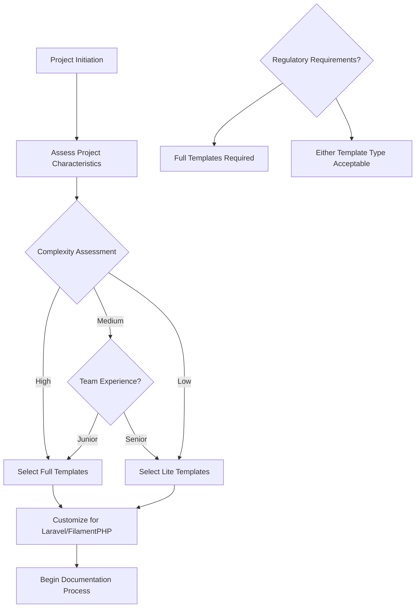

# Master Template Index
## Comprehensive Software Project Documentation Templates

**Estimated Reading Time:** 15 minutes

## Overview

This index provides a comprehensive catalog of all documentation templates available for software project development. Each template is designed to support junior developers with 6 months to 2 years of experience, following Laravel 12.x and FilamentPHP v4 best practices.

## Template Categories

### Requirements Phase Templates (010-050)
- **010-project-risk-register.md**: Project risk assessment and mitigation strategies
- **020-product-requirements-document.md**: Full PRD template with comprehensive coverage
- **021-prd-lite.md**: Lite PRD template for agile/MVP development
- **030-business-requirements-document.md**: Business needs and objectives documentation
- **040-user-stories-template.md**: Enhanced user stories with security/performance criteria
- **050-decision-log.md**: Decision tracking with confidence scoring

### Design Phase Templates (060-090)
- **060-technical-design-document.md**: Comprehensive technical implementation planning
- **070-architecture-decision-record.md**: Architectural decision documentation
- **080-master-test-plan.md**: Test strategy and specification requirements
- **090-data-retention-policy.md**: GDPR compliance and data lifecycle management

### Development Phase Templates (100-150)
- **100-laravel-implementation-guide.md**: Laravel 12.x specific development standards
- **110-filament-integration-guide.md**: FilamentPHP v4 admin panel development
- **120-security-implementation-guide.md**: Security procedures and standards
- **125-accessibility-compliance-guide.md**: WCAG 2.1 AA accessibility implementation
- **130-devops-implementation-guide.md**: DevOps practices and toolchain implementation
- **135-cicd-pipeline-documentation.md**: Continuous integration and deployment pipelines
- **140-test-specifications.md**: Detailed test requirements for PRD fulfillment
- **145-infrastructure-as-code-guide.md**: Infrastructure automation and management
- **150-tdd-implementation-guide.md**: Test-driven development methodology
- **155-accessibility-testing-procedures.md**: Comprehensive accessibility testing framework

### Deployment Phase Templates (160-170)
- **160-deployment-strategy.md**: Comprehensive deployment procedures
- **170-gdpr-compliance-guide.md**: GDPR implementation and compliance

### Maintenance Phase Templates (180-190)
- **180-operations-maintenance-manual.md**: Ongoing operational procedures
- **190-documentation-maintenance.md**: Documentation lifecycle management

## Template Selection Guide

### Full vs Lite Template Decision Matrix

| Criteria | Full Templates | Lite Templates |
|----------|----------------|----------------|
| **Project Complexity** | High complexity, multiple integrations | Simple, focused functionality |
| **Team Experience** | Junior teams, new to documentation | Experienced teams, established processes |
| **Regulatory Requirements** | GDPR, SOX, HIPAA compliance needed | Minimal regulatory requirements |
| **Time Constraints** | Adequate time for comprehensive docs | Tight deadlines, MVP focus |
| **Maintenance Requirements** | Long-term maintenance, multiple teams | Short-term projects, single team |

### Template Usage Workflow

## Laravel 12.x Integration Points

### Service Provider Integration
- All templates include `bootstrap/providers.php` registration examples
- Service provider configuration and customization guidance
- Artisan command integration for documentation generation

### Database Integration
- Migration documentation with comprehensive comments
- Factory and seeder documentation standards
- SQLite optimization considerations and pragma settings

### Testing Integration
- PHPUnit/Pest configuration examples
- Test organization and naming conventions
- Coverage reporting and CI/CD integration

## FilamentPHP v4 Integration Points

### Admin Panel Configuration
- Panel provider setup and customization
- Resource development with permission integration
- Plugin architecture and custom plugin development

### User Management Integration
- Role-based access control documentation
- Permission system integration
- User authentication and authorization

## GDPR Compliance Integration

### Data Protection Requirements
- Data retention policy documentation
- User rights implementation procedures
- Cross-border data transfer compliance

### Audit Trail Requirements
- Activity logging and monitoring
- Compliance reporting procedures
- Data breach notification processes

## Template Customization Guidelines

### Project-Specific Customization
1. **Replace Placeholder Content**: Update all [PLACEHOLDER] content with project-specific information
2. **Adjust Scope**: Modify template sections based on project requirements
3. **Add Custom Sections**: Include project-specific requirements or constraints
4. **Update References**: Ensure all references point to correct project resources

### Technology Stack Customization
1. **Laravel Version**: Update examples for specific Laravel version in use
2. **Package Versions**: Update package references to match project dependencies
3. **Database Configuration**: Customize for specific database choice (SQLite, MySQL, PostgreSQL)
4. **Deployment Environment**: Adjust for specific deployment platform and configuration

## Quality Assurance Checklist

### Template Completion Verification
- [ ] All placeholder content replaced with project-specific information
- [ ] All sections completed or marked as not applicable
- [ ] Cross-references between documents verified and updated
- [ ] Version control information updated
- [ ] Review and approval workflow completed

### Technical Accuracy Verification
- [ ] Code examples tested and verified
- [ ] Configuration examples match project setup
- [ ] Package versions and dependencies verified
- [ ] Security configurations reviewed and approved
- [ ] Performance optimizations validated

## Support and Maintenance

### Template Updates
- **Monthly**: Review for technology updates and user feedback
- **Quarterly**: Major enhancements and new template development
- **Annually**: Complete overhaul for framework and methodology updates

### Community Contributions
- Submit template improvements via pull requests
- Report issues and inconsistencies through issue tracking
- Share customizations and best practices with the community

### Getting Help
- Review Laravel official documentation for framework-specific questions
- Consult FilamentPHP documentation for admin panel development
- Engage with community forums for best practice discussions

---

**Template Index Version**: 1.0.0  
**Last Updated**: 2025-06-23  
**Next Review**: 2025-09-23  
**Maintained By**: Development Team Lead
