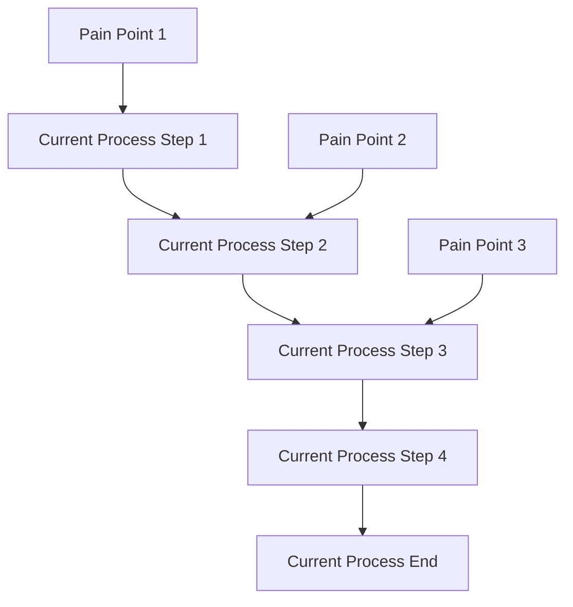
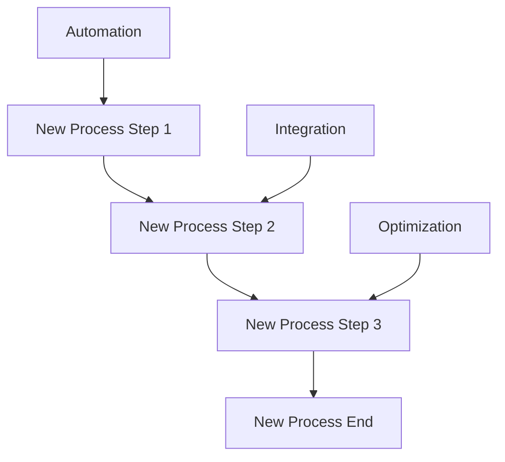

# Business Requirements Document (BRD)
## [PROJECT_NAME]

**Estimated Reading Time:** 25 minutes

## Executive Summary

### Business Problem Statement
[Describe the current business problem or opportunity that this project addresses. Keep to 2-3 sentences maximum.]

### Proposed Solution Overview
[Brief description of the proposed solution and how it addresses the business problem. Include key benefits and expected outcomes.]

### Business Value Proposition
- **Cost Savings**: [Quantified cost reduction or avoidance]
- **Revenue Impact**: [Expected revenue increase or new revenue streams]
- **Efficiency Gains**: [Process improvements and time savings]
- **Strategic Alignment**: [How this supports broader business strategy]

## Business Objectives

### Primary Objectives
1. **[OBJECTIVE_1]**: [Specific, measurable business goal]
   - **Success Metric**: [How success will be measured]
   - **Target Value**: [Specific target number/percentage]
   - **Timeline**: [When this will be achieved]

2. **[OBJECTIVE_2]**: [Specific, measurable business goal]
   - **Success Metric**: [How success will be measured]
   - **Target Value**: [Specific target number/percentage]
   - **Timeline**: [When this will be achieved]

3. **[OBJECTIVE_3]**: [Specific, measurable business goal]
   - **Success Metric**: [How success will be measured]
   - **Target Value**: [Specific target number/percentage]
   - **Timeline**: [When this will be achieved]

### Secondary Objectives
- **[SECONDARY_1]**: [Supporting business goal]
- **[SECONDARY_2]**: [Supporting business goal]
- **[SECONDARY_3]**: [Supporting business goal]

## Stakeholder Analysis

### Primary Stakeholders

#### Business Sponsor
- **Name**: [SPONSOR_NAME]
- **Role**: [SPONSOR_ROLE]
- **Responsibilities**: Project funding, strategic direction, final approval
- **Success Criteria**: [What defines success for this stakeholder]
- **Communication Preference**: [Preferred communication method and frequency]

#### End Users
- **User Group 1**: [USER_GROUP_NAME]
  - **Size**: [Number of users]
  - **Current Process**: [How they currently work]
  - **Pain Points**: [Current challenges they face]
  - **Expected Benefits**: [How the solution will help them]

- **User Group 2**: [USER_GROUP_NAME]
  - **Size**: [Number of users]
  - **Current Process**: [How they currently work]
  - **Pain Points**: [Current challenges they face]
  - **Expected Benefits**: [How the solution will help them]

#### IT Department
- **Technical Lead**: [TECH_LEAD_NAME]
- **Responsibilities**: Technical implementation, system integration, maintenance
- **Constraints**: [Technical limitations or requirements]
- **Success Criteria**: [Technical success measures]

### Secondary Stakeholders
- **[STAKEHOLDER_1]**: [Role and interest in project]
- **[STAKEHOLDER_2]**: [Role and interest in project]
- **[STAKEHOLDER_3]**: [Role and interest in project]

## Current State Analysis

### Business Process Analysis

#### Current Workflow

#### Current System Landscape
- **System 1**: [SYSTEM_NAME]
  - **Purpose**: [What it does]
  - **Users**: [Who uses it]
  - **Integration**: [How it connects to other systems]
  - **Limitations**: [Current problems or constraints]

- **System 2**: [SYSTEM_NAME]
  - **Purpose**: [What it does]
  - **Users**: [Who uses it]
  - **Integration**: [How it connects to other systems]
  - **Limitations**: [Current problems or constraints]

#### Current Performance Metrics
| Metric | Current Value | Target Value | Gap |
|--------|---------------|--------------|-----|
| [METRIC_1] | [CURRENT] | [TARGET] | [GAP] |
| [METRIC_2] | [CURRENT] | [TARGET] | [GAP] |
| [METRIC_3] | [CURRENT] | [TARGET] | [GAP] |
| [METRIC_4] | [CURRENT] | [TARGET] | [GAP] |

### Current State Challenges
1. **[CHALLENGE_1]**: [Description of current problem]
   - **Impact**: [Business impact of this challenge]
   - **Frequency**: [How often this occurs]
   - **Cost**: [Financial impact if quantifiable]

2. **[CHALLENGE_2]**: [Description of current problem]
   - **Impact**: [Business impact of this challenge]
   - **Frequency**: [How often this occurs]
   - **Cost**: [Financial impact if quantifiable]

3. **[CHALLENGE_3]**: [Description of current problem]
   - **Impact**: [Business impact of this challenge]
   - **Frequency**: [How often this occurs]
   - **Cost**: [Financial impact if quantifiable]

## Proposed Solution

### Future State Vision

#### Target Business Process

#### Solution Components
1. **[COMPONENT_1]**: [Description of solution component]
   - **Technology**: Laravel 12.x with FilamentPHP v4 admin panel
   - **Users**: [Who will use this component]
   - **Benefits**: [Specific benefits this component provides]

2. **[COMPONENT_2]**: [Description of solution component]
   - **Technology**: [Technology stack for this component]
   - **Users**: [Who will use this component]
   - **Benefits**: [Specific benefits this component provides]

3. **[COMPONENT_3]**: [Description of solution component]
   - **Technology**: [Technology stack for this component]
   - **Users**: [Who will use this component]
   - **Benefits**: [Specific benefits this component provides]

### Business Process Improvements
- **Process Automation**: [Which processes will be automated]
- **Data Integration**: [How data will flow between systems]
- **User Experience**: [How user experience will improve]
- **Reporting & Analytics**: [New reporting capabilities]

## Cost-Benefit Analysis

### Implementation Costs

#### Development Costs
| Cost Category | Year 1 | Year 2 | Year 3 | Total |
|---------------|--------|--------|--------|-------|
| **Development Team** | $[AMOUNT] | $[AMOUNT] | $[AMOUNT] | $[TOTAL] |
| **Infrastructure** | $[AMOUNT] | $[AMOUNT] | $[AMOUNT] | $[TOTAL] |
| **Software Licenses** | $[AMOUNT] | $[AMOUNT] | $[AMOUNT] | $[TOTAL] |
| **Training** | $[AMOUNT] | $[AMOUNT] | $[AMOUNT] | $[TOTAL] |
| **Contingency (10%)** | $[AMOUNT] | $[AMOUNT] | $[AMOUNT] | $[TOTAL] |
| **Total Costs** | $[TOTAL] | $[TOTAL] | $[TOTAL] | $[GRAND_TOTAL] |

#### Ongoing Operational Costs
- **Hosting & Infrastructure**: $[AMOUNT] per year
- **Maintenance & Support**: $[AMOUNT] per year
- **Software Licenses**: $[AMOUNT] per year
- **Staff Training**: $[AMOUNT] per year

### Expected Benefits

#### Quantifiable Benefits
| Benefit Category | Year 1 | Year 2 | Year 3 | Total |
|------------------|--------|--------|--------|-------|
| **Cost Savings** | $[AMOUNT] | $[AMOUNT] | $[AMOUNT] | $[TOTAL] |
| **Revenue Increase** | $[AMOUNT] | $[AMOUNT] | $[AMOUNT] | $[TOTAL] |
| **Efficiency Gains** | $[AMOUNT] | $[AMOUNT] | $[AMOUNT] | $[TOTAL] |
| **Total Benefits** | $[TOTAL] | $[TOTAL] | $[TOTAL] | $[GRAND_TOTAL] |

#### Qualitative Benefits
- **Improved User Satisfaction**: [Description of improvement]
- **Better Decision Making**: [How data/reporting will improve decisions]
- **Competitive Advantage**: [How this provides market advantage]
- **Risk Reduction**: [How this reduces business risks]
- **Scalability**: [How this supports future growth]

### Return on Investment (ROI)
- **Total Investment**: $[TOTAL_COST]
- **Total Benefits (3 years)**: $[TOTAL_BENEFITS]
- **Net Present Value**: $[NPV]
- **ROI Percentage**: [ROI]%
- **Payback Period**: [MONTHS] months

## Compliance and Regulatory Requirements

### GDPR Compliance Requirements
- **Data Subject Rights**: Implementation of user data access, correction, and deletion
- **Data Retention**: 2-year data retention policy with automated cleanup
- **Consent Management**: Explicit consent tracking and management
- **Data Protection Impact Assessment**: Required for personal data processing
- **Privacy by Design**: Built-in privacy protections from system design

### Security Compliance
- **Authentication**: Multi-factor authentication for administrative access
- **Authorization**: Role-based access control with principle of least privilege
- **Data Encryption**: Encryption at rest and in transit for sensitive data
- **Audit Logging**: Comprehensive audit trail for all system activities
- **Vulnerability Management**: Regular security assessments and updates

### Industry-Specific Requirements
- **[REQUIREMENT_1]**: [Description of industry-specific requirement]
- **[REQUIREMENT_2]**: [Description of industry-specific requirement]
- **[REQUIREMENT_3]**: [Description of industry-specific requirement]

## Performance Expectations and Business Impact

### Performance Requirements
- **System Availability**: 99.9% uptime during business hours
- **Response Time**: < 2 seconds for user interactions
- **Concurrent Users**: Support for [NUMBER] simultaneous users
- **Data Processing**: Handle [VOLUME] transactions per hour
- **Backup & Recovery**: Recovery Time Objective (RTO) of 4 hours

### Business Impact Metrics
- **User Productivity**: [PERCENTAGE]% improvement in task completion time
- **Error Reduction**: [PERCENTAGE]% reduction in manual errors
- **Process Efficiency**: [PERCENTAGE]% reduction in process cycle time
- **Customer Satisfaction**: Target score of [SCORE] out of 10
- **Cost per Transaction**: Reduce from $[CURRENT] to $[TARGET]

## Implementation Strategy

### Phased Approach
#### Phase 1: Foundation (Months 1-2)
- **Scope**: Core system setup, user authentication, basic admin panel
- **Deliverables**: Laravel 12.x application, FilamentPHP v4 admin, user management
- **Success Criteria**: System accessible, users can log in, basic CRUD operations

#### Phase 2: Core Features (Months 3-4)
- **Scope**: Primary business functionality, data integration, reporting
- **Deliverables**: Core business features, data import/export, basic reporting
- **Success Criteria**: Primary use cases functional, data flows correctly

#### Phase 3: Advanced Features (Months 5-6)
- **Scope**: Advanced features, integrations, performance optimization
- **Deliverables**: Full feature set, third-party integrations, optimized performance
- **Success Criteria**: All requirements met, performance targets achieved

### Change Management
- **User Training**: [HOURS] hours of training per user group
- **Documentation**: User manuals, admin guides, troubleshooting guides
- **Support Structure**: Help desk, super users, escalation procedures
- **Communication Plan**: Regular updates, milestone celebrations, feedback collection

## Success Criteria and Acceptance

### Business Acceptance Criteria
- [ ] All primary business objectives achieved
- [ ] Performance metrics meet or exceed targets
- [ ] User satisfaction scores above [THRESHOLD]
- [ ] ROI targets met within [TIMEFRAME]
- [ ] Compliance requirements fully satisfied

### Technical Acceptance Criteria
- [ ] System passes all security audits
- [ ] Performance benchmarks achieved
- [ ] Integration testing completed successfully
- [ ] Disaster recovery procedures tested
- [ ] Documentation complete and approved

### User Acceptance Criteria
- [ ] User training completed for all user groups
- [ ] User acceptance testing passed
- [ ] Support procedures established and tested
- [ ] Change management activities completed
- [ ] Go-live readiness confirmed

---

## Definition of Done Checklist

### Business Analysis Phase
- [ ] Business problem clearly defined and validated with stakeholders
- [ ] Current state analysis completed with quantified pain points
- [ ] All primary and secondary stakeholders identified and interviewed
- [ ] Business objectives are SMART (Specific, Measurable, Achievable, Relevant, Time-bound)
- [ ] Success metrics defined with baseline and target values

### Solution Design Phase
- [ ] Proposed solution addresses all identified business problems
- [ ] Solution components mapped to business requirements
- [ ] Technology choices (Laravel 12.x, FilamentPHP v4) justified
- [ ] Integration points with existing systems identified
- [ ] Future state process flows documented and validated

### Financial Analysis Phase
- [ ] All implementation costs identified and estimated
- [ ] Ongoing operational costs calculated
- [ ] Benefits quantified with realistic assumptions
- [ ] ROI calculation completed and validated
- [ ] Payback period acceptable to business sponsor

### Compliance and Risk Assessment
- [ ] All regulatory requirements identified (GDPR, industry-specific)
- [ ] Security requirements defined and mapped to implementation
- [ ] Performance requirements specified with measurable criteria
- [ ] Risk assessment completed with mitigation strategies
- [ ] Compliance impact assessment documented

### Stakeholder Validation
- [ ] Business sponsor review and approval obtained
- [ ] End user representatives validated requirements
- [ ] Technical team confirmed feasibility and approach
- [ ] Compliance officer approved regulatory requirements
- [ ] All stakeholder feedback incorporated

### Documentation Quality
- [ ] All sections completed with specific, actionable content
- [ ] No placeholder text ([BRACKETS]) remaining
- [ ] Financial figures reviewed and validated
- [ ] Technical specifications aligned with architecture decisions
- [ ] Document follows template standards and formatting

---

## Common Pitfalls and Avoidance Strategies

### Pitfall: Vague Business Objectives
**Problem**: Objectives like "improve efficiency" without specific metrics
**Solution**: Use SMART criteria with quantified targets
**Example**: Instead of "improve user productivity" → "reduce task completion time by 30% from 10 minutes to 7 minutes"

### Pitfall: Unrealistic Cost-Benefit Analysis
**Problem**: Overly optimistic benefits or underestimated costs
**Solution**: Use conservative estimates and include contingency
**Example**: Add 10-20% contingency to all cost estimates, validate benefits with historical data

### Pitfall: Missing Stakeholder Input
**Problem**: Requirements based on assumptions rather than stakeholder needs
**Solution**: Conduct structured interviews with all stakeholder groups
**Example**: Interview at least 3 representatives from each user group

### Pitfall: Technology-First Approach
**Problem**: Choosing technology before understanding business needs
**Solution**: Define business requirements first, then select appropriate technology
**Example**: Justify Laravel/FilamentPHP choice based on specific business needs

### Pitfall: Inadequate Change Management Planning
**Problem**: Focusing only on technical implementation, ignoring user adoption
**Solution**: Include comprehensive change management strategy
**Example**: Plan for training, communication, and support structures

---

**BRD Version**: 1.0.0
**Created**: [YYYY-MM-DD]
**Last Updated**: [YYYY-MM-DD]
**Next Review**: [YYYY-MM-DD]
**Business Owner**: [BUSINESS_SPONSOR]
**Approval Required**: Business Sponsor, Technical Lead, Compliance Officer
