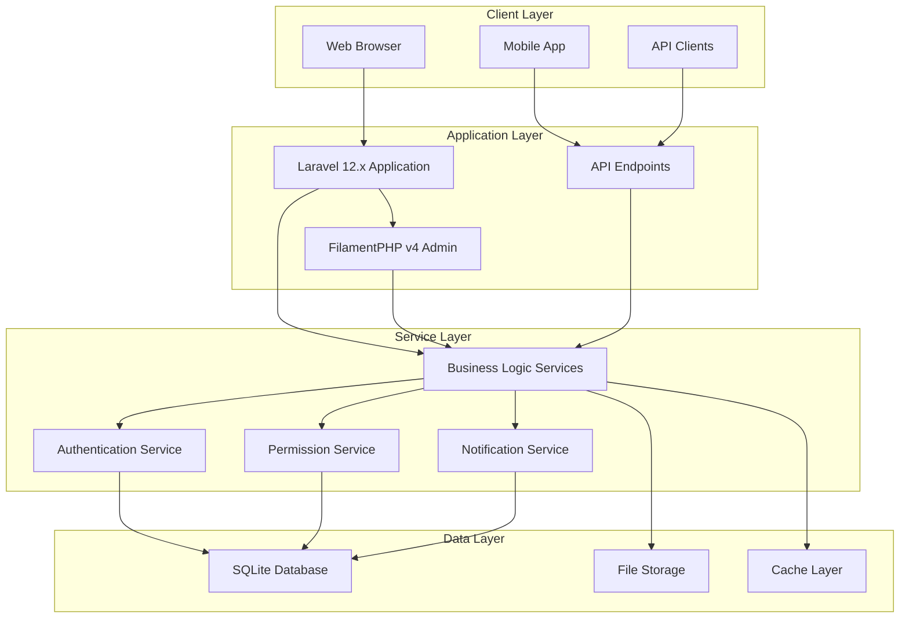
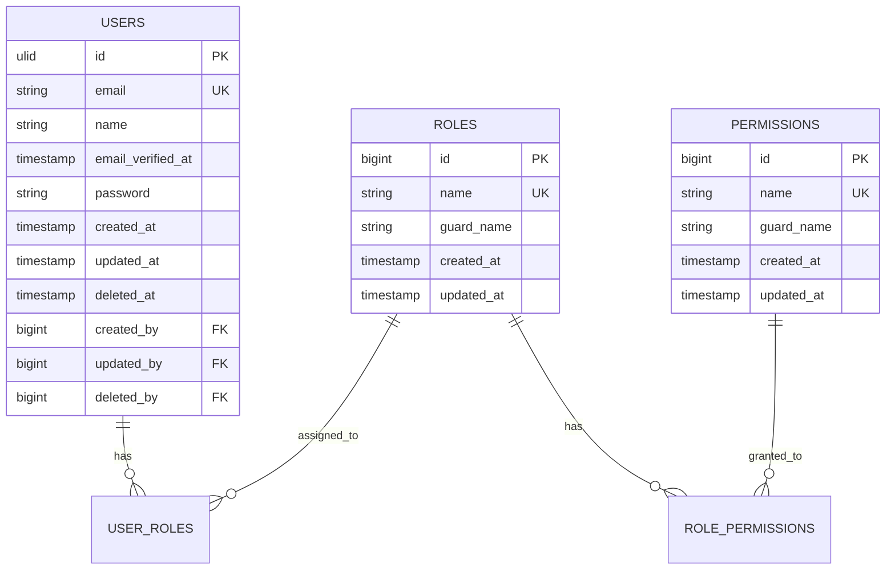

# Technical Design Document (TDD)
## [PROJECT_NAME]

**Estimated Reading Time:** 30 minutes

## Executive Summary

### System Overview
[Brief description of the system being built, its primary purpose, and key stakeholders]

### Technology Stack Summary
- **Framework**: Laravel 12.x with PHP 8.1+
- **Admin Panel**: FilamentPHP v4
- **Database**: SQLite with WAL mode optimization
- **Authentication**: Laravel Sanctum
- **Permissions**: spatie/laravel-permission
- **Frontend**: Blade templates with Alpine.js and Tailwind CSS
- **Testing**: PHPUnit/Pest with 90% coverage target

### Key Design Principles
- **Security First**: GDPR compliance and security by design
- **Performance Optimized**: Sub-200ms API response times
- **Maintainable**: Clear separation of concerns and comprehensive testing
- **Scalable**: Designed for growth from 100 to 1000+ users

## System Architecture

### High-Level Architecture



### Component Architecture

#### Laravel 12.x Application Structure
```
app/
├── Console/Commands/          # Artisan commands
├── Enums/                    # PHP 8.1+ enums
├── Events/                   # Domain events
├── Exceptions/               # Custom exceptions
├── Filament/                 # FilamentPHP resources
│   ├── Resources/
│   ├── Pages/
│   └── Widgets/
├── Http/
│   ├── Controllers/          # HTTP controllers
│   ├── Middleware/           # Custom middleware
│   ├── Requests/             # Form request validation
│   └── Resources/            # API resources
├── Jobs/                     # Queue jobs
├── Listeners/                # Event listeners
├── Models/                   # Eloquent models
├── Policies/                 # Authorization policies
├── Providers/                # Service providers
├── Rules/                    # Custom validation rules
└── Services/                 # Business logic services
```

#### Service Provider Registration (Laravel 12.x)
```php
// bootstrap/providers.php
return [
    App\Providers\AppServiceProvider::class,
    App\Providers\AuthServiceProvider::class,
    App\Providers\EventServiceProvider::class,
    App\Providers\FilamentServiceProvider::class,
    App\Providers\SqliteServiceProvider::class,
];
```

## Database Design

### Entity Relationship Diagram



### Database Schema Standards

#### Primary Key Strategy
- **ULID**: Use ULID for all primary keys to ensure uniqueness and security
- **Implementation**: `$table->ulid('id')->primary();`
- **Benefits**: Non-sequential, URL-safe, lexicographically sortable

#### User Stamps Implementation
```php
// All tables include user stamps for audit trail
$table->unsignedBigInteger('created_by')->nullable();
$table->unsignedBigInteger('updated_by')->nullable();
$table->unsignedBigInteger('deleted_by')->nullable();
```

#### Soft Deletes Standard
```php
// Enable soft deletes for GDPR compliance and data recovery
$table->softDeletes();
```

#### SQLite Optimization
```sql
-- Applied automatically via SqliteServiceProvider
PRAGMA journal_mode=WAL;
PRAGMA synchronous=NORMAL;
PRAGMA cache_size=10000;
PRAGMA temp_store=MEMORY;
PRAGMA mmap_size=268435456; -- 256MB
```

## Security Architecture

### Authentication Design

#### Laravel Sanctum Integration
```php
// config/sanctum.php
'expiration' => 60, // 1 hour token expiration
'middleware' => [
    'encrypt_cookies' => App\Http\Middleware\EncryptCookies::class,
    'verify_csrf_token' => App\Http\Middleware\VerifyCsrfToken::class,
],
```

#### Multi-Factor Authentication
- **Implementation**: Laravel Fortify with TOTP support
- **Backup Codes**: Generated and encrypted for account recovery
- **Admin Requirement**: MFA mandatory for admin panel access

### Authorization Design

#### Role-Based Access Control (RBAC)
```php
// Using spatie/laravel-permission
// Roles: super-admin, admin, manager, user
// Permissions: create-users, edit-users, delete-users, view-reports

// Policy example
class UserPolicy
{
    public function create(User $user): bool
    {
        return $user->hasPermissionTo('create-users');
    }
    
    public function update(User $user, User $model): bool
    {
        return $user->hasPermissionTo('edit-users') || $user->id === $model->id;
    }
}
```

#### FilamentPHP Permission Integration
```php
// Filament resource with permission checks
class UserResource extends Resource
{
    public static function canViewAny(): bool
    {
        return auth()->user()->hasPermissionTo('view-users');
    }
    
    public static function canCreate(): bool
    {
        return auth()->user()->hasPermissionTo('create-users');
    }
}
```

### Data Protection

#### Encryption Strategy
- **Database**: Sensitive fields encrypted using Laravel's encryption
- **Files**: File storage encrypted at rest
- **Transit**: HTTPS/TLS 1.3 for all communications
- **Keys**: Environment-based key management

#### GDPR Compliance Implementation
```php
// Data retention policy
class DataRetentionJob implements ShouldQueue
{
    public function handle()
    {
        // Anonymize user data after 2 years of inactivity
        User::where('last_login_at', '<', now()->subYears(2))
            ->whereNull('anonymized_at')
            ->each(function ($user) {
                $user->anonymize();
            });
    }
}
```

## Performance Architecture

### Caching Strategy

#### Multi-Level Caching
```php
// Application-level caching
Cache::remember('user.permissions.' . $userId, 3600, function () use ($userId) {
    return User::find($userId)->getAllPermissions();
});

// Database query caching
User::with(['roles.permissions'])->remember(3600)->get();

// View caching for static content
@cache('sidebar.navigation', 3600)
    @include('partials.navigation')
@endcache
```

#### Cache Invalidation Strategy
- **Model Events**: Automatic cache clearing on model changes
- **Tagged Caching**: Organized cache invalidation by tags
- **Time-Based**: Appropriate TTL for different data types

### Database Optimization

#### Query Optimization
```php
// Eager loading to prevent N+1 queries
$users = User::with(['roles', 'permissions', 'profile'])->get();

// Database indexes for common queries
Schema::table('users', function (Blueprint $table) {
    $table->index(['email', 'email_verified_at']);
    $table->index(['created_at', 'deleted_at']);
});
```

#### Connection Management
```php
// Database configuration for SQLite
'sqlite' => [
    'driver' => 'sqlite',
    'database' => database_path('database.sqlite'),
    'prefix' => '',
    'foreign_key_constraints' => true,
    'options' => [
        PDO::ATTR_TIMEOUT => 60,
    ],
],
```

### API Performance

#### Response Time Optimization
- **Target**: 95% of API requests under 200ms
- **Monitoring**: Laravel Telescope for development, custom metrics for production
- **Optimization**: Database query optimization, caching, pagination

#### Rate Limiting
```php
// API rate limiting configuration
RateLimiter::for('api', function (Request $request) {
    return Limit::perMinute(100)->by($request->user()?->id ?: $request->ip());
});

// Admin panel rate limiting
RateLimiter::for('admin', function (Request $request) {
    return Limit::perMinute(200)->by($request->user()->id);
});
```

## Integration Architecture

### External Service Integration

#### Email Service Integration
```php
// Mail configuration for notifications
'mailers' => [
    'smtp' => [
        'transport' => 'smtp',
        'host' => env('MAIL_HOST', 'smtp.mailgun.org'),
        'port' => env('MAIL_PORT', 587),
        'encryption' => env('MAIL_ENCRYPTION', 'tls'),
    ],
],
```

#### File Storage Integration
```php
// File storage configuration
'disks' => [
    'local' => [
        'driver' => 'local',
        'root' => storage_path('app'),
        'permissions' => [
            'file' => [
                'public' => 0644,
                'private' => 0600,
            ],
            'dir' => [
                'public' => 0755,
                'private' => 0700,
            ],
        ],
    ],
],
```

### API Design

#### RESTful API Standards
```php
// API resource structure
class UserResource extends JsonResource
{
    public function toArray($request)
    {
        return [
            'id' => $this->id,
            'name' => $this->name,
            'email' => $this->email,
            'created_at' => $this->created_at->toISOString(),
            'updated_at' => $this->updated_at->toISOString(),
            'roles' => RoleResource::collection($this->whenLoaded('roles')),
        ];
    }
}
```

#### API Versioning Strategy
- **URL Versioning**: `/api/v1/users`
- **Header Versioning**: `Accept: application/vnd.api+json;version=1`
- **Backward Compatibility**: Maintain previous version for 6 months

## Error Handling and Monitoring

### Exception Handling
```php
// Custom exception handler
class Handler extends ExceptionHandler
{
    public function render($request, Throwable $exception)
    {
        if ($request->expectsJson()) {
            return $this->handleApiException($request, $exception);
        }
        
        return parent::render($request, $exception);
    }
    
    private function handleApiException($request, $exception)
    {
        return response()->json([
            'error' => [
                'message' => $exception->getMessage(),
                'code' => $exception->getCode(),
                'type' => class_basename($exception),
            ]
        ], $this->getStatusCode($exception));
    }
}
```

### Logging Strategy
```php
// Structured logging configuration
'channels' => [
    'stack' => [
        'driver' => 'stack',
        'channels' => ['single', 'security'],
    ],
    'security' => [
        'driver' => 'single',
        'path' => storage_path('logs/security.log'),
        'level' => 'info',
    ],
],
```

### Health Monitoring
```php
// Health check endpoint
Route::get('/health', function () {
    return response()->json([
        'status' => 'healthy',
        'database' => DB::connection()->getPdo() ? 'connected' : 'disconnected',
        'cache' => Cache::store()->getStore()->getPrefix() ? 'available' : 'unavailable',
        'timestamp' => now()->toISOString(),
    ]);
});
```

## Deployment Architecture

### Environment Configuration
- **Development**: Local SQLite, debug enabled, detailed logging
- **Staging**: Production-like setup, limited debug, comprehensive testing
- **Production**: Optimized configuration, minimal logging, monitoring enabled

### Deployment Pipeline
1. **Code Commit**: Trigger automated testing
2. **Testing**: Unit, feature, and integration tests
3. **Security Scan**: Automated vulnerability assessment
4. **Staging Deployment**: Automated deployment to staging environment
5. **User Acceptance Testing**: Manual testing by stakeholders
6. **Production Deployment**: Blue-green deployment with rollback capability

### Backup and Recovery
```php
// Automated backup configuration
'backup' => [
    'name' => env('APP_NAME', 'laravel-backup'),
    'source' => [
        'files' => [
            'include' => [
                base_path(),
            ],
            'exclude' => [
                base_path('vendor'),
                base_path('node_modules'),
            ],
        ],
        'databases' => [
            'sqlite',
        ],
    ],
    'destination' => [
        'filename_prefix' => '',
        'disks' => [
            'local',
        ],
    ],
],
```

---

## Definition of Done Checklist

### Architecture Design Phase
- [ ] High-level system architecture documented with clear component boundaries
- [ ] Technology stack choices justified with specific business requirements
- [ ] Laravel 12.x and FilamentPHP v4 integration patterns defined
- [ ] Database schema designed with proper normalization and indexing
- [ ] Security architecture addresses all identified threats and compliance requirements

### Technical Specifications Phase
- [ ] All API endpoints documented with request/response examples
- [ ] Database migrations created with proper foreign key constraints
- [ ] Authentication and authorization flows completely specified
- [ ] Performance requirements defined with measurable targets
- [ ] Error handling and logging strategies documented

### Integration Design Phase
- [ ] External service integrations documented with fallback strategies
- [ ] File storage and media handling strategies defined
- [ ] Email and notification systems designed
- [ ] Third-party service dependencies identified and documented
- [ ] API versioning strategy established

### Security and Compliance Phase
- [ ] GDPR compliance requirements mapped to technical implementation
- [ ] Data encryption strategies defined for data at rest and in transit
- [ ] User permission and role-based access control fully specified
- [ ] Security headers and middleware configurations documented
- [ ] Audit logging requirements defined

### Performance and Scalability Phase
- [ ] Caching strategies defined for different data types
- [ ] Database optimization techniques specified
- [ ] Rate limiting and throttling mechanisms designed
- [ ] Performance monitoring and alerting strategies defined
- [ ] Scalability considerations documented

### Deployment and Operations Phase
- [ ] Environment-specific configurations documented
- [ ] Deployment pipeline and rollback procedures defined
- [ ] Backup and disaster recovery strategies specified
- [ ] Health monitoring and alerting systems designed
- [ ] Maintenance and update procedures documented

---

## Common Pitfalls and Avoidance Strategies

### Pitfall: Over-Engineering the Architecture
**Problem**: Creating overly complex solutions for simple requirements
**Solution**: Follow YAGNI (You Aren't Gonna Need It) principle, start simple and evolve
**Example**: Don't implement microservices for a simple CRUD application

### Pitfall: Inadequate Security Design
**Problem**: Treating security as an afterthought rather than designing it in
**Solution**: Apply security-by-design principles from the start
**Example**: Define authentication, authorization, and data protection strategies early

### Pitfall: Poor Database Design
**Problem**: Inadequate normalization, missing indexes, or poor relationship design
**Solution**: Follow database design best practices and review with experienced developers
**Example**: Use proper foreign key constraints and create indexes for frequently queried columns

### Pitfall: Ignoring Performance Requirements
**Problem**: Not considering performance implications of design decisions
**Solution**: Define performance targets early and design with them in mind
**Example**: Plan caching strategies and database optimization from the beginning

### Pitfall: Insufficient Error Handling Design
**Problem**: Not planning for failure scenarios and edge cases
**Solution**: Design comprehensive error handling and recovery mechanisms
**Example**: Plan for database connection failures, external service outages, and invalid user input

### Pitfall: Technology Stack Mismatch
**Problem**: Choosing technologies that don't align with team skills or project requirements
**Solution**: Evaluate technology choices against team capabilities and project constraints
**Example**: Ensure team has Laravel 12.x and FilamentPHP v4 expertise before committing

---

**Technical Design Document Version**: 1.0.0
**Framework**: Laravel 12.x
**Admin Panel**: FilamentPHP v4
**Created**: [YYYY-MM-DD]
**Last Updated**: [YYYY-MM-DD]
**Next Review**: [YYYY-MM-DD]
**Technical Owner**: [TECHNICAL_LEAD]
