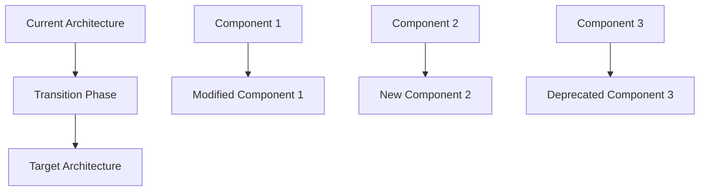

# Architecture Decision Record: [DECISION_TITLE]
## ADR-[NUMBER]: [BRIEF_DESCRIPTION]

**Decision ID**: ADR-[NUMBER]  
**Date**: [YYYY-MM-DD]  
**Status**: [Proposed/Accepted/Deprecated/Superseded]  
**Confidence Level**: [1-5]/5  
**Review Date**: [YYYY-MM-DD]

## Status

**Current Status**: [Proposed/Accepted/Deprecated/Superseded]

**Decision History**:
- [YYYY-MM-DD]: Proposed by [NAME]
- [YYYY-MM-DD]: Reviewed by architecture team
- [YYYY-MM-DD]: [Accepted/Rejected] by [AUTHORITY]

**Supersedes**: [ADR-XXX] (if applicable)  
**Superseded by**: [ADR-XXX] (if applicable)

## Context

### Problem Statement
[Describe the architectural problem or decision that needs to be made. Include the business context and technical constraints that led to this decision point.]

### Current Situation
[Describe the current state of the system and why a decision is needed. Include any existing solutions that are inadequate.]

### Stakeholders
- **Primary**: [List primary stakeholders affected by this decision]
- **Secondary**: [List secondary stakeholders who should be informed]
- **Decision Authority**: [Who has the final say on this decision]

### Constraints
- **Technical**: [Technical limitations or requirements]
- **Business**: [Business constraints, budget, timeline]
- **Regulatory**: [Compliance requirements, GDPR, security standards]
- **Team**: [Team skills, experience, capacity]

## Decision

### Selected Option
[Clearly state the architectural decision that was made]

### Rationale
[Explain why this decision was made. Include the key factors that influenced the choice.]

#### Primary Reasons
1. **[REASON_1]**: [Detailed explanation]
2. **[REASON_2]**: [Detailed explanation]
3. **[REASON_3]**: [Detailed explanation]

#### Supporting Evidence
- **Performance**: [Performance considerations and benchmarks]
- **Scalability**: [How this supports future growth]
- **Maintainability**: [Impact on code maintenance and team productivity]
- **Security**: [Security implications and benefits]
- **Cost**: [Financial impact and cost-benefit analysis]

## Alternatives Considered

### Option 1: [ALTERNATIVE_NAME]
**Description**: [Brief description of the alternative]

**Pros**:
- [Advantage 1]
- [Advantage 2]
- [Advantage 3]

**Cons**:
- [Disadvantage 1]
- [Disadvantage 2]
- [Disadvantage 3]

**Why Rejected**: [Specific reasons this option was not chosen]

### Option 2: [ALTERNATIVE_NAME]
**Description**: [Brief description of the alternative]

**Pros**:
- [Advantage 1]
- [Advantage 2]
- [Advantage 3]

**Cons**:
- [Disadvantage 1]
- [Disadvantage 2]
- [Disadvantage 3]

**Why Rejected**: [Specific reasons this option was not chosen]

### Option 3: [ALTERNATIVE_NAME]
**Description**: [Brief description of the alternative]

**Pros**:
- [Advantage 1]
- [Advantage 2]

**Cons**:
- [Disadvantage 1]
- [Disadvantage 2]

**Why Rejected**: [Specific reasons this option was not chosen]

## Consequences

### Positive Consequences
- **[BENEFIT_1]**: [Detailed explanation of benefit]
- **[BENEFIT_2]**: [Detailed explanation of benefit]
- **[BENEFIT_3]**: [Detailed explanation of benefit]

### Negative Consequences
- **[DRAWBACK_1]**: [Detailed explanation and mitigation strategy]
- **[DRAWBACK_2]**: [Detailed explanation and mitigation strategy]
- **[DRAWBACK_3]**: [Detailed explanation and mitigation strategy]

### Neutral Consequences
- **[NEUTRAL_1]**: [Changes that are neither positive nor negative]
- **[NEUTRAL_2]**: [Trade-offs that balance out]

## Implementation Impact

### Technical Implementation


### Code Changes Required
- **New Components**: [List new components that need to be created]
- **Modified Components**: [List existing components that need changes]
- **Deprecated Components**: [List components that will be removed]
- **Configuration Changes**: [Required configuration updates]

### Database Changes
- **Schema Changes**: [Required database schema modifications]
- **Data Migration**: [Data migration requirements and strategy]
- **Performance Impact**: [Expected impact on database performance]

### Infrastructure Changes
- **Deployment**: [Changes to deployment process]
- **Monitoring**: [New monitoring requirements]
- **Scaling**: [Impact on scaling strategy]

## Laravel 12.x Specific Considerations

### Service Provider Changes
```php
// bootstrap/providers.php
return [
    // Existing providers
    App\Providers\AppServiceProvider::class,
    
    // New providers required by this decision
    App\Providers\[NEW_PROVIDER]::class,
];
```

### Configuration Updates
```php
// config/[relevant_config].php
return [
    // New configuration options
    'new_feature' => [
        'enabled' => env('NEW_FEATURE_ENABLED', true),
        'option1' => env('NEW_FEATURE_OPTION1', 'default'),
    ],
];
```

### Package Dependencies
```json
{
    "require": {
        "new/package": "^1.0",
        "updated/package": "^2.0"
    }
}
```

## FilamentPHP v4 Integration

### Admin Panel Impact
- **New Resources**: [List new Filament resources needed]
- **Modified Resources**: [List existing resources that need updates]
- **Permission Changes**: [Required permission updates]
- **UI/UX Changes**: [Impact on admin interface]

### Performance Considerations
- **Load Time**: [Expected impact on admin panel load times]
- **Memory Usage**: [Memory usage implications]
- **Database Queries**: [Impact on query performance]

## Security Implications

### Security Benefits
- **[SECURITY_BENEFIT_1]**: [How this improves security]
- **[SECURITY_BENEFIT_2]**: [Additional security improvements]

### Security Risks
- **[SECURITY_RISK_1]**: [Potential security risk and mitigation]
- **[SECURITY_RISK_2]**: [Additional risks and mitigations]

### GDPR Compliance
- **Data Protection**: [Impact on data protection measures]
- **User Rights**: [Effect on data subject rights implementation]
- **Audit Trail**: [Changes to audit logging requirements]

## Performance Implications

### Expected Performance Impact
- **Response Time**: [Expected change in response times]
- **Throughput**: [Impact on system throughput]
- **Resource Usage**: [CPU, memory, storage implications]
- **Scalability**: [Effect on system scalability]

### Performance Testing Requirements
- **Load Testing**: [Required load testing scenarios]
- **Stress Testing**: [Stress testing requirements]
- **Monitoring**: [New performance monitoring needs]

## Migration Strategy

### Implementation Timeline
1. **Phase 1** ([DURATION]): [Initial implementation steps]
2. **Phase 2** ([DURATION]): [Core functionality implementation]
3. **Phase 3** ([DURATION]): [Testing and optimization]
4. **Phase 4** ([DURATION]): [Deployment and monitoring]

### Rollback Plan
- **Rollback Triggers**: [Conditions that would trigger a rollback]
- **Rollback Procedure**: [Step-by-step rollback process]
- **Data Recovery**: [Data recovery procedures if needed]
- **Timeline**: [Expected rollback timeline]

### Risk Mitigation
- **Technical Risks**: [Technical risks and mitigation strategies]
- **Business Risks**: [Business risks and mitigation strategies]
- **Timeline Risks**: [Schedule risks and mitigation strategies]

## Validation and Testing

### Acceptance Criteria
- [ ] [Specific measurable criterion 1]
- [ ] [Specific measurable criterion 2]
- [ ] [Specific measurable criterion 3]
- [ ] [Performance benchmarks met]
- [ ] [Security requirements satisfied]
- [ ] [GDPR compliance maintained]

### Testing Strategy
- **Unit Tests**: [Required unit test coverage]
- **Integration Tests**: [Integration testing requirements]
- **Performance Tests**: [Performance testing scenarios]
- **Security Tests**: [Security testing requirements]
- **User Acceptance Tests**: [UAT requirements]

### Success Metrics
- **Technical Metrics**: [Measurable technical success criteria]
- **Business Metrics**: [Business success measurements]
- **User Experience Metrics**: [UX success indicators]

## Documentation Updates

### Required Documentation Changes
- [ ] **API Documentation**: [Updates needed to API docs]
- [ ] **User Guides**: [User documentation updates]
- [ ] **Developer Documentation**: [Technical documentation updates]
- [ ] **Deployment Guides**: [Deployment documentation changes]
- [ ] **Troubleshooting Guides**: [New troubleshooting procedures]

### Training Requirements
- **Developer Training**: [Training needed for development team]
- **Operations Training**: [Training for operations team]
- **User Training**: [End-user training requirements]

## Review and Approval

### Review Process
- **Technical Review**: [Technical review requirements and participants]
- **Security Review**: [Security review process]
- **Business Review**: [Business stakeholder review]
- **Final Approval**: [Final approval authority and process]

### Review Checklist
- [ ] Technical feasibility confirmed
- [ ] Security implications assessed
- [ ] Performance impact evaluated
- [ ] Cost-benefit analysis completed
- [ ] Implementation timeline agreed
- [ ] Risk mitigation strategies defined
- [ ] Rollback plan documented
- [ ] Success criteria defined

## Related Decisions

### Dependencies
- **Depends On**: [List ADRs this decision depends on]
- **Blocks**: [List ADRs blocked by this decision]

### Related ADRs
- **[ADR-XXX]**: [Brief description of relationship]
- **[ADR-XXX]**: [Brief description of relationship]

### Future Decisions
- **[FUTURE_DECISION_1]**: [Decision that may be needed in the future]
- **[FUTURE_DECISION_2]**: [Additional future considerations]

---

**ADR Version**: 1.0.0  
**Decision Authority**: [TECHNICAL_ARCHITECT]  
**Next Review**: [YYYY-MM-DD]  
**Confidence Level**: [1-5]/5  
**Implementation Target**: [YYYY-MM-DD]
