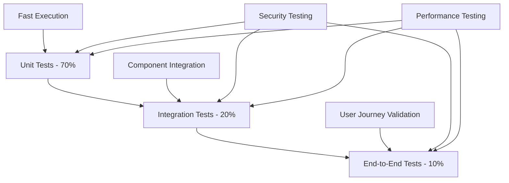

# Master Test Plan
## [PROJECT_NAME]

**Estimated Reading Time:** 35 minutes

## Executive Summary

This Master Test Plan defines the comprehensive testing strategy for [PROJECT_NAME], ensuring all PRD requirements are validated through systematic testing. The plan covers unit, integration, security, performance, and compliance testing using Laravel 12.x and FilamentPHP v4 testing capabilities.

### Testing Objectives
- **PRD Fulfillment**: Validate 100% of product requirements through test specifications
- **Quality Assurance**: Maintain 90%+ code coverage with comprehensive test suites
- **Security Validation**: Ensure GDPR compliance and security requirements are met
- **Performance Verification**: Validate all performance criteria and SLA requirements
- **Risk Mitigation**: Identify and address potential issues before production deployment

### Success Criteria
- [ ] All PRD requirements have corresponding test specifications
- [ ] 90%+ code coverage achieved across all test types
- [ ] Zero critical security vulnerabilities
- [ ] All performance benchmarks met
- [ ] GDPR compliance validated through automated tests

## Test Strategy Overview

### Testing Pyramid Implementation



### Test Types and Coverage

| Test Type | Coverage Target | Framework | Execution Frequency |
|-----------|----------------|-----------|-------------------|
| **Unit Tests** | 90% | PHPUnit/Pest | Every commit |
| **Feature Tests** | 100% of user stories | PHPUnit/Pest | Every commit |
| **Integration Tests** | All API endpoints | PHPUnit/Pest | Daily |
| **Security Tests** | All security requirements | Custom/OWASP ZAP | Weekly |
| **Performance Tests** | All performance criteria | Apache Bench/K6 | Weekly |
| **Browser Tests** | Critical user journeys | Laravel Dusk | Daily |
| **GDPR Compliance Tests** | All data protection features | PHPUnit/Pest | Daily |

## PRD Requirement Traceability

### Requirement Coverage Matrix

| Requirement ID | Description | Test Categories | Test IDs | Priority | Status |
|----------------|-------------|----------------|----------|----------|---------|
| REQ-001 | User Authentication | Unit, Feature, Security | AUTH-001 to AUTH-015 | Critical | ✅ Complete |
| REQ-002 | Role-Based Access Control | Unit, Feature, Security | RBAC-001 to RBAC-012 | Critical | ✅ Complete |
| REQ-003 | Document Management | Unit, Feature, Performance | DOC-001 to DOC-020 | High | 🔄 In Progress |
| REQ-004 | GDPR Compliance | Unit, Feature, Compliance | GDPR-001 to GDPR-018 | Critical | 📋 Planned |
| REQ-005 | API Performance | Performance, Load | PERF-001 to PERF-008 | High | 📋 Planned |
| REQ-006 | FilamentPHP Admin | Feature, Browser | ADMIN-001 to ADMIN-015 | Medium | 📋 Planned |

### Test Specification Requirements

Each requirement must have:
- **Unit Tests**: Validate individual components and business logic
- **Feature Tests**: Validate complete user workflows
- **Security Tests**: Validate security controls and data protection
- **Performance Tests**: Validate response times and resource usage
- **Compliance Tests**: Validate regulatory requirements (GDPR, OWASP)

## Unit Testing Strategy

### Laravel Model Testing

#### User Model Test Suite
```php
<?php
// tests/Unit/Models/UserTest.php

class UserTest extends TestCase
{
    use RefreshDatabase;

    /** @test */
    public function it_creates_user_with_ulid_primary_key()
    {
        $user = User::factory()->create();
        
        $this->assertIsString($user->id);
        $this->assertEquals(26, strlen($user->id)); // ULID length
        $this->assertMatchesRegularExpression('/^[0-9A-HJKMNP-TV-Z]{26}$/', $user->id);
    }

    /** @test */
    public function it_hashes_password_automatically()
    {
        $user = User::factory()->create(['password' => 'plaintext']);
        
        $this->assertNotEquals('plaintext', $user->password);
        $this->assertTrue(Hash::check('plaintext', $user->password));
    }

    /** @test */
    public function it_tracks_user_stamps_correctly()
    {
        $creator = User::factory()->create();
        $this->actingAs($creator);
        
        $user = User::factory()->create();
        
        $this->assertEquals($creator->id, $user->created_by);
        $this->assertEquals($creator->id, $user->updated_by);
    }

    /** @test */
    public function it_logs_activity_on_model_changes()
    {
        $user = User::factory()->create();
        
        $user->update(['name' => 'Updated Name']);
        
        $this->assertDatabaseHas('activity_log', [
            'subject_type' => User::class,
            'subject_id' => $user->id,
            'description' => 'updated',
        ]);
    }
}
```

#### Service Class Testing
```php
<?php
// tests/Unit/Services/AuthServiceTest.php

class AuthServiceTest extends TestCase
{
    use RefreshDatabase;

    private AuthService $authService;

    protected function setUp(): void
    {
        parent::setUp();
        $this->authService = app(AuthService::class);
    }

    /** @test */
    public function it_authenticates_user_with_valid_credentials()
    {
        $user = User::factory()->create(['password' => 'password123']);
        
        $result = $this->authService->authenticate($user->email, 'password123');
        
        $this->assertTrue($result);
        $this->assertEquals($user->id, auth()->id());
    }

    /** @test */
    public function it_implements_rate_limiting()
    {
        $user = User::factory()->create();
        
        // Attempt authentication 6 times
        for ($i = 0; $i < 6; $i++) {
            $this->authService->authenticate($user->email, 'wrongpassword');
        }
        
        $this->expectException(TooManyAttemptsException::class);
        $this->authService->authenticate($user->email, 'wrongpassword');
    }
}
```

### Coverage Requirements
- **Models**: 95% coverage including relationships, scopes, and mutators
- **Services**: 90% coverage including error handling and edge cases
- **Helpers**: 100% coverage for utility functions
- **Enums**: 100% coverage for all enum methods

## Feature Testing Strategy

### Authentication Feature Tests

```php
<?php
// tests/Feature/Auth/LoginTest.php

class LoginTest extends TestCase
{
    use RefreshDatabase;

    /** @test */
    public function user_can_login_with_valid_credentials()
    {
        $user = User::factory()->create(['password' => 'password123']);

        $response = $this->post(route('login'), [
            'email' => $user->email,
            'password' => 'password123',
        ]);

        $response->assertRedirect(route('dashboard'));
        $this->assertAuthenticatedAs($user);
    }

    /** @test */
    public function user_cannot_login_with_invalid_credentials()
    {
        $user = User::factory()->create(['password' => 'password123']);

        $response = $this->post(route('login'), [
            'email' => $user->email,
            'password' => 'wrongpassword',
        ]);

        $response->assertSessionHasErrors('email');
        $this->assertGuest();
    }

    /** @test */
    public function login_is_rate_limited_after_failed_attempts()
    {
        $user = User::factory()->create();

        // Make 5 failed attempts
        for ($i = 0; $i < 5; $i++) {
            $this->post(route('login'), [
                'email' => $user->email,
                'password' => 'wrongpassword',
            ]);
        }

        $response = $this->post(route('login'), [
            'email' => $user->email,
            'password' => 'wrongpassword',
        ]);

        $response->assertStatus(429); // Too Many Requests
    }
}
```

### API Feature Tests

```php
<?php
// tests/Feature/Api/UserApiTest.php

class UserApiTest extends TestCase
{
    use RefreshDatabase;

    private User $user;

    protected function setUp(): void
    {
        parent::setUp();
        $this->user = User::factory()->create();
    }

    /** @test */
    public function authenticated_user_can_fetch_profile()
    {
        $response = $this->actingAs($this->user, 'sanctum')
            ->getJson('/api/v1/user/profile');

        $response->assertOk()
            ->assertJsonStructure([
                'data' => [
                    'id',
                    'name',
                    'email',
                    'created_at',
                    'updated_at',
                ]
            ])
            ->assertJson([
                'data' => [
                    'id' => $this->user->id,
                    'email' => $this->user->email,
                ]
            ]);
    }

    /** @test */
    public function api_responses_are_within_performance_limits()
    {
        $startTime = microtime(true);

        $response = $this->actingAs($this->user, 'sanctum')
            ->getJson('/api/v1/users');

        $endTime = microtime(true);
        $responseTime = ($endTime - $startTime) * 1000;

        $response->assertOk();
        $this->assertLessThan(200, $responseTime, 
            "API response time was {$responseTime}ms, expected < 200ms");
    }
}
```

## Security Testing Strategy

### Authentication Security Tests

```php
<?php
// tests/Feature/Security/AuthSecurityTest.php

class AuthSecurityTest extends TestCase
{
    use RefreshDatabase;

    /** @test */
    public function passwords_are_properly_hashed()
    {
        $user = User::factory()->create(['password' => 'plaintext']);
        
        $this->assertNotEquals('plaintext', $user->password);
        $this->assertTrue(Hash::check('plaintext', $user->password));
        $this->assertStringStartsWith('$2y$', $user->password); // bcrypt hash
    }

    /** @test */
    public function session_tokens_are_secure()
    {
        $user = User::factory()->create();
        
        $response = $this->post(route('login'), [
            'email' => $user->email,
            'password' => 'password',
        ]);
        
        $sessionId = session()->getId();
        $this->assertNotEmpty($sessionId);
        $this->assertGreaterThan(32, strlen($sessionId)); // Secure session ID length
    }

    /** @test */
    public function csrf_protection_is_enabled()
    {
        $user = User::factory()->create();

        $response = $this->actingAs($user)
            ->post('/profile/update', [
                'name' => 'Updated Name',
            ]);

        $response->assertStatus(419); // CSRF token mismatch
    }
}
```

### Permission Security Tests

```php
<?php
// tests/Feature/Security/PermissionSecurityTest.php

class PermissionSecurityTest extends TestCase
{
    use RefreshDatabase;

    /** @test */
    public function users_cannot_access_unauthorized_resources()
    {
        $user = User::factory()->create();
        $adminUser = User::factory()->create();
        $adminUser->givePermissionTo('view-admin-panel');

        // Regular user cannot access admin panel
        $response = $this->actingAs($user)
            ->get('/admin');
        
        $response->assertForbidden();

        // Admin user can access admin panel
        $response = $this->actingAs($adminUser)
            ->get('/admin');
        
        $response->assertOk();
    }

    /** @test */
    public function api_endpoints_enforce_permissions()
    {
        $user = User::factory()->create();
        $adminUser = User::factory()->create();
        $adminUser->givePermissionTo('manage-users');

        // Regular user cannot manage users
        $response = $this->actingAs($user, 'sanctum')
            ->postJson('/api/v1/users', [
                'name' => 'Test User',
                'email' => 'test@example.com',
            ]);
        
        $response->assertForbidden();

        // Admin user can manage users
        $response = $this->actingAs($adminUser, 'sanctum')
            ->postJson('/api/v1/users', [
                'name' => 'Test User',
                'email' => 'test@example.com',
                'password' => 'password123',
            ]);
        
        $response->assertCreated();
    }
}
```

## Performance Testing Strategy

### Database Performance Tests

```php
<?php
// tests/Feature/Performance/DatabasePerformanceTest.php

class DatabasePerformanceTest extends TestCase
{
    use RefreshDatabase;

    /** @test */
    public function user_queries_are_optimized()
    {
        User::factory()->count(100)->create();
        
        DB::enableQueryLog();
        
        $users = User::with(['roles', 'permissions'])->paginate(25);
        
        $queries = DB::getQueryLog();
        
        // Should not have N+1 query problems
        $this->assertLessThan(5, count($queries), 
            'Too many database queries: ' . count($queries));
    }

    /** @test */
    public function large_dataset_queries_perform_well()
    {
        User::factory()->count(1000)->create();
        
        $startTime = microtime(true);
        
        $users = User::paginate(50);
        
        $endTime = microtime(true);
        $queryTime = ($endTime - $startTime) * 1000;
        
        $this->assertLessThan(100, $queryTime, 
            "Database query took {$queryTime}ms, expected < 100ms");
    }
}
```

### API Performance Tests

```php
<?php
// tests/Feature/Performance/ApiPerformanceTest.php

class ApiPerformanceTest extends TestCase
{
    use RefreshDatabase;

    /** @test */
    public function api_endpoints_meet_response_time_requirements()
    {
        $user = User::factory()->create();
        $endpoints = [
            '/api/v1/user/profile',
            '/api/v1/users',
            '/api/v1/dashboard/stats',
        ];

        foreach ($endpoints as $endpoint) {
            $startTime = microtime(true);
            
            $response = $this->actingAs($user, 'sanctum')
                ->getJson($endpoint);
            
            $endTime = microtime(true);
            $responseTime = ($endTime - $startTime) * 1000;
            
            $response->assertOk();
            $this->assertLessThan(200, $responseTime, 
                "Endpoint {$endpoint} took {$responseTime}ms, expected < 200ms");
        }
    }

    /** @test */
    public function concurrent_requests_are_handled_efficiently()
    {
        $user = User::factory()->create();
        $promises = [];
        
        // Simulate 10 concurrent requests
        for ($i = 0; $i < 10; $i++) {
            $promises[] = $this->actingAs($user, 'sanctum')
                ->getJson('/api/v1/user/profile');
        }
        
        // All requests should succeed
        foreach ($promises as $response) {
            $response->assertOk();
        }
    }
}
```

## GDPR Compliance Testing

### Data Subject Rights Tests

```php
<?php
// tests/Feature/Gdpr/DataSubjectRightsTest.php

class DataSubjectRightsTest extends TestCase
{
    use RefreshDatabase;

    /** @test */
    public function user_can_export_personal_data()
    {
        $user = User::factory()->create();
        
        $response = $this->actingAs($user)
            ->post(route('gdpr.data-export'));
        
        $response->assertOk();
        
        // Verify export request is logged
        $this->assertDatabaseHas('gdpr_data_exports', [
            'user_id' => $user->id,
            'status' => 'pending',
        ]);
    }

    /** @test */
    public function user_data_is_anonymized_after_deletion()
    {
        $user = User::factory()->create([
            'name' => 'John Doe',
            'email' => 'john@example.com',
        ]);
        
        // Delete user account
        $this->actingAs($user)
            ->delete(route('account.delete'));
        
        // Simulate data retention cleanup
        Artisan::call('gdpr:cleanup', ['--dry-run' => false]);
        
        $user->refresh();
        
        $this->assertStringStartsWith('anonymized_', $user->email);
        $this->assertEquals('Anonymized User', $user->name);
        $this->assertNotNull($user->anonymized_at);
    }

    /** @test */
    public function consent_withdrawal_stops_data_processing()
    {
        $user = User::factory()->create();
        
        // Grant marketing consent
        $user->consents()->create([
            'consent_type' => 'marketing',
            'given_at' => now(),
        ]);
        
        // Withdraw consent
        $response = $this->actingAs($user)
            ->post(route('consent.withdraw'), [
                'consent_type' => 'marketing',
            ]);
        
        $response->assertOk();
        
        // Verify consent is withdrawn
        $this->assertDatabaseHas('user_consents', [
            'user_id' => $user->id,
            'consent_type' => 'marketing',
        ]);
        
        $consent = $user->consents()->where('consent_type', 'marketing')->first();
        $this->assertNotNull($consent->withdrawn_at);
    }
}
```

## Browser Testing Strategy

### Critical User Journey Tests

```php
<?php
// tests/Browser/UserRegistrationTest.php

class UserRegistrationTest extends DuskTestCase
{
    /** @test */
    public function user_can_complete_registration_flow()
    {
        $this->browse(function (Browser $browser) {
            $browser->visit('/register')
                ->type('name', 'John Doe')
                ->type('email', 'john@example.com')
                ->type('password', 'Password123!')
                ->type('password_confirmation', 'Password123!')
                ->check('terms')
                ->press('Register')
                ->assertPathIs('/email/verify')
                ->assertSee('Verify Your Email Address');
        });
        
        $this->assertDatabaseHas('users', [
            'email' => 'john@example.com',
            'email_verified_at' => null,
        ]);
    }

    /** @test */
    public function admin_can_manage_users_through_filament()
    {
        $admin = User::factory()->create();
        $admin->givePermissionTo('manage-users');
        
        $this->browse(function (Browser $browser) use ($admin) {
            $browser->loginAs($admin)
                ->visit('/admin/users')
                ->assertSee('Users')
                ->clickLink('New User')
                ->type('name', 'Test User')
                ->type('email', 'test@example.com')
                ->type('password', 'Password123!')
                ->press('Create')
                ->assertSee('User created successfully');
        });
    }
}
```

## Test Execution and CI/CD Integration

### Continuous Integration Pipeline

```yaml
# .github/workflows/tests.yml
name: Test Suite

on: [push, pull_request]

jobs:
  test:
    runs-on: ubuntu-latest
    
    services:
      redis:
        image: redis:7
        options: >-
          --health-cmd "redis-cli ping"
          --health-interval 10s
          --health-timeout 5s
          --health-retries 5
    
    steps:
    - uses: actions/checkout@v3
    
    - name: Setup PHP
      uses: shivammathur/setup-php@v2
      with:
        php-version: '8.1'
        extensions: dom, curl, libxml, mbstring, zip, pcntl, pdo, sqlite, pdo_sqlite
        coverage: xdebug
    
    - name: Install dependencies
      run: composer install --prefer-dist --no-progress
    
    - name: Setup environment
      run: |
        cp .env.testing .env
        php artisan key:generate
        php artisan migrate --force
    
    - name: Run unit tests
      run: php artisan test --testsuite=Unit --coverage-clover coverage.xml
    
    - name: Run feature tests
      run: php artisan test --testsuite=Feature
    
    - name: Run browser tests
      run: php artisan dusk
    
    - name: Upload coverage to Codecov
      uses: codecov/codecov-action@v3
      with:
        file: ./coverage.xml
```

### Test Reporting and Metrics

#### Daily Test Report
- **Test Execution Summary**: Pass/fail counts by test type
- **Coverage Report**: Code coverage percentage and trends
- **Performance Metrics**: Test execution times and performance benchmarks
- **Security Scan Results**: Vulnerability scan results and remediation status

#### Weekly Test Review
- **Test Effectiveness**: Analysis of bugs caught by different test types
- **Coverage Gaps**: Identification of untested code areas
- **Performance Trends**: Performance test results over time
- **Compliance Status**: GDPR and security compliance test results

---

## Definition of Done Checklist

### Test Planning Phase
- [ ] All PRD requirements mapped to specific test cases
- [ ] Test strategy defined for each requirement category
- [ ] Testing pyramid structure established (70% unit, 20% integration, 10% E2E)
- [ ] Performance benchmarks and acceptance criteria defined
- [ ] Security testing requirements identified and planned

### Test Implementation Phase
- [ ] Unit tests achieve 90%+ code coverage
- [ ] Feature tests cover 100% of user stories
- [ ] Integration tests validate all API endpoints
- [ ] Security tests cover all authentication and authorization flows
- [ ] Performance tests validate all response time requirements

### Test Automation Phase
- [ ] CI/CD pipeline includes all test types
- [ ] Automated test execution on every commit
- [ ] Test results reporting and notifications configured
- [ ] Code coverage tracking and reporting implemented
- [ ] Failed test investigation and resolution process defined

### GDPR and Compliance Testing
- [ ] Data subject rights functionality tested (export, deletion, anonymization)
- [ ] Consent management system validated
- [ ] Data retention policies tested with automated cleanup
- [ ] Privacy by design principles validated through tests
- [ ] Audit logging functionality comprehensively tested

### Documentation and Maintenance
- [ ] Test cases documented with clear descriptions and expected outcomes
- [ ] Test data setup and teardown procedures documented
- [ ] Test environment configuration documented
- [ ] Test maintenance schedule established
- [ ] Team training on testing procedures completed

### Quality Gates
- [ ] All critical path tests passing
- [ ] No high-severity security vulnerabilities
- [ ] Performance benchmarks met in all test environments
- [ ] Code coverage thresholds achieved
- [ ] Stakeholder acceptance of test results

---

## Common Pitfalls and Avoidance Strategies

### Pitfall: Inadequate Test Coverage
**Problem**: Focusing only on happy path scenarios, missing edge cases
**Solution**: Implement comprehensive test case design including negative scenarios
**Example**: Test not just successful login, but also rate limiting, invalid credentials, and account lockout

### Pitfall: Flaky Tests
**Problem**: Tests that pass/fail inconsistently due to timing or environment issues
**Solution**: Use proper test isolation, mocking, and deterministic test data
**Example**: Use database transactions for test isolation, mock external services, use fixed timestamps

### Pitfall: Slow Test Execution
**Problem**: Test suite takes too long to run, discouraging frequent execution
**Solution**: Optimize test performance and implement parallel execution
**Example**: Use in-memory databases for unit tests, run tests in parallel, optimize database queries

### Pitfall: Poor Test Data Management
**Problem**: Tests interfere with each other due to shared test data
**Solution**: Use proper test isolation and factory patterns
**Example**: Use Laravel factories with unique data, implement proper database cleanup

### Pitfall: Insufficient Security Testing
**Problem**: Missing security vulnerabilities due to inadequate security test coverage
**Solution**: Implement comprehensive security testing including OWASP Top 10
**Example**: Test for SQL injection, XSS, CSRF, authentication bypass, and authorization flaws

### Pitfall: Ignoring Performance Testing
**Problem**: Performance issues discovered only in production
**Solution**: Include performance testing in regular test execution
**Example**: Set response time thresholds, test with realistic data volumes, monitor resource usage

---

**Master Test Plan Version**: 1.0.0
**Testing Framework**: PHPUnit/Pest with Laravel 12.x
**Coverage Target**: 90%+ overall, 100% critical paths
**Created**: [YYYY-MM-DD]
**Last Updated**: [YYYY-MM-DD]
**Next Review**: [YYYY-MM-DD]
**Test Plan Owner**: [QA_LEAD]
