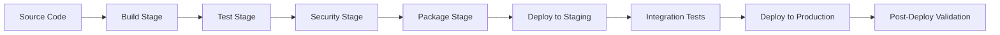
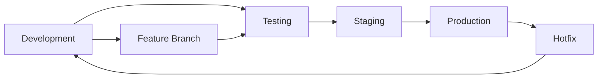

# CI/CD Pipeline Documentation
## Continuous Integration and Continuous Deployment Implementation

**Document Purpose**: Define and document comprehensive CI/CD pipeline for Laravel 12.x and FilamentPHP v4 projects

**Estimated Completion Time**: 3-5 hours  
**Target Audience**: Junior developers, DevOps engineers, project teams  
**Prerequisites**: Git workflow understanding, basic deployment concepts

## Table of Contents

1. [Pipeline Overview](#1-pipeline-overview)
2. [Pipeline Architecture](#2-pipeline-architecture)
3. [Stage Definitions](#3-stage-definitions)
4. [Laravel-Specific Configuration](#4-laravel-specific-configuration)
5. [Environment Management](#5-environment-management)
6. [Security and Quality Gates](#6-security-and-quality-gates)
7. [Deployment Strategies](#7-deployment-strategies)
8. [Monitoring and Notifications](#8-monitoring-and-notifications)
9. [Troubleshooting Guide](#9-troubleshooting-guide)
10. [Maintenance and Updates](#10-maintenance-and-updates)

## 1. Pipeline Overview

### 1.1 CI/CD Objectives

**Continuous Integration Goals**:
- Automated code integration and validation
- Early detection of integration issues
- Consistent build and test processes
- Code quality enforcement

**Continuous Deployment Goals**:
- Automated deployment to multiple environments
- Zero-downtime production deployments
- Rollback capabilities for failed deployments
- Consistent deployment processes

### 1.2 Pipeline Triggers

**Automatic Triggers**:
- Push to main/develop branches
- Pull request creation and updates
- Scheduled builds (nightly, weekly)
- Tag creation for releases

**Manual Triggers**:
- Production deployment approval
- Hotfix deployments
- Infrastructure updates
- Emergency rollbacks

## 2. Pipeline Architecture

### 2.1 High-Level Architecture



### 2.2 Stage Dependencies

**Sequential Stages**:
1. **Source** → **Build** → **Test** → **Security**
2. **Package** → **Deploy Staging** → **Integration Tests**
3. **Deploy Production** → **Post-Deploy Validation**

**Parallel Execution**:
- Unit tests and integration tests
- Security scanning and code quality checks
- Multiple environment deployments

## 3. Stage Definitions

### 3.1 Build Stage

**Purpose**: Compile application and prepare artifacts

**Activities**:
- Composer dependency installation
- NPM package installation
- Asset compilation (Vite/Mix)
- Application key generation
- Configuration caching

**GitHub Actions Example**:
```yaml
name: Build
on:
  push:
    branches: [main, develop]
  pull_request:
    branches: [main]

jobs:
  build:
    runs-on: ubuntu-latest
    steps:
      - uses: actions/checkout@v4
      
      - name: Setup PHP
        uses: shivammathur/setup-php@v2
        with:
          php-version: '8.2'
          extensions: mbstring, dom, fileinfo, mysql
          
      - name: Install Composer dependencies
        run: composer install --no-dev --optimize-autoloader
        
      - name: Setup Node.js
        uses: actions/setup-node@v4
        with:
          node-version: '18'
          
      - name: Install NPM dependencies
        run: npm ci
        
      - name: Build assets
        run: npm run build
        
      - name: Generate application key
        run: php artisan key:generate --show
```

### 3.2 Test Stage

**Purpose**: Validate code quality and functionality

**Test Types**:
- **Unit Tests**: Individual component testing
- **Feature Tests**: Application functionality testing
- **Integration Tests**: System integration validation
- **Browser Tests**: End-to-end user workflows

**Laravel Testing Configuration**:
```yaml
test:
  runs-on: ubuntu-latest
  services:
    mysql:
      image: mysql:8.0
      env:
        MYSQL_ROOT_PASSWORD: password
        MYSQL_DATABASE: testing
      ports:
        - 3306:3306
        
  steps:
    - uses: actions/checkout@v4
    
    - name: Setup PHP
      uses: shivammathur/setup-php@v2
      with:
        php-version: '8.2'
        extensions: mbstring, dom, fileinfo, mysql
        
    - name: Install dependencies
      run: composer install
      
    - name: Copy environment file
      run: cp .env.testing .env
      
    - name: Generate application key
      run: php artisan key:generate
      
    - name: Run database migrations
      run: php artisan migrate --force
      
    - name: Run PHPUnit tests
      run: php artisan test --coverage --min=80
      
    - name: Run Pest tests
      run: ./vendor/bin/pest --coverage --min=80
```

### 3.3 Security Stage

**Purpose**: Identify security vulnerabilities and compliance issues

**Security Checks**:
- Dependency vulnerability scanning
- Static application security testing (SAST)
- Secret detection and validation
- License compliance checking

**Security Tools Integration**:
```yaml
security:
  runs-on: ubuntu-latest
  steps:
    - uses: actions/checkout@v4
    
    - name: Run Composer Audit
      run: composer audit
      
    - name: Run NPM Audit
      run: npm audit --audit-level=high
      
    - name: Security Scan with Snyk
      uses: snyk/actions/php@master
      env:
        SNYK_TOKEN: ${{ secrets.SNYK_TOKEN }}
        
    - name: Secret Detection
      uses: trufflesecurity/trufflehog@main
      with:
        path: ./
        base: main
        head: HEAD
```

### 3.4 Package Stage

**Purpose**: Create deployable artifacts

**Packaging Activities**:
- Application archive creation
- Docker image building
- Artifact versioning and tagging
- Registry upload

**Docker Build Example**:
```dockerfile
# Dockerfile for Laravel application
FROM php:8.2-fpm-alpine

# Install system dependencies
RUN apk add --no-cache \
    git \
    curl \
    libpng-dev \
    oniguruma-dev \
    libxml2-dev \
    zip \
    unzip

# Install PHP extensions
RUN docker-php-ext-install pdo_mysql mbstring exif pcntl bcmath gd

# Install Composer
COPY --from=composer:latest /usr/bin/composer /usr/bin/composer

# Set working directory
WORKDIR /var/www

# Copy application files
COPY . .

# Install dependencies
RUN composer install --no-dev --optimize-autoloader

# Set permissions
RUN chown -R www-data:www-data /var/www
RUN chmod -R 755 /var/www/storage

EXPOSE 9000
CMD ["php-fpm"]
```

## 4. Laravel-Specific Configuration

### 4.1 Environment Configuration

**Environment Variables Management**:
```bash
# .env.pipeline
APP_NAME="Laravel App"
APP_ENV=testing
APP_KEY=base64:generated_key_here
APP_DEBUG=true
APP_URL=http://localhost

DB_CONNECTION=mysql
DB_HOST=127.0.0.1
DB_PORT=3306
DB_DATABASE=testing
DB_USERNAME=root
DB_PASSWORD=password

CACHE_DRIVER=array
SESSION_DRIVER=array
QUEUE_CONNECTION=sync

MAIL_MAILER=array
```

### 4.2 Database Migrations

**Migration Strategy**:
```yaml
migrate:
  runs-on: ubuntu-latest
  steps:
    - name: Run migrations
      run: |
        php artisan migrate --force
        php artisan db:seed --class=ProductionSeeder
        
    - name: Verify migration status
      run: php artisan migrate:status
      
    - name: Generate migration rollback plan
      run: php artisan migrate:rollback --dry-run
```

### 4.3 Cache and Configuration

**Optimization Commands**:
```bash
#!/bin/bash
# Laravel optimization script
set -e

echo "Optimizing Laravel application..."

# Clear existing caches
php artisan config:clear
php artisan route:clear
php artisan view:clear
php artisan cache:clear

# Generate optimized caches
php artisan config:cache
php artisan route:cache
php artisan view:cache

# Optimize Composer autoloader
composer dump-autoload --optimize

echo "Optimization completed!"
```

## 5. Environment Management

### 5.1 Environment Strategy

**Environment Tiers**:
- **Development**: Local development environments
- **Testing**: Automated testing environment
- **Staging**: Pre-production validation environment
- **Production**: Live production environment

**Environment Promotion**:


### 5.2 Configuration Management

**Environment-Specific Configurations**:
```yaml
# config/environments/staging.yml
app:
  debug: false
  log_level: info
  
database:
  connections: 2
  timeout: 30
  
cache:
  driver: redis
  ttl: 3600
  
mail:
  driver: smtp
  host: staging-mail.example.com
```

## 6. Security and Quality Gates

### 6.1 Quality Gates

**Code Quality Thresholds**:
- Test coverage minimum: 80%
- Code complexity maximum: 10
- Duplication maximum: 3%
- Security vulnerabilities: 0 high/critical

**Quality Tools**:
```yaml
quality:
  runs-on: ubuntu-latest
  steps:
    - name: Run PHP CS Fixer
      run: ./vendor/bin/php-cs-fixer fix --dry-run --diff
      
    - name: Run PHPStan
      run: ./vendor/bin/phpstan analyse --level=8
      
    - name: Run PHP Insights
      run: php artisan insights --no-interaction --min-quality=80
      
    - name: Run Larastan
      run: ./vendor/bin/phpstan analyse --memory-limit=2G
```

### 6.2 Security Gates

**Security Validation**:
- No high or critical vulnerabilities
- All secrets properly managed
- Security headers configured
- HTTPS enforcement enabled

## 7. Deployment Strategies

### 7.1 Blue-Green Deployment

**Implementation Strategy**:
```yaml
deploy:
  strategy:
    type: blue-green
    blue_environment: production-blue
    green_environment: production-green
    
  steps:
    - name: Deploy to Green
      run: |
        kubectl apply -f k8s/green-deployment.yaml
        kubectl wait --for=condition=ready pod -l app=laravel-green
        
    - name: Run Health Checks
      run: |
        curl -f http://green.example.com/health
        
    - name: Switch Traffic
      run: |
        kubectl patch service laravel-service -p '{"spec":{"selector":{"version":"green"}}}'
        
    - name: Cleanup Blue
      run: |
        kubectl delete deployment laravel-blue
```

### 7.2 Rolling Deployment

**Gradual Rollout Strategy**:
```yaml
rolling_deployment:
  strategy:
    type: rolling
    max_unavailable: 25%
    max_surge: 25%
    
  health_checks:
    - endpoint: /health
      timeout: 30s
      retries: 3
    - endpoint: /api/status
      timeout: 10s
      retries: 5
```

## 8. Monitoring and Notifications

### 8.1 Pipeline Monitoring

**Metrics Collection**:
- Build duration and success rate
- Test execution time and coverage
- Deployment frequency and success rate
- Mean time to recovery (MTTR)

**Monitoring Dashboard**:
```yaml
dashboard_metrics:
  - build_success_rate
  - average_build_time
  - test_coverage_percentage
  - deployment_frequency
  - failed_deployment_count
  - security_scan_results
```

### 8.2 Notification Configuration

**Notification Channels**:
- Slack for team notifications
- Email for critical failures
- SMS for production incidents
- Dashboard for real-time status

**Notification Rules**:
```yaml
notifications:
  slack:
    channels:
      - "#deployments"
      - "#alerts"
    events:
      - deployment_success
      - deployment_failure
      - security_alert
      
  email:
    recipients:
      - devops@company.com
      - team-lead@company.com
    events:
      - production_deployment_failure
      - critical_security_vulnerability
```

## 9. Troubleshooting Guide

### 9.1 Common Issues

**Build Failures**:
- Dependency conflicts: Check composer.lock and package-lock.json
- Memory issues: Increase PHP memory limit
- Timeout issues: Optimize build steps and caching

**Test Failures**:
- Database connection issues: Verify test database configuration
- Environment variables: Check .env.testing file
- Flaky tests: Implement proper test isolation

**Deployment Failures**:
- Permission issues: Verify file permissions and ownership
- Configuration errors: Validate environment-specific configs
- Resource constraints: Check server capacity and limits

### 9.2 Debugging Procedures

**Pipeline Debugging**:
```bash
# Enable debug mode
export CI_DEBUG=true

# Verbose logging
php artisan --verbose

# Check system resources
df -h
free -m
ps aux | grep php
```

## 10. Maintenance and Updates

### 10.1 Regular Maintenance

**Weekly Tasks**:
- Review pipeline performance metrics
- Update dependency versions
- Clean up old artifacts and logs
- Review security scan results

**Monthly Tasks**:
- Pipeline optimization review
- Tool version updates
- Performance benchmark analysis
- Documentation updates

### 10.2 Pipeline Evolution

**Continuous Improvement**:
- Regular retrospectives on pipeline performance
- Tool evaluation and upgrades
- Process optimization based on metrics
- Team feedback integration

---

## Definition of Done Checklist

### Pipeline Setup
- [ ] All stages defined and configured
- [ ] Environment-specific configurations created
- [ ] Security scanning integrated
- [ ] Quality gates implemented
- [ ] Notification system configured

### Testing and Validation
- [ ] All pipeline stages tested
- [ ] Rollback procedures verified
- [ ] Performance benchmarks established
- [ ] Security scans passing
- [ ] Documentation completed

### Production Readiness
- [ ] Production deployment tested
- [ ] Monitoring and alerting active
- [ ] Team training completed
- [ ] Incident response procedures defined
- [ ] Maintenance schedule established

---

**Navigation:**
← [Previous: DevOps Implementation Guide](130-devops-implementation-guide.md) | [Next: Infrastructure as Code Guide](145-infrastructure-as-code-guide.md) →
| [Template Index](000-index.md) | [Main Documentation](../software-project-documentation-deliverables.md) |

---

**Template Information:**
- **Version**: 1.0.0
- **Last Updated**: 2025-06-30
- **Next Review**: 2025-09-30
- **Template ID**: 135
