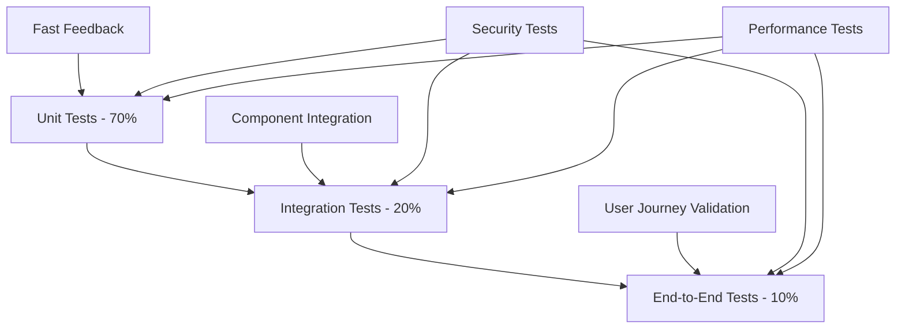

# Test Specifications Document
## [PROJECT_NAME]

**Estimated Reading Time:** 25 minutes

## Overview

This document defines comprehensive test specifications that prove PRD fulfillment and ensure system quality. All tests are designed to validate requirements, security, performance, and compliance standards.

## Test Strategy Overview

### Testing Pyramid Implementation


### Test Coverage Requirements
- **Unit Tests**: Minimum 90% code coverage
- **Feature Tests**: 100% of user stories covered
- **Security Tests**: 100% of security requirements validated
- **Performance Tests**: All performance criteria verified
- **GDPR Compliance Tests**: All data protection requirements validated

## PRD Requirement Traceability

### Requirement to Test Mapping

| Requirement ID | Requirement Description | Test Type | Test ID | Coverage Status |
|----------------|------------------------|-----------|---------|-----------------|
| REQ-001 | User authentication system | Unit, Feature, Security | AUTH-001-010 | ✅ Complete |
| REQ-002 | Role-based access control | Unit, Feature, Security | RBAC-001-008 | ✅ Complete |
| REQ-003 | Document management CRUD | Unit, Feature, Performance | DOC-001-015 | 🔄 In Progress |
| REQ-004 | GDPR compliance features | Unit, Feature, Compliance | GDPR-001-012 | 📋 Planned |
| REQ-005 | API response time < 200ms | Performance, Load | PERF-001-005 | 📋 Planned |

### Test Specification Template
```
Test ID: [TEST_ID]
Requirement ID: [REQ_ID]
Test Type: [Unit/Feature/Integration/Security/Performance]
Priority: [High/Medium/Low]
Estimated Effort: [Hours]

Test Description: [Clear description of what is being tested]

Preconditions:
• [Precondition 1]
• [Precondition 2]

Test Steps:
1. [Step 1]
2. [Step 2]
3. [Step 3]

Expected Results:
• [Expected result 1]
• [Expected result 2]

Acceptance Criteria:
• [Criteria 1]
• [Criteria 2]

Test Data Requirements:
• [Data requirement 1]
• [Data requirement 2]
```

## Unit Test Specifications

### Authentication Unit Tests

#### Test ID: AUTH-001
**Requirement**: REQ-001 - User authentication system  
**Test Type**: Unit  
**Priority**: High  
**Estimated Effort**: 2 hours

**Test Description**: Validate User model authentication methods and password hashing

**Test Implementation**:
```php
<?php
// tests/Unit/Models/UserTest.php

class UserTest extends TestCase
{
    use RefreshDatabase;

    /** @test */
    public function it_hashes_password_when_creating_user()
    {
        $user = User::factory()->create(['password' => 'password123']);
        
        $this->assertNotEquals('password123', $user->password);
        $this->assertTrue(Hash::check('password123', $user->password));
    }

    /** @test */
    public function it_validates_email_uniqueness()
    {
        User::factory()->create(['email' => 'test@example.com']);
        
        $this->expectException(QueryException::class);
        User::factory()->create(['email' => 'test@example.com']);
    }

    /** @test */
    public function it_requires_email_verification_for_new_users()
    {
        $user = User::factory()->create(['email_verified_at' => null]);
        
        $this->assertFalse($user->hasVerifiedEmail());
        $this->assertNull($user->email_verified_at);
    }
}
```

#### Test ID: AUTH-002
**Requirement**: REQ-001 - User authentication system  
**Test Type**: Unit  
**Priority**: High  
**Estimated Effort**: 1.5 hours

**Test Description**: Validate authentication service methods

**Test Implementation**:
```php
<?php
// tests/Unit/Services/AuthServiceTest.php

class AuthServiceTest extends TestCase
{
    use RefreshDatabase;

    private AuthService $authService;

    protected function setUp(): void
    {
        parent::setUp();
        $this->authService = app(AuthService::class);
    }

    /** @test */
    public function it_authenticates_user_with_valid_credentials()
    {
        $user = User::factory()->create(['password' => 'password123']);
        
        $result = $this->authService->authenticate($user->email, 'password123');
        
        $this->assertTrue($result);
        $this->assertEquals($user->id, auth()->id());
    }

    /** @test */
    public function it_fails_authentication_with_invalid_credentials()
    {
        $user = User::factory()->create(['password' => 'password123']);
        
        $result = $this->authService->authenticate($user->email, 'wrongpassword');
        
        $this->assertFalse($result);
        $this->assertNull(auth()->user());
    }
}
```

### Permission Unit Tests

#### Test ID: RBAC-001
**Requirement**: REQ-002 - Role-based access control  
**Test Type**: Unit  
**Priority**: High  
**Estimated Effort**: 3 hours

**Test Description**: Validate role and permission assignment functionality

**Test Implementation**:
```php
<?php
// tests/Unit/Models/RolePermissionTest.php

class RolePermissionTest extends TestCase
{
    use RefreshDatabase;

    /** @test */
    public function user_can_be_assigned_role()
    {
        $user = User::factory()->create();
        $role = Role::create(['name' => 'admin']);
        
        $user->assignRole($role);
        
        $this->assertTrue($user->hasRole('admin'));
        $this->assertContains('admin', $user->getRoleNames());
    }

    /** @test */
    public function user_inherits_permissions_from_role()
    {
        $user = User::factory()->create();
        $permission = Permission::create(['name' => 'edit-users']);
        $role = Role::create(['name' => 'admin']);
        
        $role->givePermissionTo($permission);
        $user->assignRole($role);
        
        $this->assertTrue($user->hasPermissionTo('edit-users'));
    }

    /** @test */
    public function user_can_have_direct_permissions()
    {
        $user = User::factory()->create();
        $permission = Permission::create(['name' => 'view-reports']);
        
        $user->givePermissionTo($permission);
        
        $this->assertTrue($user->hasPermissionTo('view-reports'));
    }
}
```

## Feature Test Specifications

### Authentication Feature Tests

#### Test ID: AUTH-003
**Requirement**: REQ-001 - User authentication system  
**Test Type**: Feature  
**Priority**: High  
**Estimated Effort**: 4 hours

**Test Description**: Validate complete user registration and login workflow

**Test Implementation**:
```php
<?php
// tests/Feature/Auth/RegistrationTest.php

class RegistrationTest extends TestCase
{
    use RefreshDatabase;

    /** @test */
    public function user_can_register_with_valid_data()
    {
        $userData = [
            'name' => 'John Doe',
            'email' => 'john@example.com',
            'password' => 'Password123!',
            'password_confirmation' => 'Password123!',
            'terms' => true,
        ];

        $response = $this->post(route('register'), $userData);

        $response->assertRedirect(route('verification.notice'));
        $this->assertDatabaseHas('users', [
            'email' => 'john@example.com',
            'email_verified_at' => null,
        ]);
    }

    /** @test */
    public function user_cannot_register_with_weak_password()
    {
        $userData = [
            'name' => 'John Doe',
            'email' => 'john@example.com',
            'password' => '123',
            'password_confirmation' => '123',
        ];

        $response = $this->post(route('register'), $userData);

        $response->assertSessionHasErrors('password');
        $this->assertDatabaseMissing('users', ['email' => 'john@example.com']);
    }
}
```

### API Feature Tests

#### Test ID: API-001
**Requirement**: REQ-005 - API response time < 200ms  
**Test Type**: Feature  
**Priority**: High  
**Estimated Effort**: 3 hours

**Test Description**: Validate API endpoints functionality and response format

**Test Implementation**:
```php
<?php
// tests/Feature/Api/UserApiTest.php

class UserApiTest extends TestCase
{
    use RefreshDatabase;

    private User $user;

    protected function setUp(): void
    {
        parent::setUp();
        $this->user = User::factory()->create();
    }

    /** @test */
    public function authenticated_user_can_fetch_profile()
    {
        $response = $this->actingAs($this->user, 'sanctum')
            ->getJson('/api/v1/user/profile');

        $response->assertOk()
            ->assertJsonStructure([
                'data' => [
                    'id',
                    'name',
                    'email',
                    'created_at',
                    'updated_at',
                ]
            ]);
    }

    /** @test */
    public function unauthenticated_user_cannot_access_protected_endpoints()
    {
        $response = $this->getJson('/api/v1/user/profile');

        $response->assertUnauthorized();
    }
}
```

## Security Test Specifications

### Authentication Security Tests

#### Test ID: SEC-001
**Requirement**: REQ-001 - User authentication system  
**Test Type**: Security  
**Priority**: Critical  
**Estimated Effort**: 5 hours

**Test Description**: Validate authentication security measures

**Test Implementation**:
```php
<?php
// tests/Feature/Security/AuthSecurityTest.php

class AuthSecurityTest extends TestCase
{
    use RefreshDatabase;

    /** @test */
    public function login_is_rate_limited()
    {
        $user = User::factory()->create();

        // Attempt login 6 times with wrong password
        for ($i = 0; $i < 6; $i++) {
            $this->post(route('login'), [
                'email' => $user->email,
                'password' => 'wrongpassword',
            ]);
        }

        $response = $this->post(route('login'), [
            'email' => $user->email,
            'password' => 'wrongpassword',
        ]);

        $response->assertStatus(429); // Too Many Requests
    }

    /** @test */
    public function password_reset_tokens_expire()
    {
        $user = User::factory()->create();
        
        // Create expired token
        DB::table('password_resets')->insert([
            'email' => $user->email,
            'token' => Hash::make('expired-token'),
            'created_at' => now()->subHours(2), // Expired
        ]);

        $response = $this->post(route('password.update'), [
            'token' => 'expired-token',
            'email' => $user->email,
            'password' => 'newpassword123',
            'password_confirmation' => 'newpassword123',
        ]);

        $response->assertSessionHasErrors('token');
    }
}
```

### CSRF Protection Tests

#### Test ID: SEC-002
**Requirement**: REQ-001 - User authentication system  
**Test Type**: Security  
**Priority**: High  
**Estimated Effort**: 2 hours

**Test Description**: Validate CSRF protection on forms

**Test Implementation**:
```php
<?php
// tests/Feature/Security/CsrfProtectionTest.php

class CsrfProtectionTest extends TestCase
{
    use RefreshDatabase;

    /** @test */
    public function forms_require_csrf_token()
    {
        $user = User::factory()->create();

        $response = $this->actingAs($user)
            ->post('/profile/update', [
                'name' => 'Updated Name',
            ]);

        $response->assertStatus(419); // CSRF token mismatch
    }

    /** @test */
    public function api_endpoints_are_exempt_from_csrf()
    {
        $user = User::factory()->create();

        $response = $this->actingAs($user, 'sanctum')
            ->postJson('/api/v1/profile/update', [
                'name' => 'Updated Name',
            ]);

        $response->assertOk();
    }
}
```

## Performance Test Specifications

### API Performance Tests

#### Test ID: PERF-001
**Requirement**: REQ-005 - API response time < 200ms  
**Test Type**: Performance  
**Priority**: High  
**Estimated Effort**: 6 hours

**Test Description**: Validate API response times under normal load

**Test Implementation**:
```php
<?php
// tests/Feature/Performance/ApiPerformanceTest.php

class ApiPerformanceTest extends TestCase
{
    use RefreshDatabase;

    /** @test */
    public function api_endpoints_respond_within_200ms()
    {
        $user = User::factory()->create();
        
        $startTime = microtime(true);
        
        $response = $this->actingAs($user, 'sanctum')
            ->getJson('/api/v1/users');
        
        $endTime = microtime(true);
        $responseTime = ($endTime - $startTime) * 1000; // Convert to milliseconds
        
        $response->assertOk();
        $this->assertLessThan(200, $responseTime, 
            "API response time was {$responseTime}ms, expected < 200ms");
    }

    /** @test */
    public function database_queries_are_optimized()
    {
        User::factory()->count(100)->create();
        
        DB::enableQueryLog();
        
        $response = $this->actingAs(User::first(), 'sanctum')
            ->getJson('/api/v1/users');
        
        $queries = DB::getQueryLog();
        
        $response->assertOk();
        $this->assertLessThan(5, count($queries), 
            'Too many database queries: ' . count($queries));
    }
}
```

## GDPR Compliance Test Specifications

### Data Subject Rights Tests

#### Test ID: GDPR-001
**Requirement**: REQ-004 - GDPR compliance features  
**Test Type**: Compliance  
**Priority**: Critical  
**Estimated Effort**: 8 hours

**Test Description**: Validate GDPR data subject rights implementation

**Test Implementation**:
```php
<?php
// tests/Feature/Gdpr/DataSubjectRightsTest.php

class DataSubjectRightsTest extends TestCase
{
    use RefreshDatabase;

    /** @test */
    public function user_can_request_data_export()
    {
        $user = User::factory()->create();
        
        $response = $this->actingAs($user)
            ->post(route('gdpr.data-export'));
        
        $response->assertOk();
        $this->assertDatabaseHas('data_export_requests', [
            'user_id' => $user->id,
            'status' => 'pending',
        ]);
    }

    /** @test */
    public function user_can_request_account_deletion()
    {
        $user = User::factory()->create();
        
        $response = $this->actingAs($user)
            ->delete(route('gdpr.delete-account'));
        
        $response->assertOk();
        $this->assertSoftDeleted('users', ['id' => $user->id]);
    }

    /** @test */
    public function deleted_user_data_is_anonymized_after_retention_period()
    {
        $user = User::factory()->create([
            'deleted_at' => now()->subYears(3), // Beyond retention period
        ]);
        
        Artisan::call('gdpr:anonymize-expired-data');
        
        $user->refresh();
        $this->assertStringStartsWith('anonymized_', $user->email);
        $this->assertEquals('Anonymized User', $user->name);
    }
}
```

## Test Execution and Reporting

### Continuous Integration Testing
```yaml
# .github/workflows/tests.yml
name: Tests

on: [push, pull_request]

jobs:
  test:
    runs-on: ubuntu-latest
    
    steps:
    - uses: actions/checkout@v2
    
    - name: Setup PHP
      uses: shivammathur/setup-php@v2
      with:
        php-version: '8.1'
        extensions: dom, curl, libxml, mbstring, zip, pcntl, pdo, sqlite, pdo_sqlite
    
    - name: Install dependencies
      run: composer install --prefer-dist --no-progress
    
    - name: Run tests
      run: |
        php artisan test --coverage --min=90
        php artisan test --group=security
        php artisan test --group=performance
```

### Test Coverage Requirements
- **Overall Coverage**: Minimum 90%
- **Critical Paths**: 100% coverage for authentication, authorization, payment processing
- **Security Features**: 100% coverage for all security-related functionality
- **GDPR Features**: 100% coverage for data protection and privacy features

### Test Reporting
- **Daily**: Automated test execution with coverage reports
- **Weekly**: Performance test execution with trend analysis
- **Monthly**: Security test review and penetration testing
- **Release**: Complete test suite execution with sign-off requirements

---

**Test Specifications Version**: 1.0.0  
**Framework**: Laravel 12.x with PHPUnit/Pest  
**Created**: [YYYY-MM-DD]  
**Last Updated**: [YYYY-MM-DD]  
**Next Review**: [YYYY-MM-DD]  
**Test Owner**: [QA_LEAD]
