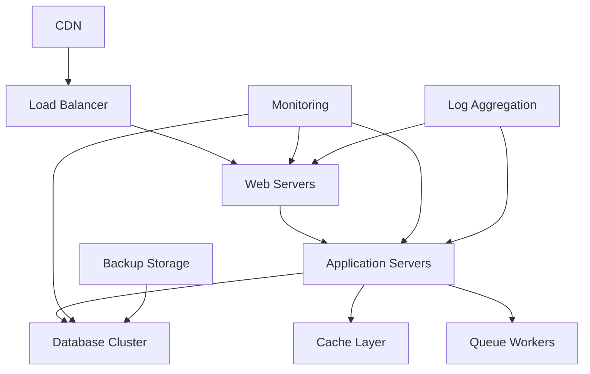

# Infrastructure as Code Guide
## Comprehensive IaC Implementation for Laravel Applications

**Document Purpose**: Define and implement Infrastructure as Code practices for Laravel 12.x and FilamentPHP v4 deployments

**Estimated Completion Time**: 4-6 hours  
**Target Audience**: Junior developers, DevOps engineers, infrastructure teams  
**Prerequisites**: Cloud platform basics, containerization concepts, version control

## Table of Contents

1. [IaC Overview](#1-iac-overview)
2. [Tool Selection and Setup](#2-tool-selection-and-setup)
3. [Infrastructure Architecture](#3-infrastructure-architecture)
4. [Terraform Implementation](#4-terraform-implementation)
5. [Container Orchestration](#5-container-orchestration)
6. [Configuration Management](#6-configuration-management)
7. [Security and Compliance](#7-security-and-compliance)
8. [Monitoring and Observability](#8-monitoring-and-observability)
9. [Disaster Recovery](#9-disaster-recovery)
10. [Best Practices](#10-best-practices)

## 1. IaC Overview

### 1.1 Infrastructure as Code Principles

**Core Concepts**:
- **Declarative Configuration**: Define desired state, not procedural steps
- **Version Control**: All infrastructure changes tracked in Git
- **Immutable Infrastructure**: Replace rather than modify existing resources
- **Automated Provisioning**: Consistent, repeatable deployments

**Benefits for Laravel Projects**:
- Consistent environments across development, staging, and production
- Rapid environment provisioning and scaling
- Reduced configuration drift and manual errors
- Enhanced disaster recovery capabilities

### 1.2 IaC Maturity Model

**Level 1: Basic Automation**
- Manual infrastructure with some automation scripts
- Basic configuration management
- Limited version control for infrastructure

**Level 2: Infrastructure Automation**
- Comprehensive IaC tool adoption
- Automated provisioning and configuration
- Infrastructure version control and testing

**Level 3: Self-Service Infrastructure**
- Developer self-service capabilities
- Automated compliance and security scanning
- Advanced monitoring and optimization

## 2. Tool Selection and Setup

### 2.1 Primary IaC Tools

**Terraform (Recommended)**:
- Multi-cloud support
- Large provider ecosystem
- Strong community and documentation
- Excellent state management

**Alternative Tools**:
- **AWS CloudFormation**: AWS-native solution
- **Pulumi**: Programming language-based IaC
- **Ansible**: Configuration management focus
- **Kubernetes Manifests**: Container-native approach

### 2.2 Tool Installation and Configuration

**Terraform Setup**:
```bash
# Install Terraform
curl -fsSL https://apt.releases.hashicorp.com/gpg | sudo apt-key add -
sudo apt-add-repository "deb [arch=amd64] https://apt.releases.hashicorp.com $(lsb_release -cs) main"
sudo apt-get update && sudo apt-get install terraform

# Verify installation
terraform version

# Initialize Terraform project
terraform init
```

**Directory Structure**:
```
infrastructure/
├── terraform/
│   ├── environments/
│   │   ├── development/
│   │   ├── staging/
│   │   └── production/
│   ├── modules/
│   │   ├── networking/
│   │   ├── compute/
│   │   ├── database/
│   │   └── monitoring/
│   └── shared/
├── ansible/
│   ├── playbooks/
│   ├── roles/
│   └── inventory/
└── kubernetes/
    ├── base/
    ├── overlays/
    └── charts/
```

## 3. Infrastructure Architecture

### 3.1 High-Level Architecture



### 3.2 Component Specifications

**Web Tier**:
- Load balancer with SSL termination
- Auto-scaling web server instances
- CDN for static asset delivery

**Application Tier**:
- PHP-FPM application servers
- Horizontal pod autoscaling
- Session storage (Redis)

**Data Tier**:
- MySQL/PostgreSQL primary-replica setup
- Redis cluster for caching and sessions
- Backup and point-in-time recovery

**Supporting Services**:
- Monitoring and logging infrastructure
- CI/CD pipeline infrastructure
- Security scanning and compliance tools

## 4. Terraform Implementation

### 4.1 Provider Configuration

**AWS Provider Example**:
```hcl
# terraform/providers.tf
terraform {
  required_version = ">= 1.0"
  required_providers {
    aws = {
      source  = "hashicorp/aws"
      version = "~> 5.0"
    }
    kubernetes = {
      source  = "hashicorp/kubernetes"
      version = "~> 2.0"
    }
  }
  
  backend "s3" {
    bucket = "terraform-state-bucket"
    key    = "laravel-app/terraform.tfstate"
    region = "us-west-2"
  }
}

provider "aws" {
  region = var.aws_region
  
  default_tags {
    tags = {
      Project     = var.project_name
      Environment = var.environment
      ManagedBy   = "terraform"
    }
  }
}
```

### 4.2 Network Infrastructure

**VPC and Networking**:
```hcl
# terraform/modules/networking/main.tf
resource "aws_vpc" "main" {
  cidr_block           = var.vpc_cidr
  enable_dns_hostnames = true
  enable_dns_support   = true
  
  tags = {
    Name = "${var.project_name}-vpc"
  }
}

resource "aws_subnet" "public" {
  count = length(var.availability_zones)
  
  vpc_id                  = aws_vpc.main.id
  cidr_block              = var.public_subnet_cidrs[count.index]
  availability_zone       = var.availability_zones[count.index]
  map_public_ip_on_launch = true
  
  tags = {
    Name = "${var.project_name}-public-${count.index + 1}"
    Type = "public"
  }
}

resource "aws_subnet" "private" {
  count = length(var.availability_zones)
  
  vpc_id            = aws_vpc.main.id
  cidr_block        = var.private_subnet_cidrs[count.index]
  availability_zone = var.availability_zones[count.index]
  
  tags = {
    Name = "${var.project_name}-private-${count.index + 1}"
    Type = "private"
  }
}

resource "aws_internet_gateway" "main" {
  vpc_id = aws_vpc.main.id
  
  tags = {
    Name = "${var.project_name}-igw"
  }
}

resource "aws_nat_gateway" "main" {
  count = length(aws_subnet.public)
  
  allocation_id = aws_eip.nat[count.index].id
  subnet_id     = aws_subnet.public[count.index].id
  
  tags = {
    Name = "${var.project_name}-nat-${count.index + 1}"
  }
}
```

### 4.3 Compute Resources

**EKS Cluster for Laravel**:
```hcl
# terraform/modules/compute/eks.tf
resource "aws_eks_cluster" "main" {
  name     = "${var.project_name}-cluster"
  role_arn = aws_iam_role.cluster.arn
  version  = var.kubernetes_version
  
  vpc_config {
    subnet_ids              = var.subnet_ids
    endpoint_private_access = true
    endpoint_public_access  = true
    public_access_cidrs     = var.allowed_cidrs
  }
  
  enabled_cluster_log_types = [
    "api",
    "audit",
    "authenticator",
    "controllerManager",
    "scheduler"
  ]
  
  depends_on = [
    aws_iam_role_policy_attachment.cluster_policy,
    aws_iam_role_policy_attachment.service_policy,
  ]
}

resource "aws_eks_node_group" "main" {
  cluster_name    = aws_eks_cluster.main.name
  node_group_name = "${var.project_name}-nodes"
  node_role_arn   = aws_iam_role.node.arn
  subnet_ids      = var.private_subnet_ids
  
  scaling_config {
    desired_size = var.node_desired_size
    max_size     = var.node_max_size
    min_size     = var.node_min_size
  }
  
  instance_types = var.node_instance_types
  capacity_type  = "ON_DEMAND"
  
  update_config {
    max_unavailable = 1
  }
}
```

### 4.4 Database Infrastructure

**RDS MySQL Setup**:
```hcl
# terraform/modules/database/rds.tf
resource "aws_db_subnet_group" "main" {
  name       = "${var.project_name}-db-subnet-group"
  subnet_ids = var.private_subnet_ids
  
  tags = {
    Name = "${var.project_name}-db-subnet-group"
  }
}

resource "aws_db_instance" "main" {
  identifier = "${var.project_name}-mysql"
  
  engine         = "mysql"
  engine_version = var.mysql_version
  instance_class = var.db_instance_class
  
  allocated_storage     = var.db_allocated_storage
  max_allocated_storage = var.db_max_allocated_storage
  storage_type          = "gp3"
  storage_encrypted     = true
  
  db_name  = var.database_name
  username = var.database_username
  password = var.database_password
  
  vpc_security_group_ids = [aws_security_group.database.id]
  db_subnet_group_name   = aws_db_subnet_group.main.name
  
  backup_retention_period = var.backup_retention_period
  backup_window          = var.backup_window
  maintenance_window     = var.maintenance_window
  
  skip_final_snapshot = var.environment != "production"
  deletion_protection = var.environment == "production"
  
  performance_insights_enabled = true
  monitoring_interval         = 60
  monitoring_role_arn         = aws_iam_role.rds_monitoring.arn
}
```

## 5. Container Orchestration

### 5.1 Kubernetes Manifests

**Laravel Application Deployment**:
```yaml
# kubernetes/base/deployment.yaml
apiVersion: apps/v1
kind: Deployment
metadata:
  name: laravel-app
  labels:
    app: laravel-app
spec:
  replicas: 3
  selector:
    matchLabels:
      app: laravel-app
  template:
    metadata:
      labels:
        app: laravel-app
    spec:
      containers:
      - name: laravel
        image: your-registry/laravel-app:latest
        ports:
        - containerPort: 9000
        env:
        - name: APP_ENV
          value: "production"
        - name: DB_HOST
          valueFrom:
            secretKeyRef:
              name: database-credentials
              key: host
        - name: DB_PASSWORD
          valueFrom:
            secretKeyRef:
              name: database-credentials
              key: password
        resources:
          requests:
            memory: "256Mi"
            cpu: "250m"
          limits:
            memory: "512Mi"
            cpu: "500m"
        livenessProbe:
          httpGet:
            path: /health
            port: 8080
          initialDelaySeconds: 30
          periodSeconds: 10
        readinessProbe:
          httpGet:
            path: /ready
            port: 8080
          initialDelaySeconds: 5
          periodSeconds: 5
```

### 5.2 Helm Charts

**Laravel Helm Chart Structure**:
```
charts/laravel/
├── Chart.yaml
├── values.yaml
├── templates/
│   ├── deployment.yaml
│   ├── service.yaml
│   ├── ingress.yaml
│   ├── configmap.yaml
│   ├── secret.yaml
│   └── hpa.yaml
└── charts/
    ├── mysql/
    └── redis/
```

**Values Configuration**:
```yaml
# charts/laravel/values.yaml
replicaCount: 3

image:
  repository: your-registry/laravel-app
  tag: latest
  pullPolicy: IfNotPresent

service:
  type: ClusterIP
  port: 80
  targetPort: 9000

ingress:
  enabled: true
  className: "nginx"
  annotations:
    cert-manager.io/cluster-issuer: "letsencrypt-prod"
  hosts:
    - host: app.example.com
      paths:
        - path: /
          pathType: Prefix
  tls:
    - secretName: app-tls
      hosts:
        - app.example.com

autoscaling:
  enabled: true
  minReplicas: 3
  maxReplicas: 10
  targetCPUUtilizationPercentage: 70
  targetMemoryUtilizationPercentage: 80

resources:
  limits:
    cpu: 500m
    memory: 512Mi
  requests:
    cpu: 250m
    memory: 256Mi
```

## 6. Configuration Management

### 6.1 Ansible Playbooks

**Server Configuration**:
```yaml
# ansible/playbooks/laravel-setup.yml
---
- name: Configure Laravel Application Servers
  hosts: laravel_servers
  become: yes
  vars:
    php_version: "8.2"
    nodejs_version: "18"
    
  tasks:
    - name: Update package cache
      apt:
        update_cache: yes
        cache_valid_time: 3600
        
    - name: Install PHP and extensions
      apt:
        name:
          - "php{{ php_version }}"
          - "php{{ php_version }}-fpm"
          - "php{{ php_version }}-mysql"
          - "php{{ php_version }}-redis"
          - "php{{ php_version }}-mbstring"
          - "php{{ php_version }}-xml"
          - "php{{ php_version }}-curl"
        state: present
        
    - name: Install Composer
      shell: |
        curl -sS https://getcomposer.org/installer | php
        mv composer.phar /usr/local/bin/composer
        chmod +x /usr/local/bin/composer
      args:
        creates: /usr/local/bin/composer
        
    - name: Configure PHP-FPM
      template:
        src: php-fpm.conf.j2
        dest: "/etc/php/{{ php_version }}/fpm/pool.d/laravel.conf"
      notify: restart php-fpm
      
    - name: Install Node.js
      shell: |
        curl -fsSL https://deb.nodesource.com/setup_{{ nodejs_version }}.x | bash -
        apt-get install -y nodejs
      args:
        creates: /usr/bin/node
        
  handlers:
    - name: restart php-fpm
      service:
        name: "php{{ php_version }}-fpm"
        state: restarted
```

### 6.2 Environment-Specific Configurations

**Environment Variables Management**:
```yaml
# ansible/group_vars/production.yml
app_env: production
app_debug: false
app_url: "https://app.example.com"

database:
  host: "{{ vault_db_host }}"
  name: "{{ vault_db_name }}"
  username: "{{ vault_db_username }}"
  password: "{{ vault_db_password }}"

cache:
  driver: redis
  host: "{{ redis_cluster_endpoint }}"
  
mail:
  driver: smtp
  host: "{{ vault_mail_host }}"
  username: "{{ vault_mail_username }}"
  password: "{{ vault_mail_password }}"
```

## 7. Security and Compliance

### 7.1 Security Groups and Network ACLs

**Database Security Group**:
```hcl
# terraform/modules/security/database.tf
resource "aws_security_group" "database" {
  name_prefix = "${var.project_name}-db-"
  vpc_id      = var.vpc_id
  
  ingress {
    from_port       = 3306
    to_port         = 3306
    protocol        = "tcp"
    security_groups = [aws_security_group.application.id]
  }
  
  egress {
    from_port   = 0
    to_port     = 0
    protocol    = "-1"
    cidr_blocks = ["0.0.0.0/0"]
  }
  
  tags = {
    Name = "${var.project_name}-database-sg"
  }
}
```

### 7.2 IAM Roles and Policies

**Application IAM Role**:
```hcl
# terraform/modules/security/iam.tf
resource "aws_iam_role" "application" {
  name = "${var.project_name}-application-role"
  
  assume_role_policy = jsonencode({
    Version = "2012-10-17"
    Statement = [
      {
        Action = "sts:AssumeRole"
        Effect = "Allow"
        Principal = {
          Service = "ec2.amazonaws.com"
        }
      }
    ]
  })
}

resource "aws_iam_policy" "application" {
  name = "${var.project_name}-application-policy"
  
  policy = jsonencode({
    Version = "2012-10-17"
    Statement = [
      {
        Effect = "Allow"
        Action = [
          "s3:GetObject",
          "s3:PutObject",
          "s3:DeleteObject"
        ]
        Resource = [
          "${aws_s3_bucket.uploads.arn}/*"
        ]
      },
      {
        Effect = "Allow"
        Action = [
          "ses:SendEmail",
          "ses:SendRawEmail"
        ]
        Resource = "*"
      }
    ]
  })
}
```

## 8. Monitoring and Observability

### 8.1 Prometheus and Grafana Setup

**Monitoring Stack**:
```yaml
# kubernetes/monitoring/prometheus.yaml
apiVersion: v1
kind: ConfigMap
metadata:
  name: prometheus-config
data:
  prometheus.yml: |
    global:
      scrape_interval: 15s
    scrape_configs:
      - job_name: 'laravel-app'
        kubernetes_sd_configs:
          - role: pod
        relabel_configs:
          - source_labels: [__meta_kubernetes_pod_label_app]
            action: keep
            regex: laravel-app
          - source_labels: [__meta_kubernetes_pod_annotation_prometheus_io_scrape]
            action: keep
            regex: true
```

### 8.2 Logging Infrastructure

**ELK Stack Configuration**:
```yaml
# kubernetes/logging/elasticsearch.yaml
apiVersion: apps/v1
kind: StatefulSet
metadata:
  name: elasticsearch
spec:
  serviceName: elasticsearch
  replicas: 3
  selector:
    matchLabels:
      app: elasticsearch
  template:
    metadata:
      labels:
        app: elasticsearch
    spec:
      containers:
      - name: elasticsearch
        image: docker.elastic.co/elasticsearch/elasticsearch:8.8.0
        env:
        - name: discovery.type
          value: single-node
        - name: ES_JAVA_OPTS
          value: "-Xms512m -Xmx512m"
        ports:
        - containerPort: 9200
        - containerPort: 9300
        volumeMounts:
        - name: data
          mountPath: /usr/share/elasticsearch/data
  volumeClaimTemplates:
  - metadata:
      name: data
    spec:
      accessModes: ["ReadWriteOnce"]
      resources:
        requests:
          storage: 10Gi
```

## 9. Disaster Recovery

### 9.1 Backup Strategy

**Database Backup Configuration**:
```hcl
# terraform/modules/backup/rds.tf
resource "aws_db_snapshot" "manual" {
  count                  = var.create_manual_snapshot ? 1 : 0
  db_instance_identifier = var.db_instance_identifier
  db_snapshot_identifier = "${var.project_name}-manual-snapshot-${formatdate("YYYY-MM-DD-hhmm", timestamp())}"
}

resource "aws_backup_vault" "main" {
  name        = "${var.project_name}-backup-vault"
  kms_key_arn = aws_kms_key.backup.arn
}

resource "aws_backup_plan" "main" {
  name = "${var.project_name}-backup-plan"
  
  rule {
    rule_name         = "daily_backup"
    target_vault_name = aws_backup_vault.main.name
    schedule          = "cron(0 2 * * ? *)"
    
    lifecycle {
      cold_storage_after = 30
      delete_after       = 365
    }
    
    recovery_point_tags = {
      Environment = var.environment
      Project     = var.project_name
    }
  }
}
```

### 9.2 Recovery Procedures

**Automated Recovery Scripts**:
```bash
#!/bin/bash
# scripts/disaster-recovery.sh
set -e

ENVIRONMENT=${1:-staging}
BACKUP_DATE=${2:-latest}

echo "Starting disaster recovery for environment: $ENVIRONMENT"

# Restore database from backup
aws rds restore-db-instance-from-db-snapshot \
  --db-instance-identifier "${PROJECT_NAME}-${ENVIRONMENT}-restored" \
  --db-snapshot-identifier "${PROJECT_NAME}-${ENVIRONMENT}-${BACKUP_DATE}"

# Wait for database to be available
aws rds wait db-instance-available \
  --db-instance-identifier "${PROJECT_NAME}-${ENVIRONMENT}-restored"

# Update application configuration
kubectl patch configmap laravel-config \
  --patch '{"data":{"DB_HOST":"'${NEW_DB_HOST}'"}}'

# Restart application pods
kubectl rollout restart deployment/laravel-app

echo "Disaster recovery completed successfully"
```

## 10. Best Practices

### 10.1 Code Organization

**Module Structure**:
- Keep modules small and focused
- Use consistent naming conventions
- Document module inputs and outputs
- Implement proper error handling

**Version Control**:
- Tag infrastructure releases
- Use semantic versioning
- Maintain changelog
- Review all infrastructure changes

### 10.2 Security Best Practices

**Access Control**:
- Implement least privilege principle
- Use service accounts for automation
- Regular access reviews and audits
- Multi-factor authentication for admin access

**Secret Management**:
- Never commit secrets to version control
- Use dedicated secret management tools
- Rotate secrets regularly
- Audit secret access

### 10.3 Cost Optimization

**Resource Management**:
- Right-size instances based on usage
- Use spot instances for non-critical workloads
- Implement auto-scaling policies
- Regular cost reviews and optimization

---

## Definition of Done Checklist

### Infrastructure Setup
- [ ] All Terraform modules created and tested
- [ ] Environment-specific configurations defined
- [ ] Security groups and IAM roles configured
- [ ] Monitoring and logging infrastructure deployed
- [ ] Backup and recovery procedures implemented

### Validation and Testing
- [ ] Infrastructure deployment tested in all environments
- [ ] Security scanning and compliance checks passed
- [ ] Disaster recovery procedures tested
- [ ] Performance benchmarks established
- [ ] Documentation completed and reviewed

### Production Readiness
- [ ] Production infrastructure deployed and validated
- [ ] Monitoring and alerting configured
- [ ] Team training on IaC tools completed
- [ ] Maintenance and update procedures defined
- [ ] Cost optimization measures implemented

---

**Navigation:**
← [Previous: CI/CD Pipeline Documentation](135-cicd-pipeline-documentation.md) | [Next: TDD Implementation Guide](150-tdd-implementation-guide.md) →
| [Template Index](000-index.md) | [Main Documentation](../software-project-documentation-deliverables.md) |

---

**Template Information:**
- **Version**: 1.0.0
- **Last Updated**: 2025-06-30
- **Next Review**: 2025-09-30
- **Template ID**: 145
