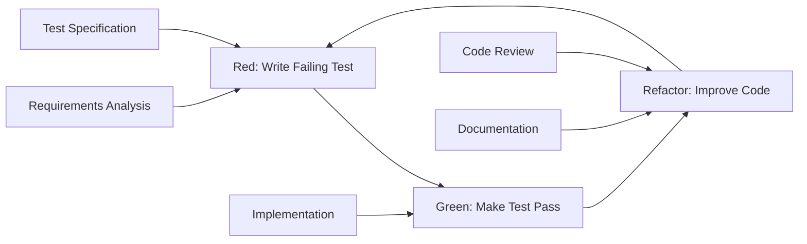

# Test-Driven Development (TDD) Implementation Guide
## [PROJECT_NAME]

**Estimated Reading Time:** 30 minutes

## Overview

This guide provides comprehensive implementation details for Test-Driven Development (TDD) methodology in [PROJECT_NAME] using Laravel 12.x and PHPUnit/Pest. It focuses on proving PRD fulfillment through systematic test-first development.

### TDD Objectives
- **PRD Fulfillment**: Ensure every requirement is validated through tests before implementation
- **Quality Assurance**: Maintain high code quality through comprehensive test coverage
- **Regression Prevention**: Prevent bugs through automated test suites
- **Documentation**: Tests serve as living documentation of system behavior
- **Confidence**: Enable safe refactoring and feature additions

### TDD Benefits for Junior Developers
- **Clear Requirements**: Tests clarify what code should do before writing it
- **Immediate Feedback**: Quick validation of implementation correctness
- **Better Design**: TDD encourages better code architecture and design
- **Debugging Skills**: Systematic approach to identifying and fixing issues
- **Confidence Building**: Comprehensive tests provide confidence in code changes

## TDD Methodology Overview

### The Red-Green-Refactor Cycle



### TDD Principles
1. **Write Tests First**: Always write tests before implementation code
2. **Minimal Implementation**: Write only enough code to make tests pass
3. **Refactor Continuously**: Improve code structure while maintaining test coverage
4. **Test One Thing**: Each test should verify one specific behavior
5. **Fast Feedback**: Tests should run quickly to provide immediate feedback

## Laravel 12.x TDD Setup

### Testing Environment Configuration

#### PHPUnit Configuration
```xml
<!-- phpunit.xml -->
<?xml version="1.0" encoding="UTF-8"?>
<phpunit xmlns:xsi="http://www.w3.org/2001/XMLSchema-instance"
         xsi:noNamespaceSchemaLocation="vendor/phpunit/phpunit/phpunit.xsd"
         bootstrap="vendor/autoload.php"
         colors="true">
    <testsuites>
        <testsuite name="Unit">
            <directory>tests/Unit</directory>
        </testsuite>
        <testsuite name="Feature">
            <directory>tests/Feature</directory>
        </testsuite>
    </testsuites>
    <source>
        <include>
            <directory>app</directory>
        </include>
        <exclude>
            <directory>app/Console/Commands</directory>
            <file>app/Http/Kernel.php</file>
        </exclude>
    </source>
    <php>
        <env name="APP_ENV" value="testing"/>
        <env name="BCRYPT_ROUNDS" value="4"/>
        <env name="CACHE_DRIVER" value="array"/>
        <env name="DB_CONNECTION" value="sqlite"/>
        <env name="DB_DATABASE" value=":memory:"/>
        <env name="MAIL_MAILER" value="array"/>
        <env name="QUEUE_CONNECTION" value="sync"/>
        <env name="SESSION_DRIVER" value="array"/>
    </php>
</phpunit>
```

#### Pest Configuration (Alternative)

```php
<?php
// tests/Pest.php

use Illuminate\Foundation\Testing\RefreshDatabase;use old\TestCase;

uses(TestCase::class, RefreshDatabase::class)->in('Feature');
uses(TestCase::class)->in('Unit');

// Custom expectations
expect()->extend('toBeValidUlid', function () {
    return $this->toMatch('/^[0-9A-HJKMNP-TV-Z]{26}$/');
});

expect()->extend('toHaveValidTimestamps', function () {
    return $this->toHaveKeys(['created_at', 'updated_at']);
});
```

### Test Database Setup
```php
<?php
// tests/TestCase.php

abstract class TestCase extends BaseTestCase
{
    use CreatesApplication, RefreshDatabase;

    protected function setUp(): void
    {
        parent::setUp();
        
        // Optimize SQLite for testing
        if (config('database.default') === 'sqlite') {
            DB::statement('PRAGMA synchronous = OFF');
            DB::statement('PRAGMA journal_mode = MEMORY');
            DB::statement('PRAGMA temp_store = MEMORY');
        }
        
        // Seed essential data
        $this->seedEssentialData();
    }
    
    protected function seedEssentialData(): void
    {
        // Create essential roles and permissions
        Role::create(['name' => 'admin']);
        Role::create(['name' => 'user']);
        
        Permission::create(['name' => 'view-admin']);
        Permission::create(['name' => 'manage-users']);
    }
}
```

## TDD Implementation Workflow

### Step 1: Requirement Analysis and Test Planning

#### PRD Requirement to Test Mapping
```php
<?php
// Example: User Authentication Requirement (REQ-001)

/**
 * PRD Requirement REQ-001: User Authentication System
 * 
 * As a user, I want to securely log into the system
 * So that I can access my personalized content
 * 
 * Acceptance Criteria:
 * - Users can register with email and password
 * - Users can log in with valid credentials
 * - Users cannot log in with invalid credentials
 * - Passwords are securely hashed
 * - Failed login attempts are rate limited
 * 
 * Test Categories Required:
 * - Unit tests for User model
 * - Feature tests for authentication flow
 * - Security tests for password handling
 * - Performance tests for login response time
 */
```

### Step 2: Write Failing Tests (Red Phase)

#### Unit Test Example - User Model
```php
<?php
// tests/Unit/Models/UserTest.php

class UserTest extends TestCase
{
    /** @test */
    public function it_creates_user_with_ulid_primary_key()
    {
        // RED: This test will fail initially because User model doesn't exist
        $user = User::factory()->create();
        
        $this->assertIsString($user->id);
        $this->assertEquals(26, strlen($user->id));
        expect($user->id)->toBeValidUlid();
    }

    /** @test */
    public function it_hashes_password_automatically()
    {
        // RED: This test will fail because password hashing isn't implemented
        $plainPassword = 'password123';
        $user = User::factory()->create(['password' => $plainPassword]);
        
        $this->assertNotEquals($plainPassword, $user->password);
        $this->assertTrue(Hash::check($plainPassword, $user->password));
    }

    /** @test */
    public function it_validates_email_uniqueness()
    {
        // RED: This test will fail because validation isn't implemented
        User::factory()->create(['email' => 'test@example.com']);
        
        $this->expectException(QueryException::class);
        User::factory()->create(['email' => 'test@example.com']);
    }

    /** @test */
    public function it_tracks_user_stamps()
    {
        // RED: This test will fail because user stamps aren't implemented
        $creator = User::factory()->create();
        $this->actingAs($creator);
        
        $user = User::factory()->create();
        
        $this->assertEquals($creator->id, $user->created_by);
        $this->assertEquals($creator->id, $user->updated_by);
    }
}
```

#### Feature Test Example - Authentication Flow
```php
<?php
// tests/Feature/Auth/LoginTest.php

class LoginTest extends TestCase
{
    /** @test */
    public function user_can_login_with_valid_credentials()
    {
        // RED: This test will fail because login functionality doesn't exist
        $user = User::factory()->create([
            'email' => 'test@example.com',
            'password' => 'password123'
        ]);

        $response = $this->post(route('login'), [
            'email' => 'test@example.com',
            'password' => 'password123',
        ]);

        $response->assertRedirect(route('dashboard'));
        $this->assertAuthenticatedAs($user);
    }

    /** @test */
    public function user_cannot_login_with_invalid_credentials()
    {
        // RED: This test will fail because validation doesn't exist
        $user = User::factory()->create([
            'email' => 'test@example.com',
            'password' => 'password123'
        ]);

        $response = $this->post(route('login'), [
            'email' => 'test@example.com',
            'password' => 'wrongpassword',
        ]);

        $response->assertSessionHasErrors('email');
        $this->assertGuest();
    }

    /** @test */
    public function login_is_rate_limited()
    {
        // RED: This test will fail because rate limiting doesn't exist
        $user = User::factory()->create();

        // Make 5 failed attempts
        for ($i = 0; $i < 5; $i++) {
            $this->post(route('login'), [
                'email' => $user->email,
                'password' => 'wrongpassword',
            ]);
        }

        $response = $this->post(route('login'), [
            'email' => $user->email,
            'password' => 'wrongpassword',
        ]);

        $response->assertStatus(429); // Too Many Requests
    }
}
```

### Step 3: Implement Minimal Code (Green Phase)

#### User Model Implementation
```php
<?php
// app/Models/User.php

namespace App\Models;

use Illuminate\Database\Eloquent\Factories\HasFactory;
use Illuminate\Foundation\Auth\User as Authenticatable;
use Illuminate\Notifications\Notifiable;
use Wildside\Userstamps\Userstamps;
use Spatie\Activitylog\Traits\LogsActivity;
use Spatie\Activitylog\LogOptions;

class User extends Authenticatable
{
    use HasFactory, Notifiable, Userstamps, LogsActivity;

    protected $keyType = 'string';
    public $incrementing = false;

    protected $fillable = [
        'name',
        'email',
        'password',
    ];

    protected $hidden = [
        'password',
        'remember_token',
    ];

    protected $casts = [
        'email_verified_at' => 'datetime',
        'password' => 'hashed', // Laravel 12.x automatic hashing
    ];

    // Generate ULID for primary key
    protected static function boot()
    {
        parent::boot();
        
        static::creating(function ($model) {
            if (empty($model->id)) {
                $model->id = (string) Str::ulid();
            }
        });
    }

    // Activity log configuration
    public function getActivitylogOptions(): LogOptions
    {
        return LogOptions::defaults()
            ->logOnly(['name', 'email'])
            ->logOnlyDirty()
            ->dontSubmitEmptyLogs();
    }
}
```

#### User Factory Implementation
```php
<?php
// database/factories/UserFactory.php

namespace Database\Factories;

use Illuminate\Database\Eloquent\Factories\Factory;
use Illuminate\Support\Str;

class UserFactory extends Factory
{
    public function definition(): array
    {
        return [
            'id' => (string) Str::ulid(),
            'name' => fake()->name(),
            'email' => fake()->unique()->safeEmail(),
            'email_verified_at' => now(),
            'password' => 'password123', // Will be hashed automatically
            'remember_token' => Str::random(10),
        ];
    }

    public function unverified(): static
    {
        return $this->state(fn (array $attributes) => [
            'email_verified_at' => null,
        ]);
    }
}
```

#### Authentication Controller Implementation
```php
<?php
// app/Http/Controllers/Auth/LoginController.php

namespace App\Http\Controllers\Auth;

use App\Http\Controllers\Controller;
use App\Http\Requests\Auth\LoginRequest;
use Illuminate\Http\RedirectResponse;
use Illuminate\Http\Request;
use Illuminate\Support\Facades\Auth;
use Illuminate\Support\Facades\RateLimiter;
use Illuminate\Validation\ValidationException;

class LoginController extends Controller
{
    public function store(LoginRequest $request): RedirectResponse
    {
        // Check rate limiting
        $this->ensureIsNotRateLimited($request);

        if (! Auth::attempt($request->only('email', 'password'), $request->boolean('remember'))) {
            // Record failed attempt
            RateLimiter::hit($this->throttleKey($request));

            throw ValidationException::withMessages([
                'email' => __('auth.failed'),
            ]);
        }

        // Clear rate limiting on successful login
        RateLimiter::clear($this->throttleKey($request));

        $request->session()->regenerate();

        return redirect()->intended(route('dashboard'));
    }

    protected function ensureIsNotRateLimited(LoginRequest $request): void
    {
        if (! RateLimiter::tooManyAttempts($this->throttleKey($request), 5)) {
            return;
        }

        $seconds = RateLimiter::availableIn($this->throttleKey($request));

        throw ValidationException::withMessages([
            'email' => trans('auth.throttle', [
                'seconds' => $seconds,
                'minutes' => ceil($seconds / 60),
            ]),
        ])->status(429);
    }

    protected function throttleKey(Request $request): string
    {
        return Str::transliterate(Str::lower($request->input('email')).'|'.$request->ip());
    }
}
```

### Step 4: Refactor and Improve (Refactor Phase)

#### Service Layer Extraction
```php
<?php
// app/Services/AuthenticationService.php

namespace App\Services;

use App\Models\User;
use Illuminate\Support\Facades\Auth;
use Illuminate\Support\Facades\Hash;
use Illuminate\Support\Facades\RateLimiter;

class AuthenticationService
{
    public function authenticate(string $email, string $password, bool $remember = false): bool
    {
        $user = User::where('email', $email)->first();
        
        if (!$user || !Hash::check($password, $user->password)) {
            $this->recordFailedAttempt($email);
            return false;
        }
        
        Auth::login($user, $remember);
        $this->clearFailedAttempts($email);
        
        return true;
    }
    
    public function isRateLimited(string $email, string $ip): bool
    {
        return RateLimiter::tooManyAttempts($this->getThrottleKey($email, $ip), 5);
    }
    
    private function recordFailedAttempt(string $email): void
    {
        RateLimiter::hit($this->getThrottleKey($email, request()->ip()));
        
        // Log failed attempt for security monitoring
        activity()
            ->withProperties(['email' => $email, 'ip' => request()->ip()])
            ->log('login_failed');
    }
    
    private function clearFailedAttempts(string $email): void
    {
        RateLimiter::clear($this->getThrottleKey($email, request()->ip()));
    }
    
    private function getThrottleKey(string $email, string $ip): string
    {
        return "login_attempts:{$email}:{$ip}";
    }
}
```

#### Refactored Controller
```php
<?php
// app/Http/Controllers/Auth/LoginController.php (Refactored)

class LoginController extends Controller
{
    public function __construct(
        private AuthenticationService $authService
    ) {}

    public function store(LoginRequest $request): RedirectResponse
    {
        if ($this->authService->isRateLimited($request->email, $request->ip())) {
            throw ValidationException::withMessages([
                'email' => __('auth.throttle'),
            ])->status(429);
        }

        if (!$this->authService->authenticate(
            $request->email,
            $request->password,
            $request->boolean('remember')
        )) {
            throw ValidationException::withMessages([
                'email' => __('auth.failed'),
            ]);
        }

        $request->session()->regenerate();

        return redirect()->intended(route('dashboard'));
    }
}
```

## TDD Best Practices for Laravel

### Test Organization

#### Test Structure
```
tests/
├── Unit/
│   ├── Models/
│   │   ├── UserTest.php
│   │   └── PostTest.php
│   ├── Services/
│   │   ├── AuthenticationServiceTest.php
│   │   └── NotificationServiceTest.php
│   └── Helpers/
│       └── UtilityHelpersTest.php
├── Feature/
│   ├── Auth/
│   │   ├── LoginTest.php
│   │   ├── RegistrationTest.php
│   │   └── PasswordResetTest.php
│   ├── Api/
│   │   ├── UserApiTest.php
│   │   └── PostApiTest.php
│   └── Admin/
│       └── UserManagementTest.php
└── Browser/
    ├── LoginFlowTest.php
    └── UserRegistrationFlowTest.php
```

#### Test Naming Conventions
```php
<?php
// Good test naming - describes behavior clearly

class UserTest extends TestCase
{
    /** @test */
    public function it_creates_user_with_valid_data() { }
    
    /** @test */
    public function it_throws_exception_when_email_is_duplicate() { }
    
    /** @test */
    public function it_hashes_password_before_saving() { }
    
    /** @test */
    public function it_generates_ulid_for_primary_key() { }
}

// Alternative Pest syntax
test('it creates user with valid data', function () {
    $user = User::factory()->create();
    
    expect($user)->toBeInstanceOf(User::class);
    expect($user->id)->toBeValidUlid();
});
```

### Test Data Management

#### Factory-Based Test Data
```php
<?php
// database/factories/UserFactory.php

class UserFactory extends Factory
{
    public function definition(): array
    {
        return [
            'name' => fake()->name(),
            'email' => fake()->unique()->safeEmail(),
            'password' => 'password123',
            'email_verified_at' => now(),
        ];
    }
    
    // State methods for different scenarios
    public function unverified(): static
    {
        return $this->state(['email_verified_at' => null]);
    }
    
    public function admin(): static
    {
        return $this->afterCreating(function (User $user) {
            $user->assignRole('admin');
        });
    }
    
    public function withPosts(int $count = 3): static
    {
        return $this->has(Post::factory()->count($count));
    }
}
```

#### Test-Specific Seeders
```php
<?php
// database/seeders/TestSeeder.php

class TestSeeder extends Seeder
{
    public function run(): void
    {
        // Create essential roles and permissions for testing
        $adminRole = Role::create(['name' => 'admin']);
        $userRole = Role::create(['name' => 'user']);
        
        $permissions = [
            'view-admin',
            'manage-users',
            'create-posts',
            'edit-posts',
            'delete-posts',
        ];
        
        foreach ($permissions as $permission) {
            Permission::create(['name' => $permission]);
        }
        
        $adminRole->givePermissionTo($permissions);
        $userRole->givePermissionTo(['create-posts', 'edit-posts']);
    }
}
```

### Performance Testing in TDD

#### Response Time Testing
```php
<?php
// tests/Feature/Performance/ApiPerformanceTest.php

class ApiPerformanceTest extends TestCase
{
    /** @test */
    public function api_endpoints_respond_within_performance_budget()
    {
        $user = User::factory()->create();
        
        $endpoints = [
            '/api/v1/user/profile',
            '/api/v1/users',
            '/api/v1/posts',
        ];
        
        foreach ($endpoints as $endpoint) {
            $startTime = microtime(true);
            
            $response = $this->actingAs($user, 'sanctum')
                ->getJson($endpoint);
            
            $endTime = microtime(true);
            $responseTime = ($endTime - $startTime) * 1000; // Convert to milliseconds
            
            $response->assertOk();
            $this->assertLessThan(200, $responseTime, 
                "Endpoint {$endpoint} took {$responseTime}ms, expected < 200ms");
        }
    }
    
    /** @test */
    public function database_queries_are_optimized()
    {
        User::factory()->count(50)->create();
        
        DB::enableQueryLog();
        
        $users = User::with(['roles', 'permissions'])->paginate(25);
        
        $queries = DB::getQueryLog();
        
        // Should not have N+1 query problems
        $this->assertLessThan(5, count($queries), 
            'Too many database queries: ' . count($queries));
    }
}
```

## TDD Workflow Integration

### Git Workflow with TDD
```bash
# TDD Git workflow example

# 1. Create feature branch
git checkout -b feature/user-authentication

# 2. Write failing tests (Red)
git add tests/
git commit -m "Red: Add failing tests for user authentication"

# 3. Implement minimal code (Green)
git add app/
git commit -m "Green: Implement basic user authentication"

# 4. Refactor and improve (Refactor)
git add .
git commit -m "Refactor: Extract authentication service and improve code structure"

# 5. Run full test suite
php artisan test

# 6. Create pull request
git push origin feature/user-authentication
```

### Continuous Integration with TDD
```yaml
# .github/workflows/tdd-workflow.yml
name: TDD Workflow

on: [push, pull_request]

jobs:
  test:
    runs-on: ubuntu-latest
    
    steps:
    - uses: actions/checkout@v3
    
    - name: Setup PHP
      uses: shivammathur/setup-php@v2
      with:
        php-version: '8.1'
        extensions: dom, curl, libxml, mbstring, zip, pcntl, pdo, sqlite, pdo_sqlite
        coverage: xdebug
    
    - name: Install dependencies
      run: composer install --prefer-dist --no-progress
    
    - name: Run tests with coverage
      run: php artisan test --coverage --min=90
    
    - name: Check code style
      run: ./vendor/bin/pint --test
    
    - name: Static analysis
      run: ./vendor/bin/phpstan analyse
```

---

**TDD Implementation Guide Version**: 1.0.0  
**Methodology**: Test-Driven Development  
**Framework**: Laravel 12.x with PHPUnit/Pest  
**Coverage Target**: 90%+ with PRD fulfillment focus  
**Created**: [YYYY-MM-DD]  
**Last Updated**: [YYYY-MM-DD]  
**Next Review**: [YYYY-MM-DD]  
**TDD Champion**: [TECHNICAL_LEAD]
