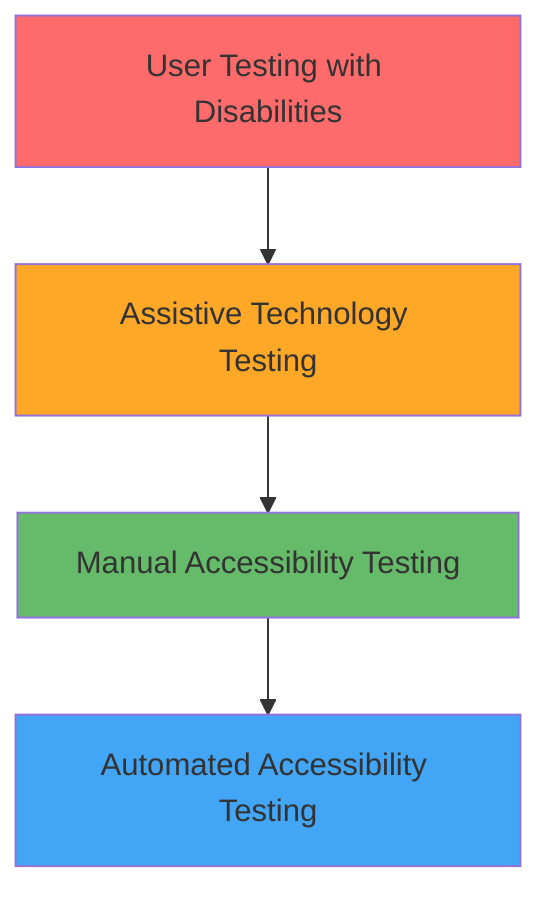
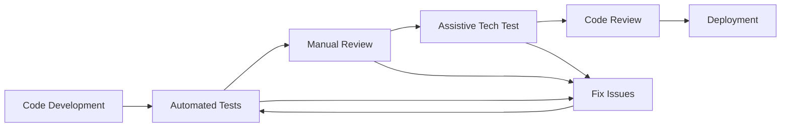

# Accessibility Testing Procedures
## Comprehensive Testing Framework for WCAG 2.1 AA Compliance

**Document Purpose**: Establish systematic accessibility testing procedures for Laravel 12.x and FilamentPHP v4 applications

**Estimated Completion Time**: 2-4 hours  
**Target Audience**: QA testers, junior developers, accessibility specialists  
**Prerequisites**: Basic testing concepts, accessibility awareness, browser tools familiarity

## Table of Contents

1. [Testing Overview](#1-testing-overview)
2. [Automated Testing](#2-automated-testing)
3. [Manual Testing](#3-manual-testing)
4. [Assistive Technology Testing](#4-assistive-technology-testing)
5. [User Testing](#5-user-testing)
6. [Testing Workflows](#6-testing-workflows)
7. [Reporting and Documentation](#7-reporting-and-documentation)
8. [Continuous Integration](#8-continuous-integration)
9. [Tools and Setup](#9-tools-and-setup)
10. [Troubleshooting](#10-troubleshooting)

## 1. Testing Overview

### 1.1 Testing Strategy

**Multi-Layer Approach**:
- **Automated Testing**: Fast, consistent baseline validation
- **Manual Testing**: Human judgment for complex interactions
- **Assistive Technology Testing**: Real-world usage validation
- **User Testing**: Feedback from actual users with disabilities

**Testing Pyramid**:


### 1.2 Testing Scope

**WCAG 2.1 AA Coverage**:
- **Level A**: 25 success criteria (must pass)
- **Level AA**: 13 additional success criteria (must pass)
- **Level AAA**: 23 additional criteria (optional, context-dependent)

**Testing Areas**:
- Keyboard navigation and focus management
- Screen reader compatibility and semantics
- Color contrast and visual design
- Form accessibility and error handling
- Content structure and navigation

## 2. Automated Testing

### 2.1 Laravel Accessibility Tests

**PHPUnit Accessibility Test Suite**:

```php
<?php

namespace Tests\Feature\Accessibility;

use Illuminate\Foundation\Testing\RefreshDatabase;use old\TestCase;

class AccessibilityComplianceTest extends TestCase
{
    use RefreshDatabase;
    
    /** @test */
    public function homepage_passes_accessibility_audit()
    {
        $response = $this->get('/');
        
        $response->assertStatus(200);
        
        // Test heading hierarchy
        $this->assertValidHeadingHierarchy($response->getContent());
        
        // Test image alt attributes
        $this->assertAllImagesHaveAltText($response->getContent());
        
        // Test form labels
        $this->assertAllInputsHaveLabels($response->getContent());
    }
    
    /** @test */
    public function contact_form_is_accessible()
    {
        $response = $this->get('/contact');
        
        $content = $response->getContent();
        
        // Test form structure
        $this->assertStringContainsString('<form', $content);
        $this->assertStringContainsString('novalidate', $content);
        
        // Test required field indicators
        $this->assertRequiredFieldsAreMarked($content);
        
        // Test error handling structure
        $this->assertErrorHandlingIsAccessible($content);
    }
    
    private function assertValidHeadingHierarchy(string $content): void
    {
        // Extract all headings
        preg_match_all('/<h([1-6])[^>]*>/', $content, $matches);
        $headingLevels = array_map('intval', $matches[1]);
        
        // Must have exactly one H1
        $h1Count = count(array_filter($headingLevels, fn($level) => $level === 1));
        $this->assertEquals(1, $h1Count, 'Page must have exactly one H1 element');
        
        // Check for proper hierarchy (no skipping levels)
        for ($i = 1; $i < count($headingLevels); $i++) {
            $current = $headingLevels[$i];
            $previous = $headingLevels[$i - 1];
            
            if ($current > $previous + 1) {
                $this->fail("Heading hierarchy violation: H{$previous} followed by H{$current}");
            }
        }
    }
    
    private function assertAllImagesHaveAltText(string $content): void
    {
        preg_match_all('/]*>/', $content, $images);
        
        foreach ($images[0] as $img) {
            $this->assertStringContainsString('alt=', $img, 
                'All images must have alt attributes: ' . $img);
        }
    }
    
    private function assertAllInputsHaveLabels(string $content): void
    {
        // Get all input IDs
        preg_match_all('/<input[^>]*id="([^"]*)"[^>]*>/', $content, $inputMatches);
        $inputIds = $inputMatches[1];
        
        // Get all label for attributes
        preg_match_all('/<label[^>]*for="([^"]*)"[^>]*>/', $content, $labelMatches);
        $labelFors = $labelMatches[1];
        
        foreach ($inputIds as $inputId) {
            $this->assertContains($inputId, $labelFors, 
                "Input with id '{$inputId}' must have a corresponding label");
        }
    }
}
```

### 2.2 JavaScript Accessibility Testing

**Axe-Core Integration**:
```javascript
// tests/accessibility/axe-tests.js
const { AxePuppeteer } = require('@axe-core/puppeteer');
const puppeteer = require('puppeteer');

describe('Accessibility Tests', () => {
    let browser;
    let page;
    
    beforeAll(async () => {
        browser = await puppeteer.launch();
        page = await browser.newPage();
    });
    
    afterAll(async () => {
        await browser.close();
    });
    
    test('Homepage accessibility', async () => {
        await page.goto('http://localhost:8000');
        
        const results = await new AxePuppeteer(page).analyze();
        
        expect(results.violations).toHaveLength(0);
    });
    
    test('Contact form accessibility', async () => {
        await page.goto('http://localhost:8000/contact');
        
        const results = await new AxePuppeteer(page)
            .withTags(['wcag2a', 'wcag2aa'])
            .analyze();
        
        expect(results.violations).toHaveLength(0);
        
        // Test specific form interactions
        await page.focus('#name');
        const focusedElement = await page.evaluate(() => document.activeElement.id);
        expect(focusedElement).toBe('name');
    });
    
    test('Navigation accessibility', async () => {
        await page.goto('http://localhost:8000');
        
        // Test keyboard navigation
        await page.keyboard.press('Tab');
        const firstFocusable = await page.evaluate(() => document.activeElement.tagName);
        expect(['A', 'BUTTON', 'INPUT']).toContain(firstFocusable);
        
        // Test skip link
        await page.keyboard.press('Tab');
        const skipLinkText = await page.evaluate(() => document.activeElement.textContent);
        expect(skipLinkText).toContain('Skip');
    });
});
```

### 2.3 CI/CD Integration

**GitHub Actions Accessibility Testing**:
```yaml
name: Accessibility Testing

on:
  push:
    branches: [main, develop]
  pull_request:
    branches: [main]

jobs:
  accessibility:
    runs-on: ubuntu-latest
    
    steps:
      - uses: actions/checkout@v4
      
      - name: Setup PHP
        uses: shivammathur/setup-php@v2
        with:
          php-version: '8.2'
          
      - name: Install dependencies
        run: composer install
        
      - name: Setup application
        run: |
          cp .env.testing .env
          php artisan key:generate
          php artisan migrate --force
          
      - name: Start Laravel server
        run: php artisan serve &
        
      - name: Setup Node.js
        uses: actions/setup-node@v4
        with:
          node-version: '18'
          
      - name: Install accessibility testing tools
        run: |
          npm install -g @axe-core/cli
          npm install puppeteer @axe-core/puppeteer jest
          
      - name: Run accessibility tests
        run: |
          # Wait for server to start
          sleep 5
          
          # Run axe-core CLI tests
          axe http://localhost:8000 --tags wcag2a,wcag2aa
          
          # Run custom accessibility tests
          npm test -- tests/accessibility/
          
      - name: Run Laravel accessibility tests
        run: php artisan test --filter=Accessibility
```

## 3. Manual Testing

### 3.1 Keyboard Navigation Testing

**Keyboard Testing Checklist**:
```markdown
## Keyboard Navigation Test

### Basic Navigation
- [ ] Tab key moves focus forward through interactive elements
- [ ] Shift+Tab moves focus backward through interactive elements
- [ ] Focus order is logical and follows visual layout
- [ ] All interactive elements are reachable via keyboard
- [ ] No keyboard traps exist (can always navigate away)

### Focus Indicators
- [ ] Focus indicators are clearly visible on all elements
- [ ] Focus indicators have sufficient contrast (3:1 minimum)
- [ ] Focus indicators are not obscured by other elements
- [ ] Custom focus styles maintain accessibility

### Skip Links
- [ ] Skip link appears when focused
- [ ] Skip link moves focus to main content
- [ ] Skip link text is descriptive
- [ ] Multiple skip links provided if needed

### Form Navigation
- [ ] Tab order through form fields is logical
- [ ] Required fields are clearly indicated
- [ ] Error messages receive focus when triggered
- [ ] Form submission possible via keyboard (Enter key)

### Interactive Elements
- [ ] Buttons activate with Space or Enter
- [ ] Links activate with Enter
- [ ] Dropdown menus accessible via arrow keys
- [ ] Modal dialogs trap focus appropriately
```

### 3.2 Visual Testing

**Visual Accessibility Checklist**:
```markdown
## Visual Accessibility Test

### Color and Contrast
- [ ] Text contrast meets WCAG AA standards (4.5:1)
- [ ] Large text contrast meets standards (3:1)
- [ ] UI component contrast meets standards (3:1)
- [ ] Information not conveyed by color alone
- [ ] Color combinations avoid problematic pairs

### Typography
- [ ] Font size is at least 16px for body text
- [ ] Line height is at least 1.5 for body text
- [ ] Text can be resized to 200% without horizontal scrolling
- [ ] Font choices are readable and clear

### Layout and Spacing
- [ ] Touch targets are at least 44x44 pixels
- [ ] Adequate spacing between interactive elements
- [ ] Content reflows properly at different zoom levels
- [ ] No horizontal scrolling at 400% zoom

### Motion and Animation
- [ ] Animations can be paused or disabled
- [ ] No content flashes more than 3 times per second
- [ ] Motion-based interactions have alternatives
- [ ] Reduced motion preferences respected
```

### 3.3 Content Testing

**Content Accessibility Review**:
```markdown
## Content Accessibility Test

### Heading Structure
- [ ] Page has exactly one H1 element
- [ ] Heading hierarchy is logical (no skipped levels)
- [ ] Headings accurately describe content sections
- [ ] Heading text is descriptive and unique

### Images and Media
- [ ] All images have appropriate alt text
- [ ] Decorative images have empty alt attributes
- [ ] Complex images have detailed descriptions
- [ ] Alt text is concise and descriptive

### Links and Navigation
- [ ] Link text is descriptive and unique
- [ ] Link purpose is clear from context
- [ ] Navigation is consistent across pages
- [ ] Breadcrumbs provided where appropriate

### Forms
- [ ] All form inputs have associated labels
- [ ] Required fields are clearly marked
- [ ] Error messages are descriptive and helpful
- [ ] Instructions are provided where needed
```

## 4. Assistive Technology Testing

### 4.1 Screen Reader Testing

**NVDA Testing Procedure**:
```markdown
## NVDA Screen Reader Test

### Setup
1. Download and install NVDA (free)
2. Close eyes or turn off monitor
3. Navigate using only keyboard and audio feedback

### Navigation Testing
- [ ] Page title is announced when page loads
- [ ] Heading navigation works (H key)
- [ ] Landmark navigation works (D key for main, N key for nav)
- [ ] Link navigation works (K key)
- [ ] Form navigation works (F key for forms, E key for edit fields)

### Content Testing
- [ ] All text content is announced
- [ ] Images are announced with alt text
- [ ] Form labels are announced with inputs
- [ ] Error messages are announced
- [ ] Status updates are announced

### Interaction Testing
- [ ] Button purposes are clear
- [ ] Form submission feedback is provided
- [ ] Modal dialogs are announced
- [ ] Dynamic content changes are announced
```

**VoiceOver Testing (macOS)**:
```markdown
## VoiceOver Testing Procedure

### Activation
- Press Cmd+F5 to enable VoiceOver
- Use VoiceOver Utility for configuration

### Navigation Commands
- Control+Option+Right Arrow: Next item
- Control+Option+Left Arrow: Previous item
- Control+Option+U: Rotor menu
- Control+Option+H: Next heading
- Control+Option+L: Next link

### Testing Checklist
- [ ] Rotor navigation works for headings, links, forms
- [ ] Table navigation is logical
- [ ] Form controls are properly labeled
- [ ] Dynamic content updates are announced
- [ ] Custom controls have appropriate roles
```

### 4.2 Voice Control Testing

**Dragon NaturallySpeaking/Voice Control**:
```markdown
## Voice Control Testing

### Setup
- Enable voice control on device
- Calibrate voice recognition
- Test in quiet environment

### Navigation Testing
- [ ] "Click [button name]" activates buttons
- [ ] "Click [link text]" follows links
- [ ] Form fields can be selected by label
- [ ] Custom controls respond to voice commands

### Content Interaction
- [ ] Text can be dictated into form fields
- [ ] Voice commands work for navigation
- [ ] Error correction is possible
- [ ] Complex interactions have voice alternatives
```

## 5. User Testing

### 5.1 User Testing with Disabilities

**Recruitment and Setup**:
```markdown
## User Testing Protocol

### Participant Recruitment
- Recruit users with various disabilities
- Include screen reader users
- Include keyboard-only users
- Include users with cognitive disabilities
- Include users with motor impairments

### Testing Environment
- Provide familiar assistive technology
- Allow participants to use their own devices
- Ensure comfortable testing environment
- Have technical support available

### Testing Tasks
1. Navigate to main content
2. Find specific information
3. Complete a form
4. Use search functionality
5. Access help or support

### Data Collection
- Task completion rates
- Time to complete tasks
- Error rates and types
- Subjective satisfaction ratings
- Qualitative feedback
```

### 5.2 Usability Testing Adaptations

**Accessible Usability Testing**:
```markdown
## Accessible Usability Test Modifications

### Pre-Test Preparation
- Confirm assistive technology compatibility
- Prepare alternative task instructions
- Plan for extended testing time
- Arrange for accessibility specialist observer

### During Testing
- Allow extra time for task completion
- Provide instructions in multiple formats
- Be flexible with task modifications
- Focus on effectiveness over efficiency

### Post-Test Analysis
- Analyze accessibility-specific issues
- Identify assistive technology conflicts
- Document workarounds used by participants
- Prioritize fixes based on impact
```

## 6. Testing Workflows

### 6.1 Development Workflow Integration

**Accessibility Testing in Development**:


### 6.2 Testing Schedule

**Regular Testing Cadence**:
```markdown
## Accessibility Testing Schedule

### Daily (Development)
- Automated accessibility tests in CI/CD
- Developer self-testing with keyboard navigation
- Quick screen reader spot checks

### Weekly (Sprint)
- Manual accessibility review of new features
- Cross-browser accessibility testing
- Accessibility-focused code reviews

### Monthly (Release)
- Comprehensive assistive technology testing
- Third-party accessibility audit
- User testing with disabled users

### Quarterly (Maintenance)
- Full accessibility compliance audit
- Tool and process updates
- Team training and skill development
```

## 7. Reporting and Documentation

### 7.1 Issue Reporting Template

**Accessibility Bug Report**:
```markdown
## Accessibility Issue Report

### Issue Summary
**Title**: [Brief description of the issue]
**Severity**: Critical / High / Medium / Low
**WCAG Criterion**: [e.g., 2.1.1 Keyboard]
**Affected Users**: [Screen reader users, keyboard users, etc.]

### Environment
**Browser**: [Chrome 91, Firefox 89, etc.]
**Assistive Technology**: [NVDA 2021.1, VoiceOver, etc.]
**Operating System**: [Windows 10, macOS 11, etc.]
**Device**: [Desktop, mobile, tablet]

### Steps to Reproduce
1. [First step]
2. [Second step]
3. [Third step]

### Expected Behavior
[What should happen]

### Actual Behavior
[What actually happens]

### Impact Assessment
**User Impact**: [How this affects users with disabilities]
**Workaround**: [Any available workarounds]
**Legal Risk**: [Compliance implications]

### Suggested Fix
[Proposed solution or approach]

### Screenshots/Videos
[Attach relevant media]
```

### 7.2 Accessibility Test Reports

**Comprehensive Test Report Template**:
```markdown
## Accessibility Test Report

### Executive Summary
**Test Date**: [Date]
**Tester**: [Name and role]
**Application Version**: [Version number]
**Overall Compliance**: [Pass/Fail with percentage]

### Test Coverage
- [ ] Automated testing (axe-core, WAVE)
- [ ] Manual keyboard testing
- [ ] Screen reader testing (NVDA/VoiceOver)
- [ ] Color contrast validation
- [ ] User testing with disabilities

### Results Summary
**Total Issues Found**: [Number]
- Critical: [Number]
- High: [Number]
- Medium: [Number]
- Low: [Number]

### WCAG 2.1 AA Compliance
**Level A**: [X/25 criteria passed]
**Level AA**: [X/13 criteria passed]
**Overall**: [X/38 criteria passed]

### Detailed Findings
[List of specific issues with descriptions and recommendations]

### Recommendations
1. [Priority 1 recommendation]
2. [Priority 2 recommendation]
3. [Priority 3 recommendation]

### Next Steps
- [ ] Fix critical issues
- [ ] Retest affected areas
- [ ] Update accessibility documentation
- [ ] Schedule follow-up testing
```

## 8. Continuous Integration

### 8.1 Automated Testing Pipeline

**Laravel Accessibility Testing Pipeline**:
```php
<?php

namespace App\Console\Commands;

use Illuminate\Console\Command;
use Symfony\Component\Process\Process;

class AccessibilityTest extends Command
{
    protected $signature = 'accessibility:test {--url=http://localhost:8000}';
    protected $description = 'Run comprehensive accessibility tests';
    
    public function handle()
    {
        $url = $this->option('url');
        
        $this->info('Starting accessibility test suite...');
        
        // Run automated tests
        $this->runAutomatedTests($url);
        
        // Run lighthouse accessibility audit
        $this->runLighthouseAudit($url);
        
        // Run axe-core tests
        $this->runAxeTests($url);
        
        $this->info('Accessibility testing completed!');
    }
    
    private function runAutomatedTests(string $url): void
    {
        $this->info('Running Laravel accessibility tests...');
        
        $process = new Process(['php', 'artisan', 'test', '--filter=Accessibility']);
        $process->run();
        
        if (!$process->isSuccessful()) {
            $this->error('Laravel accessibility tests failed!');
            $this->line($process->getErrorOutput());
        } else {
            $this->info('Laravel accessibility tests passed!');
        }
    }
    
    private function runLighthouseAudit(string $url): void
    {
        $this->info('Running Lighthouse accessibility audit...');
        
        $process = new Process([
            'lighthouse',
            $url,
            '--only-categories=accessibility',
            '--output=json',
            '--output-path=./storage/accessibility-report.json'
        ]);
        
        $process->run();
        
        if ($process->isSuccessful()) {
            $this->info('Lighthouse audit completed!');
        } else {
            $this->error('Lighthouse audit failed!');
        }
    }
    
    private function runAxeTests(string $url): void
    {
        $this->info('Running axe-core accessibility tests...');
        
        $process = new Process([
            'axe',
            $url,
            '--tags', 'wcag2a,wcag2aa',
            '--save', './storage/axe-results.json'
        ]);
        
        $process->run();
        
        if ($process->isSuccessful()) {
            $this->info('Axe-core tests passed!');
        } else {
            $this->error('Axe-core tests found violations!');
            $this->line($process->getOutput());
        }
    }
}
```

## 9. Tools and Setup

### 9.1 Required Tools Installation

**Development Environment Setup**:
```bash
# Install Node.js accessibility testing tools
npm install -g @axe-core/cli
npm install -g lighthouse
npm install --save-dev @axe-core/puppeteer
npm install --save-dev jest puppeteer

# Install browser extensions
# - axe DevTools (Chrome/Firefox)
# - WAVE Web Accessibility Evaluator
# - Lighthouse (built into Chrome)
# - Colour Contrast Analyser

# Install screen readers
# Windows: NVDA (free) - https://www.nvaccess.org/
# macOS: VoiceOver (built-in)
# Linux: Orca (built-in)

# Install color contrast tools
# Colour Contrast Analyser - https://www.tpgi.com/color-contrast-checker/
```

### 9.2 Laravel Package Configuration

**Accessibility Testing Package Setup**:
```php
// config/accessibility.php
<?php

return [
    'testing' => [
        'enabled' => env('ACCESSIBILITY_TESTING_ENABLED', true),
        'tools' => [
            'axe' => [
                'enabled' => true,
                'tags' => ['wcag2a', 'wcag2aa'],
                'rules' => [
                    'color-contrast' => ['enabled' => true],
                    'keyboard-navigation' => ['enabled' => true],
                    'focus-management' => ['enabled' => true],
                ],
            ],
            'lighthouse' => [
                'enabled' => true,
                'threshold' => 90, // Minimum accessibility score
            ],
        ],
    ],
    
    'reporting' => [
        'output_path' => storage_path('accessibility-reports'),
        'formats' => ['json', 'html'],
        'email_reports' => env('ACCESSIBILITY_EMAIL_REPORTS', false),
    ],
];
```

## 10. Troubleshooting

### 10.1 Common Issues and Solutions

**Screen Reader Issues**:
```markdown
## Screen Reader Troubleshooting

### Issue: Content not announced
**Possible Causes**:
- Missing or incorrect ARIA labels
- Content hidden with display:none
- Dynamic content not announced

**Solutions**:
- Add appropriate ARIA labels and descriptions
- Use visibility:hidden or aria-hidden instead of display:none
- Implement live regions for dynamic content

### Issue: Navigation problems
**Possible Causes**:
- Missing landmark roles
- Incorrect heading hierarchy
- Missing skip links

**Solutions**:
- Add proper landmark roles (main, nav, aside)
- Fix heading structure (H1 → H2 → H3)
- Implement skip navigation links
```

**Keyboard Navigation Issues**:
```markdown
## Keyboard Navigation Troubleshooting

### Issue: Elements not focusable
**Possible Causes**:
- Missing tabindex attributes
- CSS preventing focus
- JavaScript preventing default behavior

**Solutions**:
- Add tabindex="0" to custom interactive elements
- Ensure focus styles are not disabled
- Review JavaScript event handlers

### Issue: Focus traps
**Possible Causes**:
- Modal dialogs not managing focus
- Infinite tab loops
- Focus moving to hidden elements

**Solutions**:
- Implement proper modal focus management
- Use focus trap libraries
- Hide off-screen content from tab order
```

---

## Definition of Done Checklist

### Test Setup
- [ ] All testing tools installed and configured
- [ ] Automated tests integrated into CI/CD pipeline
- [ ] Manual testing procedures documented
- [ ] Team trained on testing procedures
- [ ] Reporting templates created

### Test Execution
- [ ] Automated accessibility tests passing
- [ ] Manual testing completed for all user flows
- [ ] Assistive technology testing conducted
- [ ] User testing with disabled users completed
- [ ] All critical and high-priority issues resolved

### Documentation and Maintenance
- [ ] Test results documented and shared
- [ ] Accessibility statement updated
- [ ] Regular testing schedule established
- [ ] Issue tracking and resolution process defined
- [ ] Team accessibility knowledge validated

---

**Navigation:**
← [Previous: TDD Implementation Guide](150-tdd-implementation-guide.md) | [Next: Deployment Strategy](160-deployment-strategy.md) →
| [Template Index](000-index.md) | [Main Documentation](../software-project-documentation-deliverables.md) |

---

**Template Information:**
- **Version**: 1.0.0
- **Last Updated**: 2025-06-30
- **Next Review**: 2025-09-30
- **Template ID**: 155
