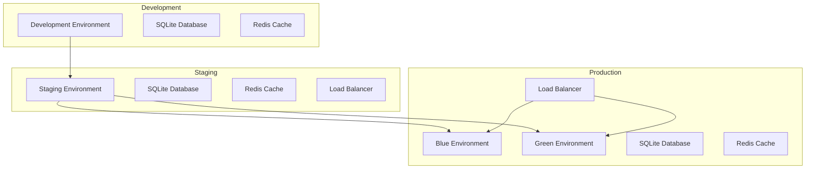
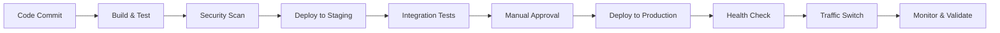

# Deployment Strategy
## [PROJECT_NAME]

**Estimated Reading Time:** 30 minutes

## Overview

This deployment strategy defines comprehensive procedures for deploying [PROJECT_NAME] built with Laravel 12.x and FilamentPHP v4. It covers environment setup, CI/CD pipelines, blue-green deployment, rollback procedures, and monitoring.

### Deployment Objectives
- **Zero Downtime**: Achieve zero-downtime deployments through blue-green strategy
- **Automated Pipeline**: Fully automated CI/CD pipeline with quality gates
- **Rollback Capability**: Quick rollback procedures for failed deployments
- **Environment Consistency**: Identical environments across development, staging, and production
- **Security First**: Secure deployment practices with vulnerability scanning

### Deployment Principles
- **Infrastructure as Code**: All infrastructure defined in version control
- **Immutable Deployments**: Never modify running systems, always deploy new versions
- **Automated Testing**: Comprehensive testing at every stage
- **Monitoring Integration**: Real-time monitoring and alerting
- **Gradual Rollout**: Controlled deployment with traffic shifting

## Environment Architecture

### Environment Overview



### Environment Specifications

#### Development Environment
- **Purpose**: Local development and initial testing
- **Database**: SQLite with development data
- **Cache**: Redis (local instance)
- **Debug Mode**: Enabled
- **SSL**: Not required
- **Monitoring**: Basic logging

#### Staging Environment
- **Purpose**: Pre-production testing and validation
- **Database**: SQLite with production-like data
- **Cache**: Redis cluster
- **Debug Mode**: Disabled
- **SSL**: Required
- **Monitoring**: Full monitoring stack

#### Production Environment
- **Purpose**: Live application serving users
- **Database**: SQLite with WAL mode optimization
- **Cache**: Redis cluster with failover
- **Debug Mode**: Disabled
- **SSL**: Required with HSTS
- **Monitoring**: Comprehensive monitoring and alerting

## CI/CD Pipeline

### Pipeline Overview



### GitHub Actions Workflow

#### Main Pipeline Configuration
```yaml
# .github/workflows/deploy.yml
name: Deploy Application

on:
  push:
    branches: [main]
  pull_request:
    branches: [main]

env:
  PHP_VERSION: '8.1'
  NODE_VERSION: '18'

jobs:
  test:
    runs-on: ubuntu-latest
    
    services:
      redis:
        image: redis:7
        options: >-
          --health-cmd "redis-cli ping"
          --health-interval 10s
          --health-timeout 5s
          --health-retries 5
    
    steps:
    - name: Checkout code
      uses: actions/checkout@v3
    
    - name: Setup PHP
      uses: shivammathur/setup-php@v2
      with:
        php-version: ${{ env.PHP_VERSION }}
        extensions: dom, curl, libxml, mbstring, zip, pcntl, pdo, sqlite, pdo_sqlite
        coverage: xdebug
    
    - name: Setup Node.js
      uses: actions/setup-node@v3
      with:
        node-version: ${{ env.NODE_VERSION }}
        cache: 'npm'
    
    - name: Install PHP dependencies
      run: composer install --prefer-dist --no-progress --no-dev --optimize-autoloader
    
    - name: Install Node dependencies
      run: npm ci
    
    - name: Build assets
      run: npm run build
    
    - name: Setup environment
      run: |
        cp .env.testing .env
        php artisan key:generate
        php artisan migrate --force
    
    - name: Run PHP tests
      run: |
        php artisan test --coverage --min=90
        php artisan test --testsuite=Feature
        php artisan test --testsuite=Unit
    
    - name: Run security tests
      run: |
        composer audit
        php artisan test --group=security
    
    - name: Code quality checks
      run: |
        ./vendor/bin/pint --test
        ./vendor/bin/phpstan analyse
    
    - name: Upload coverage reports
      uses: codecov/codecov-action@v3
      with:
        file: ./coverage.xml

  security-scan:
    runs-on: ubuntu-latest
    needs: test
    
    steps:
    - name: Checkout code
      uses: actions/checkout@v3
    
    - name: Run Trivy vulnerability scanner
      uses: aquasecurity/trivy-action@master
      with:
        scan-type: 'fs'
        scan-ref: '.'
        format: 'sarif'
        output: 'trivy-results.sarif'
    
    - name: Upload Trivy scan results
      uses: github/codeql-action/upload-sarif@v2
      with:
        sarif_file: 'trivy-results.sarif'

  deploy-staging:
    runs-on: ubuntu-latest
    needs: [test, security-scan]
    if: github.ref == 'refs/heads/main'
    
    environment:
      name: staging
      url: https://staging.example.com
    
    steps:
    - name: Checkout code
      uses: actions/checkout@v3
    
    - name: Deploy to staging
      run: |
        # Deploy to staging environment
        ./scripts/deploy-staging.sh
    
    - name: Run integration tests
      run: |
        # Run integration tests against staging
        ./scripts/integration-tests.sh staging

  deploy-production:
    runs-on: ubuntu-latest
    needs: deploy-staging
    if: github.ref == 'refs/heads/main'
    
    environment:
      name: production
      url: https://example.com
    
    steps:
    - name: Checkout code
      uses: actions/checkout@v3
    
    - name: Deploy to production
      run: |
        # Blue-green deployment to production
        ./scripts/deploy-production.sh
    
    - name: Health check
      run: |
        # Verify deployment health
        ./scripts/health-check.sh production
    
    - name: Switch traffic
      run: |
        # Switch traffic to new deployment
        ./scripts/switch-traffic.sh
```

## Blue-Green Deployment

### Deployment Process

#### Pre-Deployment Preparation
```bash
#!/bin/bash
# scripts/pre-deployment.sh

set -e

echo "=== Pre-Deployment Preparation ==="

# 1. Backup current database
echo "Creating database backup..."
cp /var/www/production/database/database.sqlite /var/backups/database_$(date +%Y%m%d_%H%M%S).sqlite

# 2. Backup uploaded files
echo "Backing up uploaded files..."
tar -czf /var/backups/uploads_$(date +%Y%m%d_%H%M%S).tar.gz /var/www/production/storage/app/public/

# 3. Check system resources
echo "Checking system resources..."
df -h | grep -E '(Filesystem|/dev/)'
free -h

# 4. Verify dependencies
echo "Verifying dependencies..."
php --version
composer --version
npm --version

# 5. Test database connectivity
echo "Testing database connectivity..."
php artisan tinker --execute="DB::connection()->getPdo() ? 'Connected' : 'Failed'"

echo "=== Pre-Deployment Preparation Complete ==="
```

#### Blue-Green Deployment Script
```bash
#!/bin/bash
# scripts/deploy-production.sh

set -e

BLUE_DIR="/var/www/blue"
GREEN_DIR="/var/www/green"
CURRENT_LINK="/var/www/current"
NEW_RELEASE_DIR="/var/www/releases/$(date +%Y%m%d_%H%M%S)"

echo "=== Blue-Green Deployment Started ==="

# Determine current and target environments
if [ -L "$CURRENT_LINK" ]; then
    CURRENT_TARGET=$(readlink "$CURRENT_LINK")
    if [[ "$CURRENT_TARGET" == *"blue"* ]]; then
        TARGET_DIR="$GREEN_DIR"
        TARGET_COLOR="green"
        INACTIVE_DIR="$BLUE_DIR"
    else
        TARGET_DIR="$BLUE_DIR"
        TARGET_COLOR="blue"
        INACTIVE_DIR="$GREEN_DIR"
    fi
else
    TARGET_DIR="$BLUE_DIR"
    TARGET_COLOR="blue"
    INACTIVE_DIR="$GREEN_DIR"
fi

echo "Deploying to $TARGET_COLOR environment: $TARGET_DIR"

# 1. Prepare new release directory
echo "Preparing new release..."
mkdir -p "$NEW_RELEASE_DIR"
rsync -av --exclude='.git' --exclude='node_modules' ./ "$NEW_RELEASE_DIR/"

# 2. Install dependencies
echo "Installing dependencies..."
cd "$NEW_RELEASE_DIR"
composer install --no-dev --optimize-autoloader --no-interaction
npm ci --production

# 3. Build assets
echo "Building assets..."
npm run build

# 4. Configure environment
echo "Configuring environment..."
cp /var/www/config/.env.production .env
php artisan key:generate --force

# 5. Run database migrations
echo "Running database migrations..."
php artisan migrate --force

# 6. Optimize application
echo "Optimizing application..."
php artisan config:cache
php artisan route:cache
php artisan view:cache
php artisan event:cache

# 7. Set permissions
echo "Setting permissions..."
chown -R www-data:www-data storage bootstrap/cache
chmod -R 775 storage bootstrap/cache

# 8. Copy to target directory
echo "Copying to target directory..."
rsync -av --delete "$NEW_RELEASE_DIR/" "$TARGET_DIR/"

# 9. Health check on target environment
echo "Running health check..."
cd "$TARGET_DIR"
php artisan health:check

# 10. Update symlink (atomic switch)
echo "Switching to new deployment..."
ln -sfn "$TARGET_DIR" "$CURRENT_LINK"

# 11. Reload web server
echo "Reloading web server..."
sudo systemctl reload nginx
sudo systemctl reload php8.1-fpm

# 12. Final health check
echo "Final health check..."
sleep 5
curl -f http://localhost/health || {
    echo "Health check failed! Rolling back..."
    ln -sfn "$INACTIVE_DIR" "$CURRENT_LINK"
    sudo systemctl reload nginx
    exit 1
}

# 13. Cleanup
echo "Cleaning up old releases..."
find /var/www/releases -maxdepth 1 -type d -mtime +7 -exec rm -rf {} \;

echo "=== Blue-Green Deployment Complete ==="
echo "Active environment: $TARGET_COLOR"
echo "Application URL: $(curl -s http://localhost/health | jq -r '.app_url')"
```

### Traffic Switching

#### Load Balancer Configuration
```nginx
# /etc/nginx/sites-available/laravel-app
upstream app_blue {
    server 127.0.0.1:8001;
}

upstream app_green {
    server 127.0.0.1:8002;
}

# Default to blue environment
upstream app_active {
    server 127.0.0.1:8001;
}

server {
    listen 80;
    listen 443 ssl http2;
    server_name example.com;

    # SSL configuration
    ssl_certificate /etc/ssl/certs/example.com.crt;
    ssl_certificate_key /etc/ssl/private/example.com.key;
    ssl_protocols TLSv1.2 TLSv1.3;
    ssl_ciphers ECDHE-RSA-AES256-GCM-SHA512:DHE-RSA-AES256-GCM-SHA512;

    # Security headers
    add_header X-Frame-Options "SAMEORIGIN" always;
    add_header X-Content-Type-Options "nosniff" always;
    add_header X-XSS-Protection "1; mode=block" always;
    add_header Strict-Transport-Security "max-age=31536000; includeSubDomains" always;

    # Root directory
    root /var/www/current/public;
    index index.php;

    # Laravel application
    location / {
        try_files $uri $uri/ /index.php?$query_string;
    }

    # PHP-FPM configuration
    location ~ \.php$ {
        fastcgi_pass app_active;
        fastcgi_param SCRIPT_FILENAME $realpath_root$fastcgi_script_name;
        include fastcgi_params;
        fastcgi_hide_header X-Powered-By;
    }

    # Health check endpoint
    location /health {
        access_log off;
        proxy_pass http://app_active;
        proxy_set_header Host $host;
        proxy_set_header X-Real-IP $remote_addr;
    }

    # Deny access to sensitive files
    location ~ /\. {
        deny all;
    }

    location ~ /(storage|bootstrap/cache) {
        deny all;
    }
}
```

#### Traffic Switching Script
```bash
#!/bin/bash
# scripts/switch-traffic.sh

set -e

NGINX_CONFIG="/etc/nginx/sites-available/laravel-app"
CURRENT_LINK="/var/www/current"

echo "=== Traffic Switching Started ==="

# Determine current active environment
CURRENT_TARGET=$(readlink "$CURRENT_LINK")
if [[ "$CURRENT_TARGET" == *"blue"* ]]; then
    NEW_PORT="8001"
    NEW_COLOR="blue"
else
    NEW_PORT="8002"
    NEW_COLOR="green"
fi

echo "Switching traffic to $NEW_COLOR environment (port $NEW_PORT)"

# Update nginx upstream configuration
sed -i "s/server 127.0.0.1:[0-9]\+;/server 127.0.0.1:$NEW_PORT;/" "$NGINX_CONFIG"

# Test nginx configuration
nginx -t || {
    echo "Nginx configuration test failed!"
    exit 1
}

# Reload nginx
systemctl reload nginx

# Verify traffic switch
sleep 2
RESPONSE=$(curl -s http://localhost/health | jq -r '.environment')
if [[ "$RESPONSE" == "$NEW_COLOR" ]]; then
    echo "Traffic successfully switched to $NEW_COLOR environment"
else
    echo "Traffic switch verification failed!"
    exit 1
fi

echo "=== Traffic Switching Complete ==="
```

## Rollback Procedures

### Automatic Rollback
```bash
#!/bin/bash
# scripts/rollback.sh

set -e

BLUE_DIR="/var/www/blue"
GREEN_DIR="/var/www/green"
CURRENT_LINK="/var/www/current"

echo "=== Rollback Procedure Started ==="

# Determine current and previous environments
CURRENT_TARGET=$(readlink "$CURRENT_LINK")
if [[ "$CURRENT_TARGET" == *"blue"* ]]; then
    ROLLBACK_DIR="$GREEN_DIR"
    ROLLBACK_COLOR="green"
    ROLLBACK_PORT="8002"
else
    ROLLBACK_DIR="$BLUE_DIR"
    ROLLBACK_COLOR="blue"
    ROLLBACK_PORT="8001"
fi

echo "Rolling back to $ROLLBACK_COLOR environment"

# 1. Health check on rollback environment
echo "Checking rollback environment health..."
cd "$ROLLBACK_DIR"
php artisan health:check || {
    echo "Rollback environment is not healthy!"
    exit 1
}

# 2. Switch symlink
echo "Switching to rollback environment..."
ln -sfn "$ROLLBACK_DIR" "$CURRENT_LINK"

# 3. Update nginx configuration
echo "Updating load balancer configuration..."
sed -i "s/server 127.0.0.1:[0-9]\+;/server 127.0.0.1:$ROLLBACK_PORT;/" /etc/nginx/sites-available/laravel-app

# 4. Reload services
echo "Reloading services..."
systemctl reload nginx
systemctl reload php8.1-fpm

# 5. Verify rollback
echo "Verifying rollback..."
sleep 5
RESPONSE=$(curl -s http://localhost/health | jq -r '.environment')
if [[ "$RESPONSE" == "$ROLLBACK_COLOR" ]]; then
    echo "Rollback successful to $ROLLBACK_COLOR environment"
else
    echo "Rollback verification failed!"
    exit 1
fi

# 6. Database rollback (if needed)
read -p "Do you need to rollback the database? (y/N): " -n 1 -r
echo
if [[ $REPLY =~ ^[Yy]$ ]]; then
    echo "Rolling back database..."
    ./scripts/rollback-database.sh
fi

echo "=== Rollback Procedure Complete ==="
```

### Database Rollback
```bash
#!/bin/bash
# scripts/rollback-database.sh

set -e

BACKUP_DIR="/var/backups"
DB_PATH="/var/www/current/database/database.sqlite"

echo "=== Database Rollback Started ==="

# List available backups
echo "Available database backups:"
ls -la "$BACKUP_DIR"/database_*.sqlite | tail -10

# Get latest backup
LATEST_BACKUP=$(ls -t "$BACKUP_DIR"/database_*.sqlite | head -1)
echo "Latest backup: $LATEST_BACKUP"

read -p "Use latest backup? (Y/n): " -n 1 -r
echo
if [[ $REPLY =~ ^[Nn]$ ]]; then
    read -p "Enter backup filename: " BACKUP_FILE
    LATEST_BACKUP="$BACKUP_DIR/$BACKUP_FILE"
fi

# Verify backup exists
if [ ! -f "$LATEST_BACKUP" ]; then
    echo "Backup file not found: $LATEST_BACKUP"
    exit 1
fi

# Create current database backup before rollback
echo "Creating safety backup of current database..."
cp "$DB_PATH" "$BACKUP_DIR/database_pre_rollback_$(date +%Y%m%d_%H%M%S).sqlite"

# Restore from backup
echo "Restoring database from backup..."
cp "$LATEST_BACKUP" "$DB_PATH"

# Set proper permissions
chown www-data:www-data "$DB_PATH"
chmod 644 "$DB_PATH"

# Verify database integrity
echo "Verifying database integrity..."
php artisan tinker --execute="DB::connection()->getPdo() ? 'Database OK' : 'Database Failed'"

echo "=== Database Rollback Complete ==="
```

## Monitoring and Validation

### Health Check Implementation
```php
<?php
// app/Http/Controllers/HealthController.php

namespace App\Http\Controllers;

use Illuminate\Http\JsonResponse;
use Illuminate\Support\Facades\DB;
use Illuminate\Support\Facades\Cache;

class HealthController extends Controller
{
    public function check(): JsonResponse
    {
        $checks = [
            'app' => $this->checkApplication(),
            'database' => $this->checkDatabase(),
            'cache' => $this->checkCache(),
            'storage' => $this->checkStorage(),
            'queue' => $this->checkQueue(),
        ];

        $healthy = collect($checks)->every(fn($check) => $check['status'] === 'ok');

        return response()->json([
            'status' => $healthy ? 'healthy' : 'unhealthy',
            'environment' => app()->environment(),
            'version' => config('app.version'),
            'timestamp' => now()->toISOString(),
            'checks' => $checks,
        ], $healthy ? 200 : 503);
    }

    private function checkApplication(): array
    {
        return [
            'status' => 'ok',
            'version' => config('app.version'),
            'environment' => app()->environment(),
            'debug' => config('app.debug'),
        ];
    }

    private function checkDatabase(): array
    {
        try {
            $start = microtime(true);
            DB::connection()->getPdo();
            $responseTime = round((microtime(true) - $start) * 1000, 2);

            return [
                'status' => 'ok',
                'connection' => 'connected',
                'response_time' => $responseTime . 'ms',
            ];
        } catch (\Exception $e) {
            return [
                'status' => 'error',
                'connection' => 'failed',
                'error' => $e->getMessage(),
            ];
        }
    }

    private function checkCache(): array
    {
        try {
            $key = 'health_check_' . time();
            Cache::put($key, 'test', 60);
            $value = Cache::get($key);
            Cache::forget($key);

            return [
                'status' => $value === 'test' ? 'ok' : 'error',
                'driver' => config('cache.default'),
            ];
        } catch (\Exception $e) {
            return [
                'status' => 'error',
                'error' => $e->getMessage(),
            ];
        }
    }
}
```

### Deployment Monitoring
```bash
#!/bin/bash
# scripts/monitor-deployment.sh

set -e

ENVIRONMENT=${1:-production}
DURATION=${2:-300} # 5 minutes
INTERVAL=${3:-10}  # 10 seconds

echo "=== Monitoring Deployment ($ENVIRONMENT) ==="
echo "Duration: ${DURATION}s, Interval: ${INTERVAL}s"

START_TIME=$(date +%s)
END_TIME=$((START_TIME + DURATION))

while [ $(date +%s) -lt $END_TIME ]; do
    echo "$(date): Checking application health..."
    
    # Health check
    HEALTH_STATUS=$(curl -s http://localhost/health | jq -r '.status')
    echo "Health Status: $HEALTH_STATUS"
    
    # Response time check
    RESPONSE_TIME=$(curl -o /dev/null -s -w '%{time_total}' http://localhost/)
    echo "Response Time: ${RESPONSE_TIME}s"
    
    # Error rate check
    ERROR_COUNT=$(tail -n 100 /var/log/nginx/error.log | grep "$(date '+%Y/%m/%d %H:%M')" | wc -l)
    echo "Recent Errors: $ERROR_COUNT"
    
    # Memory usage
    MEMORY_USAGE=$(free | grep Mem | awk '{printf "%.1f%%", $3/$2 * 100.0}')
    echo "Memory Usage: $MEMORY_USAGE"
    
    echo "---"
    
    sleep $INTERVAL
done

echo "=== Deployment Monitoring Complete ==="
```

---

**Deployment Strategy Version**: 1.0.0  
**Deployment Type**: Blue-Green with Zero Downtime  
**Framework**: Laravel 12.x with FilamentPHP v4  
**Created**: [YYYY-MM-DD]  
**Last Updated**: [YYYY-MM-DD]  
**Next Review**: [YYYY-MM-DD]  
**Deployment Owner**: [DEVOPS_LEAD]
