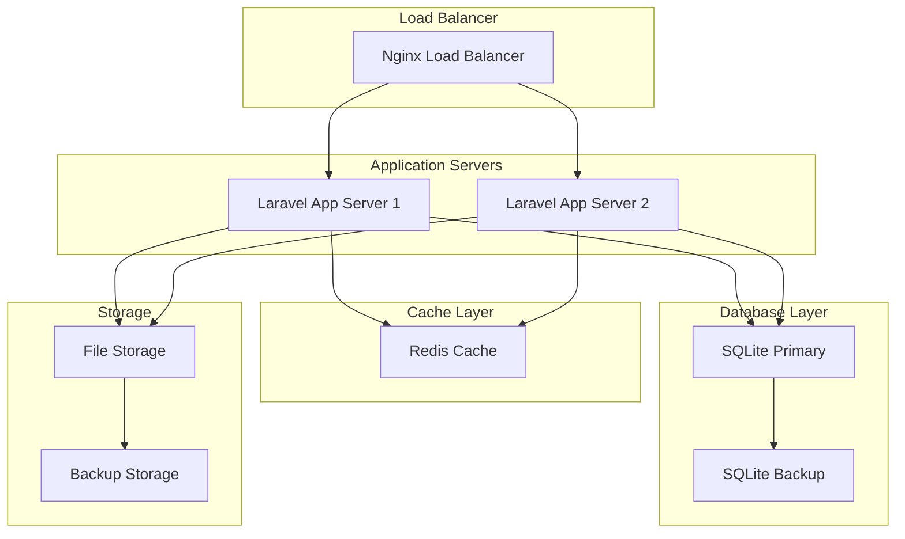

# Operations and Maintenance Manual
## [PROJECT_NAME]

**Estimated Reading Time:** 40 minutes

## Overview

This manual provides comprehensive operational procedures and maintenance guidelines for [PROJECT_NAME] running on Laravel 12.x with FilamentPHP v4. It covers system monitoring, performance optimization, security maintenance, backup procedures, and incident response.

### Operational Objectives
- **System Availability**: Maintain 99.9% uptime during business hours
- **Performance Standards**: API response times under 200ms for 95% of requests
- **Security Compliance**: Continuous GDPR compliance and security monitoring
- **Data Protection**: Automated backups with 4-hour recovery time objective
- **Incident Response**: Mean time to resolution under 2 hours for critical issues

## System Architecture Overview

### Production Environment



### Key Components
- **Web Server**: Nginx with PHP-FPM
- **Application**: Laravel 12.x with FilamentPHP v4
- **Database**: SQLite with WAL mode optimization
- **Cache**: Redis for session and application caching
- **Queue**: Redis-based queue processing
- **Storage**: Local file storage with automated backup

## Daily Operations

### Morning Health Check Routine

#### System Status Verification
```bash
#!/bin/bash
# daily-health-check.sh

echo "=== Daily Health Check - $(date) ==="

# Check application status
echo "1. Application Health:"
curl -s http://localhost/health | jq '.'

# Check database connectivity
echo "2. Database Status:"
php artisan tinker --execute="DB::connection()->getPdo() ? 'Connected' : 'Failed'"

# Check cache status
echo "3. Cache Status:"
php artisan tinker --execute="Cache::store('redis')->get('health_check') ?: 'Cache OK'"

# Check queue status
echo "4. Queue Status:"
php artisan queue:monitor

# Check disk space
echo "5. Disk Usage:"
df -h | grep -E '(Filesystem|/dev/)'

# Check memory usage
echo "6. Memory Usage:"
free -h

# Check recent errors
echo "7. Recent Errors:"
tail -n 20 storage/logs/laravel.log | grep ERROR || echo "No recent errors"

echo "=== Health Check Complete ==="
```

#### Performance Monitoring
```bash
#!/bin/bash
# performance-check.sh

echo "=== Performance Monitoring - $(date) ==="

# Check response times
echo "1. API Response Times:"
for endpoint in "/api/v1/health" "/api/v1/users" "/api/v1/dashboard"
do
    time=$(curl -o /dev/null -s -w '%{time_total}' http://localhost$endpoint)
    echo "  $endpoint: ${time}s"
done

# Check database performance
echo "2. Database Performance:"
php artisan db:monitor

# Check cache hit rates
echo "3. Cache Performance:"
redis-cli info stats | grep -E "(keyspace_hits|keyspace_misses)"

# Check queue processing
echo "4. Queue Performance:"
php artisan queue:monitor --max-jobs=100

echo "=== Performance Check Complete ==="
```

### Application Monitoring

#### Laravel Telescope Monitoring
```php
<?php
// Monitor key metrics through Telescope

// Check slow queries
$slowQueries = DB::table('telescope_entries')
    ->where('type', 'query')
    ->where('content->duration', '>', 1000) // > 1 second
    ->whereDate('created_at', today())
    ->count();

// Check failed jobs
$failedJobs = DB::table('telescope_entries')
    ->where('type', 'job')
    ->where('content->status', 'failed')
    ->whereDate('created_at', today())
    ->count();

// Check exception rates
$exceptions = DB::table('telescope_entries')
    ->where('type', 'exception')
    ->whereDate('created_at', today())
    ->count();
```

#### Custom Health Checks
```php
<?php
// app/Http/Controllers/HealthController.php

class HealthController extends Controller
{
    public function check()
    {
        $checks = [
            'database' => $this->checkDatabase(),
            'cache' => $this->checkCache(),
            'storage' => $this->checkStorage(),
            'queue' => $this->checkQueue(),
            'memory' => $this->checkMemory(),
        ];
        
        $healthy = collect($checks)->every(fn($check) => $check['status'] === 'ok');
        
        return response()->json([
            'status' => $healthy ? 'healthy' : 'unhealthy',
            'timestamp' => now()->toISOString(),
            'checks' => $checks,
        ], $healthy ? 200 : 503);
    }
    
    private function checkDatabase(): array
    {
        try {
            DB::connection()->getPdo();
            $responseTime = $this->measureTime(fn() => DB::select('SELECT 1'));
            
            return [
                'status' => 'ok',
                'response_time' => $responseTime . 'ms',
            ];
        } catch (Exception $e) {
            return [
                'status' => 'error',
                'message' => $e->getMessage(),
            ];
        }
    }
    
    private function checkCache(): array
    {
        try {
            $key = 'health_check_' . time();
            Cache::put($key, 'test', 60);
            $value = Cache::get($key);
            Cache::forget($key);
            
            return [
                'status' => $value === 'test' ? 'ok' : 'error',
                'message' => $value === 'test' ? 'Cache working' : 'Cache failed',
            ];
        } catch (Exception $e) {
            return [
                'status' => 'error',
                'message' => $e->getMessage(),
            ];
        }
    }
}
```

## Comprehensive Monitoring & Observability

### Observability Architecture

#### Three Pillars of Observability

**1. Metrics Collection**
- **Application Metrics**: Response times, throughput, error rates
- **Infrastructure Metrics**: CPU, memory, disk, network utilization
- **Business Metrics**: User engagement, conversion rates, feature usage
- **Custom Metrics**: Domain-specific KPIs and performance indicators

**2. Logging Strategy**
- **Structured Logging**: JSON format with consistent fields
- **Log Levels**: DEBUG, INFO, WARN, ERROR, FATAL with appropriate usage
- **Correlation IDs**: Request tracing across distributed components
- **Security Logs**: Authentication, authorization, and audit trails

**3. Distributed Tracing**
- **Request Flow**: End-to-end request journey visualization
- **Performance Bottlenecks**: Identify slow components and dependencies
- **Error Propagation**: Track error sources across service boundaries
- **Dependency Mapping**: Understand service interactions and dependencies

#### Monitoring Stack Implementation

```php
<?php
// config/monitoring.php
return [
    'metrics' => [
        'enabled' => env('METRICS_ENABLED', true),
        'driver' => env('METRICS_DRIVER', 'prometheus'),
        'endpoints' => [
            'health' => '/health',
            'metrics' => '/metrics',
            'ready' => '/ready',
        ],
    ],

    'logging' => [
        'structured' => env('STRUCTURED_LOGGING', true),
        'correlation_id' => env('CORRELATION_ID_ENABLED', true),
        'sensitive_fields' => ['password', 'token', 'secret'],
    ],

    'tracing' => [
        'enabled' => env('TRACING_ENABLED', true),
        'sample_rate' => env('TRACING_SAMPLE_RATE', 0.1),
        'service_name' => env('APP_NAME', 'laravel-app'),
    ],
];
```

### Service Level Objectives (SLOs) & Service Level Agreements (SLAs)

#### SLO Definitions

**Availability SLOs**
- **Target**: 99.9% uptime (8.77 hours downtime per year)
- **Measurement Window**: 30-day rolling window
- **Error Budget**: 0.1% (43.2 minutes per month)
- **Monitoring**: HTTP health check every 30 seconds

**Performance SLOs**
- **API Response Time**: 95th percentile < 200ms
- **Database Query Time**: 99th percentile < 100ms
- **Page Load Time**: 95th percentile < 2 seconds
- **Background Job Processing**: 99% completed within 5 minutes

**Reliability SLOs**
- **Error Rate**: < 0.1% of all requests
- **Data Consistency**: 100% ACID compliance
- **Backup Success Rate**: 100% daily backups
- **Recovery Time Objective (RTO)**: < 4 hours
- **Recovery Point Objective (RPO)**: < 1 hour

#### SLA Implementation

**Step-by-Step Implementation Guide**

**Phase 1: Database Setup (30 minutes)**
1. Create monitoring tables using Laravel migrations:
```bash
php artisan make:migration create_health_checks_table
php artisan make:migration create_request_metrics_table
php artisan make:migration create_sla_reports_table
```

2. Run migrations and seed initial data:
```bash
php artisan migrate
php artisan db:seed --class=MonitoringSeeder
```

**Phase 2: Service Implementation (60 minutes)**
```php
<?php
// app/Services/SLAMonitoringService.php
namespace App\Services;

use Illuminate\Support\Facades\Cache;
use Illuminate\Support\Facades\DB;
use Illuminate\Support\Facades\Log;

class SLAMonitoringService
{
    public function checkAvailabilitySLO(): array
    {
        $window = now()->subDays(30);
        $totalChecks = DB::table('health_checks')
            ->where('created_at', '>=', $window)
            ->count();

        $successfulChecks = DB::table('health_checks')
            ->where('created_at', '>=', $window)
            ->where('status', 'healthy')
            ->count();

        $availability = $totalChecks > 0 ? ($successfulChecks / $totalChecks) * 100 : 0;
        $sloTarget = 99.9;
        $errorBudget = max(0, $sloTarget - $availability);

        return [
            'metric' => 'availability',
            'current' => round($availability, 3),
            'target' => $sloTarget,
            'status' => $availability >= $sloTarget ? 'meeting' : 'breaching',
            'error_budget_remaining' => round($errorBudget, 3),
            'measurement_window' => '30 days',
        ];
    }

    public function checkPerformanceSLO(): array
    {
        $window = now()->subHour();
        $responseTimeP95 = DB::table('request_metrics')
            ->where('created_at', '>=', $window)
            ->orderBy('response_time', 'desc')
            ->skip(floor(DB::table('request_metrics')->where('created_at', '>=', $window)->count() * 0.05))
            ->value('response_time');

        $target = 200; // 200ms

        return [
            'metric' => 'response_time_p95',
            'current' => $responseTimeP95 ?? 0,
            'target' => $target,
            'status' => ($responseTimeP95 ?? 0) <= $target ? 'meeting' : 'breaching',
            'measurement_window' => '1 hour',
        ];
    }

    public function generateSLAReport(): array
    {
        $report = [
            'timestamp' => now()->toISOString(),
            'slos' => [
                'availability' => $this->checkAvailabilitySLO(),
                'performance' => $this->checkPerformanceSLO(),
            ],
            'overall_status' => $this->calculateOverallStatus(),
        ];

        // Store report for historical tracking
        DB::table('sla_reports')->insert([
            'report_data' => json_encode($report),
            'created_at' => now(),
        ]);

        return $report;
    }

    private function calculateOverallStatus(): string
    {
        $slos = [
            $this->checkAvailabilitySLO(),
            $this->checkPerformanceSLO(),
        ];

        $breaching = collect($slos)->filter(fn($slo) => $slo['status'] === 'breaching');

        return $breaching->isEmpty() ? 'all_slos_meeting' : 'slo_breach_detected';
    }
}
```

**Phase 3: Automation Setup (45 minutes)**
1. Create scheduled command for SLA monitoring:
```bash
php artisan make:command MonitorSLAs
```

2. Register in `app/Console/Kernel.php`:
```php
protected function schedule(Schedule $schedule)
{
    $schedule->command('monitor:slas')
             ->everyFiveMinutes()
             ->withoutOverlapping();
}
```

**Phase 4: Integration with Existing Templates**
- **Risk Register Integration**: Link SLA breaches to risk assessment procedures (see `010-project-risk-register.md`)
- **Incident Response**: Connect to incident management workflows (see `170-incident-response-plan.md`)
- **Quality Gates**: Include SLA compliance in deployment quality gates (see `080-master-test-plan.md`)

#### SLA/SLO Implementation Checklist

**Pre-Implementation (Week 1)**
- [ ] Define business requirements and acceptable service levels
- [ ] Identify key stakeholders and communication channels
- [ ] Review existing monitoring infrastructure capabilities
- [ ] Establish baseline measurements for current system performance
- [ ] Create SLA documentation and get stakeholder approval

**Technical Implementation (Week 2-3)**
- [ ] Set up monitoring database tables and migrations
- [ ] Implement SLAMonitoringService with all required methods
- [ ] Create automated SLA checking scheduled commands
- [ ] Configure alerting rules and notification channels
- [ ] Set up SLA reporting dashboard and endpoints

**Testing and Validation (Week 4)**
- [ ] Test SLA monitoring accuracy with known scenarios
- [ ] Validate alert triggering and notification delivery
- [ ] Verify SLA report generation and historical tracking
- [ ] Conduct stakeholder review of SLA dashboard
- [ ] Document troubleshooting procedures and common issues

**Go-Live and Monitoring (Week 5+)**
- [ ] Enable production SLA monitoring and alerting
- [ ] Establish regular SLA review meetings with stakeholders
- [ ] Monitor error budget consumption and trends
- [ ] Continuously optimize SLA thresholds based on business needs
- [ ] Maintain SLA documentation and update procedures

#### Cross-Template Integration Points

**1. Project Risk Register (`010-project-risk-register.md`)**
- Add "SLA Breach Risk" as a high-priority operational risk
- Include mitigation strategies for common SLA failure scenarios
- Link SLA monitoring alerts to risk escalation procedures

**2. Business Requirements Document (`030-business-requirements-document.md`)**
- Define business-critical SLA requirements in functional specifications
- Establish acceptable downtime windows and maintenance schedules
- Document business impact of SLA breaches and recovery procedures

**3. Technical Design Document (`060-technical-design-document.md`)**
- Include SLA monitoring architecture in system design
- Specify monitoring data collection points and storage requirements
- Design alert routing and escalation workflows

**4. Master Test Plan (`080-master-test-plan.md`)**
- Include SLA compliance testing in quality gate procedures
- Add performance testing scenarios that validate SLA targets
- Create automated tests for SLA monitoring system functionality

**5. Incident Response Plan (`170-incident-response-plan.md`)**
- Integrate SLA breach detection with incident classification
- Define escalation procedures based on SLA impact severity
- Include SLA recovery procedures in incident resolution workflows

### Alerting and Incident Response

#### Alert Configuration

```php
<?php
// config/alerts.php
return [
    'channels' => [
        'critical' => [
            'slack' => env('SLACK_CRITICAL_WEBHOOK'),
            'email' => env('ALERT_EMAIL_CRITICAL'),
            'sms' => env('SMS_CRITICAL_ENABLED', false),
        ],
        'warning' => [
            'slack' => env('SLACK_WARNING_WEBHOOK'),
            'email' => env('ALERT_EMAIL_WARNING'),
        ],
        'info' => [
            'slack' => env('SLACK_INFO_WEBHOOK'),
        ],
    ],

    'rules' => [
        'availability_breach' => [
            'condition' => 'availability < 99.9',
            'severity' => 'critical',
            'cooldown' => 300, // 5 minutes
        ],
        'response_time_breach' => [
            'condition' => 'response_time_p95 > 200',
            'severity' => 'warning',
            'cooldown' => 600, // 10 minutes
        ],
        'error_rate_high' => [
            'condition' => 'error_rate > 0.1',
            'severity' => 'warning',
            'cooldown' => 300,
        ],
        'disk_space_low' => [
            'condition' => 'disk_usage > 85',
            'severity' => 'warning',
            'cooldown' => 1800, // 30 minutes
        ],
    ],
];
```

#### Automated Alert Handler

```php
<?php
// app/Services/AlertService.php
namespace App\Services;

use Illuminate\Support\Facades\Http;
use Illuminate\Support\Facades\Log;
use Illuminate\Support\Facades\Mail;

class AlertService
{
    public function triggerAlert(string $rule, array $data): void
    {
        $config = config("alerts.rules.{$rule}");
        $channels = config("alerts.channels.{$config['severity']}");

        $alert = [
            'rule' => $rule,
            'severity' => $config['severity'],
            'timestamp' => now()->toISOString(),
            'data' => $data,
            'runbook' => $this->getRunbookUrl($rule),
        ];

        // Check cooldown
        if ($this->isInCooldown($rule, $config['cooldown'])) {
            return;
        }

        // Send to configured channels
        foreach ($channels as $channel => $endpoint) {
            $this->sendAlert($channel, $endpoint, $alert);
        }

        // Record alert
        $this->recordAlert($alert);
    }

    private function sendAlert(string $channel, string $endpoint, array $alert): void
    {
        switch ($channel) {
            case 'slack':
                $this->sendSlackAlert($endpoint, $alert);
                break;
            case 'email':
                $this->sendEmailAlert($endpoint, $alert);
                break;
            case 'sms':
                $this->sendSMSAlert($endpoint, $alert);
                break;
        }
    }

    private function sendSlackAlert(string $webhook, array $alert): void
    {
        $color = match($alert['severity']) {
            'critical' => 'danger',
            'warning' => 'warning',
            'info' => 'good',
            default => '#808080'
        };

        Http::post($webhook, [
            'attachments' => [[
                'color' => $color,
                'title' => "🚨 {$alert['severity']} Alert: {$alert['rule']}",
                'text' => $this->formatAlertMessage($alert),
                'fields' => [
                    ['title' => 'Timestamp', 'value' => $alert['timestamp'], 'short' => true],
                    ['title' => 'Runbook', 'value' => $alert['runbook'], 'short' => true],
                ],
                'footer' => 'Laravel Monitoring',
                'ts' => now()->timestamp,
            ]],
        ]);
    }

    private function getRunbookUrl(string $rule): string
    {
        $baseUrl = config('app.url');
        return "{$baseUrl}/docs/runbooks/{$rule}";
    }
}
```

### Monitoring Dashboards

#### Key Performance Indicators (KPIs) Dashboard

```php
<?php
// app/Http/Controllers/MonitoringController.php
namespace App\Http\Controllers;

use App\Services\SLAMonitoringService;
use Illuminate\Http\Request;
use Illuminate\Support\Facades\DB;

class MonitoringController extends Controller
{
    public function dashboard()
    {
        return response()->json([
            'system_health' => $this->getSystemHealth(),
            'performance_metrics' => $this->getPerformanceMetrics(),
            'sla_status' => app(SLAMonitoringService::class)->generateSLAReport(),
            'recent_alerts' => $this->getRecentAlerts(),
            'capacity_metrics' => $this->getCapacityMetrics(),
        ]);
    }

    private function getSystemHealth(): array
    {
        return [
            'overall_status' => $this->calculateOverallHealth(),
            'components' => [
                'database' => $this->checkDatabaseHealth(),
                'cache' => $this->checkCacheHealth(),
                'storage' => $this->checkStorageHealth(),
                'queue' => $this->checkQueueHealth(),
            ],
            'uptime' => $this->calculateUptime(),
        ];
    }

    private function getPerformanceMetrics(): array
    {
        $window = now()->subHour();

        return [
            'response_times' => [
                'p50' => $this->getPercentile('response_time', 50, $window),
                'p95' => $this->getPercentile('response_time', 95, $window),
                'p99' => $this->getPercentile('response_time', 99, $window),
            ],
            'throughput' => [
                'requests_per_minute' => $this->getRequestsPerMinute($window),
                'peak_rps' => $this->getPeakRequestsPerSecond($window),
            ],
            'error_rates' => [
                'total_errors' => $this->getErrorCount($window),
                'error_rate_percent' => $this->getErrorRate($window),
                'top_errors' => $this->getTopErrors($window, 5),
            ],
        ];
    }

    private function getCapacityMetrics(): array
    {
        return [
            'resource_utilization' => [
                'cpu_usage' => $this->getCPUUsage(),
                'memory_usage' => $this->getMemoryUsage(),
                'disk_usage' => $this->getDiskUsage(),
                'network_io' => $this->getNetworkIO(),
            ],
            'scaling_recommendations' => $this->getScalingRecommendations(),
            'capacity_forecast' => $this->getCapacityForecast(),
        ];
    }
}
```

### Runbook Procedures

#### Critical Alert Runbooks

**Availability SLO Breach Runbook**
1. **Immediate Response** (0-5 minutes)
   - Check system status dashboard
   - Verify if issue is widespread or isolated
   - Check recent deployments or configuration changes
   - Escalate to on-call engineer if needed

2. **Investigation** (5-15 minutes)
   - Review error logs for patterns
   - Check infrastructure metrics (CPU, memory, disk)
   - Verify database connectivity and performance
   - Check external service dependencies

3. **Mitigation** (15-30 minutes)
   - Implement immediate fixes if root cause identified
   - Consider rollback if recent deployment caused issue
   - Scale resources if capacity issue detected
   - Activate backup systems if necessary

4. **Communication** (Throughout)
   - Update status page with current information
   - Notify stakeholders of impact and ETA
   - Document actions taken for post-incident review

**Performance SLO Breach Runbook**
1. **Quick Assessment** (0-2 minutes)
   - Check current response time metrics
   - Identify if issue is database, application, or infrastructure related
   - Review recent traffic patterns for anomalies

2. **Performance Analysis** (2-10 minutes)
   - Analyze slow query logs
   - Check cache hit rates and performance
   - Review application profiling data
   - Monitor resource utilization trends

3. **Optimization Actions** (10-30 minutes)
   - Optimize or kill long-running queries
   - Clear and warm caches if needed
   - Scale application instances if traffic spike
   - Implement query optimizations or indexes

## Performance Optimization

### Database Optimization

#### SQLite Performance Tuning
```php
<?php
// app/Providers/SqliteServiceProvider.php

class SqliteServiceProvider extends ServiceProvider
{
    public function boot(): void
    {
        if (config('database.default') === 'sqlite') {
            // Optimize SQLite for production
            DB::statement('PRAGMA journal_mode=WAL');
            DB::statement('PRAGMA synchronous=NORMAL');
            DB::statement('PRAGMA cache_size=10000');
            DB::statement('PRAGMA temp_store=MEMORY');
            DB::statement('PRAGMA mmap_size=268435456'); // 256MB
            DB::statement('PRAGMA optimize');
        }
    }
}
```

#### Query Optimization Monitoring
```bash
#!/bin/bash
# query-optimization.sh

echo "=== Query Optimization Report - $(date) ==="

# Analyze slow queries
php artisan tinker --execute="
\$slowQueries = DB::table('telescope_entries')
    ->where('type', 'query')
    ->where('content->duration', '>', 500)
    ->whereDate('created_at', today())
    ->orderBy('content->duration', 'desc')
    ->limit(10)
    ->get(['content']);

foreach (\$slowQueries as \$query) {
    \$content = json_decode(\$query->content);
    echo 'Duration: ' . \$content->duration . 'ms - SQL: ' . \$content->sql . PHP_EOL;
}
"

# Check for N+1 queries
echo "Checking for potential N+1 queries..."
php artisan telescope:prune --hours=1
```

### Cache Management

#### Cache Warming Strategy
```php
<?php
// app/Console/Commands/WarmCache.php

class WarmCache extends Command
{
    protected $signature = 'cache:warm';
    protected $description = 'Warm application cache with frequently accessed data';

    public function handle(): int
    {
        $this->info('Warming application cache...');
        
        // Warm user permissions cache
        $this->warmUserPermissions();
        
        // Warm configuration cache
        $this->warmConfiguration();
        
        // Warm route cache
        $this->warmRoutes();
        
        $this->info('Cache warming completed successfully!');
        
        return Command::SUCCESS;
    }
    
    private function warmUserPermissions(): void
    {
        User::with(['roles.permissions'])->chunk(100, function ($users) {
            foreach ($users as $user) {
                Cache::remember(
                    "user.permissions.{$user->id}",
                    3600,
                    fn() => $user->getAllPermissions()
                );
            }
        });
        
        $this->info('User permissions cache warmed');
    }
    
    private function warmConfiguration(): void
    {
        $configs = ['app', 'database', 'cache', 'queue', 'mail'];
        
        foreach ($configs as $config) {
            Cache::remember(
                "config.{$config}",
                3600,
                fn() => config($config)
            );
        }
        
        $this->info('Configuration cache warmed');
    }
}
```

#### Cache Invalidation Strategy
```php
<?php
// app/Observers/UserObserver.php

class UserObserver
{
    public function updated(User $user): void
    {
        // Invalidate user-specific caches
        Cache::forget("user.permissions.{$user->id}");
        Cache::forget("user.profile.{$user->id}");
        
        // Invalidate related caches
        if ($user->wasChanged(['name', 'email'])) {
            Cache::tags(['users', 'profiles'])->flush();
        }
    }
    
    public function deleted(User $user): void
    {
        // Clean up all user-related cache entries
        Cache::forget("user.permissions.{$user->id}");
        Cache::forget("user.profile.{$user->id}");
        Cache::tags(['users'])->flush();
    }
}
```

## Security Maintenance

### Security Monitoring

#### Daily Security Checks
```bash
#!/bin/bash
# security-check.sh

echo "=== Security Check - $(date) ==="

# Check for failed login attempts
echo "1. Failed Login Attempts (last 24h):"
php artisan tinker --execute="
\$attempts = DB::table('activity_log')
    ->where('description', 'login_failed')
    ->where('created_at', '>=', now()->subDay())
    ->count();
echo 'Failed attempts: ' . \$attempts;
"

# Check for suspicious activity
echo "2. Suspicious Activity:"
php artisan tinker --execute="
\$suspicious = DB::table('activity_log')
    ->where('description', 'LIKE', '%suspicious%')
    ->where('created_at', '>=', now()->subDay())
    ->count();
echo 'Suspicious activities: ' . \$suspicious;
"

# Check SSL certificate expiry
echo "3. SSL Certificate Status:"
openssl s_client -connect localhost:443 -servername yourdomain.com 2>/dev/null | openssl x509 -noout -dates

# Check for security updates
echo "4. Security Updates:"
composer audit

echo "=== Security Check Complete ==="
```

#### GDPR Compliance Monitoring
```php
<?php
// app/Console/Commands/GdprComplianceCheck.php

class GdprComplianceCheck extends Command
{
    protected $signature = 'gdpr:compliance-check';
    protected $description = 'Check GDPR compliance status';

    public function handle(): int
    {
        $this->info('Running GDPR compliance check...');
        
        // Check data retention compliance
        $this->checkDataRetention();
        
        // Check consent management
        $this->checkConsentManagement();
        
        // Check data subject requests
        $this->checkDataSubjectRequests();
        
        return Command::SUCCESS;
    }
    
    private function checkDataRetention(): void
    {
        $retentionPeriod = config('gdpr.retention_period', 2); // years
        $cutoffDate = now()->subYears($retentionPeriod);
        
        $expiredUsers = User::onlyTrashed()
            ->where('deleted_at', '<', $cutoffDate)
            ->whereNull('anonymized_at')
            ->count();
        
        if ($expiredUsers > 0) {
            $this->warn("Found {$expiredUsers} users requiring anonymization");
        } else {
            $this->info('Data retention compliance: OK');
        }
    }
    
    private function checkConsentManagement(): void
    {
        $usersWithoutConsent = User::whereDoesntHave('consents')->count();
        
        if ($usersWithoutConsent > 0) {
            $this->warn("Found {$usersWithoutConsent} users without consent records");
        } else {
            $this->info('Consent management compliance: OK');
        }
    }
}
```

### Vulnerability Management

#### Automated Security Scanning
```bash
#!/bin/bash
# security-scan.sh

echo "=== Security Scan - $(date) ==="

# Check for known vulnerabilities in dependencies
echo "1. Dependency Vulnerability Scan:"
composer audit --format=json > security-audit.json

# Check for outdated packages
echo "2. Outdated Packages:"
composer outdated --direct

# Run static analysis for security issues
echo "3. Static Security Analysis:"
./vendor/bin/phpstan analyse --level=8 app/

# Check file permissions
echo "4. File Permissions Check:"
find storage/ -type f -not -perm 644 -ls
find bootstrap/cache/ -type f -not -perm 644 -ls

echo "=== Security Scan Complete ==="
```

## Backup and Recovery

### Automated Backup Strategy

#### Database Backup
```bash
#!/bin/bash
# backup-database.sh

BACKUP_DIR="/var/backups/laravel"
DATE=$(date +%Y%m%d_%H%M%S)
DB_PATH="/path/to/database.sqlite"

echo "=== Database Backup - $(date) ==="

# Create backup directory
mkdir -p $BACKUP_DIR

# Create database backup
cp $DB_PATH "$BACKUP_DIR/database_$DATE.sqlite"

# Compress backup
gzip "$BACKUP_DIR/database_$DATE.sqlite"

# Verify backup integrity
if [ -f "$BACKUP_DIR/database_$DATE.sqlite.gz" ]; then
    echo "Database backup created successfully: database_$DATE.sqlite.gz"
else
    echo "ERROR: Database backup failed!"
    exit 1
fi

# Clean up old backups (keep last 30 days)
find $BACKUP_DIR -name "database_*.sqlite.gz" -mtime +30 -delete

echo "=== Database Backup Complete ==="
```

#### Application Backup
```bash
#!/bin/bash
# backup-application.sh

BACKUP_DIR="/var/backups/laravel"
DATE=$(date +%Y%m%d_%H%M%S)
APP_DIR="/var/www/laravel"

echo "=== Application Backup - $(date) ==="

# Create backup directory
mkdir -p $BACKUP_DIR

# Backup storage directory
tar -czf "$BACKUP_DIR/storage_$DATE.tar.gz" -C $APP_DIR storage/

# Backup .env file
cp "$APP_DIR/.env" "$BACKUP_DIR/env_$DATE"

# Backup uploaded files
if [ -d "$APP_DIR/public/uploads" ]; then
    tar -czf "$BACKUP_DIR/uploads_$DATE.tar.gz" -C $APP_DIR public/uploads/
fi

echo "=== Application Backup Complete ==="
```

### Recovery Procedures

#### Database Recovery
```bash
#!/bin/bash
# restore-database.sh

BACKUP_FILE=$1
DB_PATH="/path/to/database.sqlite"

if [ -z "$BACKUP_FILE" ]; then
    echo "Usage: $0 <backup_file>"
    exit 1
fi

echo "=== Database Recovery - $(date) ==="

# Stop application
sudo systemctl stop php8.1-fpm
sudo systemctl stop nginx

# Backup current database
cp $DB_PATH "${DB_PATH}.backup.$(date +%Y%m%d_%H%M%S)"

# Restore from backup
if [[ $BACKUP_FILE == *.gz ]]; then
    gunzip -c $BACKUP_FILE > $DB_PATH
else
    cp $BACKUP_FILE $DB_PATH
fi

# Set proper permissions
chown www-data:www-data $DB_PATH
chmod 644 $DB_PATH

# Start application
sudo systemctl start php8.1-fpm
sudo systemctl start nginx

# Verify recovery
php artisan tinker --execute="DB::connection()->getPdo() ? 'Database OK' : 'Database Failed'"

echo "=== Database Recovery Complete ==="
```

## Incident Response

### Incident Classification

| Severity | Description | Response Time | Examples |
|----------|-------------|---------------|----------|
| **Critical** | System down, data loss | 15 minutes | Database corruption, security breach |
| **High** | Major functionality impaired | 1 hour | Authentication failure, payment processing down |
| **Medium** | Minor functionality affected | 4 hours | Non-critical feature broken, performance degradation |
| **Low** | Cosmetic issues, minor bugs | 24 hours | UI glitches, documentation errors |

### Incident Response Procedures

#### Critical Incident Response
```bash
#!/bin/bash
# critical-incident-response.sh

echo "=== CRITICAL INCIDENT RESPONSE - $(date) ==="

# 1. Immediate assessment
echo "1. System Status Check:"
curl -s http://localhost/health || echo "SYSTEM DOWN"

# 2. Enable maintenance mode
echo "2. Enabling maintenance mode:"
php artisan down --message="System maintenance in progress"

# 3. Capture system state
echo "3. Capturing system state:"
ps aux > /tmp/processes_$(date +%Y%m%d_%H%M%S).log
df -h > /tmp/disk_usage_$(date +%Y%m%d_%H%M%S).log
free -h > /tmp/memory_usage_$(date +%Y%m%d_%H%M%S).log

# 4. Check recent logs
echo "4. Recent error logs:"
tail -n 100 storage/logs/laravel.log

# 5. Notify stakeholders
echo "5. Sending incident notification:"
# Add notification logic here

echo "=== CRITICAL INCIDENT RESPONSE INITIATED ==="
```

#### Recovery Verification
```bash
#!/bin/bash
# verify-recovery.sh

echo "=== Recovery Verification - $(date) ==="

# Test database connectivity
echo "1. Database Test:"
php artisan tinker --execute="DB::connection()->getPdo() ? 'OK' : 'FAILED'"

# Test cache functionality
echo "2. Cache Test:"
php artisan tinker --execute="Cache::put('test', 'value', 60); Cache::get('test') === 'value' ? 'OK' : 'FAILED'"

# Test queue processing
echo "3. Queue Test:"
php artisan queue:work --once --timeout=30

# Test API endpoints
echo "4. API Test:"
curl -s http://localhost/api/v1/health | jq '.status'

# Test admin panel
echo "5. Admin Panel Test:"
curl -s http://localhost/admin/login | grep -q "Login" && echo "OK" || echo "FAILED"

# Disable maintenance mode if all tests pass
echo "6. Disabling maintenance mode:"
php artisan up

echo "=== Recovery Verification Complete ==="
```

## Maintenance Schedules

### Daily Maintenance Tasks
- [ ] **Health Check**: Run automated health check script
- [ ] **Log Review**: Review error logs and security logs
- [ ] **Backup Verification**: Verify automated backups completed successfully
- [ ] **Performance Check**: Monitor response times and resource usage
- [ ] **Security Scan**: Check for failed login attempts and suspicious activity

### Weekly Maintenance Tasks
- [ ] **Dependency Updates**: Check for security updates and patches
- [ ] **Performance Analysis**: Analyze slow queries and optimize database
- [ ] **Cache Optimization**: Review cache hit rates and optimize strategies
- [ ] **GDPR Compliance**: Run compliance checks and data retention cleanup
- [ ] **Capacity Planning**: Review resource usage trends and plan scaling

### Monthly Maintenance Tasks
- [ ] **Security Audit**: Comprehensive security review and penetration testing
- [ ] **Backup Testing**: Test backup restoration procedures
- [ ] **Documentation Review**: Update operational documentation
- [ ] **Performance Tuning**: Optimize application and database performance
- [ ] **Disaster Recovery Test**: Test disaster recovery procedures

---

**Operations Manual Version**: 1.0.0  
**Environment**: Production Laravel 12.x with FilamentPHP v4  
**Created**: [YYYY-MM-DD]  
**Last Updated**: [YYYY-MM-DD]  
**Next Review**: [YYYY-MM-DD]  
**Operations Owner**: [OPERATIONS_LEAD]
