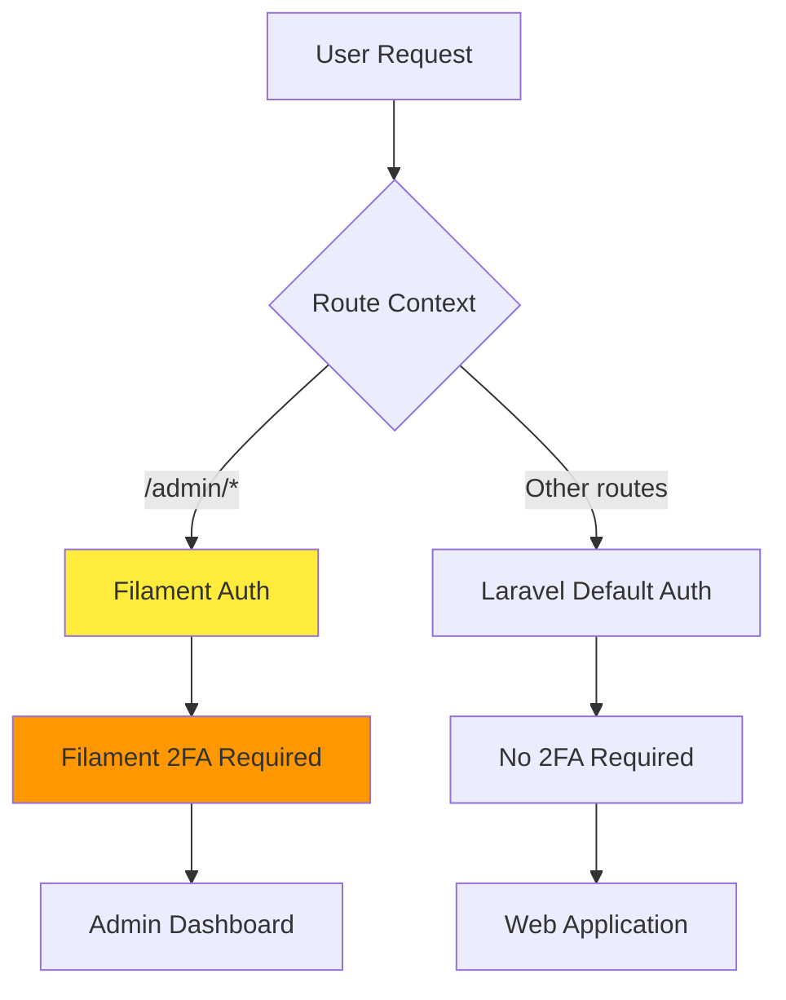
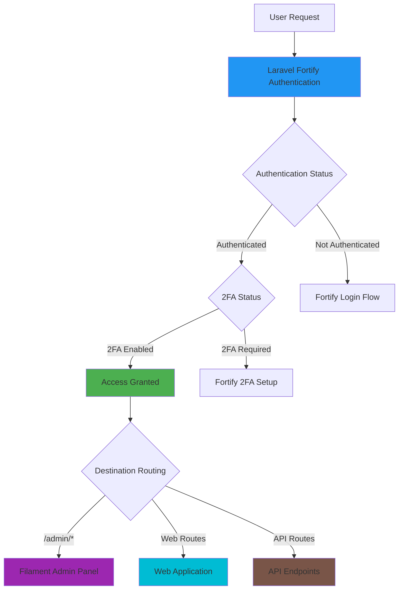

# 1.0 Laravel Fortify 2FA Implementation - Unified System Analysis

**Document Version**: 2.0  
**Last Updated**: 2025-07-01  
**Target Audience**: Junior Developers  
**Estimated Reading Time**: 18 minutes

## 1.1 Executive Summary

This document provides comprehensive analysis for implementing Laravel Fortify as the **PRIMARY authentication system** for ALL application entry points, including Filament admin panel integration. This represents a strategic architectural shift from Filament's native 2FA to a unified Fortify-based authentication system while preserving existing functionality during transition.

### 1.1.1 Critical Architecture Transformation

| Current State | Target State | Strategic Impact |
|---------------|--------------|------------------|
| **Filament Native 2FA** | **Unified Fortify Authentication** | 🔴 Complete system replacement |
| **Context-Specific Auth** | **Universal Fortify Auth** | 🟢 Simplified architecture |
| **Separate Admin/Web Auth** | **Single Authentication System** | 🟢 Consistent user experience |
| **Multiple 2FA Systems** | **Fortify 2FA for All Contexts** | 🟢 Unified security model |

### 1.1.2 Implementation Objectives

**Primary Goal**: Replace existing Filament 2FA with Laravel Fortify as the unified authentication system for:
- **Admin Panel Authentication**: Fortify replaces Filament's built-in auth
- **Web Application Authentication**: Fortify handles all web routes  
- **API Authentication**: Fortify + Sanctum for API endpoints
- **Two-Factor Authentication**: Single Fortify 2FA system for all contexts

## 1.2 Technical Environment Analysis

### 1.2.1 Verified System Specifications

**Core Framework Stack** (Confirmed via analysis):

```bash
# Production Environment Details
Laravel Framework: 12.19.3
PHP Version: 8.4.x
Database: SQLite (configured and operational)
Filament Version: 4.0.0-beta11
```

**Current Package Ecosystem** (Verified via composer.json):

```json
{
    "installed_packages": {
        "filament/filament": "4.0.0-beta11",
        "livewire/flux": "2.2.1",
        "livewire/flux-pro": "2.2.1",
        "livewire/volt": "1.7.1",
        "spatie/laravel-activitylog": "4.10.2",
        "spatie/laravel-sluggable": "3.7.5",
        "wildside/userstamps": "3.1.x",
        "pragmarx/google2fa-laravel": "2.3.0"
    },
    "required_additions": {
        "laravel/fortify": "^1.27",
        "laravel/sanctum": "^4.1"
    }
}
```

### 1.2.2 Current Authentication Architecture

**Existing Filament 2FA System**:

```php
// Current AdminPanelProvider configuration (to be replaced)
->multiFactorAuthentication([
    AppAuthentication::make()
        ->brandName('LFSL Filament Demo')
        ->codeWindow(4)
        ->recoverable()
        ->recoveryCodeCount(10),
    EmailAuthentication::make(),
], isRequired: true)
```

**Current Authentication Flow**:



## 1.3 Target Unified Architecture

### 1.3.1 Fortify-First Authentication Flow

**Unified Authentication Architecture**:



### 1.3.2 Database Schema Integration

**Current Filament 2FA Fields** (preserved during transition):

```sql
-- Existing fields (maintain for migration safety)
app_authentication_secret TEXT ENCRYPTED,
app_authentication_recovery_codes TEXT ENCRYPTED,
has_email_authentication BOOLEAN DEFAULT FALSE,
```

**Target Fortify 2FA Fields** (primary system):

```sql
-- Primary Fortify authentication fields
two_factor_secret TEXT NULL,
two_factor_recovery_codes TEXT NULL,
two_factor_confirmed_at TIMESTAMP NULL,
```

**Migration Strategy Overview**:

| Phase | Action | Data Handling | Safety Measure |
|-------|--------|---------------|----------------|
| **Phase 1** | Add Fortify fields | Preserve Filament data | Zero data loss |
| **Phase 2** | Migrate user data | Copy Filament → Fortify | Validation checks |
| **Phase 3** | Switch to Fortify | Activate unified auth | Rollback capability |
| **Phase 4** | Cleanup (optional) | Archive Filament fields | Backup preservation |

## 1.4 User Model Transformation

### 1.4.1 Interface Evolution

**Current User Model Interfaces**:

```php
// Current implementation (to be modified)
class User extends Authenticatable implements 
    FilamentUser, 
    HasAppAuthentication,           // Remove after migration
    HasAppAuthenticationRecovery,   // Remove after migration
    HasAvatar, 
    HasEmailAuthentication,         // Remove after migration
    MustVerifyEmail
```

**Target User Model with Fortify**:

```php
// Target unified implementation
class User extends Authenticatable implements 
    FilamentUser,                   // Keep for panel access
    HasAvatar,                      // Keep for UI features
    MustVerifyEmail                 // Keep for email verification
{
    use TwoFactorAuthenticatable;   // Primary 2FA system
}
```

### 1.4.2 Enhanced Model Capabilities

**New Fortify Integration Methods**:

```php
// Enhanced 2FA management
public function hasEnabledTwoFactorAuthentication(): bool
public function twoFactorQrCodeSvg(): string
public function confirmTwoFactorAuth(string $code): bool
public function canAccessPanel(Panel $panel): bool

// Migration support methods
public function validateFortifyMigration(): array
public function migrateToFortify2FA(): bool
public function get2FAStatus(): array
```

## 1.5 Filament Integration Strategy

### 1.5.1 AdminPanelProvider Transformation

**Target Configuration** (Fortify-integrated):

```php
// Updated AdminPanelProvider for Fortify integration
public function panel(Panel $panel): Panel
{
    return $panel
        ->default()
        ->id('admin')
        ->path('admin')
        
        // Remove Filament authentication features
        // ->login()
        // ->multiFactorAuthentication([...])
        
        // Configure for Fortify authentication
        ->authGuard('web')
        ->authMiddleware([
            FortifyAuthenticateForFilament::class,
        ])
        ->profile()
        ->strictAuthorization();
}
```

### 1.5.2 Custom Integration Middleware

**Required Custom Middleware**:

```php
// app/Http/Middleware/FortifyAuthenticateForFilament.php
class FortifyAuthenticateForFilament
{
    public function handle(Request $request, Closure $next): Response
    {
        // Verify Fortify authentication
        if (!Auth::guard('web')->check()) {
            return redirect()->route('login');
        }
        
        // Require Fortify 2FA for admin access
        if (!Auth::user()->hasEnabledTwoFactorAuthentication()) {
            return redirect()->route('two-factor.setup');
        }
        
        return $next($request);
    }
}
```

## 1.6 UI Framework Integration

### 1.6.1 Volt + Flux Component Architecture

**Modern Authentication UI Stack**:

```
resources/views/livewire/auth/
├── login.blade.php                 # Fortify login with Flux UI
├── register.blade.php              # Registration with Flux components
├── two-factor-challenge.blade.php  # 2FA verification
└── two-factor/
    ├── setup.blade.php             # 2FA configuration
    └── recovery-codes.blade.php    # Recovery code management
```

**Volt Functional Component Benefits**:

| Feature | Advantage | Implementation |
|---------|-----------|----------------|
| **Reactive State** | SPA-like experience | `state()`, `computed()` |
| **Flux Integration** | Consistent design | `<flux:card>`, `<flux:button>` |
| **Accessibility** | WCAG AA compliance | Built-in ARIA support |
| **Performance** | Optimized rendering | Livewire 3.x efficiency |

### 1.6.2 Component Design Principles

**WCAG AA Accessibility Requirements**:
- Color contrast ratio ≥ 4.5:1 for normal text
- Keyboard navigation support for all interactive elements
- Screen reader compatibility with proper ARIA labels
- Focus management for modal dialogs and forms
- Alternative text for QR codes and visual elements

## 1.7 Implementation Complexity Assessment

### 1.7.1 Technical Challenge Matrix

| Challenge | Complexity | Risk Level | Mitigation Strategy |
|-----------|------------|------------|-------------------|
| **Filament Auth Replacement** | 🔴 High | High | Phased migration with rollback |
| **Data Migration Integrity** | 🟡 Medium | Medium | Comprehensive validation |
| **UI Component Development** | 🟡 Medium | Low | Leverage Flux library |
| **Testing Dual Systems** | 🔴 High | Medium | Automated test coverage |
| **User Experience Continuity** | 🟡 Medium | Low | Clear migration communication |

### 1.7.2 Success Criteria Definition

**Technical Success Metrics**:
- [ ] Laravel Fortify replaces all Filament authentication
- [ ] Zero data loss during migration process
- [ ] Single 2FA system handles all application contexts
- [ ] Filament admin panel integrates seamlessly
- [ ] Modern Flux UI provides accessible interface

**User Experience Success Metrics**:
- [ ] Seamless transition with no user re-registration
- [ ] Consistent 2FA experience across all contexts
- [ ] Improved UI/UX with modern component design
- [ ] WCAG AA accessibility compliance maintained
- [ ] Mobile-responsive design across all flows

## 1.8 Version Compatibility Matrix

### 1.8.1 Package Compatibility Analysis

| Component | Current | Required | Compatibility | Integration Notes |
|-----------|---------|----------|---------------|-------------------|
| **Laravel Framework** | 12.19.3 | ^11.0 | ✅ Fully Compatible | Exceeds requirements |
| **PHP** | 8.4.x | ^8.2 | ✅ Fully Compatible | Latest stable |
| **Laravel Fortify** | Not installed | ^1.25 | ✅ Compatible | Laravel 12.x support |
| **Laravel Sanctum** | Not installed | ^4.0 | ✅ Compatible | Required by Fortify |
| **Filament** | 4.0-beta11 | Custom config | ⚠️ Requires integration | Custom middleware needed |
| **Livewire/Flux** | 2.1 | ^2.0 | ✅ Compatible | UI component library |
| **Livewire/Volt** | 1.7.0 | ^1.0 | ✅ Compatible | Functional components |

### 1.8.2 Installation Requirements

**Required Package Installations**:

```bash
# Primary Fortify installation
composer require laravel/fortify "^1.25"
composer require laravel/sanctum "^4.0"

# Verify existing UI framework packages
composer show livewire/flux livewire/flux-pro livewire/volt
```

## 1.9 Implementation Roadmap

### 1.9.1 Four-Phase Implementation Strategy

| Phase | Focus Area | Estimated Effort | Key Deliverables |
|-------|------------|------------------|------------------|
| **Phase 1** | Migration Planning | 25% | Database strategy, gap analysis |
| **Phase 2** | Core Implementation | 35% | Package installation, model updates |
| **Phase 3** | UI Development | 25% | Volt components, Flux integration |
| **Phase 4** | Testing & Deployment | 15% | Validation, troubleshooting |

### 1.9.2 Risk Mitigation Strategy

**Critical Risk Management**:

1. **Data Loss Prevention**
   - Comprehensive backup procedures
   - Incremental migration with validation
   - Rollback capabilities at each phase

2. **Authentication Disruption**
   - Phased rollout strategy
   - Fallback authentication methods
   - User communication plan

3. **Integration Compatibility**
   - Extensive testing with Filament 4.0-beta11
   - Custom middleware validation
   - Performance monitoring

## 1.10 Next Steps

### 1.10.1 Immediate Prerequisites

**Pre-Implementation Checklist**:
- [ ] Database backup (SQLite file)
- [ ] Document existing user 2FA configurations
- [ ] Verify development environment setup
- [ ] Review Filament panel customizations
- [ ] Prepare testing scenarios

### 1.10.2 Documentation Roadmap

**Subsequent Documentation**:
1. **Migration Implementation Guide** - Database strategy and data migration
2. **Complete Implementation Guide** - Package installation and configuration
3. **UI Components & Testing** - Volt + Flux development and validation
4. **Deployment & Troubleshooting** - Production deployment and issue resolution

---

**Navigation Footer**

← [Previous: 2FA Implementation Overview](../README.md) | [Next: Migration Implementation Guide →](020-migration-implementation-guide.md)

---

**Document Information**
- **File Path**: `.ai/010-docs/020-2fa-implementation/020-laravel-fortify/010-unified-system-analysis.md`
- **Document ID**: LF-2FA-001-CONSOLIDATED
- **Version**: 2.0
- **Compliance**: WCAG AA, Junior Developer Guidelines
