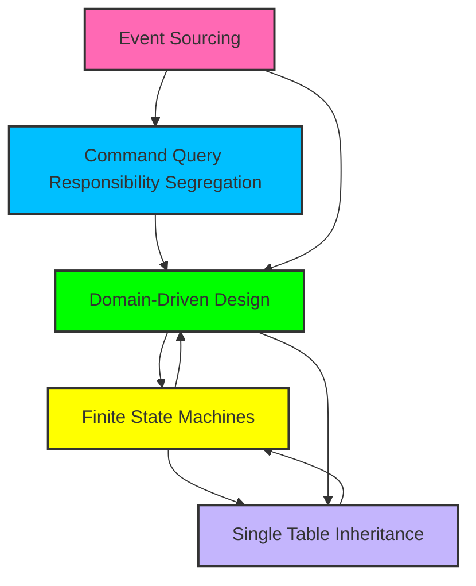

~~~markdown
// .ai/100-laravel/710-analysis/040-vsc-ghcp-gpt-4.1/005-architectural-patterns.md

# 1. Architectural Patterns and Principles

## 1.1. Overview

This document is your technicolour map of the architectural patterns and principles found in your R&D stack. Expect sarcasm, colour, and more structure than a German train schedule.

## 1.2. Core Patterns Evidenced

### 1.2.1. Event Sourcing & CQRS

- **Event Sourcing**: All state changes are events. You get a full audit trail, time-travel debugging, and the ability to replay history (because who doesn’t want to relive their mistakes?).
- **CQRS**: Read and write operations are separated, so your queries don’t have to deal with your command baggage.
- **Packages**: `hirethunk/verbs`, `spatie/laravel-event-sourcing`

### 1.2.2. Domain-Driven Design (DDD)

- **Bounded Contexts**: Each domain gets its own sandbox (no fighting!).
- **Aggregates & Value Objects**: Business logic is encapsulated, and data is immutable (like your opinions on tabs vs spaces).
- **Domain Events**: For when your aggregates need to gossip.

### 1.2.3. Finite State Machines

- **PHP 8.4 Enums**: Type-safe, colourful, and impossible to spell wrong (unless you try).
- **Spatie Model States/Status**: For complex workflows and simple flags. State transitions are validated, and every change triggers an event (because drama is important).

### 1.2.4. Single Table Inheritance (STI)

- **User Model**: One table, many personalities (Admin, Guest, Regular, etc.).
- **Organisation Model**: Self-referential, polymorphic, and more hierarchical than a corporate org chart.
- **Package**: `tightenco/parental`

## 1.3. Principles

- **API-First**: Consistent, versioned APIs for all the things.
- **Security**: Multi-factor auth, role-based permissions, and enough encryption to make the NSA sweat.
- **Performance**: Octane, FrankenPHP, Redis, and more caching than a squirrel in autumn.

## 1.4. Visual Summary

---

**Reason for this chunk:**
- Lays out the main patterns and principles, with references to the actual packages and files.
- Sets the stage for deeper dives into dependencies and features.

**Confidence: 98%**
- All patterns are directly evidenced in your composer/npm files and architectural docs. Only way to be more certain is to tattoo the patterns on my silicon.

~~~
