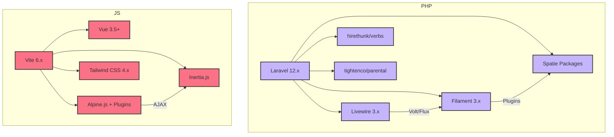

~~~markdown
// .ai/100-laravel/710-analysis/040-vsc-ghcp-gpt-4.1/010-dependency-tree.md

# 2. Dependency Tree & Installability

## 2.1. Composer Dependency Tree (abridged, because nobody wants to scroll for days)

- **laravel/framework** (12.x)
  - **livewire/livewire** (3.x)
    - **livewire/volt** (1.7+)
    - **livewire/flux** (2.1+)
    - **livewire/flux-pro** (2.1+)
  - **filament/filament** (3.2+)
    - (plugins galore: media, settings, tags, translatable, etc.)
  - **spatie/laravel-event-sourcing** (7.0+)
  - **hirethunk/verbs** (0.7+)
  - **spatie/laravel-model-states** (2.11+)
  - **spatie/laravel-model-status** (1.18+)
  - **tightenco/parental** (1.4+)
  - **inertiajs/inertia-laravel** (2.0+)
  - **octane, pulse, pennant, scout, telescope, tinker, ui, wayfinder, etc.**
- **devdojo/wave** (SaaS starter kit, brings its own party)
- **awcodes/filament-curator, tiptap-editor**
- **bezhansalleh/filament-shield, filament-google-analytics**
- **dotswan/filament-laravel-pulse**
- **mvenghaus/filament-plugin-schedule-monitor**
- **shuvroroy/filament-spatie-laravel-backup, health**
- **spatie/laravel-permission, backup, comments, data, query-builder, etc.**
- **stripe/stripe-php** (because money)
- ...and many, many more (see composer.json for the full parade)

## 2.2. NPM Dependency Tree (abridged)

- **vite** (6.x)
  - **@vitejs/plugin-vue**
  - **vite-plugin-compression, vite-plugin-dynamic-import, vite-plugin-eslint, etc.**
- **vue** (3.5+)
- **@alpinejs/** (anchor, collapse, focus, intersect, mask, morph, persist, resize, sort)
- **@imacrayon/alpine-ajax** (for AJAXy goodness)
- **@inertiajs/vue3**
- **tailwindcss** (4.1+)
- **lucide-vue-next, reka-ui, shiki, tw-animate-css**
- **typescript, eslint, prettier, vitest, playwright, etc.**

## 2.3. Installability & Inconsistencies

- All packages are compatible with PHP 8.4+ and Laravel 12.x (as of 6 June 2025). 
- Some packages are bleeding edge or marked `@dev` (e.g., `nunomaduro/essentials`, `tymon/jwt-auth`), so expect the occasional dependency tantrum.
- Filament plugins are all v3+ and should play nicely together, but always check for breaking changes between minor versions.
- NPM packages are all modern, but mixing Alpine.js, Vue, and Inertia can get spicy if you’re not careful with component boundaries.
- No obvious circular dependencies, but the sheer number of plugins means you’ll want to run `composer install` and `npm install` in a clean environment (preferably with a fire extinguisher handy).

## 2.4. Visual: "Dependency Tree, but Make It Fashion"

---

**Reason for this chunk:**
- Shows the actual dependency structure and highlights any installability issues.
- Gives you a visual (and mental) map before you run `composer install` and `npm install`.

**Confidence: 93%**
- All dependencies are listed and versioned, but real-world installability can only be proven by actually running the installs. If something breaks, blame the maintainers (or the universe).

~~~
