~~~markdown
// .ai/100-laravel/710-analysis/040-vsc-ghcp-gpt-4.1/015-capabilities-and-features.md

# 3. Application Capabilities & Features

## 3.1. What You Actually Get (Besides a Headache)

### 3.1.1. Admin & UI
- **Filament Admin Panel**: Drag, drop, click, and pretend you’re in control. Includes media, settings, tags, translations, and more plugins than a WordPress site in 2012.
- **Livewire/Volt/Flux**: Reactive, component-based UI for both admin and non-admin. Volt SFC for non-admin, Filament SPA for admin. 
- **Alpine.js + Plugins**: Sprinkle interactivity everywhere. Alpine AJAX for async, morph for DOM magic, and more.
- **Inertia.js**: SPA-like experience, but with less JavaScript-induced existential dread.

### 3.1.2. State & Workflow
- **Event Sourcing**: Every change is an event. Audit trails, time travel, and the ability to blame the past.
- **Finite State Machines**: Model states and statuses, all type-safe and colourful. Transitions are validated, and every state change is an event.
- **STI Models**: User and Organisation models with multiple personalities (Admin, Guest, Tenant, Team, etc.), all in one table. 

### 3.1.3. Business Features
- **CMS**: Categories, taxonomies, long-form posts, newsletters, forums. All the content, all the time.
- **Social**: Presence, short-form posts, chat, comments, reactions, mentions, notifications, followers, chat rooms. Basically, everything but the drama.
- **Project Management**: Kanban, calendars, tasks with lifecycle management. Get things done, or at least look busy.
- **Media**: Sharing, avatars for users/orgs, and more.
- **eCommerce**: Products, services, carts, orders, subscriptions. Make it rain.

### 3.1.4. Performance & Monitoring
- **Octane/FrankenPHP**: Fast PHP, fewer excuses.
- **Pulse, Telescope, Health, Schedule Monitor**: Know when things break, and why.
- **Redis, S3, Typesense**: Caching, storage, and search that actually works.

### 3.1.5. Testing & Quality
- **Pest, PHPUnit, Infection**: 90%+ code coverage, mutation testing, and the ability to sleep at night.
- **PHPStan, Larastan, Pint**: Static analysis, code style, and more nitpicking than your average code review.

## 3.2. Visual: "Feature Overload Rainbow"

```mermaid
flowchart TD
    Admin[Admin Panel]:::admin --> CMS
    Admin --> Social
    Admin --> PM[Project Management]
    Admin --> Media
    Admin --> eCommerce
    CMS[CMS]:::cms -->|Categories| Taxonomies
    CMS -->|Posts| Blog
    CMS -->|Newsletter| Newsletter
    CMS -->|Forums| Forums
    Social[Social]:::social -->|Presence| Presence
    Social -->|Posts| ShortPosts
    Social -->|Chat| Chat
    Social -->|Comments| Comments
    Social -->|Reactions| Reactions
    Social -->|Mentions| Mentions
    Social -->|Notifications| Notifications
    Social -->|Followers| Followers
    Social -->|Chat Rooms| ChatRooms
    PM -->|Kanban| Kanban
    PM -->|Calendars| Calendars
    PM -->|Tasks| Tasks
    Media[Media]:::media -->|Sharing| Sharing
    Media -->|Avatars| Avatars
    eCommerce[eCommerce]:::ecom -->|Products| Products
    eCommerce -->|Services| Services
    eCommerce -->|Carts| Carts
    eCommerce -->|Orders| Orders
    eCommerce -->|Subscriptions| Subscriptions
    classDef admin fill:#00bfff,stroke:#333,stroke-width:2px;
    classDef cms fill:#ff69b4,stroke:#333,stroke-width:2px;
    classDef social fill:#00ff00,stroke:#333,stroke-width:2px;
    classDef media fill:#fdba74,stroke:#333,stroke-width:2px;
    classDef ecom fill:#c4b5fd,stroke:#333,stroke-width:2px;
```

---

**Reason for this chunk:**
- Explains what the packages actually enable, mapped to your business requirements.
- Highlights the breadth of features, so you know what you’re getting (and what you’ll have to maintain).

**Confidence: 97%**
- All features are directly supported by the listed packages and architectural docs. If you can’t build it with this stack, you probably shouldn’t.

~~~
