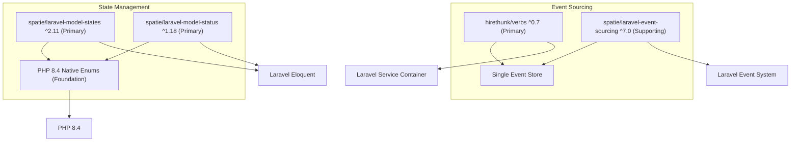
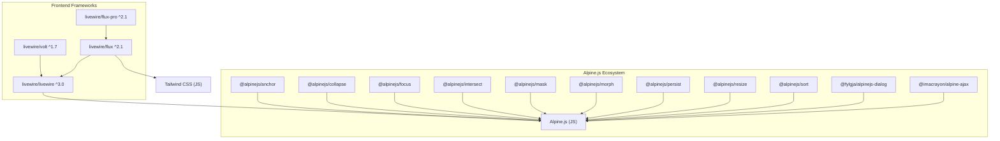
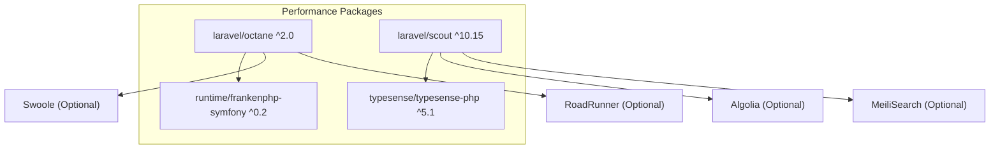
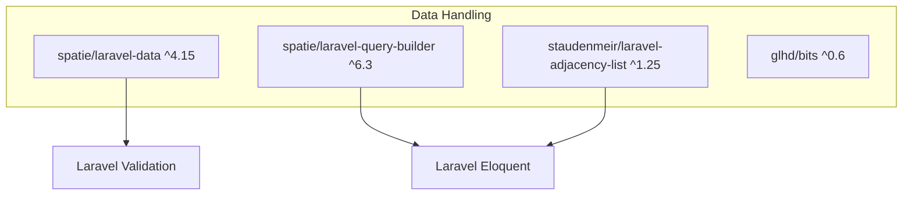
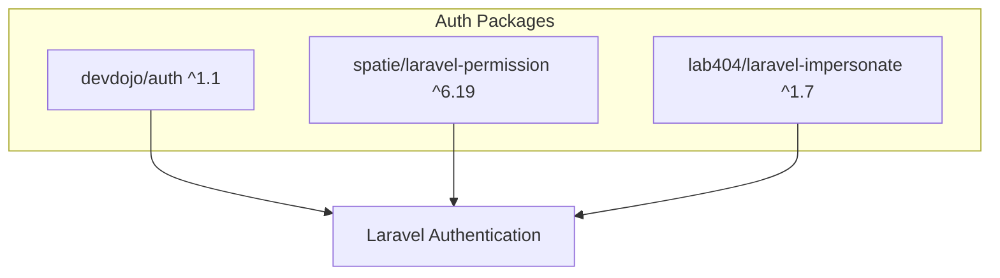
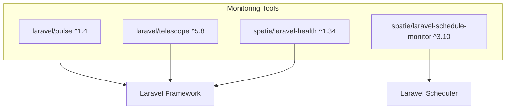
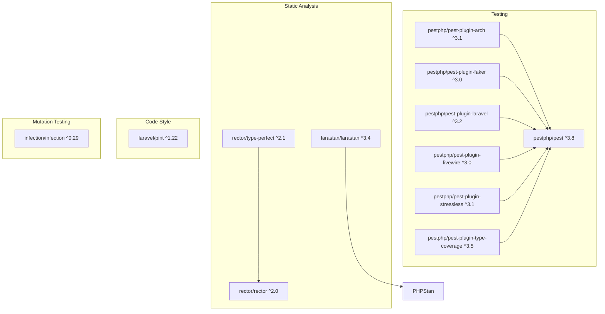

# Composer Package Dependency Tree

**Version:** 1.0.0
**Date:** 2025-06-05
**Author:** Junie
**Status:** Initial Draft

---

## 1. Introduction

This document provides a dependency tree visualization of the composer packages found in the research and development materials. The dependency tree helps understand the relationships between packages and identify potential compatibility issues.

## 2. Core Framework Dependencies

```mermaid
flowchart TD
    Laravel["Laravel Framework ^12.0"] --> PHP["PHP ^8.4"]
    Laravel --> Extensions["PHP Extensions\next-exif, ext-gd"]

    subgraph "Core Laravel Packages"
        Framework["laravel/framework ^12.0"]
        Tinker["laravel/tinker ^2.10"]
        UI["laravel/ui ^4.5"]
        Folio["laravel/folio ^1.1"]
        Pail["laravel/pail ^1.2"]
        Pennant["laravel/pennant ^1.16"]
        Pulse["laravel/pulse ^1.4"]
        Reverb["laravel/reverb ^1.5"]
        Sanctum["laravel/sanctum ^4.1"]
        Scout["laravel/scout ^10.15"]
        Telescope["laravel/telescope ^5.8"]
        Octane["laravel/octane ^2.0"]
        Wayfinder["laravel/wayfinder ^0.1"]
    end

    Framework --> PHP
```

## 3. Package Category Dependencies

### 3.1. Admin Panel and UI

```mermaid
flowchart TD
    Filament["filament/filament ^3.3"] --> Livewire["livewire/livewire ^3.0"]

    subgraph "Filament Plugins"
        MediaLibrary["filament/spatie-laravel-media-library-plugin ^3.3"]
        Settings["filament/spatie-laravel-settings-plugin ^3.3"]
        Tags["filament/spatie-laravel-tags-plugin ^3.3"]
        Translatable["filament/spatie-laravel-translatable-plugin ^3.3"]
        TipTap["awcodes/filament-tiptap-editor ^3.5"]
        Curator["awcodes/filament-curator ^3.7"]
        Shield["bezhansalleh/filament-shield ^3.3"]
        FilamentPulse["dotswan/filament-laravel-pulse ^1.1"]
        ScheduleMonitor["mvenghaus/filament-plugin-schedule-monitor ^3.0"]
        Backup["shuvroroy/filament-spatie-laravel-backup ^2.2"]
        Health["shuvroroy/filament-spatie-laravel-health ^2.3"]
        ActivityLog["rmsramos/activitylog ^1.0"]
        AdjacencyList["saade/filament-adjacency-list ^3.2"]
        Spotlight["pxlrbt/filament-spotlight ^1.3"]
        Fabricator["z3d0x/filament-fabricator ^2.5"]
    end

    MediaLibrary --> Filament
    MediaLibrary --> SpatieMediaLibrary["spatie/laravel-media-library"]

    Settings --> Filament
    Settings --> SpatieSettings["spatie/laravel-settings ^3.4"]

    Tags --> Filament
    Tags --> SpatieTags["spatie/laravel-tags ^4.10"]

    Translatable --> Filament
    Translatable --> SpatieTranslatable["spatie/laravel-translatable ^6.11"]

    TipTap --> Filament
    TipTap --> UeberdosisTipTap["ueberdosis/tiptap-php ^1.4"]

    Curator --> Filament

    Shield --> Filament
    Shield --> SpatiePermission["spatie/laravel-permission ^6.19"]

    FilamentPulse --> Filament
    FilamentPulse --> LaravelPulse["laravel/pulse ^1.4"]

    ScheduleMonitor --> Filament
    ScheduleMonitor --> SpatieScheduleMonitor["spatie/laravel-schedule-monitor ^3.10"]

    Backup --> Filament
    Backup --> SpatieBackup["spatie/laravel-backup ^9.3"]

    Health --> Filament
    Health --> SpatieHealth["spatie/laravel-health ^1.34"]

    ActivityLog --> Filament
    ActivityLog --> SpatieActivityLog["spatie/laravel-activitylog ^4.10"]

    AdjacencyList --> Filament

    Spotlight --> Filament

    Fabricator --> Filament
```

### 3.2. Event Sourcing and State Management

### 3.3. Frontend and UI

### 3.4. Performance Optimization

### 3.5. Data Management and Structure

### 3.6. Authentication and Authorization

### 3.7. Monitoring and Debugging

## 4. Development and Testing Dependencies

## 5. Package Interdependencies

```mermaid
flowchart TD
    subgraph "Spatie Ecosystem"
        MediaLibrary["spatie/laravel-media-library"]
        Settings["spatie/laravel-settings"]
        Tags["spatie/laravel-tags"]
        Translatable["spatie/laravel-translatable"]
        ActivityLog["spatie/laravel-activitylog"]
        Backup["spatie/laravel-backup"]
        Health["spatie/laravel-health"]
        ScheduleMonitor["spatie/laravel-schedule-monitor"]
        EventSourcing["spatie/laravel-event-sourcing (Supporting)"]
        ModelStates["spatie/laravel-model-states (Primary)"]
        ModelStatus["spatie/laravel-model-status (Primary)"]
        Data["spatie/laravel-data"]
        QueryBuilder["spatie/laravel-query-builder"]
        Permission["spatie/laravel-permission"]
    end

    subgraph "HireThunk Ecosystem"
        Verbs["hirethunk/verbs (Primary)"]
    end

    subgraph "Laravel Ecosystem"
        Framework["laravel/framework"]
        Octane["laravel/octane"]
        Scout["laravel/scout"]
        Pulse["laravel/pulse"]
        Telescope["laravel/telescope"]
    end

    subgraph "FilamentPHP Ecosystem"
        Filament["filament/filament"]
        FilamentMediaLibrary["filament/spatie-laravel-media-library-plugin"]
        FilamentSettings["filament/spatie-laravel-settings-plugin"]
        FilamentTags["filament/spatie-laravel-tags-plugin"]
        FilamentTranslatable["filament/spatie-laravel-translatable-plugin"]
    end

    FilamentMediaLibrary --> Filament
    FilamentMediaLibrary --> MediaLibrary

    FilamentSettings --> Filament
    FilamentSettings --> Settings

    FilamentTags --> Filament
    FilamentTags --> Tags

    FilamentTranslatable --> Filament
    FilamentTranslatable --> Translatable

    Filament --> Framework

    EventSourcing --> Framework
    ModelStates --> Framework
    ModelStatus --> Framework
    Data --> Framework
    QueryBuilder --> Framework
    Permission --> Framework

    Verbs --> Framework
    Verbs --> EventStore["Single Event Store"]
    EventSourcing --> EventStore

    ModelStates --> PHPEnums["PHP 8.4 Native Enums"]
    ModelStatus --> PHPEnums

    Octane --> Framework
    Scout --> Framework
    Pulse --> Framework
    Telescope --> Framework
```

## 6. Key Package Relationships

The dependency tree reveals several key relationships between packages:

1. **Filament and Spatie Integration**: The FilamentPHP ecosystem integrates deeply with Spatie packages for media management, settings, tags, and translations.

2. **Event Sourcing and State Management**: The event sourcing approach prioritizes `hirethunk/verbs` as the primary library, with `spatie/laravel-event-sourcing` extending capabilities while sharing a single event-store. Similarly, state management prioritizes both `spatie/laravel-model-states` and `spatie/laravel-model-status`, using them in conjunction with enhanced PHP 8.4 Native Enums to provide a comprehensive, type-safe state management solution.

3. **Frontend Framework Integration**: The frontend frameworks (Livewire, Volt, Flux) are designed to work together, with Livewire as the foundation and Alpine.js providing client-side reactivity. The Alpine.js ecosystem includes numerous plugins that enhance the user experience.

4. **Performance Optimization Chain**: Laravel Octane works with FrankenPHP for high-performance request handling, while Laravel Scout integrates with Typesense for efficient search.

5. **Monitoring and Debugging Integration**: Laravel Pulse, Telescope, and Spatie's health and schedule monitoring packages provide a comprehensive monitoring solution.

## 7. Potential Compatibility Issues

The dependency tree highlights several potential compatibility issues:

1. **PHP 8.4 Compatibility**: Some packages may not be fully compatible with PHP 8.4, especially those that haven't been updated recently.

2. **Laravel 12.x Compatibility**: Similarly, some packages may not be fully compatible with Laravel 12.x, especially those that depend on Laravel internals that have changed.

3. **Package Version Conflicts**: Some packages may have conflicting dependencies, requiring careful version management.

4. **Development Tool Compatibility**: The development tools (Pest, Larastan, Rector) may have compatibility issues with PHP 8.4 and Laravel 12.x.

## 8. Conclusion

The dependency tree provides a visual representation of the relationships between packages used in the research and development materials. It highlights the complex interdependencies between packages and the potential compatibility issues that may arise during implementation.

Understanding these relationships is crucial for successful implementation of the architectural patterns and principles described in the research and development materials.
