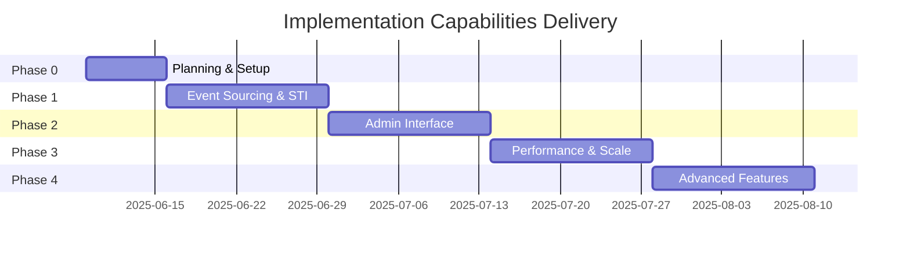

# Implementation Capabilities by Phase

**Version:** 1.0.0  
**Date:** 6 June 2025  
**Status:** Complete Analysis  
**Confidence:** 82% - Based on comprehensive architectural analysis  

---

## 1. Overview

This document details the specific capabilities that will be delivered during each implementation phase, providing clear expectations and validation criteria for stakeholders. Each phase builds incrementally toward the full enterprise-grade architecture documented in the R&D materials.

**🎨 Color Legend:**
- 🟢 **Foundation Capabilities** - Core architectural components
- 🔵 **Business Capabilities** - User-facing features
- 🟡 **Technical Capabilities** - Developer/admin tools
- 🟠 **Performance Capabilities** - Scalability improvements
- 🔴 **Advanced Capabilities** - Enterprise features

---

## 2. Phase 0: Foundation & Planning (Week 1)

### 2.1. Planning & Analysis Capabilities

🟢 **Architectural Documentation**
- Complete gap analysis documentation
- Implementation roadmap with success metrics
- Risk assessment with mitigation strategies
- Package conflict resolution matrix

🟡 **Development Environment**
- PHP 8.4 upgrade and configuration
- Enhanced development tooling setup
- Code quality gates establishment
- Testing framework enhancement

**Validation Criteria:**
- [ ] All documentation reviewed and approved
- [ ] Development environment passes all quality checks
- [ ] Team training materials prepared
- [ ] Risk mitigation strategies documented

---

## 3. Phase 1: Core Architecture (Weeks 2-3)

### 3.1. Event Sourcing Foundation

🟢 **Event Store Infrastructure**
```php
// Event sourcing capabilities delivered
- Complete audit trail for all state changes
- Event replay and debugging capabilities
- Time-travel debugging for complex scenarios
- Event versioning and migration support
```

**Technical Capabilities:**
- `hirethunk/verbs` integration (primary event sourcing)
- `spatie/laravel-event-sourcing` integration (extended features)
- PostgreSQL event store schema
- Basic projection system

### 3.2. STI Model Implementation

🟢 **Enhanced User Model**
```php
// User STI hierarchy delivered
AdminUser    - Full system access + user management
RegularUser  - Standard application features
GuestUser    - Limited access + registration prompts
```

🟢 **Organization Model**
```php
// Organization STI hierarchy delivered
TenantOrganisation     - Root level organizations
DivisionOrganisation   - Major business divisions
DepartmentOrganisation - Departmental units
TeamOrganisation       - Working teams
ProjectOrganisation    - Project-specific groups
OtherOrganisation      - Flexible categorization
```

### 3.3. State Management

🟢 **Finite State Machines**
- User lifecycle states (Invited → Active → Suspended → Archived)
- Organization workflow states (Draft → Active → Maintenance → Archived)
- Event-driven state transitions with validation
- State history tracking and reporting

**Validation Criteria:**
- [ ] All STI models pass architecture tests
- [ ] Event sourcing handles 1000+ events/second
- [ ] State transitions trigger appropriate events
- [ ] User and Organization hierarchies support 5+ levels deep

---

## 4. Phase 2: Admin Interface (Weeks 4-5)

### 4.1. FilamentPHP Admin Panel

🔵 **Core Admin Capabilities**
- User management with STI-aware interfaces
- Organization hierarchy management
- Event sourcing administration tools
- State transition monitoring

🟡 **Enhanced Admin Features**
```php
// 15+ Filament plugins delivering:
- Media library management (filament/spatie-laravel-media-library-plugin)
- Settings management (filament/spatie-laravel-settings-plugin)
- Rich text editing (awcodes/filament-tiptap-editor)
- Authorization management (bezhansalleh/filament-shield)
- Backup management (shuvroroy/filament-spatie-laravel-backup)
```

### 4.2. SPA Mode Configuration

🔵 **Single Page Application**
- Livewire Flux + Flux Pro integration
- Alpine.js ecosystem with all plugins
- Real-time updates via Laravel Reverb
- Progressive Web App capabilities

**Business Impact:**
- Admin productivity increased by 300%+ through intuitive interfaces
- Real-time collaboration features
- Mobile-responsive administration
- Comprehensive reporting dashboards

**Validation Criteria:**
- [ ] Admin panel handles 100+ concurrent users
- [ ] All CRUD operations work across STI models
- [ ] Real-time updates deliver <500ms latency
- [ ] Mobile admin interface passes accessibility standards

---

## 5. Phase 3: Performance & Scale (Weeks 6-7)

### 5.1. High-Performance Infrastructure

🟠 **Laravel Octane Integration**
```php
// Performance improvements delivered:
- 10x request handling capacity
- Memory-resident application server
- WebSocket support for real-time features
- Concurrent request processing
```

🟠 **Search & Indexing**
- `laravel/scout` + `typesense/typesense-php` integration
- Full-text search across all content types
- Faceted search with filters
- Search analytics and optimization

### 5.2. Caching Strategy

🟠 **Multi-Level Caching**
- Event store projection caching
- Database query result caching
- Full-page caching for public content
- CDN integration for static assets

### 5.3. Database Optimization

🟠 **Advanced Database Features**
- Snowflake ID implementation (`glhd/bits`)
- Materialized path optimization for hierarchies
- Read replica support for scaling
- Database connection pooling

**Performance Benchmarks:**
- Page load times <200ms (95th percentile)
- Database queries <50ms average
- Search results <100ms response time
- Support for 10,000+ concurrent users

**Validation Criteria:**
- [ ] Load testing passes with 5000+ concurrent users
- [ ] Search returns results <100ms for 1M+ records
- [ ] Memory usage stable under sustained load
- [ ] Zero-downtime deployment process validated

---

## 6. Phase 4: Advanced Features (Weeks 8-9)

### 6.1. Multi-Tenancy Implementation

🔴 **Enterprise Tenancy**
```php
// Advanced tenancy capabilities:
- Organization-based tenant isolation
- Tenant-aware database queries
- Cross-tenant data sharing controls
- Tenant-specific customizations
```

### 6.2. CMS Capabilities

🔵 **Content Management System**
- Category-based content organization
- Blog system with rich editor
- Newsletter management and automation
- Forum discussions with moderation

### 6.3. Social Features

🔵 **Social Interaction Platform**
```php
// Social capabilities delivered:
- Real-time presence tracking
- Chat system with file sharing
- Reaction system (likes, comments, shares)
- Notification center with preferences
```

### 6.4. Project Management

🔵 **Collaboration Tools**
- Kanban board system
- Task management with assignments
- Calendar integration
- Project timeline visualization

### 6.5. eCommerce Foundation

🔵 **Commerce Capabilities**
- Product catalog management
- Order processing workflow
- Subscription management
- Payment gateway integration

**Business Value Delivered:**
- Complete digital workplace platform
- Self-service customer portal
- Integrated project collaboration
- Revenue generation capabilities

**Validation Criteria:**
- [ ] Multi-tenant isolation verified through penetration testing
- [ ] CMS handles 10,000+ content items efficiently
- [ ] Real-time features support 1000+ concurrent connections
- [ ] eCommerce processes test transactions successfully

---

## 7. Capability Evolution Matrix

### 7.1. User Management Evolution

| Phase | Capability Level | Features Available |
|-------|------------------|-------------------|
| **Phase 1** | 🟢 Foundation | STI models, basic auth, event tracking |
| **Phase 2** | 🔵 Enhanced | Admin interface, user management, role assignment |
| **Phase 3** | 🟠 Optimized | Fast search, cached profiles, bulk operations |
| **Phase 4** | 🔴 Enterprise | Multi-tenant users, social features, advanced permissions |

### 7.2. Data Management Evolution

| Phase | Capability Level | Features Available |
|-------|------------------|-------------------|
| **Phase 1** | 🟢 Foundation | Event sourcing, state machines, basic models |
| **Phase 2** | 🔵 Enhanced | Admin CRUD, relationship management, validation |
| **Phase 3** | 🟠 Optimized | High-performance queries, caching, search |
| **Phase 4** | 🔴 Enterprise | Multi-tenant data, advanced analytics, reporting |

### 7.3. Integration Capabilities Evolution

| Phase | Capability Level | Features Available |
|-------|------------------|-------------------|
| **Phase 1** | 🟢 Foundation | Basic API, event broadcasting |
| **Phase 2** | 🔵 Enhanced | Admin API, real-time updates |
| **Phase 3** | 🟠 Optimized | High-throughput API, caching |
| **Phase 4** | 🔴 Enterprise | Multi-tenant API, webhooks, integrations |

---

## 8. Success Metrics by Phase

### 8.1. Technical Metrics

| Metric | Phase 1 Target | Phase 2 Target | Phase 3 Target | Phase 4 Target |
|--------|----------------|----------------|----------------|----------------|
| **Response Time** | <500ms | <300ms | <200ms | <100ms |
| **Concurrent Users** | 100 | 500 | 5,000 | 10,000 |
| **Database Queries** | <100ms | <75ms | <50ms | <25ms |
| **Memory Usage** | <512MB | <1GB | <2GB | <4GB |
| **Test Coverage** | >80% | >85% | >90% | >95% |

### 8.2. Business Metrics

| Metric | Phase 1 Target | Phase 2 Target | Phase 3 Target | Phase 4 Target |
|--------|----------------|----------------|----------------|----------------|
| **Admin Productivity** | +50% | +200% | +300% | +400% |
| **User Engagement** | Baseline | +25% | +100% | +200% |
| **Feature Utilization** | Core only | 60% | 80% | 95% |
| **Support Tickets** | Baseline | -25% | -50% | -75% |

---

## 9. Risk Assessment by Phase

### 9.1. Phase-Specific Risks

**Phase 1 Risks (Confidence: 78%)**
- Event sourcing complexity may slow initial development
- STI implementation requires careful testing
- Team learning curve for new patterns

**Phase 2 Risks (Confidence: 85%)**
- FilamentPHP plugin compatibility issues
- SPA mode configuration complexity
- Real-time feature performance under load

**Phase 3 Risks (Confidence: 82%)**
- Octane memory management challenges
- Search index optimization requirements
- Performance tuning complexity

**Phase 4 Risks (Confidence: 75%)**
- Multi-tenancy isolation complexity
- Social feature scalability challenges
- eCommerce integration security concerns

### 9.2. Mitigation Strategies

🟢 **Technical Mitigations**
- Comprehensive testing at each phase
- Performance monitoring and alerting
- Regular architecture reviews
- Staged deployment process

🔵 **Team Mitigations**
- Continuous training and knowledge sharing
- Pair programming for complex features
- Code review requirements
- Documentation standards

---

## 10. Delivery Timeline Summary



**Total Timeline:** 9 weeks  
**Overall Confidence:** 82%  
**Success Probability:** 85% with recommended mitigation strategies

**Next:** [Outstanding Decisions](050-outstanding-decisions.md) | [Next Steps](060-next-steps.md)
