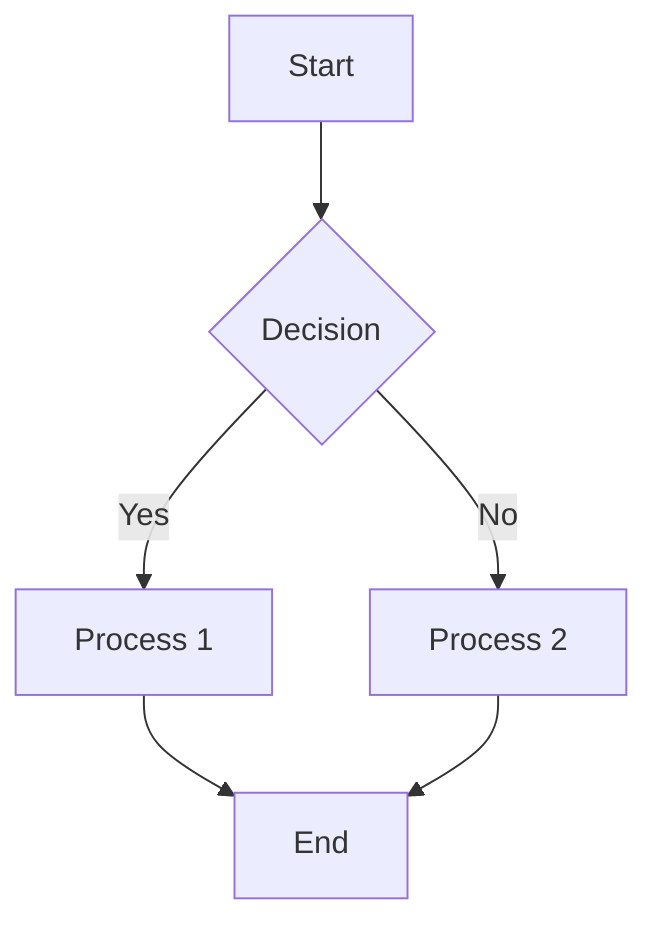
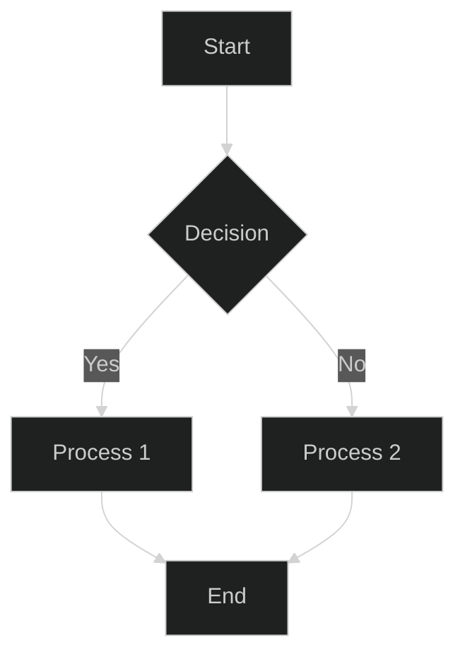

# ELA Documentation Style Guide v1.2.0-updated (ARCHIVED)

**Version:** 1.2.0
**Date:** 2025-05-17
**Author:** AI Assistant
**Status:** Archived
**Progress:** Complete

> **IMPORTANT:** This document is archived and has been superseded by the [Consolidated Documentation Style Guide](/_root/docs/E_L_A/220-ela-documentation-style-guide-consolidated.md). Please refer to the consolidated guide for the most up-to-date standards.

---

<details>
<summary>Table of Contents</summary>

- [Overview](#overview)
- [Document Structure](#document-structure)
  - [Metadata](#metadata)
  - [Table of Contents](#table-of-contents)
  - [Headings](#headings)
  - [Version History](#version-history)
- [Document Types](#document-types)
  - [Overview Documents](#overview-documents)
  - [Implementation Guides](#implementation-guides)
  - [Reference Documents](#reference-documents)
  - [Index Documents](#index-documents)
- [Standardized Sections](#standardized-sections)
  - [Prerequisites](#prerequisites)
  - [Estimated Time Requirements](#estimated-time-requirements)
  - [Implementation Steps](#implementation-steps)
  - [Troubleshooting](#troubleshooting)
  - [Related Documents](#related-documents)
  - [Navigation Links](#navigation-links)
- [Code Examples](#code-examples)
  - [PHP Code](#php-code)
  - [Blade Templates](#blade-templates)
  - [JavaScript/TypeScript](#javascripttypescript)
  - [General Guidelines](#general-guidelines)
- [Diagrams and Illustrations](#diagrams-and-illustrations)
  - [Mermaid Diagrams](#mermaid-diagrams)
  - [Light and Dark Mode](#light-and-dark-mode)
  - [Illustrations Index](#illustrations-index)
- [File Organization](#file-organization)
  - [Naming Conventions](#naming-conventions)
  - [Directory Structure](#directory-structure)
  - [Archiving Old Files](#archiving-old-files)
- [Validation and Quality Assurance](#validation-and-quality-assurance)
  - [Documentation Validation Script](#documentation-validation-script)
  - [Common Issues](#common-issues)
</details>

## Overview

This style guide provides standards and guidelines for creating and maintaining documentation for the Enhanced Laravel Application (ELA). Following these guidelines ensures consistency across all documentation and improves readability and usability.

## Document Structure

### Metadata

All documents should include the following metadata at the top:

```markdown
# Document Title

**Version:** 1.0.0
**Date:** YYYY-MM-DD
**Author:** Author Name
**Status:** [New|Draft|Updated|Complete]
**Progress:** [Not Started|In Progress|Complete]

---
```

- **Version:** Use semantic versioning (MAJOR.MINOR.PATCH)
- **Date:** Use ISO format (YYYY-MM-DD)
- **Author:** Name of the author
- **Status:** One of the following:
  - **New:** First version of the document
  - **Draft:** Document is in progress
  - **Updated:** Document has been updated
  - **Complete:** Document is complete
- **Progress:** One of the following:
  - **Not Started:** Work has not begun
  - **In Progress:** Work is ongoing
  - **Complete:** Work is complete

### Table of Contents

All documents should include a table of contents wrapped in HTML details tags:

```markdown
<details>
<summary>Table of Contents</summary>

- [Section 1](#section-1)
- [Section 2](#section-2)
  - [Subsection 2.1](#subsection-21)
  - [Subsection 2.2](#subsection-22)
- [Section 3](#section-3)
</details>
```

The depth of the table of contents depends on the document type:
- Overview documents: TOC to level 2 headings
- Implementation guides: TOC to level 3 headings
- Reference documents: TOC to level 3 headings

### Headings

Use the following heading levels consistently:

- **Level 1 (#):** Document title only
- **Level 2 (##):** Main sections
- **Level 3 (###):** Subsections
- **Level 4 (####):** Sub-subsections
- **Level 5 (#####):** Avoid if possible
- **Level 6 (######):** Avoid if possible

### Version History

All documents should include a version history section at the end:

```markdown
## Version History

| Version | Date | Changes | Author |
|---------|------|---------|--------|
| 1.0.0 | YYYY-MM-DD | Initial version | Author Name |
| 1.0.1 | YYYY-MM-DD | Updated X, Y, Z | Author Name |
| 1.1.0 | YYYY-MM-DD | Added new section on X | Author Name |
```

## Document Types

### Overview Documents

Overview documents provide a high-level view of a component or system. They should:

- Start with a clear introduction
- Include a table of contents to level 2 headings
- Provide a conceptual overview
- Link to more detailed documents
- Include diagrams where appropriate

Example: `100-000-implementation-plan-overview.md`

### Implementation Guides

Implementation guides provide step-by-step instructions for implementing a feature or component. They should:

- Start with a clear introduction
- Include a table of contents to level 3 headings
- Include a prerequisites section
- Include estimated time requirements
- Provide numbered steps with clear instructions
- Include code examples
- Include a troubleshooting section
- Link to related documents
- Include navigation links to previous and next steps

Example: `100-100-in-memory-database.md`

### Reference Documents

Reference documents provide detailed information about a component or system. They should:

- Start with a clear introduction
- Include a table of contents to level 3 headings
- Organize information logically
- Use tables for structured data
- Include examples
- Link to related documents

Example: `100-420-version-compatibility.md`

### Index Documents

Index documents provide a list of related documents. They should:

- Start with a clear introduction
- Include a table of contents
- Organize documents logically
- Include brief descriptions of each document
- Link to all documents

Example: `000-index.md`

## Standardized Sections

### Prerequisites

Implementation guides should include a prerequisites section after the introduction:

```markdown
## Prerequisites

Before starting, ensure you have:

### Required Prior Steps
- [Step 1](./link-to-step1.md) completed
- [Step 2](./link-to-step2.md) completed

### Required Packages
- Package 1 (`package/name`) installed
- Package 2 (`package/name`) installed

### Required Knowledge
- Basic understanding of X
- Familiarity with Y

### Required Environment
- PHP 8.2 or higher
- Laravel 12.x
- Composer 2.x
```

### Estimated Time Requirements

Implementation guides should include an estimated time requirements section after the prerequisites:

```markdown
## Estimated Time Requirements

| Task | Estimated Time |
|------|----------------|
| Step 1: First Step | 15 minutes |
| Step 2: Second Step | 30 minutes |
| Step 3: Third Step | 20 minutes |
| Testing and Verification | 15 minutes |
| **Total** | **80 minutes** |

> **Note:** These time estimates assume familiarity with Laravel and the required packages. Actual time may vary based on experience level and environment setup.
```

### Implementation Steps

Implementation guides should use numbered steps with clear instructions:

```markdown
## Step 1: First Step

1. Do this first
2. Then do this
3. Finally, do this

## Step 2: Second Step

1. Do this first
2. Then do this
3. Finally, do this
```

### Troubleshooting

Implementation guides should include a troubleshooting section before the related documents section:

```markdown
## Troubleshooting

<details>
<summary>Common Issues and Solutions</summary>

### Issue: [Brief description of the issue]

**Symptoms:**
- Symptom 1
- Symptom 2

**Possible Causes:**
- Cause 1
- Cause 2

**Solutions:**
1. Step 1 to resolve
2. Step 2 to resolve

### Issue: [Brief description of another issue]

**Symptoms:**
- Symptom 1
- Symptom 2

**Possible Causes:**
- Cause 1
- Cause 2

**Solutions:**
1. Step 1 to resolve
2. Step 2 to resolve

</details>
```

### Related Documents

All documents should include a related documents section before the version history:

```markdown
## Related Documents

- [Document 1](./link-to-document1.md) - Brief description
- [Document 2](./link-to-document2.md) - Brief description
- [Document 3](./link-to-document3.md) - Brief description
```

### Navigation Links

Implementation guides should include navigation links at the end of the document:

```markdown
---

**Previous Step:** [Previous Step](./link-to-previous-step.md) | **Next Step:** [Next Step](./link-to-next-step.md)
```

## Code Examples

### PHP Code

```php
/**
 * Example class demonstrating standardized code formatting.
 */
class ExampleClass
{
    // Properties should use typed properties
    private string $property;

    // Constructor with property promotion where appropriate
    public function __construct(
        private readonly string $name,
        private readonly int $value = 0
    ) {
        $this->property = 'default';
    }

    /**
     * Example method with return type and parameter type hints.
     *
     * @param string $input The input string
     * @return string The processed output
     */
    public function processInput(string $input): string
    {
        // Use arrow functions for simple callbacks
        $processed = array_map(
            fn($item) => strtoupper($item),
            explode(' ', $input)
        );

        return implode(' ', $processed);
    }
}
```

### Blade Templates

```blade
{{-- Use comments to explain the purpose of the template --}}
<div class="container">
    {{-- Use proper indentation for nested elements --}}
    <h1>{{ $title }}</h1>

    {{-- Use @if/@endif for conditional rendering --}}
    @if($items->isNotEmpty())
        <ul>
            {{-- Use @foreach for loops --}}
            @foreach($items as $item)
                <li>{{ $item->name }}</li>
            @endforeach
        </ul>
    @else
        <p>No items found.</p>
    @endif
</div>
```

### JavaScript/TypeScript

```javascript
// Use ES6+ syntax
const processData = (data) => {
    // Use destructuring
    const { id, name, values } = data;

    // Use template literals
    console.log(`Processing ${name} with ID ${id}`);

    // Use array methods
    return values
        .filter(value => value > 0)
        .map(value => value * 2)
        .reduce((sum, value) => sum + value, 0);
};

// Use async/await for asynchronous code
const fetchData = async (url) => {
    try {
        const response = await fetch(url);

        if (!response.ok) {
            throw new Error(`HTTP error! Status: ${response.status}`);
        }

        return await response.json();
    } catch (error) {
        console.error('Fetch error:', error);
        return null;
    }
};
```

### General Guidelines

1. Always include language specifier in code blocks (e.g., ```php, ```blade, ```javascript)
2. Use consistent indentation (4 spaces for PHP, 2 spaces for HTML/JS/CSS)
3. Include comments to explain complex logic
4. Use type hints and return types in PHP code
5. Use modern language features (arrow functions, null coalescing, etc.)
6. Follow PSR-12 coding standards for PHP code
7. Include docblocks for classes and methods

## Diagrams and Illustrations

### Mermaid Diagrams

Use Mermaid syntax for diagrams:

```markdown

```

### Light and Dark Mode

Provide both light and dark mode versions of all diagrams:

```markdown
<details>
<summary>Light Mode Diagram</summary>


</details>

<details>
<summary>Dark Mode Diagram</summary>


</details>
```

### Illustrations Index

All diagrams should be listed in the illustrations index (`illustrations/index.html`) with the following information:

- Name
- Type
- Description
- Source document
- Light mode file path
- Dark mode file path

## File Organization

### Naming Conventions

Use the following naming convention for files:

```
[section]-[subsection]-[number]-[name].md
```

For example:
- `100-000-implementation-plan-overview.md`
- `100-100-in-memory-database.md`
- `200-100-database-design.md`

### Directory Structure

Organize files in the following directory structure:

```
docs/
├── 010-ela/
│   ├── 000-index.md
│   ├── 100-implementation-plan/
│   │   ├── 000-index.md
│   │   ├── 100-000-implementation-plan-overview.md
│   │   ├── 100-010-documentation-updates.md
│   │   └── ...
│   ├── 200-database-design/
│   │   ├── 000-index.md
│   │   └── ...
│   ├── illustrations/
│   │   ├── index.html
│   │   ├── mermaid/
│   │   │   ├── light/
│   │   │   └── dark/
│   │   ├── plantuml/
│   │   │   ├── light/
│   │   │   └── dark/
│   │   └── thumbnails/
│   │       ├── mermaid/
│   │       │   ├── light/
│   │       │   └── dark/
│   │       └── plantuml/
│   │           ├── light/
│   │           └── dark/
│   └── tools/
│       ├── validate-docs.sh
│       └── ...
└── ...
```

### Archiving Old Files

When a file is replaced by a newer version, move the old file to a `.archive` directory:

```
docs/
├── 010-ela/
│   ├── 100-implementation-plan/
│   │   ├── .archive/
│   │   │   ├── 100-030-package-installation.md
│   │   │   └── ...
│   │   └── ...
│   └── ...
└── ...
```

## Validation and Quality Assurance

### Documentation Validation Script

Use the documentation validation script (`tools/validate-docs.sh`) to check for common issues:

```bash
cd docs/010-ela/tools
./validate-docs.sh
```

The script checks for:
- Files with missing metadata fields
- Files with future dates
- Files with inconsistent status values
- Broken links to other markdown files
- Inconsistent heading levels
- Files without a table of contents
- Code blocks without language specification
- Inconsistent document titles

### Common Issues

Watch out for these common issues:
- Broken links to other documents
- Inconsistent metadata
- Missing table of contents
- Inconsistent heading levels
- Missing version history
- Outdated information
- Inconsistent formatting
- Missing language specifiers in code blocks
- Missing accessibility features

## Accessibility

All documentation should be accessible to all users, including those with disabilities. Follow these guidelines to ensure accessibility:

### Images and Diagrams

- Provide alt text for all images and diagrams
- Make alt text descriptive and concise
- For complex diagrams, provide a text description in addition to alt text

### Tables

- Use simple table structures when possible
- Add scope attributes to table headers:
  - `scope="col"` for column headers
  - `scope="row"` for row headers
  - `scope="colgroup"` for headers that span multiple columns
  - `scope="rowgroup"` for headers that span multiple rows

### Links

- Use descriptive link text that makes sense out of context
- Avoid generic phrases like "click here" or "read more"

### Color and Contrast

- Don't rely on color alone to convey information
- Ensure sufficient color contrast between text and background
- Provide both light and dark mode versions of diagrams and illustrations

For detailed accessibility guidelines, see the [Accessibility Guidelines](./tools/accessibility-guidelines.md) document.

## Version History

| Version | Date | Changes | Author |
|---------|------|---------|--------|
| 1.0.0 | 2025-05-17 | Initial version | AI Assistant |
| 1.1.0 | 2025-05-17 | Added note about superseding previous style guide, updated status | AI Assistant |
| 1.2.0 | 2025-05-17 | Added accessibility guidelines section | AI Assistant |
