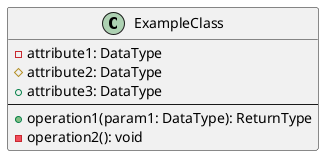

<!-- filepath: /Users/s-a-c/nc/PhpstormProjects/ela-docs/docs/E_L_A/070-interactive-tutorials/005-understanding-prd-class-diagram.md -->
# Interactive Tutorial: Understanding the PRD Class Diagram

**Version:** 0.2.0 <!-- Updated version -->
**Date:** 2025-05-21
**Author:** GitHub Copilot
**Status:** Draft
**Progress:** 95% <!-- Updated progress -->

---

Table of Contents

- [Interactive Tutorial: Understanding the PRD Class Diagram](#interactive-tutorial-understanding-the-prd-class-diagram)
  - [1. Introduction](#1-introduction)
    - [1.1. Learning Objectives](#11-learning-objectives)
    - [1.2. Prerequisites](#12-prerequisites)
    - [1.3. Estimated Time](#13-estimated-time)
  - [2. Step-by-Step Guidance](#2-step-by-step-guidance)
    - [2.1. What is a Class Diagram? (Brief Overview)](#21-what-is-a-class-diagram-brief-overview)
    - [2.2. Locating the E\_L\_A PRD Class Diagram](#22-locating-the-e_l_a-prd-class-diagram)
    - [2.3. Key Elements in the Diagram](#23-key-elements-in-the-diagram)
    - [2.4. Understanding Relationships](#24-understanding-relationships)
  - [3. Interactive Elements (Placeholder)](#3-interactive-elements-placeholder)
    - [3.1. Element Explorer (Placeholder)](#31-element-explorer-placeholder)
  - [4. Revision Summary](#4-revision-summary)
  - [5. Exercises](#5-exercises)
    - [5.1. Exercise 1](#51-exercise-1)
    - [5.2. Exercise 2](#52-exercise-2)
    - [5.3. Exercise 3](#53-exercise-3)
    - [5.4. Exercise 4](#54-exercise-4)
    - [5.5. Exercise 5](#55-exercise-5)
  - [6. Assessment/Checks (Placeholder)](#6-assessmentchecks-placeholder)
  - [7. Overall Summary \& Next Steps](#7-overall-summary--next-steps)
  - [8. Related Documents](#8-related-documents)
  - [9. Version History](#9-version-history)
- [1. Understanding the PRD Class Diagram](#1-understanding-the-prd-class-diagram)
  - [1.1. Introduction to Class Diagrams](#11-introduction-to-class-diagrams)
  - [1.2. Key Classes](#12-key-classes)
    - [1.2.1. The `User` Class](#121-the-user-class)
    - [1.2.2. The `Project` Class](#122-the-project-class)
  - [1.3. Relationships Between Classes](#13-relationships-between-classes)
    - [1.3.1. `User` and `Team` Relationship](#131-user-and-team-relationship)
  - [1.4. Conclusion](#14-conclusion)

---

## 1. Introduction

<h4 style="margin-top: 0; color: #005a9c;">Welcome!</h4>

This interactive tutorial will guide you through understanding the E_L_A Product Requirements Document (PRD) Class Diagram. By the end, you\'ll be able to interpret its key components and relationships.

### 1.1. Learning Objectives

Upon completing this tutorial, you will be able to:

- Identify the main purpose of the PRD Class Diagram.
- Recognize common class diagram notations used.
- Understand the key classes and their attributes/methods depicted.
- Interpret the relationships (e.g., association, aggregation) between classes.

### 1.2. Prerequisites

The following are recommended before starting:

- Basic understanding of what a Product Requirements Document (PRD) is.
- Familiarity with the E_L_A documentation suite is helpful but not strictly required.
- Access to the E_L_A PRD Class Diagram file (e.g., [`docs/E_L_A/010-010-ela-prd-class.puml`](../010-010-ela-prd-class.puml)).

### 1.3. Estimated Time

- **Tutorial Content:** 30-45 minutes
- **Interactive Exercises:** 15-20 minutes

---

## 2. Step-by-Step Guidance

<h4 style="margin-top: 0; color: #006400;">Let\'s Dive In!</h4>

We\'ll break down the PRD Class Diagram into manageable parts.

### 2.1. What is a Class Diagram? (Brief Overview)

A class diagram is a type of static structure diagram that describes the structure of a system by showing the system\'s classes, their attributes, operations (or methods), and the relationships among objects. It\'s a fundamental part of Unified Modeling Language (UML).

In simpler terms, think of it as a blueprint for a software system. It helps visualize the main components (classes) and how they connect and interact. For the E_L_A project, the PRD Class Diagram specifically maps out the core entities defined in the Product Requirements Document.

💡 **Quick Tip:** Class diagrams are like blueprints for software systems, showing the structure and relationships of different components (classes).

### 2.2. Locating the E_L_A PRD Class Diagram

The E_L_A PRD Class Diagram is located at the following path within this documentation project:

[`docs/E_L_A/010-010-ela-prd-class.puml`](../010-010-ela-prd-class.puml)

You can view this file using any PlantUML compatible viewer, many IDEs (like IntelliJ IDEA or VS Code with appropriate plugins), or online PlantUML renderers.

🔗 **Access the Diagram:** You can directly view the PlantUML source file here: <a href="../010-010-ela-prd-class.plantuml">E_L_A PRD Class Diagram</a>

*(For the purpose of this tutorial, we will show snippets and explain parts of it. It\'s highly recommended to have the full diagram open separately for reference.)*

### 2.3. Key Elements in the Diagram

Class diagrams have a few core components you\'ll see repeatedly.

A **Class** is typically represented as a rectangle, often divided into three compartments:

1. **Name:** The name of the class (e.g., `User`, `Project`, `Order`). This is usually at the top.
2. **Attributes:** Characteristics or properties of the class (e.g., `userId: String`, `productName: String`, `orderDate: Date`). These are listed below the name.
3. **Methods/Operations:** Actions the class can perform or that can be performed on it (e.g., `authenticate(): boolean`, `getPrice(): Money`, `calculateTotal(): Money`). These are listed in the bottom compartment.

**Example (Generic Structure):**

🔍 **Focus Point:** When you open the E_L_A PRD Class Diagram (<a href="../010-010-ela-prd-class.puml">`docs/E_L_A/010-010-ela-prd-class.puml`</a>), try to identify these three compartments for a few classes. Notice the visibility markers too (`+` for public, `-` for private, `#` for protected).

Let's look at a few key classes from the E_L_A PRD diagram:

1. **`USER` Class:**
   - **Purpose:** Represents users within the application.
   - **Key Attributes (Examples):** `+id`, `+snowflake_id`, `+slug`, `+email`, `+status`.
   - **Note:** While methods aren't explicitly detailed in this diagram's attribute list, a `USER` model in Laravel would typically have methods like `posts()` (to get their posts), `isActive()`, etc.

2. **`POST` Class:**
   - **Purpose:** Represents articles, blog posts, or other primary content entities.
   - **Key Attributes (Examples):** `+id`, `+user_id` (linking to the author), `+title`, `+slug`, `+content`, `+status`.

3. **`TEAM` Class:**
   - **Purpose:** Represents teams or groups of users, potentially in a hierarchical structure.
   - **Key Attributes (Examples):** `+id`, `+name`, `+slug`, `+parent_id` (for hierarchy), `+status`.

*(You'll find many other classes like `CATEGORY`, `TODO`, `MESSAGE`, `ROLE`, etc. Explore them in the diagram!)*

### 2.4. Understanding Relationships

Classes don't exist in isolation; they relate to each other. Here are some common relationship types you'll find in class diagrams, including the E_L_A PRD Class Diagram:

- **Association:**
  - Represents a general relationship between classes. It shows that instances of one class are connected to instances of another.
  - Example: A `Customer` *places* an `Order`.
  - Indicated by a solid line between classes. Multiplicity (e.g., 1, *, 0..1) can be shown at either end.

- **Aggregation:**
  - A special type of association representing a "has-a" or "part-of" relationship. It signifies a whole-part connection where the part can exist independently of the whole.
  - Example: A `Department` *has* `Employees` (an Employee can exist without being in that specific Department, or could move to another).
  - Indicated by a solid line with an open (unfilled) diamond at the "whole" class's end.

- **Composition:**
  - A stronger form of aggregation, also a "has-a" relationship. Here, the "part" cannot exist independently of the "whole." If the whole is destroyed, the parts are too.
  - Example: A `House` *is composed of* `Rooms` (if the House is demolished, the Rooms cease to exist as part of that House).
  - Indicated by a solid line with a filled diamond at the "whole" class's end.

- **Inheritance (Generalization/Specialization):**
  - An "is-a" relationship. One class (the subclass or child) inherits properties and methods from another class (the superclass or parent).
  - Example: A `Car` *is a* `Vehicle`. A `SavingsAccount` *is an* `Account`.
  - Indicated by a solid line with a hollow (unfilled) triangle arrowhead pointing from the subclass to the superclass.

🤝 **Relationship Tip:** Pay close attention to the arrowheads, diamonds, and line styles in the diagram. They are crucial for understanding how classes are connected and interact!

Let's examine some specific relationships from the E_L_A PRD Class Diagram:

- **Association (One-to-Many):**
  - **Example:** `USER "1" --o "*" POST : authors`
  - **Explanation:** This line indicates that one `USER` can be associated with zero or more (`*`) `POST` records. The label "authors" clarifies the nature of this relationship: a user authors posts. The `o` on the `POST` side often suggests that the `POST` is a "child" in this relationship or part of a collection owned by the `USER`. A `POST` is typically authored by a single `USER`.

- **Aggregation (Hierarchical):**
  - **Example:** `TEAM "1" --o "*" TEAM : parentOf`
  - **Explanation:** This is a self-referencing relationship on the `TEAM` class, indicating a hierarchy. One `TEAM` (the parent) can have zero or more (`*`) sub-`TEAM`s (children). The `o` on the "many" side (child team) suggests aggregation – the child team is part of the parent, but could potentially exist independently or be reassigned.
  - **Another Example:** `CATEGORY "1" --o "*" CATEGORY : parentOf` shows a similar hierarchical structure for categories.

- **Many-to-Many Association (via Pivot):**
  - **Example:** `POST "*" -- "*" CATEGORY : categorizables (Pivot)`
  - **Explanation:** A `POST` can belong to multiple `CATEGORY`s, and a `CATEGORY` can contain multiple `POST`s. This is a many-to-many relationship. The note "(Pivot)" suggests this is implemented using an intermediate table (often called a pivot table, which might be named `categorizables` or similar, like `category_post`).
  - **Explicit Pivot Example:** The diagram also shows `TAGS` and `TAGGABLES` classes. `POST "*" -- "*" TAGS : taggables (Pivot)` implies `TAGGABLES` is the pivot table connecting `POSTS` and `TAGS`. The `TAGGABLES` class itself has `tag_id`, `taggable_type`, and `taggable_id`, which are characteristic fields of a polymorphic pivot table in Laravel.

*(Explore the diagram to find other relationships, such as those involving `TODO` items, `MESSAGE`s, `ROLE`s, and `MEDIA`.)*

---

## 3. Interactive Elements (Placeholder)

<h4 style="margin-top: 0; color: #b8860b;">Get Ready to Interact!</h4>

This section is where the magic happens! (Or will, eventually). For now, imagine interactive components that let you explore the diagram elements directly. The actual interactive components will be implemented based on the chosen technology stack (see <a href="./060-interactive-tutorial-framework.md#23-technology-stack-proposed">Interactive Tutorial Framework</a>).

### 3.1. Element Explorer (Placeholder)

*(Placeholder for a future interactive element, e.g., clicking parts of an embedded diagram to get more information, as described in the source document [`070-understanding-the-prd-class-diagram.md`](../070-understanding-the-prd-class-diagram.md#) section 1.3.1.)*

**Concept:**

Imagine an image of the E_L_A PRD Class Diagram is displayed below. You would be able to:

- Click on a class name to see its detailed description, attributes, and methods highlighted or displayed in a side panel.
- Hover over a relationship line to get an explanation of that relationship type and the classes it connects.
- Filter the diagram to show only specific classes or relationships.

✨ **Interactive Idea:** Imagine clicking on a class in the diagram below to see its description and relationships highlight! (For the pilot, we\'ll describe this manually, as we are doing now).

*(Further interactive elements like quizzes on identifying components, drag-and-drop matching of terms to definitions, etc., can be designed based on section 2.2.3 of the framework.)*

---

## 4. Revision Summary

<h4 style="margin-top: 0; color: #555;">Quick Recap</h4>

Let\'s quickly go over what we\'ve learned so far before you tackle the exercises:

- **Class Diagrams:** Visual blueprints of a system, showing classes, their structure (attributes, methods), and how they relate to each other.
- **E_L_A PRD Class Diagram Location:** Found at <a href="../010-010-ela-prd-class.puml">`docs/E_L_A/010-010-ela-prd-class.puml`</a>.
- **Key Class Components in E_L_A Diagram:**
    - **Name:** Identifies the class (e.g., `USER`, `POST`, `TEAM`).
    - **Attributes:** Properties of the class (e.g., `USER` has `email`, `POST` has `title`).
    - **Methods/Operations:** (Implied, not explicitly listed in diagram attributes but standard for Laravel models).
- **Common Relationships Seen in E_L_A Diagram:**
    - **Association (One-to-Many):** e.g., A `USER` authors many `POST`s.
    - **Aggregation (Hierarchical):** e.g., A `TEAM` can have sub-`TEAM`s.
    - **Many-to-Many (via Pivot):** e.g., `POST`s can have many `CATEGORY`s (and vice-versa).
- **Importance of Notation:** Line styles (`--o`, `--`), multiplicity (`"1"`, `"*"`), and labels are crucial for interpreting relationships correctly.

*(This summary has been updated to reflect the specific examples discussed from the E_L_A PRD Class Diagram.)*

---

## 5. Exercises

<h4 style="margin-top: 0; color: #008080;">Practice Time!</h4>

Apply what you've learned with these exercises. Sample answers will be provided in a collapsible section or a linked companion document: `006-understanding-prd-class-diagram-answers.md` (to be created in this folder).

*(Exercises will be based on the actual E_L_A PRD Class Diagram content. The following have been updated and new ones added.)*

### 5.1. Exercise 1

**Task:** Open the [`docs/E_L_A/010-010-ela-prd-class.puml`](../010-010-ela-prd-class.puml) diagram. Identify the `USER`, `POST`, and `COMMENT` classes. For each of these three classes:
  a. List two attributes shown in the diagram.
  b. Briefly describe the likely purpose of the class in the E_L_A system.

### 5.2. Exercise 2

**Task:** Find the relationship `TEAM "1" --o "*" CATEGORY : hasCategories` in the E_L_A PRD Class Diagram.
  a. What type of relationship does this primarily represent (Association, Aggregation, Composition)? Explain your reasoning based on the notation and context.
  b. What does the multiplicity `"1"` and `"*"` signify in this specific relationship?

### 5.3. Exercise 3

**Task:** What is the purpose of the `CONVERSATION` and `MESSAGE` classes in the E_L_A PRD Class Diagram? How are they related? Describe the relationship line connecting them (e.g., `CONVERSATION "1" --o "*" MESSAGE : hasMessages`).

### 5.4. Exercise 4

**Task:** Look at the `ROLE` and `PERMISSION` classes.
  a. How are they related according to the diagram (e.g., `ROLE "*" -- "*" PERMISSION : role_has_permissions (Pivot)`)?
  b. What does "(Pivot)" likely mean in this context?
  c. Why is this type of relationship useful for managing user permissions?

### 5.5. Exercise 5

**Task:** The diagram shows a `MEDIA` class and mentions it in relationships like `USER "1" -- "*" MEDIA : hasAvatar (Polymorphic)` and `POST "*" -- "*" MEDIA : hasMedia (Polymorphic)`.
  a. What does "(Polymorphic)" suggest about how the `MEDIA` class is used?
  b. List at least two attributes you see in the `MEDIA` class definition.
  c. Why would a system use a polymorphic relationship for media assets?

🔗 **Answers:** Sample answers will be available in <a href="./006-understanding-prd-class-diagram-answers.md">`006-understanding-prd-class-diagram-answers.md`</a>.

---

## 6. Assessment/Checks (Placeholder)

<h4 style="margin-top: 0; color: #c71585;">Test Your Knowledge</h4>

A short quiz to check your understanding. (Actual interactive quiz to be implemented later, as per the framework \`060-interactive-tutorial-framework.md\` section 2.2.6. For now, here are some sample questions based on \`070-understanding-the-prd-class-diagram.md\` section 1.6.)

**Quick Check:**

1. What does UML stand for?
   (a) Universal Modeling Language
   (b) Unified Modeling Language
   (c) Unique Model Language

2. Which symbol represents an aggregation relationship in a class diagram?
   (a) Filled diamond
   (b) Open diamond
   (c) Triangle

3. In the E_L_A PRD diagram, what does `USER "1" --o "*" POST : authors` signify?
   (a) One user authors exactly one post.
   (b) Many users can author one post.
   (c) One user can author many posts.

4. What does the `(Pivot)` notation next to a relationship like `ROLE "*" -- "*" PERMISSION : role_has_permissions (Pivot)` usually indicate?
   (a) The relationship is of high importance.
   (b) The relationship is implemented using an intermediate table.
   (c) The relationship is a one-to-one mapping.

🔗 **Answers:** Check your answers in <a href="./006-understanding-prd-class-diagram-answers.md#2-assessmentchecks-answers">`006-understanding-prd-class-diagram-answers.md#2-assessmentchecks-answers`</a>.

---

## 7. Overall Summary & Next Steps

<h4 style="margin-top: 0; color: #005a9c;">Congratulations & What\'s Next?</h4>

You\'ve made it through the basics of understanding the E_L_A PRD Class Diagram! Let\'s recap and see where to go from here.

**Summary of Learnings:**

- You can now identify the core purpose of a class diagram and its main components (classes, attributes, methods).
- You are familiar with the location and basic structure of the E_L_A PRD Class Diagram (<a href="../010-010-ela-prd-class.puml">`docs/E_L_A/010-010-ela-prd-class.puml`</a>).
- You can recognize and interpret key classes like `USER`, `POST`, `TEAM`, `CATEGORY`, `CONVERSATION`, `MESSAGE`, `ROLE`, `PERMISSION`, and `MEDIA` from the diagram.
- You understand common relationship types (association, aggregation, composition, inheritance) and can identify examples like one-to-many, many-to-many (with pivot tables), and polymorphic relationships within the E_L_A diagram.
- You appreciate the importance of notation (lines, arrows, diamonds, multiplicity) in conveying precise meaning.

**Next Steps:**

1. **Revisit the Diagram:** Spend more time with the full <a href="../010-010-ela-prd-class.puml">`docs/E_L_A/010-010-ela-prd-class.puml`</a> diagram. Try to explain other classes and relationships to yourself.
2. **Explore Related Documentation:** Look into other documents in the `docs/E_L_A/` folder that might reference these classes or provide more context on the E_L_A system\'s architecture and data model.
3. **Consider the "Why":** For each class and relationship, think about *why* it might be designed that way. What problem does it solve? How does it contribute to the overall functionality of an "Enhanced Laravel Application"?
4. **Look for Patterns:** Notice how similar patterns are used for different entities (e.g., hierarchical relationships in `TEAM` and `CATEGORY`, polymorphic relationships for `MEDIA` and `COMMENTS`).
5. **Prepare for Deeper Dives:** This tutorial is a foundational overview. Future documentation or tutorials might delve into specific modules or functionalities that build upon this class structure.

💡 **Keep Exploring:** The more you engage with the diagram and related materials, the clearer the E_L_A system\'s structure will become!

---

## 8. Related Documents

- [006-understanding-prd-class-diagram-answers.md](./006-understanding-prd-class-diagram-answers.md) - Answers to exercises and assessment checks.
- [`docs/E_L_A/010-010-ela-prd-class.puml`](../010-010-ela-prd-class.puml) - The E_L_A PRD Class Diagram source file.
- [../000-index.md](../000-index.md) - Index for the E_L_A documentation section.
- [060-interactive-tutorial-framework.md](./060-interactive-tutorial-framework.md) - The framework guiding the creation of these interactive tutorials.

---

## 9. Version History

| Version | Date       | Author         | Changes                                                                                                |
|---------|------------|----------------|--------------------------------------------------------------------------------------------------------|
| 0.2.0   | 2025-05-21 | GitHub Copilot | Populated Sections 2.3, 2.4, 4, 5. Added Sections 7, 8, 9. Updated exercises and assessment. Progress to 95%. |
| 0.1.0   | 2025-05-21 | GitHub Copilot | Initial draft structure based on framework. Populated sections 1, 2.1, 2.2. Progress 45%.                |

---

<link rel="stylesheet" href="../assets/interactive-tutorial.css">

# 1. Understanding the PRD Class Diagram

This tutorial will guide you through understanding the preliminary class diagram derived from the Project Requirements Document (PRD) for the Enhanced Laravel Application (ELA).

## 1.1. Introduction to Class Diagrams

Class diagrams are a type of static structure diagram in UML (Unified Modeling Language). They describe the structure of a system by showing the system's classes, their attributes, operations (or methods), and the relationships among objects.

In the context of the E_L_A (Enhanced Laravel Application), the PRD Class Diagram provides a blueprint of the core entities involved in the application and how they interact with each other.

💡 **Tip:** Think of class diagrams as the architectural plans for a building, but for software. They help developers understand how different parts of the software system are structured and how they communicate.

## 1.2. Key Classes

Based on the PRD, we can identify several key classes that will form the backbone of our application.

### 1.2.1. The `User` Class

The `User` class is central to our application.

**Question 1:** What is the primary role of the `User` class in the ELA system?

  
Your answer:

  <textarea rows="3" style="width: 100%;" aria-label="Answer to Question 1"></textarea>
  <button class="check-answer-btn">Check Answer</button>
  

### 1.2.2. The `Project` Class

The `Project` class will manage project-specific data.

**Question 2:** Name two important attributes of the `Project` class as per standard software design, even if not explicitly detailed in a minimal PRD.

  
Your answer (list two attributes, comma-separated):

  <input type="text" style="width: 100%;" aria-label="Answer to Question 2">
  <button class="check-answer-btn">Check Answer</button>
  

## 1.3. Relationships Between Classes

Understanding the relationships between classes is crucial for a good application design.

### 1.3.1. `User` and `Team` Relationship

Consider how users and teams interact.

**Question 3:** What kind of relationship typically exists between a `User` class and a `Team` class in a system where a user can belong to multiple teams, and a team can have multiple users?

  
Your answer:

  <input type="text" style="width: 100%;" aria-label="Answer to Question 3">
  <button class="check-answer-btn">Check Answer</button>
  

## 1.4. Conclusion

You've now been introduced to some of the key classes and relationships in the E_L_A PRD Class Diagram. Understanding these fundamentals will aid you in navigating and comprehending the detailed aspects of the diagram as you progress through this tutorial.
