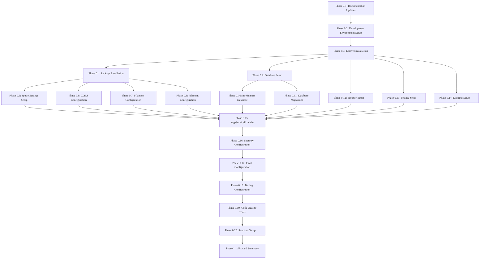
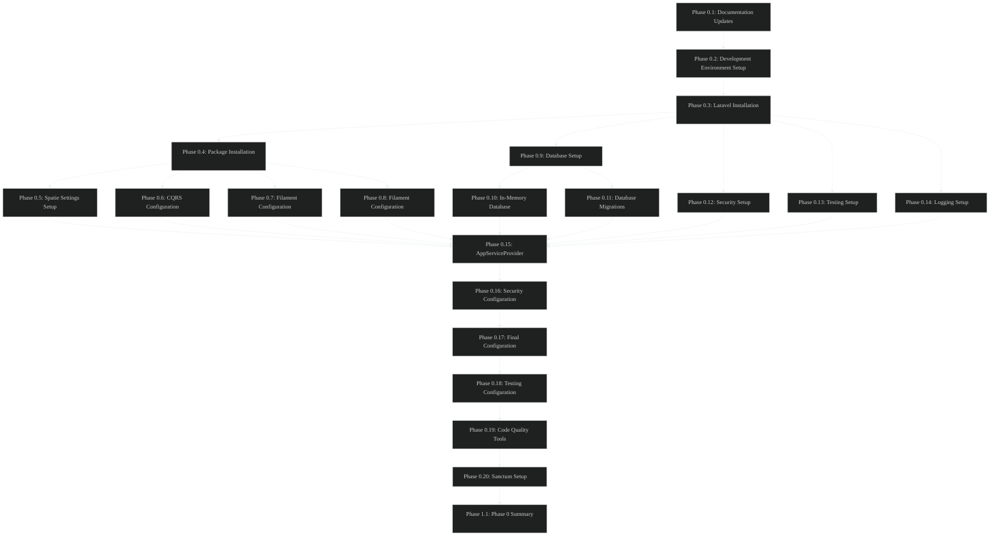

# Phase 0: Implementation Plan Overview

**Version:** 2.0.0
**Date:** 2025-05-20
**Author:** AI Assistant
**Status:** Updated
**Progress:** 100%

---

### Navigation

**Main:**
[Home](../README.md) |
[Documentation Index](../000-index.md) |
[Implementation Plan Index](000-index.md)

**You are here:**
[Home](../README.md) >
[Documentation Index](../000-index.md) >
[Implementation Plan Index](000-index.md) >
**Implementation Plan Overview**

Table of Contents

- [1. Overview](#1-overview)
- [2. Implementation Flowchart](#2-implementation-flowchart)
- [3. Implementation Phases](#3-implementation-phases)
- [4. Implementation Timeline](#4-implementation-timeline)
  - [4.1. Phase 0: Development Environment & Laravel Setup](#41-phase-0-development-environment--laravel-setup)
    - [4.1.1. Estimated Time Requirements](#411-estimated-time-requirements)
    - [4.1.2. Development Environment](#412-development-environment)
    - [4.1.3. Laravel Installation](#413-laravel-installation)
    - [4.1.4. Package Installation](#414-package-installation)
    - [4.1.5. Core Configuration](#415-core-configuration)
    - [4.1.6. Database Setup](#416-database-setup)
    - [4.1.7. Security Setup](#417-security-setup)
    - [4.1.8. Testing & Logging](#418-testing--logging)
    - [4.1.9. Final Configuration](#419-final-configuration)
  - [4.2. Phase 1: Core Infrastructure](#42-phase-1-core-infrastructure)
  - [4.3. Phase 2: Authentication & Authorization](#43-phase-2-authentication--authorization)
  - [4.4. Phase 3: Team & User Management](#44-phase-3-team--user-management)
  - [4.5. Phase 4: Content Management](#45-phase-4-content-management)
  - [4.6. Phase 5: Chat & Notifications](#46-phase-5-chat--notifications)
  - [4.7. Phase 6: Admin Portal](#47-phase-6-admin-portal)
  - [4.8. Phase 7: Public API](#48-phase-7-public-api)
  - [4.9. Phase 8: Advanced Features](#49-phase-8-advanced-features)
  - [4.10. Phase 9: Testing & Optimization](#410-phase-9-testing--optimization)
  - [4.11. Phase 10: Deployment](#411-phase-10-deployment)
- [5. Related Documents](#5-related-documents)
- [6. Version History](#6-version-history)

## 1. Overview

This implementation plan provides a detailed, step-by-step approach to building the Enhanced Laravel Application (ELA) as defined in the Product Requirements Document (PRD) and Technical Architecture Document (TAD). The plan is divided into phases, with each phase focusing on specific components of the application.

### Key Implementation Principles

- **Phased Approach**: Implementation is divided into logical phases to manage complexity
- **Dependency Management**: Each phase builds on the previous phases
- **Incremental Development**: Features are implemented incrementally to allow for testing and feedback
- **Quality Assurance**: Testing is integrated throughout the implementation process
- **Documentation**: Comprehensive documentation is maintained throughout the implementation

## 2. Implementation Flowchart

The following flowchart illustrates the implementation steps and their dependencies for Phase 0:

### Phase 0 Implementation Flowchart

Light Mode Flowchart

Dark Mode Flowchart

This flowchart shows the dependencies between different implementation steps for Phase 0. Follow the steps in the order shown to ensure a smooth implementation process.

For a complete flowchart showing all phases and their dependencies, see the [Implementation Sequence Flowchart](../illustrations/mermaid/light/implementation-sequence-light.mmd).

For detailed time estimates for each phase, see the [Implementation Timeline](010-overview/020-implementation-timeline.md).

## 3. Implementation Phases

### Implementation Phases Overview

The implementation is organized into the following phases:

1. **Phase 0: Development Environment & Laravel Setup**
   - Setting up the development environment
   - Installing Laravel and required packages
   - Configuring the base application

2. **Phase 1: Core Infrastructure**
   - Database schema implementation
   - CQRS pattern implementation
   - State machine implementation
   - Hierarchical data structure implementation

3. **Phase 2: Authentication & Authorization**
   - User authentication
   - Multi-factor authentication
   - Role-based access control
   - Team-based permissions

4. **Phase 3: Team & User Management**
   - Team CRUD operations
   - User CRUD operations
   - Team hierarchy implementation
   - User-team relationships

5. **Phase 4: Content Management**
   - Category management
   - Todo management
   - Blog post management
   - Media management
   - Tagging & comments
### Implementation Phases (Continued)

6. **Phase 5: Chat & Notifications**
   - Basic chat functionality
   - Advanced chat features
   - Notification system
   - Real-time updates

7. **Phase 6: Admin Portal**
   - Filament admin panel setup
   - Custom admin resources
   - Admin dashboards
   - Command history & snapshot UI

8. **Phase 7: Public API**
   - API authentication
   - RESTful endpoints
   - API documentation
   - Rate limiting

9. **Phase 8: Advanced Features**
   - Advanced reporting & analytics
   - Data purging mechanisms
   - Multilingual support
   - Feature flags

10. **Phase 9: Testing & Optimization**
    - Unit testing
    - Feature testing
    - Performance optimization
    - Security testing

11. **Phase 10: Deployment**
    - Production environment setup
    - CI/CD pipeline
    - Monitoring & logging
    - Backup & recovery

This document focuses on **Phase 0: Development Environment & Laravel Setup**, which lays the foundation for the entire application.

## 4. Implementation Timeline

### 4.1. Phase 0: Development Environment & Laravel Setup

### Phase 0 Overview

Phase 0 focuses on setting up the development environment and installing Laravel with all required packages. This phase is complete when all packages are installed and configured without changing any models or out-of-the-box database schema.

#### 4.1.1. Estimated Time Requirements

### Time Estimates

Table Details

| Task | Estimated Time |
| --- | --- |
| Documentation Updates | 1 hour |
| Development Environment Setup | 2 hours |
| Laravel Installation & Configuration | 1 hour |
| Package Installation & Configuration | 2 hours |
| Core Configuration (Settings, CQRS, Filament, Frontend) | 4 hours |
| Database Setup & Configuration | 3 hours |
| Security Setup | 2 hours |
| Testing & Logging Setup | 2 hours |
| Final Configuration & Verification | 3 hours |
| Total | 20 hours |

> **Note:** These time estimates assume familiarity with Laravel and the required packages. Actual time may vary based on experience level and environment setup.

### Detailed Implementation Steps

For detailed steps, see the following documents:

#### Development Environment
1. [Development Environment Setup](020-environment-setup/010-dev-environment-setup.md)

#### Laravel Installation
1. [Laravel Installation & Configuration](020-environment-setup/020-laravel-installation.md)

#### Package Installation
1. [Package Installation & Configuration](030-core-components/010-package-installation.md)

#### Core Configuration
1. [Spatie Settings Setup](030-core-components/020-spatie-settings-setup.md)
2. [CQRS and State Machine Configuration](030-core-components/030-cqrs-configuration.md)
3. [Filament Admin Panel Configuration](030-core-components/040-filament-configuration.md)

#### Database Setup
1. [Database Setup](040-database/010-database-setup.md)
2. [In-Memory Database Configuration](040-database/020-in-memory-database.md)
3. [Database Migrations Setup](040-database/030-database-migrations.md)

#### Security Setup
1. [Security Setup](050-security-testing/010-security-setup.md)

#### Testing & Logging
1. [Testing Environment Setup](050-security-testing/020-testing-setup.md)
2. [Logging and Monitoring Setup](050-security-testing/030-logging-setup.md)

#### Final Configuration
1. [Custom AppServiceProvider Configuration](060-configuration/010-app-service-provider.md)
2. [Security Configuration Details](050-security-testing/040-security-configuration.md)
3. [Final Configuration and Verification](060-configuration/020-final-configuration.md)
4. [Testing Configuration Details](060-configuration/030-testing-configuration.md)
5. [Code Quality Tools Configuration](060-configuration/040-code-quality-tools.md)
6. [Phase 0 Summary](070-phase-summaries/010-phase0-summary.md)
### 4.2. Phase 1: Core Infrastructure

### Phase 1 Overview

Phase 1 focuses on implementing the core infrastructure of the application, including the database schema, CQRS pattern, state machines, and hierarchical data structures.

For detailed steps, see the following documents:

1. [Laravel Sanctum Setup](060-configuration/050-sanctum-setup.md)
2. [SoftDeletes and User Tracking Implementation](090-model-features/010-softdeletes-usertracking.md)
3. [Event Sourcing Implementation](100-event-sourcing/050-implementation.md)
4. [Model Status Implementation](090-model-features/020-model-status-implementation.md)
5. [Status Implementation for Models](090-model-features/030-status-implementation.md)

### 4.3. Phase 2: Authentication & Authorization

### Phase 2 Overview

Phase 2 focuses on implementing authentication and authorization features, including user authentication, multi-factor authentication, role-based access control, and team-based permissions.

For detailed steps, see the [Implementation Timeline](010-overview/020-implementation-timeline.md) document.

### 4.4. Phase 3: Team & User Management

### Phase 3 Overview

Phase 3 focuses on implementing team and user management features, including team CRUD operations, user CRUD operations, team hierarchy implementation, and user-team relationships.

For detailed steps, see the [Implementation Timeline](010-overview/020-implementation-timeline.md) document.

### 4.5. Phase 4: Content Management

### Phase 4 Overview

Phase 4 focuses on implementing content management features, including category management, todo management, blog post management, media management, and tagging & comments.

For detailed steps, see the [Implementation Timeline](010-overview/020-implementation-timeline.md) document.

### 4.6. Phase 5: Chat & Notifications

### Phase 5 Overview

Phase 5 focuses on implementing chat and notification features, including basic chat functionality, advanced chat features, notification system, and real-time updates.

For detailed steps, see the [Implementation Timeline](010-overview/020-implementation-timeline.md) document.

### 4.7. Phase 6: Admin Portal

### Phase 6 Overview

Phase 6 focuses on implementing the admin portal, including Filament admin panel setup, custom admin resources, admin dashboards, and command history & snapshot UI.

For detailed steps, see the [Implementation Timeline](010-overview/020-implementation-timeline.md) document.

### 4.8. Phase 7: Public API

### Phase 7 Overview

Phase 7 focuses on implementing the public API, including API authentication, RESTful endpoints, API documentation, and rate limiting.

For detailed steps, see the [Implementation Timeline](010-overview/020-implementation-timeline.md) document.

### 4.9. Phase 8: Advanced Features

### Phase 8 Overview

Phase 8 focuses on implementing advanced features, including advanced reporting & analytics, data purging mechanisms, multilingual support, and feature flags.

For detailed steps, see the [Implementation Timeline](010-overview/020-implementation-timeline.md) document.

### 4.10. Phase 9: Testing & Optimization

### Phase 9 Overview

Phase 9 focuses on testing and optimization, including unit testing, feature testing, performance optimization, and security testing.

For detailed steps, see the [Implementation Timeline](010-overview/020-implementation-timeline.md) document.

### 4.11. Phase 10: Deployment

### Phase 10 Overview

Phase 10 focuses on deployment, including production environment setup, CI/CD pipeline, monitoring & logging, and backup & recovery.

For detailed steps, see the [Implementation Timeline](010-overview/020-implementation-timeline.md) document.

## 5. Related Documents

### Related Documentation

- [Implementation Timeline](010-overview/020-implementation-timeline.md) - Detailed timeline of the implementation process
- [Event Sourcing Guide](../event-sourcing-guide.md) - Detailed guide to event sourcing implementation
- [Event Catalog](../event-catalog.md) - Catalog of all events used in the application
- [Command Catalog](../command-catalog.md) - Catalog of all commands used in the application
- [Illustrations Index](../illustrations/index.md) - Index of all diagrams and illustrations

## 6. Version History

### Document History

Table Details

| Version | Date | Changes | Author |
| --- | --- | --- | --- |
| 2.0.0 | 2025-05-20 | Updated formatting for high contrast and accessibility, added navigation and version history | AI Assistant |
| 1.3.2 | 2025-05-17 | Added references to implementation sequence flowchart and timeline | AI Assistant |
| 1.3.1 | 2025-05-17 | Added navigation links | AI Assistant |
| 1.3.0 | 2025-05-17 | Added implementation flowchart and estimated time requirements | AI Assistant |
| 1.2.0 | 2025-05-17 | Standardized document title and metadata | AI Assistant |
| 1.1.0 | 2025-05-16 | Updated file references and links | AI Assistant |
| 1.0.0 | 2025-05-15 | Initial version | AI Assistant |

### Navigation Links

**Previous:** [Implementation Plan Index](000-index.md)

**Next:** [Documentation Updates](010-overview/030-documentation-updates.md)

---
