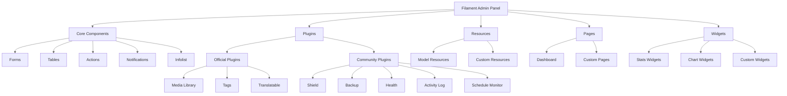
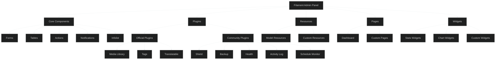
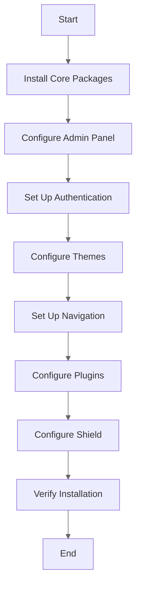
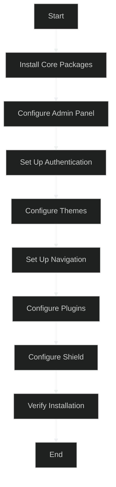

# Phase 0: Phase 0.7: Filament Admin Panel Configuration

**Version:** 1.3.0 **Date:** 2023-11-13 **Author:** AI Assistant **Status:** Updated **Progress:** Complete

---

<details>
<summary>Table of Contents</summary>

- [Overview](#overview)
  - [Filament Architecture](#filament-architecture)
- [Prerequisites](#prerequisites)
  - [Required Prior Steps](#required-prior-steps)
  - [Required Packages](#required-packages)
  - [Required Knowledge](#required-knowledge)
  - [Required Environment](#required-environment)
  - [Additional Required Packages](#additional-required-packages)
- [Estimated Time Requirements](#estimated-time-requirements)
- [Installation Process](#installation-process)
- [Step 1: Install Filament Core Packages](#step-1-install-filament-core-packages)
- [Step 2: Configure Filament Admin Panel](#step-2-configure-filament-admin-panel)
- [Step 3: Set Up Filament Authentication](#step-3-set-up-filament-authentication)
- [Step 4: Configure Filament Themes](#step-4-configure-filament-themes)
- [Step 5: Set Up Filament Navigation](#step-5-set-up-filament-navigation)
- [Step 6: Configure Filament Plugins](#step-6-configure-filament-plugins)
  - [Official Filament Plugins](#official-filament-plugins)
  - [Community Filament Plugins](#community-filament-plugins)
- [Step 7: Configure Filament Shield](#step-7-configure-filament-shield)
- [Step 8: Combining All Plugins in a Single Configuration](#step-8-combining-all-plugins-in-a-single-configuration)
- [Troubleshooting](#troubleshooting)
  - [Common Issues and Solutions](#common-issues-and-solutions)
- [Related Documents](#related-documents)
- [Version History](#version-history)
</details>

## Overview

This document provides detailed instructions for configuring the Filament Admin Panel in the Enhanced Laravel
Application (ELA). Filament is a collection of tools for rapidly building beautiful TALL stack (Tailwind, Alpine.js,
Laravel, and Livewire) applications.

### Filament Architecture

<details>
<summary>Light Mode Diagram</summary>


</details>

<details>
<summary>Dark Mode Diagram</summary>


</details>

> **Note:** All diagrams are available in both light and dark modes in the
> [illustrations folder](../../illustrations/README.md).

The diagram above illustrates the architecture of the Filament Admin Panel, showing the core components, plugins,
resources, pages, and widgets that make up the system.

## Prerequisites

Before starting, ensure you have:

### Required Prior Steps

- [Laravel Installation](020-environment-setup/020-laravel-installation.md) completed
- [Package Installation](030-core-components/010-package-installation.md) completed
- [CQRS Configuration](030-core-components/030-cqrs-configuration.md) completed

### Required Packages

- Filament Core (`filament/filament`)
- Filament Forms (`filament/forms`)
- Filament Tables (`filament/tables`)
- Filament Notifications (`filament/notifications`)
- Filament Actions (`filament/actions`)

> **Note on Package Versions:** This document uses Filament v3.3.x and related packages. Always verify the compatibility
> of package versions before installation. See the [Version Compatibility Matrix](100-620-version-compatibility.md)
> for more details.

### Required Knowledge

- Basic understanding of Laravel admin panels
- Familiarity with Livewire components
- Understanding of TALL stack (Tailwind, Alpine.js, Laravel, Livewire)
- Knowledge of PHP attributes and form building

### Required Environment

- PHP 8.2 or higher
- Laravel 12.x
- Database connection configured
- Node.js and npm/pnpm for asset compilation

## Estimated Time Requirements

| Task                           | Estimated Time  |
| ------------------------------ | --------------- |
| Install Filament Core Packages | 15 minutes      |
| Configure Filament Admin Panel | 20 minutes      |
| Set Up Filament Authentication | 15 minutes      |
| Configure Filament Resources   | 30 minutes      |
| Set Up Filament Pages          | 20 minutes      |
| Configure Filament Widgets     | 20 minutes      |
| Set Up Filament Navigation     | 15 minutes      |
| Configure Filament Themes      | 15 minutes      |
| Set Up Filament Plugins        | 30 minutes      |
| **Total**                      | **180 minutes** |

> **Note:** These time estimates assume familiarity with Laravel and Filament. Actual time may vary based on experience
> level and the complexity of your application.

### Additional Required Packages

- Filament Infolist (`filament/infolist`)
- Filament Widgets (`filament/widgets`)
- Filament Spatie Laravel Media Library Plugin (`filament/spatie-laravel-media-library-plugin`)
- Filament Spatie Laravel Tags Plugin (`filament/spatie-laravel-tags-plugin`)
- Filament Spatie Laravel Translatable Plugin (`filament/spatie-laravel-translatable-plugin`)
- Filament Shield (`bezhansalleh/filament-shield`)
- Filament Spatie Laravel Backup (`shuvroroy/filament-spatie-laravel-backup`)
- Filament Spatie Laravel Health (`shuvroroy/filament-spatie-laravel-health`)
- Filament Activity Log (`rmsramos/activitylog`)
- Filament Schedule Monitor (`mvenghaus/filament-plugin-schedule-monitor`)

## Installation Process

The following flowchart illustrates the process of installing and configuring Filament:

<details>
<summary>Light Mode Diagram</summary>


</details>

<details>
<summary>Dark Mode Diagram</summary>


</details>

> **Note:** All diagrams are available in both light and dark modes in the
> [illustrations folder](../../illustrations/README.md).

## Step 1: Install Filament Core Packages

The recommended way to install Filament is to use the official Artisan command:

```bash
php artisan filament:install --panels
```

This command will:

1. Install all required Filament packages:
   - `filament/filament`
   - `filament/forms`
   - `filament/tables`
   - `filament/notifications`
   - `filament/actions`
   - `filament/infolist`
   - `filament/widgets`

2. Publish the necessary configuration files

3. Create a default panel provider at `app/Providers/Filament/AdminPanelProvider.php`

4. Set up the basic panel structure

> **Note:** If you need to install Filament packages manually, you can use the following commands:
> 
> ```bash
> composer require filament/filament:"^3.3" \
>     filament/forms:"^3.3" \
>     filament/tables:"^3.3" \
>     filament/notifications:"^3.3" \
>     filament/actions:"^3.3" \
>     filament/infolist:"^3.3" \
>     filament/widgets:"^3.3"
> 
> php artisan vendor:publish --tag=filament-config
> ```
> 
> However, the official Artisan command is recommended as it ensures proper setup and configuration.

## Step 2: Configure Filament Admin Panel

When you run `php artisan filament:install --panels`, Filament automatically creates a panel provider at `app/Providers/Filament/AdminPanelProvider.php`. This provider contains the basic configuration for your admin panel.

### Understanding the Generated Panel Provider

The generated `AdminPanelProvider.php` file will look something like this:

```php
<?php

namespace App\Providers\Filament;

use Filament\Http\Middleware\Authenticate;
use Filament\Http\Middleware\DisableBladeIconComponents;
use Filament\Http\Middleware\DispatchServingFilamentEvent;
use Filament\Pages;
use Filament\Panel;
use Filament\PanelProvider;
use Filament\Support\Colors\Color;
use Filament\Widgets;
use Illuminate\Cookie\Middleware\AddQueuedCookiesToResponse;
use Illuminate\Cookie\Middleware\EncryptCookies;
use Illuminate\Foundation\Http\Middleware\VerifyCsrfToken;
use Illuminate\Routing\Middleware\SubstituteBindings;
use Illuminate\Session\Middleware\AuthenticateSession;
use Illuminate\Session\Middleware\StartSession;
use Illuminate\View\Middleware\ShareErrorsFromSession;

class AdminPanelProvider extends PanelProvider
{
    public function panel(Panel $panel): Panel
    {
        return $panel
            ->default()
            ->id('admin')
            ->path('admin')
            ->login()
            ->colors([
                'primary' => Color::Amber,
            ])
            ->discoverResources(in: app_path('Filament/Resources'), for: 'App\\Filament\\Resources')
            ->discoverPages(in: app_path('Filament/Pages'), for: 'App\\Filament\\Pages')
            ->pages([
                Pages\Dashboard::class,
            ])
            ->discoverWidgets(in: app_path('Filament/Widgets'), for: 'App\\Filament\\Widgets')
            ->widgets([
                Widgets\AccountWidget::class,
                Widgets\FilamentInfoWidget::class,
            ])
            ->middleware([
                EncryptCookies::class,
                AddQueuedCookiesToResponse::class,
                StartSession::class,
                AuthenticateSession::class,
                ShareErrorsFromSession::class,
                VerifyCsrfToken::class,
                SubstituteBindings::class,
                DisableBladeIconComponents::class,
                DispatchServingFilamentEvent::class,
            ])
            ->authMiddleware([
                Authenticate::class,
            ]);
    }
}
```

### Customizing the Panel Configuration

For the Enhanced Laravel Application (ELA), we'll customize the panel configuration to better suit our needs:

1. **Customized Directory Structure and Namespace**

   For better organization and to support multiple panels in the future, we'll modify the directory structure and namespace:

   ```php
   // In app/Providers/Filament/AdminPanelProvider.php
   return $panel
       // Other configuration...
       ->discoverResources(in: app_path('Filament/Admin/Resources'), for: 'App\\Filament\\Admin\\Resources')
       ->discoverPages(in: app_path('Filament/Admin/Pages'), for: 'App\\Filament\\Admin\\Pages')
       ->discoverWidgets(in: app_path('Filament/Admin/Widgets'), for: 'App\\Filament\\Admin\\Widgets')
       // Other configuration...
   ```

   Create the necessary directories:

   ```bash
   mkdir -p app/Filament/Admin/Resources
   mkdir -p app/Filament/Admin/Pages
   mkdir -p app/Filament/Admin/Widgets
   ```

2. **Customizing Colors**

   Customize the color scheme in the panel provider:

   ```php
   // In app/Providers/Filament/AdminPanelProvider.php
   return $panel
       // Other configuration...
       ->colors([
           'primary' => Color::Indigo,
           'secondary' => Color::Gray,
           'success' => Color::Emerald,
           'warning' => Color::Orange,
           'danger' => Color::Rose,
       ])
       // Other configuration...
   ```

3. **Additional Configuration**

   You can also configure additional settings in the `config/filament.php` file, which was published during installation:

   ```php
   // config/filament.php
   return [
       /*
       |--------------------------------------------------------------------------
       | Broadcasting
       |--------------------------------------------------------------------------
       |
       | By uncommenting the Laravel Echo configuration, you may connect Filament
       | to any Pusher-compatible websockets server.
       |
       | This will allow your users to receive real-time notifications.
       |
       */

       'broadcasting' => [
           'echo' => [
               'broadcaster' => 'reverb',
               'key' => env('REVERB_APP_KEY'),
               'wsHost' => env('REVERB_HOST', '127.0.0.1'),
               'wsPort' => env('REVERB_PORT', 8080),
               'wssPort' => env('REVERB_PORT', 8080),
               'forceTLS' => env('REVERB_SCHEME') === 'https',
               'enabledTransports' => ['ws', 'wss'],
               'disableStats' => true,
           ],
       ],

       /*
       |--------------------------------------------------------------------------
       | Default Filesystem Disk
       |--------------------------------------------------------------------------
       |
       | This is the storage disk Filament will use to put media. You may use any
       | of the disks defined in the `config/filesystems.php`.
       |
       */

       'default_filesystem_disk' => env('FILAMENT_FILESYSTEM_DISK', 'public'),

       /*
       |--------------------------------------------------------------------------
       | Assets Path
       |--------------------------------------------------------------------------
       |
       | This is the directory where Filament's assets will be published to. It
       | is relative to the `public` directory of your Laravel application.
       |
       | After changing the path, you should run `php artisan filament:assets`.
       |
       */

       'assets_path' => null,

       /*
       |--------------------------------------------------------------------------
       | Livewire Loading Delay
       |--------------------------------------------------------------------------
       |
       | This sets the delay before loading indicators appear.
       |
       | Setting this to 'none' makes indicators appear immediately, which can be
       | desirable for high-latency connections. Setting it to 'default' applies
       | Livewire's standard 200ms delay.
       |
       */

       'livewire_loading_delay' => 'default',
   ];
   ```

## Step 3: Set Up Filament Authentication

When you run `php artisan filament:install --panels`, Filament automatically sets up basic authentication with a login page. However, you'll need to configure your User model to work with Filament and create an admin user.

### Configure the User Model

1. Update your User model to implement the `FilamentUser` interface and add the `canAccessPanel` method:

   ```php
   <?php

   namespace App\Models;

   use Filament\Models\Contracts\FilamentUser;
   use Filament\Panel;
   use Illuminate\Database\Eloquent\Factories\HasFactory;
   use Illuminate\Foundation\Auth\User as Authenticatable;
   use Illuminate\Notifications\Notifiable;
   use Laravel\Sanctum\HasApiTokens;
   use Spatie\Permission\Traits\HasRoles;

   class User extends Authenticatable implements FilamentUser
   {
       use HasApiTokens, HasFactory, Notifiable, HasRoles;

       /**
        * The attributes that are mass assignable.
        *
        * @var array<int, string>
        */
       protected $fillable = [
           'name',
           'email',
           'password',
       ];

       /**
        * The attributes that should be hidden for serialization.
        *
        * @var array<int, string>
        */
       protected $hidden = [
           'password',
           'remember_token',
       ];

       /**
        * The attributes that should be cast.
        *
        * @var array<string, string>
        */
       protected $casts = [
           'email_verified_at' => 'datetime',
           'password' => 'hashed',
       ];

       /**
        * Determine if the user can access the Filament admin panel.
        *
        * @param Panel $panel
        * @return bool
        */
       public function canAccessPanel(Panel $panel): bool
       {
           // For basic setup, allow all users to access the panel
           // For production, use role-based access control:
           // return $this->hasRole('admin') || $this->hasPermissionTo('access_admin_panel');
           return true;
       }
   }
   ```

### Create an Admin User

For a more robust setup with role-based access control, you can create an admin user with the appropriate role and permissions:

1. Create a database seeder for the admin user:

   ```bash
   php artisan make:seeder AdminUserSeeder
   ```

2. Configure the admin user seeder in `database/seeders/AdminUserSeeder.php`:

   ```php
   <?php

   namespace Database\Seeders;

   use App\Models\User;
   use Illuminate\Database\Seeder;
   use Illuminate\Support\Facades\Hash;
   use Spatie\Permission\Models\Permission;
   use Spatie\Permission\Models\Role;

   class AdminUserSeeder extends Seeder
   {
       /**
        * Run the database seeds.
        */
       public function run(): void
       {
           // Create admin role
           $adminRole = Role::firstOrCreate(['name' => 'admin']);

           // Create access admin panel permission
           $permission = Permission::firstOrCreate(['name' => 'access_admin_panel']);

           // Assign permission to admin role
           $adminRole->givePermissionTo($permission);

           // Create admin user
           $user = User::firstOrCreate(
               ['email' => 'admin@example.com'],
               [
                   'name' => 'Admin User',
                   'password' => Hash::make('password'),
                   'email_verified_at' => now(),
               ]
           );

           // Assign admin role to user
           $user->assignRole($adminRole);
       }
   }
   ```

3. Update the database seeder in `database/seeders/DatabaseSeeder.php`:

   ```php
   <?php

   namespace Database\Seeders;

   use Illuminate\Database\Seeder;

   class DatabaseSeeder extends Seeder
   {
       /**
        * Seed the application's database.
        */
       public function run(): void
       {
           $this->call([
               AdminUserSeeder::class,
           ]);
       }
   }
   ```

4. Run the database seeder:
   ```bash
   php artisan db:seed
   ```

5. Update the `canAccessPanel` method in your User model to use role-based access control:

   ```php
   /**
    * Determine if the user can access the Filament admin panel.
    *
    * @param Panel $panel
    * @return bool
    */
   public function canAccessPanel(Panel $panel): bool
   {
       return $this->hasRole('admin') || $this->hasPermissionTo('access_admin_panel');
   }
   ```

### Customizing Authentication

You can customize the authentication behavior in the panel provider:

```php
// In app/Providers/Filament/AdminPanelProvider.php
return $panel
    // Other configuration...
    ->login()
    ->registration() // Enable registration if needed
    ->passwordReset() // Enable password reset if needed
    ->emailVerification() // Enable email verification if needed
    ->profile() // Enable user profile if needed
    // Other configuration...
```

## Step 4: Configure Filament Themes

When you run `php artisan filament:install --panels`, Filament automatically sets up the basic theme configuration. However, you can customize the theme to match your application's design.

### Default Theme Setup

The installation command:

1. Adds the required npm packages to your `package.json`:
   - `@tailwindcss/forms`
   - `@tailwindcss/typography`

2. Creates a Tailwind configuration file that includes Filament's preset:

   ```javascript
   // tailwind.config.js
   import preset from './vendor/filament/support/tailwind.config.preset';

   export default {
     presets: [preset],
     content: [
       './app/Filament/**/*.php',
       './resources/views/filament/**/*.blade.php',
       './vendor/filament/**/*.blade.php',
     ],
     theme: {
       extend: {},
     },
     plugins: [require('@tailwindcss/forms'), require('@tailwindcss/typography')],
   };
   ```

### Customizing the Theme

To customize the Filament theme:

1. Create a custom theme file in `resources/css/filament/admin/theme.css`:

   ```css
   @import '../../../../vendor/filament/filament/resources/css/theme.css';

   /* Custom styles */
   /* For example:
   .fi-sidebar {
       @apply bg-custom-900;
   }
   */
   ```

2. Update the Filament panel provider to use your custom theme:

   ```php
   // In app/Providers/Filament/AdminPanelProvider.php
   return $panel
       // Other configuration...
       ->viteTheme('resources/css/filament/admin/theme.css')
       // Other configuration...
   ```

3. Compile the assets:
   ```bash
   npm run dev
   ```

### Customizing Colors

You can customize the color scheme in the panel provider:

```php
// In app/Providers/Filament/AdminPanelProvider.php
return $panel
    // Other configuration...
    ->colors([
        'primary' => [
            50 => '#f0f9ff',
            100 => '#e0f2fe',
            200 => '#bae6fd',
            300 => '#7dd3fc',
            400 => '#38bdf8',
            500 => '#0ea5e9',
            600 => '#0284c7',
            700 => '#0369a1',
            800 => '#075985',
            900 => '#0c4a6e',
            950 => '#082f49',
        ],
        'danger' => Color::Rose,
        'gray' => Color::Slate,
        'info' => Color::Blue,
        'success' => Color::Emerald,
        'warning' => Color::Orange,
    ])
    // Other configuration...
```

Alternatively, you can use predefined colors:

```php
use Filament\Support\Colors\Color;

return $panel
    // Other configuration...
    ->colors([
        'primary' => Color::Indigo,
        'secondary' => Color::Gray,
        'success' => Color::Emerald,
        'warning' => Color::Orange,
        'danger' => Color::Rose,
    ])
    // Other configuration...
```

### Dark Mode

To enable dark mode support:

```php
// In app/Providers/Filament/AdminPanelProvider.php
return $panel
    // Other configuration...
    ->darkMode(true) // Enable dark mode
    // Other configuration...
```

## Step 5: Set Up Filament Navigation

When you run `php artisan filament:install --panels`, Filament automatically sets up a basic navigation structure. However, you can customize the navigation to better organize your admin panel.

### Default Navigation

By default, Filament will automatically add navigation items for all registered resources, pages, and custom items you define. Resources are grouped by their `$navigationGroup` property.

### Customizing Navigation

You can customize the navigation in the panel provider:

```php
// In app/Providers/Filament/AdminPanelProvider.php
use Filament\Navigation\NavigationBuilder;
use Filament\Navigation\NavigationGroup;
use Filament\Navigation\NavigationItem;
use App\Filament\Pages\Dashboard;

return $panel
    // Other configuration...
    ->navigation(function (NavigationBuilder $builder): NavigationBuilder {
        return $builder->groups([
            NavigationGroup::make('Dashboard')
                ->items([
                    NavigationItem::make('Dashboard')
                        ->icon('heroicon-o-home')
                        ->isActiveWhen(fn (): bool => request()->routeIs('filament.admin.pages.dashboard'))
                        ->url(fn (): string => Dashboard::getUrl()),
                ]),
            NavigationGroup::make('User Management')
                ->items([
                    // User management navigation items will be added here
                    // For example:
                    // NavigationItem::make('Users')
                    //     ->icon('heroicon-o-users')
                    //     ->isActiveWhen(fn (): bool => request()->routeIs('filament.admin.resources.users.*'))
                    //     ->url(fn (): string => UserResource::getUrl()),
                ]),
            NavigationGroup::make('Content Management')
                ->items([
                    // Content management navigation items will be added here
                ]),
            NavigationGroup::make('System')
                ->items([
                    // System navigation items will be added here
                ]),
        ]);
    })
    // Other configuration...
```

### Customizing the Dashboard

The dashboard is the default page that users see when they log in to the admin panel. You can customize it by creating a custom dashboard page:

1. Create a custom dashboard page for Filament in `app/Filament/Admin/Pages/Dashboard.php` with the updated namespace:

   ```php
   <?php

   namespace App\Filament\Admin\Pages;

   use Filament\Pages\Dashboard as BaseDashboard;

   class Dashboard extends BaseDashboard
   {
       protected static ?string $navigationIcon = 'heroicon-o-home';

       protected static string $view = 'filament.admin.pages.dashboard';

       protected function getHeaderWidgets(): array
       {
           return [
               // Dashboard widgets will be added here
           ];
       }

       protected function getFooterWidgets(): array
       {
           return [
               // Dashboard widgets will be added here
           ];
       }
   }
   ```

2. Create a custom dashboard view in `resources/views/filament/admin/pages/dashboard.blade.php`:

   ```blade
   <x-filament-panels::page>
       <x-filament::section>
           <div class="flex items-center justify-between">
               <div>
                   <h2 class="text-xl font-semibold tracking-tight">
                       Welcome to the Enhanced Laravel Application
                   </h2>

                   <p class="mt-1 text-sm text-gray-500 dark:text-gray-400">
                       This is the admin dashboard for the Enhanced Laravel Application.
                   </p>
               </div>
           </div>
       </x-filament::section>

       <x-filament-widgets::widgets
           :columns="$this->getColumns()"
           :widgets="$this->getHeaderWidgets()"
       />

       <x-filament-widgets::widgets
           :columns="$this->getColumns()"
           :widgets="$this->getFooterWidgets()"
       />
   </x-filament-panels::page>
   ```

3. Register the custom dashboard in the panel provider:

   ```php
   // In app/Providers/Filament/AdminPanelProvider.php
   use App\Filament\Admin\Pages\Dashboard;

   return $panel
       // Other configuration...
       ->pages([
           Dashboard::class,
       ])
       // Other configuration...
   ```

## Step 6: Configure Filament Plugins

Filament plugins extend the functionality of your admin panel. The `php artisan filament:install --panels` command doesn't install any plugins by default, so you'll need to install and configure them separately.

### Installing and Configuring Plugins

To use Filament plugins, you need to:

1. Install the plugin using Composer
2. Register the plugin in your panel provider

### Official Filament Plugins

#### Spatie Laravel Media Library Plugin

1. Install the plugin:

   ```bash
   composer require filament/spatie-laravel-media-library-plugin:"^3.3"
   ```

2. Configure the plugin in `app/Providers/Filament/AdminPanelProvider.php`:

   ```php
   use Filament\SpatieLaravelMediaLibraryPlugin;

   return $panel
       // Other configuration...
       ->plugin(
           SpatieLaravelMediaLibraryPlugin::make()
               ->registerNavigation(false)
       )
       // Other configuration...
   ```

#### Spatie Laravel Tags Plugin

1. Install the plugin:

   ```bash
   composer require filament/spatie-laravel-tags-plugin:"^3.3"
   ```

2. Configure the plugin in `app/Providers/Filament/AdminPanelProvider.php`:

   ```php
   use Filament\SpatieLaravelTagsPlugin;

   return $panel
       // Other configuration...
       ->plugin(
           SpatieLaravelTagsPlugin::make()
               ->registerNavigation(false)
       )
       // Other configuration...
   ```

#### Spatie Laravel Translatable Plugin

1. Install the plugin:

   ```bash
   composer require filament/spatie-laravel-translatable-plugin:"^3.3"
   ```

2. Configure the plugin in `app/Providers/Filament/AdminPanelProvider.php`:

   ```php
   use Filament\SpatieLaravelTranslatablePlugin;

   return $panel
       // Other configuration...
       ->plugin(
           SpatieLaravelTranslatablePlugin::make()
               ->registerNavigation(false)
       )
       // Other configuration...
   ```

### Community Filament Plugins

> **Important:** Each community plugin requires its base package to be installed and configured first. Make sure you've
> installed all the required Spatie packages as described in the
> [Package Installation & Configuration](030-core-components/010-package-installation.md) document.

#### Filament Shield (Role and Permission Management)

1. Install the plugin:

   ```bash
   composer require bezhansalleh/filament-shield:"^3.3"
   ```

2. Run the setup command:

   ```bash
   php artisan shield:setup
   php artisan shield:install admin
   ```

3. Configure the plugin in `app/Providers/Filament/AdminPanelProvider.php`:

   ```php
   use BezhanSalleh\FilamentShield\FilamentShieldPlugin;

   return $panel
       // Other configuration...
       ->plugin(
           FilamentShieldPlugin::make()
               ->gridColumns([
                   'default' => 1,
                   'sm' => 2,
                   'lg' => 3
               ])
               ->sectionColumnSpan(1)
               ->checkboxListColumns([
                   'default' => 1,
                   'sm' => 2,
                   'lg' => 4,
               ])
               ->resourceCheckboxListColumns([
                   'default' => 1,
                   'sm' => 2,
               ])
       )
       // Other configuration...
   ```

#### Filament Spatie Laravel Backup

1. Install the plugin:

   ```bash
   composer require shuvroroy/filament-spatie-laravel-backup:"^2.2"
   ```

2. Ensure you've installed and configured `spatie/laravel-backup` first:

   ```bash
   php artisan vendor:publish --provider="Spatie\Backup\BackupServiceProvider"
   ```

3. Configure the plugin in `app/Providers/Filament/AdminPanelProvider.php`:

   ```php
   use ShuvroRoy\FilamentSpatieLaravelBackup\FilamentSpatieLaravelBackupPlugin;

   return $panel
       // Other configuration...
       ->plugin(
           FilamentSpatieLaravelBackupPlugin::make()
       )
       // Other configuration...
   ```

#### Filament Spatie Laravel Health

1. Install the plugin:

   ```bash
   composer require shuvroroy/filament-spatie-laravel-health:"^2.3"
   ```

2. Ensure you've installed and configured `spatie/laravel-health` first:

   ```bash
   php artisan vendor:publish --provider="Spatie\Health\HealthServiceProvider"
   ```

3. Configure the plugin in `app/Providers/Filament/AdminPanelProvider.php`:

   ```php
   use ShuvroRoy\FilamentSpatieLaravelHealth\FilamentSpatieLaravelHealthPlugin;

   return $panel
       // Other configuration...
       ->plugin(
           FilamentSpatieLaravelHealthPlugin::make()
       )
       // Other configuration...
   ```

#### Filament Activity Log

1. Install the plugin:

   ```bash
   composer require rmsramos/activitylog:"^1.0"
   ```

2. Ensure you've installed and configured `spatie/laravel-activitylog` first:

   ```bash
   php artisan vendor:publish --provider="Spatie\Activitylog\ActivitylogServiceProvider"
   ```

3. Configure the plugin in `app/Providers/Filament/AdminPanelProvider.php`:

   ```php
   use RmsRamos\Activitylog\ActivitylogPlugin;

   return $panel
       // Other configuration...
       ->plugin(
           ActivitylogPlugin::make()
       )
       // Other configuration...
   ```

#### Filament Schedule Monitor

1. Install the plugin:

   ```bash
   composer require mvenghaus/filament-plugin-schedule-monitor:"^3.0"
   ```

2. Ensure you've installed and configured `spatie/laravel-schedule-monitor` first:

   ```bash
   php artisan vendor:publish --provider="Spatie\ScheduleMonitor\ScheduleMonitorServiceProvider"
   ```

3. Configure the plugin in `app/Providers/Filament/AdminPanelProvider.php`:

   ```php
   use Mvenghaus\FilamentPluginScheduleMonitor\FilamentPluginScheduleMonitorPlugin;

   return $panel
       // Other configuration...
       ->plugin(
           FilamentPluginScheduleMonitorPlugin::make()
       )
       // Other configuration...
   ```

## Troubleshooting

### Common Issues and Solutions

1. **Filament Assets Not Found**

   - Problem: Filament assets are not found when accessing the admin panel
   - Solution:
     - Ensure the assets are published: `php artisan filament:assets`
     - Check the `assets_path` configuration in `config/filament.php`
     - Verify that the assets are compiled: `npm run dev`

2. **Authentication Issues**

   - Problem: Cannot log in to the Filament admin panel
   - Solution:
     - Ensure the admin user is created and has the correct role
     - Check the `canAccessPanel` method in the User model
     - Verify that the authentication guard is configured correctly

3. **Navigation Issues**

   - Problem: Navigation items are not displayed correctly
   - Solution:
     - Check the navigation configuration in the panel provider
     - Ensure the navigation groups and items are defined correctly
     - Verify that the navigation URLs are correct

4. **Plugin Issues**
   - Problem: Plugins are not working correctly
   - Solution:
     - Ensure the plugins are installed and configured correctly
     - Check the plugin configuration in the panel provider
     - Verify that the plugin dependencies are installed

## Step 7: Configure Filament Shield

> **Important:** Filament Shield requires a specific sequence of setup steps. Make sure you've already run
> `php artisan shield:setup` and `php artisan shield:install admin` as described in the
> [Package Installation & Configuration](030-core-components/010-package-installation.md) document before proceeding with these
> configuration steps.

1. Ensure the auth provider model is configured in `config/filament-shield.php`:

   ```php
   'auth_provider_model' => [
       'fqcn' => 'App\Models\User',
   ],
   ```

2. Verify that the `HasRoles` trait is added to your User model:

   ```php
   <?php

   namespace App\Models;

   use Illuminate\Database\Eloquent\Factories\HasFactory;
   use Illuminate\Foundation\Auth\User as Authenticatable;
   use Illuminate\Notifications\Notifiable;
   use Laravel\Sanctum\HasApiTokens;
   use Spatie\Permission\Traits\HasRoles;

   class User extends Authenticatable
   {
       use HasApiTokens, HasFactory, Notifiable, HasRoles;

       // Rest of your model...
   }
   ```

3. Generate permissions and policies for all resources, pages, and widgets:

   ```bash
   php artisan shield:generate --all
   ```

4. Create a super admin user:

   ```bash
   php artisan shield:super-admin
   ```

5. Configure the Filament Shield plugin in `app/Providers/Filament/AdminPanelProvider.php`:

   ```php
   use BezhanSalleh\FilamentShield\FilamentShieldPlugin;

   public function panel(Panel $panel): Panel
   {
       return $panel
           // Other configuration...
           ->plugin(
               FilamentShieldPlugin::make()
                   ->gridColumns([
                       'default' => 1,
                       'sm' => 2,
                       'lg' => 3
                   ])
                   ->sectionColumnSpan(1)
                   ->checkboxListColumns([
                       'default' => 1,
                       'sm' => 2,
                       'lg' => 4,
                   ])
                   ->resourceCheckboxListColumns([
                       'default' => 1,
                       'sm' => 2,
                   ])
           )
           // Other configuration...
   }
   ```

6. Add a role selector to your User resource form:

   ```php
   use Filament\Forms;

   Forms\Components\Select::make('roles')
       ->relationship('roles', 'name')
       ->multiple()
       ->preload()
       ->searchable(),
   ```

   > **Reference:** [Filament Shield Documentation](https:/github.com/bezhanSalleh/filament-shield)

## Step 8: Creating and Configuring Filament Resources

Filament resources provide a way to manage your application's models through the admin panel. They include forms, tables, and actions for creating, reading, updating, and deleting records.

### Creating a Resource

1. Create a Filament resource for a model:

   ```bash
   php artisan make:filament-resource User --generate
   ```

   This command creates the following files:
   - `app/Filament/Resources/UserResource.php`
   - `app/Filament/Resources/UserResource/Pages/CreateUser.php`
   - `app/Filament/Resources/UserResource/Pages/EditUser.php`
   - `app/Filament/Resources/UserResource/Pages/ListUsers.php`

2. For the customized directory structure, use:

   ```bash
   php artisan make:filament-resource User --generate --panel=admin
   ```

   This creates the files in the `app/Filament/Admin/Resources` directory.

### Configuring a Resource

Here's an example of a configured User resource:

```php
<?php

namespace App\Filament\Admin\Resources;

use App\Filament\Admin\Resources\UserResource\Pages;
use App\Models\User;
use Filament\Forms;
use Filament\Forms\Form;
use Filament\Resources\Resource;
use Filament\Tables;
use Filament\Tables\Table;
use Illuminate\Database\Eloquent\Builder;
use Illuminate\Database\Eloquent\SoftDeletingScope;

class UserResource extends Resource
{
    protected static ?string $model = User::class;
    protected static ?string $navigationIcon = 'heroicon-o-users';
    protected static ?string $navigationGroup = 'User Management';
    protected static ?int $navigationSort = 1;

    public static function form(Form $form): Form
    {
        return $form
            ->schema([
                Forms\Components\Section::make('User Information')
                    ->schema([
                        Forms\Components\TextInput::make('name')
                            ->required()
                            ->maxLength(255),
                        Forms\Components\TextInput::make('email')
                            ->email()
                            ->required()
                            ->maxLength(255)
                            ->unique(ignoreRecord: true),
                        Forms\Components\DateTimePicker::make('email_verified_at'),
                        Forms\Components\TextInput::make('password')
                            ->password()
                            ->dehydrateStateUsing(fn ($state) => !empty($state) ? bcrypt($state) : null)
                            ->required(fn ($record) => !$record)
                            ->maxLength(255)
                            ->hiddenOn('edit'),
                    ])->columns(2),
                Forms\Components\Section::make('Roles & Permissions')
                    ->schema([
                        Forms\Components\Select::make('roles')
                            ->relationship('roles', 'name')
                            ->multiple()
                            ->preload()
                            ->searchable(),
                    ]),
            ]);
    }

    public static function table(Table $table): Table
    {
        return $table
            ->columns([
                Tables\Columns\TextColumn::make('name')
                    ->searchable(),
                Tables\Columns\TextColumn::make('email')
                    ->searchable(),
                Tables\Columns\TextColumn::make('email_verified_at')
                    ->dateTime()
                    ->sortable(),
                Tables\Columns\TextColumn::make('created_at')
                    ->dateTime()
                    ->sortable()
                    ->toggleable(isToggledHiddenByDefault: true),
                Tables\Columns\TextColumn::make('updated_at')
                    ->dateTime()
                    ->sortable()
                    ->toggleable(isToggledHiddenByDefault: true),
            ])
            ->filters([
                Tables\Filters\TrashedFilter::make(),
            ])
            ->actions([
                Tables\Actions\EditAction::make(),
                Tables\Actions\DeleteAction::make(),
                Tables\Actions\ForceDeleteAction::make(),
                Tables\Actions\RestoreAction::make(),
            ])
            ->bulkActions([
                Tables\Actions\BulkActionGroup::make([
                    Tables\Actions\DeleteBulkAction::make(),
                    Tables\Actions\ForceDeleteBulkAction::make(),
                    Tables\Actions\RestoreBulkAction::make(),
                ]),
            ]);
    }

    public static function getRelations(): array
    {
        return [
            //
        ];
    }

    public static function getPages(): array
    {
        return [
            'index' => Pages\ListUsers::route('/'),
            'create' => Pages\CreateUser::route('/create'),
            'edit' => Pages\EditUser::route('/{record}/edit'),
        ];
    }

    public static function getEloquentQuery(): Builder
    {
        return parent::getEloquentQuery()
            ->withoutGlobalScopes([
                SoftDeletingScope::class,
            ]);
    }
}
```

### Integrating with Event Sourcing

When integrating Filament resources with event sourcing, you'll need to dispatch commands instead of directly modifying models:

```php
use App\CQRS\Commands\Users\CreateUserCommand;
use App\CQRS\Commands\CommandBus;

// In your CreateUser page
public function create(array $data, CommandBus $commandBus): void
{
    $commandBus->dispatch(new CreateUserCommand(
        Str::uuid()->toString(),
        $data['name'],
        $data['email'],
        $data['password']
    ));

    $this->redirect(static::getResource()::getUrl('index'));
}
```

## Step 9: Integrating Filament with Frontend Components

Filament can be integrated with Livewire, Volt, and Flux components to create a seamless admin experience.

### Using Livewire Components in Filament

1. Create a Livewire component:

   ```bash
   php artisan make:livewire Admin/Dashboard/StatsOverview
   ```

2. Implement the component:

   ```php
   <?php

   namespace App\Livewire\Admin\Dashboard;

   use App\Models\User;
   use Livewire\Component;

   class StatsOverview extends Component
   {
       public function render()
       {
           $userCount = User::count();

           return view('livewire.admin.dashboard.stats-overview', [
               'userCount' => $userCount,
           ]);
       }
   }
   ```

3. Create the view:

   ```blade
   <div class="grid grid-cols-1 gap-4 sm:grid-cols-2 lg:grid-cols-3">
       <div class="bg-white overflow-hidden shadow rounded-lg">
           <div class="px-4 py-5 sm:p-6">
               <div class="flex items-center">
                   <div class="flex-shrink-0 bg-indigo-500 rounded-md p-3">
                       <svg class="h-6 w-6 text-white" fill="none" viewBox="0 0 24 24" stroke="currentColor">
                           <path stroke-linecap="round" stroke-linejoin="round" stroke-width="2" d="M12 4.354a4 4 0 110 5.292M15 21H3v-1a6 6 0 0112 0v1zm0 0h6v-1a6 6 0 00-9-5.197M13 7a4 4 0 11-8 0 4 4 0 018 0z" />
                       </svg>
                   </div>
                   <div class="ml-5 w-0 flex-1">
                       <dl>
                           <dt class="text-sm font-medium text-gray-500 truncate">
                               Total Users
                           </dt>
                           <dd class="flex items-baseline">
                               <div class="text-2xl font-semibold text-gray-900">
                                   {{ $userCount }}
                               </div>
                           </dd>
                       </dl>
                   </div>
               </div>
           </div>
       </div>
   </div>
   ```

4. Use the component in a Filament page:

   ```php
   <?php

   namespace App\Filament\Admin\Pages;

   use App\Livewire\Admin\Dashboard\StatsOverview;
   use Filament\Pages\Dashboard as BaseDashboard;

   class Dashboard extends BaseDashboard
   {
       protected function getHeaderWidgets(): array
       {
           return [
               // Other widgets...
           ];
       }

       protected function getFooterWidgets(): array
       {
           return [
               // Other widgets...
           ];
       }

       protected function getViewData(): array
       {
           return [
               'statsComponent' => StatsOverview::class,
           ];
       }
   }
   ```

5. Update the dashboard view:

   ```blade
   <x-filament-panels::page>
       <x-filament::section>
           <div class="flex items-center justify-between">
               <div>
                   <h2 class="text-xl font-semibold tracking-tight">
                       Welcome to the Enhanced Laravel Application
                   </h2>

                   <p class="mt-1 text-sm text-gray-500 dark:text-gray-400">
                       This is the admin dashboard for the Enhanced Laravel Application.
                   </p>
               </div>
           </div>
       </x-filament::section>

       <livewire:is :component="$statsComponent" />

       <x-filament-widgets::widgets
           :columns="$this->getColumns()"
           :widgets="$this->getHeaderWidgets()"
       />

       <x-filament-widgets::widgets
           :columns="$this->getColumns()"
           :widgets="$this->getFooterWidgets()"
       />
   </x-filament-panels::page>
   ```

### Using Volt Components in Filament

1. Create a Volt component:

   ```bash
   php artisan make:volt Admin/Dashboard/RecentActivity
   ```

2. Implement the component:

   ```php
   <?php

   use App\Models\User;
   use function Livewire\Volt\{state, computed};

   state([
       'limit' => 5,
   ]);

   $users = computed(function () {
       return User::latest()->limit($this->limit)->get();
   });

   ?>

   <div class="bg-white overflow-hidden shadow rounded-lg">
       <div class="px-4 py-5 sm:p-6">
           <h3 class="text-lg leading-6 font-medium text-gray-900">Recent Users</h3>
           <div class="mt-5">
               <ul class="divide-y divide-gray-200">
                   @foreach($this->users as $user)
                       <li class="py-4">
                           <div class="flex items-center space-x-4">
                               <div class="flex-1 min-w-0">
                                   <p class="text-sm font-medium text-gray-900 truncate">
                                       {{ $user->name }}
                                   </p>
                                   <p class="text-sm text-gray-500 truncate">
                                       {{ $user->email }}
                                   </p>
                               </div>
                               <div>
                                   <span class="text-sm text-gray-500">
                                       {{ $user->created_at->diffForHumans() }}
                                   </span>
                               </div>
                           </div>
                       </li>
                   @endforeach
               </ul>
           </div>
       </div>
   </div>
   ```

3. Use the component in a Filament page:

   ```php
   // In your dashboard view
   <livewire:volt.admin.dashboard.recent-activity />
   ```

### Using Flux Components in Filament

Flux provides UI components that can be used in Filament forms and pages:

```php
use Filament\Forms;

public static function form(Form $form): Form
{
    return $form
        ->schema([
            Forms\Components\Section::make('User Information')
                ->schema([
                    Forms\Components\TextInput::make('name')
                        ->required()
                        ->maxLength(255),
                    Forms\Components\TextInput::make('email')
                        ->email()
                        ->required()
                        ->maxLength(255),
                    // Other fields...
                ])
                ->columns(2),
        ]);
}
```

In your Blade views, you can use Flux components:

```blade
<x-flux-card>
    <x-flux-card-header>
        <x-flux-card-title>User Information</x-flux-card-title>
    </x-flux-card-header>

    <x-flux-card-content>
        <!-- Content here -->
    </x-flux-card-content>

    <x-flux-card-footer>
        <x-flux-button>Save</x-flux-button>
    </x-flux-card-footer>
</x-flux-card>
```

## Step 10: Combining All Plugins in a Single Configuration

> **Important:** Before using this combined configuration, ensure you have:

> 1. Installed all required base packages (Spatie packages)
> 2. Published their configurations
> 3. Run the necessary setup commands (especially `shield:setup` and `shield:install`)
> 4. Added the `HasRoles` trait to your User model

For better organization, you can combine all plugins in a single configuration in
`app/Providers/Filament/AdminPanelProvider.php`:

```php
<?php

namespace App\Providers\Filament;

use Filament\Http\Middleware\Authenticate;
use Filament\Http\Middleware\DisableBladeIconComponents;
use Filament\Http\Middleware\DispatchServingFilamentEvent;
use Filament\Pages;
use Filament\Panel;
use Filament\PanelProvider;
use Filament\Support\Colors\Color;
use Filament\Widgets;
use Illuminate\Cookie\Middleware\AddQueuedCookiesToResponse;
use Illuminate\Cookie\Middleware\EncryptCookies;
use Illuminate\Foundation\Http\Middleware\VerifyCsrfToken;
use Illuminate\Routing\Middleware\SubstituteBindings;
use Illuminate\Session\Middleware\AuthenticateSession;
use Illuminate\Session\Middleware\StartSession;
use Illuminate\View\Middleware\ShareErrorsFromSession;

// Official Filament plugins
use Filament\SpatieLaravelMediaLibraryPlugin;
use Filament\SpatieLaravelTagsPlugin;
use Filament\SpatieLaravelTranslatablePlugin;

// Community Filament plugins
use BezhanSalleh\FilamentShield\FilamentShieldPlugin;
use ShuvroRoy\FilamentSpatieLaravelBackup\FilamentSpatieLaravelBackupPlugin;
use ShuvroRoy\FilamentSpatieLaravelHealth\FilamentSpatieLaravelHealthPlugin;
use RmsRamos\Activitylog\ActivitylogPlugin;
use Mvenghaus\FilamentPluginScheduleMonitor\FilamentPluginScheduleMonitorPlugin;

class AdminPanelProvider extends PanelProvider
{
    public function panel(Panel $panel): Panel
    {
        return $panel
            ->default()
            ->id('admin')
            ->path('admin')
            ->login()
            ->colors([
                'primary' => Color::Indigo,
            ])
            ->discoverResources(in: app_path('Filament/Admin/Resources'), for: 'App\\Filament\\Admin\\Resources')
            ->discoverPages(in: app_path('Filament/Admin/Pages'), for: 'App\\Filament\\Admin\\Pages')
            ->pages([
                Pages\Dashboard::class,
            ])
            ->discoverWidgets(in: app_path('Filament/Admin/Widgets'), for: 'App\\Filament\\Admin\\Widgets')
            ->widgets([
                Widgets\AccountWidget::class,
                Widgets\FilamentInfoWidget::class,
            ])
            ->middleware([
                EncryptCookies::class,
                AddQueuedCookiesToResponse::class,
                StartSession::class,
                AuthenticateSession::class,
                ShareErrorsFromSession::class,
                VerifyCsrfToken::class,
                SubstituteBindings::class,
                DisableBladeIconComponents::class,
                DispatchServingFilamentEvent::class,
            ])
            ->authMiddleware([
                Authenticate::class,
            ])
            ->viteTheme('resources/css/filament/admin/theme.css')

            // Official Filament plugins
            ->plugin(
                SpatieLaravelMediaLibraryPlugin::make()
                    ->registerNavigation(false)
            )
            ->plugin(
                SpatieLaravelTagsPlugin::make()
                    ->registerNavigation(false)
            )
            ->plugin(
                SpatieLaravelTranslatablePlugin::make()
                    ->registerNavigation(false)
            )

            // Community Filament plugins
            ->plugin(
                FilamentShieldPlugin::make()
                    ->gridColumns([
                        'default' => 1,
                        'sm' => 2,
                        'lg' => 3
                    ])
                    ->sectionColumnSpan(1)
                    ->checkboxListColumns([
                        'default' => 1,
                        'sm' => 2,
                        'lg' => 4,
                    ])
                    ->resourceCheckboxListColumns([
                        'default' => 1,
                        'sm' => 2,
                    ])
            )
            ->plugin(
                FilamentSpatieLaravelBackupPlugin::make()
            )
            ->plugin(
                FilamentSpatieLaravelHealthPlugin::make()
            )
            ->plugin(
                ActivitylogPlugin::make()
            )
            ->plugin(
                FilamentPluginScheduleMonitorPlugin::make()
            );
    }
}
```

This approach makes it easier to manage all plugins in one place and ensures that they are properly configured.

## Related Documents

- [Package Installation](030-core-components/010-package-installation.md) - For installing required packages
- [CQRS Configuration](030-core-components/030-cqrs-configuration.md) - For implementing command patterns that can be used with Filament resources
- [Frontend Setup with Livewire, Volt, and Flux](030-core-components/060-frontend-setup.md) - For configuring the frontend components that interact with Filament
- [Database Setup](040-database/010-database-setup.md) - For configuring the database for your application
- [Final Configuration and Verification](060-configuration/020-final-configuration.md) - For verifying the complete setup including Filament
- [Troubleshooting Guide](100-710-troubleshooting-guide.md) - For more detailed troubleshooting steps

## Version History

| Version | Date | Changes | Author |
|---------|------|---------|--------|
| 1.0.0 | 2025-05-15 | Initial version | AI Assistant |
| 1.1.0 | 2025-05-16 | Updated file references and links | AI Assistant |
| 1.2.0 | 2025-05-17 | Standardized document title and metadata | AI Assistant |
| 1.3.0 | 2025-05-17 | Added standardized prerequisites, estimated time requirements, and version history | AI Assistant |
| 1.4.0 | 2025-05-20 | Added sections on creating Filament resources and integrating with frontend components | AI Assistant |

---

**Previous Step:** [CQRS Configuration](030-core-components/030-cqrs-configuration.md) | **Next Step:** [Sanctum Setup](060-configuration/050-sanctum-setup.md)
