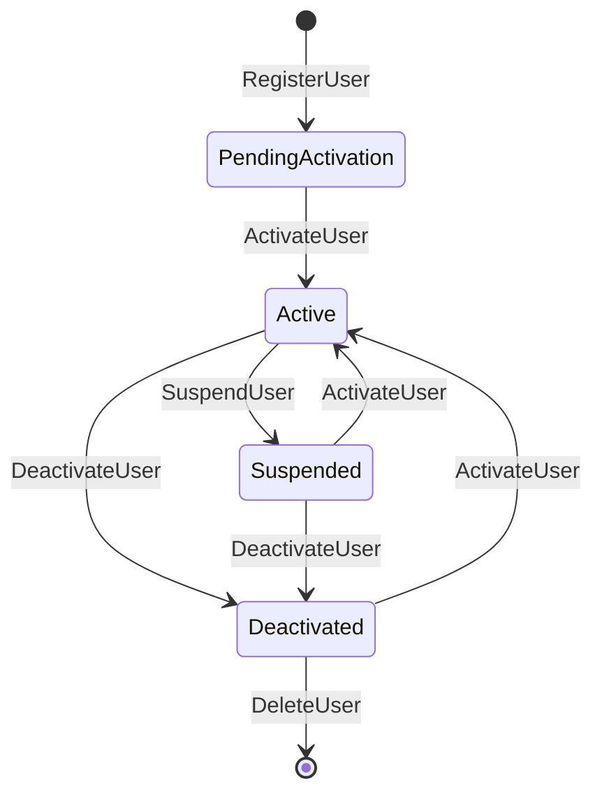
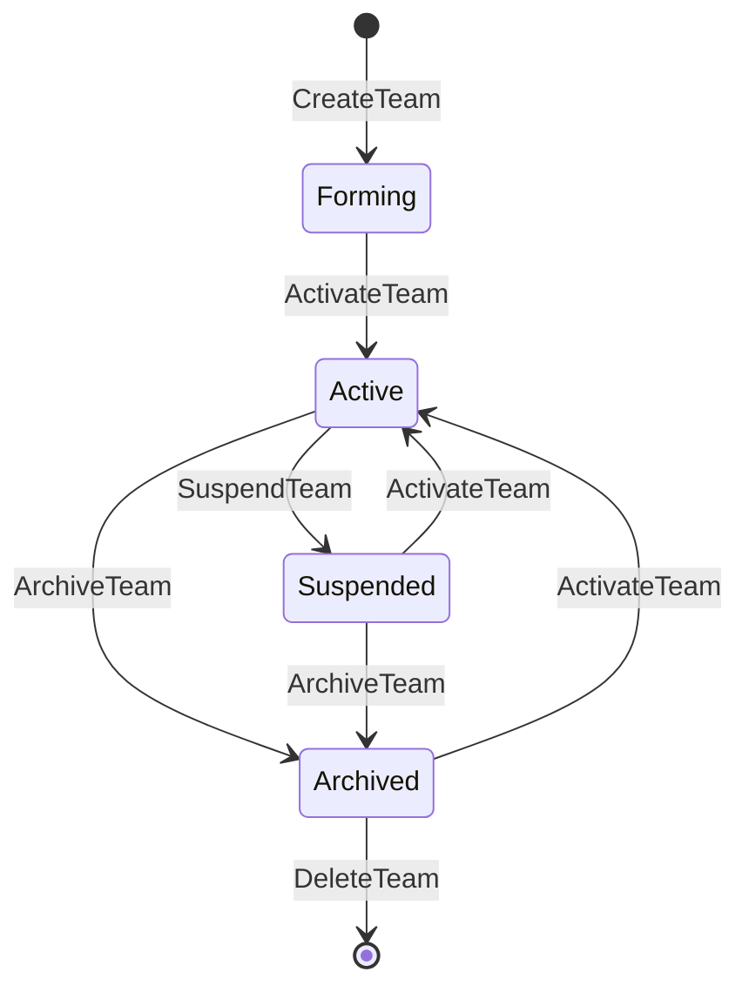
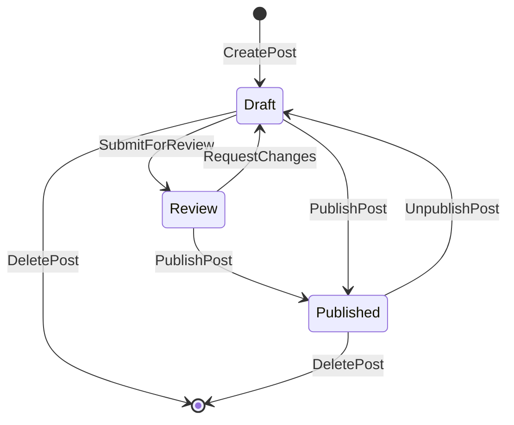
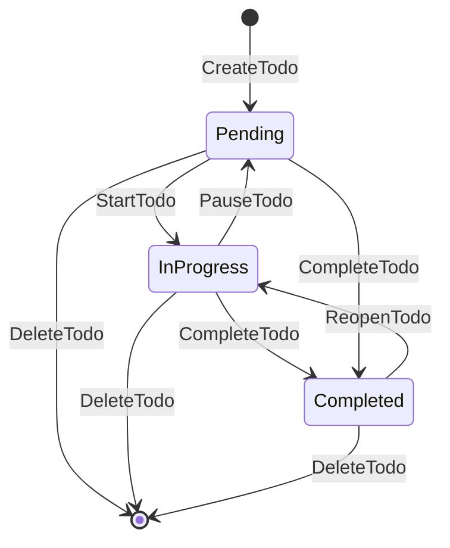

# State Transitions

**Version:** 1.0.0
**Date:** 2025-05-20
**Author:** AI Assistant
**Status:** New
**Progress:** Complete

---

<details>
<summary>Table of Contents</summary>

- [1. Introduction](#1-introduction)
- [2. User State Transitions](#2-user-state-transitions)
- [3. Team State Transitions](#3-team-state-transitions)
- [4. Post State Transitions](#4-post-state-transitions)
- [5. Todo State Transitions](#5-todo-state-transitions)
- [6. State Machine Implementation](#6-state-machine-implementation)
- [7. Related Documents](#7-related-documents)
- [8. Version History](#8-version-history)
</details>

## 1. Introduction

This document describes the state transitions for aggregates in the Enhanced Laravel Application's event sourcing implementation. State transitions are triggered by commands and result in events that change the state of aggregates.

<div style="background-color:#f8f9fa; padding:15px; border-radius:5px; margin:10px 0;">

### State Machine Concepts

- **States**: Represent the possible states of an aggregate
- **Transitions**: Represent the allowed transitions between states
- **Guards**: Conditions that must be met for a transition to occur
- **Actions**: Side effects that occur during a transition

</div>

## 2. User State Transitions

<details>
<summary>User State Diagram</summary>



</details>

### User States

| State | Description |
|-------|-------------|
| `PendingActivation` | User has registered but not yet activated their account |
| `Active` | User has an active account |
| `Suspended` | User account has been temporarily suspended |
| `Deactivated` | User account has been deactivated |

### User Transitions

| From | To | Trigger | Guards | Events |
|------|------|---------|--------|--------|
| `[*]` | `PendingActivation` | `RegisterUser` | Email not in use | `UserRegistered` |
| `PendingActivation` | `Active` | `ActivateUser` | Valid activation token | `UserActivated` |
| `Active` | `Suspended` | `SuspendUser` | User is active | `UserSuspended` |
| `Suspended` | `Active` | `ActivateUser` | Admin permission | `UserActivated` |
| `Active` | `Deactivated` | `DeactivateUser` | User is active | `UserDeactivated` |
| `Deactivated` | `Active` | `ActivateUser` | Admin permission | `UserActivated` |
| `Suspended` | `Deactivated` | `DeactivateUser` | Admin permission | `UserDeactivated` |
| `Deactivated` | `[*]` | `DeleteUser` | Admin permission | `UserDeleted` |

## 3. Team State Transitions

<details>
<summary>Team State Diagram</summary>



</details>

### Team States

| State | Description |
|-------|-------------|
| `Forming` | Team has been created but is not yet active |
| `Active` | Team is active and operational |
| `Suspended` | Team has been temporarily suspended |
| `Archived` | Team has been archived |

### Team Transitions

| From | To | Trigger | Guards | Events |
|------|------|---------|--------|--------|
| `[*]` | `Forming` | `CreateTeam` | Team name not in use | `TeamCreated` |
| `Forming` | `Active` | `ActivateTeam` | Team has members | `TeamActivated` |
| `Active` | `Suspended` | `SuspendTeam` | Admin permission | `TeamSuspended` |
| `Suspended` | `Active` | `ActivateTeam` | Admin permission | `TeamActivated` |
| `Active` | `Archived` | `ArchiveTeam` | Admin permission | `TeamArchived` |
| `Archived` | `Active` | `ActivateTeam` | Admin permission | `TeamActivated` |
| `Suspended` | `Archived` | `ArchiveTeam` | Admin permission | `TeamArchived` |
| `Archived` | `[*]` | `DeleteTeam` | Admin permission | `TeamDeleted` |

## 4. Post State Transitions

<details>
<summary>Post State Diagram</summary>



</details>

### Post States

| State | Description |
|-------|-------------|
| `Draft` | Post is in draft state |
| `Review` | Post is under review |
| `Published` | Post is published and visible to readers |

### Post Transitions

| From | To | Trigger | Guards | Events |
|------|------|---------|--------|--------|
| `[*]` | `Draft` | `CreatePost` | User can create posts | `PostCreated` |
| `Draft` | `Review` | `SubmitForReview` | Post has content | `PostSubmittedForReview` |
| `Review` | `Draft` | `RequestChanges` | Reviewer permission | `PostChangesRequested` |
| `Review` | `Published` | `PublishPost` | Reviewer permission | `PostPublished` |
| `Draft` | `Published` | `PublishPost` | Author can publish | `PostPublished` |
| `Published` | `Draft` | `UnpublishPost` | Author or admin | `PostUnpublished` |
| `Draft` | `[*]` | `DeletePost` | Author or admin | `PostDeleted` |
| `Published` | `[*]` | `DeletePost` | Admin permission | `PostDeleted` |

## 5. Todo State Transitions

<details>
<summary>Todo State Diagram</summary>



</details>

### Todo States

| State | Description |
|-------|-------------|
| `Pending` | Todo is pending and not yet started |
| `InProgress` | Todo is in progress |
| `Completed` | Todo has been completed |

### Todo Transitions

| From | To | Trigger | Guards | Events |
|------|------|---------|--------|--------|
| `[*]` | `Pending` | `CreateTodo` | User can create todos | `TodoCreated` |
| `Pending` | `InProgress` | `StartTodo` | Assigned to user | `TodoStarted` |
| `InProgress` | `Completed` | `CompleteTodo` | Assigned to user | `TodoCompleted` |
| `Pending` | `Completed` | `CompleteTodo` | Assigned to user | `TodoCompleted` |
| `Completed` | `InProgress` | `ReopenTodo` | Assigned to user | `TodoReopened` |
| `InProgress` | `Pending` | `PauseTodo` | Assigned to user | `TodoPaused` |
| `Pending` | `[*]` | `DeleteTodo` | Owner or admin | `TodoDeleted` |
| `InProgress` | `[*]` | `DeleteTodo` | Owner or admin | `TodoDeleted` |
| `Completed` | `[*]` | `DeleteTodo` | Owner or admin | `TodoDeleted` |

## 6. State Machine Implementation

The Enhanced Laravel Application uses `spatie/laravel-model-states` to implement state machines. Here's an example implementation for the User state machine:

```php
<?php

namespace App\States\User;

use Spatie\ModelStates\State;
use Spatie\ModelStates\StateConfig;

abstract class UserState extends State
{
    public static function config(): StateConfig
    {
        return parent::config()
            ->allowTransition(PendingActivation::class, Active::class)
            ->allowTransition(Active::class, Suspended::class)
            ->allowTransition(Suspended::class, Active::class)
            ->allowTransition(Active::class, Deactivated::class)
            ->allowTransition(Deactivated::class, Active::class)
            ->allowTransition(Suspended::class, Deactivated::class);
    }
}

class PendingActivation extends UserState
{
    // Implementation
}

class Active extends UserState
{
    // Implementation
}

class Suspended extends UserState
{
    // Implementation
}

class Deactivated extends UserState
{
    // Implementation
}
```

### Integration with Event Sourcing

State transitions are triggered by commands and result in events:

```php
<?php

namespace App\Aggregates;

use App\Events\UserActivated;
use App\Events\UserDeactivated;
use App\Events\UserRegistered;
use App\Events\UserSuspended;
use App\States\User\Active;
use App\States\User\Deactivated;
use App\States\User\PendingActivation;
use App\States\User\Suspended;
use Spatie\EventSourcing\AggregateRoots\AggregateRoot;

class UserAggregate extends AggregateRoot
{
    private string $state;

    public function registerUser(string $name, string $email): self
    {
        $this->recordThat(new UserRegistered([
            'name' => $name,
            'email' => $email,
            'status' => PendingActivation::class,
        ]));

        return $this;
    }

    public function activateUser(): self
    {
        if ($this->state === PendingActivation::class ||
            $this->state === Suspended::class ||
            $this->state === Deactivated::class) {
            $this->recordThat(new UserActivated([
                'activated_at' => now(),
                'status' => Active::class,
            ]));
        }

        return $this;
    }

    // Other methods...

    protected function applyUserRegistered(UserRegistered $event): void
    {
        $this->state = $event->status;
    }

    protected function applyUserActivated(UserActivated $event): void
    {
        $this->state = $event->status;
    }

    // Other apply methods...
}
```

## 7. Related Documents

- [Command Catalog](100-command-catalog.md) - Catalog of all commands
- [Event Catalog](110-event-catalog.md) - Catalog of all domain events
- [Event Sourcing Overview](010-overview.md) - Overview of event sourcing concepts
- [State Machines](080-state-machines.md) - Detailed documentation on state machine implementation

## 8. Version History

| Version | Date | Changes | Author |
|---------|------|---------|--------|
| 1.0.0 | 2025-05-20 | Initial version | AI Assistant |
