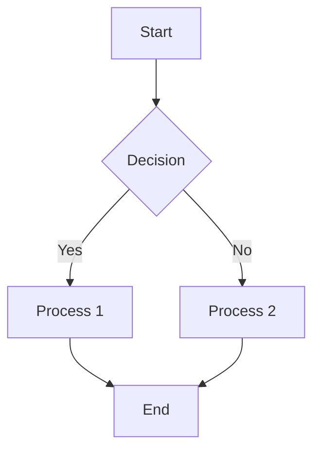
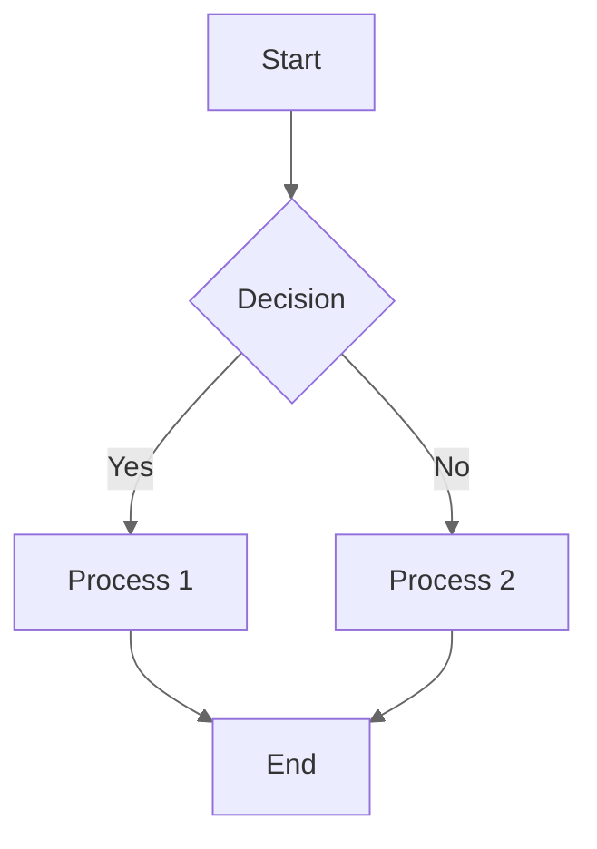
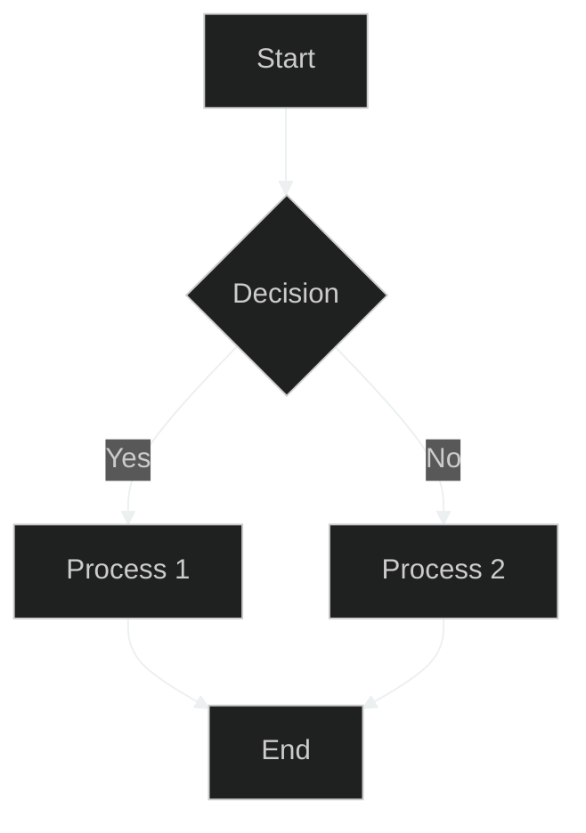

# ELA Documentation Style Guide

**Version:** 2.1.0
**Date:** 2025-05-20
**Author:** AI Assistant
**Status:** Updated
**Progress:** 100%

> **Note:** This document supersedes all previous documentation style guides. All documentation should follow the standards defined in this consolidated guide.

---

<div style="background-color:#e0e8f0; padding:15px; border-radius:5px; border: 1px solid #b0c4de; margin:10px 0; color: #333;">
<h4 style="margin-top: 0; ">Navigation</h4>

<div style="display: flex; align-items: center; margin-bottom: 5px;">
  <div style="width: 100px; font-weight: bold; color: #333;">Main:</div>
  <div>
    <a href="../README.md">Home</a> |
    <a href="../000-index.md">Documentation Index</a> |
    <a href="../210-ela-coding-standards.md">Coding Standards</a> |
    <a href="../230-documentation-roadmap.md">Documentation Roadmap</a>
  </div>
</div>

<div style="display: flex; align-items: center;">
  <div style="width: 100px; font-weight: bold; color: #333;">You are here:</div>
  <div>
    <a href="../README.md">Home</a> &gt;
    <a href="../000-index.md">Documentation Index</a> &gt;
    <span style="font-weight: bold;">Documentation Style Guide</span>
  </div>
</div>
</div>

<details>
<summary>Table of Contents</summary>

- [1. Overview](#1-overview)
- [2. Document Structure](#2-document-structure)
  - [2.1. Metadata](#21-metadata)
  - [2.2. Navigation](#22-navigation)
  - [2.3. Table of Contents](#23-table-of-contents)
  - [2.4. Headings](#24-headings)
  - [2.5. Version History](#25-version-history)
- [3. Formatting Guidelines](#3-formatting-guidelines)
  - [3.1. Text Formatting](#31-text-formatting)
  - [3.2. Lists](#32-lists)
  - [3.3. Tables](#33-tables)
  - [3.4. Blockquotes](#34-blockquotes)
  - [3.5. Links](#35-links)
  - [3.6. Images](#36-images)
  - [3.7. Collapsible Sections](#37-collapsible-sections)
- [4. Code Formatting](#4-code-formatting)
  - [4.1. Code Blocks](#41-code-blocks)
  - [4.2. Inline Code](#42-inline-code)
  - [4.3. Language-Specific Guidelines](#43-language-specific-guidelines)
- [5. Diagrams and Illustrations](#5-diagrams-and-illustrations)
  - [5.1. Mermaid Diagrams](#51-mermaid-diagrams)
  - [5.2. Light and Dark Mode](#52-light-and-dark-mode)
  - [5.3. Accessibility Guidelines](#53-accessibility-guidelines)
  - [5.4. Illustrations Index](#54-illustrations-index)
- [6. File Organization](#6-file-organization)
  - [6.1. Naming Conventions](#61-naming-conventions)
  - [6.2. Directory Structure](#62-directory-structure)
  - [6.3. Archiving Old Files](#63-archiving-old-files)
- [7. Date and Version Formatting](#7-date-and-version-formatting)
  - [7.1. Date Formatting Standards](#71-date-formatting-standards)
  - [7.2. Version Formatting Standards](#72-version-formatting-standards)
  - [7.3. Semantic Versioning Guidelines](#73-semantic-versioning-guidelines)
- [8. Cross-Document Navigation](#8-cross-document-navigation)
  - [8.1. Navigation Bar](#81-navigation-bar)
  - [8.2. Breadcrumb Navigation](#82-breadcrumb-navigation)
  - [8.3. Related Documents](#83-related-documents)
  - [8.4. Previous/Next Links](#84-previousnext-links)
- [9. Accessibility](#9-accessibility)
  - [9.1. Color Contrast](#91-color-contrast)
  - [9.2. Alternative Text](#92-alternative-text)
  - [9.3. Screen Reader Considerations](#93-screen-reader-considerations)
- [10. Validation and Quality Assurance](#10-validation-and-quality-assurance)
  - [10.1. Documentation Validation Script](#101-documentation-validation-script)
  - [10.2. Common Issues](#102-common-issues)
- [11. Related Documents](#11-related-documents)
- [12. Version History](#12-version-history)
</details>

## 1. Overview

This style guide provides comprehensive standards and guidelines for creating and maintaining documentation for the Enhanced Laravel Application (ELA). Following these guidelines ensures consistency across all documentation and improves readability, usability, and accessibility.

<div style="background-color:#f0f0f0; padding:15px; border-radius:5px; border: 1px solid #d0d0d0; margin:10px 0;">
<h4 style="margin-top: 0; color: #111;">Key Principles</h4>

<ul style="color: #444;">
  <li><strong style="color: #111;">Consistency</strong>: Follow the same patterns and conventions throughout all documentation</li>
  <li><strong style="color: #111;">Accessibility</strong>: Ensure documentation is accessible to all users, including those with disabilities</li>
  <li><strong style="color: #111;">Navigability</strong>: Make it easy for users to find and navigate between related documents</li>
  <li><strong style="color: #111;">Maintainability</strong>: Structure documentation in a way that makes it easy to update and maintain</li>
  <li><strong style="color: #111;">Readability</strong>: Use clear, concise language and proper formatting for better readability</li>
</ul>
</div>

## 2. Document Structure

### 2.1. Metadata

All documents should include the following metadata at the top:

```markdown
# Document Title

**Version:** 1.0.0
**Date:** 2025-05-20
**Author:** Author Name
**Status:** [New|Draft|Updated|Complete]
**Progress:** [0-100]%

---
```

<div style="background-color:#f0f0f0; padding:15px; border-radius:5px; border: 1px solid #d0d0d0; margin:10px 0;">
<h4 style="margin-top: 0; color: #111;">Required Metadata Fields</h4>

\n<details>\n<summary>Table Details</summary>\n\n| Field | Description | Format |
| --- | --- | --- |
| `Version` | Document version number | Semantic Versioning (MAJOR.MINOR.PATCH) |
| `Date` | Document creation date | ISO 8601 format (YYYY-MM-DD) |
| `Author` | Document author | Full name |
| `Status` | Document status | New, Draft, Updated, or Complete |
| `Progress` | Document completion percentage | 0-100% |
\n</details>\n
</div>

### 2.2. Navigation

All documents should include a navigation bar at the top, after the metadata section:

<div style="background-color:#f0f0f0; padding:15px; border-radius:5px; border: 1px solid #d0d0d0; margin:10px 0;">
<h4 style="margin-top: 0; color: #111;">Navigation Bar Example</h4>

```html
<div style="background-color:#e0e8f0; padding:15px; border-radius:5px; border: 1px solid #b0c4de; margin:10px 0;">
<h4 style="margin-top: 0; ">Navigation</h4>

<div style="display: flex; align-items: center; margin-bottom: 5px;">
  <div style="width: 100px; font-weight: bold; color: #333;">Main:</div>
  <div>
    <a href="../README.md">Home</a> |
    <a href="../000-index.md">Documentation Index</a> |
    <a href="./related-doc.md">Related Doc</a>
  </div>
</div>

<div style="display: flex; align-items: center;">
  <div style="width: 100px; font-weight: bold; color: #333;">You are here:</div>
  <div>
    <a href="../README.md">Home</a> &gt;
    <a href="./parent-directory/index.md">Parent Section</a> &gt;
    <span style="font-weight: bold;">Current Document</span>
  </div>
</div>
</div>
```
</div>

### 2.3. Table of Contents

All documents should include a table of contents wrapped in HTML details tags:

```markdown
<details>
<summary>Table of Contents</summary>

- [1. Section 1](#1-section-1)
- [2. Section 2](#2-section-2)
  - [2.1. Subsection 2.1](#21-subsection-21)
  - [2.2. Subsection 2.2](#22-subsection-22)
- [3. Section 3](#3-section-3)
</details>
```
### 2.4. Headings

Use the following heading levels consistently:

<div style="background-color:#f0f0f0; padding:15px; border-radius:5px; border: 1px solid #d0d0d0; margin:10px 0;">
<h4 style="margin-top: 0; color: #111;">Heading Hierarchy</h4>

<ul style="color: #444;">
  <li><strong style="color: #111;">Level 1 (#):</strong> Document title only</li>
  <li><strong style="color: #111;">Level 2 (##):</strong> Main sections</li>
  <li><strong style="color: #111;">Level 3 (###):</strong> Subsections</li>
  <li><strong style="color: #111;">Level 4 (####):</strong> Sub-subsections</li>
  <li><strong style="color: #111;">Level 5 (#####):</strong> Avoid if possible</li>
  <li><strong style="color: #111;">Level 6 (######):</strong> Avoid if possible</li>
</ul>

<p style="color: #444; margin-top: 15px;">Use numbered headings for better organization and reference:</p>

```markdown
## 2. Main Section

### 2.1. Subsection

#### 2.1.1. Sub-subsection
```
</div>

### 2.5. Version History

All documents should include a version history section at the end:

<div style="background-color:#f0f0f0; padding:15px; border-radius:5px; border: 1px solid #d0d0d0; margin:10px 0;">
<h4 style="margin-top: 0; color: #111;">Version History Example</h4>

```markdown
## 12. Version History

<div style="background-color:#f0f0f0; padding:15px; border-radius:5px; border: 1px solid #d0d0d0; margin:10px 0;">
<h4 style="margin-top: 0; color: #111;">Document History</h4>

\n<details>\n<summary>Table Details</summary>\n\n| Version | Date | Changes | Author |
| --- | --- | --- | --- |
| 1.0.0 | 2025-05-20 | Initial version | Author Name |
| 1.0.1 | 2025-05-21 | Updated X, Y, Z | Author Name |
\n</details>\n
</div>
```
</div>

## 3. Formatting Guidelines

### 3.1. Text Formatting

<div style="background-color:#f0f0f0; padding:15px; border-radius:5px; border: 1px solid #d0d0d0; margin:10px 0;">
<h4 style="margin-top: 0; color: #111;">Text Formatting Guidelines</h4>

<ul style="color: #444;">
  <li>Use <strong style="color: #111;">bold</strong> for emphasis: <code>**bold text**</code></li>
  <li>Use <em style="color: #444;">italic</em> for secondary emphasis: <code>*italic text*</code></li>
  <li>Use <del style="color: #444;">strikethrough</del> for deleted content: <code>~~strikethrough text~~</code></li>
  <li>Use <code style="color: #444; background-color: #f8f8f8; padding: 2px 4px; border-radius: 3px;">inline code</code> for code references: <code>`inline code`</code></li>
  <li>Use horizontal rules (---) to separate major sections</li>
</ul>
</div>

### 3.2. Lists

#### Unordered Lists

Use hyphens for unordered lists with consistent indentation:

```markdown
- Item 1
- Item 2
  - Subitem 2.1
  - Subitem 2.2
- Item 3
```

#### Ordered Lists

Use numbers followed by periods for ordered lists:

```markdown
1. First item
2. Second item
   1. Subitem 2.1
   2. Subitem 2.2
3. Third item
```

### 3.3. Tables

<div style="background-color:#f0f0f0; padding:15px; border-radius:5px; border: 1px solid #d0d0d0; margin:10px 0;">
<h4 style="margin-top: 0; color: #111;">Table Formatting Guidelines</h4>

<p style="color: #444;">Format tables with proper alignment:</p>

```markdown
| Column 1 | Column 2 | Column 3 |
|----------|----------|----------|
| Row 1    | Data     | Data     |
| Row 2    | Data     | Data     |
| **Total**| **Data** | **Data** |
```

<p style="color: #444; margin-top: 15px;">For enhanced tables with styling, use HTML:</p>

```html
\n<details>\n<summary>Table Details</summary>\n\n| Column 1 | Column 2 | Column 3 |
| --- | --- | --- |
| Row 1 | Data | Data |
| Row 2 | Data | Data |
| **Total** | **Data** | **Data** |
\n</details>\n
```
</div>

### 3.4. Blockquotes

Use blockquotes for notes, warnings, and important information:

<div style="background-color:#f0f0f0; padding:15px; border-radius:5px; border: 1px solid #d0d0d0; margin:10px 0;">
<h4 style="margin-top: 0; color: #111;">Blockquote Examples</h4>

```markdown
> **Note:** This is an important note.

> **Warning:** This is a warning.

> **Tip:** This is a helpful tip.
```

<p style="color: #444; margin-top: 15px;">For enhanced blockquotes with styling, use HTML:</p>

```html
<div style="background-color:#e0f0e0; padding:15px; border-radius:5px; border: 1px solid #c0d0c0; margin:10px 0;">
<h4 style="margin-top: 0; color: #007700;">Note</h4>
<p style="color: #444;">This is an important note with enhanced styling.</p>
</div>

<div style="background-color:#f0e8d0; padding:15px; border-radius:5px; border: 1px solid #e0d0b0; margin:10px 0;">
<h4 style="margin-top: 0; color: #cc7700;">Warning</h4>
<p style="color: #444;">This is a warning with enhanced styling.</p>
</div>

<div style="background-color:#e0e8f0; padding:15px; border-radius:5px; border: 1px solid #b0c4de; margin:10px 0;">
<h4 style="margin-top: 0; ">Tip</h4>
<p style="color: #444;">This is a helpful tip with enhanced styling.</p>
</div>
```
</div>

### 3.5. Links

<div style="background-color:#f0f0f0; padding:15px; border-radius:5px; border: 1px solid #d0d0d0; margin:10px 0;">
<h4 style="margin-top: 0; color: #111;">Link Guidelines</h4>

<p style="color: #444;">Use descriptive link text:</p>

```markdown
<a href="./path-to-document.md">Document Title</a>
```

<p style="color: #444; margin-top: 15px;">For enhanced links with styling, use HTML:</p>

```html
<a href="./path-to-document.md">Document Title</a>
```

<p style="color: #444; margin-top: 15px;"><strong style="color: #111;">Avoid using "click here" or other non-descriptive link text.</strong></p>
</div>
### 3.6. Images

<div style="background-color:#f0f0f0; padding:15px; border-radius:5px; border: 1px solid #d0d0d0; margin:10px 0;">
<h4 style="margin-top: 0; color: #111;">Image Guidelines</h4>

<p style="color: #444;">Include alt text for all images:</p>

```markdown
!<a href="./path-to-image.png">Alt text describing the image</a>
```

<p style="color: #444; margin-top: 15px;">For enhanced images with styling, use HTML:</p>

```html
<div style="text-align: center; margin: 20px 0;">
  
  <p style="color: #666; font-style: italic; margin-top: 5px;">Figure 1: Caption for the image</p>
</div>
```
</div>

### 3.7. Collapsible Sections

<div style="background-color:#f0f0f0; padding:15px; border-radius:5px; border: 1px solid #d0d0d0; margin:10px 0;">
<h4 style="margin-top: 0; color: #111;">Collapsible Section Guidelines</h4>

<p style="color: #444;">Use HTML details tags for collapsible sections:</p>

```markdown
<details>
<summary>Click to expand</summary>

Content goes here.

</details>
```

<p style="color: #444; margin-top: 15px;">For enhanced collapsible sections with styling, use HTML:</p>

```html
<details style="margin: 10px 0; border: 1px solid #d0d0d0; border-radius: 5px; padding: 10px;">
<summary style="font-weight: bold; cursor: pointer; ">Click to expand</summary>

<div style="margin-top: 10px; padding: 10px; background-color: #f8f8f8; border-radius: 5px;">
  Content goes here.
</div>

</details>
```
</div>

## 4. Code Formatting

### 4.1. Code Blocks

<div style="background-color:#f0f0f0; padding:15px; border-radius:5px; border: 1px solid #d0d0d0; margin:10px 0;">
<h4 style="margin-top: 0; color: #111;">Code Block Guidelines</h4>

<p style="color: #444;">Always include language specifiers in code blocks:</p>

```markdown
```php
// PHP code here
```

```bash
# Bash code here
```

```javascript
// JavaScript code here
```
```

<p style="color: #444; margin-top: 15px;"><strong style="color: #111;">Note:</strong> The language specifier helps with syntax highlighting and improves accessibility.</p>
</div>

### 4.2. Inline Code

<div style="background-color:#f0f0f0; padding:15px; border-radius:5px; border: 1px solid #d0d0d0; margin:10px 0;">
<h4 style="margin-top: 0; color: #111;">Inline Code Guidelines</h4>

<p style="color: #444;">Use backticks for inline code references:</p>

```markdown
Use the `artisan` command to run migrations.
```

<p style="color: #444; margin-top: 15px;">For enhanced inline code with styling, use HTML:</p>

```html
Use the <code style="color: #444; background-color: #f8f8f8; padding: 2px 4px; border-radius: 3px;">artisan</code> command to run migrations.
```
</div>

### 4.3. Language-Specific Guidelines

#### PHP Code

<div style="background-color:#f0f0f0; padding:15px; border-radius:5px; border: 1px solid #d0d0d0; margin:10px 0;">
<h4 style="margin-top: 0; color: #111;">PHP Code Guidelines</h4>

<ul style="color: #444;">
  <li>Use PSR-12 coding standards</li>
  <li>Include type hints and return types</li>
  <li>Use strict types declaration</li>
  <li>Include docblocks for classes and methods</li>
</ul>

```php
<?php

declare(strict_types=1);

namespace App\Models;

/**
 * User model class
 */
class User extends Model
{
    // Code here
}
```
</div>

#### Blade Templates

<div style="background-color:#f0f0f0; padding:15px; border-radius:5px; border: 1px solid #d0d0d0; margin:10px 0;">
<h4 style="margin-top: 0; color: #111;">Blade Template Guidelines</h4>

<ul style="color: #444;">
  <li>Use consistent indentation (2 spaces)</li>
  <li>Use component syntax where appropriate</li>
  <li>Include comments for complex sections</li>
</ul>

```blade
<x-layout>
    <x-slot name="header">
        <h1>{{ $title }}</h1>
    </x-slot>

    {{-- Main content --}}
    <div class="content">
        @foreach ($items as $item)
            <x-item :item="$item" />
        @endforeach
    </div>
</x-layout>
```
</div>

#### JavaScript/TypeScript

<div style="background-color:#f0f0f0; padding:15px; border-radius:5px; border: 1px solid #d0d0d0; margin:10px 0;">
<h4 style="margin-top: 0; color: #111;">JavaScript/TypeScript Guidelines</h4>

<ul style="color: #444;">
  <li>Use ES6+ syntax</li>
  <li>Use consistent indentation (2 spaces)</li>
  <li>Include JSDoc comments for functions</li>
</ul>

```javascript
/**
 * Fetches user data from the API
 * @param {number} userId - The user ID
 * @returns {Promise<Object>} The user data
 */
const fetchUser = async (userId) => {
  try {
    const response = await fetch(`/api/users/${userId}`);
    return await response.json();
  } catch (error) {
    console.error('Error fetching user:', error);
    throw error;
  }
};
```
</div>

## 5. Diagrams and Illustrations

### 5.1. Mermaid Diagrams

<div style="background-color:#f0f0f0; padding:15px; border-radius:5px; border: 1px solid #d0d0d0; margin:10px 0;">
<h4 style="margin-top: 0; color: #111;">Mermaid Diagram Guidelines</h4>

<p style="color: #444;">Use Mermaid syntax for diagrams:</p>

```markdown

```
</div>

### 5.2. Light and Dark Mode

<div style="background-color:#f0f0f0; padding:15px; border-radius:5px; border: 1px solid #d0d0d0; margin:10px 0;">
<h4 style="margin-top: 0; color: #111;">Light and Dark Mode Guidelines</h4>

<p style="color: #444;">Provide both light and dark mode versions of all diagrams:</p>

```markdown
<details>
<summary>Light Mode Diagram</summary>



</details>

<details>
<summary>Dark Mode Diagram</summary>



</details>
```
</div>
### 5.3. Accessibility Guidelines

<div style="background-color:#f0f0f0; padding:15px; border-radius:5px; border: 1px solid #d0d0d0; margin:10px 0;">
<h4 style="margin-top: 0; color: #111;">Diagram Accessibility Guidelines</h4>

<ul style="color: #444;">
  <li>Provide alternative text descriptions for all diagrams</li>
  <li>Use high contrast colors for better readability</li>
  <li>Avoid relying solely on color to convey information</li>
  <li>Include text descriptions of complex diagrams</li>
</ul>

<p style="color: #444; margin-top: 15px;"><strong style="color: #111;">Diagram Accessibility Template:</strong></p>

```markdown
### Diagram Title

<div style="margin-bottom: 20px;">
<strong>Description:</strong> Brief description of what the diagram shows.
</div>

<details>
<summary>Light Mode Diagram</summary>

```mermaid
%%{init: {'theme': 'default', 'themeVariables': { ... }}}%%
// Diagram code here
```

</details>

<details>
<summary>Dark Mode Diagram</summary>

```mermaid
%%{init: {'theme': 'dark', 'themeVariables': { ... }}}%%
// Diagram code here
```

</details>

<div style="margin-top: 20px;">
<strong>Alternative Text:</strong> Detailed description of the diagram for screen readers.
</div>
```
</div>

### 5.4. Illustrations Index

<div style="background-color:#f0f0f0; padding:15px; border-radius:5px; border: 1px solid #d0d0d0; margin:10px 0;">
<h4 style="margin-top: 0; color: #111;">Illustrations Directory Structure</h4>

<p style="color: #444;">Maintain an index of all illustrations in the <code>illustrations</code> directory:</p>

```
docs/
├── illustrations/
│   ├── index.html
│   ├── mermaid/
│   │   ├── light/
│   │   └── dark/
│   ├── plantuml/
│   │   ├── light/
│   │   └── dark/
│   └── thumbnails/
│       ├── mermaid/
│       │   ├── light/
│       │   └── dark/
│       └── plantuml/
│           ├── light/
│           └── dark/
```
</div>

## 6. File Organization

### 6.1. Naming Conventions

<div style="background-color:#f0f0f0; padding:15px; border-radius:5px; border: 1px solid #d0d0d0; margin:10px 0;">
<h4 style="margin-top: 0; color: #111;">File Naming Guidelines</h4>

<ul style="color: #444;">
  <li>Use kebab-case for file names (e.g., <code>document-name.md</code>)</li>
  <li>Use three-digit prefixes for ordered files (e.g., <code>010-introduction.md</code>, <code>020-installation.md</code>)</li>
  <li>Use descriptive names that reflect the content</li>
  <li>Avoid special characters in file names</li>
  <li>Use consistent naming conventions across all documentation</li>
</ul>
</div>

### 6.2. Directory Structure

<div style="background-color:#f0f0f0; padding:15px; border-radius:5px; border: 1px solid #d0d0d0; margin:10px 0;">
<h4 style="margin-top: 0; color: #111;">Directory Structure Guidelines</h4>

<p style="color: #444;">Follow this directory structure for documentation:</p>

```
docs/
├── 010-ela/
│   ├── 000-index.md
│   ├── 100-implementation-plan/
│   │   ├── 000-index.md
│   │   ├── 100-000-implementation-plan-overview.md
│   │   ├── 100-010-documentation-updates.md
│   │   └── ...
│   ├── 200-database-design/
│   │   ├── 000-index.md
│   │   └── ...
│   └── ...
└── ...
```

<ul style="color: #444; margin-top: 15px;">
  <li>Each directory should have an <code>000-index.md</code> file</li>
  <li>Use three-digit prefixes for directories and files</li>
  <li>Group related files in subdirectories</li>
  <li>Maintain a consistent hierarchy</li>
</ul>
</div>

### 6.3. Archiving Old Files

<div style="background-color:#f0f0f0; padding:15px; border-radius:5px; border: 1px solid #d0d0d0; margin:10px 0;">
<h4 style="margin-top: 0; color: #111;">File Archiving Guidelines</h4>

<p style="color: #444;">When a file is replaced by a newer version, move the old file to a <code>.archive</code> directory:</p>

```
docs/
├── 010-ela/
│   ├── 100-implementation-plan/
│   │   ├── .archive/
│   │   │   ├── 100-030-package-installation.md
│   │   │   └── ...
│   │   └── ...
│   └── ...
└── ...
```

<ul style="color: #444; margin-top: 15px;">
  <li>Create a <code>.archive</code> directory in each subdirectory</li>
  <li>Move obsolete files to the <code>.archive</code> directory</li>
  <li>Do not delete obsolete files</li>
  <li>Update references to archived files in other documents</li>
</ul>
</div>

## 7. Date and Version Formatting

### 7.1. Date Formatting Standards

<div style="background-color:#f0f0f0; padding:15px; border-radius:5px; border: 1px solid #d0d0d0; margin:10px 0;">
<h4 style="margin-top: 0; color: #111;">Date Formatting Guidelines</h4>

<ul style="color: #444;">
  <li>Always use ISO 8601 format (YYYY-MM-DD) for all dates</li>
  <li>Do not use other date formats (MM/DD/YYYY, DD/MM/YYYY, etc.)</li>
  <li>Do not use abbreviated month names (Jan, Feb, etc.)</li>
  <li>Do not use spelled-out month names (January, February, etc.)</li>
  <li>For date ranges, use "to" as the separator (e.g., 2025-05-20 to 2025-05-27)</li>
  <li>For recurring dates, use "every" followed by the day of the week (e.g., every Monday)</li>
</ul>
</div>

### 7.2. Version Formatting Standards

<div style="background-color:#f0f0f0; padding:15px; border-radius:5px; border: 1px solid #d0d0d0; margin:10px 0;">
<h4 style="margin-top: 0; color: #111;">Version Formatting Guidelines</h4>

<ul style="color: #444;">
  <li>Use Semantic Versioning (MAJOR.MINOR.PATCH) for all version numbers</li>
  <li>Do not use prefixes (e.g., v1.0.0, Version 1.0.0)</li>
  <li>Do not use suffixes (e.g., 1.0.0-alpha, 1.0.0-beta)</li>
  <li>Start with version 1.0.0 for new documents</li>
  <li>Use consistent versioning across all documentation</li>
</ul>
</div>

### 7.3. Semantic Versioning Guidelines

<div style="background-color:#f0f0f0; padding:15px; border-radius:5px; border: 1px solid #d0d0d0; margin:10px 0;">
<h4 style="margin-top: 0; color: #111;">Semantic Versioning Rules</h4>

<ul style="color: #444;">
  <li><strong style="color: #111;">MAJOR</strong>: Increment when making significant changes that may require updates to related documents</li>
  <li><strong style="color: #111;">MINOR</strong>: Increment when adding new content or features that don't break existing content</li>
  <li><strong style="color: #111;">PATCH</strong>: Increment when making bug fixes, typo corrections, or minor updates</li>
</ul>
</div>

## 8. Cross-Document Navigation

### 8.1. Navigation Bar

<div style="background-color:#f0f0f0; padding:15px; border-radius:5px; border: 1px solid #d0d0d0; margin:10px 0;">
<h4 style="margin-top: 0; color: #111;">Navigation Bar Guidelines</h4>

<p style="color: #444;">Include a navigation bar at the top of each document:</p>

```html
<div style="background-color:#e0e8f0; padding:15px; border-radius:5px; border: 1px solid #b0c4de; margin:10px 0;">
<h4 style="margin-top: 0; ">Navigation</h4>

<div style="display: flex; align-items: center; margin-bottom: 5px;">
  <div style="width: 100px; font-weight: bold; color: #333;">Main:</div>
  <div>
    <a href="../README.md">Home</a> |
    <a href="../000-index.md">Documentation Index</a> |
    <a href="./related-doc.md">Related Doc</a>
  </div>
</div>
</div>
```
</div>
### 8.2. Breadcrumb Navigation

<div style="background-color:#f0f0f0; padding:15px; border-radius:5px; border: 1px solid #d0d0d0; margin:10px 0;">
<h4 style="margin-top: 0; color: #111;">Breadcrumb Navigation Guidelines</h4>

<p style="color: #444;">Include breadcrumb navigation for documents in a hierarchical structure:</p>

```html
<div style="display: flex; align-items: center;">
  <div style="width: 100px; font-weight: bold; color: #333;">You are here:</div>
  <div>
    <a href="../README.md">Home</a> &gt;
    <a href="./parent-directory/index.md">Parent Section</a> &gt;
    <span style="font-weight: bold;">Current Document</span>
  </div>
</div>
```
</div>

### 8.3. Related Documents

<div style="background-color:#f0f0f0; padding:15px; border-radius:5px; border: 1px solid #d0d0d0; margin:10px 0;">
<h4 style="margin-top: 0; color: #111;">Related Documents Guidelines</h4>

<p style="color: #444;">Include a "Related Documents" section at the end of each document:</p>

```html
<div style="background-color:#e0e8f0; padding:15px; border-radius:5px; border: 1px solid #b0c4de; margin:10px 0;">
<h4 style="margin-top: 0; ">Related Documents</h4>

<ul style="margin-bottom: 10px;">
  <li><a href="./document-1.md">Document 1</a> - Brief description</li>
  <li><a href="./document-2.md">Document 2</a> - Brief description</li>
  <li><a href="./document-3.md">Document 3</a> - Brief description</li>
</ul>
</div>
```
</div>

### 8.4. Previous/Next Links

<div style="background-color:#f0f0f0; padding:15px; border-radius:5px; border: 1px solid #d0d0d0; margin:10px 0;">
<h4 style="margin-top: 0; color: #111;">Previous/Next Links Guidelines</h4>

<p style="color: #444;">Include previous/next links at the end of each document in a sequence:</p>

```html
<div style="background-color:#e0f0e0; padding:15px; border-radius:5px; border: 1px solid #c0d0c0; margin:20px 0;">
<h4 style="margin-top: 0; color: #007700;">Navigation</h4>

<div style="display: flex; justify-content: space-between; margin-top: 10px;">
  <div>
    <strong>Previous:</strong> <a href="./previous-document.md">Previous Document</a>
  </div>
  <div>
    <strong>Next:</strong> <a href="./next-document.md">Next Document</a>
  </div>
</div>
</div>
```
</div>

## 9. Accessibility

### 9.1. Color Contrast

<div style="background-color:#f0f0f0; padding:15px; border-radius:5px; border: 1px solid #d0d0d0; margin:10px 0;">
<h4 style="margin-top: 0; color: #111;">Color Contrast Guidelines</h4>

<ul style="color: #444;">
  <li>Maintain a minimum contrast ratio of 4.5:1 for normal text</li>
  <li>Maintain a minimum contrast ratio of 3:1 for large text (18pt+)</li>
  <li>Use the WebAIM Contrast Checker to verify contrast ratios</li>
  <li>Avoid using light gray text on light backgrounds</li>
  <li>Use a minimum font weight of 500 for secondary text</li>
</ul>

<p style="color: #444; margin-top: 15px;"><strong style="color: #111;">Color Standards:</strong></p>

<ul style="color: #444;">
  <li>Primary text: #111 (not #333)</li>
  <li>Secondary text: #444 (not #7f8c8d)</li>
  <li>Headings: #222</li>
  <li>Links: #0066cc</li>
  <li>Success: #007700</li>
  <li>Warning: #cc7700</li>
  <li>Error: #cc0000</li>
  <li>Background: #f0f0f0</li>
  <li>Border: #d0d0d0</li>
</ul>
</div>

### 9.2. Alternative Text

<div style="background-color:#f0f0f0; padding:15px; border-radius:5px; border: 1px solid #d0d0d0; margin:10px 0;">
<h4 style="margin-top: 0; color: #111;">Alternative Text Guidelines</h4>

<ul style="color: #444;">
  <li>Provide alternative text for all images and diagrams</li>
  <li>Make alternative text descriptive and concise</li>
  <li>Include purpose and content in alternative text</li>
  <li>Avoid using "image of" or "picture of" in alternative text</li>
  <li>Test alternative text with a screen reader</li>
</ul>

<p style="color: #444; margin-top: 15px;"><strong style="color: #111;">Example:</strong></p>

<p style="color: #444;">Instead of:</p>
<pre style="background-color: #f8f8f8; padding: 10px; border-radius: 5px; color: #444;">!<a href="./database-schema.png">Image of database schema</a></pre>

<p style="color: #444;">Use:</p>
<pre style="background-color: #f8f8f8; padding: 10px; border-radius: 5px; color: #444;">!<a href="./database-schema.png">Database schema showing User, Post, and Comment tables with their relationships</a></pre>
</div>

### 9.3. Screen Reader Considerations

<div style="background-color:#f0f0f0; padding:15px; border-radius:5px; border: 1px solid #d0d0d0; margin:10px 0;">
<h4 style="margin-top: 0; color: #111;">Screen Reader Guidelines</h4>

<ul style="color: #444;">
  <li>Use proper heading hierarchy (H1, H2, H3, etc.)</li>
  <li>Use semantic HTML elements when appropriate</li>
  <li>Provide text alternatives for non-text content</li>
  <li>Ensure keyboard accessibility for interactive elements</li>
  <li>Test documentation with a screen reader</li>
</ul>
</div>

## 10. Validation and Quality Assurance

### 10.1. Documentation Validation Script

<div style="background-color:#f0f0f0; padding:15px; border-radius:5px; border: 1px solid #d0d0d0; margin:10px 0;">
<h4 style="margin-top: 0; color: #111;">Documentation Validation Guidelines</h4>

<p style="color: #444;">Use the documentation validation script (<code>tools/validate-docs.sh</code>) to check for common issues:</p>

```bash
cd docs/010-ela/tools
./validate-docs.sh
```

<p style="color: #444; margin-top: 15px;">The script checks for:</p>

<ul style="color: #444;">
  <li>Files with missing metadata fields</li>
  <li>Files with future dates</li>
  <li>Files with inconsistent status values</li>
  <li>Broken links to other markdown files</li>
  <li>Inconsistent heading levels</li>
  <li>Files without a table of contents</li>
  <li>Code blocks without language specification</li>
  <li>Inconsistent document titles</li>
</ul>
</div>

### 10.2. Common Issues

<div style="background-color:#f0f0f0; padding:15px; border-radius:5px; border: 1px solid #d0d0d0; margin:10px 0;">
<h4 style="margin-top: 0; color: #111;">Common Documentation Issues</h4>

<p style="color: #444;">Watch out for these common issues:</p>

<ul style="color: #444;">
  <li>Broken links to other documents</li>
  <li>Inconsistent metadata</li>
  <li>Missing table of contents</li>
  <li>Inconsistent heading levels</li>
  <li>Missing version history</li>
  <li>Outdated information</li>
  <li>Inconsistent formatting</li>
  <li>Missing language specifiers in code blocks</li>
  <li>Missing accessibility features</li>
</ul>
</div>

## 11. Related Documents

<div style="background-color:#e0e8f0; padding:15px; border-radius:5px; border: 1px solid #b0c4de; margin:10px 0;">
<h4 style="margin-top: 0; ">Related Documents</h4>

<ul style="margin-bottom: 10px;">
  <li><a href="../210-ela-coding-standards.md">Coding Standards</a> - Coding standards and best practices</li>
  <li><a href="../230-documentation-roadmap.md">Documentation Roadmap</a> - Documentation roadmap outlining future improvements and priorities</li>
  <li><a href="../000-index.md">Documentation Index</a> - Main documentation index</li>
  <li><a href="../README.md">README</a> - Project README with quick navigation links</li>
</ul>
</div>

## 12. Version History

<div style="background-color:#f0f0f0; padding:15px; border-radius:5px; border: 1px solid #d0d0d0; margin:10px 0;">
<h4 style="margin-top: 0; color: #111;">Document History</h4>

\n<details>\n<summary>Table Details</summary>\n\n| Version | Date | Changes | Author |
| --- | --- | --- | --- |
| 2.1.0 | 2025-05-20 | Updated formatting for high contrast and accessibility, improved navigation, added related documents section | AI Assistant |
| 2.0.0 | 2025-05-20 | Consolidated style guide with updated standards for accessibility, navigation, and date/version formatting | Augment Agent |
| 1.2.0 | 2025-05-17 | Updated with improved accessibility guidelines | AI Assistant |
| 1.0.0 | 2023-11-13 | Initial version | AI Assistant |
\n</details>\n
</div>

<div style="background-color:#e0f0e0; padding:15px; border-radius:5px; border: 1px solid #c0d0c0; margin:20px 0;">
<h4 style="margin-top: 0; color: #007700;">Navigation</h4>

<div style="display: flex; justify-content: space-between; margin-top: 10px;">
  <div>
    <strong>Previous:</strong> <a href="../210-ela-coding-standards.md">Coding Standards</a>
  </div>
  <div>
    <strong>Next:</strong> <a href="../230-documentation-roadmap.md">Documentation Roadmap</a>
  </div>
</div>
</div>
