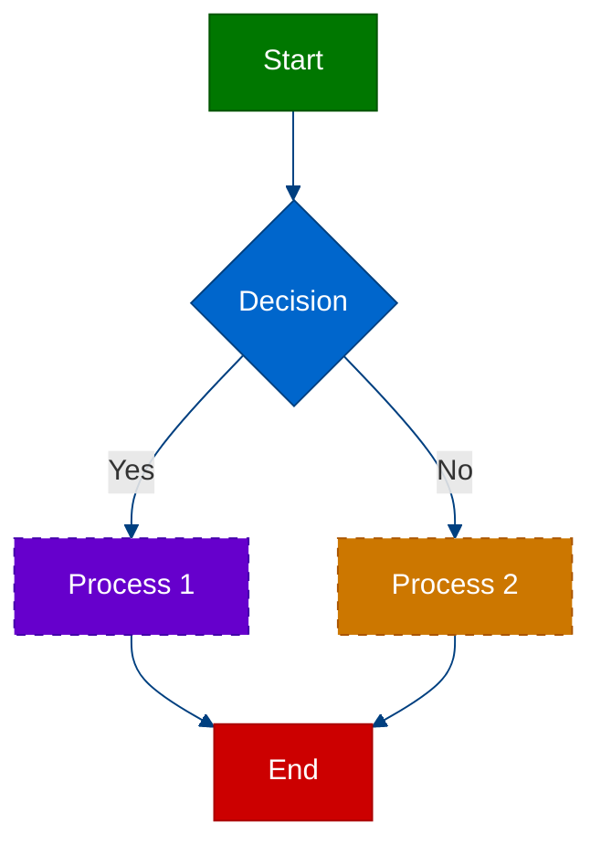

# 1. Diagram Accessibility Guidelines

**Version:** 1.0.0
**Date:** 2025-05-21
**Author:** Augment Agent
**Status:** Active
**Progress:** 100%

---

<details>
<summary>Table of Contents</summary>

- [1.1. Overview](#11-overview)
- [1.2. Accessibility Principles](#12-accessibility-principles)
  - [1.2.1. Perceivable](#121-perceivable)
  - [1.2.2. Operable](#122-operable)
  - [1.2.3. Understandable](#123-understandable)
  - [1.2.4. Robust](#124-robust)
- [1.3. Color and Contrast](#13-color-and-contrast)
  - [1.3.1. Color Contrast Requirements](#131-color-contrast-requirements)
  - [1.3.2. Color Blindness Considerations](#132-color-blindness-considerations)
  - [1.3.3. Using Patterns with Colors](#133-using-patterns-with-colors)
- [1.4. Alternative Text](#14-alternative-text)
  - [1.4.1. Alt Text Guidelines](#141-alt-text-guidelines)
  - [1.4.2. Alt Text Examples](#142-alt-text-examples)
- [1.5. Text Descriptions](#15-text-descriptions)
  - [1.5.1. Text Description Guidelines](#151-text-description-guidelines)
  - [1.5.2. Text Description Examples](#152-text-description-examples)
- [1.6. Implementation in Mermaid](#16-implementation-in-mermaid)
  - [1.6.1. Mermaid Accessibility Features](#161-mermaid-accessibility-features)
  - [1.6.2. Mermaid Examples](#162-mermaid-examples)
- [1.7. Related Documents](#17-related-documents)
- [1.8. Version History](#18-version-history)

</details>

## 1.1. Overview

This document provides guidelines for improving the accessibility of diagrams in the ELA documentation. The goal is to ensure that diagrams are accessible to all users, including those with visual impairments, color blindness, or other disabilities.

<div style="padding: 15px; border-radius: 5px; border: 1px solid #b0c4de; margin-bottom: 20px;">
<h4 style="margin-top: 0; ">Why Diagram Accessibility Matters</h4>

<p>Accessible diagrams ensure that all users, regardless of abilities, can understand the information being conveyed. This includes:</p>

<ul style="margin-bottom: 0;">
  <li>Users with visual impairments who use screen readers</li>
  <li>Users with color blindness who may not distinguish between certain colors</li>
  <li>Users with cognitive disabilities who benefit from clear, simple explanations</li>
  <li>Users in environments with poor lighting or display limitations</li>
</ul>
</div>

## 1.2. Accessibility Principles

The Web Content Accessibility Guidelines (WCAG) define four principles of accessibility: Perceivable, Operable, Understandable, and Robust (POUR). These principles apply to diagrams as well.

### 1.2.1. Perceivable

<div style="padding: 15px; border-radius: 5px; border: 1px solid #b0c4de; margin-bottom: 20px;">
<h4 style="margin-top: 0; ">Perceivable</h4>

<p>Information and user interface components must be presentable to users in ways they can perceive.</p>

<h5 style="color: #111;">Guidelines:</h5>
<ul style="margin-bottom: 0;">
  <li>Provide text alternatives for non-text content (alt text)</li>
  <li>Ensure sufficient color contrast</li>
  <li>Make it easier for users to see and hear content</li>
  <li>Provide multiple ways to access content</li>
</ul>
</div>

### 1.2.2. Operable

<div style="padding: 15px; border-radius: 5px; border: 1px solid #b0c4de; margin-bottom: 20px;">
<h4 style="margin-top: 0; ">Operable</h4>

<p>User interface components and navigation must be operable.</p>

<h5 style="color: #111;">Guidelines:</h5>
<ul style="margin-bottom: 0;">
  <li>Make all functionality available from a keyboard</li>
  <li>Give users enough time to read and use content</li>
  <li>Do not use content that causes seizures or physical reactions</li>
  <li>Help users navigate and find content</li>
</ul>
</div>

### 1.2.3. Understandable

<div style="padding: 15px; border-radius: 5px; border: 1px solid #b0c4de; margin-bottom: 20px;">
<h4 style="margin-top: 0; ">Understandable</h4>

<p>Information and the operation of user interface must be understandable.</p>

<h5 style="color: #111;">Guidelines:</h5>
<ul style="margin-bottom: 0;">
  <li>Make text readable and understandable</li>
  <li>Make content appear and operate in predictable ways</li>
  <li>Help users avoid and correct mistakes</li>
  <li>Use clear and simple language</li>
</ul>
</div>

### 1.2.4. Robust

<div style="padding: 15px; border-radius: 5px; border: 1px solid #b0c4de; margin-bottom: 20px;">
<h4 style="margin-top: 0; ">Robust</h4>

<p>Content must be robust enough that it can be interpreted by a wide variety of user agents, including assistive technologies.</p>

<h5 style="color: #111;">Guidelines:</h5>
<ul style="margin-bottom: 0;">
  <li>Maximize compatibility with current and future user tools</li>
  <li>Use standard formats and technologies</li>
  <li>Ensure content is accessible to assistive technologies</li>
</ul>
</div>

## 1.3. Color and Contrast

### 1.3.1. Color Contrast Requirements

<div style="padding: 15px; border-radius: 5px; border: 1px solid #b0c4de; margin-bottom: 20px;">
<h4 style="margin-top: 0; ">Color Contrast Requirements</h4>

<p>WCAG 2.1 requires the following contrast ratios:</p>

<ul style="margin-bottom: 0;">
  <li><strong>Level AA (minimum):</strong> Contrast ratio of at least 4.5:1 for normal text and 3:1 for large text</li>
  <li><strong>Level AAA (enhanced):</strong> Contrast ratio of at least 7:1 for normal text and 4.5:1 for large text</li>
  <li><strong>Graphical Objects:</strong> Contrast ratio of at least 3:1 against adjacent colors</li>
</ul>

<p style="margin-top: 10px;">Use tools like the <a href="https:/webaim.org/resources/contrastchecker">WebAIM Contrast Checker</a> to verify contrast ratios.</p>
</div>

### 1.3.2. Color Blindness Considerations

<div style="padding: 15px; border-radius: 5px; border: 1px solid #b0c4de; margin-bottom: 20px;">
<h4 style="margin-top: 0; ">Color Blindness Considerations</h4>

<p>Different types of color blindness affect how users perceive colors:</p>

<ul style="margin-bottom: 0;">
  <li><strong>Deuteranopia:</strong> Difficulty distinguishing between red and green</li>
  <li><strong>Protanopia:</strong> Difficulty distinguishing between red and green (different from deuteranopia)</li>
  <li><strong>Tritanopia:</strong> Difficulty distinguishing between blue and yellow</li>
  <li><strong>Achromatopsia:</strong> Complete color blindness (sees only in grayscale)</li>
</ul>

<p style="margin-top: 10px;">Use tools like <a href="https:/www.color-blindness.com/coblis-color-blindness-simulator">Coblis Color Blindness Simulator</a> to test how diagrams appear to users with color blindness.</p>
</div>

### 1.3.3. Using Patterns with Colors

<div style="padding: 15px; border-radius: 5px; border: 1px solid #b0c4de; margin-bottom: 20px;">
<h4 style="margin-top: 0; ">Using Patterns with Colors</h4>

<p>Don't rely on color alone to convey information. Use patterns, shapes, or labels in addition to colors:</p>

<ul style="margin-bottom: 0;">
  <li>Use different line styles (solid, dashed, dotted) for different types of connections</li>
  <li>Use different shapes for different types of nodes</li>
  <li>Add text labels to identify elements</li>
  <li>Use patterns (stripes, dots, crosshatch) in addition to colors for filled areas</li>
</ul>

<h5 style="color: #111;">Example:</h5>

<div style="display: flex; justify-content: space-between; margin-top: 10px;">
  <div style="width: 45%; background-color: #ffffff; padding: 10px; border-radius: 5px; border: 1px solid #ddd;">
    <p style="margin-top: 0; font-weight: bold; color: #cc0000;">Not Accessible:</p>
    <p style="margin-bottom: 0;">Using only red, green, and blue to distinguish between different states in a state diagram.</p>
  </div>
  <div style="width: 45%; background-color: #ffffff; padding: 10px; border-radius: 5px; border: 1px solid #ddd;">
    <p style="margin-top: 0; font-weight: bold; color: #007700;">Accessible:</p>
    <p style="margin-bottom: 0;">Using red with diagonal stripes, green with dots, and blue with horizontal lines to distinguish between states.</p>
  </div>
</div>
</div>

## 1.4. Alternative Text

### 1.4.1. Alt Text Guidelines

<div style="padding: 15px; border-radius: 5px; border: 1px solid #b0c4de; margin-bottom: 20px;">
<h4 style="margin-top: 0; ">Alt Text Guidelines</h4>

<p>Alternative text (alt text) provides a textual alternative to non-text content. For diagrams:</p>

<ul style="margin-bottom: 0;">
  <li>Keep alt text concise (generally under 125 characters)</li>
  <li>Describe the purpose and content of the diagram</li>
  <li>Include key information conveyed by the diagram</li>
  <li>Don't include "image of" or "diagram of" (screen readers already announce this)</li>
  <li>For complex diagrams, provide a brief alt text and a more detailed description elsewhere</li>
</ul>

<h5 style="color: #111;">Implementation in Markdown:</h5>

```markdown
!<a href="./path-to-diagram.svg">Event sourcing flow diagram showing the relationship between commands, aggregates, events, projectors, and read models</a>
```
</div>

### 1.4.2. Alt Text Examples

<div style="padding: 15px; border-radius: 5px; border: 1px solid #b0c4de; margin-bottom: 20px;">
<h4 style="margin-top: 0; ">Alt Text Examples</h4>

<h5 style="color: #111;">Example 1: Flowchart</h5>

<div style="display: flex; justify-content: space-between; margin-top: 10px;">
  <div style="width: 45%; background-color: #ffffff; padding: 10px; border-radius: 5px; border: 1px solid #ddd;">
    <p style="margin-top: 0; font-weight: bold; color: #cc0000;">Poor Alt Text:</p>
    <p style="margin-bottom: 0;">"Flowchart diagram"</p>
  </div>
  <div style="width: 45%; background-color: #ffffff; padding: 10px; border-radius: 5px; border: 1px solid #ddd;">
    <p style="margin-top: 0; font-weight: bold; color: #007700;">Good Alt Text:</p>
    <p style="margin-bottom: 0;">"User registration flowchart showing steps from form submission to account activation email"</p>
  </div>
</div>

<h5 style="color: #111; margin-top: 15px;">Example 2: Entity Relationship Diagram</h5>

<div style="display: flex; justify-content: space-between; margin-top: 10px;">
  <div style="width: 45%; background-color: #ffffff; padding: 10px; border-radius: 5px; border: 1px solid #ddd;">
    <p style="margin-top: 0; font-weight: bold; color: #cc0000;">Poor Alt Text:</p>
    <p style="margin-bottom: 0;">"ERD diagram for the database"</p>
  </div>
  <div style="width: 45%; background-color: #ffffff; padding: 10px; border-radius: 5px; border: 1px solid #ddd;">
    <p style="margin-top: 0; font-weight: bold; color: #007700;">Good Alt Text:</p>
    <p style="margin-bottom: 0;">"Entity relationship diagram showing User, Team, and Post entities with one-to-many relationships"</p>
  </div>
</div>
</div>

## 1.5. Text Descriptions

### 1.5.1. Text Description Guidelines

<div style="padding: 15px; border-radius: 5px; border: 1px solid #b0c4de; margin-bottom: 20px;">
<h4 style="margin-top: 0; ">Text Description Guidelines</h4>

<p>For complex diagrams, provide a detailed text description in addition to alt text:</p>

<ul style="margin-bottom: 0;">
  <li>Place the description near the diagram</li>
  <li>Structure the description logically (e.g., top to bottom, left to right)</li>
  <li>Describe the overall purpose first, then details</li>
  <li>Include all important relationships and connections</li>
  <li>Use the same terminology as in the diagram</li>
  <li>Consider using a collapsible section to avoid cluttering the document</li>
</ul>

<h5 style="color: #111;">Implementation in Markdown:</h5>

```markdown
<details>
<summary>Diagram Description</summary>

This event sourcing flow diagram illustrates the process from command to read model:

1. A command is sent to the aggregate
2. The aggregate applies business rules and generates events
3. Events are stored in the event store
4. Projectors process events to update read models
5. Reactors process events to trigger side effects

The diagram shows these components connected with arrows indicating the flow of data.
</details>
```
</div>

### 1.5.2. Text Description Examples

<div style="padding: 15px; border-radius: 5px; border: 1px solid #b0c4de; margin-bottom: 20px;">
<h4 style="margin-top: 0; ">Text Description Examples</h4>

<h5 style="color: #111;">Example: Event Sourcing Flow Diagram</h5>

<div style="background-color: #ffffff; padding: 15px; border-radius: 5px; border: 1px solid #ddd;">
<p style="margin-top: 0; font-weight: bold;">Detailed Description:</p>

<p>This diagram illustrates the event sourcing flow with five main components arranged in a sequential process:</p>

<ol style="margin-bottom: 0;">
  <li><strong>Command Handler:</strong> Located on the left side, receives commands from users</li>
  <li><strong>Aggregate:</strong> Connected to the Command Handler, applies business rules and generates events</li>
  <li><strong>Event Store:</strong> In the center, stores all events generated by aggregates</li>
  <li><strong>Projector:</strong> Connected to the Event Store on the right, processes events to update read models</li>
  <li><strong>Read Model:</strong> On the far right, represents the optimized data structure for queries</li>
</ol>

<p>Arrows connect these components to show the flow of data:</p>

<ul>
  <li>Command → Command Handler → Aggregate (blue arrows)</li>
  <li>Aggregate → Event Store (green arrow)</li>
  <li>Event Store → Projector → Read Model (purple arrows)</li>
  <li>Event Store → Reactor → Side Effects (orange arrows, shown at the bottom)</li>
</ul>

<p>The diagram is color-coded: Command components in blue, Event Store in green, Projectors in purple, and Reactors in orange.</p>
</div>
</div>

## 1.6. Implementation in Mermaid

### 1.6.1. Mermaid Accessibility Features

<div style="padding: 15px; border-radius: 5px; border: 1px solid #b0c4de; margin-bottom: 20px;">
<h4 style="margin-top: 0; ">Mermaid Accessibility Features</h4>

<p>Mermaid diagrams can be made more accessible by:</p>

<ul style="margin-bottom: 0;">
  <li>Using high-contrast colors</li>
  <li>Adding clear labels to all elements</li>
  <li>Using different shapes and line styles</li>
  <li>Keeping diagrams simple and focused</li>
  <li>Using the theme variables to customize colors</li>
</ul>

<h5 style="color: #111;">Mermaid Theme Configuration:</h5>

```markdown
%%{init: {'theme': 'default', 'themeVariables': {
  'primaryColor': '#0066cc',
  'primaryTextColor': '#ffffff',
  'primaryBorderColor': '#004080',
  'lineColor': '#004080',
  'secondaryColor': '#e0e8f0',
  'tertiaryColor': '#ffffff'
}}}%%
```
</div>

### 1.6.2. Mermaid Examples

<div style="padding: 15px; border-radius: 5px; border: 1px solid #b0c4de; margin-bottom: 20px;">
<h4 style="margin-top: 0; ">Mermaid Examples</h4>

<h5 style="color: #111;">Example: Accessible Flowchart</h5>

```markdown

```

<p style="margin-top: 10px;">This example uses:</p>
<ul style="margin-bottom: 0;">
  <li>High-contrast colors with white text</li>
  <li>Different shapes for different node types</li>
  <li>Different line styles (solid vs dashed)</li>
  <li>Clear labels on connections</li>
</ul>
</div>

## 1.7. Related Documents

- [../000-index.md](../000-index.md) - Main documentation index
- [./000-index.md](000-index.md) - Documentation standards index
- [./010-high-contrast-guidelines.md](010-high-contrast-guidelines.md) - High contrast guidelines
- [../220-ela-documentation-style-guide-consolidated.md](../220-ela-documentation-style-guide-consolidated.md) - Documentation style guide
- [../230-documentation-roadmap.md](../230-documentation-roadmap.md) - Documentation roadmap

## 1.8. Version History

| Version | Date | Changes | Author |
|---------|------|---------|--------|
| 1.0.0 | 2025-05-21 | Initial version | Augment Agent |
