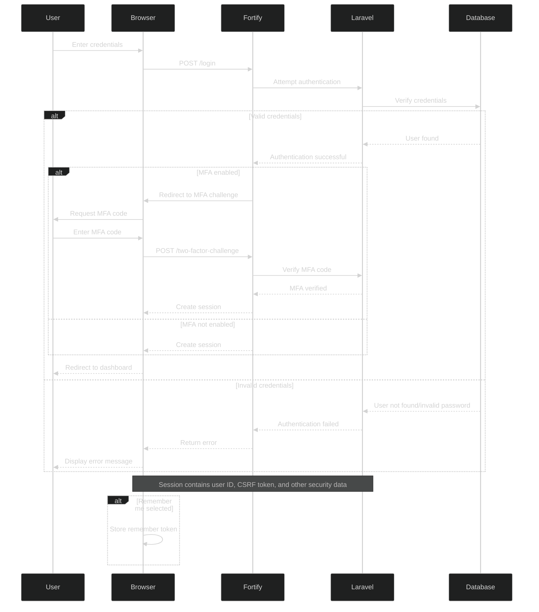

# Authentication Flow (Dark Mode)

```mermaid
%%{init: {'theme': 'dark', 'themeVariables': { 'primaryColor': '#2c3e50', 'primaryTextColor': '#ecf0f1', 'primaryBorderColor': '#7f8c8d', 'lineColor': '#ecf0f1', 'secondaryColor': '#34495e', 'tertiaryColor': '#282c34' }}}%%
sequenceDiagram
    participant User
    participant Browser
    participant Fortify
    participant Laravel
    participant Database
    
    User->>Browser: Enter credentials
    Browser->>Fortify: POST /login
    Fortify->>Laravel: Attempt authentication
    Laravel->>Database: Verify credentials
    
    alt Valid credentials
        Database-->>Laravel: User found
        Laravel-->>Fortify: Authentication successful
        
        alt MFA enabled
            Fortify->>Browser: Redirect to MFA challenge
            Browser->>User: Request MFA code
            User->>Browser: Enter MFA code
            Browser->>Fortify: POST /two-factor-challenge
            Fortify->>Laravel: Verify MFA code
            Laravel-->>Fortify: MFA verified
            Fortify-->>Browser: Create session
        else MFA not enabled
            Fortify-->>Browser: Create session
        end
        
        Browser-->>User: Redirect to dashboard
    else Invalid credentials
        Database-->>Laravel: User not found/invalid password
        Laravel-->>Fortify: Authentication failed
        Fortify-->>Browser: Return error
        Browser-->>User: Display error message
    end
    
    note over Browser,Laravel: Session contains user ID, CSRF token, and other security data
    
    alt Remember me selected
        Browser->>Browser: Store remember token
    end

```
