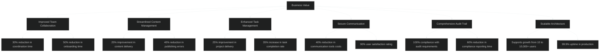

# Business Value (Dark Mode)

```mermaid
%%{init: {'theme': 'dark', 'themeVariables': { 'primaryColor': '#2c3e50', 'primaryTextColor': '#ecf0f1', 'primaryBorderColor': '#7f8c8d', 'lineColor': '#ecf0f1', 'secondaryColor': '#34495e', 'tertiaryColor': '#282c34' }}}%%
graph TD
    A[Business Value] --> B[Improved Team Collaboration]
    A --> C[Streamlined Content Management]
    A --> D[Enhanced Task Management]
    A --> E[Secure Communication]
    A --> F[Comprehensive Audit Trail]
    A --> G[Scalable Architecture]

    B --> B1[30% reduction in coordination time]
    B --> B2[50% reduction in onboarding time]
    
    C --> C1[25% improvement in content delivery]
    C --> C2[40% reduction in publishing errors]
    
    D --> D1[25% improvement in project delivery]
    D --> D2[35% increase in task completion rate]
    
    E --> E1[40% reduction in communication tools costs]
    E --> E2[90% user satisfaction rating]
    
    F --> F1[100% compliance with audit requirements]
    F --> F2[60% reduction in compliance reporting time]
    
    G --> G1[Supports growth from 10 to 10,000+ users]
    G --> G2[99.9% uptime in production]

```
