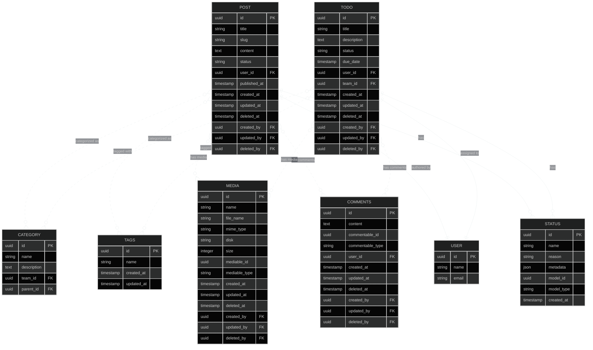

```mermaid
%%{init: {'theme': 'dark', 'themeVariables': { 'primaryColor': '#2c3e50', 'primaryTextColor': '#ecf0f1', 'primaryBorderColor': '#7f8c8d', 'lineColor': '#ecf0f1', 'secondaryColor': '#34495e', 'tertiaryColor': '#282c34' }}}%%
erDiagram
    POST }o..o{ CATEGORY : "categorized as"
    POST }o..o{ TAGS : "tagged with"
    POST }o..o{ MEDIA : "has media"
    POST }o..o{ COMMENTS : "has comments"
    POST ||--|| USER : "authored by"
    POST ||--o{ STATUS : "has"
    
    POST {
        uuid id PK
        string title
        string slug
        text content
        string status
        uuid user_id FK
        timestamp published_at
        timestamp created_at
        timestamp updated_at
        timestamp deleted_at
        uuid created_by FK
        uuid updated_by FK
        uuid deleted_by FK
    }
    
    TODO }o..o{ CATEGORY : "categorized as"
    TODO }o..o{ TAGS : "tagged with"
    TODO }o..o{ MEDIA : "has media"
    TODO }o..o{ COMMENTS : "has comments"
    TODO ||--|| USER : "assigned to"
    TODO ||--o{ STATUS : "has"
    
    TODO {
        uuid id PK
        string title
        text description
        string status
        timestamp due_date
        uuid user_id FK
        uuid team_id FK
        timestamp created_at
        timestamp updated_at
        timestamp deleted_at
        uuid created_by FK
        uuid updated_by FK
        uuid deleted_by FK
    }
    
    COMMENTS {
        uuid id PK
        text content
        uuid commentable_id
        string commentable_type
        uuid user_id FK
        timestamp created_at
        timestamp updated_at
        timestamp deleted_at
        uuid created_by FK
        uuid updated_by FK
        uuid deleted_by FK
    }
    
    MEDIA {
        uuid id PK
        string name
        string file_name
        string mime_type
        string disk
        integer size
        uuid mediable_id
        string mediable_type
        timestamp created_at
        timestamp updated_at
        timestamp deleted_at
        uuid created_by FK
        uuid updated_by FK
        uuid deleted_by FK
    }
    
    TAGS {
        uuid id PK
        string name
        timestamp created_at
        timestamp updated_at
    }
    
    CATEGORY {
        uuid id PK
        string name
        text description
        uuid team_id FK
        uuid parent_id FK
    }
    
    USER {
        uuid id PK
        string name
        string email
    }
    
    STATUS {
        uuid id PK
        string name
        string reason
        json metadata
        uuid model_id
        string model_type
        timestamp created_at
    }
```
