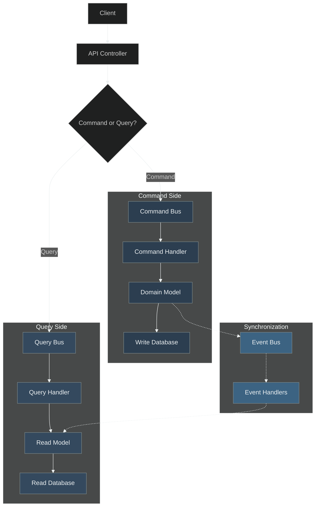

```mermaid
%%{init: {'theme': 'dark', 'themeVariables': { 'primaryColor': '#2c3e50', 'primaryTextColor': '#ecf0f1', 'primaryBorderColor': '#7f8c8d', 'lineColor': '#ecf0f1', 'secondaryColor': '#34495e', 'tertiaryColor': '#282c34' }}}%%
graph TD
    A[Client] --> B[API Controller]
    B --> C{Command or Query?}
    
    C -->|Command| D[Command Bus]
    C -->|Query| E[Query Bus]
    
    D --> F[Command Handler]
    E --> G[Query Handler]
    
    F --> H[Domain Model]
    H --> I[Write Database]
    
    G --> J[Read Model]
    J --> K[Read Database]
    
    H -.-> L[Event Bus]
    L -.-> M[Event Handlers]
    M -.-> J
    
    subgraph "Command Side"
    D
    F
    H
    I
    end
    
    subgraph "Query Side"
    E
    G
    J
    K
    end
    
    subgraph "Synchronization"
    L
    M
    end
    
    classDef commandSide fill:#2c3e50,stroke:#7f8c8d,color:#ecf0f1
    classDef querySide fill:#34495e,stroke:#7f8c8d,color:#ecf0f1
    classDef sync fill:#3c6382,stroke:#7f8c8d,color:#ecf0f1
    
    class D,F,H,I commandSide
    class E,G,J,K querySide
    class L,M sync
```
