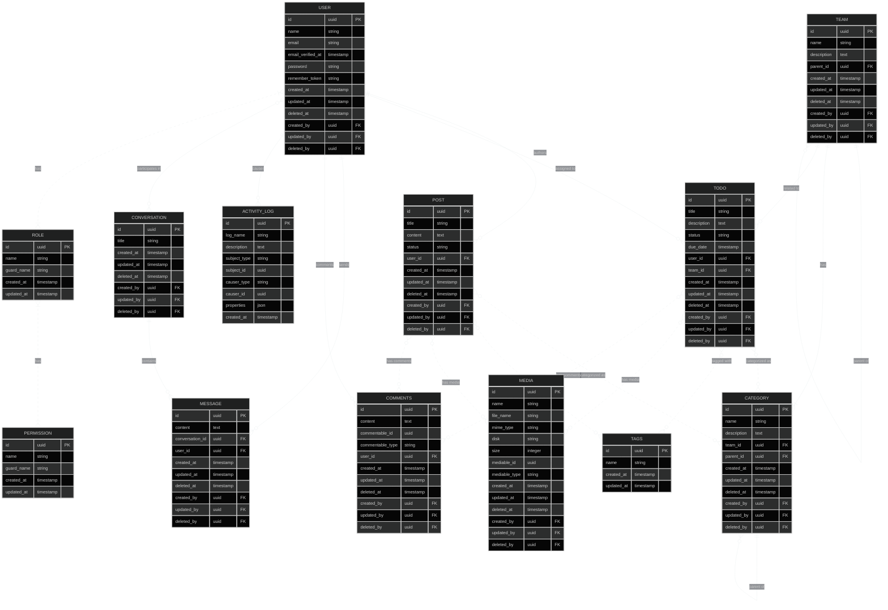

# Database Schema Implementation (Dark Mode)

```mermaid
%%{init: {'theme': 'dark', 'themeVariables': { 'primaryColor': '#2c3e50', 'primaryTextColor': '#ecf0f1', 'primaryBorderColor': '#7f8c8d', 'lineColor': '#ecf0f1', 'secondaryColor': '#34495e', 'tertiaryColor': '#282c34' }}}%%
erDiagram
    USER ||--o{ POST : "authors"
    USER ||--o{ TODO : "assigned to"
    USER ||--o{ MESSAGE : "sends"
    USER ||--o{ COMMENTS : "comments"
    USER ||--o{ ACTIVITY_LOG : "causer"
    USER }o--o{ CONVERSATION : "participates in"
    USER }|..|{ ROLE : "has"
    USER {
        id uuid PK
        name string
        email string
        email_verified_at timestamp
        password string
        remember_token string
        created_at timestamp
        updated_at timestamp
        deleted_at timestamp
        created_by uuid FK
        updated_by uuid FK
        deleted_by uuid FK
    }

    TEAM ||--o{ TEAM : "parent of"
    TEAM ||--|{ CATEGORY : "has"
    TEAM ||--o{ TODO : "related to"
    TEAM {
        id uuid PK
        name string
        description text
        parent_id uuid FK
        created_at timestamp
        updated_at timestamp
        deleted_at timestamp
        created_by uuid FK
        updated_by uuid FK
        deleted_by uuid FK
    }

    CATEGORY ||--o{ CATEGORY : "parent of"
    CATEGORY {
        id uuid PK
        name string
        description text
        team_id uuid FK
        parent_id uuid FK
        created_at timestamp
        updated_at timestamp
        deleted_at timestamp
        created_by uuid FK
        updated_by uuid FK
        deleted_by uuid FK
    }

    POST }o..o{ CATEGORY : "categorized as"
    POST }o..o{ TAGS : "tagged with"
    POST }o..o{ MEDIA : "has media"
    POST }o..o{ COMMENTS : "has comments"
    POST {
        id uuid PK
        title string
        content text
        status string
        user_id uuid FK
        created_at timestamp
        updated_at timestamp
        deleted_at timestamp
        created_by uuid FK
        updated_by uuid FK
        deleted_by uuid FK
    }

    TODO }o..o{ CATEGORY : "categorized as"
    TODO }o..o{ TAGS : "tagged with"
    TODO }o..o{ MEDIA : "has media"
    TODO }o..o{ COMMENTS : "has comments"
    TODO {
        id uuid PK
        title string
        description text
        status string
        due_date timestamp
        user_id uuid FK
        team_id uuid FK
        created_at timestamp
        updated_at timestamp
        deleted_at timestamp
        created_by uuid FK
        updated_by uuid FK
        deleted_by uuid FK
    }

    CONVERSATION ||--o{ MESSAGE : "contains"
    CONVERSATION {
        id uuid PK
        title string
        created_at timestamp
        updated_at timestamp
        deleted_at timestamp
        created_by uuid FK
        updated_by uuid FK
        deleted_by uuid FK
    }

    MESSAGE {
        id uuid PK
        content text
        conversation_id uuid FK
        user_id uuid FK
        created_at timestamp
        updated_at timestamp
        deleted_at timestamp
        created_by uuid FK
        updated_by uuid FK
        deleted_by uuid FK
    }

    COMMENTS {
        id uuid PK
        content text
        commentable_id uuid
        commentable_type string
        user_id uuid FK
        created_at timestamp
        updated_at timestamp
        deleted_at timestamp
        created_by uuid FK
        updated_by uuid FK
        deleted_by uuid FK
    }

    ROLE }|..|{ PERMISSION : "has"
    ROLE {
        id uuid PK
        name string
        guard_name string
        created_at timestamp
        updated_at timestamp
    }

    PERMISSION {
        id uuid PK
        name string
        guard_name string
        created_at timestamp
        updated_at timestamp
    }

    TAGS {
        id uuid PK
        name string
        created_at timestamp
        updated_at timestamp
    }

    MEDIA {
        id uuid PK
        name string
        file_name string
        mime_type string
        disk string
        size integer
        mediable_id uuid
        mediable_type string
        created_at timestamp
        updated_at timestamp
        deleted_at timestamp
        created_by uuid FK
        updated_by uuid FK
        deleted_by uuid FK
    }

    ACTIVITY_LOG {
        id uuid PK
        log_name string
        description text
        subject_type string
        subject_id uuid
        causer_type string
        causer_id uuid
        properties json
        created_at timestamp
    }
```
