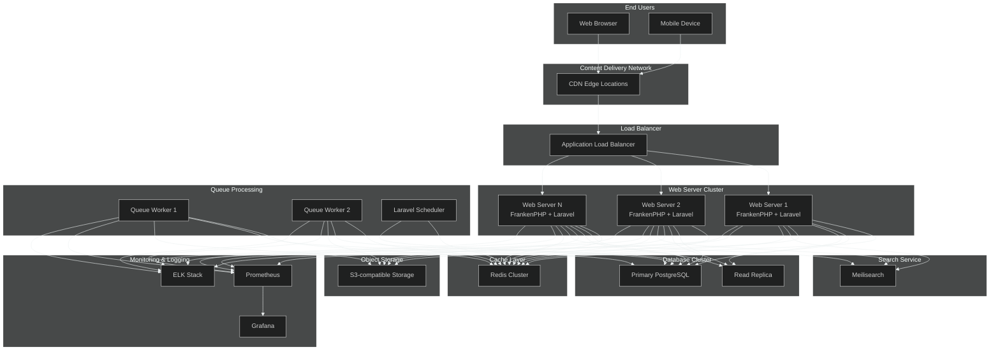

# Deployment Architecture (Dark Mode)

```mermaid
%%{init: {'theme': 'dark', 'themeVariables': { 'primaryColor': '#2c3e50', 'primaryTextColor': '#ecf0f1', 'primaryBorderColor': '#7f8c8d', 'lineColor': '#ecf0f1', 'secondaryColor': '#34495e', 'tertiaryColor': '#282c34' }}}%%
flowchart TB
    subgraph Users ["End Users"]
        Browser["Web Browser"]
        Mobile["Mobile Device"]
    end
    
    subgraph CDN ["Content Delivery Network"]
        CloudFront["CDN Edge Locations"]
    end
    
    subgraph LoadBalancer ["Load Balancer"]
        ALB["Application Load Balancer"]
    end
    
    subgraph WebServers ["Web Server Cluster"]
        WebServer1["Web Server 1<br>FrankenPHP + Laravel"]
        WebServer2["Web Server 2<br>FrankenPHP + Laravel"]
        WebServerN["Web Server N<br>FrankenPHP + Laravel"]
    end
    
    subgraph Queue ["Queue Processing"]
        QueueWorker1["Queue Worker 1"]
        QueueWorker2["Queue Worker 2"]
        Scheduler["Laravel Scheduler"]
    end
    
    subgraph Database ["Database Cluster"]
        PrimaryDB["Primary PostgreSQL"]
        ReplicaDB["Read Replica"]
    end
    
    subgraph Cache ["Cache Layer"]
        Redis["Redis Cluster"]
    end
    
    subgraph Storage ["Object Storage"]
        S3["S3-compatible Storage"]
    end
    
    subgraph Search ["Search Service"]
        Meilisearch["Meilisearch"]
    end
    
    subgraph Monitoring ["Monitoring & Logging"]
        Prometheus["Prometheus"]
        Grafana["Grafana"]
        ELK["ELK Stack"]
    end
    
    Browser --> CloudFront
    Mobile --> CloudFront
    CloudFront --> ALB
    
    ALB --> WebServer1
    ALB --> WebServer2
    ALB --> WebServerN
    
    WebServer1 --> Redis
    WebServer2 --> Redis
    WebServerN --> Redis
    
    WebServer1 --> PrimaryDB
    WebServer2 --> PrimaryDB
    WebServerN --> PrimaryDB
    
    WebServer1 --> ReplicaDB
    WebServer2 --> ReplicaDB
    WebServerN --> ReplicaDB
    
    WebServer1 --> S3
    WebServer2 --> S3
    WebServerN --> S3
    
    WebServer1 --> Meilisearch
    WebServer2 --> Meilisearch
    WebServerN --> Meilisearch
    
    WebServer1 --> Redis
    WebServer2 --> Redis
    WebServerN --> Redis
    
    QueueWorker1 --> Redis
    QueueWorker2 --> Redis
    Scheduler --> Redis
    
    QueueWorker1 --> PrimaryDB
    QueueWorker2 --> PrimaryDB
    Scheduler --> PrimaryDB
    
    QueueWorker1 --> S3
    QueueWorker2 --> S3
    
    WebServer1 --> Prometheus
    WebServer2 --> Prometheus
    WebServerN --> Prometheus
    QueueWorker1 --> Prometheus
    QueueWorker2 --> Prometheus
    
    Prometheus --> Grafana
    WebServer1 --> ELK
    WebServer2 --> ELK
    WebServerN --> ELK
    QueueWorker1 --> ELK
    QueueWorker2 --> ELK

```
