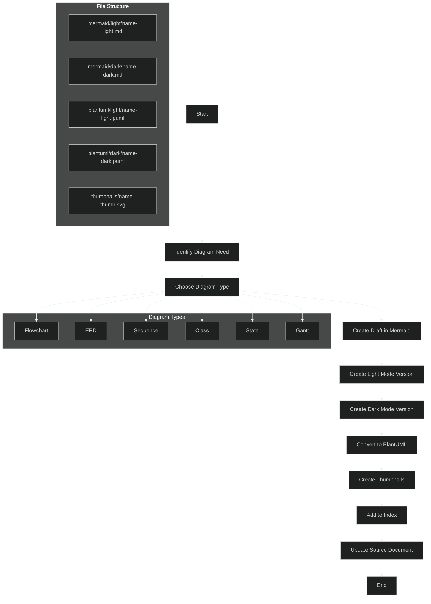

```mermaid
%%{init: {'theme': 'dark', 'themeVariables': { 'primaryColor': '#2c3e50', 'primaryTextColor': '#ecf0f1', 'primaryBorderColor': '#7f8c8d', 'lineColor': '#ecf0f1', 'secondaryColor': '#34495e', 'tertiaryColor': '#282c34' }}}%%
flowchart TD
    A[Start] --> B[Identify Diagram Need]
    B --> C[Choose Diagram Type]
    C --> D[Create Draft in Mermaid]
    D --> E[Create Light Mode Version]
    E --> F[Create Dark Mode Version]
    F --> G[Convert to PlantUML]
    G --> H[Create Thumbnails]
    H --> I[Add to Index]
    I --> J[Update Source Document]
    J --> K[End]
    
    subgraph "Diagram Types"
    C1[Flowchart]
    C2[ERD]
    C3[Sequence]
    C4[Class]
    C5[State]
    C6[Gantt]
    end
    
    C --> C1
    C --> C2
    C --> C3
    C --> C4
    C --> C5
    C --> C6
    
    subgraph "File Structure"
    F1[mermaid/light/name-light.md]
    F2[mermaid/dark/name-dark.md]
    F3[plantuml/light/name-light.puml]
    F4[plantuml/dark/name-dark.puml]
    F5[thumbnails/name-thumb.svg]
    end
```
