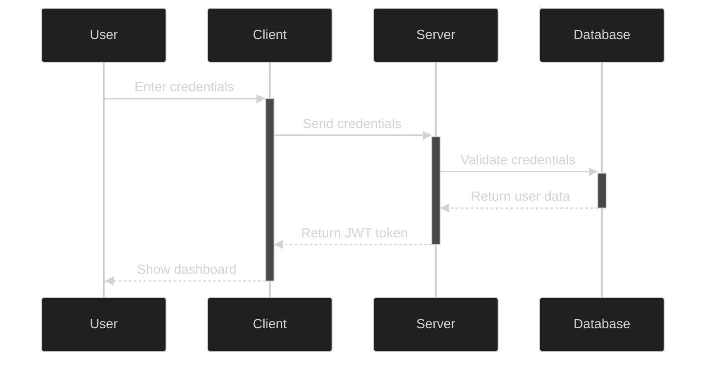

# Documentation Components (Dark Mode)

```mermaid
%%{init: {'theme': 'dark', 'themeVariables': { 'primaryColor': '#2c3e50', 'primaryTextColor': '#ecf0f1', 'primaryBorderColor': '#7f8c8d', 'lineColor': '#ecf0f1', 'secondaryColor': '#34495e', 'tertiaryColor': '#282c34' }}}%%
sequenceDiagram
    User->>+Client: Enter credentials
    Client->>+Server: Send credentials
    Server->>+Database: Validate credentials
    Database-->>-Server: Return user data
    Server-->>-Client: Return JWT token
    Client-->>-User: Show dashboard
```
