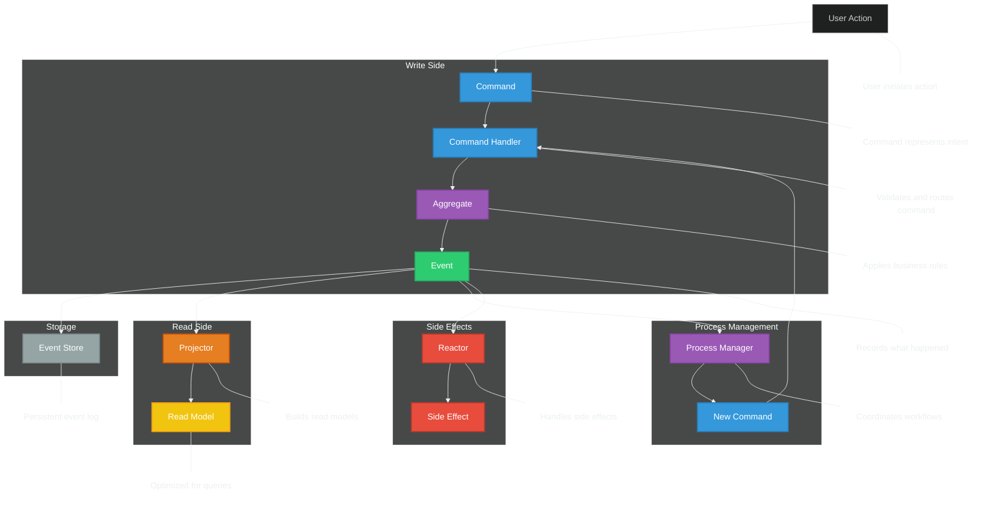

# Enhanced Event Sourcing Flow (Dark Mode)

```mermaid
%%{init: {'theme': 'dark', 'themeVariables': { 'primaryColor': '#2c3e50', 'primaryTextColor': '#ecf0f1', 'primaryBorderColor': '#7f8c8d', 'lineColor': '#ecf0f1', 'secondaryColor': '#34495e', 'tertiaryColor': '#282c34' }}}%%
graph TD
    %% Main components
    A[User Action] --> B[Command]
    B --> C[Command Handler]
    C --> D[Aggregate]
    D --> E[Event]
    E --> F[Event Store]
    E --> G[Projector]
    G --> H[Read Model]
    E --> I[Process Manager]
    I --> J[New Command]
    J --> C
    E --> K[Reactor]
    K --> L[Side Effect]
    
    %% Component styling
    style B fill:#3498DB,stroke:#2980B9,color:white,stroke-width:2px
    style C fill:#3498DB,stroke:#2980B9,color:white,stroke-width:2px
    style D fill:#9B59B6,stroke:#8E44AD,color:white,stroke-width:2px
    style E fill:#2ECC71,stroke:#27AE60,color:white,stroke-width:2px
    style F fill:#95A5A6,stroke:#7F8C8D,color:white,stroke-width:2px
    style G fill:#E67E22,stroke:#D35400,color:white,stroke-width:2px
    style H fill:#F1C40F,stroke:#F39C12,color:white,stroke-width:2px
    style I fill:#9B59B6,stroke:#8E44AD,color:white,stroke-width:2px
    style J fill:#3498DB,stroke:#2980B9,color:white,stroke-width:2px
    style K fill:#E74C3C,stroke:#C0392B,color:white,stroke-width:2px
    style L fill:#E74C3C,stroke:#C0392B,color:white,stroke-width:2px
    
    %% Subgraphs for logical grouping
    subgraph "Write Side"
        B
        C
        D
        E
    end
    
    subgraph "Storage"
        F
    end
    
    subgraph "Read Side"
        G
        H
    end
    
    subgraph "Process Management"
        I
        J
    end
    
    subgraph "Side Effects"
        K
        L
    end
    
    %% Annotations
    classDef annotation fill:none,stroke:none,color:#ecf0f1
    
    A1[User initiates action]:::annotation
    B1[Command represents intent]:::annotation
    C1[Validates and routes command]:::annotation
    D1[Applies business rules]:::annotation
    E1[Records what happened]:::annotation
    F1[Persistent event log]:::annotation
    G1[Builds read models]:::annotation
    H1[Optimized for queries]:::annotation
    I1[Coordinates workflows]:::annotation
    K1[Handles side effects]:::annotation
    
    A --- A1
    B --- B1
    C --- C1
    D --- D1
    E --- E1
    F --- F1
    G --- G1
    H --- H1
    I --- I1
    K --- K1
```
