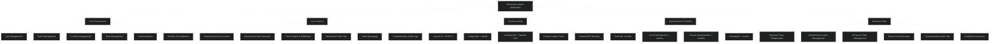

# Executive Summary Overview (Dark Mode)

```mermaid
%%{init: {'theme': 'dark', 'themeVariables': { 'primaryColor': '#2c3e50', 'primaryTextColor': '#ecf0f1', 'primaryBorderColor': '#7f8c8d', 'lineColor': '#ecf0f1', 'secondaryColor': '#34495e', 'tertiaryColor': '#282c34' }}}%%
flowchart TD
    A[Enhanced Laravel Application] --> B[Core Components]
    A --> C[Key Features]
    A --> D[Technical Stack]
    A --> E[Implementation Timeline]
    A --> F[Business Value]
    
    B --> B1[User Management]
    B --> B2[Team Management]
    B --> B3[Content Management]
    B --> B4[Task Management]
    B --> B5[Communication]
    B --> B6[Security & Compliance]
    
    C --> C1[Role-based Access Control]
    C --> C2[Hierarchical Team Structure]
    C --> C3[Post Creation & Publishing]
    C --> C4[Hierarchical Todo Lists]
    C --> C5[Team Messaging]
    C --> C6[Comprehensive Audit Logs]
    
    D --> D1[Laravel 12 + PHP 8.4]
    D --> D2[PostgreSQL + Redis]
    D --> D3[Livewire/Volt + Tailwind CSS]
    D --> D4[Filament Admin Panel]
    D --> D5[FrankenPHP Runtime]
    
    E --> E1[Planning: 1 month]
    E --> E2[Core Development: 2 months]
    E --> E3[Feature Development: 2 months]
    E --> E4[Finalization: 1 month]
    
    F --> F1[Improved Team Collaboration]
    F --> F2[Streamlined Content Management]
    F --> F3[Enhanced Task Management]
    F --> F4[Secure Communication]
    F --> F5[Comprehensive Audit Trail]
    F --> F6[Scalable Architecture]

```
