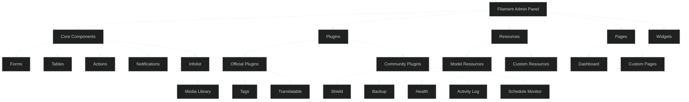

# Filament Admin Panel Architecture (Dark Mode)

```mermaid
%%{init: {'theme': 'dark', 'themeVariables': { 'primaryColor': '#2c3e50', 'primaryTextColor': '#ecf0f1', 'primaryBorderColor': '#7f8c8d', 'lineColor': '#ecf0f1', 'secondaryColor': '#34495e', 'tertiaryColor': '#282c34' }}}%%
graph TD
    A[Filament Admin Panel] --> B[Core Components]
    A --> C[Plugins]
    A --> D[Resources]
    A --> E[Pages]
    A --> F[Widgets]

    B --> B1[Forms]
    B --> B2[Tables]
    B --> B3[Actions]
    B --> B4[Notifications]
    B --> B5[Infolist]

    C --> C1[Official Plugins]
    C --> C2[Community Plugins]

    C1 --> C1A[Media Library]
    C1 --> C1B[Tags]
    C1 --> C1C[Translatable]

    C2 --> C2A[Shield]
    C2 --> C2B[Backup]
    C2 --> C2C[Health]
    C2 --> C2D[Activity Log]
    C2 --> C2E[Schedule Monitor]

    D --> D1[Model Resources]
    D --> D2[Custom Resources]

    E --> E1[Dashboard]
    E --> E2[Custom Pages]
```
