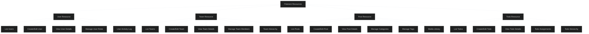

# Filament Resources (Dark Mode)

```mermaid
%%{init: {'theme': 'dark', 'themeVariables': { 'primaryColor': '#2c3e50', 'primaryTextColor': '#ecf0f1', 'primaryBorderColor': '#7f8c8d', 'lineColor': '#ecf0f1', 'secondaryColor': '#34495e', 'tertiaryColor': '#282c34' }}}%%
graph TD
    A[Filament Resources] --> B[User Resource]
    A --> C[Team Resource]
    A --> D[Post Resource]
    A --> E[Todo Resource]
    
    B --> B1[List Users]
    B --> B2[Create/Edit User]
    B --> B3[View User Details]
    B --> B4[Manage User Roles]
    B --> B5[User Activity Log]
    
    C --> C1[List Teams]
    C --> C2[Create/Edit Team]
    C --> C3[View Team Details]
    C --> C4[Manage Team Members]
    C --> C5[Team Hierarchy]
    
    D --> D1[List Posts]
    D --> D2[Create/Edit Post]
    D --> D3[View Post Details]
    D --> D4[Manage Categories]
    D --> D5[Manage Tags]
    D --> D6[Media Library]
    
    E --> E1[List Todos]
    E --> E2[Create/Edit Todo]
    E --> E3[View Todo Details]
    E --> E4[Todo Assignments]
    E --> E5[Todo Hierarchy]
```
