# Implementation Sequence Flowchart (Dark Mode)

**Type:** Flowchart
**Created:** 2025-05-17
**Updated:** 2025-05-17
**Author:** AI Assistant

## Description

This flowchart illustrates the complete implementation sequence for the Enhanced Laravel Application, showing all phases, their dependencies, and estimated completion percentages.

## Diagram Source

```mermaid
%%{init: {'theme': 'dark', 'themeVariables': { 'primaryColor': '#2c3e50', 'primaryTextColor': '#ecf0f1', 'primaryBorderColor': '#7f8c8d', 'lineColor': '#ecf0f1', 'secondaryColor': '#34495e', 'tertiaryColor': '#282c34' }}}%%
flowchart TD
    %% Phase 0: Development Environment & Laravel Setup
    subgraph Phase0["Phase 0: Development Environment & Laravel Setup (10%)"]
        A[Phase 0.1: Documentation Updates] --> B[Phase 0.2: Development Environment Setup]
        B --> C[Phase 0.3: Laravel Installation]
        C --> D[Phase 0.4: Package Installation]
        D --> E[Phase 0.5: Spatie Settings Setup]
        D --> F[Phase 0.6: CQRS Configuration]
        D --> G[Phase 0.7: Filament Configuration]
        D --> H[Phase 0.8: Frontend Setup]
        D --> I[Phase 0.9: Database Setup]
        E & F & G & H & I --> J[Phase 0.10: Sanctum Setup]
        J --> K[Phase 0.11: Phase 0 Summary]
    end

    %% Phase 1: Core Infrastructure
    subgraph Phase1["Phase 1: Core Infrastructure (15%)"]
        L[Phase 1.1: Database Schema Implementation] --> M[Phase 1.2: CQRS Pattern Implementation]
        M --> N[Phase 1.3: State Machine Implementation]
        N --> O[Phase 1.4: Hierarchical Data Structure]
        O --> P[Phase 1.5: Phase 1 Summary]
    end

    %% Phase 2: Authentication & Authorization
    subgraph Phase2["Phase 2: Authentication & Authorization (10%)"]
        Q[Phase 2.1: User Authentication] --> R[Phase 2.2: Multi-factor Authentication]
        R --> S[Phase 2.3: Role-based Access Control]
        S --> T[Phase 2.4: Team-based Permissions]
        T --> U[Phase 2.5: Phase 2 Summary]
    end

    %% Phase 3: Team & User Management
    subgraph Phase3["Phase 3: Team & User Management (10%)"]
        V[Phase 3.1: Team CRUD Operations] --> W[Phase 3.2: User CRUD Operations]
        W --> X[Phase 3.3: Team Hierarchy Implementation]
        X --> Y[Phase 3.4: User Status Tracking]
        Y --> Z[Phase 3.5: Phase 3 Summary]
    end

    %% Phase 4: Content Management
    subgraph Phase4["Phase 4: Content Management (15%)"]
        AA[Phase 4.1: Post CRUD Operations] --> AB[Phase 4.2: Category & Tag Management]
        AB --> AC[Phase 4.3: Media Management]
        AC --> AD[Phase 4.4: Content Versioning]
        AD --> AE[Phase 4.5: Phase 4 Summary]
    end

    %% Phase 5: Chat & Notifications
    subgraph Phase5["Phase 5: Chat & Notifications (10%)"]
        AF[Phase 5.1: Conversation Management] --> AG[Phase 5.2: Message CRUD Operations]
        AG --> AH[Phase 5.3: Real-time Updates]
        AH --> AI[Phase 5.4: Notification System]
        AI --> AJ[Phase 5.5: Phase 5 Summary]
    end

    %% Phase 6: Admin Portal
    subgraph Phase6["Phase 6: Admin Portal (10%)"]
        AK[Phase 6.1: Admin Dashboard] --> AL[Phase 6.2: User Management Interface]
        AL --> AM[Phase 6.3: Content Management Interface]
        AM --> AN[Phase 6.4: System Configuration Interface]
        AN --> AO[Phase 6.5: Phase 6 Summary]
    end

    %% Phase 7: Public API
    subgraph Phase7["Phase 7: Public API (5%)"]
        AP[Phase 7.1: API Authentication] --> AQ[Phase 7.2: API Resource Endpoints]
        AQ --> AR[Phase 7.3: API Documentation]
        AR --> AS[Phase 7.4: API Rate Limiting]
        AS --> AT[Phase 7.5: Phase 7 Summary]
    end

    %% Phase 8: Advanced Features
    subgraph Phase8["Phase 8: Advanced Features (5%)"]
        AU[Phase 8.1: Search Implementation] --> AV[Phase 8.2: Activity Logging]
        AV --> AW[Phase 8.3: Audit Trail]
        AW --> AX[Phase 8.4: Data Export/Import]
        AX --> AY[Phase 8.5: Phase 8 Summary]
    end

    %% Phase 9: Testing & Optimization
    subgraph Phase9["Phase 9: Testing & Optimization (5%)"]
        AZ[Phase 9.1: Unit Testing] --> BA[Phase 9.2: Feature Testing]
        BA --> BB[Phase 9.3: Performance Optimization]
        BB --> BC[Phase 9.4: Security Testing]
        BC --> BD[Phase 9.5: Phase 9 Summary]
    end

    %% Phase 10: Deployment
    subgraph Phase10["Phase 10: Deployment (5%)"]
        BE[Phase 10.1: Production Environment Setup] --> BF[Phase 10.2: CI/CD Pipeline]
        BF --> BG[Phase 10.3: Monitoring & Logging]
        BG --> BH[Phase 10.4: Backup & Recovery]
        BH --> BI[Phase 10.5: Phase 10 Summary]
    end

    %% Phase dependencies
    K --> L
    P --> Q
    U --> V
    Z --> AA
    AE --> AF
    AJ --> AK
    AO --> AP
    AT --> AU
    AY --> AZ
    BD --> BE
```

## Related Documents

- [Implementation Plan Overview](../../100-implementation-plan/100-000-implementation-plan-overview.md)
- [Project Roadmap](../../020-ela-project-roadmap.md)

## Version History

| Version | Date | Changes | Author |
|---------|------|---------|--------|
| 1.0.0 | 2025-05-17 | Initial version | AI Assistant |
