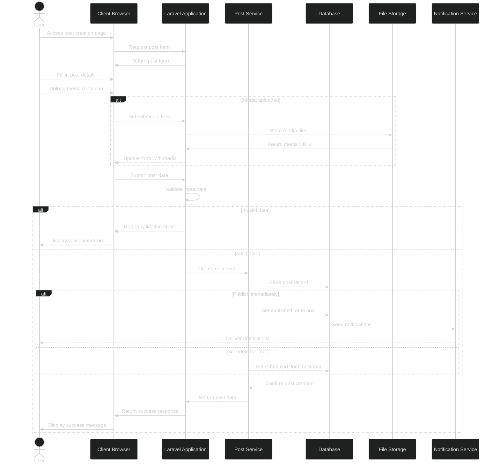

# Post Creation and Publishing (Dark Mode)

```mermaid
%%{init: {'theme': 'dark', 'themeVariables': { 'primaryColor': '#2c3e50', 'primaryTextColor': '#ecf0f1', 'primaryBorderColor': '#7f8c8d', 'lineColor': '#ecf0f1', 'secondaryColor': '#34495e', 'tertiaryColor': '#282c34' }}}%%
sequenceDiagram
    actor User
    participant Client as Client Browser
    participant App as Laravel Application
    participant PostService as Post Service
    participant DB as Database
    participant Storage as File Storage
    participant Notification as Notification Service

    User->>Client: Access post creation page
    Client->>App: Request post form
    App->>Client: Return post form
    User->>Client: Fill in post details
    User->>Client: Upload media (optional)

    alt Media uploaded
        Client->>App: Submit media files
        App->>Storage: Store media files
        Storage->>App: Return media URLs
        App->>Client: Update form with media
    end

    Client->>App: Submit post data
    App->>App: Validate input data

    alt Invalid data
        App->>Client: Return validation errors
        Client->>User: Display validation errors
    else Valid data
        App->>PostService: Create new post
        PostService->>DB: Store post record

        alt Publish immediately
            PostService->>DB: Set published_at to now
            PostService->>Notification: Send notifications
            Notification-->>User: Deliver notifications
        else Schedule for later
            PostService->>DB: Set scheduled_for timestamp
        end

        DB->>PostService: Confirm post creation
        PostService->>App: Return post data
        App->>Client: Return success response
        Client->>User: Display success message
    end
```
