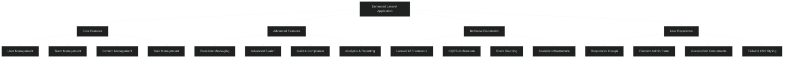

# Project Overview (Dark Mode)

```mermaid
%%{init: {'theme': 'dark', 'themeVariables': { 'primaryColor': '#2c3e50', 'primaryTextColor': '#ecf0f1', 'primaryBorderColor': '#7f8c8d', 'lineColor': '#ecf0f1', 'secondaryColor': '#34495e', 'tertiaryColor': '#282c34' }}}%%
graph TD
    A[Enhanced Laravel Application] --> B[Core Features]
    A --> C[Advanced Features]
    A --> D[Technical Foundation]
    A --> E[User Experience]
    
    B --> B1[User Management]
    B --> B2[Team Management]
    B --> B3[Content Management]
    B --> B4[Task Management]
    
    C --> C1[Real-time Messaging]
    C --> C2[Advanced Search]
    C --> C3[Audit & Compliance]
    C --> C4[Analytics & Reporting]
    
    D --> D1[Laravel 12 Framework]
    D --> D2[CQRS Architecture]
    D --> D3[Event Sourcing]
    D --> D4[Scalable Infrastructure]
    
    E --> E1[Responsive Design]
    E --> E2[Filament Admin Panel]
    E --> E3[Livewire/Volt Components]
    E --> E4[Tailwind CSS Styling]

```
