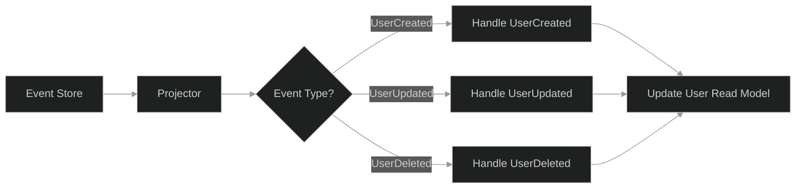

# Projector Flow (Dark Mode)

```mermaid
%%{init: {'theme': 'dark', 'themeVariables': { 'primaryColor': '#2a2a2a', 'primaryTextColor': '#ffffff', 'primaryBorderColor': '#555555', 'lineColor': '#999999', 'secondaryColor': '#252525', 'tertiaryColor': '#333333' }}}%%
flowchart LR
    A[Event Store] --> B[Projector]
    B --> C{Event Type?}
    C -->|UserCreated| D[Handle UserCreated]
    C -->|UserUpdated| E[Handle UserUpdated]
    C -->|UserDeleted| F[Handle UserDeleted]
    D --> G[Update User Read Model]
    E --> G
    F --> G
```
